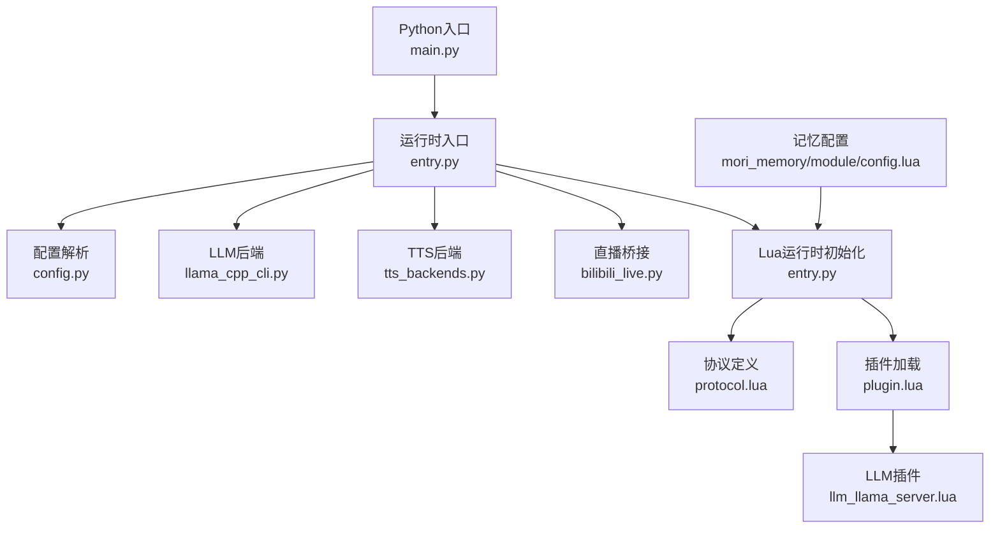
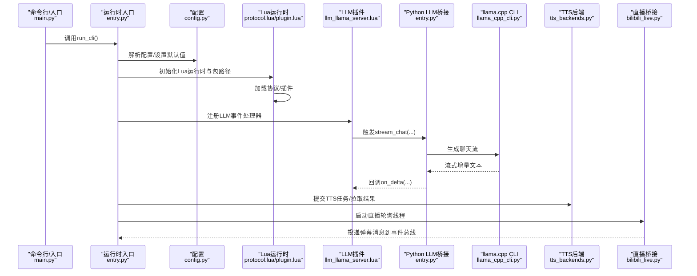
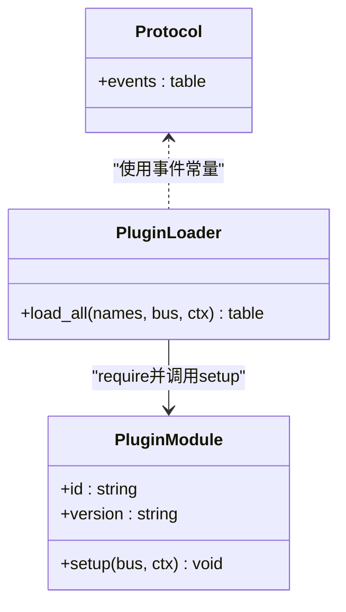
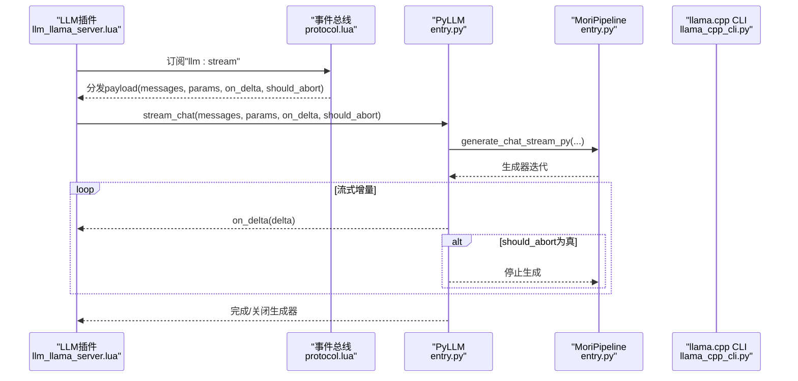
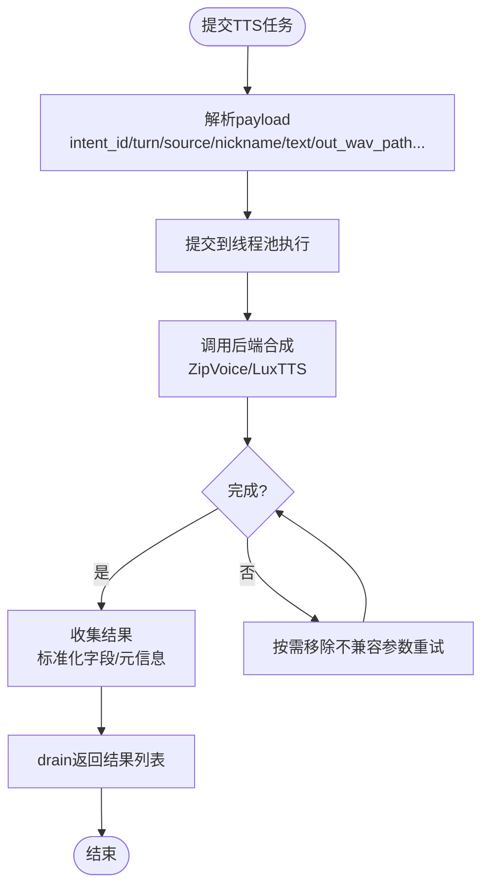
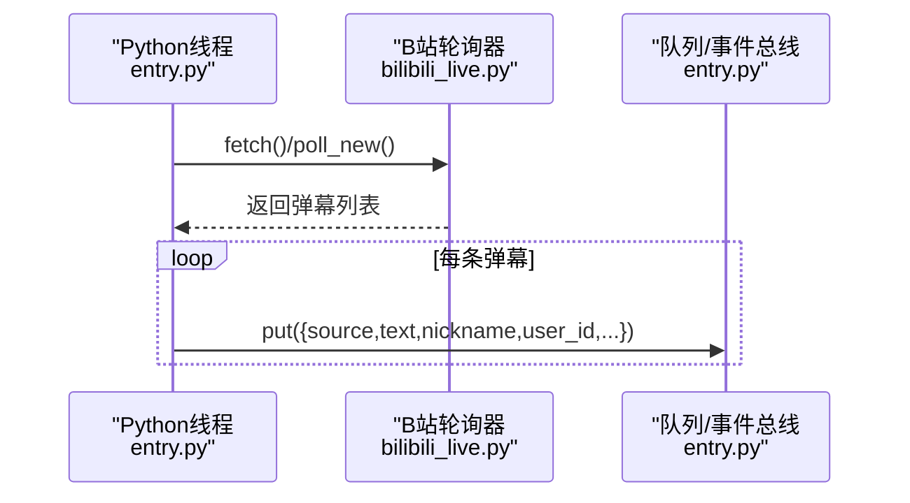
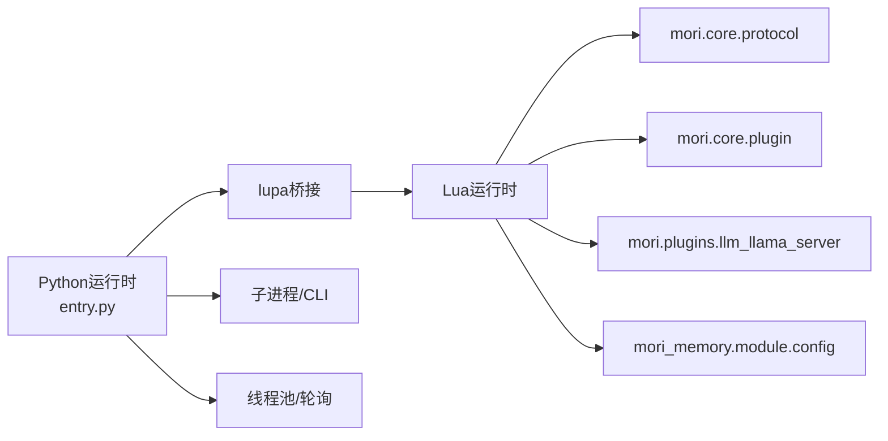

# API参考

<cite>
**本文引用的文件**
- [main.py](file://main.py)
- [entry.py](file://mori_runtime/entry.py)
- [config.py](file://mori_runtime/config.py)
- [llama_cpp_cli.py](file://mori_llm/llama_cpp_cli.py)
- [plugin.lua](file://mori_runtime/lua/mori/core/plugin.lua)
- [protocol.lua](file://mori_runtime/lua/mori/core/protocol.lua)
- [llm_llama_server.lua](file://mori_runtime/lua/mori/plugins/llm_llama_server.lua)
- [config.lua](file://mori_memory/module/config.lua)
- [bilibili_live.py](file://mori_live_stream/bilibili_live.py)
- [tts_backends.py](file://mori_runtime/tts_backends.py)
</cite>

## 目录
1. [简介](#简介)
2. [项目结构](#项目结构)
3. [核心组件](#核心组件)
4. [架构总览](#架构总览)
5. [详细组件分析](#详细组件分析)
6. [依赖分析](#依赖分析)
7. [性能考虑](#性能考虑)
8. [故障排查指南](#故障排查指南)
9. [结论](#结论)
10. [附录](#附录)

## 简介
本文件为Mori系统的API参考文档，覆盖以下方面：
- Python主程序入口与命令行接口
- 配置管理（统一JSON配置与命令行参数映射）
- Lua运行时与插件接口（事件总线、协议、插件加载机制）
- LLM与TTS后端（llama.cpp CLI、ZipVoice/LuxTTS）
- 直播输入桥接（B站弹幕轮询）
- 消息协议与数据格式（事件类型、字段定义、序列化方式）
- HTTP/WebSocket接口规范（基于现有实现的说明）
- 错误码与异常处理指南
- 使用示例与最佳实践

## 项目结构
Mori采用“Python主控 + Lua运行时 + 插件扩展”的分层架构：
- Python层负责进程生命周期、配置解析、LLM/TTS后端、直播输入桥接
- Lua层负责运行时调度、事件总线、插件加载与执行
- LLM与TTS通过Python侧封装调用外部CLI或子进程
- 直播输入通过Python侧轮询并投递到Lua事件总线

**图表来源**
- [main.py](file://main.py)
- [entry.py](file://mori_runtime/entry.py)
- [config.py](file://mori_runtime/config.py)
- [llama_cpp_cli.py](file://mori_llm/llama_cpp_cli.py)
- [tts_backends.py](file://mori_runtime/tts_backends.py)
- [bilibili_live.py](file://mori_live_stream/bilibili_live.py)
- [protocol.lua](file://mori_runtime/lua/mori/core/protocol.lua)
- [plugin.lua](file://mori_runtime/lua/mori/core/plugin.lua)
- [llm_llama_server.lua](file://mori_runtime/lua/mori/plugins/llm_llama_server.lua)
- [config.lua](file://mori_memory/module/config.lua)

**章节来源**
- [main.py](file://main.py)
- [entry.py](file://mori_runtime/entry.py)

## 核心组件
- Python主程序入口：启动运行时、加载配置、初始化Lua运行时与插件、启动输入线程与LLM/TTS后端
- 配置管理：支持统一JSON配置文件与命令行参数映射，自动解析相对路径与默认值
- Lua运行时：事件总线、协议常量、插件加载器
- LLM后端：llama.cpp CLI封装，支持聊天与嵌入生成
- TTS后端：ZipVoice子进程推理与LuxTTS封装
- 直播桥接：B站弹幕轮询与去重、消息投递到事件总线

**章节来源**
- [entry.py](file://mori_runtime/entry.py)
- [config.py](file://mori_runtime/config.py)
- [llama_cpp_cli.py](file://mori_llm/llama_cpp_cli.py)
- [tts_backends.py](file://mori_runtime/tts_backends.py)
- [bilibili_live.py](file://mori_live_stream/bilibili_live.py)

## 架构总览
下图展示Python与Lua之间的交互、事件流以及后端集成：

**图表来源**
- [main.py](file://main.py)
- [entry.py](file://mori_runtime/entry.py)
- [config.py](file://mori_runtime/config.py)
- [protocol.lua](file://mori_runtime/lua/mori/core/protocol.lua)
- [plugin.lua](file://mori_runtime/lua/mori/core/plugin.lua)
- [llm_llama_server.lua](file://mori_runtime/lua/mori/plugins/llm_llama_server.lua)
- [llama_cpp_cli.py](file://mori_llm/llama_cpp_cli.py)
- [tts_backends.py](file://mori_runtime/tts_backends.py)
- [bilibili_live.py](file://mori_live_stream/bilibili_live.py)

## 详细组件分析

### Python主程序入口与命令行接口
- 入口函数：从运行时入口导入并执行CLI流程
- 命令行参数：
  - 配置与工作目录：--config、--workdir
  - llama.cpp二进制位置：--llama-bin-dir
  - 模型选择：--chat-model、--embed-model
  - 推理参数：--ctx-size、--n-predict、--temp、--top-p、--system
  - TTS开关与后端：--tts、--tts-backend 及大量ZipVoice/LuxTTS相关参数
  - 输出目录：--audio-dir/--tts-out-dir（别名）
  - 中断策略：--interrupt-policy

注意：当前实现未暴露HTTP/WebSocket服务端点，若需对外提供REST/WS接口，可在运行时中扩展。

**章节来源**
- [main.py](file://main.py)
- [entry.py](file://mori_runtime/entry.py)

### 配置管理（统一JSON配置与命令行映射）
- 统一配置文件名称：mori.config.json
- 支持的配置段：
  - common：通用参数（工作目录、模型路径、推理参数等）
  - tts：TTS相关键映射（见下节）
  - cli/vtuber：运行模式特定参数
  - love2d/inochi：前端启动器配置
- 键映射规则：将JSON中的键映射到命令行参数，如 tts.enabled → --tts 等
- 相对路径解析：根据配置文件所在目录解析相对路径
- 默认值注入：在解析后设置到ArgumentParser的默认值

**章节来源**
- [config.py](file://mori_runtime/config.py)

### Lua运行时与事件总线
- 协议常量：定义事件类型（输入、上下文编排、记忆、语音意图、LLM流、TTS提交/拉取/取消/结果、输出等）
- 插件加载：按名称加载模块，校验setup函数签名，触发MODULE_ANNOUNCE/MODULE_READY/MODULE_ERROR事件
- 插件接口：每个插件需导出id/version/setup(bus, ctx)，setup中订阅事件并处理

**图表来源**
- [protocol.lua](file://mori_runtime/lua/mori/core/protocol.lua)
- [plugin.lua](file://mori_runtime/lua/mori/core/plugin.lua)

**章节来源**
- [protocol.lua](file://mori_runtime/lua/mori/core/protocol.lua)
- [plugin.lua](file://mori_runtime/lua/mori/core/plugin.lua)

### LLM插件与Python桥接
- 插件职责：订阅LLM流事件，转发到Python侧的PyLLM.stream_chat
- Python桥接：
  - PyLLM.stream_chat：调用MoriPipeline生成聊天流，逐块回调on_delta
  - 支持should_abort钩子，允许插件中断生成
  - 异常处理：回调失败时不阻塞，最终关闭生成器
- llama.cpp CLI：
  - LlamaCppChatRunner.generate：构造命令行参数，执行并返回完整文本
  - LlamaCppEmbeddingRunner.embed/embed_many：执行嵌入生成，解析JSON输出

**图表来源**
- [llm_llama_server.lua](file://mori_runtime/lua/mori/plugins/llm_llama_server.lua)
- [protocol.lua](file://mori_runtime/lua/mori/core/protocol.lua)
- [entry.py](file://mori_runtime/entry.py)
- [llama_cpp_cli.py](file://mori_llm/llama_cpp_cli.py)

**章节来源**
- [llm_llama_server.lua](file://mori_runtime/lua/mori/plugins/llm_llama_server.lua)
- [entry.py](file://mori_runtime/entry.py)
- [llama_cpp_cli.py](file://mori_llm/llama_cpp_cli.py)

### TTS后端（ZipVoice/LuxTTS）
- ZipVoice：
  - 子进程推理：通过Python子进程与ZipVoice仓库通信，发送请求并接收响应
  - 语言检测：启发式脚本规则 + Lingua语言检测（可配置）
  - 提示词池：支持TSV/CSV清单，按策略（intent_hash/round_robin/random）选择
  - 质量档位：realtime/balanced/hq，决定采样步数、guidance等默认值
  - 语音合成：支持移除长静音、多线程、vocoder配置
- LuxTTS：
  - 作为ZipVoice回退路径或独立后端，支持设备选择、线程数、采样步数、引导强度、速度等参数
- Python桥接：
  - PyTTS.submit：解析payload，提交异步任务，返回job_id
  - PyTTS.drain：收集已完成任务，返回标准化结果（含wav路径、元信息、耗时等）
  - PyTTS.cancel_intent：按intent_id取消未完成任务
  - 异常处理：捕获子进程异常，标记错误并清理

**图表来源**
- [tts_backends.py](file://mori_runtime/tts_backends.py)
- [entry.py](file://mori_runtime/entry.py)

**章节来源**
- [tts_backends.py](file://mori_runtime/tts_backends.py)
- [entry.py](file://mori_runtime/entry.py)

### 直播输入桥接（B站弹幕）
- BilibiliLivePoller：基于HTTP轮询API获取弹幕，去重、解包、转换为Python对象
- Python侧线程：将弹幕投递到队列，Lua侧事件总线接收
- 关键字段：昵称、文本、时间轴、时间戳、原始数据
- 可选抓取历史（catchup）、离线退出、定时检查直播状态

**图表来源**
- [bilibili_live.py](file://mori_live_stream/bilibili_live.py)
- [entry.py](file://mori_runtime/entry.py)

**章节来源**
- [bilibili_live.py](file://mori_live_stream/bilibili_live.py)
- [entry.py](file://mori_runtime/entry.py)

### 消息协议与数据格式
- 事件类型（协议常量）：
  - 输入类：INPUT_TEXT
  - 上下文类：CONTEXT_COMPOSE
  - 记忆类：MEMORY_COMPILE_CONTEXT、MEMORY_INGEST_TURN、MEMORY_SHUTDOWN
  - 语音意图：SPEECH_INTENT_START、SPEECH_INTENT_CANCEL、SPEECH_INTENT_END
  - LLM流：LLM_STREAM
  - TTS：TTS_SUBMIT、TTS_DRAIN、TTS_CANCEL_INTENT、TTS_RESULT
  - 输出：OUTPUT_SUBTITLE、OUTPUT_EVENT、OUTPUT_PRINT
- 字段定义（示例）：
  - 输入消息：source、text、nickname、user_id、room_id、timeline、priority、enqueued_at
  - LLM流请求：messages、params、on_delta、should_abort
  - TTS提交：intent_id、turn、source、nickname、segment_idx、text、out_wav_path、prompt_wav_path、prompt_duration、prompt_rms、num_steps、guidance_scale、t_shift、speed、return_smooth、tts_lang/lang、prompt_key等
  - TTS结果：job_id、intent_id、turn、source、nickname、segment_idx、text、wav_path、ok、error、created_at、finished_at、tts_latency_ms、附加元信息
- 序列化方式：
  - Python侧通过lupa桥接Lua表，字典/列表递归转换为Lua table
  - TTS子进程通过标准输入输出JSON消息

**章节来源**
- [protocol.lua](file://mori_runtime/lua/mori/core/protocol.lua)
- [entry.py](file://mori_runtime/entry.py)
- [tts_backends.py](file://mori_runtime/tts_backends.py)

### HTTP接口规范
- 当前实现未内置HTTP服务器或WebSocket服务端点
- 若需对外提供REST/WS接口，建议在运行时中扩展：
  - REST：基于事件总线路由到LLM/TTS/记忆模块
  - WebSocket：保持长连接，推送TTS结果、输出事件、内存状态等
- 本节为概念性说明，不对应具体源码

[本节不涉及具体文件分析]

### Lua模块API文档
- 运行时模块：
  - mori.core.protocol：事件常量
  - mori.core.plugin：插件加载器
  - mori.plugins.llm_llama_server：LLM插件（订阅LLM_STREAM，调用ctx.py_llm.stream_chat）
- 记忆模块配置：
  - mori_memory.module.config：内存策略、主题图、精确匹配、去重、GC控制、两轴控制器等参数
  - 支持策略配置文件应用、路径解析、绝对/相对路径拼接

**章节来源**
- [protocol.lua](file://mori_runtime/lua/mori/core/protocol.lua)
- [plugin.lua](file://mori_runtime/lua/mori/core/plugin.lua)
- [llm_llama_server.lua](file://mori_runtime/lua/mori/plugins/llm_llama_server.lua)
- [config.lua](file://mori_memory/module/config.lua)

## 依赖分析
- Python侧依赖：
  - lupa：LuaJIT桥接（运行时加载Lua模块）
  - 子进程：ZipVoice推理、llama.cpp CLI
  - 多线程：直播轮询、TTS线程池
- Lua侧依赖：
  - 通过package.path动态追加模块搜索路径，加载mori_runtime、mori_memory、mori_live_stream下的模块
- 耦合与内聚：
  - 事件总线解耦插件与运行时
  - Python桥接层集中处理外部CLI/子进程，降低Lua侧复杂度
  - 配置解析与默认值注入集中在config.py，CLI与JSON配置解耦

**图表来源**
- [entry.py](file://mori_runtime/entry.py)
- [protocol.lua](file://mori_runtime/lua/mori/core/protocol.lua)
- [plugin.lua](file://mori_runtime/lua/mori/core/plugin.lua)
- [llm_llama_server.lua](file://mori_runtime/lua/mori/plugins/llm_llama_server.lua)
- [config.lua](file://mori_memory/module/config.lua)

**章节来源**
- [entry.py](file://mori_runtime/entry.py)

## 性能考虑
- 流式生成：LLM与TTS均采用流式/异步方式，减少等待时间
- 线程与并发：TTS使用线程池，直播轮询为守护线程，避免阻塞主循环
- 缓存与去重：直播轮询内置去重窗口，避免重复消息
- 路径解析：统一解析配置中的相对路径，减少IO开销
- 语言检测与路由：ZipVoice支持多种检测策略，可按需调整最小置信度与策略

[本节为一般性指导，不涉及具体文件分析]

## 故障排查指南
- 缺少依赖：
  - lupa未安装：运行时会抛出缺失模块异常，提示安装requirements.txt
- llama.cpp定位失败：
  - 未设置LLAMA_CPP_BIN_DIR/LLAMA_CPP_DIR且无法找到构建目录或llama-cli：抛出找不到二进制异常
- TTS子进程异常：
  - ZipVoice worker意外退出或非对象响应：抛出运行时错误
- 配置路径问题：
  - 配置文件不存在或根不是对象：抛出文件未找到或值错误
- 插件加载失败：
  - require失败或插件setup未返回函数：触发MODULE_ERROR事件，记录错误原因

**章节来源**
- [entry.py](file://mori_runtime/entry.py)
- [llama_cpp_cli.py](file://mori_llm/llama_cpp_cli.py)
- [tts_backends.py](file://mori_runtime/tts_backends.py)
- [config.py](file://mori_runtime/config.py)
- [plugin.lua](file://mori_runtime/lua/mori/core/plugin.lua)

## 结论
Mori通过清晰的分层设计与事件驱动架构，实现了Python与Lua的高效协作。配置系统支持统一JSON与命令行参数，便于在不同部署场景灵活切换。LLM与TTS后端通过CLI/子进程抽象，既保证了易用性也保留了扩展空间。直播输入桥接提供了稳定的实时消息通道。当前未内置HTTP/WebSocket服务端点，但事件总线与模块化插件体系为后续扩展提供了良好基础。

[本节为总结性内容，不涉及具体文件分析]

## 附录

### 配置参数参考（命令行与JSON键映射）
- 通用参数（common）
  - workdir → --workdir
  - llama_bin_dir → --llama-bin-dir
  - chat_model → --chat-model
  - embed_model → --embed-model
  - ctx_size → --ctx-size
  - n_predict → --n-predict
  - temp → --temp
  - top_p → --top-p
  - system → --system
- CLI/Vtuber专用（cli/vtuber）
  - audio_dir → --audio-dir
  - interrupt_policy → --interrupt-policy
- TTS键映射（tts.* → 对应--tts-*）
  - enabled → --tts
  - backend → --tts-backend
  - model → --tts-model
  - device → --tts-device
  - threads → --tts-threads
  - prompt_wav → --tts-prompt-wav
  - prompt_duration → --tts-prompt-duration
  - prompt_rms → --tts-prompt-rms
  - num_steps → --tts-num-steps
  - guidance_scale → --tts-guidance-scale
  - t_shift → --tts-t-shift
  - speed → --tts-speed
  - return_smooth → --tts-return-smooth
  - zipvoice_python_bin → --tts-zipvoice-python-bin
  - zipvoice_repo → --tts-zipvoice-repo
  - zipvoice_model_type → --tts-zipvoice-model-type
  - zipvoice_model_dir → --tts-zipvoice-model-dir
  - zipvoice_checkpoint_name → --tts-zipvoice-checkpoint-name
  - zipvoice_zh_tokenizer → --tts-zipvoice-zh-tokenizer
  - zipvoice_zh_lang → --tts-zipvoice-zh-lang
  - zipvoice_zh_prompt_text → --tts-zipvoice-zh-prompt-text
  - zipvoice_zh_prompt_wav → --tts-zipvoice-zh-prompt-wav
  - zipvoice_ja_tokenizer → --tts-zipvoice-ja-tokenizer
  - zipvoice_ja_lang → --tts-zipvoice-ja-lang
  - zipvoice_ja_prompt_text → --tts-zipvoice-ja-prompt-text
  - zipvoice_ja_prompt_wav → --tts-zipvoice-ja-prompt-wav
  - zipvoice_remove_long_sil → --tts-zipvoice-remove-long-sil
  - zipvoice_num_thread → --tts-zipvoice-num-thread
  - zipvoice_lang_detector → --tts-zipvoice-lang-detector
  - zipvoice_lang_min_conf → --tts-zipvoice-lang-min-conf
  - zipvoice_prompt_manifest → --tts-zipvoice-prompt-manifest
  - zipvoice_prompt_policy → --tts-zipvoice-prompt-policy
  - zipvoice_quality_profile → --tts-zipvoice-quality-profile
  - zipvoice_num_steps → --tts-zipvoice-num-steps
  - zipvoice_guidance_scale → --tts-zipvoice-guidance-scale
  - zipvoice_t_shift → --tts-zipvoice-t-shift
  - zipvoice_speed → --tts-zipvoice-speed
  - zipvoice_return_smooth → --tts-zipvoice-return-smooth
  - zipvoice_vocoder_profile → --tts-zipvoice-vocoder-profile
  - zipvoice_vocoder_model → --tts-zipvoice-vocoder-model

**章节来源**
- [config.py](file://mori_runtime/config.py)

### 错误代码与异常处理
- LlamaCppCliError：llama.cpp CLI执行失败时抛出
- BilibiliLiveError：直播轮询器内部错误
- 运行时模块缺失：lupa未安装时抛出模块未找到异常
- ZipVoice子进程异常：worker非预期退出或非对象响应
- 配置错误：路径解析失败、配置文件格式错误、未知键映射

**章节来源**
- [llama_cpp_cli.py](file://mori_llm/llama_cpp_cli.py)
- [bilibili_live.py](file://mori_live_stream/bilibili_live.py)
- [entry.py](file://mori_runtime/entry.py)
- [tts_backends.py](file://mori_runtime/tts_backends.py)

### API使用示例与最佳实践
- 启动运行时（带配置与TTS）：
  - 使用--config指定mori.config.json，或放置于工作目录/仓库根目录
  - 启用--tts并选择--tts-backend（lux/zipvoice），按需配置提示音、采样参数
- 订阅事件与处理：
  - 在Lua插件中订阅protocol.events.INPUT_TEXT、MEMORY_*、TTS_RESULT等事件
  - 将输入消息转换为LLM messages格式，调用LLM_STREAM事件发起流式生成
- 直播接入：
  - 设置B站房间ID与轮询间隔，启用catchup抓取历史
  - 根据interrupt_policy决定是否打断当前生成
- TTS最佳实践：
  - 使用prompt_manifest管理提示词池，选择合适的prompt_policy
  - ZipVoice按质量档位设置num_steps/guidance等，默认值由profile决定
  - 使用drain定期拉取结果，cancel_intent及时取消无效意图

[本节为一般性指导，不涉及具体文件分析]