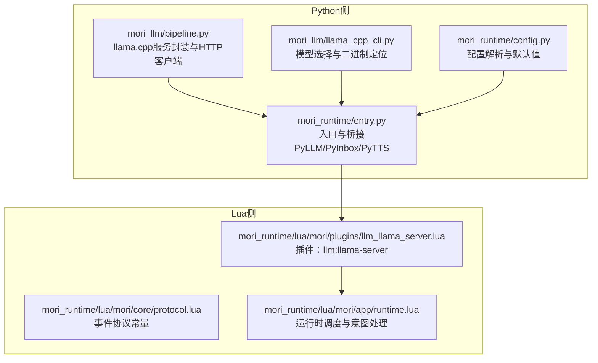
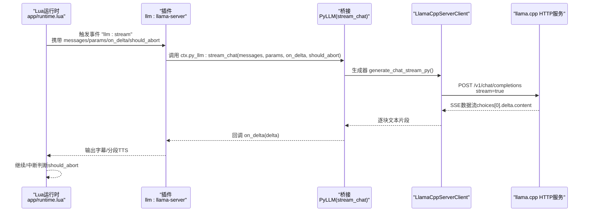
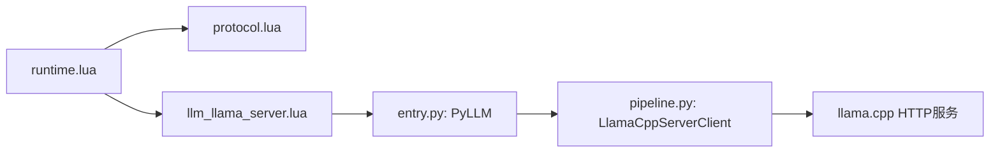

# HTTP接口

<cite>
**本文引用的文件**
- [mori_runtime/lua/mori/plugins/llm_llama_server.lua](file://mori_runtime/lua/mori/plugins/llm_llama_server.lua)
- [mori_runtime/lua/mori/app/runtime.lua](file://mori_runtime/lua/mori/app/runtime.lua)
- [mori_runtime/lua/mori/core/protocol.lua](file://mori_runtime/lua/mori/core/protocol.lua)
- [mori_llm/pipeline.py](file://mori_llm/pipeline.py)
- [mori_llm/llama_cpp_cli.py](file://mori_llm/llama_cpp_cli.py)
- [mori_runtime/entry.py](file://mori_runtime/entry.py)
- [mori_runtime/config.py](file://mori_runtime/config.py)
</cite>

## 目录
1. [简介](#简介)
2. [项目结构](#项目结构)
3. [核心组件](#核心组件)
4. [架构总览](#架构总览)
5. [详细组件分析](#详细组件分析)
6. [依赖关系分析](#依赖关系分析)
7. [性能考量](#性能考量)
8. [故障排查指南](#故障排查指南)
9. [结论](#结论)
10. [附录](#附录)

## 简介
本文件面向Mori系统中基于llama.cpp的HTTP接口，聚焦于其OpenAI兼容的REST API（聊天补全与嵌入），以及内部插件层如何将Lua侧的流式事件桥接到Python侧的llama.cpp服务。文档覆盖以下要点：
- REST API端点与请求/响应格式（OpenAI风格）
- 流式响应（SSE）与停止条件
- 认证与安全（Bearer Token）
- 错误处理与HTTP状态码
- WebSocket接口规范（如存在）
- 客户端实现示例与性能优化建议
- 调试工具与监控方法

## 项目结构
围绕HTTP接口的关键代码分布在如下模块：
- Python侧：llama.cpp服务封装与HTTP客户端
- Lua侧：运行时调度、协议事件与插件桥接
- 配置与入口：参数解析、默认值与启动流程

图表来源
- [mori_llm/pipeline.py:56-354](file://mori_llm/pipeline.py#L56-L354)
- [mori_llm/llama_cpp_cli.py:26-80](file://mori_llm/llama_cpp_cli.py#L26-L80)
- [mori_runtime/entry.py:146-188](file://mori_runtime/entry.py#L146-L188)
- [mori_runtime/config.py:188-270](file://mori_runtime/config.py#L188-L270)
- [mori_runtime/lua/mori/core/protocol.lua:1-35](file://mori_runtime/lua/mori/core/protocol.lua#L1-L35)
- [mori_runtime/lua/mori/plugins/llm_llama_server.lua:1-25](file://mori_runtime/lua/mori/plugins/llm_llama_server.lua#L1-L25)
- [mori_runtime/lua/mori/app/runtime.lua:543-668](file://mori_runtime/lua/mori/app/runtime.lua#L543-L668)

章节来源
- [mori_llm/pipeline.py:56-354](file://mori_llm/pipeline.py#L56-L354)
- [mori_runtime/lua/mori/plugins/llm_llama_server.lua:1-25](file://mori_runtime/lua/mori/plugins/llm_llama_server.lua#L1-L25)
- [mori_runtime/lua/mori/app/runtime.lua:543-668](file://mori_runtime/lua/mori/app/runtime.lua#L543-L668)
- [mori_runtime/lua/mori/core/protocol.lua:1-35](file://mori_runtime/lua/mori/core/protocol.lua#L1-L35)
- [mori_runtime/entry.py:146-188](file://mori_runtime/entry.py#L146-L188)
- [mori_runtime/config.py:188-270](file://mori_runtime/config.py#L188-L270)

## 核心组件
- LlamaCppServerClient：封装llama.cpp的HTTP服务，提供同步与流式聊天补全、嵌入接口，并负责健康检查与错误处理。
- MoriPipeline：统一管理大模型与嵌入模型的服务实例，提供Python侧的生成与嵌入调用入口。
- PyLLM：Lua桥接到Python侧的流式聊天接口，将Lua回调映射到Python生成器。
- 插件 llm:llama-server：Lua侧订阅“llm:stream”事件，转发给ctx.py_llm进行流式生成。
- 运行时 runtime：负责意图编排、上下文合成、TTS分段提交与输出事件广播。

章节来源
- [mori_llm/pipeline.py:56-354](file://mori_llm/pipeline.py#L56-L354)
- [mori_runtime/lua/mori/plugins/llm_llama_server.lua:8-21](file://mori_runtime/lua/mori/plugins/llm_llama_server.lua#L8-L21)
- [mori_runtime/lua/mori/app/runtime.lua:448-479](file://mori_runtime/lua/mori/app/runtime.lua#L448-L479)

## 架构总览
下图展示从Lua运行时到Python侧llama.cpp服务的完整链路，以及关键事件与HTTP端点：

图表来源
- [mori_runtime/lua/mori/app/runtime.lua:448-479](file://mori_runtime/lua/mori/app/runtime.lua#L448-L479)
- [mori_runtime/lua/mori/plugins/llm_llama_server.lua:13-20](file://mori_runtime/lua/mori/plugins/llm_llama_server.lua#L13-L20)
- [mori_runtime/entry.py:146-188](file://mori_runtime/entry.py#L146-L188)
- [mori_llm/pipeline.py:228-290](file://mori_llm/pipeline.py#L228-L290)

## 详细组件分析

### REST API：聊天补全（/v1/chat/completions）
- 方法与路径
  - POST /v1/chat/completions
- 请求体字段
  - model: 字符串，模型名称（用于标识）
  - messages: 数组，OpenAI风格消息列表（role/content）
  - max_tokens: 整数，最大生成长度
  - temperature: 浮点数，采样温度
  - top_p: 可选浮点数，核采样概率质量
  - stop: 可选字符串数组，停止序列
  - seed: 可选整数，随机种子
  - stream: 布尔，是否启用流式返回
- 响应
  - 同步：JSON对象，包含choices[0].message.content或choices[0].content（文本）
  - 流式：SSE，逐行"data: ..."，以"[DONE]"结束；每行包含choices[0].delta.content或choices[0].text
- 认证
  - 若配置了api_key，则在请求头添加Authorization: Bearer <token>
- 错误处理
  - HTTP 4xx/5xx由客户端抛出异常；成功响应需校验JSON结构与字段存在性

章节来源
- [mori_llm/pipeline.py:204-227](file://mori_llm/pipeline.py#L204-L227)
- [mori_llm/pipeline.py:228-290](file://mori_llm/pipeline.py#L228-L290)
- [mori_llm/pipeline.py:175-203](file://mori_llm/pipeline.py#L175-L203)

### REST API：嵌入（/v1/embeddings）
- 方法与路径
  - POST /v1/embeddings
- 请求体字段
  - model: 字符串，模型名称
  - input: 字符串或字符串数组
  - encoding_format: 字符串，固定为"float"
- 响应
  - JSON对象，包含data数组，每个元素含embedding向量
- 认证
  - 同上

章节来源
- [mori_llm/pipeline.py:292-294](file://mori_llm/pipeline.py#L292-L294)

### 健康检查（/health）
- 方法与路径
  - GET /health
- 响应
  - 成功：HTTP 200；失败：非200或超时
- 用途
  - 启动等待与存活探测

章节来源
- [mori_llm/pipeline.py:159-173](file://mori_llm/pipeline.py#L159-L173)

### 流式生成（SSE）细节
- 流式端点
  - POST /v1/chat/completions（stream=true）
- 数据格式
  - 每行以"data:"开头，去除前缀后为JSON片段
  - choices[0].delta.content为增量文本；若无则回退到choices[0].text
  - 以"[DONE]"结束
- 中断机制
  - Lua侧通过should_abort回调控制生成器关闭
  - Python侧在每次on_delta后检查should_abort

章节来源
- [mori_llm/pipeline.py:228-290](file://mori_llm/pipeline.py#L228-L290)
- [mori_runtime/lua/mori/app/runtime.lua:363-373](file://mori_runtime/lua/mori/app/runtime.lua#L363-L373)
- [mori_runtime/entry.py:146-188](file://mori_runtime/entry.py#L146-L188)

### WebSocket接口规范
- 当前仓库未发现WebSocket端点或实现
- 如需实时双向通信，可考虑在上游llama.cpp或自定义代理层扩展

[本节为概念性说明，不直接分析具体文件]

### 认证与安全
- 认证方式
  - Bearer Token：Authorization: Bearer <api_key>
- 安全建议
  - 仅在本地回环地址绑定（默认127.0.0.1）
  - 使用强密钥并限制访问源
  - 在反向代理层启用TLS终止与速率限制

章节来源
- [mori_llm/pipeline.py:129-131](file://mori_llm/pipeline.py#L129-L131)
- [mori_llm/pipeline.py:181-182](file://mori_llm/pipeline.py#L181-L182)

### HTTP状态码对照
- 200 OK：请求成功
- 400 Bad Request：请求体无效或参数缺失
- 401 Unauthorized：缺少或错误的认证信息
- 403 Forbidden：权限不足
- 404 Not Found：端点不存在
- 429 Too Many Requests：超出配额或限速
- 500 Internal Server Error：服务器内部错误
- 502/503 Bad Gateway/Service Unavailable：上游服务不可用
- 504 Gateway Timeout：上游请求超时

章节来源
- [mori_llm/pipeline.py:194-202](file://mori_llm/pipeline.py#L194-L202)

### 错误处理策略
- Python侧
  - 对非2xx响应抛出LlamaServerError
  - JSON解析失败时抛出异常并截断日志
  - 启动阶段通过/health轮询检测超时
- Lua侧
  - 事件协议提供BUS_ERROR事件上报
  - 插件层捕获异常并回传错误信息

章节来源
- [mori_llm/pipeline.py:194-202](file://mori_llm/pipeline.py#L194-L202)
- [mori_llm/pipeline.py:159-173](file://mori_llm/pipeline.py#L159-L173)
- [mori_runtime/lua/mori/core/protocol.lua:4-5](file://mori_runtime/lua/mori/core/protocol.lua#L4-L5)

### 请求参数与响应结构
- 聊天补全
  - 请求：model/messages/max_tokens/temperature/top_p/stop/seed/stream
  - 响应：choices[0].message.content 或 choices[0].delta.content（流式）
- 嵌入
  - 请求：model/input/encoding_format
  - 响应：data[].embedding

章节来源
- [mori_llm/pipeline.py:204-227](file://mori_llm/pipeline.py#L204-L227)
- [mori_llm/pipeline.py:292-294](file://mori_llm/pipeline.py#L292-L294)

### 版本管理与迁移指南
- 版本来源
  - 插件版本号：0.1.0（用于运行时插件注册）
- 迁移建议
  - 从旧版OpenAI兼容接口迁移到当前字段集
  - 将停止序列与随机种子作为可选参数使用
  - 逐步引入流式SSE以提升用户体验

章节来源
- [mori_runtime/lua/mori/plugins/llm_llama_server.lua:4-6](file://mori_runtime/lua/mori/plugins/llm_llama_server.lua#L4-L6)

### 客户端实现示例与最佳实践
- 同步调用
  - 构造messages与params，调用create_chat_completion
  - 解析choices[0].message.content
- 流式调用
  - 设置stream=true，遍历生成器，逐块拼接delta.content
  - 遇到should_abort时及时中断
- 最佳实践
  - 控制max_tokens与temperature平衡生成质量与延迟
  - 使用stop控制生成边界
  - 为长上下文设置合适的ctx-size与gpu-layers
  - 在生产环境启用TLS与反向代理

章节来源
- [mori_llm/pipeline.py:204-227](file://mori_llm/pipeline.py#L204-L227)
- [mori_llm/pipeline.py:228-290](file://mori_llm/pipeline.py#L228-L290)
- [mori_runtime/entry.py:582-793](file://mori_runtime/entry.py#L582-L793)

### 性能优化建议
- 模型与硬件
  - 合理设置ctx-size与gpu-layers
  - 使用更小的嵌入模型以降低延迟
- 生成参数
  - 适度降低temperature与top_p以减少token数
  - 使用stop避免冗余生成
- 网络与并发
  - 单机内联部署，避免跨网络往返
  - 对多路请求采用连接池与并发控制
- 缓存与预热
  - 预热模型与上下文，减少首次请求延迟

[本节提供通用指导，不直接分析具体文件]

### 调试工具与监控
- 健康检查
  - GET /health轮询，超时阈值可配置
- 日志与事件
  - Lua事件协议输出BUS_ERROR、OUTPUT_PRINT等
  - Python侧异常抛出与JSON解析错误
- 监控指标
  - 生成时延、吞吐、错误率
  - GPU显存占用与上下文长度

章节来源
- [mori_llm/pipeline.py:159-173](file://mori_llm/pipeline.py#L159-L173)
- [mori_runtime/lua/mori/core/protocol.lua:4-32](file://mori_runtime/lua/mori/core/protocol.lua#L4-L32)

## 依赖关系分析
- Python侧
  - LlamaCppServerClient依赖urllib与子进程启动llama-server
  - MoriPipeline负责双实例（大模型/嵌入）生命周期管理
- Lua侧
  - 运行时通过protocol.events.LLM_STREAM触发插件
  - 插件通过ctx.py_llm桥接到Python生成器

图表来源
- [mori_runtime/lua/mori/app/runtime.lua:543-668](file://mori_runtime/lua/mori/app/runtime.lua#L543-L668)
- [mori_runtime/lua/mori/core/protocol.lua:22-22](file://mori_runtime/lua/mori/core/protocol.lua#L22-L22)
- [mori_runtime/lua/mori/plugins/llm_llama_server.lua:13-20](file://mori_runtime/lua/mori/plugins/llm_llama_server.lua#L13-L20)
- [mori_runtime/entry.py:146-188](file://mori_runtime/entry.py#L146-L188)
- [mori_llm/pipeline.py:56-98](file://mori_llm/pipeline.py#L56-L98)

章节来源
- [mori_runtime/lua/mori/app/runtime.lua:543-668](file://mori_runtime/lua/mori/app/runtime.lua#L543-L668)
- [mori_runtime/lua/mori/core/protocol.lua:1-35](file://mori_runtime/lua/mori/core/protocol.lua#L1-L35)
- [mori_runtime/lua/mori/plugins/llm_llama_server.lua:1-25](file://mori_runtime/lua/mori/plugins/llm_llama_server.lua#L1-L25)
- [mori_runtime/entry.py:146-188](file://mori_runtime/entry.py#L146-L188)
- [mori_llm/pipeline.py:56-98](file://mori_llm/pipeline.py#L56-L98)

## 性能考量
- 上下文长度与GPU分层
  - ctx-size与gpu-layers直接影响推理延迟与显存占用
- 生成参数
  - temperature与top_p影响token生成速度与质量
- 流式传输
  - SSE减少首字节延迟，适合实时对话
- 并发与队列
  - Lua侧inbox队列与优先级策略避免阻塞

[本节提供通用指导，不直接分析具体文件]

## 故障排查指南
- 无法连接/健康检查失败
  - 检查llama-server是否启动、端口占用与主机绑定
  - 查看/health轮询超时与错误日志
- 认证失败
  - 确认Authorization头与api_key配置一致
- JSON解析错误
  - 检查SSE行格式与choices结构
- 中断无效
  - 确认should_abort回调逻辑与on_delta调用时机

章节来源
- [mori_llm/pipeline.py:159-173](file://mori_llm/pipeline.py#L159-L173)
- [mori_llm/pipeline.py:175-202](file://mori_llm/pipeline.py#L175-L202)
- [mori_runtime/lua/mori/app/runtime.lua:363-373](file://mori_runtime/lua/mori/app/runtime.lua#L363-L373)

## 结论
Mori系统通过Python侧的llama.cpp HTTP客户端与Lua侧的运行时/插件桥接，实现了OpenAI兼容的REST API与流式生成能力。当前未发现WebSocket接口，但可通过SSE满足大多数实时交互场景。建议在生产环境中启用TLS、限流与可观测性，结合合理的模型与参数配置获得稳定且低延迟的体验。

## 附录
- 配置项参考（部分）
  - llama_bin_dir、chat_model、embed_model、ctx_size、n_predict、temp、top_p、system、api_key等
- 入口参数
  - 支持命令行参数与配置文件合并，默认值由配置解析模块提供

章节来源
- [mori_runtime/config.py:188-270](file://mori_runtime/config.py#L188-L270)
- [mori_runtime/entry.py:582-793](file://mori_runtime/entry.py#L582-L793)