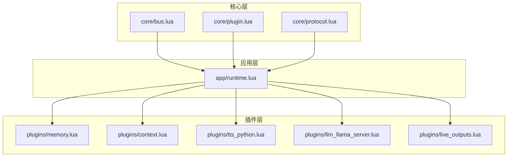
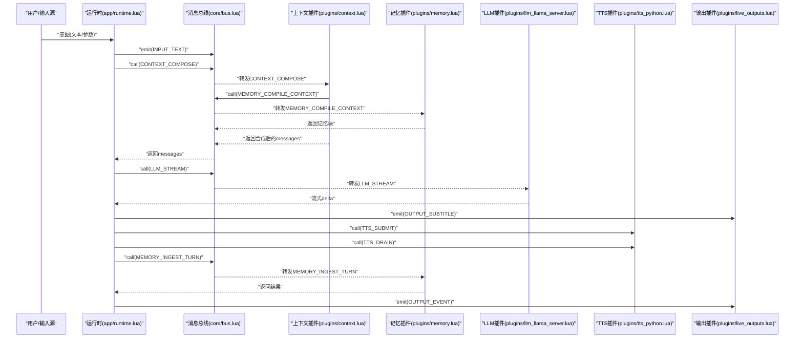
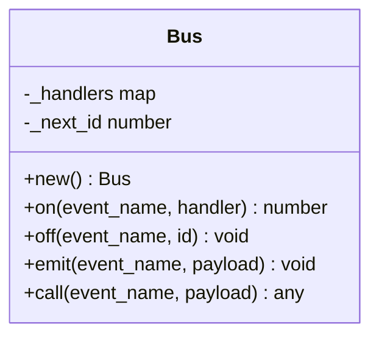
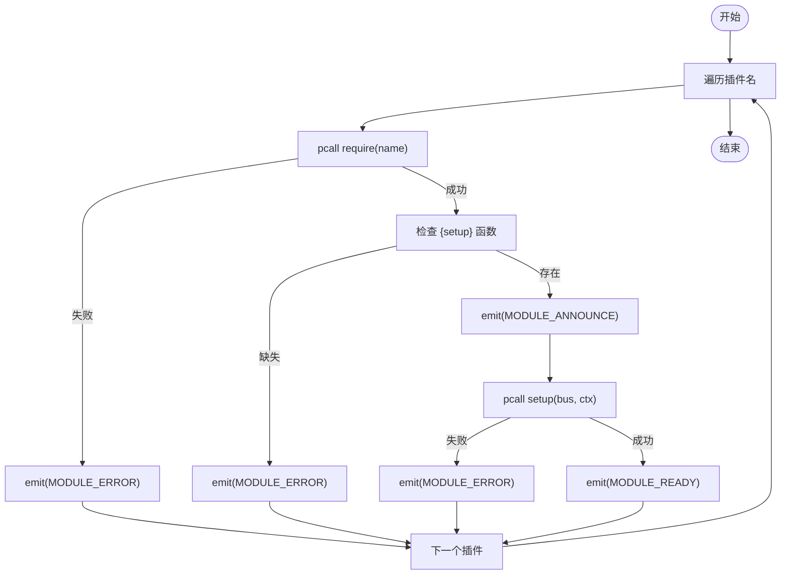
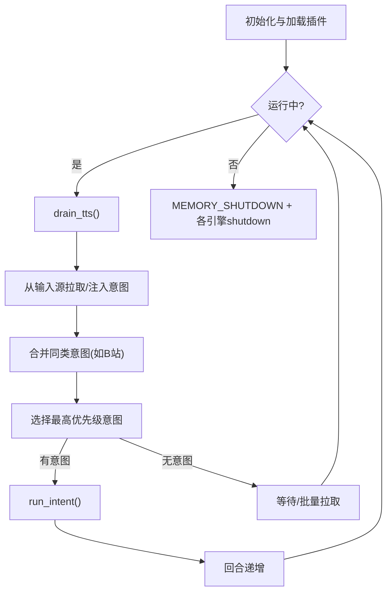
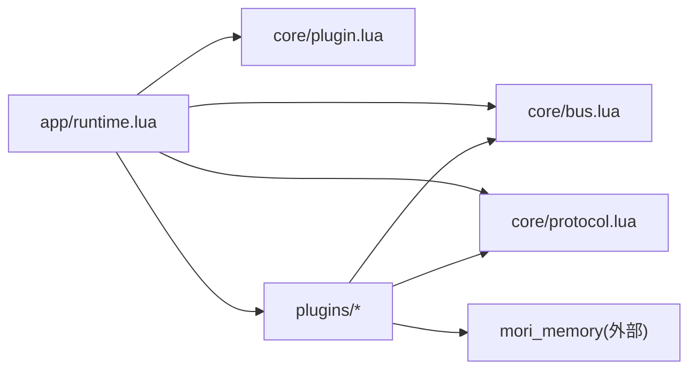

# Lua模块API

<cite>
**本文引用的文件**
- [mori_runtime/lua/mori/core/bus.lua](file://mori_runtime/lua/mori/core/bus.lua)
- [mori_runtime/lua/mori/core/plugin.lua](file://mori_runtime/lua/mori/core/plugin.lua)
- [mori_runtime/lua/mori/core/protocol.lua](file://mori_runtime/lua/mori/core/protocol.lua)
- [mori_runtime/lua/mori/app/runtime.lua](file://mori_runtime/lua/mori/app/runtime.lua)
- [mori_runtime/lua/mori/plugins/memory.lua](file://mori_runtime/lua/mori/plugins/memory.lua)
- [mori_runtime/lua/mori/plugins/context.lua](file://mori_runtime/lua/mori/plugins/context.lua)
- [mori_runtime/lua/mori/plugins/live_outputs.lua](file://mori_runtime/lua/mori/plugins/live_outputs.lua)
- [mori_runtime/lua/mori/plugins/tts_python.lua](file://mori_runtime/lua/mori/plugins/tts_python.lua)
- [mori_runtime/lua/mori/plugins/llm_llama_server.lua](file://mori_runtime/lua/mori/plugins/llm_llama_server.lua)
- [mori_memory/module/decision/init.lua](file://mori_memory/module/decision/init.lua)
</cite>

## 目录
1. [简介](#简介)
2. [项目结构](#项目结构)
3. [核心组件](#核心组件)
4. [架构总览](#架构总览)
5. [详细组件分析](#详细组件分析)
6. [依赖分析](#依赖分析)
7. [性能考虑](#性能考虑)
8. [故障排查指南](#故障排查指南)
9. [结论](#结论)
10. [附录](#附录)

## 简介
本文件为Mori系统的Lua模块API参考文档，覆盖以下方面：
- 内存系统API：主题记忆、历史记忆、精确状态、任务状态等模块的接口规范与交互流程
- 运行时核心API：消息总线、插件管理、协议定义
- 插件开发API：插件注册、事件处理、生命周期管理
- 消息协议与数据格式：消息类型定义、字段规范、序列化方式
- 事件系统API：事件订阅、发布、错误处理
- Lua模块间调用关系与数据流转
- 实际使用示例与常见问题解决方案

## 项目结构
Mori的Lua侧主要由“运行时内核”和“插件生态”两部分组成：
- 核心层（mori_runtime/lua/mori/core）：消息总线、插件加载器、协议常量
- 应用层（mori_runtime/lua/mori/app）：运行时主循环、意图调度、TTS/LLM/输出处理
- 插件层（mori_runtime/lua/mori/plugins）：内存、上下文、TTS、LLM、实时输出等插件
- 记忆模块（mori_memory/module）：决策系统等Lua模块入口

图表来源
- [mori_runtime/lua/mori/core/bus.lua:1-95](file://mori_runtime/lua/mori/core/bus.lua#L1-L95)
- [mori_runtime/lua/mori/core/plugin.lua:1-52](file://mori_runtime/lua/mori/core/plugin.lua#L1-L52)
- [mori_runtime/lua/mori/core/protocol.lua:1-35](file://mori_runtime/lua/mori/core/protocol.lua#L1-L35)
- [mori_runtime/lua/mori/app/runtime.lua:1-668](file://mori_runtime/lua/mori/app/runtime.lua#L1-L668)
- [mori_runtime/lua/mori/plugins/memory.lua:1-30](file://mori_runtime/lua/mori/plugins/memory.lua#L1-L30)
- [mori_runtime/lua/mori/plugins/context.lua:1-90](file://mori_runtime/lua/mori/plugins/context.lua#L1-L90)
- [mori_runtime/lua/mori/plugins/live_outputs.lua:1-114](file://mori_runtime/lua/mori/plugins/live_outputs.lua#L1-L114)
- [mori_runtime/lua/mori/plugins/tts_python.lua:1-31](file://mori_runtime/lua/mori/plugins/tts_python.lua#L1-L31)
- [mori_runtime/lua/mori/plugins/llm_llama_server.lua:1-25](file://mori_runtime/lua/mori/plugins/llm_llama_server.lua#L1-L25)

章节来源
- [mori_runtime/lua/mori/core/bus.lua:1-95](file://mori_runtime/lua/mori/core/bus.lua#L1-L95)
- [mori_runtime/lua/mori/core/plugin.lua:1-52](file://mori_runtime/lua/mori/core/plugin.lua#L1-L52)
- [mori_runtime/lua/mori/core/protocol.lua:1-35](file://mori_runtime/lua/mori/core/protocol.lua#L1-L35)
- [mori_runtime/lua/mori/app/runtime.lua:1-668](file://mori_runtime/lua/mori/app/runtime.lua#L1-L668)
- [mori_runtime/lua/mori/plugins/memory.lua:1-30](file://mori_runtime/lua/mori/plugins/memory.lua#L1-L30)
- [mori_runtime/lua/mori/plugins/context.lua:1-90](file://mori_runtime/lua/mori/plugins/context.lua#L1-L90)
- [mori_runtime/lua/mori/plugins/live_outputs.lua:1-114](file://mori_runtime/lua/mori/plugins/live_outputs.lua#L1-L114)
- [mori_runtime/lua/mori/plugins/tts_python.lua:1-31](file://mori_runtime/lua/mori/plugins/tts_python.lua#L1-L31)
- [mori_runtime/lua/mori/plugins/llm_llama_server.lua:1-25](file://mori_runtime/lua/mori/plugins/llm_llama_server.lua#L1-L25)

## 核心组件
- 消息总线（Bus）
  - 职责：事件订阅/发布、有序回调、错误冒泡、请求式调用
  - 关键方法：new、on、off、emit、call
  - 错误处理：通过BUS_ERROR事件向订阅者广播异常
- 插件管理（Plugin Loader）
  - 职责：按名称加载Lua模块，校验插件接口，触发生命周期事件
  - 生命周期事件：MODULE_ANNOUNCE、MODULE_READY、MODULE_ERROR
- 协议常量（Protocol）
  - 定义所有跨模块通信的事件名，如INPUT_TEXT、CONTEXT_COMPOSE、MEMORY_*、SPEECH_*、LLM_STREAM、TTS_*、OUTPUT_*等

章节来源
- [mori_runtime/lua/mori/core/bus.lua:1-95](file://mori_runtime/lua/mori/core/bus.lua#L1-L95)
- [mori_runtime/lua/mori/core/plugin.lua:1-52](file://mori_runtime/lua/mori/core/plugin.lua#L1-L52)
- [mori_runtime/lua/mori/core/protocol.lua:1-35](file://mori_runtime/lua/mori/core/protocol.lua#L1-L35)

## 架构总览
运行时主循环负责从外部输入源拉取意图，编排上下文，调用LLM流式生成，分段提交TTS，最终落库并输出字幕与事件日志。

图表来源
- [mori_runtime/lua/mori/app/runtime.lua:303-541](file://mori_runtime/lua/mori/app/runtime.lua#L303-L541)
- [mori_runtime/lua/mori/core/bus.lua:50-91](file://mori_runtime/lua/mori/core/bus.lua#L50-L91)
- [mori_runtime/lua/mori/plugins/context.lua:30-86](file://mori_runtime/lua/mori/plugins/context.lua#L30-L86)
- [mori_runtime/lua/mori/plugins/memory.lua:8-25](file://mori_runtime/lua/mori/plugins/memory.lua#L8-L25)
- [mori_runtime/lua/mori/plugins/llm_llama_server.lua:8-20](file://mori_runtime/lua/mori/plugins/llm_llama_server.lua#L8-L20)
- [mori_runtime/lua/mori/plugins/tts_python.lua:8-27](file://mori_runtime/lua/mori/plugins/tts_python.lua#L8-L27)
- [mori_runtime/lua/mori/plugins/live_outputs.lua:63-111](file://mori_runtime/lua/mori/plugins/live_outputs.lua#L63-L111)

## 详细组件分析

### 消息总线（Bus）
- 设计要点
  - 事件分组存储，按注册顺序迭代（Lua pairs语义不保证顺序）
  - emit：同步广播，单个处理器异常不会中断其他处理器
  - call：按注册顺序调用，遇到首个非nil返回值即短路返回
  - 错误处理：捕获处理器异常并通过BUS_ERROR事件广播
- 典型调用链
  - 运行时通过call发起请求式调用（如LLM_STREAM、MEMORY_*）
  - 插件通过on订阅事件并实现业务逻辑
- 复杂度
  - 订阅/取消订阅：O(1)
  - 发布/调用：O(N_handlers)

图表来源
- [mori_runtime/lua/mori/core/bus.lua:14-91](file://mori_runtime/lua/mori/core/bus.lua#L14-L91)

章节来源
- [mori_runtime/lua/mori/core/bus.lua:1-95](file://mori_runtime/lua/mori/core/bus.lua#L1-L95)

### 插件管理（Plugin Loader）
- 加载流程
  - 遍历插件名列表，pcall require对应模块
  - 校验返回表是否包含setup函数
  - 触发MODULE_ANNOUNCE → setup → MODULE_READY
  - 异常时触发MODULE_ERROR
- 生命周期事件
  - MODULE_ANNOUNCE：插件元信息（id/version）
  - MODULE_READY：插件初始化完成
  - MODULE_ERROR：加载/初始化失败
- 与运行时集成
  - 运行时在启动阶段调用load_all加载内置插件集合

图表来源
- [mori_runtime/lua/mori/core/plugin.lua:13-47](file://mori_runtime/lua/mori/core/plugin.lua#L13-L47)

章节来源
- [mori_runtime/lua/mori/core/plugin.lua:1-52](file://mori_runtime/lua/mori/core/plugin.lua#L1-L52)
- [mori_runtime/lua/mori/app/runtime.lua:543-563](file://mori_runtime/lua/mori/app/runtime.lua#L543-L563)

### 协议常量（Protocol）
- 事件分类
  - 总线错误：BUS_ERROR
  - 模块生命周期：MODULE_ANNOUNCE、MODULE_READY、MODULE_ERROR
  - 输入：INPUT_TEXT
  - 上下文：CONTEXT_COMPOSE
  - 记忆：MEMORY_COMPILE_CONTEXT、MEMORY_INGEST_TURN、MEMORY_SHUTDOWN
  - 语音意图：SPEECH_INTENT_START、SPEECH_INTENT_CANCEL、SPEECH_INTENT_END
  - LLM：LLM_STREAM
  - TTS：TTS_SUBMIT、TTS_DRAIN、TTS_CANCEL_INTENT、TTS_RESULT
  - 输出：OUTPUT_SUBTITLE、OUTPUT_EVENT、OUTPUT_PRINT
- 使用建议
  - 插件统一通过protocol.events引用事件名，避免硬编码
  - 新增事件时同步更新protocol.lua

章节来源
- [mori_runtime/lua/mori/core/protocol.lua:1-35](file://mori_runtime/lua/mori/core/protocol.lua#L1-L35)

### 运行时主循环（Runtime）
- 主要职责
  - 初始化Bus、加载插件、设置随机种子
  - 从外部输入源拉取意图，排序与中断判断
  - 编排上下文、调用LLM流式生成、分段TTS提交与消费
  - 将每轮对话写入记忆、输出字幕与事件日志
- 关键流程
  - 意图选择：按优先级与入队时间排序
  - 中断策略：根据配置与待处理队列动态决定
  - 文本清洗：去除思维过程标记、Markdown样式，保留可见文本
  - TTS：分段提交、异步消费、输出事件
  - 记忆：编译上下文块、摄入本轮对话、标记主题变化
- 命令支持
  - /tts on/off/toggle：控制TTS开关
  - /exit 或 /quit：优雅退出

图表来源
- [mori_runtime/lua/mori/app/runtime.lua:582-664](file://mori_runtime/lua/mori/app/runtime.lua#L582-L664)

章节来源
- [mori_runtime/lua/mori/app/runtime.lua:543-668](file://mori_runtime/lua/mori/app/runtime.lua#L543-L668)

### 插件：上下文（Context）
- 职责：将用户输入与记忆块组装为LLM messages
- 关键点
  - 从MEMORY_COMPILE_CONTEXT获取记忆块序列
  - 将system片段拼接为单一system消息
  - 最终追加用户消息作为最后一条user消息
- 数据结构
  - 返回值包含messages与blocks，供后续LLM使用

章节来源
- [mori_runtime/lua/mori/plugins/context.lua:30-86](file://mori_runtime/lua/mori/plugins/context.lua#L30-L86)

### 插件：记忆（Memory）
- 职责：编译上下文、摄入对话、关闭资源
- 接口绑定
  - MEMORY_COMPILE_CONTEXT → memory.compile_context
  - MEMORY_INGEST_TURN → memory.ingest_turn
  - MEMORY_SHUTDOWN → memory.shutdown

章节来源
- [mori_runtime/lua/mori/plugins/memory.lua:8-25](file://mori_runtime/lua/mori/plugins/memory.lua#L8-L25)

### 插件：TTS（Python桥）
- 职责：桥接到Python侧TTS引擎
- 接口绑定
  - TTS_SUBMIT → ctx.py_tts:submit
  - TTS_DRAIN → ctx.py_tts:drain
  - TTS_CANCEL_INTENT → ctx.py_tts:cancel_intent

章节来源
- [mori_runtime/lua/mori/plugins/tts_python.lua:8-27](file://mori_runtime/lua/mori/plugins/tts_python.lua#L8-L27)

### 插件：LLM（llama.cpp server）
- 职责：桥接到Python侧LLM引擎，提供流式对话能力
- 接口绑定
  - LLM_STREAM → ctx.py_llm:stream_chat(messages, params, on_delta, should_abort)

章节来源
- [mori_runtime/lua/mori/plugins/llm_llama_server.lua:8-20](file://mori_runtime/lua/mori/plugins/llm_llama_server.lua#L8-L20)

### 插件：实时输出（Live Outputs）
- 职责：字幕输出、事件日志、标准输出打印
- 功能
  - OUTPUT_SUBTITLE：写入字幕文件、可选stdout打印
  - OUTPUT_PRINT：统一打印入口
  - OUTPUT_EVENT：JSON编码后追加到事件日志文件
- 清洗规则：去除代码块、强调、列表、标题等Markdown标记，保留纯文本

章节来源
- [mori_runtime/lua/mori/plugins/live_outputs.lua:63-111](file://mori_runtime/lua/mori/plugins/live_outputs.lua#L63-L111)

### 决策系统模块（Lua）
- 入口导出
  - DimensionManager、QuadrantSystem、DecisionEvaluator、DecisionController、ContextFusionEngine
- 适用场景：与记忆/上下文协同，用于更高阶的上下文融合与决策

章节来源
- [mori_memory/module/decision/init.lua:1-21](file://mori_memory/module/decision/init.lua#L1-L21)

## 依赖分析
- 组件耦合
  - 运行时强依赖消息总线与协议常量
  - 插件通过协议与运行时解耦，仅依赖Bus与protocol.events
  - 记忆插件依赖外部记忆模块（mori_memory），通过ctx暴露
- 循环依赖
  - 未发现直接循环依赖；插件通过事件间接协作
- 外部依赖
  - Python桥（ctx.py_llm、ctx.py_tts）需在运行前初始化

图表来源
- [mori_runtime/lua/mori/app/runtime.lua:1-6](file://mori_runtime/lua/mori/app/runtime.lua#L1-L6)
- [mori_runtime/lua/mori/core/bus.lua:1-2](file://mori_runtime/lua/mori/core/bus.lua#L1-L2)
- [mori_runtime/lua/mori/core/plugin.lua:1-2](file://mori_runtime/lua/mori/core/plugin.lua#L1-L2)
- [mori_runtime/lua/mori/core/protocol.lua:1-2](file://mori_runtime/lua/mori/core/protocol.lua#L1-L2)
- [mori_runtime/lua/mori/plugins/memory.lua:9-10](file://mori_runtime/lua/mori/plugins/memory.lua#L9-L10)

章节来源
- [mori_runtime/lua/mori/app/runtime.lua:1-6](file://mori_runtime/lua/mori/app/runtime.lua#L1-L6)
- [mori_runtime/lua/mori/core/bus.lua:1-2](file://mori_runtime/lua/mori/core/bus.lua#L1-L2)
- [mori_runtime/lua/mori/core/plugin.lua:1-2](file://mori_runtime/lua/mori/core/plugin.lua#L1-L2)
- [mori_runtime/lua/mori/core/protocol.lua:1-2](file://mori_runtime/lua/mori/core/protocol.lua#L1-L2)
- [mori_runtime/lua/mori/plugins/memory.lua:9-10](file://mori_runtime/lua/mori/plugins/memory.lua#L9-L10)

## 性能考虑
- 事件处理
  - emit为同步广播，处理器内部应尽量避免阻塞操作
  - call遇到首个非nil返回会短路，适合查询类事件
- 中断与批处理
  - 运行时在每次事件循环中进行TTS排空与批量拉取，降低IO开销
  - bilibili消息去重合并，减少重复处理
- 文本分段
  - 分段提交TTS可提升交互延迟体验，但需平衡分段粒度与吞吐
- 随机种子
  - 每回合设置随机种子，确保可复现性与分段行为一致性

## 故障排查指南
- 插件加载失败
  - 现象：出现MODULE_ERROR，错误信息包含require_failed或invalid_plugin
  - 排查：确认插件模块路径正确、返回表包含setup函数
- 插件初始化失败
  - 现象：setup抛错触发MODULE_ERROR
  - 排查：检查插件内部依赖（如ctx.py_llm/py_tts）是否就绪
- 总线错误
  - 现象：BUS_ERROR事件被广播，stderr输出错误详情
  - 排查：定位具体处理器异常，修复回调逻辑
- TTS不可用
  - 现象：/tts on显示不可用
  - 排查：确认ctx.py_tts已初始化；检查插件是否正常加载
- LLM流式异常
  - 现象：LLM_STREAM调用失败，run_intent返回失败
  - 排查：检查messages与params结构；确认should_abort逻辑正确

章节来源
- [mori_runtime/lua/mori/core/plugin.lua:18-39](file://mori_runtime/lua/mori/core/plugin.lua#L18-L39)
- [mori_runtime/lua/mori/core/bus.lua:58-68](file://mori_runtime/lua/mori/core/bus.lua#L58-L68)
- [mori_runtime/lua/mori/plugins/tts_python.lua:9-11](file://mori_runtime/lua/mori/plugins/tts_python.lua#L9-L11)
- [mori_runtime/lua/mori/app/runtime.lua:613-634](file://mori_runtime/lua/mori/app/runtime.lua#L613-L634)

## 结论
Mori的Lua模块以消息总线为核心，通过协议常量实现松耦合扩展。运行时主循环将输入意图编排为上下文，驱动LLM与TTS，并通过记忆插件实现对话摄入与主题演化。插件体系清晰、职责明确，便于二次开发与定制。

## 附录

### 消息协议与数据格式
- 事件类型（节选）
  - 输入：INPUT_TEXT
  - 上下文：CONTEXT_COMPOSE
  - 记忆：MEMORY_COMPILE_CONTEXT、MEMORY_INGEST_TURN、MEMORY_SHUTDOWN
  - 语音意图：SPEECH_INTENT_START、SPEECH_INTENT_CANCEL、SPEECH_INTENT_END
  - LLM：LLM_STREAM
  - TTS：TTS_SUBMIT、TTS_DRAIN、TTS_CANCEL_INTENT、TTS_RESULT
  - 输出：OUTPUT_SUBTITLE、OUTPUT_EVENT、OUTPUT_PRINT
- 字幕输出payload字段
  - ts、type、text、final
- 事件日志payload字段（示例）
  - ts、type、turn、intent_id、segment_idx、ok、error、source、nickname、...（详见运行时中的字段映射）
- JSON序列化
  - 输出事件采用JSON编码后追加到文件

章节来源
- [mori_runtime/lua/mori/core/protocol.lua:3-32](file://mori_runtime/lua/mori/core/protocol.lua#L3-L32)
- [mori_runtime/lua/mori/plugins/live_outputs.lua:100-110](file://mori_runtime/lua/mori/plugins/live_outputs.lua#L100-L110)
- [mori_runtime/lua/mori/app/runtime.lua:222-280](file://mori_runtime/lua/mori/app/runtime.lua#L222-L280)

### 插件开发API清单
- 插件注册
  - 模块需返回包含id、version与setup函数的表
  - 在运行时启动阶段通过load_all加载
- 事件处理
  - 使用bus:on订阅协议事件
  - 使用bus:emit发布事件
  - 使用bus:call发起请求式调用
- 生命周期管理
  - MODULE_ANNOUNCE：插件元信息
  - MODULE_READY：初始化完成
  - MODULE_ERROR：加载/初始化失败
- 示例参考
  - 记忆插件：绑定MEMORY_*事件
  - 上下文插件：绑定CONTEXT_COMPOSE并返回messages
  - TTS插件：绑定TTS_*事件并调用ctx.py_tts
  - LLM插件：绑定LLM_STREAM并调用ctx.py_llm
  - 输出插件：绑定OUTPUT_*事件并落地文件

章节来源
- [mori_runtime/lua/mori/core/plugin.lua:13-47](file://mori_runtime/lua/mori/core/plugin.lua#L13-L47)
- [mori_runtime/lua/mori/plugins/memory.lua:8-25](file://mori_runtime/lua/mori/plugins/memory.lua#L8-L25)
- [mori_runtime/lua/mori/plugins/context.lua:30-86](file://mori_runtime/lua/mori/plugins/context.lua#L30-L86)
- [mori_runtime/lua/mori/plugins/tts_python.lua:8-27](file://mori_runtime/lua/mori/plugins/tts_python.lua#L8-L27)
- [mori_runtime/lua/mori/plugins/llm_llama_server.lua:8-20](file://mori_runtime/lua/mori/plugins/llm_llama_server.lua#L8-L20)
- [mori_runtime/lua/mori/plugins/live_outputs.lua:63-111](file://mori_runtime/lua/mori/plugins/live_outputs.lua#L63-L111)

### 实际使用示例（步骤说明）
- 启动运行时
  - 提供配置（插件列表、系统提示、TTS参数等）
  - 运行时加载插件并进入主循环
- 输入意图
  - 支持命令：/tts on/off/toggle、/exit、/quit
  - 文本输入将触发一次完整对话回合
- 查看输出
  - 字幕文件：实时更新
  - 事件日志：JSON逐行追加
  - stdout：可选打印

章节来源
- [mori_runtime/lua/mori/app/runtime.lua:580-664](file://mori_runtime/lua/mori/app/runtime.lua#L580-L664)
- [mori_runtime/lua/mori/plugins/live_outputs.lua:63-111](file://mori_runtime/lua/mori/plugins/live_outputs.lua#L63-L111)