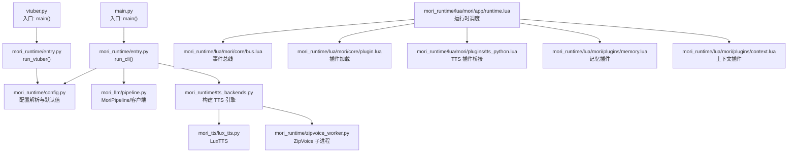
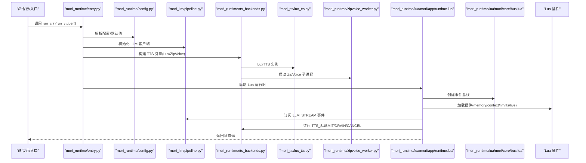
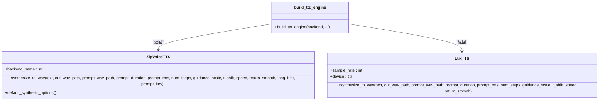
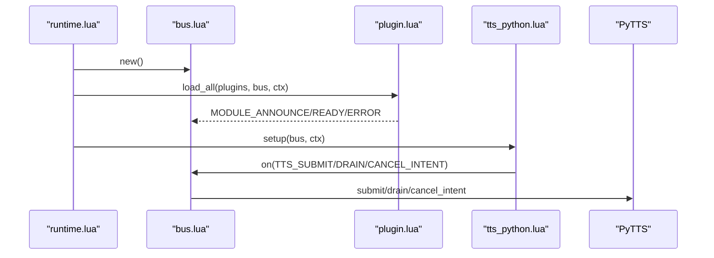
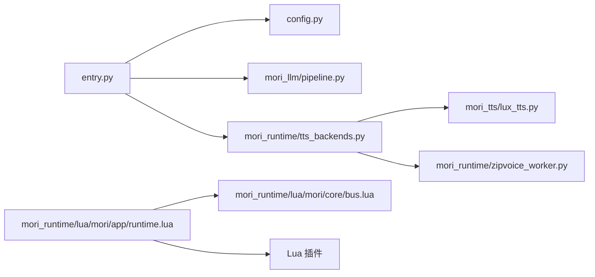

# Python API

<cite>
**本文引用的文件**
- [main.py](file://main.py)
- [vtuber.py](file://vtuber.py)
- [entry.py](file://mori_runtime/entry.py)
- [config.py](file://mori_runtime/config.py)
- [pipeline.py](file://mori_llm/pipeline.py)
- [lux_tts.py](file://mori_tts/lux_tts.py)
- [tts_backends.py](file://mori_runtime/tts_backends.py)
- [zipvoice_worker.py](file://mori_runtime/zipvoice_worker.py)
- [plugin.lua](file://mori_runtime/lua/mori/core/plugin.lua)
- [runtime.lua](file://mori_runtime/lua/mori/app/runtime.lua)
- [bus.lua](file://mori_runtime/lua/mori/core/bus.lua)
- [protocol.lua](file://mori_runtime/lua/mori/core/protocol.lua)
- [tts_python.lua](file://mori_runtime/lua/mori/plugins/tts_python.lua)
- [memory.lua](file://mori_runtime/lua/mori/plugins/memory.lua)
- [context.lua](file://mori_runtime/lua/mori/plugins/context.lua)
</cite>

## 目录
1. [简介](#简介)
2. [项目结构](#项目结构)
3. [核心组件](#核心组件)
4. [架构总览](#架构总览)
5. [详细组件分析](#详细组件分析)
6. [依赖分析](#依赖分析)
7. [性能考虑](#性能考虑)
8. [故障排查指南](#故障排查指南)
9. [结论](#结论)
10. [附录](#附录)

## 简介
本文件为 Mori 系统的 Python API 参考文档，覆盖以下主题：
- 主程序入口函数 main() 与 vtuber() 的参数、返回值与使用方法
- 配置管理 API（配置文件解析、参数验证、默认值设置）
- LLM 管道 API（模型加载、推理调用、嵌入向量生成）
- TTS 后端 API（LuxTTS 与 ZipVoice 的调用方式、参数配置、性能优化）
- 插件系统 API（插件注册、生命周期管理、事件处理）
- 错误处理与异常管理最佳实践
- 完整的使用示例与常见场景

## 项目结构
Mori 的 Python 层由多个模块组成，分别负责 CLI 入口、配置解析、LLM 管道、TTS 引擎桥接与 Lua 运行时集成。下图展示与 Python API 相关的关键文件与交互：

图表来源
- [main.py:1-13](file://main.py#L1-L13)
- [vtuber.py:1-13](file://vtuber.py#L1-L13)
- [entry.py:796-800](file://mori_runtime/entry.py#L796-L800)
- [config.py:188-270](file://mori_runtime/config.py#L188-L270)
- [pipeline.py:307-582](file://mori_llm/pipeline.py#L307-L582)
- [tts_backends.py:1102-1171](file://mori_runtime/tts_backends.py#L1102-L1171)
- [lux_tts.py:65-171](file://mori_tts/lux_tts.py#L65-L171)
- [zipvoice_worker.py:446-729](file://mori_runtime/zipvoice_worker.py#L446-L729)
- [runtime.lua:543-668](file://mori_runtime/lua/mori/app/runtime.lua#L543-L668)
- [bus.lua:14-95](file://mori_runtime/lua/mori/core/bus.lua#L14-L95)
- [plugin.lua:13-48](file://mori_runtime/lua/mori/core/plugin.lua#L13-L48)
- [tts_python.lua:8-28](file://mori_runtime/lua/mori/plugins/tts_python.lua#L8-L28)
- [memory.lua:8-26](file://mori_runtime/lua/mori/plugins/memory.lua#L8-L26)
- [context.lua:30-87](file://mori_runtime/lua/mori/plugins/context.lua#L30-L87)

章节来源
- [main.py:1-13](file://main.py#L1-L13)
- [vtuber.py:1-13](file://vtuber.py#L1-L13)
- [entry.py:796-800](file://mori_runtime/entry.py#L796-L800)

## 核心组件
- 入口函数
  - main(): 调用 run_cli() 并返回退出码
  - vtuber(): 调用 run_vtuber() 并返回退出码
- 配置管理
  - 加载与合并配置、解析相对路径、设置默认值、解析 CLI 参数
- LLM 管道
  - 基于 llama.cpp 的服务端客户端封装，支持同步/流式聊天与嵌入生成
- TTS 引擎
  - 支持 LuxTTS 与 ZipVoice，含子进程工作流、提示词缓存、多语言路由与质量档位
- 插件系统
  - Lua 侧事件总线与插件加载机制，Python 通过桥接插件与 Lua 通信

章节来源
- [main.py:6-8](file://main.py#L6-L8)
- [vtuber.py:6-8](file://vtuber.py#L6-L8)
- [config.py:188-270](file://mori_runtime/config.py#L188-L270)
- [pipeline.py:307-582](file://mori_llm/pipeline.py#L307-L582)
- [tts_backends.py:1102-1171](file://mori_runtime/tts_backends.py#L1102-L1171)
- [plugin.lua:13-48](file://mori_runtime/lua/mori/core/plugin.lua#L13-L48)

## 架构总览
下图展示从 Python 入口到 Lua 运行时、LLM 与 TTS 的整体调用链路。

图表来源
- [entry.py:796-800](file://mori_runtime/entry.py#L796-L800)
- [config.py:188-270](file://mori_runtime/config.py#L188-L270)
- [pipeline.py:307-582](file://mori_llm/pipeline.py#L307-L582)
- [tts_backends.py:1102-1171](file://mori_runtime/tts_backends.py#L1102-L1171)
- [lux_tts.py:65-171](file://mori_tts/lux_tts.py#L65-L171)
- [zipvoice_worker.py:446-729](file://mori_runtime/zipvoice_worker.py#L446-L729)
- [runtime.lua:543-668](file://mori_runtime/lua/mori/app/runtime.lua#L543-L668)
- [bus.lua:14-95](file://mori_runtime/lua/mori/core/bus.lua#L14-L95)
- [plugin.lua:13-48](file://mori_runtime/lua/mori/core/plugin.lua#L13-L48)

## 详细组件分析

### 入口函数 API
- main()
  - 功能：启动 CLI 模式运行
  - 参数：无显式参数（内部通过 argparse 解析）
  - 返回：int 退出码
  - 使用：python -m main 或直接运行脚本
- vtuber()
  - 功能：启动 VTuber 模式运行
  - 参数：无显式参数（内部通过 argparse 解析）
  - 返回：int 退出码
  - 使用：python -m vtuber 或直接运行脚本

章节来源
- [main.py:6-8](file://main.py#L6-L8)
- [vtuber.py:6-8](file://vtuber.py#L6-L8)

### 配置管理 API
- 配置文件解析
  - find_config_path(explicit=None, cwd=None, repo_root=None) -> Path | None
  - load_config(explicit=None, cwd=None, repo_root=None) -> (Path | None, dict[str, Any])
- 默认值构建
  - build_entry_defaults(config, mode="cli|vtuber") -> dict[str, Any]
  - build_launcher_defaults(config, launcher="love2d|inochi") -> dict[str, Any]
- CLI 默认值应用
  - apply_config_defaults(parser, argv=None, repo_root=..., profile="cli|vtuber|love2d|inochi") -> (Path | None, dict[str, Any])
- 相对路径处理
  - _resolve_config_relative_paths(defaults, config_dir) -> dict[str, Any]
- 关键配置键集合
  - _COMMON_KEYS/_CLI_KEYS/_VTUBER_KEYS/_TTS_KEY_MAP/_LOVE2D_KEYS/_INOCHI_KEYS/_PATH_DEFAULT_KEYS/_PATH_LIST_KEYS

章节来源
- [config.py:160-270](file://mori_runtime/config.py#L160-L270)

### LLM 管道 API
- 类：MoriPipeline
  - 构造参数
    - llama_bin_dir=None, host="127.0.0.1", large_port=None, embed_port=None
    - large_ctx_size=8192, embed_ctx_size=8192
    - large_gpu_layers="all", embed_gpu_layers="0"
    - enable_jinja=True, api_key=""
  - 方法
    - load_models_py(large_model_path, embedding_model_path, draft_model_path="", spec_cfg=None) -> None
    - generate_chat_sync_py(messages, params=None) -> str
    - generate_chat_stream_py(messages, params=None) -> Iterable[str]
    - get_embedding_py(text, mode="query") -> list[float]
    - get_embeddings_py(texts, mode="query") -> list[list[float]]
    - shutdown() -> None
- 客户端：LlamaCppServerClient
  - 构造参数
    - server_bin, model_path, ctx_size, host="127.0.0.1", port=None
    - enable_webui=False, enable_jinja=True, api_key="", embeddings=False
    - gpu_layers="all", draft_model_path=None, spec_cfg=None, startup_timeout_s=600
  - 方法
    - create_chat_completion(messages, max_tokens=256, temperature=0.7, top_p=None, stop=None, seed=None) -> dict[str, Any]
    - create_chat_completion_stream(messages, max_tokens=256, temperature=0.7, top_p=None, stop=None, seed=None, timeout_s=600)
    - create_embedding(texts) -> dict[str, Any]
    - stop() -> None
- 规范配置：SpecConfig
  - 字段：enabled, draft_gpu_layers, draft_max, draft_min, draft_p_min, draft_ctx_size
  - from_lua(value) -> SpecConfig

章节来源
- [pipeline.py:307-582](file://mori_llm/pipeline.py#L307-L582)

### TTS 后端 API
- 引擎工厂：build_tts_engine(...)
  - backend="lux|zipvoice"
  - LuxTTS 参数：tts_model, tts_device, tts_threads
  - ZipVoice 参数：zipvoice_python_bin, zipvoice_repo, model_type, model_dir, checkpoint_name
    - zh/ja 路由：tokenizer/lang/prompt_text/prompt_wav
    - prompt 策略：prompt_manifest, prompt_policy
    - 质量档位：quality_profile/default_num_steps/guidance_scale/t_shift/speed/return_smooth
    - 语音合成器：vocoder_profile/vocoder_model
- ZipVoiceTTS
  - 构造：初始化子进程、预热提示词缓存、校验模型与资源
  - 接口：synthesize_to_wav(text, out_wav_path, prompt_wav_path, prompt_duration, prompt_rms, num_steps, guidance_scale, t_shift, speed, return_smooth, lang_hint="", prompt_key="")
  - 返回：字典（包含路由、采样率、质量档位、提示词信息等）
- LuxTTS
  - 构造：加载模型、设备选择、线程数
  - 接口：synthesize_to_wav(text, out_wav_path, prompt_wav_path, prompt_duration, prompt_rms, num_steps, guidance_scale, t_shift, speed, return_smooth) -> Path
- ZipVoice 子进程：zipvoice_worker.py
  - 启动参数：--zipvoice-repo, --model-type, --model-dir, --checkpoint-name, --num-thread, --vocoder-profile, --vocoder-model
  - 协议：stdin/stdout JSON 请求/响应，支持 prewarm 与推理命令
  - 输出：生成 wav 文件与 RTF 统计指标

图表来源
- [tts_backends.py:525-1100](file://mori_runtime/tts_backends.py#L525-L1100)
- [lux_tts.py:65-171](file://mori_tts/lux_tts.py#L65-L171)
- [zipvoice_worker.py:446-729](file://mori_runtime/zipvoice_worker.py#L446-L729)

章节来源
- [tts_backends.py:1102-1171](file://mori_runtime/tts_backends.py#L1102-L1171)
- [lux_tts.py:65-171](file://mori_tts/lux_tts.py#L65-L171)
- [zipvoice_worker.py:446-729](file://mori_runtime/zipvoice_worker.py#L446-L729)

### 插件系统 API
- 事件总线：Bus
  - on(event_name, handler) -> id
  - off(event_name, id)
  - emit(event_name, payload)
  - call(event_name, payload) -> 第一个非 nil 结果
- 协议常量：protocol.events
  - 包含 MODULE_*、INPUT_TEXT、CONTEXT_COMPOSE、MEMORY_*、SPEECH_INTENT_*、LLM_STREAM、TTS_*、OUTPUT_* 等
- 插件加载：plugin.load_all(plugin_names, bus, ctx)
  - 校验插件表结构与 setup 函数，发出 MODULE_ANNOUNCE/MODULE_READY/MODULE_ERROR 事件
- Lua 运行时：runtime.run(config, ctx)
  - 初始化 bus 与插件（默认 memory/context/llm_llama_server/tts_python/live_outputs）
  - 处理输入队列、中断策略、分段 TTS 提交、输出字幕与事件
- Python 桥接插件：tts_python.lua
  - 将 TTS_SUBMIT/DRAIN/CANCEL_INTENT 映射到 ctx.py_tts 对象

图表来源
- [runtime.lua:543-668](file://mori_runtime/lua/mori/app/runtime.lua#L543-L668)
- [bus.lua:14-95](file://mori_runtime/lua/mori/core/bus.lua#L14-L95)
- [plugin.lua:13-48](file://mori_runtime/lua/mori/core/plugin.lua#L13-L48)
- [tts_python.lua:8-28](file://mori_runtime/lua/mori/plugins/tts_python.lua#L8-L28)

章节来源
- [bus.lua:14-95](file://mori_runtime/lua/mori/core/bus.lua#L14-L95)
- [protocol.lua:3-35](file://mori_runtime/lua/mori/core/protocol.lua#L3-L35)
- [plugin.lua:13-48](file://mori_runtime/lua/mori/core/plugin.lua#L13-L48)
- [runtime.lua:543-668](file://mori_runtime/lua/mori/app/runtime.lua#L543-L668)
- [tts_python.lua:8-28](file://mori_runtime/lua/mori/plugins/tts_python.lua#L8-L28)
- [memory.lua:8-26](file://mori_runtime/lua/mori/plugins/memory.lua#L8-L26)
- [context.lua:30-87](file://mori_runtime/lua/mori/plugins/context.lua#L30-L87)

## 依赖分析
- 入口层依赖运行时与配置模块
- 运行时依赖事件总线与插件系统，并通过插件桥接到 Python 的 LLM/TTS
- LLM 依赖 llama.cpp 二进制与服务器进程
- TTS 依赖 LuxTTS 或 ZipVoice 子进程，后者依赖 ZipVoice 仓库与模型权重

图表来源
- [entry.py:796-800](file://mori_runtime/entry.py#L796-L800)
- [config.py:188-270](file://mori_runtime/config.py#L188-L270)
- [pipeline.py:307-582](file://mori_llm/pipeline.py#L307-L582)
- [tts_backends.py:1102-1171](file://mori_runtime/tts_backends.py#L1102-L1171)
- [lux_tts.py:65-171](file://mori_tts/lux_tts.py#L65-L171)
- [zipvoice_worker.py:446-729](file://mori_runtime/zipvoice_worker.py#L446-L729)
- [runtime.lua:543-668](file://mori_runtime/lua/mori/app/runtime.lua#L543-L668)
- [bus.lua:14-95](file://mori_runtime/lua/mori/core/bus.lua#L14-L95)

章节来源
- [entry.py:796-800](file://mori_runtime/entry.py#L796-L800)
- [runtime.lua:543-668](file://mori_runtime/lua/mori/app/runtime.lua#L543-L668)

## 性能考虑
- LLM
  - 合理设置 ctx_size、gpu_layers、draft 模型以平衡延迟与质量
  - 使用流式接口 generate_chat_stream_py 获取增量输出，降低首帧延迟
- TTS
  - ZipVoice：启用 prompt 缓存与预热，减少重复特征计算
  - ZipVoice：根据实时性需求选择 quality_profile（realtime/balanced/hq），并调整 num_steps/guidance_scale/t_shift/speed
  - LuxTTS：控制 prompt_duration/prompt_rms 与 num_steps/guidance_scale/t_shift/speed
  - ZipVoice 子进程：通过 --num-thread 控制 CPU 并行度
- 队列与中断
  - interrupt_policy 控制是否允许新消息打断当前回复，避免长时间排队

## 故障排查指南
- 配置问题
  - 配置文件不存在或格式不正确：检查 find_config_path/load_config 的返回值与异常
  - 相对路径解析失败：确认 _resolve_config_relative_paths 的行为与 config_dir
- LLM 启动失败
  - llama-server 未找到或提前退出：检查 server_bin/model_path 与 LD_LIBRARY_PATH
  - 启动超时：增大 startup_timeout_s 或检查端口占用
- TTS 引擎问题
  - LuxTTS：缺少依赖或模型不可用，按提示安装依赖
  - ZipVoice：子进程未就绪、模型文件缺失、提示词 manifest 无效、语言检测失败
- 插件与事件
  - 插件 setup 失败：查看 MODULE_ERROR 事件中的错误信息
  - 事件回调抛错：BUS_ERROR 会收集 handler 抛出的异常

章节来源
- [config.py:188-270](file://mori_runtime/config.py#L188-L270)
- [pipeline.py:105-174](file://mori_llm/pipeline.py#L105-L174)
- [tts_backends.py:668-754](file://mori_runtime/tts_backends.py#L668-L754)
- [zipvoice_worker.py:446-729](file://mori_runtime/zipvoice_worker.py#L446-L729)
- [plugin.lua:13-48](file://mori_runtime/lua/mori/core/plugin.lua#L13-L48)
- [bus.lua:50-91](file://mori_runtime/lua/mori/core/bus.lua#L50-L91)

## 结论
本文档梳理了 Mori 系统 Python API 的入口、配置、LLM 管道与 TTS 后端，并介绍了 Lua 插件系统与事件总线。通过合理的配置与参数调优，可在本地高效运行多模态 VTuber 场景，同时具备良好的扩展性与可维护性。

## 附录
- 使用示例与场景建议
  - CLI 模式：使用 main() 启动，结合 --config/--workdir/--llama-bin-dir 等参数
  - VTuber 模式：使用 vtuber() 启动，配合 bilibili 直播拉取与字幕输出
  - LLM：先 load_models_py，再调用 generate_chat_sync_py 或 generate_chat_stream_py
  - TTS：选择 backend=lux 或 zipvoice，按需设置 prompt 与质量档位
  - 插件：在 runtime 中启用/替换插件，或通过 Lua 自定义事件处理器