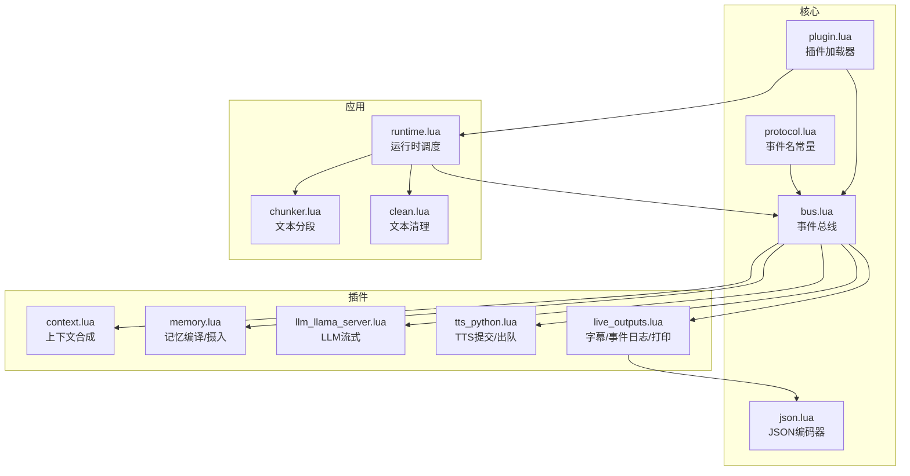
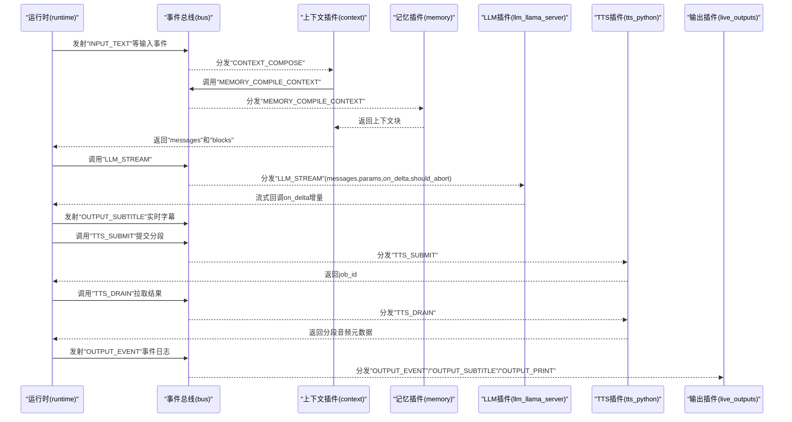
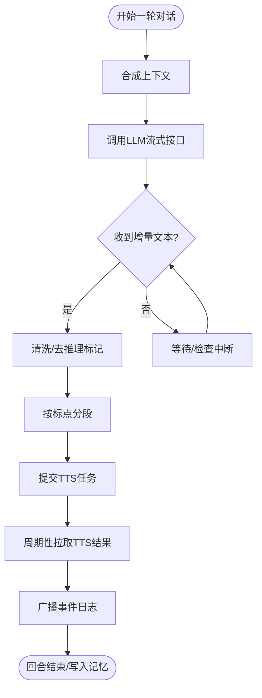
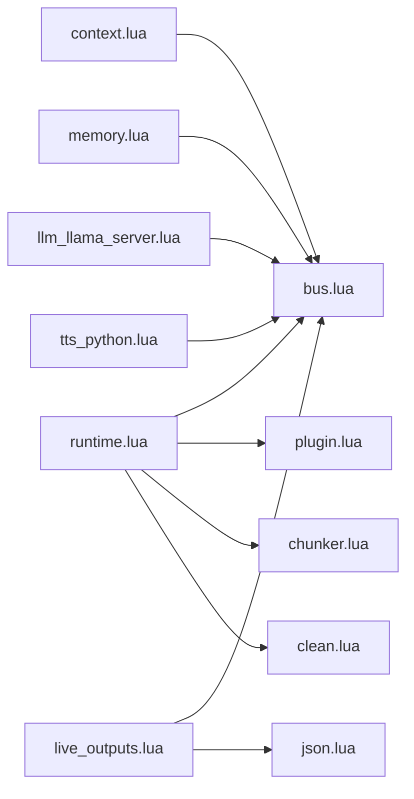

# 消息协议

<cite>
**本文引用的文件**
- [protocol.lua](file://mori_runtime/lua/mori/core/protocol.lua)
- [bus.lua](file://mori_runtime/lua/mori/core/bus.lua)
- [json.lua](file://mori_runtime/lua/mori/core/json.lua)
- [plugin.lua](file://mori_runtime/lua/mori/core/plugin.lua)
- [runtime.lua](file://mori_runtime/lua/mori/app/runtime.lua)
- [context.lua](file://mori_runtime/lua/mori/plugins/context.lua)
- [memory.lua](file://mori_runtime/lua/mori/plugins/memory.lua)
- [live_outputs.lua](file://mori_runtime/lua/mori/plugins/live_outputs.lua)
- [tts_python.lua](file://mori_runtime/lua/mori/plugins/tts_python.lua)
- [llm_llama_server.lua](file://mori_runtime/lua/mori/plugins/llm_llama_server.lua)
- [chunker.lua](file://mori_runtime/lua/mori/speech/chunker.lua)
- [clean.lua](file://mori_runtime/lua/mori/text/clean.lua)
</cite>

## 目录
1. [简介](#简介)
2. [项目结构](#项目结构)
3. [核心组件](#核心组件)
4. [架构总览](#架构总览)
5. [详细组件分析](#详细组件分析)
6. [依赖关系分析](#依赖关系分析)
7. [性能考量](#性能考量)
8. [故障排查指南](#故障排查指南)
9. [结论](#结论)
10. [附录](#附录)

## 简介
本文件系统性梳理 Mori 系统的消息协议，覆盖消息类型定义与分类、消息字段规范、JSON 序列化与反序列化、消息路由与传递规则、压缩与加密建议、完整性校验方案、错误恢复与重试策略、版本管理与向后兼容、以及验证工具与测试用例建议。文档以 Lua 实现的运行时为核心，结合插件化扩展与事件总线进行消息编排。

## 项目结构
Mori 的消息协议由“事件总线 + 协议常量 + 插件”三层构成：
- 核心协议常量：统一定义事件名，确保跨模块一致性
- 事件总线：注册/注销处理器、发射事件、调用首个非空返回处理器
- 插件：按协议订阅事件并处理业务逻辑（如上下文合成、记忆编译、TTS/LLM 输出）

图表来源
- [protocol.lua:1-35](file://mori_runtime/lua/mori/core/protocol.lua#L1-L35)
- [bus.lua:1-95](file://mori_runtime/lua/mori/core/bus.lua#L1-L95)
- [json.lua:1-90](file://mori_runtime/lua/mori/core/json.lua#L1-L90)
- [plugin.lua:1-52](file://mori_runtime/lua/mori/core/plugin.lua#L1-L52)
- [runtime.lua:1-668](file://mori_runtime/lua/mori/app/runtime.lua#L1-L668)
- [context.lua:1-90](file://mori_runtime/lua/mori/plugins/context.lua#L1-L90)
- [memory.lua:1-30](file://mori_runtime/lua/mori/plugins/memory.lua#L1-L30)
- [llm_llama_server.lua:1-25](file://mori_runtime/lua/mori/plugins/llm_llama_server.lua#L1-L25)
- [tts_python.lua:1-31](file://mori_runtime/lua/mori/plugins/tts_python.lua#L1-L31)
- [live_outputs.lua:1-114](file://mori_runtime/lua/mori/plugins/live_outputs.lua#L1-L114)
- [chunker.lua:1-157](file://mori_runtime/lua/mori/speech/chunker.lua#L1-L157)
- [clean.lua:1-49](file://mori_runtime/lua/mori/text/clean.lua#L1-L49)

章节来源
- [protocol.lua:1-35](file://mori_runtime/lua/mori/core/protocol.lua#L1-L35)
- [bus.lua:1-95](file://mori_runtime/lua/mori/core/bus.lua#L1-L95)
- [json.lua:1-90](file://mori_runtime/lua/mori/core/json.lua#L1-L90)
- [plugin.lua:1-52](file://mori_runtime/lua/mori/core/plugin.lua#L1-L52)
- [runtime.lua:1-668](file://mori_runtime/lua/mori/app/runtime.lua#L1-L668)

## 核心组件
- 事件总线 Bus：提供注册/注销处理器、发射事件、调用首个非空返回处理器的能力，并内置错误广播机制
- 协议常量 Protocol：集中定义所有事件名，涵盖模块生命周期、输入、上下文、记忆、语音意图、LLM 流式、TTS 提交/出队/取消、输出（字幕/事件/打印）
- 插件 Plugin：负责加载插件、广播模块公告/就绪/错误事件，并调用插件 setup 完成事件绑定
- JSON 编码器：提供安全的 JSON 编码能力，支持数组/对象/标量/字符串转义，避免深度过深导致栈溢
- 运行时 Runtime：驱动消息循环、排队与中断策略、文本清洗与分段、事件广播与持久化

章节来源
- [bus.lua:1-95](file://mori_runtime/lua/mori/core/bus.lua#L1-L95)
- [protocol.lua:1-35](file://mori_runtime/lua/mori/core/protocol.lua#L1-L35)
- [plugin.lua:1-52](file://mori_runtime/lua/mori/core/plugin.lua#L1-L52)
- [json.lua:1-90](file://mori_runtime/lua/mori/core/json.lua#L1-L90)
- [runtime.lua:1-668](file://mori_runtime/lua/mori/app/runtime.lua#L1-L668)

## 架构总览
Mori 的消息协议采用事件驱动架构：运行时作为主控，通过事件总线将不同职责的插件串联起来。消息在插件间以“事件 + 负载”的形式传递，负载为任意表结构，最终由输出插件落盘或打印。

图表来源
- [runtime.lua:303-541](file://mori_runtime/lua/mori/app/runtime.lua#L303-L541)
- [context.lua:30-86](file://mori_runtime/lua/mori/plugins/context.lua#L30-L86)
- [memory.lua:8-25](file://mori_runtime/lua/mori/plugins/memory.lua#L8-L25)
- [llm_llama_server.lua:8-20](file://mori_runtime/lua/mori/plugins/llm_llama_server.lua#L8-L20)
- [tts_python.lua:8-27](file://mori_runtime/lua/mori/plugins/tts_python.lua#L8-L27)
- [live_outputs.lua:63-111](file://mori_runtime/lua/mori/plugins/live_outputs.lua#L63-L111)
- [bus.lua:50-91](file://mori_runtime/lua/mori/core/bus.lua#L50-L91)

## 详细组件分析

### 事件类型定义与分类
- 模块生命周期事件
  - 模块公告：用于广播插件 id/version
  - 模块就绪：插件初始化完成
  - 模块错误：插件加载/初始化失败
- 输入与上下文事件
  - 用户输入：触发对话回合
  - 上下文合成：将记忆块与用户输入拼装为 messages
- 记忆事件
  - 编译上下文：从记忆库生成上下文块
  - 摄入回合：将本轮对话写入记忆
  - 关闭：优雅关闭记忆服务
- 语音意图事件
  - 开始/取消/结束：语音意图生命周期
- LLM 事件
  - 流式对话：携带 messages、params、回调与中断函数
- TTS 事件
  - 提交分段：携带 intent/分段索引/输出路径/参数
  - 出队结果：拉取已完成分段
  - 取消意图：取消某 intent 下所有未完成任务
- 输出事件
  - 字幕：实时/最终字幕
  - 事件日志：JSON 行式落盘
  - 打印：标准输出

章节来源
- [protocol.lua:3-32](file://mori_runtime/lua/mori/core/protocol.lua#L3-L32)
- [plugin.lua:18-46](file://mori_runtime/lua/mori/core/plugin.lua#L18-L46)
- [context.lua:30-86](file://mori_runtime/lua/mori/plugins/context.lua#L30-L86)
- [memory.lua:8-25](file://mori_runtime/lua/mori/plugins/memory.lua#L8-L25)
- [runtime.lua:323-539](file://mori_runtime/lua/mori/app/runtime.lua#L323-L539)
- [llm_llama_server.lua:13-19](file://mori_runtime/lua/mori/plugins/llm_llama_server.lua#L13-L19)
- [tts_python.lua:13-27](file://mori_runtime/lua/mori/plugins/tts_python.lua#L13-L27)
- [live_outputs.lua:80-110](file://mori_runtime/lua/mori/plugins/live_outputs.lua#L80-L110)

### 消息字段规范
- 通用字段
  - 事件名：字符串，必须为协议已定义的事件名
  - 负载：表结构，承载本次事件的数据
- 典型负载字段
  - 输入类
    - user_input/raw_user_input/system_prompt/source/nickname/user_id/room_id/timeline/max_selected_turns/query_vec
  - 上下文合成
    - messages：数组，元素为 {role,content}
    - blocks：数组，记忆块列表
  - 记忆编译/摄入
    - turn/user_input/assistant_text/source/nickname/user_id/room_id/timeline
  - LLM 流式
    - messages：数组
    - params：表
    - on_delta：回调函数
    - should_abort：中断判断函数
  - TTS 提交/出队/取消
    - submit：intent_id/turn/source/nickname/segment_idx/text/out_wav_path/prompt_* /num_steps/guidance_scale/t_shift/speed/return_smooth
    - drain：返回分段结果集，含 segment_idx/wav_path/latency/参数等
    - cancel_intent：intent_id
  - 输出
    - subtitle：text/ts/turn/final
    - event：ts/type/turn/intent_id/...（多种子类型）
    - print：text
- 时间戳与标识
  - ts：事件发生的时间戳（通常由运行时提供）
  - intent_id：意图唯一标识
  - turn：回合号
  - segment_idx：分段序号

章节来源
- [runtime.lua:333-344](file://mori_runtime/lua/mori/app/runtime.lua#L333-L344)
- [runtime.lua:385-414](file://mori_runtime/lua/mori/app/runtime.lua#L385-L414)
- [runtime.lua:222-280](file://mori_runtime/lua/mori/app/runtime.lua#L222-L280)
- [runtime.lua:495-505](file://mori_runtime/lua/mori/app/runtime.lua#L495-L505)
- [live_outputs.lua:100-110](file://mori_runtime/lua/mori/plugins/live_outputs.lua#L100-L110)
- [tts_python.lua:13-27](file://mori_runtime/lua/mori/plugins/tts_python.lua#L13-L27)

### JSON 序列化与反序列化
- 序列化
  - JSON 编码器支持字符串、数字、布尔、表；数组/对象按约定编码；字符串进行转义
  - 避免深度递归，超过阈值返回 null
- 反序列化
  - 事件日志使用 JSON 行式存储，输出插件将负载表编码为单行 JSON 写入文件
- 注意事项
  - 负载中包含函数（如 on_delta）时，不应参与 JSON 序列化
  - 对外传输建议仅序列化可序列化字段

章节来源
- [json.lua:3-86](file://mori_runtime/lua/mori/core/json.lua#L3-L86)
- [live_outputs.lua:100-110](file://mori_runtime/lua/mori/plugins/live_outputs.lua#L100-L110)

### 消息路由机制与传递规则
- 注册与调用
  - 插件通过 bus:on 订阅事件，返回 handler_id
  - bus:call 按注册顺序调用处理器，返回首个非空结果
  - bus:emit 广播事件给所有订阅者，异常时自动广播 BUS_ERROR
- 中断与优先级
  - 运行时维护待处理队列，按优先级与入队时间选择下一回合
  - 支持“是否允许中断”策略，若更高优先级任务到达则取消当前意图
- 文本分段与 TTS 提交
  - LLM 增量文本经清洗与分段后提交 TTS，分段完成后通过 TTS_DRAIN 拉取结果并广播事件日志

图表来源
- [runtime.lua:303-541](file://mori_runtime/lua/mori/app/runtime.lua#L303-L541)
- [chunker.lua:67-153](file://mori_runtime/lua/mori/speech/chunker.lua#L67-L153)
- [clean.lua:16-46](file://mori_runtime/lua/mori/text/clean.lua#L16-L46)

章节来源
- [bus.lua:21-91](file://mori_runtime/lua/mori/core/bus.lua#L21-L91)
- [runtime.lua:98-136](file://mori_runtime/lua/mori/app/runtime.lua#L98-L136)
- [runtime.lua:363-373](file://mori_runtime/lua/mori/app/runtime.lua#L363-L373)
- [runtime.lua:417-446](file://mori_runtime/lua/mori/app/runtime.lua#L417-L446)

### 压缩、加密与完整性校验
- 压缩
  - 当前协议未内置压缩；建议对事件日志文件启用外部压缩（如 gzip）
- 加密
  - 当前协议未内置加密；建议在传输层或存储层引入端到端加密
- 完整性校验
  - 建议对事件日志增加 CRC 或哈希摘要字段，便于校验与回放
  - 对关键事件（如记忆摄入）可附加签名或版本号，防止篡改

说明：以上为通用建议，当前代码库未实现上述功能。

### 错误恢复与重试策略
- 总线错误
  - 处理器抛错时，总线自动广播 BUS_ERROR，运行时将其输出到标准错误
- 插件加载失败
  - plugin.load_all 在 require/setup 失败时广播 MODULE_ERROR
- LLM/TTS 异常
  - 运行时捕获异常并记录 llm_error，同时尝试取消 TTS 任务
- 重试建议
  - 对外服务（LLM/TTS）失败时，可在上层实现指数退避重试
  - 对于不可恢复的错误（如参数非法），应快速失败并上报

章节来源
- [bus.lua:50-91](file://mori_runtime/lua/mori/core/bus.lua#L50-L91)
- [plugin.lua:18-46](file://mori_runtime/lua/mori/core/plugin.lua#L18-L46)
- [runtime.lua:448-466](file://mori_runtime/lua/mori/app/runtime.lua#L448-L466)
- [runtime.lua:468-480](file://mori_runtime/lua/mori/app/runtime.lua#L468-L480)

### 版本管理与向后兼容
- 插件版本
  - 插件表包含 id/version 字段，加载时广播 MODULE_ANNOUNCE/MODULE_READY
- 向后兼容
  - 新增事件时，旧版插件不会订阅新事件；建议在插件 setup 中做条件分支
  - 新增字段时，旧版负载解析需具备默认值与容错
- 建议
  - 为协议定义版本号并在运行时校验
  - 对不兼容变更提供迁移脚本与过渡期

章节来源
- [plugin.lua:28-44](file://mori_runtime/lua/mori/core/plugin.lua#L28-L44)
- [memory.lua:3-6](file://mori_runtime/lua/mori/plugins/memory.lua#L3-L6)
- [context.lua:3-6](file://mori_runtime/lua/mori/plugins/context.lua#L3-L6)

### 消息格式验证与测试用例
- 验证工具建议
  - 使用 JSON Schema 校验事件日志行格式
  - 编写单元测试：构造最小负载表，调用 bus:emit/bus:call，断言回调行为与错误广播
- 测试用例示例（思路）
  - 事件名合法性：传入空/非字符串事件名应报错
  - 处理器异常：抛错处理器应触发 BUS_ERROR
  - call 返回：首个非空返回应被上层获取
  - 输出插件：构造 payload，断言写入文件内容与最终字幕
  - LLM/TTS：模拟回调与拉取，断言事件日志字段齐全

说明：本节为方法论建议，未直接引用具体测试文件。

## 依赖关系分析
- 组件耦合
  - 运行时依赖事件总线与插件系统，形成松耦合的消息编排
  - 插件通过协议常量解耦，彼此独立
- 外部依赖
  - Python 桥接：LLM/TTS 插件依赖 ctx.py_llm/ctx.py_tts
  - 文件系统：输出插件依赖文件读写
- 循环依赖
  - 无直接循环依赖；事件通过总线单向传播

图表来源
- [runtime.lua:1-668](file://mori_runtime/lua/mori/app/runtime.lua#L1-L668)
- [bus.lua:1-95](file://mori_runtime/lua/mori/core/bus.lua#L1-L95)
- [plugin.lua:1-52](file://mori_runtime/lua/mori/core/plugin.lua#L1-L52)
- [chunker.lua:1-157](file://mori_runtime/lua/mori/speech/chunker.lua#L1-L157)
- [clean.lua:1-49](file://mori_runtime/lua/mori/text/clean.lua#L1-L49)
- [context.lua:1-90](file://mori_runtime/lua/mori/plugins/context.lua#L1-L90)
- [memory.lua:1-30](file://mori_runtime/lua/mori/plugins/memory.lua#L1-L30)
- [llm_llama_server.lua:1-25](file://mori_runtime/lua/mori/plugins/llm_llama_server.lua#L1-L25)
- [tts_python.lua:1-31](file://mori_runtime/lua/mori/plugins/tts_python.lua#L1-L31)
- [live_outputs.lua:1-114](file://mori_runtime/lua/mori/plugins/live_outputs.lua#L1-L114)
- [json.lua:1-90](file://mori_runtime/lua/mori/core/json.lua#L1-L90)

章节来源
- [runtime.lua:543-563](file://mori_runtime/lua/mori/app/runtime.lua#L543-L563)
- [plugin.lua:13-47](file://mori_runtime/lua/mori/core/plugin.lua#L13-L47)

## 性能考量
- 文本分段
  - 初始分段阈值较低，后续逐步放宽，减少首段过短带来的延迟
- 事件广播
  - emit 对每个处理器使用 pcall，避免单个处理器异常影响整体
- I/O
  - 事件日志采用追加写，建议配合缓冲与异步刷盘
- 中断策略
  - 高优先级任务到达时立即取消当前意图，降低总体等待时间

章节来源
- [chunker.lua:56-76](file://mori_runtime/lua/mori/speech/chunker.lua#L56-L76)
- [runtime.lua:113-136](file://mori_runtime/lua/mori/app/runtime.lua#L113-L136)
- [bus.lua:50-91](file://mori_runtime/lua/mori/core/bus.lua#L50-L91)

## 故障排查指南
- 插件加载失败
  - 检查 MODULE_ERROR 事件，确认插件返回 { setup } 且路径正确
- 处理器异常
  - 查看 BUS_ERROR 事件，定位具体事件名与处理器 id
- LLM/TTS 不可用
  - 确认 ctx.py_llm/ctx.py_tts 是否存在
  - 检查 TTS 取消与出队流程
- 输出异常
  - 检查输出插件配置（字幕/事件日志路径、stdout 开关）
  - 校验事件日志文件权限与磁盘空间

章节来源
- [plugin.lua:18-46](file://mori_runtime/lua/mori/core/plugin.lua#L18-L46)
- [bus.lua:50-91](file://mori_runtime/lua/mori/core/bus.lua#L50-L91)
- [tts_python.lua:9-11](file://mori_runtime/lua/mori/plugins/tts_python.lua#L9-L11)
- [live_outputs.lua:63-78](file://mori_runtime/lua/mori/plugins/live_outputs.lua#L63-L78)

## 结论
Mori 的消息协议以事件总线为核心，通过协议常量统一事件语义，借助插件化实现高内聚低耦合的消息编排。运行时负责调度、中断与输出落盘，JSON 编码器保障事件日志可序列化。建议在现有基础上补充版本管理、压缩/加密与完整性校验，并完善错误重试与验证体系，以提升生产环境的稳定性与可观测性。

## 附录
- 事件清单（节选）
  - 模块：module:announce、module:ready、module:error
  - 输入：input:text
  - 上下文：context:compose
  - 记忆：memory:compile_context、memory:ingest_turn、memory:shutdown
  - 语音意图：speech:intent:start、speech:intent:cancel、speech:intent:end
  - LLM：llm:stream
  - TTS：tts:submit、tts:drain、tts:cancel_intent、tts:result
  - 输出：output:subtitle、output:event、output:print

章节来源
- [protocol.lua:3-32](file://mori_runtime/lua/mori/core/protocol.lua#L3-L32)