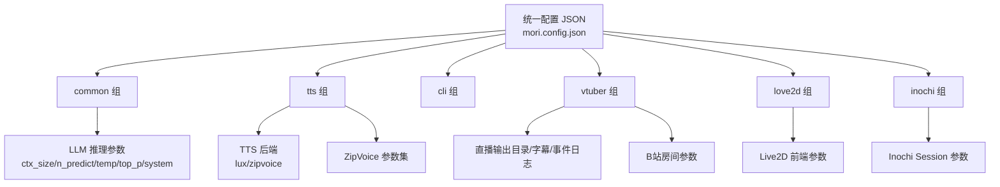
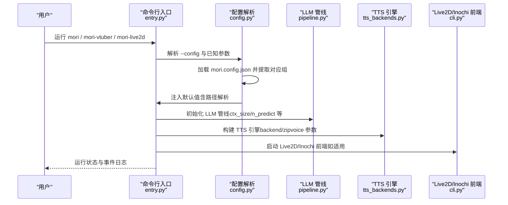
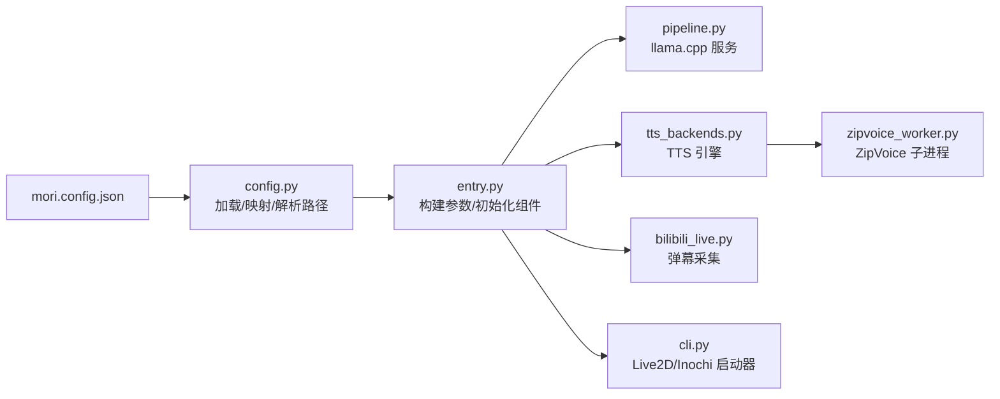

# 配置参考

<cite>
**本文引用的文件**
- [mori.config.json](file://mori.config.json)
- [config.py](file://mori_runtime/config.py)
- [entry.py](file://mori_runtime/entry.py)
- [pipeline.py](file://mori_llm/pipeline.py)
- [tts_backends.py](file://mori_runtime/tts_backends.py)
- [lux_tts.py](file://mori_tts/lux_tts.py)
- [zipvoice_worker.py](file://mori_runtime/zipvoice_worker.py)
- [bilibili_live.py](file://mori_live_stream/bilibili_live.py)
- [cli.py](file://mori_live2d/cli.py)
</cite>

## 目录
1. [简介](#简介)
2. [项目结构](#项目结构)
3. [核心组件](#核心组件)
4. [架构总览](#架构总览)
5. [详细组件分析](#详细组件分析)
6. [依赖分析](#依赖分析)
7. [性能考虑](#性能考虑)
8. [故障排查指南](#故障排查指南)
9. [结论](#结论)
10. [附录](#附录)

## 简介
本文件为 Mori 系统的配置参考文档，覆盖运行时配置、内存配置、LLM 配置、TTS 配置、Live2D/Love2D/Inochi 启动器配置等。内容包括：
- 所有可配置键的用途、数据类型、默认值与取值范围
- 配置文件示例与推荐设置
- 环境变量与命令行参数映射
- 配置优先级与覆盖规则
- 配置验证与错误检查机制
- 常见场景最佳实践与性能调优
- 变更重启要求与热更新支持
- 配置迁移与备份恢复建议

## 项目结构
Mori 的统一配置采用单个 JSON 文件集中管理，按功能分组：
- common：通用运行参数（工作目录、模型路径、推理参数）
- tts：文本转语音参数（后端选择、设备、线程、ZipVoice 参数等）
- cli：命令行模式输出目录与中断策略
- vtuber：直播模式（B站弹幕采集、字幕、事件日志、打印到终端）
- love2d / inochi：Live2D 前端启动器参数

图表来源
- [mori.config.json:1-83](file://mori.config.json#L1-L83)
- [config.py:11-98](file://mori_runtime/config.py#L11-L98)

章节来源
- [mori.config.json:1-83](file://mori.config.json#L1-L83)
- [config.py:11-98](file://mori_runtime/config.py#L11-L98)

## 核心组件
本节给出各配置组的关键键及其语义、类型、默认值与取值范围。

- 通用（common）
  - workdir：字符串，工作目录，默认当前目录
  - llama_bin_dir：字符串，llama.cpp 二进制目录路径
  - chat_model / embed_model：字符串，聊天与嵌入模型路径
  - ctx_size：整数，上下文长度，默认 8192
  - n_predict：整数，最大生成长度，默认 512
  - temp：浮点数，温度，默认 0.7
  - top_p：浮点数，核采样概率，默认 0.9
  - system：字符串，系统提示词

- 文本转语音（tts）
  - enabled：布尔，是否启用 TTS，默认 true
  - backend：字符串，后端选择，"lux" 或 "zipvoice"
  - model：字符串，后端 lux 使用的模型引用或本地路径
  - device：字符串，设备选择，"auto"/"cpu"/"cuda"/"mps"/"metal"
  - threads：整数，后端 lux 的 CPU 线程数
  - prompt_wav：字符串，参考音频路径
  - prompt_duration：浮点数，编码时长（秒）
  - prompt_rms：浮点数，目标 RMS
  - num_steps：整数，采样步数
  - guidance_scale：浮点数，引导强度
  - t_shift：浮点数，时间位移
  - speed：浮点数，播放速度
  - return_smooth：布尔，返回平滑输出
  - zipvoice_*：ZipVoice 专用参数集合（详见下文）

- CLI 模式（cli）
  - audio_dir：字符串，音频输出目录（相对 workdir 时）
  - interrupt_policy：字符串，中断策略，"priority"/"always"/"never"

- VTuber 模式（vtuber）
  - live_dir：字符串，直播输出根目录
  - subtitle_file：字符串，字幕文件名（空表示禁用）
  - event_log：字符串，事件日志文件名
  - print_to_stdout：布尔，是否同时打印到标准输出
  - bilibili_room_id：整数，房间 ID（0 表示禁用）
  - bilibili_room_url：字符串，房间 URL（可解析）
  - bilibili_interval：浮点数，轮询间隔（秒）
  - bilibili_catchup：整数，启动时回放最近消息条数
  - bilibili_exit_when_offline：布尔，离线时退出
  - bilibili_live_check_interval：浮点数，离线检测间隔（秒）
  - interrupt_policy：字符串，中断策略

- Live2D 启动器（love2d）
  - tts：布尔，是否启用 TTS
  - love_bin：字符串，Love2D 可执行程序路径
  - puppet：字符串，Live2D Puppet 路径
  - mapping：字符串，参数映射文件路径
  - mouse_look：字符串，鼠标视角控制
  - skip_prepare：布尔，跳过准备阶段

- Inochi 启动器（inochi）
  - inochi_root：字符串，Inochi2D 安装根目录
  - inochi_bin：字符串，Inochi Session 可执行程序路径
  - inochi_x11：布尔，强制 X11 显示驱动

章节来源
- [mori.config.json:3-82](file://mori.config.json#L3-L82)
- [entry.py:582-820](file://mori_runtime/entry.py#L582-L820)
- [config.py:11-98](file://mori_runtime/config.py#L11-L98)

## 架构总览
配置加载与应用流程如下：

图表来源
- [entry.py:796-1084](file://mori_runtime/entry.py#L796-L1084)
- [config.py:188-270](file://mori_runtime/config.py#L188-L270)
- [pipeline.py:307-582](file://mori_llm/pipeline.py#L307-L582)
- [tts_backends.py:525-760](file://mori_runtime/tts_backends.py#L525-L760)
- [cli.py:57-125](file://mori_live2d/cli.py#L57-L125)

## 详细组件分析

### LLM 配置（llama.cpp 服务）
- 关键参数
  - ctx_size：上下文长度（默认 8192）
  - n_predict：最大生成长度（默认 512）
  - temp：温度（默认 0.7）
  - top_p：核采样概率（默认 0.9）
  - system：系统提示词（默认内置中文提示）
  - large_ctx_size/embed_ctx_size：内部管线使用
  - large_gpu_layers/embed_gpu_layers：GPU 分层加载策略
  - enable_jinja：是否启用模板渲染（嵌入模型禁用）
  - api_key：可选 API Key
- 启动行为
  - 自动寻找 llama-server 并启动
  - 支持草稿模型与推理加速参数（通过 SpecConfig）
  - 提供同步/流式生成接口

章节来源
- [pipeline.py:56-306](file://mori_llm/pipeline.py#L56-L306)
- [pipeline.py:307-582](file://mori_llm/pipeline.py#L307-L582)
- [entry.py:848-861](file://mori_runtime/entry.py#L848-L861)

### TTS 配置（LuxTTS 与 ZipVoice）
- LuxTTS（backend=lux）
  - model：HF 仓库或本地路径
  - device：auto/cpu/cuda/mps/metal
  - threads：CPU 线程数
  - prompt_wav：参考音频（必填）
  - prompt_duration/prompt_rms：编码参数
  - num_steps/guidance_scale/t_shift/speed：采样参数
  - return_smooth：返回平滑输出
- ZipVoice（backend=zipvoice）
  - zipvoice_model_type：zipvoice / zipvoice_distill
  - zipvoice_model_dir/checkpoint_name：模型目录与权重文件
  - zipvoice_python_bin/repo：ZipVoice 仓库与 Python 可执行
  - zh/ja 固定提示：prompt_text + prompt_wav 成对出现
  - zh/ja tokenizer/lang：路由语言与分词器
  - remove_long_sil：去除长静音
  - num_thread：ZipVoice 工作进程线程数
  - lang_detector/lang_min_conf：语言检测策略与阈值
  - prompt_manifest/prompt_policy：提示词池与选择策略
  - quality_profile/num_steps/guidance_scale/t_shift/speed/return_smooth：合成质量档位与覆盖
  - vocoder_profile/vocoder_model：声码器档位与模型

章节来源
- [lux_tts.py:11-171](file://mori_tts/lux_tts.py#L11-L171)
- [tts_backends.py:17-647](file://mori_runtime/tts_backends.py#L17-L647)
- [zipvoice_worker.py:235-729](file://mori_runtime/zipvoice_worker.py#L235-L729)
- [entry.py:865-962](file://mori_runtime/entry.py#L865-L962)

### VTuber 与 B站直播集成
- 房间参数
  - room_id/url：二选一，支持从 URL 解析房间号
  - interval/catchup：轮询间隔与启动回放条数
  - exit_when_offline/live_check_interval：离线退出与检测间隔
- 输出
  - live_dir/subtitle_file/event_log/print_to_stdout
- 中断策略
  - priority/always/never 控制打断行为

章节来源
- [bilibili_live.py:93-221](file://mori_live_stream/bilibili_live.py#L93-L221)
- [entry.py:806-829](file://mori_runtime/entry.py#L806-L829)
- [entry.py:998-1007](file://mori_runtime/entry.py#L998-L1007)

### Live2D/Inochi 启动器配置
- Love2D
  - love_bin：Love2D 可执行
  - puppet/mapping：Puppet 与参数映射
  - mouse_look/skip_prepare：交互与准备阶段
- Inochi Session
  - inochi_root/bin/x11：安装根目录、可执行与 X11 强制

章节来源
- [cli.py:20-125](file://mori_live2d/cli.py#L20-L125)
- [mori.config.json:69-82](file://mori.config.json#L69-L82)

## 依赖分析
- 配置来源与解析
  - 统一 JSON 配置文件（mori.config.json）
  - 运行时通过 config.py 将 JSON 键映射到命令行参数，并解析相对路径
- 参数注入顺序
  - 1) 读取 --config 指定路径或自动发现
  - 2) 依据运行模式（cli/vtuber/love2d/inochi）提取对应组
  - 3) 解析相对路径（workdir、模型、prompt 等）
  - 4) 设置 argparse 默认值
- 依赖关系
  - entry.py 依赖 config.py、pipeline.py、tts_backends.py
  - tts_backends.py 依赖 zipvoice_worker.py（子进程）
  - bilibili_live.py 依赖 Lua 模块（mori_live_stream）

图表来源
- [config.py:188-270](file://mori_runtime/config.py#L188-L270)
- [entry.py:796-1084](file://mori_runtime/entry.py#L796-L1084)
- [pipeline.py:307-582](file://mori_llm/pipeline.py#L307-L582)
- [tts_backends.py:525-760](file://mori_runtime/tts_backends.py#L525-L760)
- [zipvoice_worker.py:446-729](file://mori_runtime/zipvoice_worker.py#L446-L729)
- [bilibili_live.py:93-221](file://mori_live_stream/bilibili_live.py#L93-L221)
- [cli.py:57-125](file://mori_live2d/cli.py#L57-L125)

## 性能考虑
- LLM 推理
  - ctx_size：越大上下文越强但显存占用更高
  - n_predict：限制生成长度以控制延迟
  - large_gpu_layers：在 GPU 上加载更多层可提升吞吐
  - enable_jinja：仅聊天模型启用，嵌入模型禁用
- TTS
  - LuxTTS：threads 增加可提升 CPU 吞吐，但受 I/O 与模型大小限制
  - ZipVoice：num_steps/guidance_scale/t_shift/speed 影响合成质量与速度；quality_profile 为快速通道
  - remove_long_sil：去除长静音会增加后处理开销
  - vocoder_profile：lux_48k 输出更清晰但需要额外依赖
- Live2D/Inochi
  - puppet/mapping 参数映射越复杂，前端渲染开销越高
  - mouse_look/skip_prepare 影响交互体验与启动时间

[本节为通用指导，不直接分析具体文件]

## 故障排查指南
- 配置文件未找到
  - 现象：找不到配置文件
  - 排查：确认 --config 指向有效路径；或确保 mori.config.json 在当前目录或仓库根目录
- LLM 服务启动失败
  - 现象：llama-server 无法启动或提前退出
  - 排查：检查 llama-server 路径、模型路径存在性；查看启动超时与健康检查
- TTS 后端问题
  - LuxTTS：缺少依赖或设备不可用；prompt_wav 缺失
  - ZipVoice：python_bin/repo/model_dir/checkpoint 缺失；prompt_manifest 为空；固定 zh/ja 提示未成对
- B站弹幕采集
  - 现象：无法解析房间号或轮询失败
  - 排查：确认 room_id/url 正确；网络与 UA 设置

章节来源
- [config.py:160-185](file://mori_runtime/config.py#L160-L185)
- [pipeline.py:105-174](file://mori_llm/pipeline.py#L105-L174)
- [tts_backends.py:619-647](file://mori_runtime/tts_backends.py#L619-L647)
- [zipvoice_worker.py:455-469](file://mori_runtime/zipvoice_worker.py#L455-L469)
- [bilibili_live.py:147-152](file://mori_live_stream/bilibili_live.py#L147-L152)

## 结论
- 统一配置文件是 Mori 的核心入口，建议集中管理并在 CI/CD 中校验
- 不同运行模式共享 common 组参数，避免重复配置
- TTS 后端切换需配套资源与提示词准备
- 生产部署建议开启事件日志与字幕文件以便排障

[本节为总结性内容，不直接分析具体文件]

## 附录

### 配置优先级与覆盖规则
- 命令行参数优先于配置文件
- 运行模式决定提取的配置组（cli/vtuber/love2d/inochi）
- 路径解析：相对路径基于配置文件所在目录解析
- 特殊键覆盖：vtuber 组中的 bilibili_exit_when_offline 会被重命名为 exit_when_offline

章节来源
- [config.py:239-270](file://mori_runtime/config.py#L239-L270)
- [entry.py:806-829](file://mori_runtime/entry.py#L806-L829)

### 环境变量与命令行映射
- 环境变量
  - LD_LIBRARY_PATH：llama.cpp 服务启动时追加库路径
  - SDL_VIDEODRIVER：Inochi Session X11 强制
- 命令行参数
  - --config：指定配置文件路径
  - --workdir：工作目录
  - --llama-bin-dir：llama.cpp 二进制目录
  - --chat-model/--embed-model：模型路径
  - --ctx-size/--n-predict/--temp/--top-p/--system：LLM 推理参数
  - --tts/--tts-backend/--tts-model/--tts-device/--tts-threads/--tts-prompt-wav 等：TTS 参数
  - --audio-dir/--interrupt-policy：CLI 模式
  - --live-dir/--subtitle-file/--event-log/--print-to-stdout：VTuber 模式
  - --bilibili-*：B站房间参数
  - Live2D/Inochi：love_bin/puppet/mapping/inochi_* 等

章节来源
- [pipeline.py:145-148](file://mori_llm/pipeline.py#L145-L148)
- [entry.py:582-820](file://mori_runtime/entry.py#L582-L820)
- [cli.py:88-93](file://mori_live2d/cli.py#L88-L93)

### 配置验证与错误检查机制
- 配置文件格式
  - 必须为 JSON 对象；否则抛出异常
- 路径解析
  - 相对路径基于配置文件目录解析；绝对路径保持不变
  - prompt_wav 缺省时尝试从仓库内 mori_tts/prompt.wav 自动补全
- TTS 后端校验
  - backend=zipvoice：必须提供 prompt_manifest 或 zh/ja 固定提示（成对）
  - backend=lux：必须提供 prompt_wav
- ZipVoice 工作进程
  - 启动失败或非就绪消息将触发异常
- B站房间
  - URL 解析失败将拒绝启动

章节来源
- [config.py:188-202](file://mori_runtime/config.py#L188-L202)
- [config.py:134-157](file://mori_runtime/config.py#L134-L157)
- [config.py:258-269](file://mori_runtime/config.py#L258-L269)
- [entry.py:880-889](file://mori_runtime/entry.py#L880-L889)
- [zipvoice_worker.py:614-623](file://mori_runtime/zipvoice_worker.py#L614-L623)
- [bilibili_live.py:85-90](file://mori_live_stream/bilibili_live.py#L85-L90)

### 配置示例与推荐设置
- 示例文件位置：mori.config.json
- 推荐设置要点
  - common：根据硬件设定 ctx_size 与 n_predict；system 提示词按场景定制
  - tts：优先使用 zipvoice 并准备 prompt_manifest；lux 用于兼容旧版
  - vtuber：开启 event_log 与 subtitle_file；合理设置 bilibili_interval 与 catchup
  - Live2D/Inochi：确保 puppet 与 mapping 存在；X11 场景设置 inochi_x11

章节来源
- [mori.config.json:1-83](file://mori.config.json#L1-L83)

### 变更重启要求与热更新支持
- LLM 与 TTS 引擎：通常需要重启以应用模型路径、设备、线程等变更
- 配置热更新：当前实现未提供热重载；建议通过外部进程管理器（如 systemd/docker）进行优雅重启
- 日志与事件：事件日志与字幕文件可滚动保留，便于排障

[本节为通用指导，不直接分析具体文件]

### 配置迁移与备份恢复
- 迁移建议
  - 保留历史版本的 mori.config.json 作为快照
  - 新增键时先在测试环境验证，再批量替换
- 备份
  - 备份 workdir 下的 memory、live 等目录
  - 记录自定义的 prompt_manifest 与模型权重路径
- 恢复
  - 恢复配置文件与模型权重
  - 重新启动服务并检查事件日志

[本节为通用指导，不直接分析具体文件]