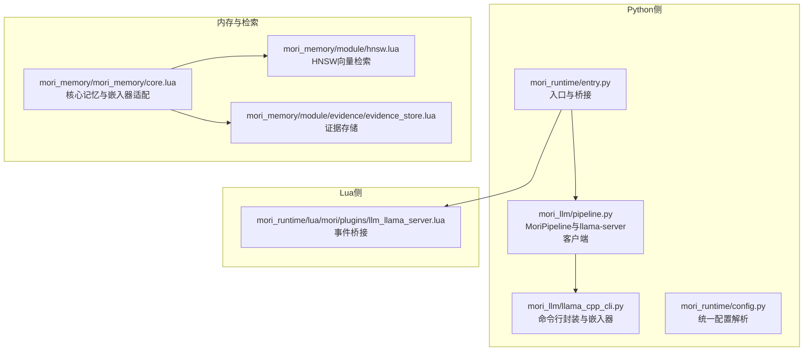
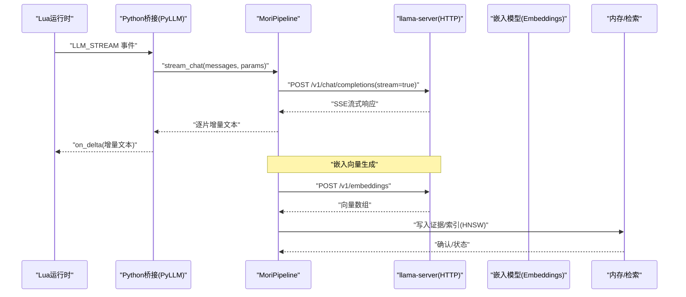
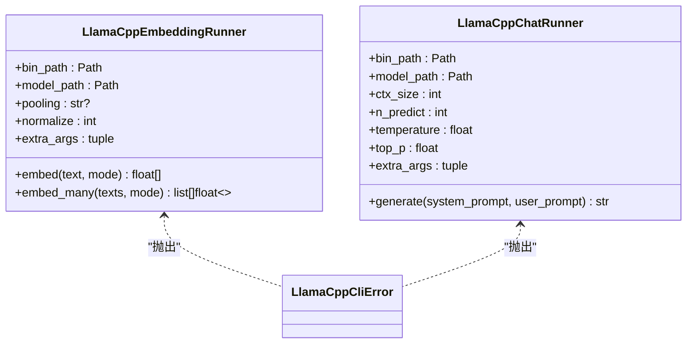
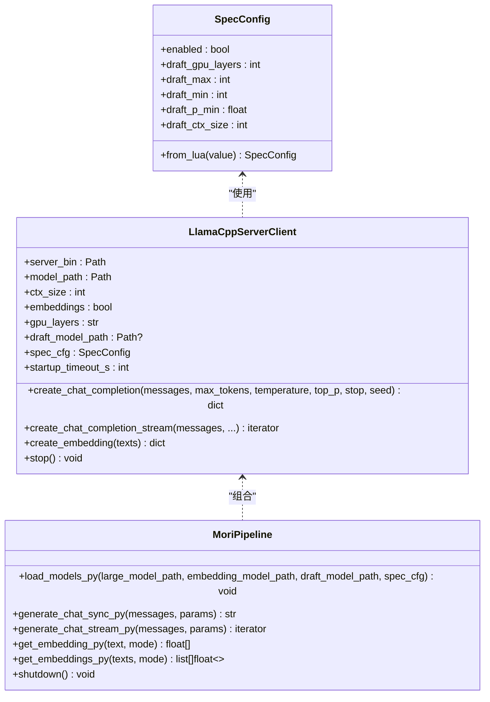
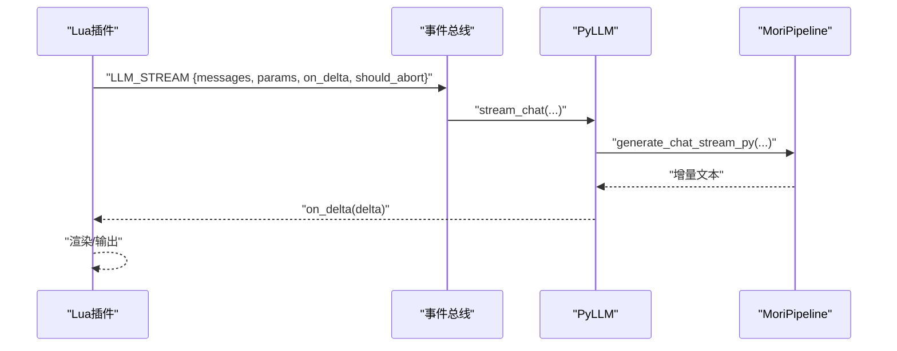
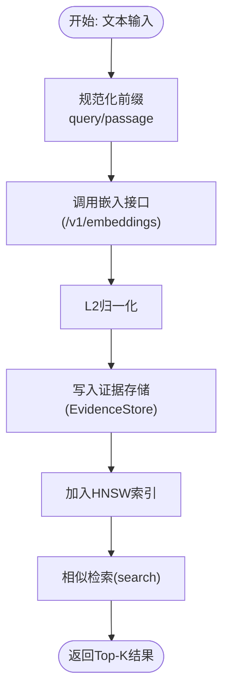
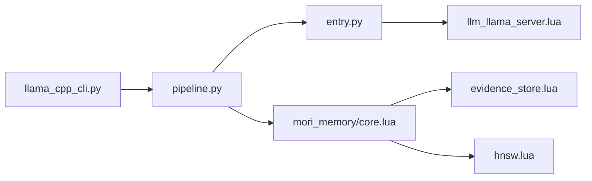

# LLM集成

<cite>
**本文档引用的文件**
- [mori_llm/__init__.py](file://mori_llm/__init__.py)
- [mori_llm/llama_cpp_cli.py](file://mori_llm/llama_cpp_cli.py)
- [mori_llm/pipeline.py](file://mori_llm/pipeline.py)
- [mori_runtime/lua/mori/plugins/llm_llama_server.lua](file://mori_runtime/lua/mori/plugins/llm_llama_server.lua)
- [mori_runtime/config.py](file://mori_runtime/config.py)
- [mori_runtime/entry.py](file://mori_runtime/entry.py)
- [mori_memory/module/evidence/evidence_store.lua](file://mori_memory/module/evidence/evidence_store.lua)
- [mori_memory/module/hnsw.lua](file://mori_memory/module/hnsw.lua)
- [mori_memory/mori_memory/core.lua](file://mori_memory/mori_memory/core.lua)
</cite>

## 目录
1. [简介](#简介)
2. [项目结构](#项目结构)
3. [核心组件](#核心组件)
4. [架构总览](#架构总览)
5. [详细组件分析](#详细组件分析)
6. [依赖关系分析](#依赖关系分析)
7. [性能考量](#性能考量)
8. [故障排查指南](#故障排查指南)
9. [结论](#结论)
10. [附录](#附录)

## 简介
本文件面向Mori的LLM集成系统，围绕以下目标展开：  
- 集成llama.cpp，覆盖模型加载、推理调用、嵌入向量生成、流式输出与错误处理。  
- 解释MoriPipeline设计理念：上下文管理、流式输出、参数化推理、错误处理与生命周期管理。  
- 说明嵌入向量的生成、归一化、存储与检索优化（基于HNSW）。  
- 总结推理优化技术：提示词模板、温度与采样策略、草稿模型（Speculative Decoding）等。  
- 提供模型管理能力：多模型支持、版本控制与热更新建议。  
- 给出LLM相关配置参数与性能调优指南，并说明与记忆系统的集成方式与最佳实践。

## 项目结构
Mori的LLM集成主要由Python侧的mori_llm模块与Lua运行时桥接组成，配合内存与检索模块共同完成端到端的推理与记忆服务。

图示来源
- [mori_llm/llama_cpp_cli.py](file://mori_llm/llama_cpp_cli.py)
- [mori_llm/pipeline.py](file://mori_llm/pipeline.py)
- [mori_runtime/config.py](file://mori_runtime/config.py)
- [mori_runtime/entry.py](file://mori_runtime/entry.py)
- [mori_runtime/lua/mori/plugins/llm_llama_server.lua](file://mori_runtime/lua/mori/plugins/llm_llama_server.lua)
- [mori_memory/mori_memory/core.lua](file://mori_memory/mori_memory/core.lua)
- [mori_memory/module/evidence/evidence_store.lua](file://mori_memory/module/evidence/evidence_store.lua)
- [mori_memory/module/hnsw.lua](file://mori_memory/module/hnsw.lua)

章节来源
- [mori_llm/__init__.py](file://mori_llm/__init__.py)
- [mori_llm/llama_cpp_cli.py](file://mori_llm/llama_cpp_cli.py)
- [mori_llm/pipeline.py](file://mori_llm/pipeline.py)
- [mori_runtime/config.py](file://mori_runtime/config.py)
- [mori_runtime/entry.py](file://mori_runtime/entry.py)
- [mori_runtime/lua/mori/plugins/llm_llama_server.lua](file://mori_runtime/lua/mori/plugins/llm_llama_server.lua)
- [mori_memory/mori_memory/core.lua](file://mori_memory/mori_memory/core.lua)
- [mori_memory/module/evidence/evidence_store.lua](file://mori_memory/module/evidence/evidence_store.lua)
- [mori_memory/module/hnsw.lua](file://mori_memory/module/hnsw.lua)

## 核心组件
- llama.cpp命令行封装与嵌入器：负责定位二进制、选择默认模型、执行嵌入与聊天推理、解析输出并抛出明确错误。
- llama-server客户端：以HTTP方式与llama.cpp server交互，支持同步与流式聊天、嵌入请求、健康检查与优雅关闭。
- MoriPipeline：统一的Python桥接层，负责模型加载、参数解析、消息格式化、流式输出、错误处理与进程生命周期管理。
- Lua桥接插件：接收Lua侧事件，调用Python侧流式推理接口。
- 内存与检索：提供嵌入器适配、证据存储、HNSW向量索引与检索，支撑上下文与召回。

章节来源
- [mori_llm/llama_cpp_cli.py](file://mori_llm/llama_cpp_cli.py)
- [mori_llm/pipeline.py](file://mori_llm/pipeline.py)
- [mori_runtime/lua/mori/plugins/llm_llama_server.lua](file://mori_runtime/lua/mori/plugins/llm_llama_server.lua)
- [mori_memory/mori_memory/core.lua](file://mori_memory/mori_memory/core.lua)
- [mori_memory/module/evidence/evidence_store.lua](file://mori_memory/module/evidence/evidence_store.lua)
- [mori_memory/module/hnsw.lua](file://mori_memory/module/hnsw.lua)

## 架构总览
下图展示从Lua事件到Python推理再到内存检索的整体流程。

图示来源
- [mori_runtime/lua/mori/plugins/llm_llama_server.lua](file://mori_runtime/lua/mori/plugins/llm_llama_server.lua)
- [mori_runtime/entry.py](file://mori_runtime/entry.py)
- [mori_llm/pipeline.py](file://mori_llm/pipeline.py)
- [mori_memory/mori_memory/core.lua](file://mori_memory/mori_memory/core.lua)

## 详细组件分析

### 组件A：llama.cpp命令行封装与嵌入器
- 功能要点
  - 二进制路径解析：支持显式传参、环境变量、默认路径探测与which查找。
  - 默认模型选择：按偏好与扩展名自动挑选聊天与嵌入模型。
  - 嵌入器：通过子进程调用llama-embedding，解析JSON输出，支持池化与归一化。
  - 聊天推理：通过llama-cli进行单轮对话，传递系统提示、温度、top_p、上下文大小等参数。
  - 错误处理：统一包装为可识别的运行时异常，便于上层捕获与恢复。

图示来源
- [mori_llm/llama_cpp_cli.py](file://mori_llm/llama_cpp_cli.py)

章节来源
- [mori_llm/llama_cpp_cli.py](file://mori_llm/llama_cpp_cli.py)

### 组件B：llama-server客户端与MoriPipeline
- 功能要点
  - 进程启动：自动寻找空闲端口、设置LD_LIBRARY_PATH、等待健康检查。
  - HTTP接口：封装聊天补全（同步/流式）、嵌入请求、健康检查与错误解析。
  - 流式输出：逐行解析SSE，提取delta或text字段，支持中断回调。
  - 参数化推理：支持max_tokens、temperature、top_p、stop、seed等。
  - 规范化与前缀：对嵌入输入进行模式前缀规范化，输出向量进行L2归一化。
  - 生命周期：注册退出钩子，确保进程优雅终止。

图示来源
- [mori_llm/pipeline.py](file://mori_llm/pipeline.py)

章节来源
- [mori_llm/pipeline.py](file://mori_llm/pipeline.py)

### 组件C：Lua桥接与事件流
- 功能要点
  - Lua侧监听“LLM_STREAM”事件，将消息与参数转发至Python侧。
  - Python侧PyLLM实现流式回调，逐片推送增量文本，支持中断。
  - 通过队列与锁保障线程安全，避免阻塞。

图示来源
- [mori_runtime/lua/mori/plugins/llm_llama_server.lua](file://mori_runtime/lua/mori/plugins/llm_llama_server.lua)
- [mori_runtime/entry.py](file://mori_runtime/entry.py)

章节来源
- [mori_runtime/lua/mori/plugins/llm_llama_server.lua](file://mori_runtime/lua/mori/plugins/llm_llama_server.lua)
- [mori_runtime/entry.py](file://mori_runtime/entry.py)

### 组件D：嵌入向量生成、存储与检索优化
- 嵌入生成
  - 通过MoriPipeline调用llama-server的/embeddings端点，返回浮点数组。
  - 对输入文本进行模式前缀规范化（query/passage），并对向量做L2归一化。
- 存储与检索
  - 证据存储模块维护已提交的记忆块、演员本地证据、作用域聚合、趋势候选与主题投影。
  - HNSW模块提供高效近邻检索，支持Cosine/内积/L2空间，可保存/加载索引、动态扩容、设置ef等。
  - 核心记忆模块提供默认嵌入器适配，优先使用工具函数，否则回退到默认实现。

图示来源
- [mori_llm/pipeline.py](file://mori_llm/pipeline.py)
- [mori_memory/mori_memory/core.lua](file://mori_memory/mori_memory/core.lua)
- [mori_memory/module/evidence/evidence_store.lua](file://mori_memory/module/evidence/evidence_store.lua)
- [mori_memory/module/hnsw.lua](file://mori_memory/module/hnsw.lua)

章节来源
- [mori_llm/pipeline.py](file://mori_llm/pipeline.py)
- [mori_memory/mori_memory/core.lua](file://mori_memory/mori_memory/core.lua)
- [mori_memory/module/evidence/evidence_store.lua](file://mori_memory/module/evidence/evidence_store.lua)
- [mori_memory/module/hnsw.lua](file://mori_memory/module/hnsw.lua)

### 组件E：推理优化技术
- 提示词模板与系统提示
  - 支持通过系统提示注入角色设定与上下文，结合“相关对话片段”等上下文增强。
- 温度与采样策略
  - 支持temperature与top_p参数，控制生成多样性与稳定性。
- 草稿模型（推测解码）
  - 通过SpecConfig启用草稿模型，配置草稿GPU层数、上下文大小、采样阈值与最大/最小步数，提升解码效率。

章节来源
- [mori_runtime/entry.py](file://mori_runtime/entry.py)
- [mori_llm/pipeline.py](file://mori_llm/pipeline.py)

### 组件F：模型管理与热更新
- 多模型支持
  - 通过不同模型路径分别加载大模型与嵌入模型，独立管理上下文大小与GPU分层。
- 版本控制与热更新
  - 通过重新加载模型实现“热切换”：先停止旧进程，再启动新模型，确保一致性。
- 草稿模型
  - 可选加载草稿模型以加速推理，适合高吞吐场景。

章节来源
- [mori_llm/pipeline.py](file://mori_llm/pipeline.py)

## 依赖关系分析
- Python侧依赖
  - mori_llm依赖llama.cpp二进制与模型文件；mori_runtime依赖mori_llm与配置模块。
  - 内存模块依赖HNSW原生库，需按脚本构建后方可使用。
- Lua侧依赖
  - 通过lupa绑定Lua与Python，桥接事件与回调。

图示来源
- [mori_llm/llama_cpp_cli.py](file://mori_llm/llama_cpp_cli.py)
- [mori_llm/pipeline.py](file://mori_llm/pipeline.py)
- [mori_runtime/entry.py](file://mori_runtime/entry.py)
- [mori_runtime/lua/mori/plugins/llm_llama_server.lua](file://mori_runtime/lua/mori/plugins/llm_llama_server.lua)
- [mori_memory/mori_memory/core.lua](file://mori_memory/mori_memory/core.lua)
- [mori_memory/module/evidence/evidence_store.lua](file://mori_memory/module/evidence/evidence_store.lua)
- [mori_memory/module/hnsw.lua](file://mori_memory/module/hnsw.lua)

章节来源
- [mori_llm/llama_cpp_cli.py](file://mori_llm/llama_cpp_cli.py)
- [mori_llm/pipeline.py](file://mori_llm/pipeline.py)
- [mori_runtime/entry.py](file://mori_runtime/entry.py)
- [mori_runtime/lua/mori/plugins/llm_llama_server.lua](file://mori_runtime/lua/mori/plugins/llm_llama_server.lua)
- [mori_memory/mori_memory/core.lua](file://mori_memory/mori_memory/core.lua)
- [mori_memory/module/evidence/evidence_store.lua](file://mori_memory/module/evidence/evidence_store.lua)
- [mori_memory/module/hnsw.lua](file://mori_memory/module/hnsw.lua)

## 性能考量
- GPU分层与上下文大小
  - 合理设置gpu_layers与ctx_size，平衡显存占用与上下文长度。
- 推测解码
  - 在支持的硬件上启用草稿模型，减少主模型解码步数，提高吞吐。
- 流式输出
  - 使用流式接口降低首字延迟，改善交互体验。
- 向量检索
  - HNSW ef_search与M参数影响召回质量与速度，需根据数据规模与查询延迟目标调优。
- 嵌入归一化
  - 归一化有助于Cosine相似度稳定，提升检索一致性。

## 故障排查指南
- 二进制与模型路径
  - 若找不到llama.cpp二进制或模型文件，检查LLAMA_CPP_BIN_DIR/LLAMA_CPP_DIR或显式传参。
- 进程启动失败
  - 查看启动超时与健康检查日志，确认端口冲突与依赖库路径（LD_LIBRARY_PATH）。
- 嵌入输出异常
  - 检查输出JSON解析与前缀规范化逻辑，确保输入非空且符合预期格式。
- 流式中断
  - Lua回调异常会触发流式关闭，检查回调实现与should_abort逻辑。
- 内存/HNSW不可用
  - 若原生模块未构建，会返回不可用状态，按脚本构建后再试。

章节来源
- [mori_llm/llama_cpp_cli.py](file://mori_llm/llama_cpp_cli.py)
- [mori_llm/pipeline.py](file://mori_llm/pipeline.py)
- [mori_runtime/lua/mori/plugins/llm_llama_server.lua](file://mori_runtime/lua/mori/plugins/llm_llama_server.lua)
- [mori_memory/module/hnsw.lua](file://mori_memory/module/hnsw.lua)

## 结论
Mori的LLM集成以mori_llm为核心，结合llama.cpp命令行与服务器模式，提供稳定的推理与嵌入能力；通过MoriPipeline统一参数与生命周期管理，配合Lua桥接实现流畅的流式交互；内存与检索模块则为上下文与知识召回提供基础设施。整体设计兼顾易用性与性能，支持温度/采样策略、推测解码与向量检索优化，满足多场景应用需求。

## 附录

### LLM相关配置参数与调优建议
- 通用参数
  - llama-bin-dir：llama.cpp二进制目录
  - chat-model/embed-model：聊天与嵌入模型路径
  - ctx-size：上下文大小（0表示默认）
  - n-predict：最大生成长度
  - temp/top-p：温度与核采样
  - system：基础系统提示
- 运行参数
  - tts相关参数用于TTS链路（与LLM协同）
- 调优建议
  - 小模型或低显存：降低ctx-size与gpu_layers；增大temp以提升多样性
  - 高吞吐：启用推测解码（草稿模型），调整ef_search与M
  - 低延迟：开启流式输出，缩短n-predict，合理设置top_p

章节来源
- [mori_runtime/config.py](file://mori_runtime/config.py)
- [mori_runtime/entry.py](file://mori_runtime/entry.py)
- [mori_llm/pipeline.py](file://mori_llm/pipeline.py)