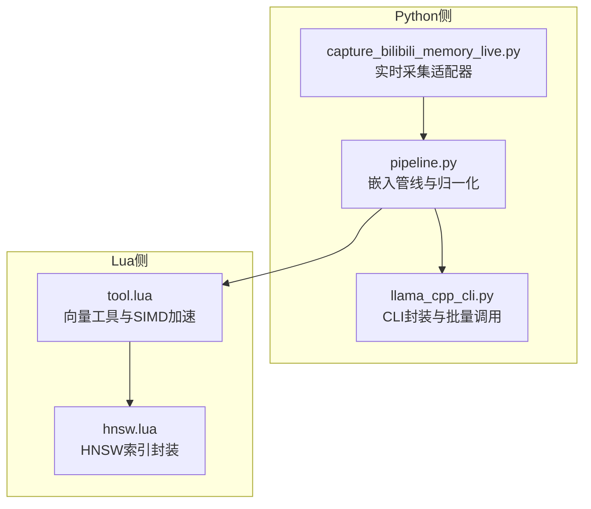
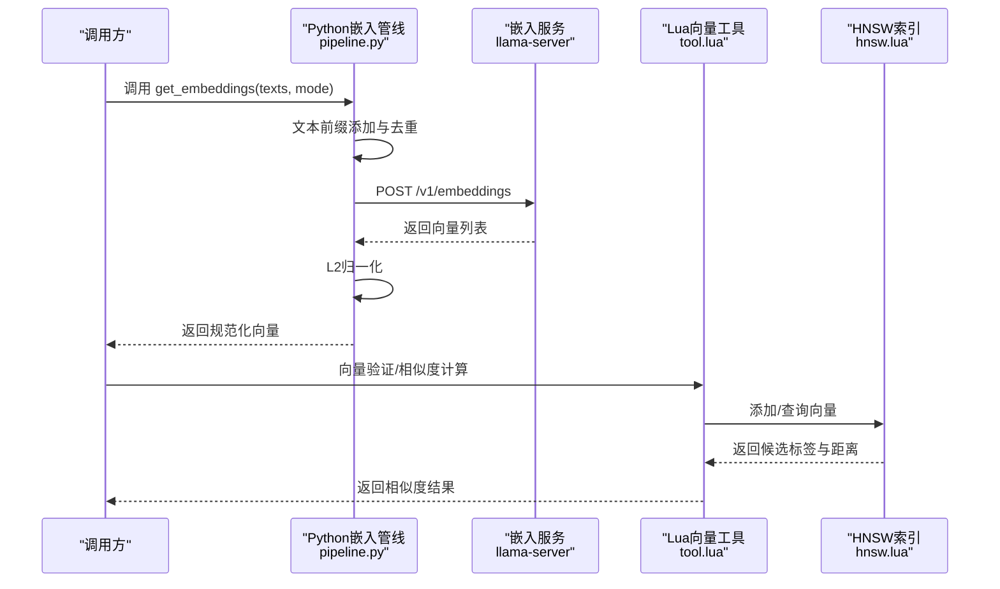
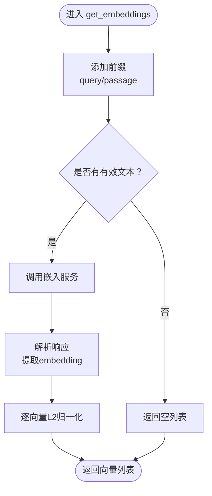
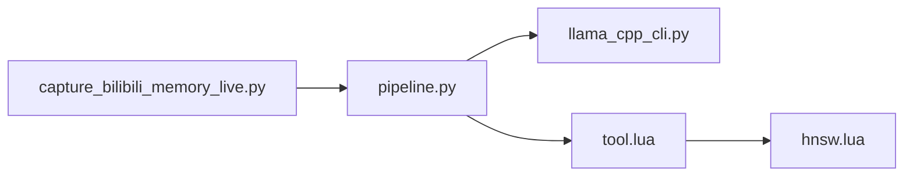

# 嵌入向量系统

<cite>
**本文引用的文件**
- [pipeline.py](file://mori_llm/pipeline.py)
- [llama_cpp_cli.py](file://mori_llm/llama_cpp_cli.py)
- [tool.lua](file://mori_memory/module/tool.lua)
- [hnsw.lua](file://mori_memory/module/hnsw.lua)
- [capture_bilibili_memory_live.py](file://scripts/capture_bilibili_memory_live.py)
- [level3_benchmark_report_20260324.md](file://mori_memory/benchmarks/results/level3_benchmark_report_20260324.md)
</cite>

## 目录
1. [简介](#简介)
2. [项目结构](#项目结构)
3. [核心组件](#核心组件)
4. [架构总览](#架构总览)
5. [详细组件分析](#详细组件分析)
6. [依赖分析](#依赖分析)
7. [性能考量](#性能考量)
8. [故障排查指南](#故障排查指南)
9. [结论](#结论)
10. [附录](#附录)

## 简介
本文件面向Mori项目的嵌入向量系统，系统性阐述get_embedding与get_embeddings方法的实现原理与运行机制，覆盖文本前缀添加、向量归一化、批量处理、查询与段落模式（query/passage）差异、文本预处理、向量生成与存储检索优化、以及评估与基准测试方法。文档同时给出向量相似度计算、聚类分析与语义搜索的实践指南，帮助读者在真实场景中高效落地。

## 项目结构
Mori的嵌入向量系统由三层协作构成：
- Python侧嵌入管线：负责文本预处理、调用嵌入服务、向量归一化与批量处理。
- Lua侧工具库：提供向量验证、相似度计算、二进制编解码、内存迭代与检索接口。
- 本地索引与存储：通过HNSW近似最近邻索引与二进制向量文件实现高维向量的快速检索与持久化。

图表来源
- [pipeline.py:352-460](file://mori_llm/pipeline.py#L352-L460)
- [llama_cpp_cli.py:90-159](file://mori_llm/llama_cpp_cli.py#L90-L159)
- [tool.lua:174-237](file://mori_memory/module/tool.lua#L174-L237)
- [hnsw.lua:171-307](file://mori_memory/module/hnsw.lua#L171-L307)

章节来源
- [pipeline.py:352-460](file://mori_llm/pipeline.py#L352-L460)
- [llama_cpp_cli.py:90-159](file://mori_llm/llama_cpp_cli.py#L90-L159)
- [tool.lua:174-237](file://mori_memory/module/tool.lua#L174-L237)
- [hnsw.lua:171-307](file://mori_memory/module/hnsw.lua#L171-L307)

## 核心组件
- get_embedding/get_embeddings（Python侧）
  - 文本前缀添加：根据mode自动添加“query: ”或“passage: ”前缀，避免重复前缀。
  - 批量处理：将Lua序列转换为Python列表，统一调用嵌入服务。
  - 归一化：对输出向量进行L2归一化，确保余弦相似度等度量稳定。
  - 错误处理：对空输入、无效响应进行健壮性处理。
- get_embedding/get_embeddings（Lua侧）
  - 类型桥接：将Python返回的向量转换为Lua表，兼容不同索引风格。
  - 模式化接口：提供query/passage两种模式的便捷入口。
- 向量工具（Lua侧）
  - 验证与维度检查：确保向量维度一致，避免维度不匹配。
  - 相似度计算：支持点积与余弦相似度，并提供SIMD加速路径。
  - 序列化：向量转二进制与二进制转向量，便于持久化与传输。
- HNSW索引（Lua侧）
  - 支持L2、内积、余弦三种距离空间。
  - 提供增删改查、容量调整、保存加载等操作。
- 实时采集适配器（Python侧）
  - 将弹幕消息转换为上下文块，调用嵌入生成并写入内存图。

章节来源
- [pipeline.py:366-374](file://mori_llm/pipeline.py#L366-L374)
- [pipeline.py:436-460](file://mori_llm/pipeline.py#L436-L460)
- [tool.lua:174-237](file://mori_memory/module/tool.lua#L174-L237)
- [tool.lua:555-725](file://mori_memory/module/tool.lua#L555-L725)
- [tool.lua:729-764](file://mori_memory/module/tool.lua#L729-L764)
- [hnsw.lua:15-52](file://mori_memory/module/hnsw.lua#L15-L52)
- [hnsw.lua:255-307](file://mori_memory/module/hnsw.lua#L255-L307)
- [capture_bilibili_memory_live.py:389-423](file://scripts/capture_bilibili_memory_live.py#L389-L423)

## 架构总览
嵌入生成与检索的关键流程如下：

图表来源
- [pipeline.py:436-460](file://mori_llm/pipeline.py#L436-L460)
- [llama_cpp_cli.py:292-294](file://mori_llm/llama_cpp_cli.py#L292-L294)
- [tool.lua:174-237](file://mori_memory/module/tool.lua#L174-L237)
- [hnsw.lua:288-307](file://mori_memory/module/hnsw.lua#L288-L307)

## 详细组件分析

### get_embedding 与 get_embeddings 方法实现
- 文本前缀策略
  - 自动识别并避免重复前缀，按mode选择“query: ”或“passage: ”。
  - 保证嵌入模型对查询与段落的语义差异进行区分。
- 批量处理
  - 使用迭代器将Lua序列转换为Python列表，提升兼容性与性能。
  - 对空输入返回空列表，避免异常传播。
- 归一化
  - 对每个向量进行L2归一化，确保余弦相似度稳定。
  - 零向量保护：若范数为非正值，保持原向量不变。
- 响应解析
  - 解析嵌入服务返回的JSON，提取embedding字段。
  - 对非列表或空数据进行容错处理。

图表来源
- [pipeline.py:436-460](file://mori_llm/pipeline.py#L436-L460)
- [pipeline.py:366-374](file://mori_llm/pipeline.py#L366-L374)
- [pipeline.py:356-364](file://mori_llm/pipeline.py#L356-L364)

章节来源
- [pipeline.py:366-374](file://mori_llm/pipeline.py#L366-L374)
- [pipeline.py:436-460](file://mori_llm/pipeline.py#L436-L460)
- [pipeline.py:356-364](file://mori_llm/pipeline.py#L356-L364)

### 查询与段落模式（query/passage）区别与应用
- 模式差异
  - query：强调检索意图，适合用户查询、问题、关键词等。
  - passage：强调候选内容，适合长文本、段落、摘要等。
- 应用场景
  - 问答系统：query为问题，passage为知识库段落。
  - 语义搜索：query为用户输入，passage为文档片段。
  - 推荐系统：query为用户画像，passage为物品描述。
- 文本预处理
  - 自动添加前缀，避免重复；确保模式一致性。
  - 与下游相似度计算（余弦）配合，提升检索效果。

章节来源
- [pipeline.py:366-374](file://mori_llm/pipeline.py#L366-L374)
- [tool.lua:174-187](file://mori_memory/module/tool.lua#L174-L187)

### 向量生成流程：从文本到数值向量
- 文本编码
  - 前缀添加与清洗，确保输入规范。
  - 批量提交至嵌入服务，获取原始浮点向量。
- 数值向量
  - L2归一化，确保向量长度为1。
  - 维度校验与类型转换，保证后续计算稳定。
- 存储与检索
  - 二进制序列化，降低存储开销。
  - HNSW索引构建，支持大规模高维向量检索。

章节来源
- [pipeline.py:436-460](file://mori_llm/pipeline.py#L436-L460)
- [tool.lua:729-764](file://mori_memory/module/tool.lua#L729-L764)
- [hnsw.lua:171-194](file://mori_memory/module/hnsw.lua#L171-L194)

### 向量存储与检索优化
- 维度标准化
  - 统一维度检查，避免跨模型维度不一致导致的错误。
- 精度控制
  - 使用float类型进行二进制存储，兼顾精度与体积。
- 内存管理
  - 采用SIMD加速的点积与余弦相似度计算，减少CPU负担。
  - HNSW索引支持动态容量与删除标记，便于增量更新。
- 持久化
  - 向量二进制文件与索引文件分离，便于备份与迁移。

章节来源
- [tool.lua:160-170](file://mori_memory/module/tool.lua#L160-L170)
- [tool.lua:555-725](file://mori_memory/module/tool.lua#L555-L725)
- [tool.lua:729-764](file://mori_memory/module/tool.lua#L729-L764)
- [hnsw.lua:171-194](file://mori_memory/module/hnsw.lua#L171-L194)
- [hnsw.lua:255-307](file://mori_memory/module/hnsw.lua#L255-L307)

### 向量相似度计算、聚类分析与语义搜索
- 相似度计算
  - 支持点积与余弦相似度，SIMD加速路径提升吞吐。
  - 距离空间可选：L2、内积、余弦，适配不同度量需求。
- 聚类分析
  - 基于向量相似度的层次聚类或基于密度的聚类（如DBSCAN）可用于主题发现。
  - 结合HNSW检索结果，提升聚类稳定性。
- 语义搜索
  - query向量与候选向量进行相似度排序，返回Top-K结果。
  - 可结合过滤条件（如时间窗口、来源）进一步精排。

章节来源
- [tool.lua:619-725](file://mori_memory/module/tool.lua#L619-L725)
- [hnsw.lua:146-160](file://mori_memory/module/hnsw.lua#L146-L160)
- [hnsw.lua:288-307](file://mori_memory/module/hnsw.lua#L288-L307)

### 实时采集与嵌入集成
- 采集适配器
  - 将弹幕消息转换为上下文块，调用嵌入生成并写入内存图。
  - 支持参数化配置（上下文大小、GPU层数、启动超时）。
- 与嵌入管线对接
  - 通过Python侧适配器调用pipeline，实现端到端流水线。

章节来源
- [capture_bilibili_memory_live.py:389-423](file://scripts/capture_bilibili_memory_live.py#L389-L423)
- [capture_bilibili_memory_live.py:439-446](file://scripts/capture_bilibili_memory_live.py#L439-L446)

## 依赖分析
- Python侧
  - pipeline.py依赖llama_cpp_cli.py提供的嵌入服务调用能力。
  - capture_bilibili_memory_live.py依赖pipeline.py与mori_memory桥接模块。
- Lua侧
  - tool.lua依赖SIMD库与FFI指针，提供高性能向量运算。
  - hnsw.lua封装C扩展，提供HNSW索引的创建、保存、查询等能力。
- 交互关系
  - Python侧负责生成与归一化，Lua侧负责验证、相似度与索引检索。

图表来源
- [pipeline.py:352-460](file://mori_llm/pipeline.py#L352-L460)
- [llama_cpp_cli.py:90-159](file://mori_llm/llama_cpp_cli.py#L90-L159)
- [capture_bilibili_memory_live.py:439-446](file://scripts/capture_bilibili_memory_live.py#L439-L446)
- [tool.lua:174-237](file://mori_memory/module/tool.lua#L174-L237)
- [hnsw.lua:171-307](file://mori_memory/module/hnsw.lua#L171-L307)

章节来源
- [pipeline.py:352-460](file://mori_llm/pipeline.py#L352-L460)
- [llama_cpp_cli.py:90-159](file://mori_llm/llama_cpp_cli.py#L90-L159)
- [capture_bilibili_memory_live.py:439-446](file://scripts/capture_bilibili_memory_live.py#L439-L446)
- [tool.lua:174-237](file://mori_memory/module/tool.lua#L174-L237)
- [hnsw.lua:171-307](file://mori_memory/module/hnsw.lua#L171-L307)

## 性能考量
- 批量处理
  - 通过批量调用嵌入服务减少网络往返与模型加载开销。
- 归一化与SIMD
  - L2归一化与SIMD加速显著提升相似度计算性能。
- 索引参数
  - HNSW的M、efConstruction、efSearch等参数影响召回与速度的权衡。
- 存储与内存
  - float二进制存储降低I/O成本；FFI指针避免拷贝开销。
- 基准测试
  - 使用真实数据集进行端到端评测，关注召回率、精度与延迟。

章节来源
- [pipeline.py:436-460](file://mori_llm/pipeline.py#L436-L460)
- [tool.lua:619-725](file://mori_memory/module/tool.lua#L619-L725)
- [hnsw.lua:171-194](file://mori_memory/module/hnsw.lua#L171-L194)

## 故障排查指南
- 常见问题
  - 嵌入服务不可用：检查llama-server启动状态与端口占用。
  - 维度不匹配：确认所有向量维度一致，避免跨模型混用。
  - 归一化异常：零向量或NaN导致的归一化失败，需前置清洗。
  - HNSW错误：索引损坏或参数不匹配，尝试重建索引。
- 排查步骤
  - 核对输入文本是否为空或仅空白字符。
  - 检查嵌入服务返回格式是否符合预期。
  - 使用向量验证工具检查维度与数值有效性。
  - 查看HNSW最后错误信息，定位索引问题。

章节来源
- [pipeline.py:436-460](file://mori_llm/pipeline.py#L436-L460)
- [tool.lua:160-170](file://mori_memory/module/tool.lua#L160-L170)
- [hnsw.lua:111-130](file://mori_memory/module/hnsw.lua#L111-L130)

## 结论
Mori的嵌入向量系统通过Python侧的批量化与归一化、Lua侧的高性能相似度与索引封装，形成了从文本到向量再到检索的完整链路。query/passage模式明确了检索意图与候选内容的语义边界；通过SIMD加速与HNSW索引，系统在大规模高维向量场景下具备良好的性能与可扩展性。结合基准测试与实际应用，可进一步完善语义抽象层与任务状态适配层，以满足更复杂的对话与检索需求。

## 附录
- 基准报告要点
  - Level-3在exact证据链路表现稳健，但在persona语义记忆、任务状态抽象与长会议检索方面仍有明显短板。
  - 建议在现有exact证据层基础上，新增state adapter与persona semantic adapter等适配层。

章节来源
- [level3_benchmark_report_20260324.md:1-322](file://mori_memory/benchmarks/results/level3_benchmark_report_20260324.md#L1-L322)