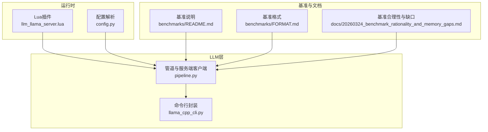
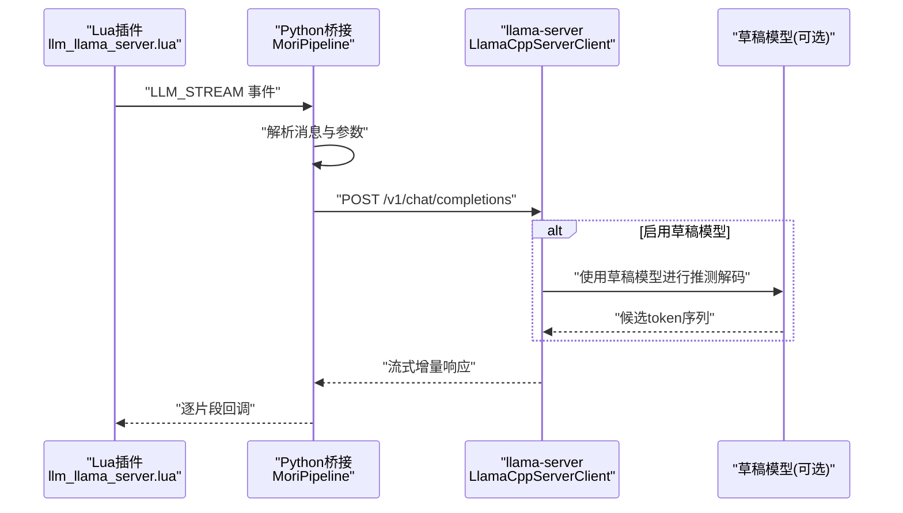
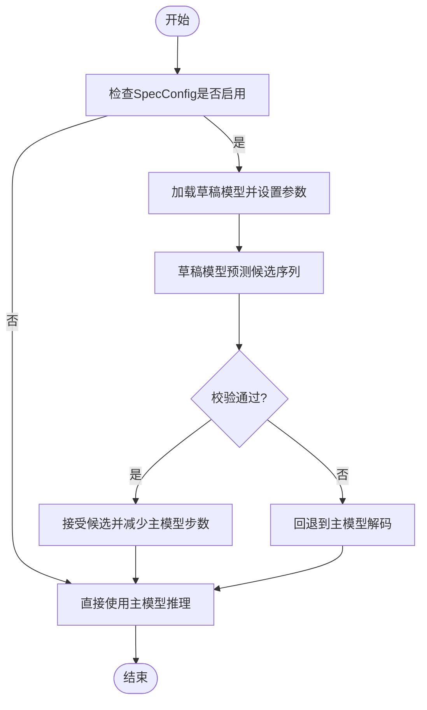
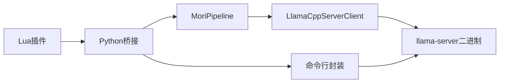

# 性能优化

<cite>
**本文引用的文件**
- [mori_llm/pipeline.py](file://mori_llm/pipeline.py)
- [mori_llm/llama_cpp_cli.py](file://mori_llm/llama_cpp_cli.py)
- [mori_runtime/lua/mori/plugins/llm_llama_server.lua](file://mori_runtime/lua/mori/plugins/llm_llama_server.lua)
- [mori_runtime/config.py](file://mori_runtime/config.py)
- [README.md](file://README.md)
- [mori_memory/benchmarks/README.md](file://mori_memory/benchmarks/README.md)
- [mori_memory/benchmarks/FORMAT.md](file://mori_memory/benchmarks/FORMAT.md)
- [mori_memory/docs/20260324_benchmark_rationality_and_memory_gaps.md](file://mori_memory/docs/20260324_benchmark_rationality_and_memory_gaps.md)
</cite>

## 目录
1. [简介](#简介)
2. [项目结构](#项目结构)
3. [核心组件](#核心组件)
4. [架构总览](#架构总览)
5. [详细组件分析](#详细组件分析)
6. [依赖分析](#依赖分析)
7. [性能考虑](#性能考虑)
8. [故障排查指南](#故障排查指南)
9. [结论](#结论)
10. [附录](#附录)

## 简介
本文件面向Mori的LLM性能优化，围绕GPU层配置策略、显存分配原则、混合精度推理、上下文大小(ctx_size)对性能与内存的影响、草稿模型(推测解码)的实现与调优、llama-server启动参数优化、性能监控与基准测试方法，以及内存泄漏检测、CPU使用率优化、网络延迟降低等实用技巧进行系统化梳理。内容基于仓库中实际代码与文档，帮助读者在不同硬件与场景下获得稳定且高效的推理体验。

## 项目结构
与LLM性能优化直接相关的模块集中在以下位置：
- mori_llm：封装llama.cpp客户端与服务端启动流程，提供聊天与嵌入接口，支持草稿模型与上下文大小配置。
- mori_runtime：运行时桥接Lua事件与Python LLM管线，负责消息流式传输。
- mori_runtime/config.py：统一配置解析与默认值装配，支持从JSON配置文件读取LLM相关参数。
- benchmarks：内存与控制器基准测试框架，提供性能指标采集与报告模板。

**图表来源**
- [mori_runtime/lua/mori/plugins/llm_llama_server.lua:1-25](file://mori_runtime/lua/mori/plugins/llm_llama_server.lua#L1-L25)
- [mori_runtime/config.py:1-270](file://mori_runtime/config.py#L1-L270)
- [mori_llm/pipeline.py:1-582](file://mori_llm/pipeline.py#L1-L582)
- [mori_llm/llama_cpp_cli.py:1-248](file://mori_llm/llama_cpp_cli.py#L1-L248)
- [mori_memory/benchmarks/README.md:1-200](file://mori_memory/benchmarks/README.md#L1-L200)
- [mori_memory/benchmarks/FORMAT.md:1-198](file://mori_memory/benchmarks/FORMAT.md#L1-L198)
- [mori_memory/docs/20260324_benchmark_rationality_and_memory_gaps.md:1-585](file://mori_memory/docs/20260324_benchmark_rationality_and_memory_gaps.md#L1-L585)

**章节来源**
- [README.md:1-179](file://README.md#L1-L179)
- [mori_runtime/config.py:1-270](file://mori_runtime/config.py#L1-L270)
- [mori_llm/pipeline.py:1-582](file://mori_llm/pipeline.py#L1-L582)
- [mori_llm/llama_cpp_cli.py:1-248](file://mori_llm/llama_cpp_cli.py#L1-L248)
- [mori_memory/benchmarks/README.md:1-200](file://mori_memory/benchmarks/README.md#L1-L200)
- [mori_memory/benchmarks/FORMAT.md:1-198](file://mori_memory/benchmarks/FORMAT.md#L1-L198)
- [mori_memory/docs/20260324_benchmark_rationality_and_memory_gaps.md:1-585](file://mori_memory/docs/20260324_benchmark_rationality_and_memory_gaps.md#L1-L585)

## 核心组件
- LlamaCppServerClient：封装llama-server的启动、健康检查、HTTP请求与流式响应，支持草稿模型参数透传与上下文大小控制。
- SpecConfig：草稿模型配置对象，包含是否启用、草稿GPU层数、上下文大小、最小/最大草稿长度、概率阈值等。
- MoriPipeline：高层封装，负责同时启动聊天与嵌入两个llama-server实例，分别设置不同的ctx_size与gpu_layers，提供同步/流式聊天与批量嵌入接口。
- LlamaCppChatRunner/LlamaCppEmbeddingRunner：面向命令行工具的封装，支持ctx_size、温度、采样参数与批量嵌入。
- 运行时插件：将Lua侧的流式事件转发至Python桥接，触发流式生成。

**章节来源**
- [mori_llm/pipeline.py:22-144](file://mori_llm/pipeline.py#L22-L144)
- [mori_llm/pipeline.py:307-582](file://mori_llm/pipeline.py#L307-L582)
- [mori_llm/llama_cpp_cli.py:90-221](file://mori_llm/llama_cpp_cli.py#L90-L221)
- [mori_runtime/lua/mori/plugins/llm_llama_server.lua:1-25](file://mori_runtime/lua/mori/plugins/llm_llama_server.lua#L1-L25)

## 架构总览
下图展示了从Lua事件到Python桥接、再到llama-server与草稿模型的完整调用链，以及关键参数如何传递。

**图表来源**
- [mori_runtime/lua/mori/plugins/llm_llama_server.lua:13-20](file://mori_runtime/lua/mori/plugins/llm_llama_server.lua#L13-L20)
- [mori_llm/pipeline.py:204-290](file://mori_llm/pipeline.py#L204-L290)
- [mori_llm/pipeline.py:105-157](file://mori_llm/pipeline.py#L105-L157)

## 详细组件分析

### GPU层配置策略与显存分配原则
- 大模型与嵌入模型分离部署：MoriPipeline分别启动聊天与嵌入两个llama-server实例，允许为两者设置不同的ctx_size与gpu_layers，从而实现显存隔离与差异化优化。
- GPU层参数透传：LlamaCppServerClient将gpu_layers与草稿模型的gpu-layers-draft参数透传给llama-server，实现对推理权重驻留显存的精细控制。
- 推荐实践：
  - 大模型：尽可能将更多GPU层驻留显存以提升吞吐，结合ctx_size与batch大小动态调整。
  - 嵌入模型：通常较小，可设为较低GPU层或CPU执行，节省显存。
  - 草稿模型：与大模型共享部分显存，但层数应显著降低，避免显存不足。

**章节来源**
- [mori_llm/pipeline.py:316-334](file://mori_llm/pipeline.py#L316-L334)
- [mori_llm/pipeline.py:405-430](file://mori_llm/pipeline.py#L405-L430)
- [mori_llm/pipeline.py:114-143](file://mori_llm/pipeline.py#L114-L143)

### 上下文大小(ctx_size)对性能与内存的影响
- ctx_size直接影响KV缓存大小与注意力计算复杂度，增大ctx_size会显著增加显存占用与单次推理时间。
- 仓库中ctx_size通过命令行参数传递至llama-server与聊天命令行工具，MoriPipeline为聊天与嵌入分别设置ctx_size，避免相互干扰。
- 推荐策略：
  - 交互式对话：根据平均单轮长度与历史窗口设定中等ctx_size，兼顾延迟与上下文容量。
  - 长文档检索/摘要：适当提高ctx_size，但需配合草稿模型与批处理策略以控制端到端延迟。

**章节来源**
- [mori_llm/llama_cpp_cli.py:166-206](file://mori_llm/llama_cpp_cli.py#L166-L206)
- [mori_llm/pipeline.py:62-76](file://mori_llm/pipeline.py#L62-L76)
- [mori_llm/pipeline.py:408-422](file://mori_llm/pipeline.py#L408-L422)

### 混合精度推理
- llama.cpp支持多种量化与混合精度模式，可通过模型文件(.gguf)选择合适的精度以平衡速度与质量。
- 在本项目中，模型选择与精度由外部模型文件决定；运行时通过llama-server加载对应模型，无需在代码中显式切换精度参数。

**章节来源**
- [README.md:33-36](file://README.md#L33-L36)
- [mori_llm/llama_cpp_cli.py:59-79](file://mori_llm/llama_cpp_cli.py#L59-L79)

### 草稿模型(推测解码)实现原理与性能增益
- SpecConfig提供草稿模型的启用开关与关键参数：草稿GPU层数、草稿上下文大小、最小/最大草稿长度、概率阈值等。
- LlamaCppServerClient在启用草稿模型时，将草稿模型路径与相关参数透传给llama-server，实现推测解码。
- 性能增益来源：
  - 通过草稿模型快速生成候选token序列，减少主模型无效解码次数。
  - 在高ctx_size与长生成场景下，显著降低主模型推理步数与端到端延迟。
- 参数平衡要点：
  - 草稿模型规模与精度：过小则预测不准，过大则占用显存与计算资源。
  - 草稿上下文大小：与主模型ctx_size协调，避免信息截断。
  - 草稿最小/最大长度与概率阈值：根据任务稳定性与延迟目标动态调节。

**图表来源**
- [mori_llm/pipeline.py:22-54](file://mori_llm/pipeline.py#L22-L54)
- [mori_llm/pipeline.py:132-143](file://mori_llm/pipeline.py#L132-L143)

**章节来源**
- [mori_llm/pipeline.py:22-54](file://mori_llm/pipeline.py#L22-L54)
- [mori_llm/pipeline.py:132-143](file://mori_llm/pipeline.py#L132-L143)

### llama-server启动参数优化
- 关键参数：
  - --ctx-size：主模型上下文大小。
  - --gpu-layers：主模型驻留显存层数。
  - --model-draft / --ctx-size-draft / --draft-max / --draft-min / --draft-p-min / --gpu-layers-draft：草稿模型相关参数。
  - --embeddings：启用嵌入模式。
  - --reasoning-format none：禁用推理格式以减少开销。
  - --jinja：启用模板渲染（非嵌入场景）。
- 启动流程：
  - 解析环境变量与配置，拼装命令行参数。
  - 设置LD_LIBRARY_PATH，启动进程并等待健康检查。
  - 超时或异常时抛出错误，便于上层捕获与重试。

**章节来源**
- [mori_llm/pipeline.py:105-157](file://mori_llm/pipeline.py#L105-L157)
- [mori_llm/pipeline.py:114-143](file://mori_llm/pipeline.py#L114-L143)

### 性能监控指标与基准测试方法
- 指标采集：
  - 编译上下文耗时(compile_ms)、写入耗时(ingest_ms)、空上下文比例(empty_context_rate)等，用于评估内存与控制器路径的稳定性。
  - 四象限覆盖率、象限抖动、路由分布等，用于探索交互拓扑与人口密度轴的稳定性。
- 基准测试：
  - 使用benchmarks/converted中的离线数据进行replay，验证默认稳定路径。
  - 通过脚本分析四象限抖动与路由分布，辅助控制器设计与回归验证。
- 注意事项：
  - 旧版Level 3基准文档已降级为历史材料，当前以two-axis controller replay为主。
  - 指标需结合业务场景选择，避免将单一分数作为通用上限。

**章节来源**
- [mori_memory/benchmarks/README.md:1-200](file://mori_memory/benchmarks/README.md#L1-L200)
- [mori_memory/benchmarks/FORMAT.md:1-198](file://mori_memory/benchmarks/FORMAT.md#L1-L198)
- [mori_memory/docs/20260324_benchmark_rationality_and_memory_gaps.md:1-585](file://mori_memory/docs/20260324_benchmark_rationality_and_memory_gaps.md#L1-L585)

## 依赖分析
- 组件耦合：
  - Lua插件依赖Python桥接，Python桥接依赖MoriPipeline与LlamaCppServerClient。
  - LlamaCppServerClient依赖llama-server二进制，参数通过命令行透传。
- 外部依赖：
  - llama.cpp二进制与模型文件(.gguf)。
  - Python运行时与urllib、subprocess等标准库。
- 潜在风险：
  - LD_LIBRARY_PATH未正确设置可能导致动态库加载失败。
  - 草稿模型与主模型共享显存时，需谨慎设置层数与ctx_size，避免OOM。

**图表来源**
- [mori_runtime/lua/mori/plugins/llm_llama_server.lua:1-25](file://mori_runtime/lua/mori/plugins/llm_llama_server.lua#L1-L25)
- [mori_llm/pipeline.py:56-98](file://mori_llm/pipeline.py#L56-L98)
- [mori_llm/llama_cpp_cli.py:16-56](file://mori_llm/llama_cpp_cli.py#L16-L56)

**章节来源**
- [mori_runtime/lua/mori/plugins/llm_llama_server.lua:1-25](file://mori_runtime/lua/mori/plugins/llm_llama_server.lua#L1-L25)
- [mori_llm/pipeline.py:56-98](file://mori_llm/pipeline.py#L56-L98)
- [mori_llm/llama_cpp_cli.py:16-56](file://mori_llm/llama_cpp_cli.py#L16-L56)

## 性能考虑
- GPU层与ctx_size权衡：在有限显存下，优先保证主模型关键层驻留显存，结合草稿模型降低主模型解码步数。
- 混合精度与模型选择：优先选择适合任务的量化精度模型，兼顾速度与质量。
- 草稿模型参数调优：从较小草稿模型开始，逐步增大草稿层数与上下文，观察端到端延迟与吞吐变化。
- 线程与I/O：尽量减少不必要的网络往返与磁盘IO，使用流式响应降低首字延迟。
- 配置管理：通过统一配置文件(mori.config.json)集中管理ctx_size、gpu_layers、草稿参数等，便于多环境一致性。

[本节为通用指导，不直接分析具体文件]

## 故障排查指南
- 服务器启动失败：
  - 检查llama-server二进制是否存在与可执行权限。
  - 查看启动超时与健康检查日志，确认端口占用与网络绑定。
- 草稿模型相关错误：
  - 确认草稿模型路径有效且与主模型兼容。
  - 调整草稿GPU层数与ctx-size-draft，避免显存不足。
- 嵌入模式异常：
  - 确保启用--embeddings并关闭--jinja等非必要功能。
- 性能退化：
  - 逐步降低ctx_size或减少草稿层数，观察延迟与吞吐变化。
  - 使用基准测试脚本对比不同配置下的compile_ms/ingest_ms。

**章节来源**
- [mori_llm/pipeline.py:92-96](file://mori_llm/pipeline.py#L92-L96)
- [mori_llm/pipeline.py:159-173](file://mori_llm/pipeline.py#L159-L173)
- [mori_llm/pipeline.py:121-127](file://mori_llm/pipeline.py#L121-L127)

## 结论
通过对GPU层配置、ctx_size、混合精度与草稿模型的系统化调优，结合llama-server参数与统一配置管理，可在不同硬件与业务场景下获得稳定且高效的LLM推理体验。配合基准测试与性能指标监控，能够持续验证与改进系统表现。

[本节为总结性内容，不直接分析具体文件]

## 附录
- 模型放置与路径解析：将chat与embedding模型置于model/目录，或通过配置文件指定绝对/相对路径。
- 环境变量：可通过LLAMA_CPP_BIN_DIR或LLAMA_CPP_DIR指定llama.cpp二进制目录，便于在不同环境中复用。

**章节来源**
- [README.md:33-36](file://README.md#L33-L36)
- [README.md:123-127](file://README.md#L123-L127)
- [mori_runtime/config.py:134-157](file://mori_runtime/config.py#L134-L157)