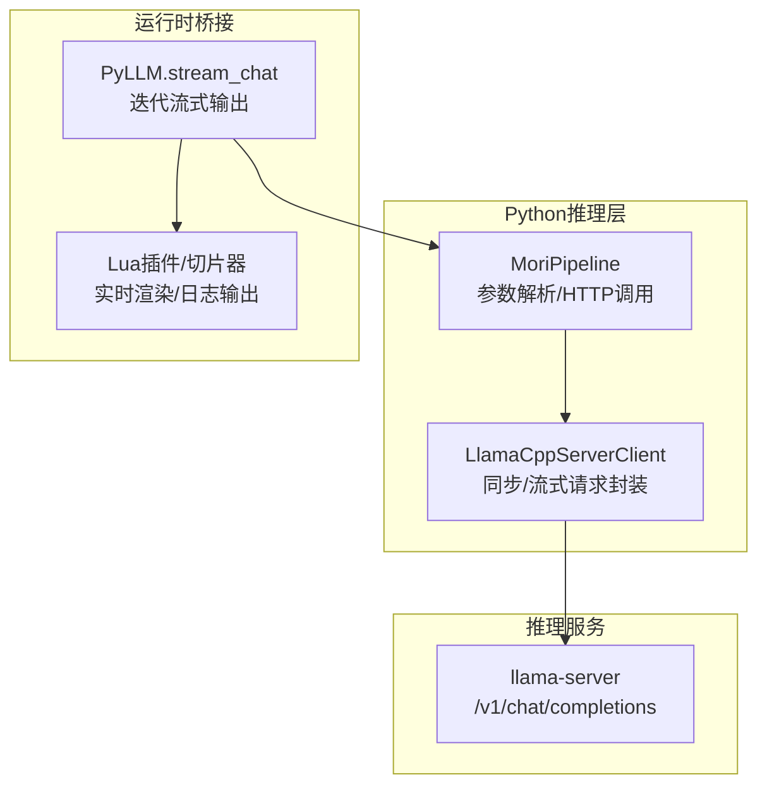
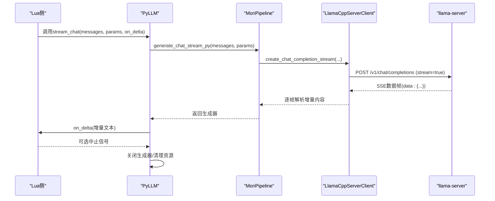
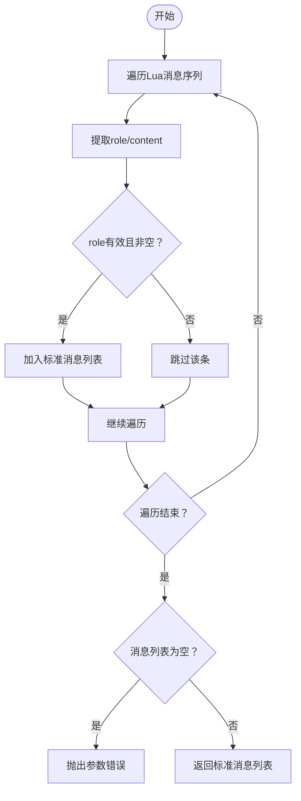
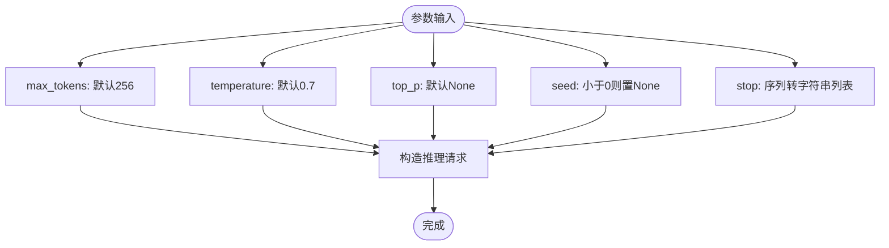
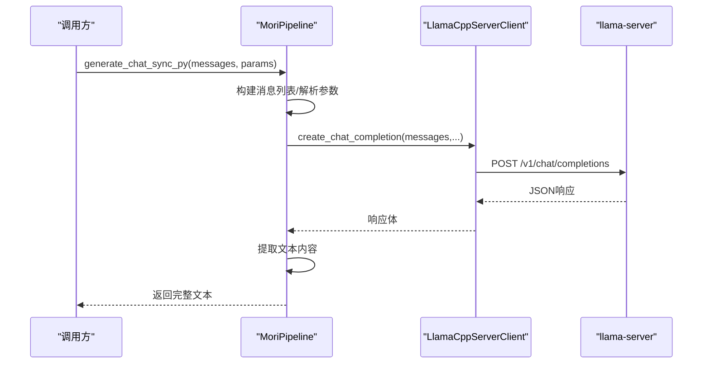
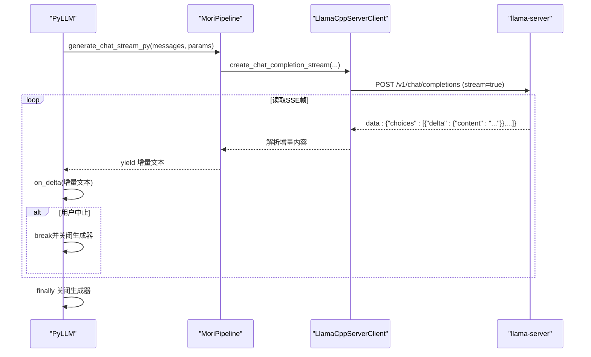
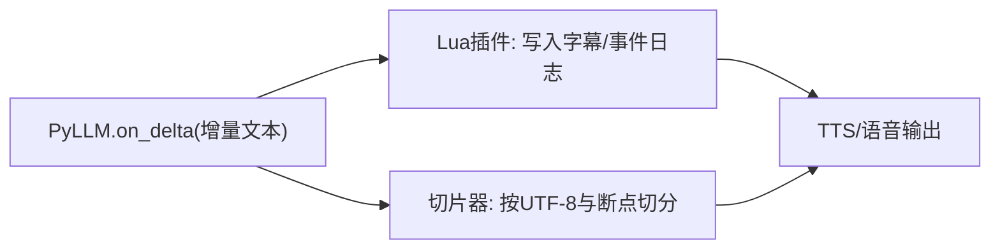
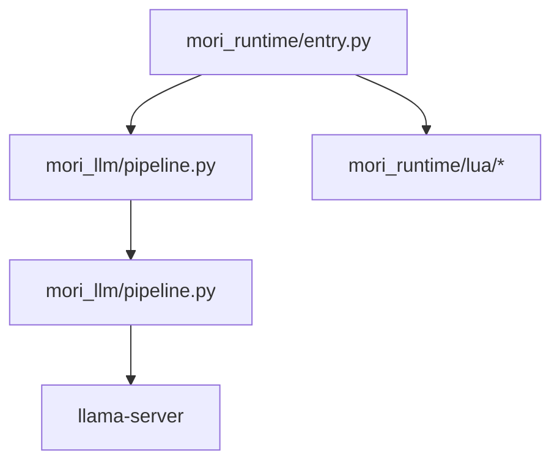

# 推理管道

<cite>
**本文引用的文件**
- [mori_llm/pipeline.py](file://mori_llm/pipeline.py)
- [mori_llm/llama_cpp_cli.py](file://mori_llm/llama_cpp_cli.py)
- [mori_runtime/entry.py](file://mori_runtime/entry.py)
- [mori_runtime/config.py](file://mori_runtime/config.py)
- [mori_runtime/lua/mori/plugins/live_outputs.lua](file://mori_runtime/lua/mori/plugins/live_outputs.lua)
- [mori_runtime/lua/mori/speech/chunker.lua](file://mori_runtime/lua/mori/speech/chunker.lua)
- [mori_memory/mori_memory/core.lua](file://mori_memory/mori_memory/core.lua)
- [mori_memory/mori_memory/util.lua](file://mori_memory/mori_memory/util.lua)
- [scripts/capture_bilibili_memory_live.py](file://scripts/capture_bilibili_memory_live.py)
</cite>

## 目录
1. [简介](#简介)
2. [项目结构](#项目结构)
3. [核心组件](#核心组件)
4. [架构总览](#架构总览)
5. [详细组件分析](#详细组件分析)
6. [依赖分析](#依赖分析)
7. [性能考虑](#性能考虑)
8. [故障排除指南](#故障排除指南)
9. [结论](#结论)
10. [附录](#附录)

## 简介
本文件面向Mori推理管道系统，聚焦于generate_chat_sync_py与generate_chat_stream_py两个关键方法的实现机制，涵盖以下主题：
- 消息格式转换：将Lua序列转换为标准消息列表的规则与容错策略
- 参数验证与默认值：温度、top_p、停止词、随机种子等参数的解析与校验
- 同步与流式推理：HTTP请求封装、SSE增量输出解析、连接管理
- 上下文与性能：上下文截断、批处理策略、内存管理建议
- 故障诊断：常见错误类型、定位方法与修复建议

## 项目结构
Mori推理管道由Python侧的MoriPipeline负责参数解析与HTTP调用，通过llama.cpp的llama-server提供推理服务；在运行时桥接层中，PyLLM将流式输出回调至Lua侧进行实时渲染。

**图示来源**
- [mori_llm/pipeline.py:204-290](file://mori_llm/pipeline.py#L204-L290)
- [mori_runtime/entry.py:146-187](file://mori_runtime/entry.py#L146-L187)
- [mori_runtime/lua/mori/plugins/live_outputs.lua:80-110](file://mori_runtime/lua/mori/plugins/live_outputs.lua#L80-L110)
- [mori_runtime/lua/mori/speech/chunker.lua:67-126](file://mori_runtime/lua/mori/speech/chunker.lua#L67-L126)

**章节来源**
- [mori_llm/pipeline.py:204-290](file://mori_llm/pipeline.py#L204-L290)
- [mori_runtime/entry.py:146-187](file://mori_runtime/entry.py#L146-L187)

## 核心组件
- MoriPipeline：统一的推理入口，负责参数标准化、消息列表构建、调用llama-server并提取响应文本
- LlamaCppServerClient：对llama-server的HTTP客户端封装，支持同步与流式两种模式
- PyLLM：运行时桥接层，将流式输出逐段回调给Lua侧，支持中止与资源清理
- 配置系统：读取JSON配置，映射键名，提供默认值与路径解析

**章节来源**
- [mori_llm/pipeline.py:307-582](file://mori_llm/pipeline.py#L307-L582)
- [mori_llm/llama_cpp_cli.py:223-248](file://mori_llm/llama_cpp_cli.py#L223-L248)
- [mori_runtime/entry.py:146-187](file://mori_runtime/entry.py#L146-L187)
- [mori_runtime/config.py:188-270](file://mori_runtime/config.py#L188-L270)

## 架构总览
推理流程自上而下分为三层：
- Python应用层：接收Lua传入的消息与参数，调用MoriPipeline
- 推理服务层：llama-server提供OpenAI兼容的聊天补全接口
- 运行时渲染层：Lua插件负责实时字幕、事件日志与语音切片

**图示来源**
- [mori_runtime/entry.py:150-184](file://mori_runtime/entry.py#L150-L184)
- [mori_llm/pipeline.py:228-290](file://mori_llm/pipeline.py#L228-L290)

## 详细组件分析

### 消息列表构建与格式转换
- 输入来源：Lua侧以表或序列形式传递消息，可能包含非标准字段
- 规范化步骤：
  - 使用通用迭代器将Lua序列转换为Python列表
  - 提取每条消息的role与content，过滤空角色与无效项
  - 输出为标准消息列表，元素为包含role与content的字典
- 错误处理：若最终列表为空，抛出参数错误

**图示来源**
- [mori_llm/pipeline.py:462-478](file://mori_llm/pipeline.py#L462-L478)
- [mori_llm/llama_cpp_cli.py:223-248](file://mori_llm/llama_cpp_cli.py#L223-L248)

**章节来源**
- [mori_llm/pipeline.py:462-478](file://mori_llm/pipeline.py#L462-L478)
- [mori_llm/llama_cpp_cli.py:223-248](file://mori_llm/llama_cpp_cli.py#L223-L248)

### 参数解析与默认值
- max_tokens：整型，默认256
- temperature：浮点，默认0.7
- top_p：可选浮点，默认None
- seed：可选整型，小于0则视为None
- stop：可迭代序列，转为字符串列表
- 所有参数均通过字典或Lua表形式传入，内部统一解析并做异常兜底

**图示来源**
- [mori_llm/pipeline.py:480-507](file://mori_llm/pipeline.py#L480-L507)

**章节来源**
- [mori_llm/pipeline.py:480-507](file://mori_llm/pipeline.py#L480-L507)

### 同步推理：generate_chat_sync_py
- 步骤概览：
  - 构建消息列表
  - 解析参数
  - 调用llama-server的聊天补全接口
  - 提取choices[0].message.content或text，拼接多部分文本
- 错误处理：当响应结构不符合预期时，抛出服务器错误

**图示来源**
- [mori_llm/pipeline.py:462-517](file://mori_llm/pipeline.py#L462-L517)

**章节来源**
- [mori_llm/pipeline.py:462-517](file://mori_llm/pipeline.py#L462-L517)

### 流式推理：generate_chat_stream_py 与 SSE 处理
- 步骤概览：
  - 构建消息列表与参数
  - 发起带stream=true的POST请求
  - 逐行读取SSE数据帧，去除"data:"前缀
  - 解析JSON，提取choices[0].delta.content或choices[0].text
  - 逐个增量输出
- 中止与清理：运行时桥接层提供中止回调，异常时关闭生成器

**图示来源**
- [mori_runtime/entry.py:150-184](file://mori_runtime/entry.py#L150-L184)
- [mori_llm/pipeline.py:228-290](file://mori_llm/pipeline.py#L228-L290)

**章节来源**
- [mori_runtime/entry.py:150-184](file://mori_runtime/entry.py#L150-L184)
- [mori_llm/pipeline.py:228-290](file://mori_llm/pipeline.py#L228-L290)

### 渲染与输出：Lua侧实时处理
- 实时字幕与事件日志：Lua插件将增量文本写入文件或标准输出
- 文本切片：语音合成前的切片器按硬/软断点与字符阈值切分，保证语音播放体验

**图示来源**
- [mori_runtime/lua/mori/plugins/live_outputs.lua:80-110](file://mori_runtime/lua/mori/plugins/live_outputs.lua#L80-L110)
- [mori_runtime/lua/mori/speech/chunker.lua:67-126](file://mori_runtime/lua/mori/speech/chunker.lua#L67-L126)

**章节来源**
- [mori_runtime/lua/mori/plugins/live_outputs.lua:80-110](file://mori_runtime/lua/mori/plugins/live_outputs.lua#L80-L110)
- [mori_runtime/lua/mori/speech/chunker.lua:67-126](file://mori_runtime/lua/mori/speech/chunker.lua#L67-L126)

### 上下文与消息格式转换细节
- Lua序列迭代：优先使用索引1..N的表式序列，否则回退到Python内置迭代
- 字段提取：严格从字典或表中读取role与content，忽略缺失或类型不符的条目
- 标准化输出：仅保留非空role与非空content的消息，确保后续推理稳定

**章节来源**
- [mori_llm/llama_cpp_cli.py:223-248](file://mori_llm/llama_cpp_cli.py#L223-L248)
- [mori_llm/pipeline.py:462-478](file://mori_llm/pipeline.py#L462-L478)

## 依赖分析
- Python推理层依赖llama-server提供的OpenAI兼容接口
- 运行时桥接层依赖Python的urllib与生成器机制
- Lua侧通过事件总线与插件系统消费增量输出

**图示来源**
- [mori_runtime/entry.py:146-187](file://mori_runtime/entry.py#L146-L187)
- [mori_llm/pipeline.py:204-290](file://mori_llm/pipeline.py#L204-L290)

**章节来源**
- [mori_runtime/entry.py:146-187](file://mori_runtime/entry.py#L146-L187)
- [mori_llm/pipeline.py:204-290](file://mori_llm/pipeline.py#L204-L290)

## 性能考虑
- 上下文截断与批处理
  - 在上游构建消息列表时，尽量裁剪历史消息，避免超出模型上下文长度
  - 对长对话采用分段批处理策略，减少单次请求的tokens消耗
- 流式输出优化
  - 利用SSE增量输出降低首包延迟，结合切片器提升TTS播放连续性
  - 控制增量回调频率，避免UI/音频线程过载
- 内存管理
  - 生成器惰性迭代，及时关闭生成器释放资源
  - 对Lua回调失败进行保护，防止阻塞与资源泄漏
- 配置与路径解析
  - 使用配置系统统一解析相对路径与键名映射，减少运行时开销

**章节来源**
- [mori_runtime/entry.py:150-184](file://mori_runtime/entry.py#L150-L184)
- [mori_runtime/lua/mori/speech/chunker.lua:67-126](file://mori_runtime/lua/mori/speech/chunker.lua#L67-L126)
- [mori_runtime/config.py:188-270](file://mori_runtime/config.py#L188-L270)

## 故障排除指南
- 常见错误类型
  - 模型未加载：在调用推理前必须先加载模型，否则抛出服务器错误
  - 消息格式无效：消息列表为空或字段缺失，抛出参数错误
  - 服务器响应异常：响应体非JSON或结构不匹配，抛出服务器错误
  - 流式解析失败：SSE帧解析异常或回调失败，需检查网络与回调逻辑
- 定位方法
  - 检查模型加载顺序与端口占用
  - 校验Lua传入的消息结构与字段类型
  - 查看SSE数据帧是否包含"data:"前缀与"[DONE]"终止标记
  - 监控回调异常，必要时中止流式输出并清理资源
- 修复建议
  - 确保消息列表非空且每条消息包含有效role与content
  - 适当降低temperature与top_p以提高稳定性
  - 设置合理的max_tokens与stop条件，避免超时或无限生成
  - 在Lua侧增加日志记录，定位具体断点与异常位置

**章节来源**
- [mori_llm/pipeline.py:18-20](file://mori_llm/pipeline.py#L18-L20)
- [mori_llm/pipeline.py:462-478](file://mori_llm/pipeline.py#L462-L478)
- [mori_llm/pipeline.py:228-290](file://mori_llm/pipeline.py#L228-L290)
- [mori_runtime/entry.py:150-184](file://mori_runtime/entry.py#L150-L184)

## 结论
Mori推理管道通过清晰的分层设计实现了从Lua到llama-server的高效推理链路。generate_chat_sync_py与generate_chat_stream_py分别满足确定性与低延迟场景的需求；配合Lua侧的实时渲染与切片器，形成完整的端到端体验。遵循本文的参数规范、消息转换规则与性能优化建议，可显著提升系统的稳定性与用户体验。

## 附录
- 相关实现路径参考
  - 消息迭代与序列化：[mori_llm/llama_cpp_cli.py:223-248](file://mori_llm/llama_cpp_cli.py#L223-L248)
  - 同步/流式请求封装：[mori_llm/pipeline.py:204-290](file://mori_llm/pipeline.py#L204-L290)
  - 运行时桥接与回调：[mori_runtime/entry.py:146-187](file://mori_runtime/entry.py#L146-L187)
  - 配置加载与路径解析：[mori_runtime/config.py:188-270](file://mori_runtime/config.py#L188-L270)
  - 实时输出与切片：[mori_runtime/lua/mori/plugins/live_outputs.lua:80-110](file://mori_runtime/lua/mori/plugins/live_outputs.lua#L80-L110), [mori_runtime/lua/mori/speech/chunker.lua:67-126](file://mori_runtime/lua/mori/speech/chunker.lua#L67-L126)
  - 记忆系统与上下文编译（参考）：[mori_memory/mori_memory/core.lua:168-208](file://mori_memory/mori_memory/core.lua#L168-L208), [mori_memory/mori_memory/util.lua:100-151](file://mori_memory/mori_memory/util.lua#L100-L151)
  - 生产环境脚本（参考）：[scripts/capture_bilibili_memory_live.py:478-497](file://scripts/capture_bilibili_memory_live.py#L478-L497)