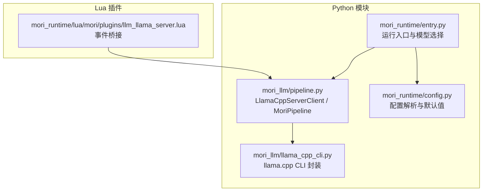
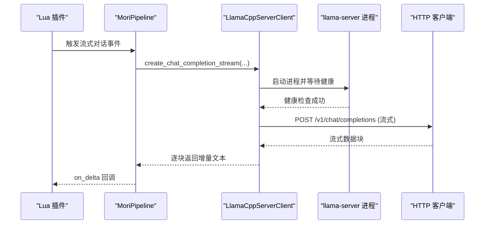
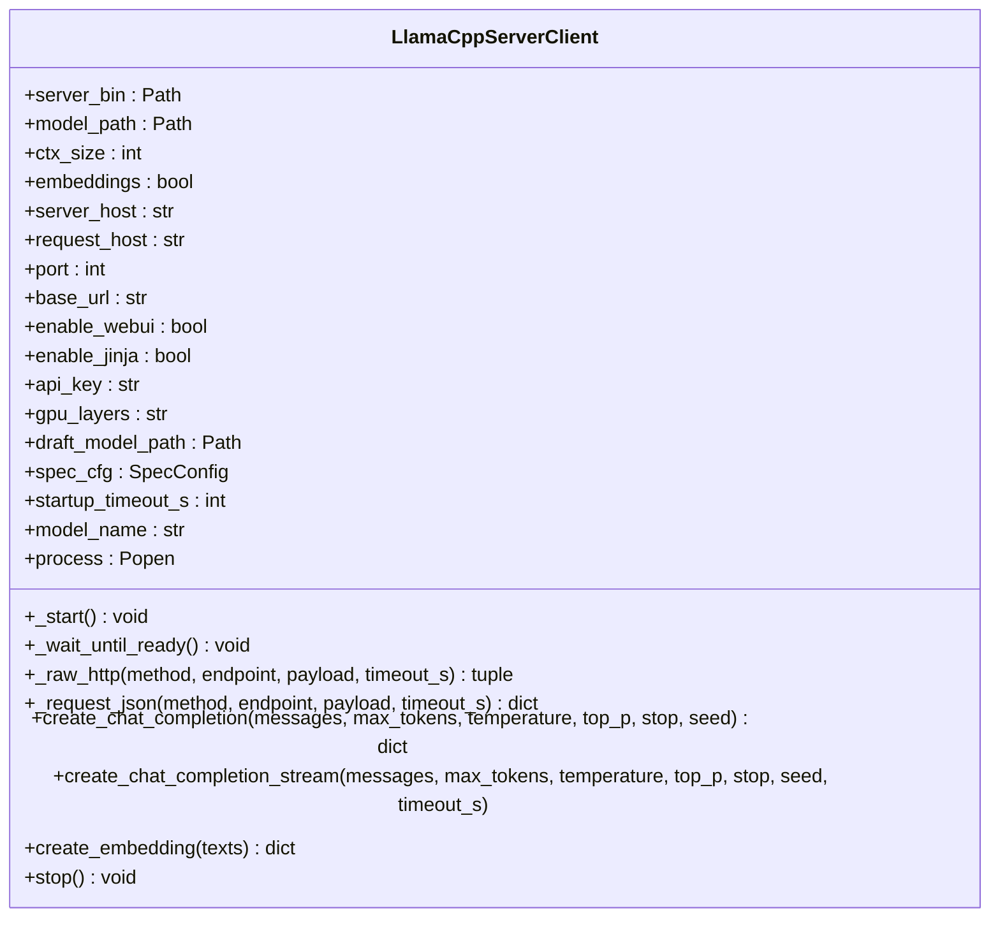
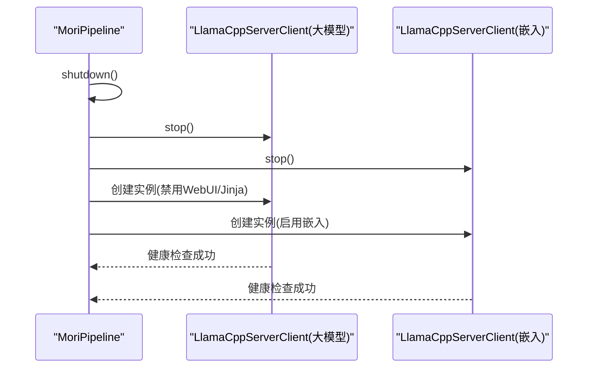
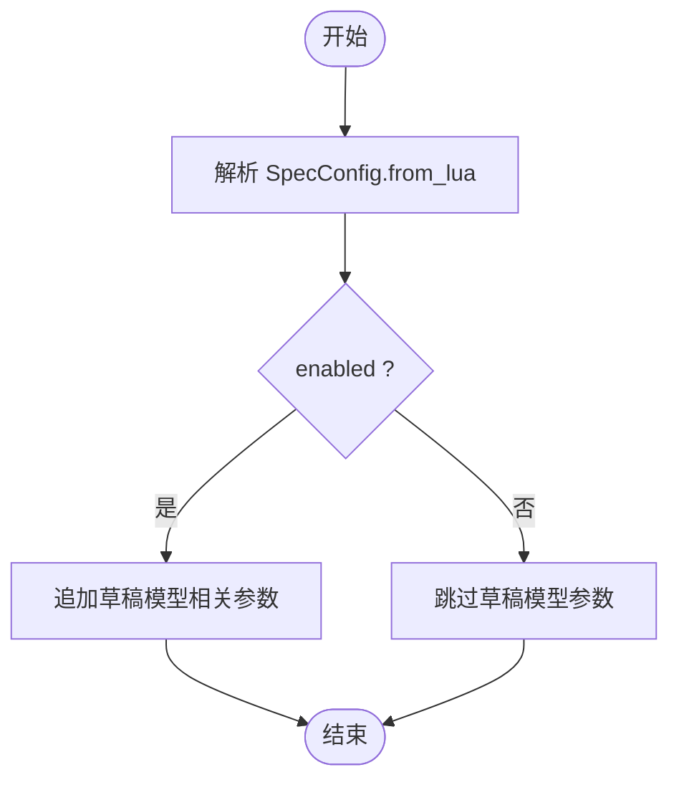
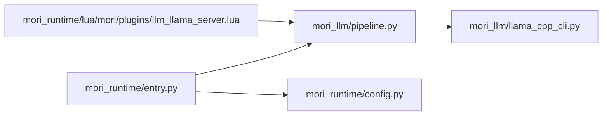

# 模型加载与管理

<cite>
**本文引用的文件列表**
- [pipeline.py](file://mori_llm/pipeline.py)
- [llama_cpp_cli.py](file://mori_llm/llama_cpp_cli.py)
- [llm_llama_server.lua](file://mori_runtime/lua/mori/plugins/llm_llama_server.lua)
- [entry.py](file://mori_runtime/entry.py)
- [config.py](file://mori_runtime/config.py)
</cite>

## 目录
1. [简介](#简介)
2. [项目结构](#项目结构)
3. [核心组件](#核心组件)
4. [架构总览](#架构总览)
5. [详细组件分析](#详细组件分析)
6. [依赖关系分析](#依赖关系分析)
7. [性能考量](#性能考量)
8. [故障排除指南](#故障排除指南)
9. [结论](#结论)

## 简介
本技术文档聚焦于Mori的模型加载与管理系统，重点解析以下内容：
- LlamaCppServerClient类的实现原理：包括llama-server进程启动、端口管理、环境变量配置、健康检查与HTTP请求封装。
- MoriPipeline中的load_models_py方法：说明大型语言模型与嵌入模型的并行加载机制与生命周期管理。
- 关键参数详解：模型路径解析、GPU层配置、上下文大小设置、草稿模型（Draft Model）集成与SpecConfig规格配置。
- 进程管理与优雅关闭：热更新、进程生命周期与资源回收。
- 错误处理与故障排除：加载失败、超时、HTTP错误与常见问题定位。

## 项目结构
围绕模型加载与管理的关键文件与职责如下：
- mori_llm/pipeline.py：定义LlamaCppServerClient与MoriPipeline，负责模型服务进程启动、参数传递、HTTP调用与优雅关闭。
- mori_llm/llama_cpp_cli.py：提供llama.cpp命令行工具的封装（非服务器模式），以及二进制目录解析与序列迭代工具。
- mori_runtime/lua/mori/plugins/llm_llama_server.lua：Lua侧事件桥接到Python的流式对话接口。
- mori_runtime/entry.py：运行入口，负责选择默认模型、解析参数并初始化MoriPipeline。
- mori_runtime/config.py：配置解析与默认值注入，支持相对路径解析与多配置文件合并。

**图表来源**
- [pipeline.py:56-305](file://mori_llm/pipeline.py#L56-L305)
- [llama_cpp_cli.py:26-56](file://mori_llm/llama_cpp_cli.py#L26-L56)
- [entry.py:848-863](file://mori_runtime/entry.py#L848-L863)
- [config.py:188-270](file://mori_runtime/config.py#L188-L270)
- [llm_llama_server.lua:1-25](file://mori_runtime/lua/mori/plugins/llm_llama_server.lua#L1-L25)

**章节来源**
- [pipeline.py:1-582](file://mori_llm/pipeline.py#L1-L582)
- [llama_cpp_cli.py:1-248](file://mori_llm/llama_cpp_cli.py#L1-L248)
- [entry.py:829-863](file://mori_runtime/entry.py#L829-L863)
- [config.py:1-270](file://mori_runtime/config.py#L1-L270)
- [llm_llama_server.lua:1-25](file://mori_runtime/lua/mori/plugins/llm_llama_server.lua#L1-L25)

## 核心组件
- LlamaCppServerClient：封装llama-server进程启动、参数拼装、健康检查、HTTP请求与停止逻辑。
- MoriPipeline：统一管理大模型与嵌入模型的加载、推理与关闭；提供同步与流式对话接口。
- SpecConfig：草稿模型规格配置的数据结构与Lua到Python的转换。
- llama_cpp_cli：提供llama.cpp二进制目录解析、默认模型选择与CLI工具封装。

**章节来源**
- [pipeline.py:56-305](file://mori_llm/pipeline.py#L56-L305)
- [pipeline.py:22-54](file://mori_llm/pipeline.py#L22-L54)
- [llama_cpp_cli.py:26-87](file://mori_llm/llama_cpp_cli.py#L26-L87)

## 架构总览
整体架构由Python侧的MoriPipeline与LlamaCppServerClient驱动llama-server进程，通过HTTP API对外提供聊天与嵌入能力；Lua侧插件将事件转发至Python，实现端到端的推理链路。

**图表来源**
- [llm_llama_server.lua:13-20](file://mori_runtime/lua/mori/plugins/llm_llama_server.lua#L13-L20)
- [pipeline.py:228-290](file://mori_llm/pipeline.py#L228-L290)
- [pipeline.py:159-173](file://mori_llm/pipeline.py#L159-L173)

## 详细组件分析

### LlamaCppServerClient 组件分析
- 进程启动与参数拼装
  - 通过可执行文件路径与模型路径校验后启动llama-server。
  - 支持主机绑定、端口分配、上下文大小、GPU层数、WebUI开关、Jinja模板、API密钥、嵌入模式、草稿模型与SpecConfig等参数。
  - 使用LD_LIBRARY_PATH确保动态库正确加载。
- 端口管理
  - 若未指定端口，则在指定主机上自动寻找可用端口。
- 健康检查与HTTP封装
  - 启动后轮询/health接口，超时或进程提前退出会抛出异常。
  - 提供/_raw_http与_request_json封装，统一处理认证头、超时与JSON解析。
- 对话与嵌入接口
  - create_chat_completion与create_chat_completion_stream：支持温度、top_p、max_tokens、stop、seed等参数。
  - create_embedding：对输入文本进行嵌入向量生成。
- 优雅停止
  - 先terminate，若超时则kill，避免僵尸进程。

**图表来源**
- [pipeline.py:56-305](file://mori_llm/pipeline.py#L56-L305)

**章节来源**
- [pipeline.py:56-305](file://mori_llm/pipeline.py#L56-L305)

### MoriPipeline 组件分析
- 初始化与二进制解析
  - 通过resolve_llama_cpp_bin_dir解析llama-server二进制位置。
  - 注册atexit钩子以确保进程优雅退出。
- 并行加载机制
  - load_models_py中先shutdown，再分别创建大模型与嵌入模型的LlamaCppServerClient实例，二者并行启动。
  - 大模型禁用WebUI与Jinja，嵌入模型启用嵌入模式且禁用Jinja。
- 推理接口
  - generate_chat_sync_py与generate_chat_stream_py：消息格式标准化、参数提取与调用大模型客户端。
  - get_embedding_py/get_embeddings_py：前缀规范化、批量嵌入与向量归一化。
- 优雅关闭
  - shutdown依次停止大模型与嵌入模型进程，并置空引用。

**图表来源**
- [pipeline.py:392-430](file://mori_llm/pipeline.py#L392-L430)
- [pipeline.py:575-582](file://mori_llm/pipeline.py#L575-L582)

**章节来源**
- [pipeline.py:307-582](file://mori_llm/pipeline.py#L307-L582)

### 草稿模型（Draft Model）与SpecConfig
- SpecConfig
  - 字段：enabled、draft_gpu_layers、draft_max、draft_min、draft_p_min、draft_ctx_size。
  - from_lua：从Lua侧传入的表结构安全解析，缺失字段使用默认值。
- 集成方式
  - 当启用草稿模型且非嵌入模式时，LlamaCppServerClient在启动命令中追加草稿模型路径及相关参数。
  - 草稿模型的GPU层数、上下文大小、最小/最大草稿长度、概率阈值等均可独立配置。

**图表来源**
- [pipeline.py:22-54](file://mori_llm/pipeline.py#L22-L54)
- [pipeline.py:132-143](file://mori_llm/pipeline.py#L132-L143)

**章节来源**
- [pipeline.py:22-54](file://mori_llm/pipeline.py#L22-L54)
- [pipeline.py:132-143](file://mori_llm/pipeline.py#L132-L143)

### 模型路径解析与默认模型选择
- 二进制目录解析
  - resolve_llama_cpp_bin_dir优先使用显式路径、环境变量LLAMA_CPP_BIN_DIR、LLAMA_CPP_DIR/build/bin、默认路径与which查找。
- 默认模型选择
  - pick_default_embed_model与pick_default_chat_model根据模型目录下的文件名偏好与扩展名筛选，默认选择特定模型文件。
- 运行入口中的默认行为
  - entry.py在未指定模型时，从model/目录按上述策略选择默认聊天与嵌入模型。

**章节来源**
- [llama_cpp_cli.py:26-87](file://mori_llm/llama_cpp_cli.py#L26-L87)
- [entry.py:848-861](file://mori_runtime/entry.py#L848-L861)

### 环境变量与库路径配置
- LD_LIBRARY_PATH
  - 在启动llama-server与llama-cli时，将二进制所在目录加入LD_LIBRARY_PATH，确保动态库被正确加载。
- 其他环境变量
  - 通过环境变量LLAMA_CPP_BIN_DIR与LLAMA_CPP_DIR控制llama.cpp二进制与构建产物位置。
  - API密钥通过--api-key传入，用于受保护的HTTP访问。

**章节来源**
- [pipeline.py:145-148](file://mori_llm/pipeline.py#L145-L148)
- [llama_cpp_cli.py:16-23](file://mori_llm/llama_cpp_cli.py#L16-L23)
- [pipeline.py:129-131](file://mori_llm/pipeline.py#L129-L131)

### 进程管理与优雅关闭
- 进程启动
  - 使用subprocess.Popen启动llama-server，标准输出静默，标准错误合并到标准输出。
- 健康检查
  - 启动后定期轮询/health，超时或进程提前退出均视为失败。
- 优雅关闭
  - stop()先terminate，等待5秒，若仍存活则kill，避免僵尸进程。
  - atexit注册的shutdown在程序退出时调用，确保资源回收。

**章节来源**
- [pipeline.py:150-157](file://mori_llm/pipeline.py#L150-L157)
- [pipeline.py:159-173](file://mori_llm/pipeline.py#L159-L173)
- [pipeline.py:296-305](file://mori_llm/pipeline.py#L296-L305)
- [pipeline.py:575-582](file://mori_llm/pipeline.py#L575-L582)

### 错误处理与故障排除
- 常见错误类型
  - LlamaServerError：HTTP请求失败、无效JSON、超时、进程提前退出。
  - LlamaCppCliError：llama-cli命令执行失败。
- 典型场景与建议
  - 无法找到llama-server或模型文件：检查resolve_llama_cpp_bin_dir与模型路径是否正确。
  - 启动超时：增大startup_timeout_s或检查硬件/GPU资源占用。
  - HTTP 4xx/5xx：确认API密钥、端口与网络连通性。
  - 动态库加载失败：确认LD_LIBRARY_PATH已包含二进制目录。
  - 草稿模型参数无效：核对SpecConfig字段与llama-server版本支持情况。

**章节来源**
- [pipeline.py:18-19](file://mori_llm/pipeline.py#L18-L19)
- [pipeline.py:188-202](file://mori_llm/pipeline.py#L188-L202)
- [pipeline.py:163-165](file://mori_llm/pipeline.py#L163-L165)
- [llama_cpp_cli.py:141-143](file://mori_llm/llama_cpp_cli.py#L141-L143)

## 依赖关系分析
- Python侧
  - mori_llm/pipeline.py依赖llama_cpp_cli.py提供的resolve_llama_cpp_bin_dir与序列迭代工具。
  - 运行入口entry.py依赖mori_runtime/config.py进行配置解析与默认值注入。
  - Lua插件llm_llama_server.lua依赖mori.core.protocol事件协议与ctx.py_llm桥接。
- 外部依赖
  - llama-server：作为HTTP服务提供聊天与嵌入能力。
  - lupa：Lua与Python交互的运行时库。

**图表来源**
- [pipeline.py](file://mori_llm/pipeline.py#L15)
- [entry.py:848-863](file://mori_runtime/entry.py#L848-L863)
- [config.py:188-270](file://mori_runtime/config.py#L188-L270)
- [llm_llama_server.lua:1-25](file://mori_runtime/lua/mori/plugins/llm_llama_server.lua#L1-L25)

**章节来源**
- [pipeline.py:1-15](file://mori_llm/pipeline.py#L1-L15)
- [entry.py:829-863](file://mori_runtime/entry.py#L829-L863)
- [config.py:188-270](file://mori_runtime/config.py#L188-L270)
- [llm_llama_server.lua:1-25](file://mori_runtime/lua/mori/plugins/llm_llama_server.lua#L1-L25)

## 性能考量
- 上下文大小与GPU层
  - ctx_size与gpu_layers直接影响推理延迟与显存占用，应结合硬件能力与任务需求调整。
- 草稿模型
  - 合理设置draft_max、draft_min、draft_p_min与draft_ctx_size可提升生成效率，但需考虑兼容性与质量权衡。
- 并行加载
  - 大模型与嵌入模型并行启动，缩短整体准备时间；注意系统资源上限。
- 流式输出
  - 流式对话减少首字节延迟，适合实时交互场景。

[本节为通用指导，无需具体文件分析]

## 故障排除指南
- 二进制与模型路径
  - 使用resolve_llama_cpp_bin_dir检查llama-server可执行文件是否存在；确保模型文件存在且可读。
- 端口冲突
  - 若未指定端口，系统可能分配冲突端口；建议显式指定端口或允许自动分配。
- GPU资源不足
  - 降低gpu_layers或ctx_size；检查显存占用与驱动版本。
- API密钥与鉴权
  - 确认--api-key与Authorization头一致；避免跨域或代理导致的鉴权失败。
- 草稿模型不生效
  - 确认enabled为true且llama-server版本支持草稿模型参数；核对草稿模型路径与规格配置。
- 日志与调试
  - 启用更详细的日志输出，观察启动阶段stderr与/health响应；必要时增大startup_timeout_s。

**章节来源**
- [pipeline.py:92-95](file://mori_llm/pipeline.py#L92-L95)
- [pipeline.py:100-103](file://mori_llm/pipeline.py#L100-L103)
- [pipeline.py:129-143](file://mori_llm/pipeline.py#L129-L143)
- [pipeline.py:159-173](file://mori_llm/pipeline.py#L159-L173)

## 结论
Mori的模型加载与管理系统通过LlamaCppServerClient与MoriPipeline实现了对llama-server的完整封装，覆盖了进程启动、参数配置、健康检查、HTTP通信与优雅关闭等关键环节。配合SpecConfig与草稿模型集成，系统能够在保证推理质量的同时优化性能。通过合理的参数配置与完善的错误处理，可稳定支撑多场景应用。