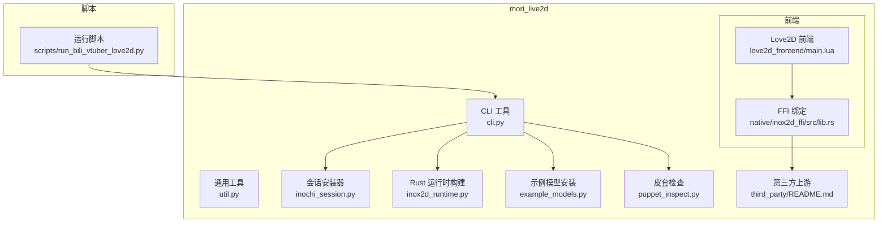
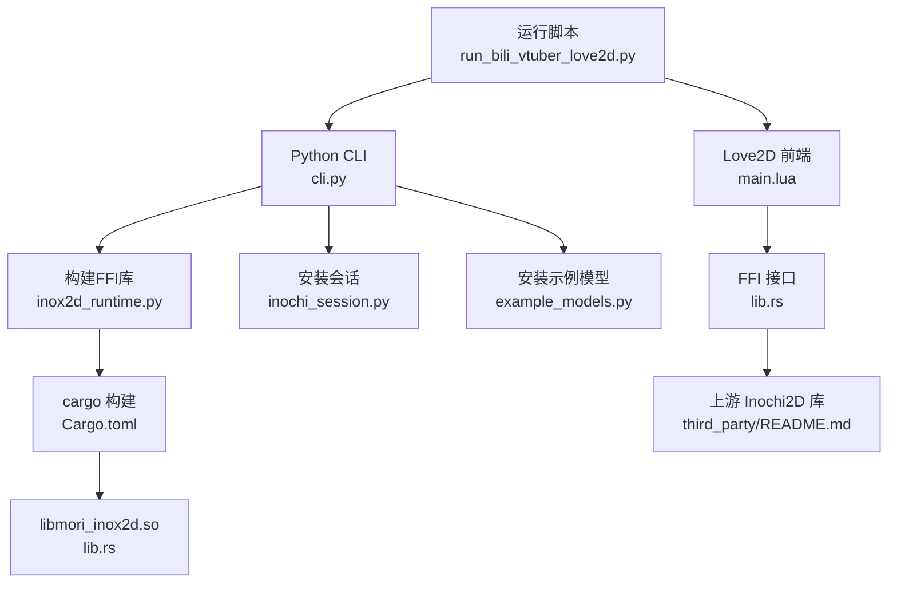
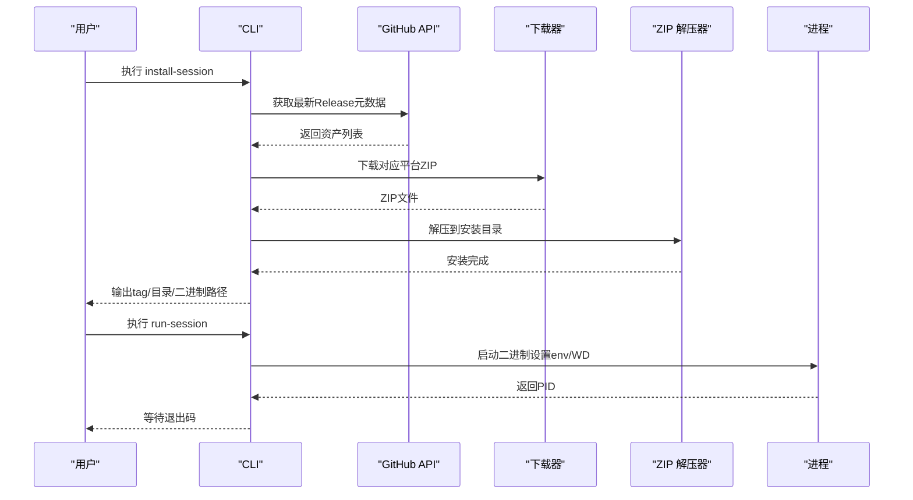
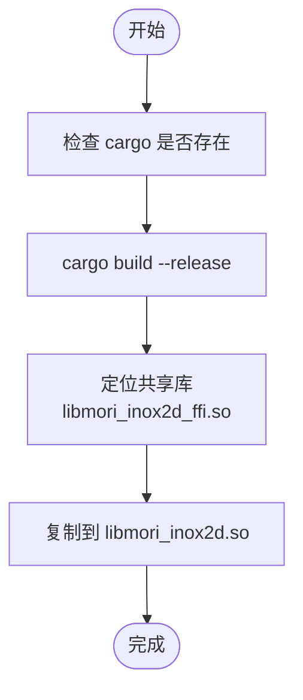
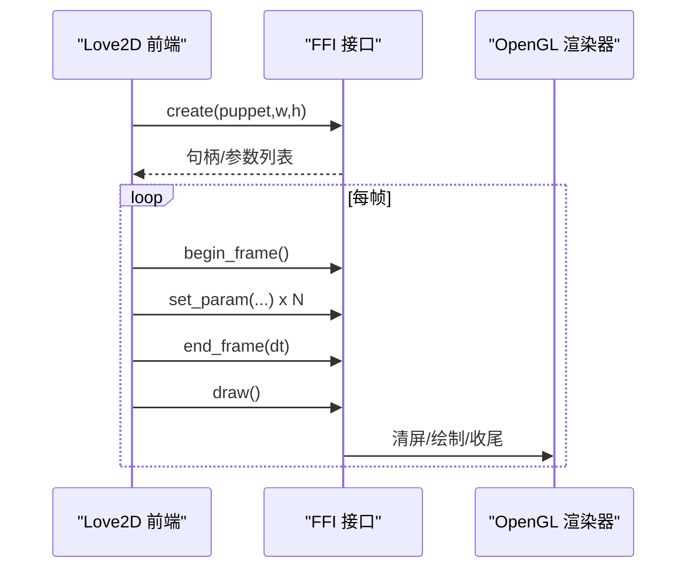
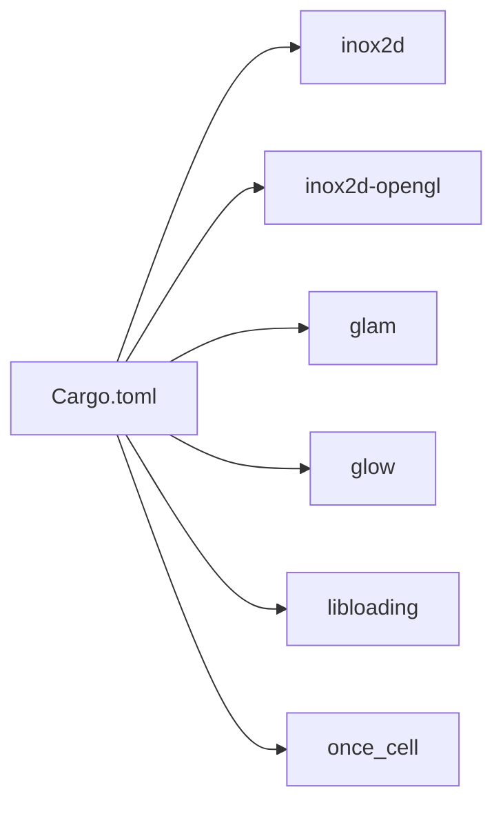

# Inochi2D引擎

<cite>
**本文引用的文件**
- [mori_live2d/inochi_session.py](file://mori_live2d/inochi_session.py)
- [mori_live2d/inox2d_runtime.py](file://mori_live2d/inox2d_runtime.py)
- [mori_live2d/cli.py](file://mori_live2d/cli.py)
- [mori_live2d/util.py](file://mori_live2d/util.py)
- [mori_live2d/example_models.py](file://mori_live2d/example_models.py)
- [mori_live2d/puppet_inspect.py](file://mori_live2d/puppet_inspect.py)
- [mori_live2d/love2d_frontend/main.lua](file://mori_live2d/love2d_frontend/main.lua)
- [mori_live2d/native/inox2d_ffi/Cargo.toml](file://mori_live2d/native/inox2d_ffi/Cargo.toml)
- [mori_live2d/native/inox2d_ffi/src/lib.rs](file://mori_live2d/native/inox2d_ffi/src/lib.rs)
- [mori_live2d/third_party/README.md](file://mori_live2d/third_party/README.md)
- [scripts/run_bili_vtuber_love2d.py](file://scripts/run_bili_vtuber_love2d.py)
- [mori_live2d/README.md](file://mori_live2d/README.md)
</cite>

## 目录
1. [简介](#简介)
2. [项目结构](#项目结构)
3. [核心组件](#核心组件)
4. [架构总览](#架构总览)
5. [详细组件分析](#详细组件分析)
6. [依赖分析](#依赖分析)
7. [性能考虑](#性能考虑)
8. [故障排除指南](#故障排除指南)
9. [结论](#结论)
10. [附录](#附录)

## 简介
本文件面向Inochi2D引擎在Mori项目中的集成与使用，系统化梳理其启动流程、进程管理、平台适配机制、自动安装与运行、跨平台支持、环境变量与库路径设置、进程间通信（IPC）以及故障排除与性能监控方法。Inochi2D在此方案中通过Rust FFI桥接到Love2D前端，实现对.inx/.inp皮套的加载与渲染，并结合Mori侧的字幕与TTS音频流进行VTuber演示。

## 项目结构
- 核心模块位于 mori_live2d/，包含：
  - CLI工具与辅助函数：cli.py、util.py、inochi_session.py、inox2d_runtime.py、example_models.py、puppet_inspect.py
  - Love2D前端：love2d_frontend/（LuaJIT + FFI）
  - Rust FFI绑定：native/inox2d_ffi/（cdylib）
  - 第三方上游：third_party/（子模块形式引入Inochi2D上游代码）
- 启动脚本：scripts/run_bili_vtuber_love2d.py，负责协调vtuber管道与Love2D前端进程
- 文档：mori_live2d/README.md

**图表来源**
- [mori_live2d/cli.py:1-125](file://mori_live2d/cli.py#L1-L125)
- [mori_live2d/inochi_session.py:1-103](file://mori_live2d/inochi_session.py#L1-L103)
- [mori_live2d/inox2d_runtime.py:1-64](file://mori_live2d/inox2d_runtime.py#L1-L64)
- [mori_live2d/util.py:1-68](file://mori_live2d/util.py#L1-L68)
- [mori_live2d/example_models.py:1-57](file://mori_live2d/example_models.py#L1-L57)
- [mori_live2d/puppet_inspect.py:1-87](file://mori_live2d/puppet_inspect.py#L1-L87)
- [mori_live2d/love2d_frontend/main.lua:1-631](file://mori_live2d/love2d_frontend/main.lua#L1-L631)
- [mori_live2d/native/inox2d_ffi/src/lib.rs:1-375](file://mori_live2d/native/inox2d_ffi/src/lib.rs#L1-L375)
- [mori_live2d/third_party/README.md:1-14](file://mori_live2d/third_party/README.md#L1-L14)
- [scripts/run_bili_vtuber_love2d.py:1-401](file://scripts/run_bili_vtuber_love2d.py#L1-L401)

**章节来源**
- [mori_live2d/README.md:1-157](file://mori_live2d/README.md#L1-L157)

## 核心组件
- CLI工具：提供构建FFI库、安装官方会话、安装示例模型、运行会话、检查皮套等命令入口
- 会话安装器：自动检测平台、从GitHub Release下载对应ZIP、解压并设置可执行权限
- Rust运行时构建：调用cargo编译cdylib并将产物复制到模型目录供Love2D加载
- 通用工具：HTTP请求、文件下载、ZIP解压
- 示例模型安装：下载公开示例皮套（Aka/Midori）
- 皮套检查：解析.inp/.inx负载，统计节点类型与参数数量
- Love2D前端：通过FFI调用Rust接口，渲染皮套、读取字幕与事件、驱动口型同步与基础动画
- 运行脚本：协调vtuber管道与Love2D前端进程，统一环境变量与进程生命周期

**章节来源**
- [mori_live2d/cli.py:20-121](file://mori_live2d/cli.py#L20-L121)
- [mori_live2d/inochi_session.py:48-103](file://mori_live2d/inochi_session.py#L48-L103)
- [mori_live2d/inox2d_runtime.py:32-64](file://mori_live2d/inox2d_runtime.py#L32-L64)
- [mori_live2d/util.py:13-68](file://mori_live2d/util.py#L13-L68)
- [mori_live2d/example_models.py:37-57](file://mori_live2d/example_models.py#L37-L57)
- [mori_live2d/puppet_inspect.py:36-87](file://mori_live2d/puppet_inspect.py#L36-L87)
- [mori_live2d/love2d_frontend/main.lua:156-400](file://mori_live2d/love2d_frontend/main.lua#L156-L400)
- [scripts/run_bili_vtuber_love2d.py:201-397](file://scripts/run_bili_vtuber_love2d.py#L201-L397)

## 架构总览
Inochi2D在Mori中的整体架构由“Python工具层 + Rust FFI层 + Love2D前端层 + 上游Inochi2D库”构成。Python层负责安装、构建与进程编排；Rust层封装OpenGL渲染与参数访问；Love2D层通过FFI与渲染器交互，同时读取Mori侧输出（字幕、事件、音频）进行实时驱动。

**图表来源**
- [mori_live2d/cli.py:57-121](file://mori_live2d/cli.py#L57-L121)
- [mori_live2d/inox2d_runtime.py:32-64](file://mori_live2d/inox2d_runtime.py#L32-L64)
- [mori_live2d/inochi_session.py:48-103](file://mori_live2d/inochi_session.py#L48-L103)
- [mori_live2d/example_models.py:37-57](file://mori_live2d/example_models.py#L37-L57)
- [mori_live2d/love2d_frontend/main.lua:156-283](file://mori_live2d/love2d_frontend/main.lua#L156-L283)
- [mori_live2d/native/inox2d_ffi/Cargo.toml:1-16](file://mori_live2d/native/inox2d_ffi/Cargo.toml#L1-L16)
- [mori_live2d/native/inox2d_ffi/src/lib.rs:136-290](file://mori_live2d/native/inox2d_ffi/src/lib.rs#L136-L290)
- [mori_live2d/third_party/README.md:7-13](file://mori_live2d/third_party/README.md#L7-L13)
- [scripts/run_bili_vtuber_love2d.py:201-397](file://scripts/run_bili_vtuber_love2d.py#L201-L397)

## 详细组件分析

### 组件A：会话安装与运行（inochi-session）
- 自动安装流程
  - 平台检测：根据sys.platform识别linux/win32/osx
  - 资源定位：从GitHub Release最新版本中查找对应平台的ZIP资产
  - 下载与解压：使用HTTP与ZIP工具完成下载与解压
  - 权限设置：Linux平台为二进制添加可执行位
- 进程运行
  - 设置工作目录为二进制所在目录
  - 在Linux下将二进制所在目录加入LD_LIBRARY_PATH
  - 支持通过extra_env注入环境变量（如SDL_VIDEODRIVER）

**图表来源**
- [mori_live2d/inochi_session.py:48-103](file://mori_live2d/inochi_session.py#L48-L103)
- [mori_live2d/util.py:13-68](file://mori_live2d/util.py#L13-L68)

**章节来源**
- [mori_live2d/inochi_session.py:24-103](file://mori_live2d/inochi_session.py#L24-L103)
- [mori_live2d/util.py:28-68](file://mori_live2d/util.py#L28-L68)

### 组件B：Rust FFI构建与导出接口
- 构建流程
  - 检查cargo是否存在
  - 在release模式执行cargo build
  - 查找生成的共享库（优先libmori_inox2d_ffi.so，否则通配）
  - 复制到model/inochi2d/native/libmori_inox2d.so供Love2D加载
- 导出接口（C ABI）
  - 创建/销毁句柄、尺寸调整、帧开始/结束、绘制
  - 参数查询：数量、名称、是否vec2、范围
  - 错误回传：last_error缓冲区

**图表来源**
- [mori_live2d/inox2d_runtime.py:25-64](file://mori_live2d/inox2d_runtime.py#L25-L64)
- [mori_live2d/native/inox2d_ffi/Cargo.toml:6-16](file://mori_live2d/native/inox2d_ffi/Cargo.toml#L6-L16)
- [mori_live2d/native/inox2d_ffi/src/lib.rs:136-375](file://mori_live2d/native/inox2d_ffi/src/lib.rs#L136-L375)

**章节来源**
- [mori_live2d/inox2d_runtime.py:32-64](file://mori_live2d/inox2d_runtime.py#L32-L64)
- [mori_live2d/native/inox2d_ffi/Cargo.toml:1-16](file://mori_live2d/native/inox2d_ffi/Cargo.toml#L1-L16)
- [mori_live2d/native/inox2d_ffi/src/lib.rs:136-375](file://mori_live2d/native/inox2d_ffi/src/lib.rs#L136-L375)

### 组件C：Love2D前端与FFI交互
- 初始化阶段
  - 读取环境变量与启动参数，确定字幕、事件、口型、皮套、映射、截图等路径
  - 加载FFI模块，创建渲染句柄，获取参数列表与映射控制器
  - 设置窗口大小、字体、渲染器信息
- 渲染循环
  - 帧开始：begin_frame
  - 参数驱动：根据映射与输入（字幕、事件、鼠标）更新参数
  - 帧结束：end_frame
  - 绘制：draw
- 进程内IPC
  - 通过文件系统轮询字幕与事件日志，实现低延迟的文本与音频驱动
  - 可选调试：播放本地WAV并驱动口型

**图表来源**
- [mori_live2d/love2d_frontend/main.lua:156-400](file://mori_live2d/love2d_frontend/main.lua#L156-L400)
- [mori_live2d/native/inox2d_ffi/src/lib.rs:136-290](file://mori_live2d/native/inox2d_ffi/src/lib.rs#L136-L290)

**章节来源**
- [mori_live2d/love2d_frontend/main.lua:156-400](file://mori_live2d/love2d_frontend/main.lua#L156-L400)

### 组件D：跨平台支持与平台适配
- 平台检测与资源命名
  - linux → inochi-session-linux.zip + inochi-session
  - win32 → inochi-session-win32.zip + inochi-session.exe
  - osx → inochi-session-osx.zip + inochi-session.app
- Linux特例
  - 运行时：将二进制所在目录加入LD_LIBRARY_PATH
  - 启动会话：支持强制SDL_VIDEODRIVER=x11（Wayland兼容）
- macOS/Windows
  - 使用对应平台的可执行文件或应用包

**章节来源**
- [mori_live2d/inochi_session.py:24-103](file://mori_live2d/inochi_session.py#L24-L103)

### 组件E：环境变量与库路径设置
- Love2D前端
  - 字幕/事件/口型/皮套/映射/截图路径均支持通过环境变量或启动参数覆盖
  - 字体路径自动探测多平台候选
- FFI库加载
  - 通过MORI_INOX2D_LIB显式指定共享库路径
  - 默认从model/inochi2d/native/加载
- 会话运行
  - Linux自动追加二进制目录到LD_LIBRARY_PATH
  - 可通过extra_env注入SDL_VIDEODRIVER等

**章节来源**
- [mori_live2d/love2d_frontend/main.lua:190-225](file://mori_live2d/love2d_frontend/main.lua#L190-L225)
- [mori_live2d/inochi_session.py:84-103](file://mori_live2d/inochi_session.py#L84-L103)
- [scripts/run_bili_vtuber_love2d.py:235-249](file://scripts/run_bili_vtuber_love2d.py#L235-L249)

### 组件F：进程管理与生命周期
- 运行脚本
  - 同时启动Love2D前端与vtuber管道
  - 监控两个子进程状态，任一退出即优雅终止另一个
  - 提供信号处理与强制终止兜底
- CLI命令
  - run-session：启动会话并等待退出码
  - build-inox2d：构建FFI库
  - install-session/install-models：安装会话与示例模型

**章节来源**
- [scripts/run_bili_vtuber_love2d.py:201-397](file://scripts/run_bili_vtuber_love2d.py#L201-L397)
- [mori_live2d/cli.py:57-121](file://mori_live2d/cli.py#L57-L121)

## 依赖分析
- Python层依赖
  - urllib、json、subprocess、shutil、tempfile、zipfile、pathlib、argparse
- Rust层依赖
  - inox2d、inox2d-opengl、glam、glow、libloading、once_cell
- 运行时依赖
  - Rust工具链（cargo）、OpenGL库（Linux：libGL.so.1）

**图表来源**
- [mori_live2d/native/inox2d_ffi/Cargo.toml:9-16](file://mori_live2d/native/inox2d_ffi/Cargo.toml#L9-L16)

**章节来源**
- [mori_live2d/native/inox2d_ffi/Cargo.toml:1-16](file://mori_live2d/native/inox2d_ffi/Cargo.toml#L1-L16)

## 性能考虑
- 渲染路径
  - 使用OpenGL渲染器，参数缓存减少重复查询
  - 首帧dt置零避免初始抖动
- I/O与轮询
  - 字幕与事件采用低频轮询，避免频繁磁盘访问
  - 口型值按固定频率采样，平衡响应与CPU占用
- 构建优化
  - release模式构建，启用优化
  - 共享库复用，避免重复加载

[本节为通用指导，无需具体文件引用]

## 故障排除指南
- 常见错误与定位
  - 缺少构建工具：提示安装Rust工具链（cargo）
  - 会话安装失败：检查网络与GitHub API可达性；确认平台资产存在
  - 会话运行失败（Linux Wayland）：使用--x11强制SDL_VIDEODRIVER=x11
  - FFI库未找到：确认MORI_INOX2D_LIB或默认路径存在
  - 皮套参数不匹配：使用inspect-puppet检查节点类型与参数数量
- 日志与诊断
  - Love2D前端打印错误信息与渲染器信息
  - FFI接口提供last_error缓冲区，便于捕获底层错误
  - 运行脚本监控子进程退出码并优雅终止
- 性能监控
  - 观察帧率与渲染器信息
  - 调整轮询频率与参数更新频率
  - 在CI/无头环境使用自动截图验证渲染一致性

**章节来源**
- [mori_live2d/inochi_session.py:84-103](file://mori_live2d/inochi_session.py#L84-L103)
- [mori_live2d/love2d_frontend/main.lua:401-470](file://mori_live2d/love2d_frontend/main.lua#L401-L470)
- [mori_live2d/native/inox2d_ffi/src/lib.rs:22-39](file://mori_live2d/native/inox2d_ffi/src/lib.rs#L22-L39)
- [scripts/run_bili_vtuber_love2d.py:362-397](file://scripts/run_bili_vtuber_love2d.py#L362-L397)

## 结论
Inochi2D在Mori中的集成以“Python工具层 + Rust FFI层 + Love2D前端层”为核心，实现了从安装、构建到渲染与驱动的完整链路。通过清晰的命令行接口、跨平台适配与环境变量配置，用户可在Linux、Windows、macOS上快速搭建VTuber演示。配合运行脚本的进程管理与前端的文件轮询IPC，系统具备良好的易用性与可维护性。

[本节为总结性内容，无需具体文件引用]

## 附录
- 第三方上游说明：third_party/README.md要求初始化子模块以获取上游Inochi2D代码
- CLI帮助：通过python3 -m mori_live2d.cli --help查看各子命令与参数

**章节来源**
- [mori_live2d/third_party/README.md:7-13](file://mori_live2d/third_party/README.md#L7-L13)
- [mori_live2d/README.md:143-157](file://mori_live2d/README.md#L143-L157)