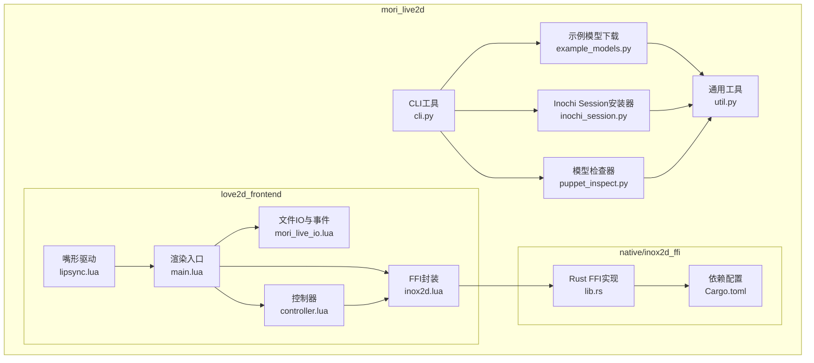
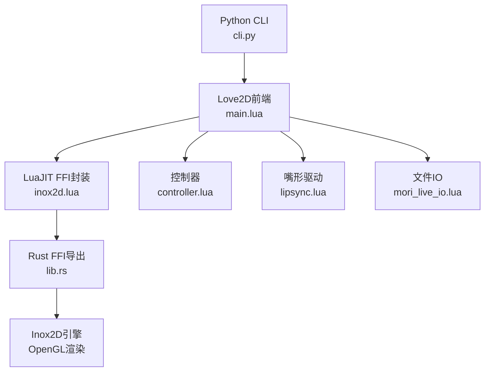
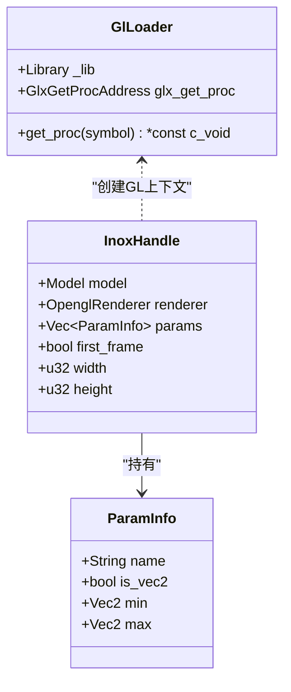
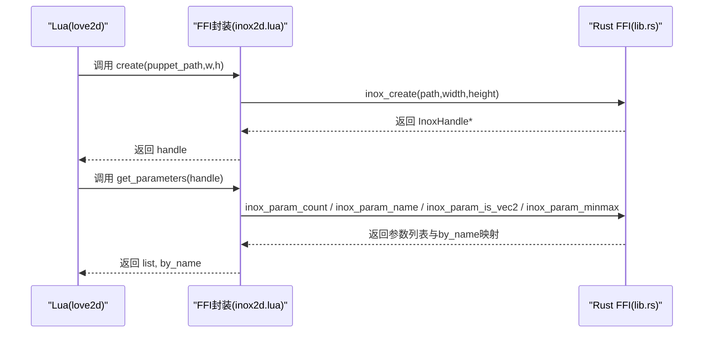
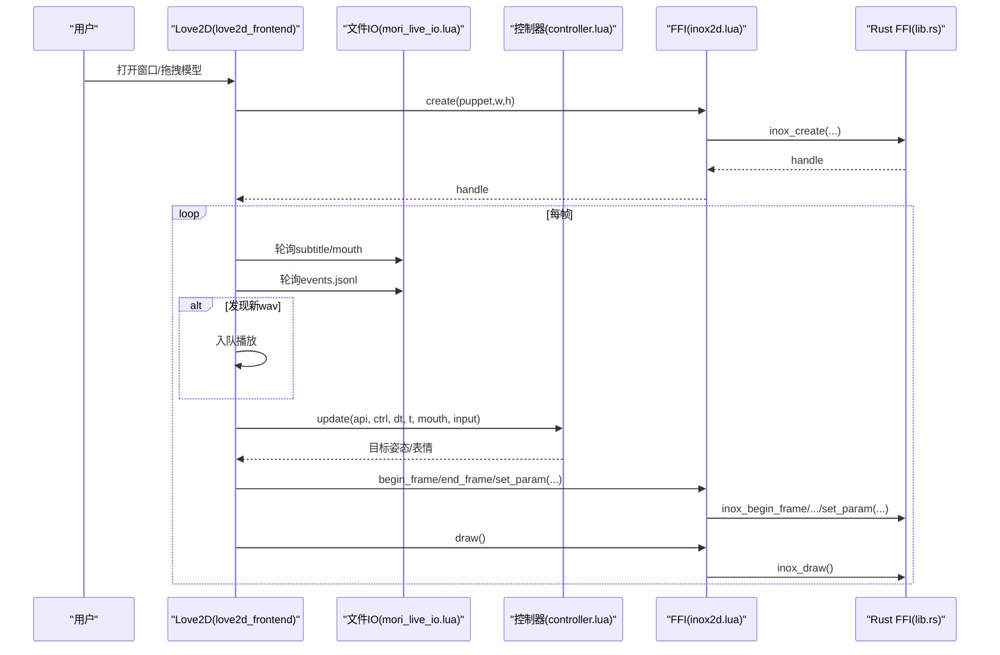
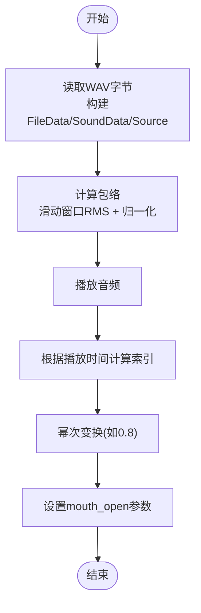
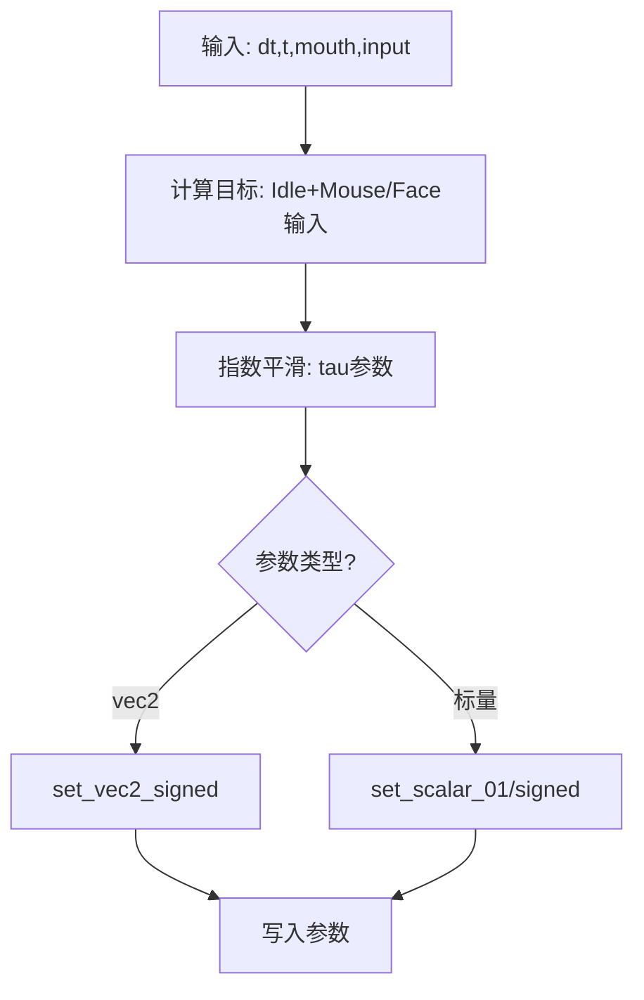
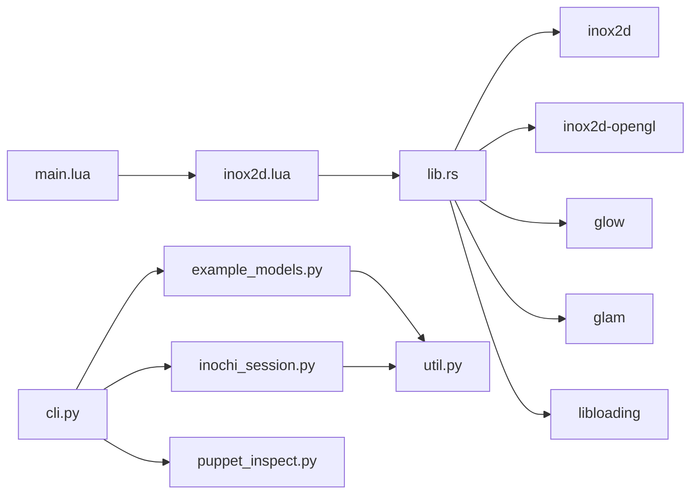

# Live2D集成

<cite>
**本文档引用的文件**
- [README.md](file://mori_live2d/README.md)
- [third_party/README.md](file://mori_live2d/third_party/README.md)
- [cli.py](file://mori_live2d/cli.py)
- [example_models.py](file://mori_live2d/example_models.py)
- [util.py](file://mori_live2d/util.py)
- [main.lua](file://mori_live2d/love2d_frontend/main.lua)
- [controller.lua](file://mori_live2d/love2d_frontend/controller.lua)
- [inox2d.lua](file://mori_live2d/love2d_frontend/inox2d.lua)
- [lipsync.lua](file://mori_live2d/love2d_frontend/lipsync.lua)
- [mori_live_io.lua](file://mori_live2d/love2d_frontend/mori_live_io.lua)
- [lib.rs](file://mori_live2d/native/inox2d_ffi/src/lib.rs)
- [Cargo.toml](file://mori_live2d/native/inox2d_ffi/Cargo.toml)
- [inochi_session.py](file://mori_live2d/inochi_session.py)
- [puppet_inspect.py](file://mori_live2d/puppet_inspect.py)
- [ATTRIBUTION.md](file://mori_live2d/ATTRIBUTION.md)
- [run_bili_vtuber_love2d.py](file://scripts/run_bili_vtuber_love2d.py)
</cite>

## 目录
1. [简介](#简介)
2. [项目结构](#项目结构)
3. [核心组件](#核心组件)
4. [架构总览](#架构总览)
5. [详细组件分析](#详细组件分析)
6. [依赖关系分析](#依赖关系分析)
7. [性能考虑](#性能考虑)
8. [故障排查指南](#故障排查指南)
9. [结论](#结论)
10. [附录](#附录)

## 简介
本文件面向Mori的Live2D集成系统，聚焦于Inochi2D与Love2D前端的集成方案。内容涵盖：
- FFI绑定实现、C函数导出、Lua调用机制
- Live2D模型加载与渲染流程（模型文件格式、骨骼动画、表情控制）
- 嘴形驱动系统（音频分析、表情同步、帧率控制）
- Love2D前端实现细节（渲染循环、事件处理、UI集成）
- FFI绑定的Rust实现（内存管理、错误处理、性能优化）
- Live2D模型制作与导入指南（Inoxy格式转换、纹理处理、动画导出）
- 调试工具与性能监控方法

## 项目结构
mori_live2d子模块包含以下关键目录与文件：
- native/inox2d_ffi：Rust FFI库，导出C接口供LuaJIT FFI调用
- love2d_frontend：Love2D前端，负责渲染、参数映射、嘴形驱动、UI与事件
- third_party：上游Inox2D源码（通过子模块引入）
- 其他辅助模块：CLI工具、会话安装器、模型检查器、示例模型下载器

**图表来源**
- [cli.py:1-125](file://mori_live2d/cli.py#L1-L125)
- [example_models.py:1-57](file://mori_live2d/example_models.py#L1-L57)
- [util.py:1-68](file://mori_live2d/util.py#L1-L68)
- [inochi_session.py:1-103](file://mori_live2d/inochi_session.py#L1-L103)
- [puppet_inspect.py:1-87](file://mori_live2d/puppet_inspect.py#L1-L87)
- [lib.rs:1-375](file://mori_live2d/native/inox2d_ffi/src/lib.rs#L1-L375)
- [Cargo.toml:1-16](file://mori_live2d/native/inox2d_ffi/Cargo.toml#L1-L16)
- [main.lua:1-631](file://mori_live2d/love2d_frontend/main.lua#L1-L631)
- [inox2d.lua:1-198](file://mori_live2d/love2d_frontend/inox2d.lua#L1-L198)
- [controller.lua:1-900](file://mori_live2d/love2d_frontend/controller.lua#L1-L900)
- [lipsync.lua:1-128](file://mori_live2d/love2d_frontend/lipsync.lua#L1-L128)
- [mori_live_io.lua:1-263](file://mori_live2d/love2d_frontend/mori_live_io.lua#L1-L263)

**章节来源**
- [README.md:1-157](file://mori_live2d/README.md#L1-L157)
- [third_party/README.md:1-14](file://mori_live2d/third_party/README.md#L1-L14)

## 核心组件
- FFI绑定（Rust → LuaJIT）
  - Rust导出C函数（创建/销毁、参数设置、帧开始/结束、绘制、参数查询等）
  - LuaJIT通过FFI声明并加载共享库，调用上述C函数
- Love2D前端
  - 渲染循环：加载模型、更新参数、绘制、UI叠加
  - 控制器：参数映射、Idle抖动、鼠标跟随、眨眼、眼球运动、呼吸
  - 嘴形驱动：基于音频包络的简单同步
  - 文件IO：订阅字幕文件与事件日志，驱动UI与音频播放
- CLI工具
  - 构建FFI库、安装示例模型、安装/运行Inochi Session、检查模型节点类型
- 模型与会话
  - 示例模型下载（Aka/Midori）
  - Inochi Session安装器（跨平台）

**章节来源**
- [lib.rs:22-375](file://mori_live2d/native/inox2d_ffi/src/lib.rs#L22-L375)
- [inox2d.lua:10-35](file://mori_live2d/love2d_frontend/inox2d.lua#L10-L35)
- [main.lua:156-400](file://mori_live2d/love2d_frontend/main.lua#L156-L400)
- [controller.lua:601-900](file://mori_live2d/love2d_frontend/controller.lua#L601-L900)
- [lipsync.lua:62-128](file://mori_live2d/love2d_frontend/lipsync.lua#L62-L128)
- [mori_live_io.lua:200-263](file://mori_live2d/love2d_frontend/mori_live_io.lua#L200-L263)
- [cli.py:20-125](file://mori_live2d/cli.py#L20-L125)
- [example_models.py:37-57](file://mori_live2d/example_models.py#L37-L57)
- [inochi_session.py:48-103](file://mori_live2d/inochi_session.py#L48-L103)

## 架构总览
整体架构由“Python CLI → Love2D前端（LuaJIT FFI）→ Rust FFI（C接口）→ Inox2D渲染器（OpenGL）”构成。

**图表来源**
- [cli.py:57-125](file://mori_live2d/cli.py#L57-L125)
- [main.lua:156-400](file://mori_live2d/love2d_frontend/main.lua#L156-L400)
- [inox2d.lua:108-195](file://mori_live2d/love2d_frontend/inox2d.lua#L108-L195)
- [lib.rs:136-290](file://mori_live2d/native/inox2d_ffi/src/lib.rs#L136-L290)
- [controller.lua:700-900](file://mori_live2d/love2d_frontend/controller.lua#L700-L900)
- [lipsync.lua:62-128](file://mori_live2d/love2d_frontend/lipsync.lua#L62-L128)
- [mori_live_io.lua:214-263](file://mori_live2d/love2d_frontend/mori_live_io.lua#L214-L263)

## 详细组件分析

### FFI绑定（Rust实现）
- 导出的C函数族
  - 创建/销毁句柄：inox_create、inox_destroy
  - 帧生命周期：inox_begin_frame、inox_end_frame
  - 渲染：inox_draw
  - 参数：inox_resize、inox_set_param、inox_param_count/name/is_vec2/minmax
  - 错误：inox_last_error
- 关键数据结构
  - InoxHandle：持有Model、OpenglRenderer、参数缓存、尺寸与首帧标记
  - ParamInfo：参数名、是否vec2、范围
- OpenGL加载
  - 通过libGL.so.1动态加载glXGetProcAddressARB，再回退到静态符号
- 错误处理
  - 使用全局互斥锁保护last_error字符串，FFI层返回长度或填充缓冲
- 性能要点
  - 首帧dt置零避免物理/动画初始跳变
  - 参数缓存按名称排序，便于Lua侧稳定查询

**图表来源**
- [lib.rs:84-100](file://mori_live2d/native/inox2d_ffi/src/lib.rs#L84-L100)
- [lib.rs:43-80](file://mori_live2d/native/inox2d_ffi/src/lib.rs#L43-L80)
- [lib.rs:136-197](file://mori_live2d/native/inox2d_ffi/src/lib.rs#L136-L197)

**章节来源**
- [lib.rs:22-375](file://mori_live2d/native/inox2d_ffi/src/lib.rs#L22-L375)
- [Cargo.toml:1-16](file://mori_live2d/native/inox2d_ffi/Cargo.toml#L1-L16)

### LuaJIT FFI封装（Lua）
- FFI声明
  - 通过cdef声明C函数签名，定义InoxHandle指针类型
  - 自动推断size_t位宽（32/64位）
- 库定位与加载
  - 支持环境变量与多候选路径，优先工作目录下的model/inochi2d/native
- API封装
  - create/destroy/resize/begin_frame/set_param/end_frame/draw/get_parameters
  - last_error用于错误回传
- 错误传播
  - Lua侧统一返回nil+错误字符串，便于上层处理

**图表来源**
- [inox2d.lua:10-35](file://mori_live2d/love2d_frontend/inox2d.lua#L10-L35)
- [inox2d.lua:108-195](file://mori_live2d/love2d_frontend/inox2d.lua#L108-L195)
- [lib.rs:136-197](file://mori_live2d/native/inox2d_ffi/src/lib.rs#L136-L197)
- [lib.rs:292-375](file://mori_live2d/native/inox2d_ffi/src/lib.rs#L292-L375)

**章节来源**
- [inox2d.lua:1-198](file://mori_live2d/love2d_frontend/inox2d.lua#L1-L198)

### Love2D前端渲染循环与事件处理
- 初始化
  - 解析环境变量/命令行参数，确定live目录、字幕文件、事件日志、模型路径、映射文件、截图路径
  - 加载FFI库，创建InoxHandle，查询参数列表
  - 初始化控制器（参数映射、选项）
- 渲染循环（update/draw）
  - 低频轮询字幕文件与mouth值（流式TTS）
  - 轮询事件日志，发现新wav后入队播放
  - 嘴形驱动：根据播放进度从预计算包络取值，幂律变换平滑
  - 控制器更新：Idle抖动、鼠标跟随、眨眼、眼球扫视、呼吸
  - 调用begin_frame/set_param/end_frame/draw
- UI与交互
  - 显示渲染器信息、当前模型、字幕路径、事件路径、播放中的wav
  - 显示参数映射表（可选）
  - 字幕遮罩叠加（支持换行与最大高度）
  - 键盘热键：H显示帮助、I开关Idle、F开关Mouse Look、B开关Auto Blink、R重载映射

**图表来源**
- [main.lua:156-400](file://mori_live2d/love2d_frontend/main.lua#L156-L400)
- [mori_live_io.lua:214-263](file://mori_live2d/love2d_frontend/mori_live_io.lua#L214-L263)
- [controller.lua:700-900](file://mori_live2d/love2d_frontend/controller.lua#L700-L900)
- [lipsync.lua:62-128](file://mori_live2d/love2d_frontend/lipsync.lua#L62-L128)
- [inox2d.lua:108-195](file://mori_live2d/love2d_frontend/inox2d.lua#L108-L195)
- [lib.rs:222-290](file://mori_live2d/native/inox2d_ffi/src/lib.rs#L222-L290)

**章节来源**
- [main.lua:156-631](file://mori_live2d/love2d_frontend/main.lua#L156-L631)
- [mori_live_io.lua:1-263](file://mori_live2d/love2d_frontend/mori_live_io.lua#L1-L263)
- [controller.lua:1-900](file://mori_live2d/love2d_frontend/controller.lua#L1-L900)
- [lipsync.lua:1-128](file://mori_live2d/love2d_frontend/lipsync.lua#L1-L128)
- [inox2d.lua:1-198](file://mori_live2d/love2d_frontend/inox2d.lua#L1-L198)

### 嘴形驱动系统（音频分析与同步）
- 包络提取
  - 以固定窗口秒长滑动，对采样点求平方和再开方得到RMS
  - 对整段音频归一化，得到0~1包络序列
- 播放同步
  - 将音频源时间除以窗口秒长，取整得到当前包络索引
  - 对包络值进行幂次变换（如0.8）以增强感知
- 驱动参数
  - 将同步得到的值写入mouth_open参数（或外部输入）

**图表来源**
- [lipsync.lua:31-128](file://mori_live2d/love2d_frontend/lipsync.lua#L31-L128)
- [main.lua:332-398](file://mori_live2d/love2d_frontend/main.lua#L332-L398)

**章节来源**
- [lipsync.lua:1-128](file://mori_live2d/love2d_frontend/lipsync.lua#L1-L128)
- [main.lua:323-398](file://mori_live2d/love2d_frontend/main.lua#L323-L398)

### 参数映射与控制器（Idle/鼠标/眨眼/呼吸）
- 参数映射
  - 支持覆盖文件（.mori-map或.lua），自动发现同目录映射文件
  - 模糊匹配关键词（head/yaw/pitch/roll、mouth_open、eye_*、breath等）
  - 支持参数反转（!前缀）以适配左右轴向差异
- 控制器逻辑
  - Idle：噪声生成，按tau指数平滑至目标
  - Mouse Look：鼠标坐标映射到头/眼目标
  - 眨眼：随机延迟，闭合/开启采用缓动曲线
  - 眼球扫视：随机方向与强度，周期性触发
  - 呼吸：正弦周期驱动
- 参数设置
  - 根据参数类型（标量/vec2）与范围线性映射

**图表来源**
- [controller.lua:700-900](file://mori_live2d/love2d_frontend/controller.lua#L700-L900)
- [controller.lua:477-554](file://mori_live2d/love2d_frontend/controller.lua#L477-L554)

**章节来源**
- [controller.lua:1-900](file://mori_live2d/love2d_frontend/controller.lua#L1-L900)

### CLI与工具链
- 构建FFI库
  - cargo构建cdylib，输出到model/inochi2d/native
- 安装示例模型
  - 下载Aka/Midori，校验许可证
- 安装/运行Inochi Session
  - 自动检测平台，下载zip并解压，必要时chmod可执行
- 检查模型节点
  - 读取.inp/.inx负载，统计节点类型，识别未知类型

**章节来源**
- [cli.py:20-125](file://mori_live2d/cli.py#L20-L125)
- [example_models.py:37-57](file://mori_live2d/example_models.py#L37-L57)
- [inochi_session.py:48-103](file://mori_live2d/inochi_session.py#L48-L103)
- [puppet_inspect.py:36-87](file://mori_live2d/puppet_inspect.py#L36-L87)

## 依赖关系分析
- Rust FFI依赖
  - inox2d、inox2d-opengl：渲染与模型解析
  - glow：OpenGL上下文
  - glam：向量运算
  - libloading：动态库加载
- Lua侧依赖
  - LuaJIT FFI：加载共享库、声明C函数
- Python侧依赖
  - requests：网络请求
  - zipfile：解压
  - subprocess：进程管理

**图表来源**
- [Cargo.toml:9-16](file://mori_live2d/native/inox2d_ffi/Cargo.toml#L9-L16)
- [lib.rs:1-14](file://mori_live2d/native/inox2d_ffi/src/lib.rs#L1-L14)
- [main.lua:15-20](file://mori_live2d/love2d_frontend/main.lua#L15-L20)
- [inox2d.lua:1-7](file://mori_live2d/love2d_frontend/inox2d.lua#L1-L7)
- [cli.py:1-11](file://mori_live2d/cli.py#L1-L11)

**章节来源**
- [Cargo.toml:1-16](file://mori_live2d/native/inox2d_ffi/Cargo.toml#L1-L16)
- [lib.rs:1-14](file://mori_live2d/native/inox2d_ffi/src/lib.rs#L1-L14)

## 性能考虑
- 渲染与参数更新
  - 指数平滑参数（smooth_*）降低突变带来的视觉闪烁
  - 首帧dt置零避免物理/动画初始跳变
- I/O与文件轮询
  - 字幕与mouth值轮询频率较低（0.2s/0.05s），减少磁盘压力
  - 事件日志采用尾部偏移增量读取
- 音频包络
  - 预计算包络，避免每帧重复昂贵的FFT/RMS
- OpenGL上下文
  - 动态加载GL函数，兼容不同桌面环境
- 建议
  - 在高分辨率场景适当调整相机缩放与渲染分辨率
  - 控制Idle强度与平滑时间常数，平衡自然度与性能

[本节为通用指导，无需特定文件引用]

## 故障排查指南
- FFI库未找到
  - 确认已构建并复制到model/inochi2d/native或设置MORI_INOX2D_LIB
  - 检查Lua侧库搜索路径与权限
- 模型加载失败
  - 使用inspect-puppet检查节点类型，确认未知类型导致部分部件不渲染
  - 确认模型版本与上游实现兼容
- 参数映射无效
  - 提供.mori-map或.mori.lua覆盖映射
  - 检查参数名大小写与关键词匹配
- Wayland桌面无法启动Inochi Session
  - 使用--x11强制SDL_VIDEODRIVER=x11
- 错误信息获取
  - Lua侧调用last_error或捕获返回的错误字符串
  - Rust侧通过全局互斥锁记录最近错误

**章节来源**
- [README.md:10-15](file://mori_live2d/README.md#L10-L15)
- [cli.py:95-118](file://mori_live2d/cli.py#L95-L118)
- [puppet_inspect.py:60-87](file://mori_live2d/puppet_inspect.py#L60-L87)
- [inochi_session.py:84-103](file://mori_live2d/inochi_session.py#L84-L103)
- [inox2d.lua:91-106](file://mori_live2d/love2d_frontend/inox2d.lua#L91-L106)
- [lib.rs:22-39](file://mori_live2d/native/inox2d_ffi/src/lib.rs#L22-L39)

## 结论
本集成方案以LuaJIT FFI桥接Rust Inox2D渲染器，实现了从模型加载、参数映射、表情控制到嘴形驱动的完整链路。Love2D前端提供了简洁稳定的渲染循环与UI，配合Python工具链完成模型与会话管理。当前上游Inox2D仍处于原型阶段，部分节点类型尚未完全支持，建议通过参数映射与模型检查工具规避问题并逐步完善。

[本节为总结，无需特定文件引用]

## 附录

### Live2D模型制作与导入指南
- 模型来源与许可
  - 示例模型来自Inochi2D官方示例仓库，采用CC BY 4.0许可
- 下载与安装
  - 使用CLI安装示例模型（Aka/Midori）
- 导入与验证
  - 将.inx/.inp放入model/inochi2d/puppets/<name>/
  - 使用inspect-puppet检查节点类型与参数数量
- 参数映射
  - 提供.mori-map或.mori.lua覆盖映射，支持!前缀反转
- 纹理与动画
  - 确保纹理路径正确，动画导出遵循Inochi2D规范

**章节来源**
- [ATTRIBUTION.md:1-18](file://mori_live2d/ATTRIBUTION.md#L1-L18)
- [README.md:97-106](file://mori_live2d/README.md#L97-L106)
- [cli.py:78-86](file://mori_live2d/cli.py#L78-L86)
- [puppet_inspect.py:60-87](file://mori_live2d/puppet_inspect.py#L60-L87)
- [controller.lua:101-167](file://mori_live2d/love2d_frontend/controller.lua#L101-L167)

### 一键启动VTuber（含Love2D前端）
- 自动准备
  - 缺少示例模型则自动下载
  - 缺少FFI库则自动构建
- 环境变量
  - MORI_LIVE_DIR、MORI_PUPPET_PATH、MORI_INOX2D_LIB、MORI_MOUSE_LOOK、MORI_MAPPING_PATH
- 启动流程
  - 同时启动vtuber.py与Love2D前端，前端监听subtitle与events并驱动渲染

**章节来源**
- [run_bili_vtuber_love2d.py:201-397](file://scripts/run_bili_vtuber_love2d.py#L201-L397)
- [README.md:121-135](file://mori_live2d/README.md#L121-L135)