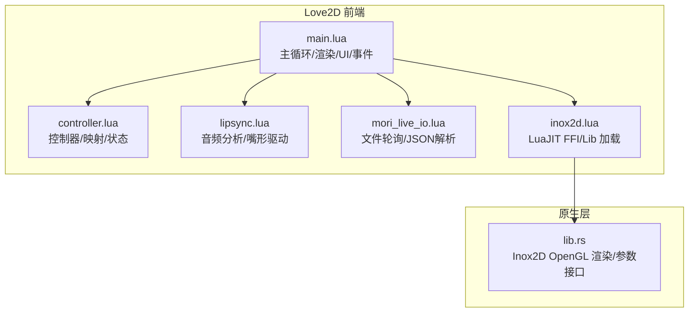
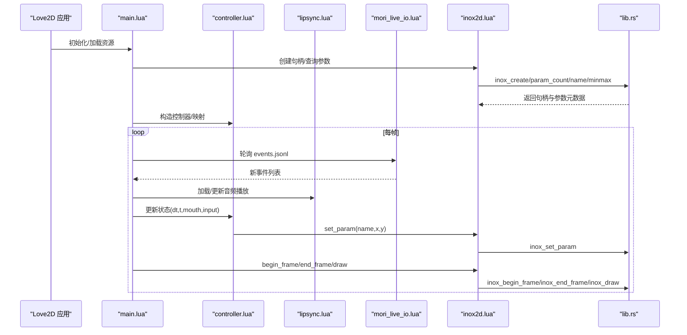
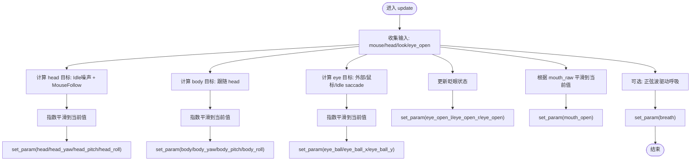
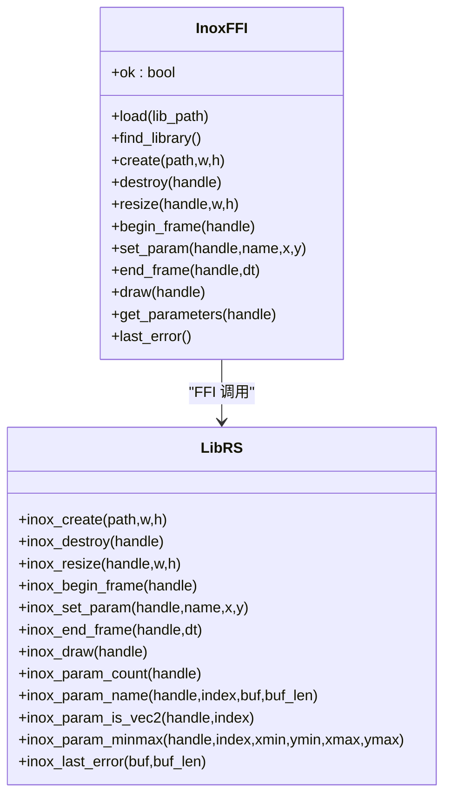
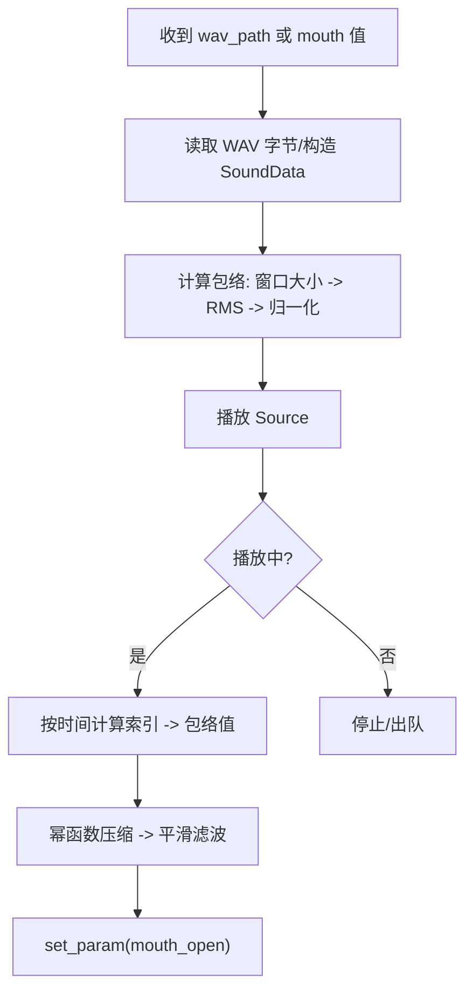
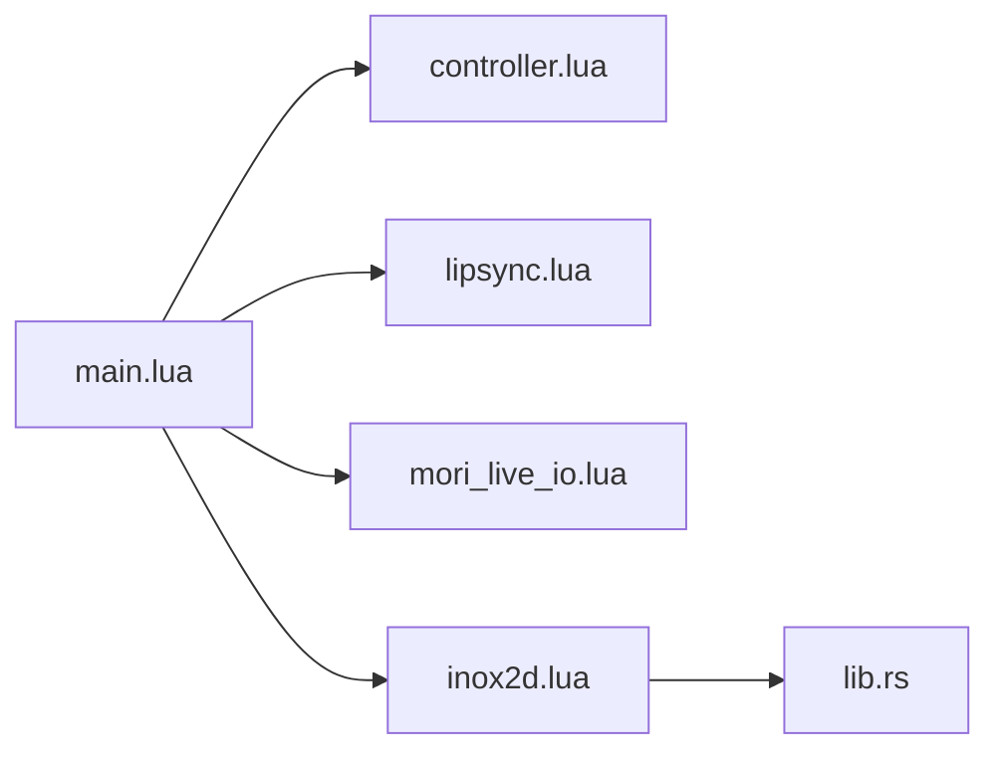

# Love2D前端

<cite>
**本文引用的文件**
- [main.lua](file://mori_live2d/love2d_frontend/main.lua)
- [controller.lua](file://mori_live2d/love2d_frontend/controller.lua)
- [lipsync.lua](file://mori_live2d/love2d_frontend/lipsync.lua)
- [mori_live_io.lua](file://mori_live2d/love2d_frontend/mori_live_io.lua)
- [inox2d.lua](file://mori_live2d/love2d_frontend/inox2d.lua)
- [lib.rs](file://mori_live2d/native/inox2d_ffi/src/lib.rs)
- [cli.py](file://mori_live2d/cli.py)
- [README.md](file://mori_live2d/README.md)
- [example_models.py](file://mori_live2d/example_models.py)
- [inochi_session.py](file://mori_live2d/inochi_session.py)
- [util.py](file://mori_live2d/util.py)
</cite>

## 目录
1. [简介](#简介)
2. [项目结构](#项目结构)
3. [核心组件](#核心组件)
4. [架构总览](#架构总览)
5. [详细组件分析](#详细组件分析)
6. [依赖关系分析](#依赖关系分析)
7. [性能考虑](#性能考虑)
8. [故障排查指南](#故障排查指南)
9. [结论](#结论)
10. [附录](#附录)

## 简介
本文件为 Love2D 前端系统的技术文档，聚焦于 Mori 中 Love2D 渲染前端与 Inox2D 的集成方案。内容涵盖：
- 主循环与渲染管线
- 事件处理与 Live IO 通信
- 控制器模块（用户输入、状态管理、生命周期）
- Inox2D Lua 绑定（C 函数调用、数据类型转换、错误处理）
- 嘴形同步系统（音频分析、表情计算、帧率控制）
- 项目组织、资源管理与性能优化建议

## 项目结构
Love2D 前端位于 mori_live2d/love2d_frontend，核心入口为 main.lua，其他模块分别负责控制器、嘴形同步、Live IO 通信与 Inox2D Lua FFI 绑定。原生层通过 Rust 实现的共享库 libmori_inox2d.so 提供 Inox2D 渲染能力。

图示来源
- [main.lua:150-400](file://mori_live2d/love2d_frontend/main.lua#L150-L400)
- [controller.lua:600-872](file://mori_live2d/love2d_frontend/controller.lua#L600-L872)
- [lipsync.lua:62-125](file://mori_live2d/love2d_frontend/lipsync.lua#L62-L125)
- [mori_live_io.lua:214-260](file://mori_live2d/love2d_frontend/mori_live_io.lua#L214-L260)
- [inox2d.lua:52-89](file://mori_live2d/love2d_frontend/inox2d.lua#L52-L89)
- [lib.rs:135-290](file://mori_live2d/native/inox2d_ffi/src/lib.rs#L135-L290)

章节来源
- [README.md:1-157](file://mori_live2d/README.md#L1-L157)
- [main.lua:1-631](file://mori_live2d/love2d_frontend/main.lua#L1-L631)

## 核心组件
- 主循环与渲染
  - 初始化 Love2D 窗口、字体、渲染器信息
  - 加载 Inox2D 共享库与 Puppet，建立参数映射
  - 每帧更新：轮询字幕/事件、处理音频队列、驱动控制器、调用 Inox2D 渲染
  - 绘制：渲染 Puppet，叠加 UI 与字幕
- 控制器模块
  - 参数映射：基于关键词模糊匹配与覆盖文件，自动选择 head/body/eye/mouth/breath 等参数
  - 状态管理：Idle 随机抖动、Mouse Look、自动眨眼、眼跳（saccade）、呼吸
  - 生命周期：初始化、更新、重载映射
- 嘴形同步
  - 预计算音频包络（RMS），按时间窗口采样
  - 播放音频时根据包络平滑驱动 mouth_open 参数
- Live IO
  - 轮询 events.jsonl 获取新 TTS 音频路径与包络参数
  - 读取 subtitle.txt 字幕文件，带 UTF-8 容错处理
- Inox2D Lua 绑定
  - LuaJIT FFI 声明 C 接口，动态加载 libmori_inox2d.so
  - 封装 create/destroy/resume/draw/set_param/get_parameters 等
  - 错误回传 via inox_last_error

章节来源
- [main.lua:156-400](file://mori_live2d/love2d_frontend/main.lua#L156-L400)
- [controller.lua:201-872](file://mori_live2d/love2d_frontend/controller.lua#L201-L872)
- [lipsync.lua:31-125](file://mori_live2d/love2d_frontend/lipsync.lua#L31-L125)
- [mori_live_io.lua:200-260](file://mori_live2d/love2d_frontend/mori_live_io.lua#L200-L260)
- [inox2d.lua:108-195](file://mori_live2d/love2d_frontend/inox2d.lua#L108-L195)
- [lib.rs:135-374](file://mori_live2d/native/inox2d_ffi/src/lib.rs#L135-L374)

## 架构总览
Love2D 前端以 main.lua 为核心，协调控制器、嘴形同步与 Live IO 模块，通过 inox2d.lua 的 LuaJIT FFI 调用原生 libmori_inox2d.so，完成 Inox2D 的模型加载、参数设置与渲染。

图示来源
- [main.lua:293-399](file://mori_live2d/love2d_frontend/main.lua#L293-L399)
- [controller.lua:700-872](file://mori_live2d/love2d_frontend/controller.lua#L700-L872)
- [lipsync.lua:62-125](file://mori_live2d/love2d_frontend/lipsync.lua#L62-L125)
- [mori_live_io.lua:229-260](file://mori_live2d/love2d_frontend/mori_live_io.lua#L229-L260)
- [inox2d.lua:108-161](file://mori_live2d/love2d_frontend/inox2d.lua#L108-L161)
- [lib.rs:135-290](file://mori_live2d/native/inox2d_ffi/src/lib.rs#L135-L290)

## 详细组件分析

### 主循环与渲染管线
- 初始化阶段
  - 设置窗口尺寸与标题，加载字体与渲染器信息
  - 解析 MORI_* 环境变量与命令行参数，确定 live 目录、字幕/事件/口型文件路径、Puppet 路径与映射路径
  - 加载 Inox2D 共享库，创建句柄并查询参数列表
  - 构造控制器，初始化选项（Idle、Mouse Look、Blink、Saccade、Breath）
- 每帧更新
  - 低频轮询字幕文件与口型值
  - 轮询 events.jsonl，将新 TTS 音频加入播放队列
  - 若无播放中音频且队列非空，则加载并播放
  - 根据播放进度或口型值更新嘴形
  - 调用控制器更新头/身体/眼睛/呼吸等参数
  - 调用 Inox2D begin_frame/end_frame/draw
- 绘制阶段
  - 清屏并绘制 Puppet
  - 重置 Love2D 图形状态后绘制 UI 与字幕
  - 支持自动截图（CI/无头场景）

章节来源
- [main.lua:156-283](file://mori_live2d/love2d_frontend/main.lua#L156-L283)
- [main.lua:293-399](file://mori_live2d/love2d_frontend/main.lua#L293-L399)
- [main.lua:401-553](file://mori_live2d/love2d_frontend/main.lua#L401-L553)
- [main.lua:628-631](file://mori_live2d/love2d_frontend/main.lua#L628-L631)

### 控制器模块
- 参数映射
  - 自动映射 head/body/eye/mouth/breath 等关键语义参数
  - 支持覆盖文件（.mori-map/.mori.lua），允许参数名反向（!）
  - 自动检测 Blink 与 eye_open 的反向关系
- 状态与行为
  - Idle：对 head_roll/yaw/pitch 注入噪声
  - Mouse Look：将鼠标坐标映射到 head/body 的旋转
  - Blink：闭合/开启曲线缓动，周期随机
  - Saccade：随机方向与强度的眼跳
  - Breathing：正弦波驱动呼吸参数
- 参数设置
  - 标量 0..1 与标量 -1..1 两种模式
  - 向量参数（vec2）同时设置 x/y
  - 平滑滤波（指数平滑）避免突变

图示来源
- [controller.lua:700-872](file://mori_live2d/love2d_frontend/controller.lua#L700-L872)
- [controller.lua:477-554](file://mori_live2d/love2d_frontend/controller.lua#L477-L554)

章节来源
- [controller.lua:201-452](file://mori_live2d/love2d_frontend/controller.lua#L201-L452)
- [controller.lua:556-632](file://mori_live2d/love2d_frontend/controller.lua#L556-L632)
- [controller.lua:634-872](file://mori_live2d/love2d_frontend/controller.lua#L634-L872)

### Inox2D Lua 绑定（FFI）
- FFI 声明
  - 定义 InoxHandle、参数与返回类型，适配 32/64 位 size_t
- 库加载与查找
  - 支持 MORI_INOX2D_LIB/INOX2D_LIB 环境变量与多候选路径
- 关键接口封装
  - create/destroy/resume/draw：句柄生命周期与渲染
  - set_param：按名称设置参数值（支持 vec2）
  - get_parameters：枚举参数名与范围
  - last_error：错误回传
- 错误处理
  - 统一通过 inox_last_error 获取原生错误字符串
  - 对空指针、无效 UTF-8、参数上下文未初始化等情况进行保护

图示来源
- [inox2d.lua:10-35](file://mori_live2d/love2d_frontend/inox2d.lua#L10-L35)
- [inox2d.lua:52-195](file://mori_live2d/love2d_frontend/inox2d.lua#L52-L195)
- [lib.rs:135-374](file://mori_live2d/native/inox2d_ffi/src/lib.rs#L135-L374)

章节来源
- [inox2d.lua:1-198](file://mori_live2d/love2d_frontend/inox2d.lua#L1-L198)
- [lib.rs:1-375](file://mori_live2d/native/inox2d_ffi/src/lib.rs#L1-L375)

### 嘴形同步系统
- 音频包络
  - 读取 WAV 字节，构造 SoundData 与 Source
  - 按窗口大小（秒）分段计算 RMS，归一化得到包络
- 播放与驱动
  - 从 events.jsonl 或调试 WAV 获取包络与窗口参数
  - 播放时按时间索引包络值，幂函数压缩后平滑驱动 mouth_open
- 帧率控制
  - 包络索引基于窗口秒长与采样率，确保与播放进度一致

图示来源
- [lipsync.lua:31-125](file://mori_live2d/love2d_frontend/lipsync.lua#L31-L125)
- [mori_live_io.lua:229-260](file://mori_live2d/love2d_frontend/mori_live_io.lua#L229-L260)
- [main.lua:357-399](file://mori_live2d/love2d_frontend/main.lua#L357-L399)

章节来源
- [lipsync.lua:1-128](file://mori_live2d/love2d_frontend/lipsync.lua#L1-L128)
- [mori_live_io.lua:200-260](file://mori_live2d/love2d_frontend/mori_live_io.lua#L200-L260)
- [main.lua:357-399](file://mori_live2d/love2d_frontend/main.lua#L357-L399)

### Live IO 模块
- 字幕读取
  - 读取文本，去除 BOM，统一换行符，UTF-8 容错清洗
- 事件轮询
  - 记录文件偏移，增量读取 events.jsonl
  - 解析 JSON 字段：wav_path、mouth_envelope、mouth_window_sec、mouth_duration
  - 校验文件存在性后返回事件列表
- 错误处理
  - 对无效 JSON、编码问题进行容错

章节来源
- [mori_live_io.lua:1-263](file://mori_live2d/love2d_frontend/mori_live_io.lua#L1-L263)

### 项目组织与资源管理
- CLI 工具
  - build-inox2d：编译原生库并复制到 model/inochi2d/native
  - install-models：下载示例模型（Aka/Midori）
  - install-session/run-session：安装/运行官方 Inochi Session
- 示例模型与工具
  - example_models.py：定义示例模型清单与下载逻辑
  - inochi_session.py：GitHub Release 自动下载与运行
  - util.py：HTTP/ZIP 工具

章节来源
- [cli.py:20-125](file://mori_live2d/cli.py#L20-L125)
- [example_models.py:1-57](file://mori_live2d/example_models.py#L1-L57)
- [inochi_session.py:1-103](file://mori_live2d/inochi_session.py#L1-L103)
- [util.py:1-68](file://mori_live2d/util.py#L1-L68)

## 依赖关系分析
- 组件耦合
  - main.lua 依赖 controller、lipsync、mori_live_io、inox2d 四个模块
  - controller 依赖参数映射与控制器内部状态
  - lipsync 依赖 Love2D 音频子系统
  - inox2d.lua 依赖 libmori_inox2d.so
- 外部依赖
  - LuaJIT FFI、Love2D 11.x、OpenGL/GLX、Rust 工具链
- 潜在环依赖
  - 无直接环依赖，模块职责清晰

图示来源
- [main.lua:15-18](file://mori_live2d/love2d_frontend/main.lua#L15-L18)
- [controller.lua:1-20](file://mori_live2d/love2d_frontend/controller.lua#L1-L20)
- [lipsync.lua:1-20](file://mori_live2d/love2d_frontend/lipsync.lua#L1-L20)
- [mori_live_io.lua:1-20](file://mori_live2d/love2d_frontend/mori_live_io.lua#L1-L20)
- [inox2d.lua:1-20](file://mori_live2d/love2d_frontend/inox2d.lua#L1-L20)
- [lib.rs:1-20](file://mori_live2d/native/inox2d_ffi/src/lib.rs#L1-L20)

章节来源
- [main.lua:15-18](file://mori_live2d/love2d_frontend/main.lua#L15-L18)
- [controller.lua:1-20](file://mori_live2d/love2d_frontend/controller.lua#L1-L20)
- [lipsync.lua:1-20](file://mori_live2d/love2d_frontend/lipsync.lua#L1-L20)
- [mori_live_io.lua:1-20](file://mori_live2d/love2d_frontend/mori_live_io.lua#L1-L20)
- [inox2d.lua:1-20](file://mori_live2d/love2d_frontend/inox2d.lua#L1-L20)
- [lib.rs:1-20](file://mori_live2d/native/inox2d_ffi/src/lib.rs#L1-L20)

## 性能考虑
- I/O 与轮询
  - 字幕与口型轮询频率较低（0.2s/0.05s），减少磁盘压力
  - events.jsonl 使用文件尾部偏移增量读取，避免全量扫描
- 渲染与参数设置
  - 每帧仅在必要时调用 begin_frame/end_frame/draw
  - 参数设置采用指数平滑，降低 GPU/驱动抖动
- 音频与包络
  - 包络预计算一次，按窗口索引复用
  - 播放结束后及时释放播放句柄
- 字体与 UI
  - 字体加载失败时降级至系统字体，保证稳定性
- 建议
  - 在高分辨率下适当降低渲染缩放
  - 使用 MORI_MOUSE_LOOK=0 部署以减少 CPU 占用
  - 将 MORI_INOX2D_LIB 指向已编译的共享库，避免运行时查找

## 故障排查指南
- 共享库加载失败
  - 确认已执行构建：python3 -m mori_live2d.cli build-inox2d
  - 检查 MORI_INOX2D_LIB 是否正确指向 libmori_inox2d.so
  - 查看 inox_last_error 输出
- Puppet 加载失败
  - 确认 MORI_PUPPET_PATH 指向有效 .inx/.inp
  - 检查模型节点类型是否被当前 Inox2D 实现支持
- 字幕乱码
  - 确保 subtitle.txt 使用 UTF-8 编码，或由系统自动清洗
- 无法播放音频
  - 确认 events.jsonl 中 wav_path 存在且可读
  - 检查 mouth_envelope/mouth_window_sec 配置
- 控制器映射异常
  - 提供 .mori-map 或 .mori.lua 覆盖映射
  - 使用 R 键重新加载映射

章节来源
- [README.md:10-15](file://mori_live2d/README.md#L10-L15)
- [main.lua:226-242](file://mori_live2d/love2d_frontend/main.lua#L226-L242)
- [mori_live_io.lua:200-212](file://mori_live2d/love2d_frontend/mori_live_io.lua#L200-L212)
- [lipsync.lua:62-107](file://mori_live2d/love2d_frontend/lipsync.lua#L62-L107)
- [controller.lua:101-167](file://mori_live2d/love2d_frontend/controller.lua#L101-L167)
- [main.lua:579-587](file://mori_live2d/love2d_frontend/main.lua#L579-L587)

## 结论
Love2D 前端通过 LuaJIT FFI 将 Inox2D 的 OpenGL 渲染能力与 Lua 层控制器、嘴形同步、Live IO 有机结合，形成轻量、可扩展的 VTuber 前端。其设计强调：
- 渲染与逻辑分离：原生层专注渲染，Lua 层专注控制与交互
- 参数映射与容错：自动映射与覆盖文件提升跨模型兼容性
- 事件驱动与低开销：文件轮询与增量读取降低 I/O 压力
- 可靠的错误处理：统一错误回传与降级策略

## 附录
- 快速开始
  - 构建原生库：python3 -m mori_live2d.cli build-inox2d
  - 下载示例模型：python3 -m mori_live2d.cli install-models --models aka midori
  - 运行前端：love mori_live2d/love2d_frontend
- 环境变量与参数
  - MORI_LIVE_DIR、MORI_SUBTITLE_PATH、MORI_EVENT_LOG、MORI_PUPPET_PATH、MORI_INOX2D_LIB、MORI_MAPPING_PATH、MORI_MOUSE_LOOK、MORI_FONT_PATH、MORI_UI_FONT_SIZE、MORI_SUBTITLE_FONT_SIZE
- 常用操作
  - H：显示/隐藏映射与调试信息
  - I/F/B：开关 Idle/Mouse Look/Auto Blink
  - R：重新加载参数映射
  - 拖拽 .inx/.inp 切换 Puppet

章节来源
- [README.md:16-157](file://mori_live2d/README.md#L16-L157)
- [main.lua:555-588](file://mori_live2d/love2d_frontend/main.lua#L555-L588)
- [main.lua:214-224](file://mori_live2d/love2d_frontend/main.lua#L214-L224)