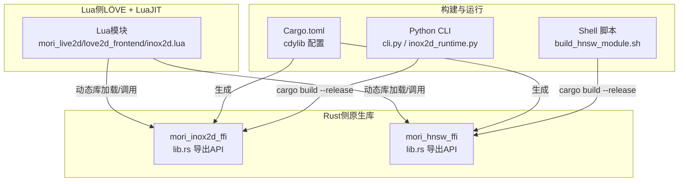
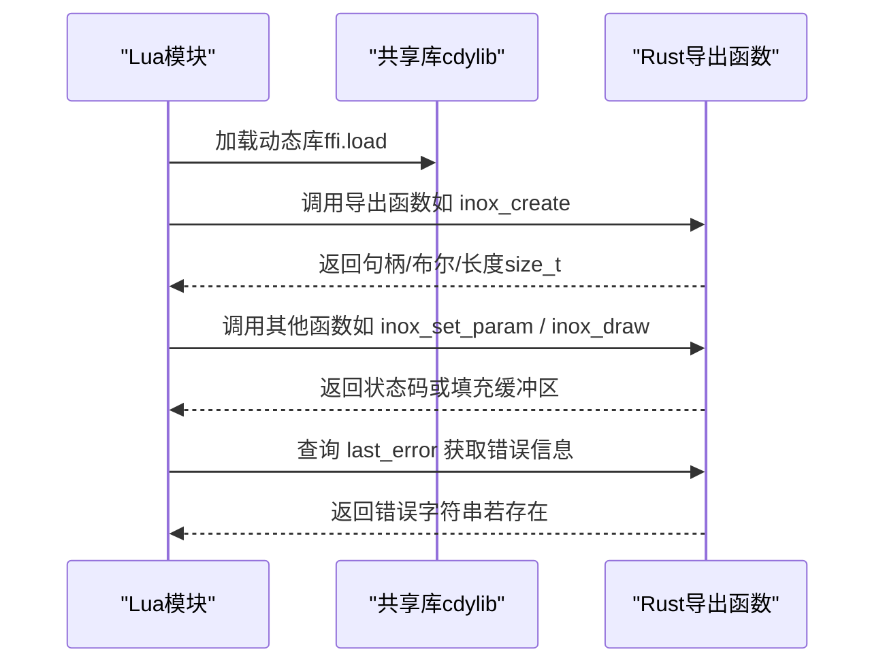
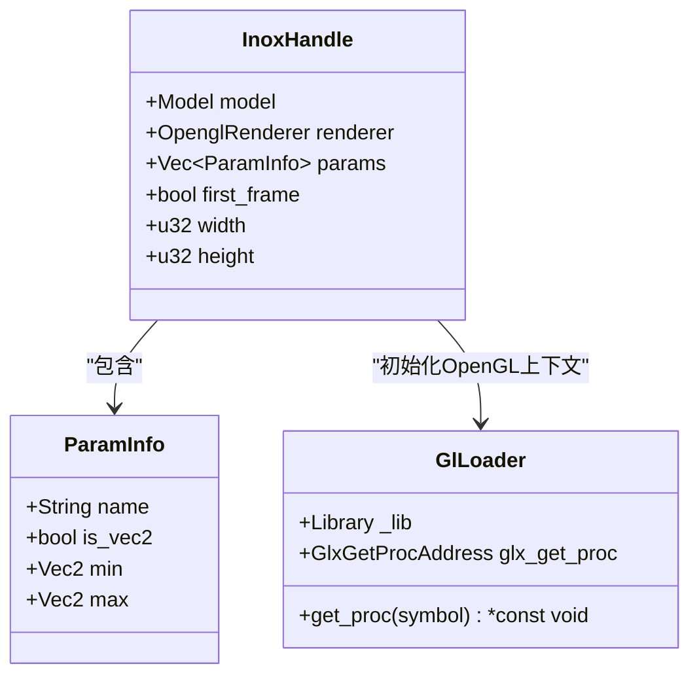
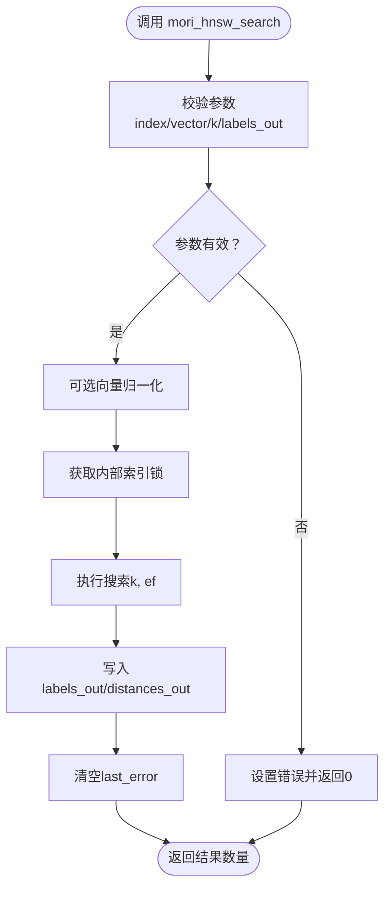
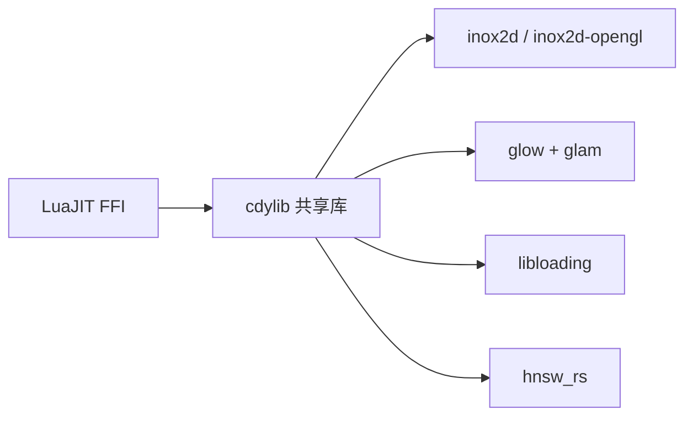

# Rust FFI绑定

<cite>
**本文档引用的文件**
- [mori_live2d/native/inox2d_ffi/src/lib.rs](file://mori_live2d/native/inox2d_ffi/src/lib.rs)
- [mori_live2d/native/inox2d_ffi/Cargo.toml](file://mori_live2d/native/inox2d_ffi/Cargo.toml)
- [mori_live2d/love2d_frontend/inox2d.lua](file://mori_live2d/love2d_frontend/inox2d.lua)
- [mori_live2d/inochi_session.py](file://mori_live2d/inochi_session.py)
- [mori_live2d/cli.py](file://mori_live2d/cli.py)
- [mori_memory/native/hnsw/rust/src/lib.rs](file://mori_memory/native/hnsw/rust/src/lib.rs)
- [mori_memory/native/hnsw/rust/Cargo.toml](file://mori_memory/native/hnsw/rust/Cargo.toml)
- [mori_memory/scripts/build_hnsw_module.sh](file://mori_memory/scripts/build_hnsw_module.sh)
</cite>

## 目录
1. [简介](#简介)
2. [项目结构](#项目结构)
3. [核心组件](#核心组件)
4. [架构总览](#架构总览)
5. [组件详细分析](#组件详细分析)
6. [依赖关系分析](#依赖关系分析)
7. [性能考量](#性能考量)
8. [故障排查指南](#故障排查指南)
9. [结论](#结论)
10. [附录](#附录)

## 简介
本文件面向Rust FFI绑定系统，聚焦于Mori中通过C ABI导出的原生库与Lua之间的互操作。内容涵盖：
- FFI在Mori中的作用：连接Rust高性能计算与Lua脚本控制层
- 函数调用机制：从Lua到Rust的参数传递、返回值约定、错误回传
- 数据类型映射：字符串、浮点、整型、指针与数组的跨语言表示
- 内存管理策略：堆分配、Box包装、裸指针传递、生命周期与所有权
- C函数导出实现：unsafe使用边界、指针校验、字符串编码转换
- 内存安全保证：静态检查、锁保护、错误状态隔离
- 错误处理机制：last_error模式、panic捕获、全局/局部错误
- 构建系统：Cargo配置、cdylib产物、交叉编译与发布流程
- 调试技巧：GDB、内存泄漏检测、性能分析

## 项目结构
与FFI相关的关键模块分布如下：
- Live2D前端（LÖVE + LuaJIT）：负责加载共享库、声明C函数签名、调用Rust导出接口
- Live2D原生库（Rust）：提供OpenGL渲染管线、Inox Puppet控制、参数设置与绘制
- HNSW向量检索（Rust）：提供近似最近邻索引的创建、保存、查询等能力
- 构建与分发：Python脚本驱动Cargo构建，复制产物至模型目录供Lua加载

图表来源
- [mori_live2d/love2d_frontend/inox2d.lua:1-198](file://mori_live2d/love2d_frontend/inox2d.lua#L1-L198)
- [mori_live2d/native/inox2d_ffi/src/lib.rs:1-375](file://mori_live2d/native/inox2d_ffi/src/lib.rs#L1-L375)
- [mori_memory/native/hnsw/rust/src/lib.rs:1-592](file://mori_memory/native/hnsw/rust/src/lib.rs#L1-L592)
- [mori_live2d/native/inox2d_ffi/Cargo.toml:1-16](file://mori_live2d/native/inox2d_ffi/Cargo.toml#L1-L16)
- [mori_memory/native/hnsw/rust/Cargo.toml:1-16](file://mori_memory/native/hnsw/rust/Cargo.toml#L1-L16)
- [mori_live2d/cli.py:1-125](file://mori_live2d/cli.py#L1-L125)
- [mori_live2d/inochi_session.py:1-62](file://mori_live2d/inochi_session.py#L1-L62)
- [mori_memory/scripts/build_hnsw_module.sh:1-16](file://mori_memory/scripts/build_hnsw_module.sh#L1-L16)

章节来源
- [mori_live2d/love2d_frontend/inox2d.lua:1-198](file://mori_live2d/love2d_frontend/inox2d.lua#L1-L198)
- [mori_live2d/native/inox2d_ffi/src/lib.rs:1-375](file://mori_live2d/native/inox2d_ffi/src/lib.rs#L1-L375)
- [mori_memory/native/hnsw/rust/src/lib.rs:1-592](file://mori_memory/native/hnsw/rust/src/lib.rs#L1-L592)

## 核心组件
- Lua侧FFI桥接：声明C函数原型、查找并加载共享库、调用原生接口、读取last_error
- Rust侧导出API：以extern "C"形式暴露的函数，负责参数校验、错误状态设置、资源生命周期管理
- 构建系统：Cargo配置cdylib输出、Python脚本执行cargo build并复制产物、shell脚本统一HNSW构建流程

章节来源
- [mori_live2d/love2d_frontend/inox2d.lua:1-198](file://mori_live2d/love2d_frontend/inox2d.lua#L1-L198)
- [mori_live2d/native/inox2d_ffi/src/lib.rs:1-375](file://mori_live2d/native/inox2d_ffi/src/lib.rs#L1-L375)
- [mori_memory/native/hnsw/rust/src/lib.rs:1-592](file://mori_memory/native/hnsw/rust/src/lib.rs#L1-L592)

## 架构总览
下图展示了Lua与Rust之间通过FFI进行交互的端到端流程。

图表来源
- [mori_live2d/love2d_frontend/inox2d.lua:77-106](file://mori_live2d/love2d_frontend/inox2d.lua#L77-L106)
- [mori_live2d/native/inox2d_ffi/src/lib.rs:22-39](file://mori_live2d/native/inox2d_ffi/src/lib.rs#L22-L39)

## 组件详细分析

### Live2D FFI（mori_inox2d_ffi）
该模块通过cdylib导出一组C函数，用于创建/销毁渲染上下文、设置参数、帧循环与绘制，并提供参数元信息查询。

- 关键导出函数
  - 创建与销毁：创建渲染器并返回句柄；销毁时释放Box包装的资源
  - 帧循环：开始/结束帧、绘制
  - 参数控制：按名称设置二维参数值
  - 元信息查询：参数数量、名称、是否为向量、范围
  - 错误报告：last_error用于跨语言错误回传

- 数据类型映射
  - 字符串：const char* 与CStr互转，UTF-8校验
  - 指针：*mut InoxHandle作为句柄，Box::into_raw与Box::from_raw管理所有权
  - 浮点：f32用于坐标与距离
  - 整型：c_int用于布尔/状态，usize用于长度与索引

- unsafe使用与边界
  - 对空指针进行严格校验，非法输入直接设置last_error并返回失败
  - 使用CStr::from_ptr与指针解引用，确保只在已验证非空前提下解引用
  - 字节拷贝使用ptr::copy_nonoverlapping，保证不重叠且无越界

- 生命周期与内存管理
  - 句柄由Rust侧Box包装并通过裸指针传递给Lua
  - Lua侧仅持有裸指针，不持有Rust所有权；销毁时Lua调用destroy释放
  - last_error使用静态Mutex保护，避免并发写入竞争

- 错误处理
  - 单一错误通道：LAST_ERROR静态变量，所有错误最终落盘于此
  - Lua侧通过inox_last_error查询，返回所需缓冲大小或实际错误字符串

图表来源
- [mori_live2d/native/inox2d_ffi/src/lib.rs:84-123](file://mori_live2d/native/inox2d_ffi/src/lib.rs#L84-L123)
- [mori_live2d/native/inox2d_ffi/src/lib.rs:135-207](file://mori_live2d/native/inox2d_ffi/src/lib.rs#L135-L207)

章节来源
- [mori_live2d/native/inox2d_ffi/src/lib.rs:1-375](file://mori_live2d/native/inox2d_ffi/src/lib.rs#L1-L375)
- [mori_live2d/native/inox2d_ffi/Cargo.toml:1-16](file://mori_live2d/native/inox2d_ffi/Cargo.toml#L1-L16)
- [mori_live2d/love2d_frontend/inox2d.lua:1-198](file://mori_live2d/love2d_frontend/inox2d.lua#L1-L198)

### HNSW FFI（mori_hnsw_ffi）
该模块提供向量检索能力，支持L2、内积、余弦三种空间，导出创建、加载、保存、添加、查询等接口。

- 关键导出函数
  - 创建/加载：根据空间类型与维度构造索引，支持从磁盘加载
  - 保存/销毁：持久化索引到文件系统，释放内部资源
  - 添加/查询：插入带标签的向量，执行kNN搜索
  - 属性查询：维度、容量、当前数量、空间类型等

- 数据类型映射
  - 向量：*const f32指向连续内存，Rust侧通过slice::from_raw_parts安全切片
  - 标签：u64作为点标识
  - 搜索结果：labels_out与distances_out双缓冲输出

- unsafe使用与边界
  - 对空指针进行严格校验，非法输入返回0/false并设置错误
  - 使用panic::catch_unwind包裹外部调用，防止异常传播至C世界
  - 通过AtomicUsize与Mutex保护可变状态，避免竞态

- 错误处理
  - 支持局部last_error与全局last_error，便于多实例场景
  - 错误消息中性化处理，移除NUL字符，避免跨语言字符串问题

图表来源
- [mori_memory/native/hnsw/rust/src/lib.rs:496-554](file://mori_memory/native/hnsw/rust/src/lib.rs#L496-L554)

章节来源
- [mori_memory/native/hnsw/rust/src/lib.rs:1-592](file://mori_memory/native/hnsw/rust/src/lib.rs#L1-L592)
- [mori_memory/native/hnsw/rust/Cargo.toml:1-16](file://mori_memory/native/hnsw/rust/Cargo.toml#L1-L16)

### Lua侧FFI桥接
- 动态库加载：优先从环境变量或工作目录候选路径查找共享库，成功后通过ffi.load加载
- C函数声明：根据Rust导出的ABI声明对应原型，包含句柄、布尔、长度与缓冲区参数
- 错误查询：通过inox_last_error获取错误字符串，支持先查询所需长度再分配缓冲区
- 安全调用：对句柄与返回值进行判空/判真，避免未初始化状态下的调用

章节来源
- [mori_live2d/love2d_frontend/inox2d.lua:1-198](file://mori_live2d/love2d_frontend/inox2d.lua#L1-L198)

### 构建系统与分发
- Rust构建
  - cdylib产物：通过Cargo.toml设置crate-type为cdylib，生成共享库
  - 发布优化：启用LTO、单代码生成单元、最高优化级别
- Python构建脚本
  - cargo build --release执行构建，定位目标产物并复制到模型目录
  - CLI命令行工具提供一键安装会话、下载示例模型、运行会话等辅助功能
- Shell脚本
  - 统一HNSW模块构建流程，设置CARGO_TARGET_DIR并复制产物

章节来源
- [mori_live2d/native/inox2d_ffi/Cargo.toml:1-16](file://mori_live2d/native/inox2d_ffi/Cargo.toml#L1-L16)
- [mori_memory/native/hnsw/rust/Cargo.toml:1-16](file://mori_memory/native/hnsw/rust/Cargo.toml#L1-L16)
- [mori_live2d/cli.py:1-125](file://mori_live2d/cli.py#L1-L125)
- [mori_live2d/inochi_session.py:1-62](file://mori_live2d/inochi_session.py#L1-L62)
- [mori_memory/scripts/build_hnsw_module.sh:1-16](file://mori_memory/scripts/build_hnsw_module.sh#L1-L16)

## 依赖关系分析
- 外部库
  - inox2d系列：解析Puppet格式、初始化渲染与物理系统
  - glow/glam：OpenGL上下文与数学运算
  - libloading：运行时加载系统库（如libGL.so.1）
  - hnsw_rs：近似最近邻索引实现，支持SIMD加速
- 内部耦合
  - Lua侧仅依赖共享库导出的C ABI，不直接依赖Rust内部结构
  - Rust侧通过静态变量与锁隔离错误状态，避免跨模块污染

图表来源
- [mori_live2d/native/inox2d_ffi/Cargo.toml:9-16](file://mori_live2d/native/inox2d_ffi/Cargo.toml#L9-L16)
- [mori_memory/native/hnsw/rust/Cargo.toml:14-16](file://mori_memory/native/hnsw/rust/Cargo.toml#L14-L16)

章节来源
- [mori_live2d/native/inox2d_ffi/Cargo.toml:1-16](file://mori_live2d/native/inox2d_ffi/Cargo.toml#L1-L16)
- [mori_memory/native/hnsw/rust/Cargo.toml:1-16](file://mori_memory/native/hnsw/rust/Cargo.toml#L1-L16)

## 性能考量
- 发布优化
  - 启用LTO与单代码生成单元，减少二进制体积与提升指令级并行
  - 最高优化级别，适合CPU密集型渲染与检索任务
- SIMD加速
  - hnsw_rs启用simdeez_f特性，利用SIMD指令提升向量运算性能
- 锁粒度
  - HNSW内部使用Mutex保护，注意在高频调用场景下的锁竞争
- 缓冲区复用
  - Lua侧通过先查询长度再分配缓冲区的方式，避免重复分配与拷贝

## 故障排查指南
- 共享库找不到
  - 检查MORI_INOX2D_LIB或INOX2D_LIB环境变量
  - 确认LÖVE工作目录与候选路径是否存在产物
- 字符串编码问题
  - Rust侧对UTF-8进行校验，非法编码会触发last_error
  - Lua侧通过ffi.string读取C字符串，注意NUL终止符
- 空指针与句柄失效
  - 所有导出函数均对空指针进行校验，返回失败并设置错误
  - 确保在destroy之前完成所有调用
- OpenGL初始化失败
  - 检查libGL.so.1加载与glXGetProcAddress可用性
  - 确认显示环境（X11/Wayland）与权限
- HNSW查询异常
  - 检查向量维度与索引维度一致性
  - 使用mori_hnsw_global_last_error与mori_hnsw_last_error区分全局与实例错误
- 调试建议
  - GDB：附加进程，设置断点于导出函数入口，检查参数与返回值
  - 内存：使用valgrind或AddressSanitizer检测越界与泄漏
  - 性能：perf record/interpret分析热点函数，关注OpenGL与向量运算

章节来源
- [mori_live2d/love2d_frontend/inox2d.lua:52-89](file://mori_live2d/love2d_frontend/inox2d.lua#L52-L89)
- [mori_live2d/native/inox2d_ffi/src/lib.rs:22-39](file://mori_live2d/native/inox2d_ffi/src/lib.rs#L22-L39)
- [mori_memory/native/hnsw/rust/src/lib.rs:222-240](file://mori_memory/native/hnsw/rust/src/lib.rs#L222-L240)

## 结论
本FFI体系通过严格的参数校验、错误状态隔离与受控的unsafe使用，在Lua与Rust之间建立了稳定高效的桥梁。Live2D模块提供完整的渲染与参数控制能力，HNSW模块提供高性能向量检索。配合完善的构建与分发流程，开发者可以快速集成并部署这些原生能力。

## 附录
- 关键API速览
  - Live2D：创建/销毁、帧循环、绘制、参数设置、参数元信息查询、last_error
  - HNSW：创建/加载/保存/销毁、添加、查询、属性查询、last_error
- 推荐实践
  - 在Lua侧统一通过last_error获取错误详情
  - 对句柄生命周期进行显式管理，避免悬挂指针
  - 在生产环境中使用Release构建并启用优化