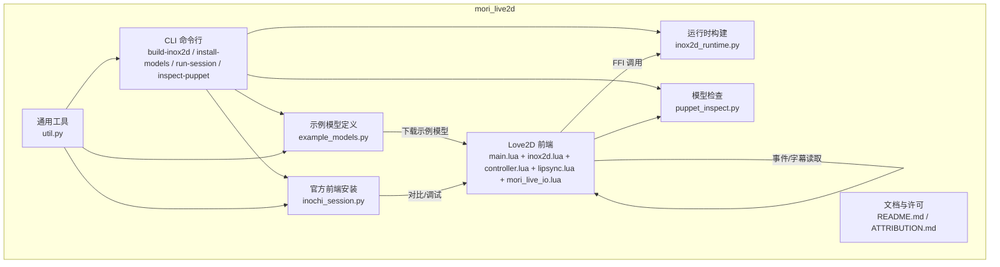
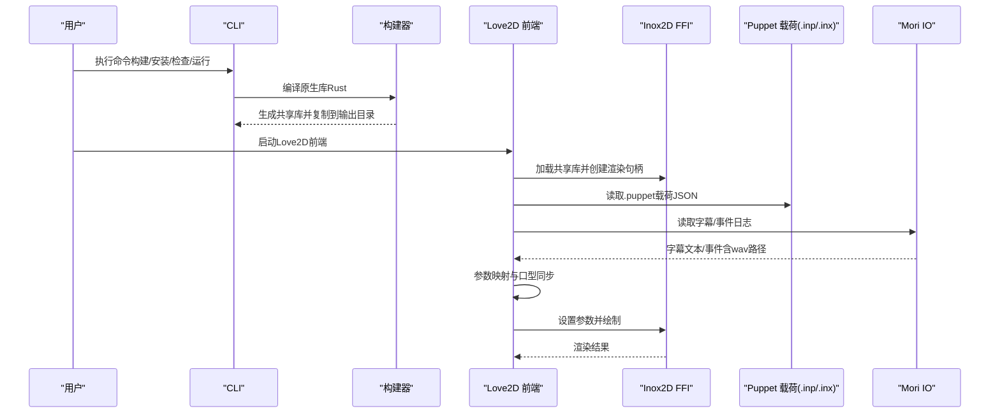
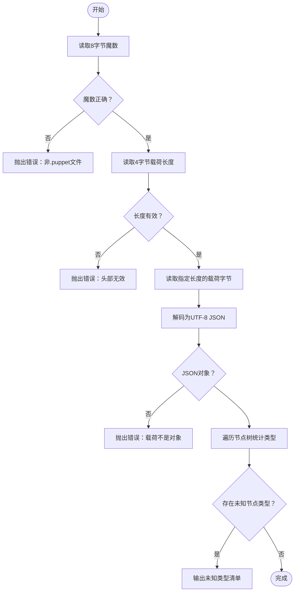
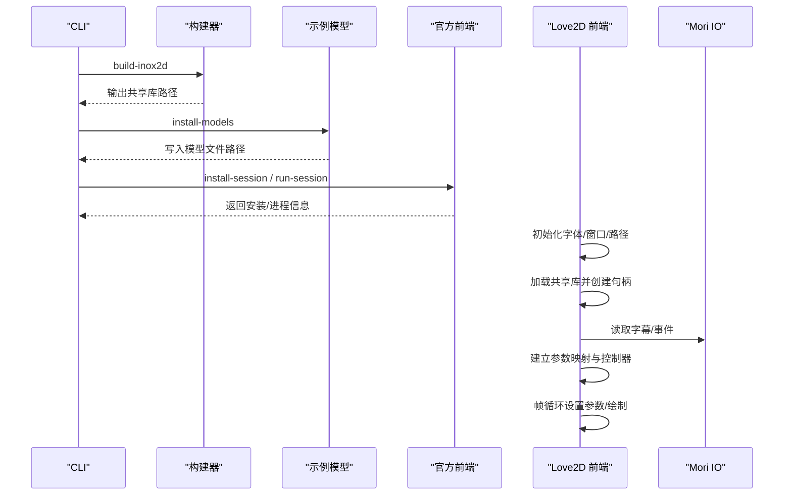
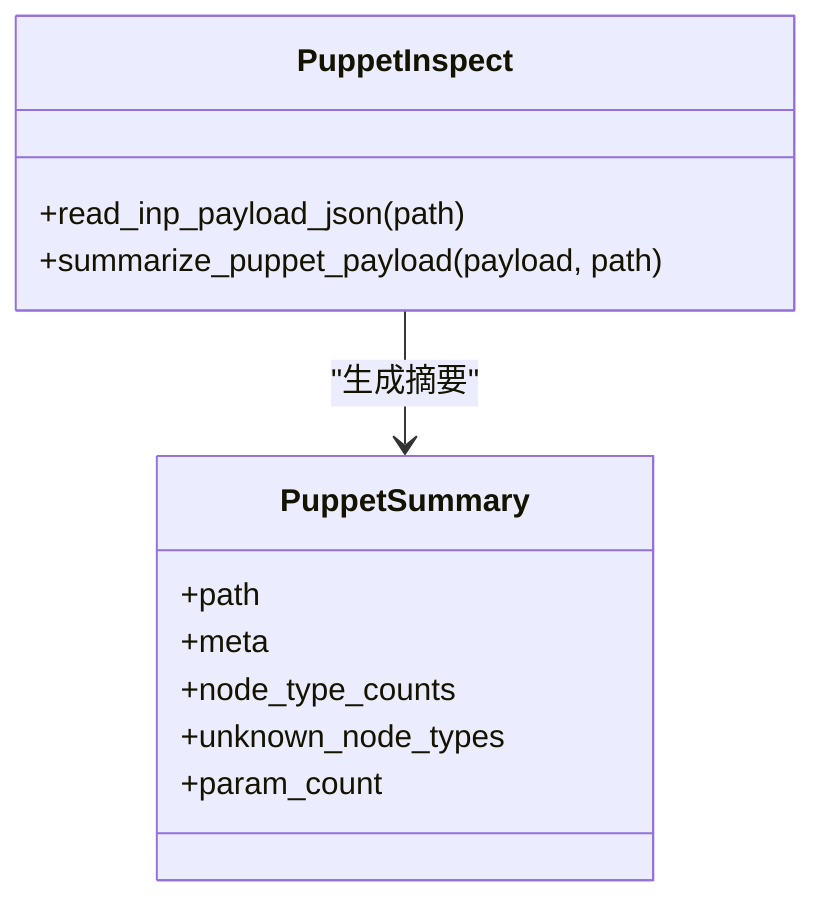
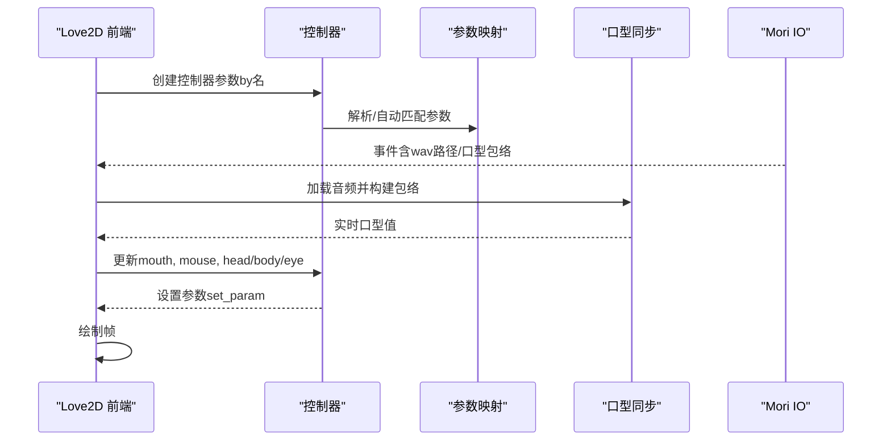
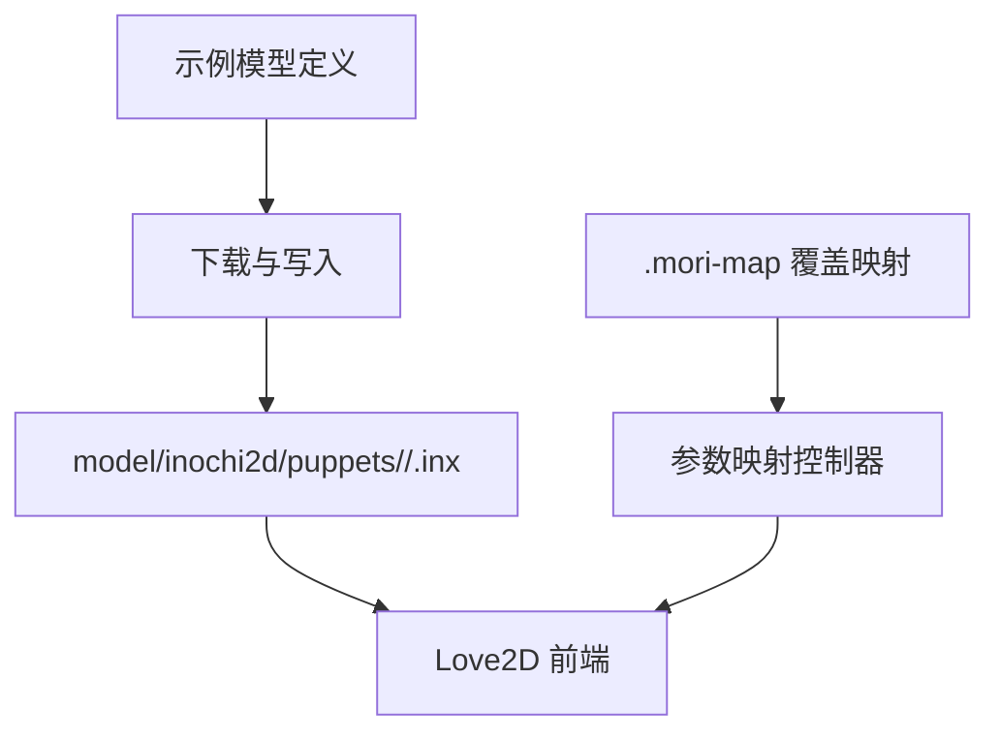
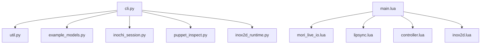

# 模型管理

<cite>
**本文引用的文件**   
- [README.md](file://mori_live2d/README.md)
- [__init__.py](file://mori_live2d/__init__.py)
- [cli.py](file://mori_live2d/cli.py)
- [example_models.py](file://mori_live2d/example_models.py)
- [util.py](file://mori_live2d/util.py)
- [inochi_session.py](file://mori_live2d/inochi_session.py)
- [puppet_inspect.py](file://mori_live2d/puppet_inspect.py)
- [inox2d_runtime.py](file://mori_live2d/inox2d_runtime.py)
- [ATTRIBUTION.md](file://mori_live2d/ATTRIBUTION.md)
- [main.lua](file://mori_live2d/love2d_frontend/main.lua)
- [inox2d.lua](file://mori_live2d/love2d_frontend/inox2d.lua)
- [controller.lua](file://mori_live2d/love2d_frontend/controller.lua)
- [lipsync.lua](file://mori_live2d/love2d_frontend/lipsync.lua)
- [mori_live_io.lua](file://mori_live2d/love2d_frontend/mori_live_io.lua)
</cite>

## 目录
1. [简介](#简介)
2. [项目结构](#项目结构)
3. [核心组件](#核心组件)
4. [架构总览](#架构总览)
5. [详细组件分析](#详细组件分析)
6. [依赖分析](#依赖分析)
7. [性能考虑](#性能考虑)
8. [故障排查指南](#故障排查指南)
9. [结论](#结论)
10. [附录](#附录)

## 简介
本文件面向Live2D模型管理系统（基于Inochi2D与Love2D前端）的技术文档，聚焦以下目标：
- 解释Live2D模型文件格式与结构（特别是Inochi2D的.puppet载荷与节点类型）
- 说明模型加载流程（文件验证、依赖检查、资源初始化）
- 阐述模型检查工具（完整性验证、兼容性检测、未知节点提示）
- 介绍示例模型的组织与使用（下载、映射、参数驱动）
- 提供模型优化与制作建议（纹理压缩、动画简化、内存控制、质量标准）

## 项目结构
mori_live2d子模块负责将Inochi2D（开源Live2D替代）接入Mori的VTuber流程，核心由以下部分组成：
- CLI工具：构建Inox2D FFI、安装示例模型、安装/运行官方Inochi Session、检查.puppet载荷
- Love2D前端：通过LuaJIT FFI调用原生Inox2D库进行渲染，驱动参数映射与口型同步
- 检查工具：解析.puppet载荷，统计节点类型与参数数量，识别未知节点类型
- 示例模型：提供Aka/Midori示例模型的下载与许可信息

**图表来源**
- [cli.py:20-54](file://mori_live2d/cli.py#L20-L54)
- [main.lua:156-283](file://mori_live2d/love2d_frontend/main.lua#L156-L283)
- [puppet_inspect.py:36-87](file://mori_live2d/puppet_inspect.py#L36-L87)
- [inox2d_runtime.py:32-64](file://mori_live2d/inox2d_runtime.py#L32-L64)
- [inochi_session.py:48-82](file://mori_live2d/inochi_session.py#L48-L82)
- [example_models.py:37-57](file://mori_live2d/example_models.py#L37-L57)
- [util.py:13-68](file://mori_live2d/util.py#L13-L68)

**章节来源**
- [README.md:1-157](file://mori_live2d/README.md#L1-L157)
- [__init__.py:1-3](file://mori_live2d/__init__.py#L1-L3)

## 核心组件
- CLI命令行接口：提供构建Inox2D FFI、安装示例模型、安装/运行官方Inochi Session、检查.puppet载荷的能力
- 模型检查器：读取.puppet载荷（JSON），校验魔数与长度，统计节点类型与参数数量，输出未知节点类型清单
- 运行时构建器：调用Rust工具链编译原生共享库，并复制到指定输出目录
- 官方前端安装器：从GitHub Releases下载并解压官方Inochi Session，支持Linux/Win32/macOS
- Love2D前端：通过FFI加载原生库，创建/销毁渲染句柄，帧循环中设置参数并绘制，同时处理字幕与音频事件
- 参数映射与口型同步：根据参数名关键词自动匹配或使用用户覆盖映射，平滑驱动头/眼/口等参数；基于音频包络驱动口型张合

**章节来源**
- [cli.py:57-121](file://mori_live2d/cli.py#L57-L121)
- [puppet_inspect.py:36-87](file://mori_live2d/puppet_inspect.py#L36-L87)
- [inox2d_runtime.py:32-64](file://mori_live2d/inox2d_runtime.py#L32-L64)
- [inochi_session.py:48-103](file://mori_live2d/inochi_session.py#L48-L103)
- [main.lua:156-283](file://mori_live2d/love2d_frontend/main.lua#L156-L283)
- [controller.lua:201-452](file://mori_live2d/love2d_frontend/controller.lua#L201-L452)
- [lipsync.lua:62-125](file://mori_live2d/love2d_frontend/lipsync.lua#L62-L125)
- [mori_live_io.lua:214-260](file://mori_live2d/love2d_frontend/mori_live_io.lua#L214-L260)

## 架构总览
下图展示从命令行到Love2D前端的端到端流程，以及关键依赖关系。

**图表来源**
- [cli.py:57-121](file://mori_live2d/cli.py#L57-L121)
- [inox2d_runtime.py:32-64](file://mori_live2d/inox2d_runtime.py#L32-L64)
- [main.lua:156-283](file://mori_live2d/love2d_frontend/main.lua#L156-L283)
- [puppet_inspect.py:36-57](file://mori_live2d/puppet_inspect.py#L36-L57)
- [mori_live_io.lua:214-260](file://mori_live2d/love2d_frontend/mori_live_io.lua#L214-L260)

## 详细组件分析

### 组件A：模型文件格式与结构（PXD载荷解析）
- 魔数与载荷长度：解析二进制头部中的魔数与载荷长度字段，确保输入为有效的.puppet文件
- JSON载荷：读取指定长度的载荷字节并解码为JSON对象，提取元数据、参数列表与节点树
- 节点类型统计：遍历节点树，统计各节点类型的出现次数，识别未知节点类型
- 兼容性提示：当存在未知节点类型时，提示当前Inox2D实现仅支持特定节点类型，未知类型可能不渲染

**图表来源**
- [puppet_inspect.py:36-87](file://mori_live2d/puppet_inspect.py#L36-L87)

**章节来源**
- [puppet_inspect.py:36-87](file://mori_live2d/puppet_inspect.py#L36-L87)

### 组件B：模型加载流程（文件验证、依赖检查、资源初始化）
- CLI入口：解析子命令与参数，分派到对应功能模块
- 构建Inox2D FFI：检查Rust工具链，编译原生库，复制到输出目录
- 安装示例模型：从远端下载示例模型，写入本地目录
- 安装/运行官方前端：从GitHub Releases下载并解压官方Inochi Session，必要时设置运行环境
- Love2D前端初始化：查找并加载共享库，创建渲染句柄，读取参数列表，建立参数映射控制器，初始化口型同步与字幕/事件读取

**图表来源**
- [cli.py:57-121](file://mori_live2d/cli.py#L57-L121)
- [inox2d_runtime.py:32-64](file://mori_live2d/inox2d_runtime.py#L32-L64)
- [example_models.py:37-57](file://mori_live2d/example_models.py#L37-L57)
- [inochi_session.py:48-103](file://mori_live2d/inochi_session.py#L48-L103)
- [main.lua:156-283](file://mori_live2d/love2d_frontend/main.lua#L156-L283)

**章节来源**
- [cli.py:57-121](file://mori_live2d/cli.py#L57-L121)
- [main.lua:156-283](file://mori_live2d/love2d_frontend/main.lua#L156-L283)

### 组件C：模型检查工具（完整性验证、兼容性检测）
- 完整性验证：校验魔数与载荷长度，确保文件未截断且可解码为JSON
- 兼容性检测：统计节点类型，与已知支持集合比较，输出未知类型清单
- 输出信息：打印路径、版本、名称、参数数量、节点类型计数与未知类型列表

**图表来源**
- [puppet_inspect.py:17-87](file://mori_live2d/puppet_inspect.py#L17-L87)

**章节来源**
- [puppet_inspect.py:36-118](file://mori_live2d/puppet_inspect.py#L36-L118)

### 组件D：参数映射与口型同步（纹理处理与骨骼动画数据）
- 参数映射：优先使用用户覆盖映射文件，否则自动匹配关键词（如head_*、mouth_open、eye_*、breath），支持反转参数以适配左右轴向差异
- 控制器：平滑插值驱动头/身体/眼睛/口型等参数，支持Idle噪声、鼠标跟随、眨眼、眼球扫视与呼吸
- 口型同步：从事件日志读取wav路径与口型包络，计算音频能量包络并驱动mouth_open参数

**图表来源**
- [controller.lua:201-452](file://mori_live2d/love2d_frontend/controller.lua#L201-L452)
- [lipsync.lua:62-125](file://mori_live2d/love2d_frontend/lipsync.lua#L62-L125)
- [mori_live_io.lua:214-260](file://mori_live2d/love2d_frontend/mori_live_io.lua#L214-L260)
- [main.lua:293-399](file://mori_live2d/love2d_frontend/main.lua#L293-L399)

**章节来源**
- [controller.lua:201-452](file://mori_live2d/love2d_frontend/controller.lua#L201-L452)
- [lipsync.lua:62-125](file://mori_live2d/love2d_frontend/lipsync.lua#L62-L125)
- [mori_live_io.lua:214-260](file://mori_live2d/love2d_frontend/mori_live_io.lua#L214-L260)
- [main.lua:293-399](file://mori_live2d/love2d_frontend/main.lua#L293-L399)

### 组件E：示例模型组织与使用（模型选择标准、配置参数、最佳实践）
- 示例模型：提供Aka与Midori两个开源示例模型，下载至model/inochi2d/puppets/<name>/目录
- 许可信息：示例模型采用CC BY 4.0许可，注明设计与绑定作者
- 使用建议：建议为不同模型提供.mori-map覆盖映射，避免因参数命名差异导致驱动异常

**图表来源**
- [example_models.py:21-34](file://mori_live2d/example_models.py#L21-L34)
- [example_models.py:37-57](file://mori_live2d/example_models.py#L37-L57)
- [ATTRIBUTION.md:5-14](file://mori_live2d/ATTRIBUTION.md#L5-L14)
- [controller.lua:169-186](file://mori_live2d/love2d_frontend/controller.lua#L169-L186)

**章节来源**
- [example_models.py:21-57](file://mori_live2d/example_models.py#L21-L57)
- [ATTRIBUTION.md:1-18](file://mori_live2d/ATTRIBUTION.md#L1-L18)
- [controller.lua:169-186](file://mori_live2d/love2d_frontend/controller.lua#L169-L186)

## 依赖分析
- CLI依赖：util.py（HTTP/下载/解压）、example_models.py（示例模型清单）、inochi_session.py（官方前端安装）、puppet_inspect.py（载荷解析）、inox2d_runtime.py（原生构建）
- Love2D前端依赖：mori_live_io.lua（字幕/事件读取）、lipsync.lua（音频包络与口型）、controller.lua（参数映射与驱动）、inox2d.lua（FFI封装）
- 运行时依赖：Rust工具链（cargo）、OpenGL相关依赖（由上游Inox2D库提供）

**图表来源**
- [cli.py:1-12](file://mori_live2d/cli.py#L1-L12)
- [main.lua:15-19](file://mori_live2d/love2d_frontend/main.lua#L15-L19)
- [util.py:1-68](file://mori_live2d/util.py#L1-L68)
- [example_models.py:1-7](file://mori_live2d/example_models.py#L1-L7)
- [inochi_session.py:1-10](file://mori_live2d/inochi_session.py#L1-L10)
- [puppet_inspect.py:1-8](file://mori_live2d/puppet_inspect.py#L1-L8)
- [inox2d_runtime.py:1-8](file://mori_live2d/inox2d_runtime.py#L1-L8)
- [mori_live_io.lua:1-2](file://mori_live2d/love2d_frontend/mori_live_io.lua#L1-L2)
- [lipsync.lua:1-2](file://mori_live2d/love2d_frontend/lipsync.lua#L1-L2)
- [controller.lua:1-2](file://mori_live2d/love2d_frontend/controller.lua#L1-L2)
- [inox2d.lua:1-7](file://mori_live2d/love2d_frontend/inox2d.lua#L1-L7)

**章节来源**
- [cli.py:1-12](file://mori_live2d/cli.py#L1-L12)
- [main.lua:15-19](file://mori_live2d/love2d_frontend/main.lua#L15-L19)

## 性能考虑
- I/O频率控制：字幕与口型值轮询采用低频策略，减少磁盘压力
- 平滑插值：指数平滑与缓动函数降低参数跳跃，提升视觉稳定性
- 资源复用：音频播放队列避免重复加载，口型包络可预计算复用
- 渲染路径：Love2D前端在帧循环中批量设置参数并绘制，尽量减少外部GL调用干扰

[本节为通用指导，无需具体文件分析]

## 故障排查指南
- 共享库缺失：确认已通过CLI构建并复制共享库到Love2D可访问路径
- 平台问题：Linux/Wayland环境下可通过CLI运行官方前端时强制X11
- 非法.puppet文件：使用检查工具定位魔数/长度/JSON有效性问题
- 未知节点类型：若存在未知节点类型，当前Inox2D实现可能不渲染对应部件
- 参数映射不生效：检查.mori-map覆盖映射文件是否存在、语法是否正确，或尝试自动匹配

**章节来源**
- [README.md:10-15](file://mori_live2d/README.md#L10-L15)
- [inochi_session.py:84-103](file://mori_live2d/inochi_session.py#L84-L103)
- [puppet_inspect.py:36-57](file://mori_live2d/puppet_inspect.py#L36-L57)
- [controller.lua:101-167](file://mori_live2d/love2d_frontend/controller.lua#L101-L167)

## 结论
本系统通过CLI工具链与Love2D前端实现了对Inochi2D模型的加载、参数映射与渲染，辅以官方前端安装与模型检查工具，形成完整的模型管理闭环。尽管当前Inox2D原型阶段对动画等特性支持有限，但通过参数映射与口型同步已能满足基础VTuber需求。建议在生产环境中：
- 为不同模型提供.mori-map覆盖映射
- 使用检查工具验证.puppet载荷的完整性与兼容性
- 在部署时固定共享库路径并进行平台适配

[本节为总结，无需具体文件分析]

## 附录
- 模型优化建议
  - 纹理压缩：优先使用GPU支持的压缩格式，降低带宽与显存占用
  - 动画简化：合并关键帧、减少冗余参数变化，降低CPU/GPU更新成本
  - 内存控制：拆分大纹理、延迟加载、及时释放不再使用的资源
- 制作指南
  - 导出格式：遵循Inochi2D规范，确保节点类型与参数命名清晰
  - 动画导出：使用稳定的时间轴与插值方式，避免过度抖动
  - 质量控制：通过检查工具验证节点类型与参数数量，确保渲染一致性

[本节为通用指导，无需具体文件分析]