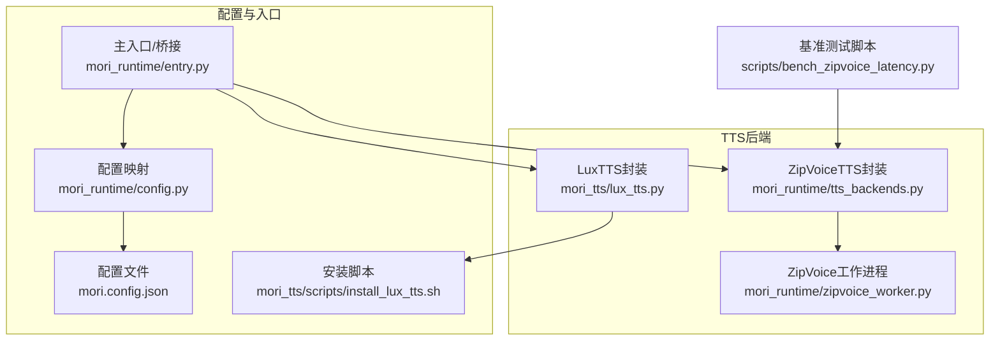
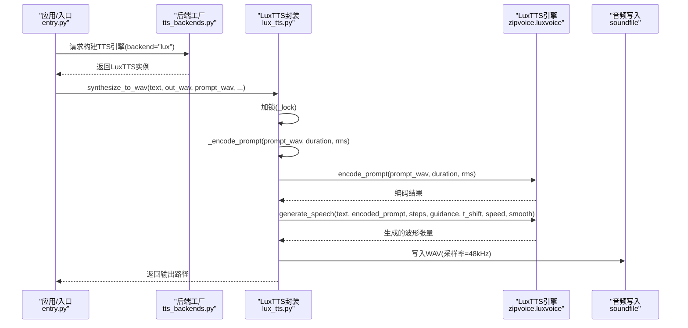
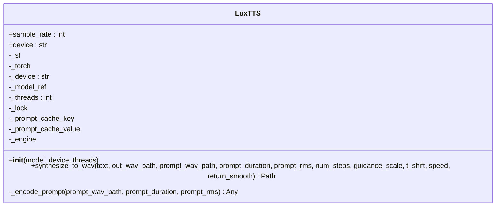
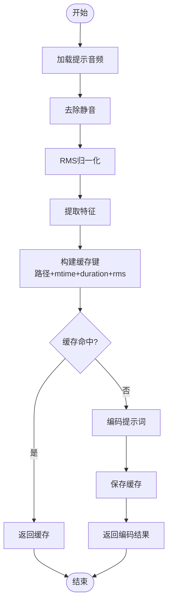
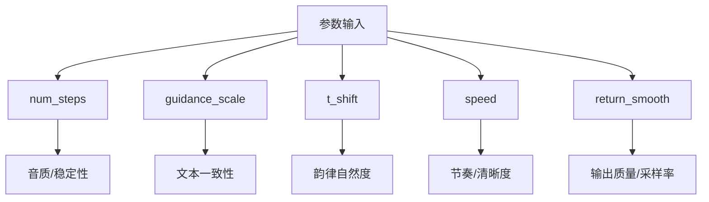
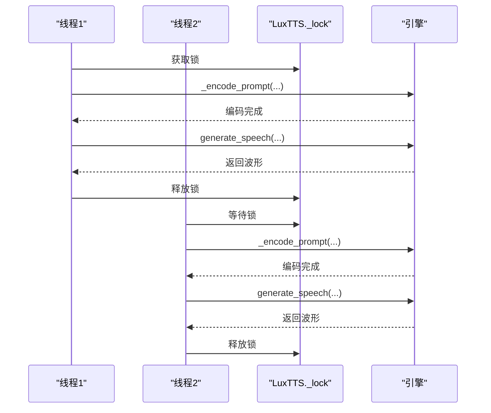
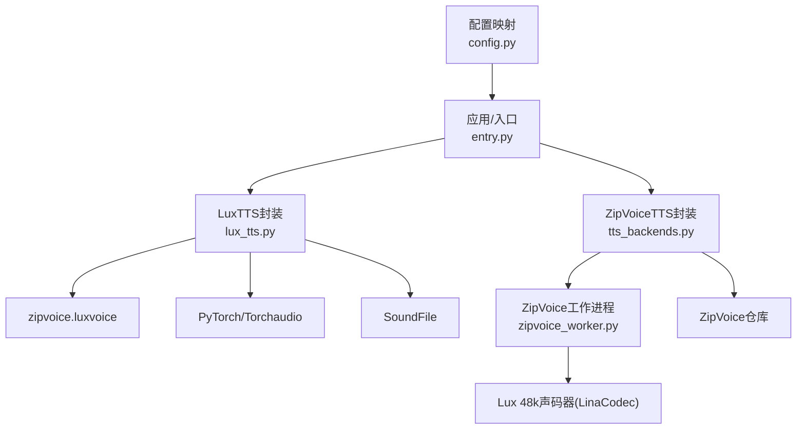

# LuxTTS集成

<cite>
**本文档引用的文件**
- [lux_tts.py](file://mori_tts/lux_tts.py)
- [install_lux_tts.sh](file://mori_tts/scripts/install_lux_tts.sh)
- [tts_backends.py](file://mori_runtime/tts_backends.py)
- [zipvoice_worker.py](file://mori_runtime/zipvoice_worker.py)
- [config.py](file://mori_runtime/config.py)
- [README.md](file://README.md)
- [mori.config.json](file://mori.config.json)
- [entry.py](file://mori_runtime/entry.py)
- [bench_zipvoice_latency.py](file://scripts/bench_zipvoice_latency.py)
</cite>

## 目录
1. [简介](#简介)
2. [项目结构](#项目结构)
3. [核心组件](#核心组件)
4. [架构总览](#架构总览)
5. [详细组件分析](#详细组件分析)
6. [依赖关系分析](#依赖关系分析)
7. [性能考量](#性能考量)
8. [故障排除指南](#故障排除指南)
9. [结论](#结论)
10. [附录](#附录)

## 简介
本文件面向希望在Mori系统中集成并使用LuxTTS作为TTS后端的开发者与运维人员。文档深入解释LuxTTS作为TTS后端的实现原理，包括：
- 模型加载机制与设备自动检测（CPU/CUDA/MPS）
- 推理调用流程与参数配置
- 提示词编码系统（音频预处理、缓存机制、时间戳与RMS处理）
- 关键参数对音质的影响（生成步数、指导比例、时间移位、语速控制）
- 多线程安全机制与锁保护策略
- 完整API使用示例（synthesizer_to_wav方法的参数说明与返回值处理）
- 错误处理、依赖安装与故障排除指南

## 项目结构
围绕LuxTTS的集成主要涉及以下模块：
- mori_tts/lux_tts.py：LuxTTS封装类，负责模型初始化、设备选择、提示词编码与推理调用
- mori_runtime/tts_backends.py：TTS后端工厂与ZipVoice封装，支持通过backend=lux切换至LuxTTS
- mori_runtime/zipvoice_worker.py：ZipVoice推理工作进程（含Lux 48k声码器），用于对比与兼容
- mori_runtime/config.py：配置映射与默认值解析
- mori_tts/scripts/install_lux_tts.sh：LuxTTS依赖安装脚本
- README.md与mori.config.json：使用说明与配置样例
- scripts/bench_zipvoice_latency.py：Latency基准测试脚本（展示参数传递方式）

**图表来源**
- [lux_tts.py:65-171](file://mori_tts/lux_tts.py#L65-L171)
- [tts_backends.py:1102-1171](file://mori_runtime/tts_backends.py#L1102-L1171)
- [zipvoice_worker.py:446-729](file://mori_runtime/zipvoice_worker.py#L446-L729)
- [config.py:1-270](file://mori_runtime/config.py#L1-L270)
- [entry.py:1-200](file://mori_runtime/entry.py#L1-L200)
- [install_lux_tts.sh:1-16](file://mori_tts/scripts/install_lux_tts.sh#L1-L16)
- [mori.config.json:1-83](file://mori.config.json#L1-L83)
- [bench_zipvoice_latency.py:1-200](file://scripts/bench_zipvoice_latency.py#L1-L200)

**章节来源**
- [lux_tts.py:1-171](file://mori_tts/lux_tts.py#L1-L171)
- [tts_backends.py:1102-1171](file://mori_runtime/tts_backends.py#L1102-L1171)
- [zipvoice_worker.py:446-729](file://mori_runtime/zipvoice_worker.py#L446-L729)
- [config.py:1-270](file://mori_runtime/config.py#L1-L270)
- [README.md:63-121](file://README.md#L63-L121)
- [mori.config.json:1-83](file://mori.config.json#L1-L83)
- [entry.py:1-200](file://mori_runtime/entry.py#L1-L200)
- [bench_zipvoice_latency.py:1-200](file://scripts/bench_zipvoice_latency.py#L1-L200)

## 核心组件
- LuxTTS封装类：提供模型加载、设备选择、提示词编码与推理调用
- TTS后端工厂：根据backend参数选择ZipVoice或LuxTTS
- ZipVoice工作进程：负责实际推理，支持Lux 48k声码器
- 配置映射：将配置项映射到运行时参数
- 安装脚本：一键安装LuxTTS所需依赖

**章节来源**
- [lux_tts.py:65-171](file://mori_tts/lux_tts.py#L65-L171)
- [tts_backends.py:1102-1171](file://mori_runtime/tts_backends.py#L1102-L1171)
- [zipvoice_worker.py:446-729](file://mori_runtime/zipvoice_worker.py#L446-L729)
- [config.py:42-83](file://mori_runtime/config.py#L42-L83)
- [install_lux_tts.sh:1-16](file://mori_tts/scripts/install_lux_tts.sh#L1-L16)

## 架构总览
下图展示了从应用层到LuxTTS引擎的调用链路，以及提示词编码与缓存的关键节点。

**图表来源**
- [entry.py:245-272](file://mori_runtime/entry.py#L245-L272)
- [tts_backends.py:1168-1171](file://mori_runtime/tts_backends.py#L1168-L1171)
- [lux_tts.py:132-171](file://mori_tts/lux_tts.py#L132-L171)
- [zipvoice_worker.py:684-712](file://mori_runtime/zipvoice_worker.py#L684-L712)

## 详细组件分析

### LuxTTS封装类（LuxTTS）
- 设备自动检测：支持auto/cpu/cuda/mps/metal，优先CUDA，其次MPS，最后CPU
- 模型加载：支持默认模型或本地路径，首次使用时从HuggingFace下载
- 提示词编码：基于提示音频路径、修改时间、时长与RMS构建缓存键，避免重复编码
- 推理调用：静默执行引擎函数，避免控制台噪声，最终写入WAV文件
- 多线程安全：使用threading.Lock保护提示词编码与推理过程

**图表来源**
- [lux_tts.py:65-171](file://mori_tts/lux_tts.py#L65-L171)

**章节来源**
- [lux_tts.py:42-97](file://mori_tts/lux_tts.py#L42-L97)
- [lux_tts.py:107-131](file://mori_tts/lux_tts.py#L107-L131)
- [lux_tts.py:132-171](file://mori_tts/lux_tts.py#L132-L171)

### 提示词编码系统
- 输入音频预处理：去除静音、RMS归一化、提取特征
- 缓存机制：以提示音频路径、修改时间、时长与RMS为键，缓存编码结果
- 时间戳与能量值：编码结果包含提示时长与RMS，用于后续合成与增益调整
- 持久化缓存：ZipVoice工作进程支持将提示上下文持久化到磁盘，加速后续推理

**图表来源**
- [zipvoice_worker.py:66-112](file://mori_runtime/zipvoice_worker.py#L66-L112)
- [zipvoice_worker.py:174-232](file://mori_runtime/zipvoice_worker.py#L174-L232)

**章节来源**
- [zipvoice_worker.py:66-112](file://mori_runtime/zipvoice_worker.py#L66-L112)
- [zipvoice_worker.py:174-232](file://mori_runtime/zipvoice_worker.py#L174-L232)

### 关键参数配置与影响
- 生成步数（num_steps）：影响推理稳定性与细节，数值越大通常更稳定但耗时增加
- 指导比例（guidance_scale）：增强文本引导效果，过高可能导致失真
- 时间移位（t_shift）：调节时序分布，影响韵律自然度
- 语速（speed）：控制token时长与整体节奏，过快可能丢失细节
- 返回平滑（return_smooth）：影响声码器输出质量与采样率

**图表来源**
- [lux_tts.py:138-144](file://mori_tts/lux_tts.py#L138-L144)
- [zipvoice_worker.py:694-704](file://mori_runtime/zipvoice_worker.py#L694-L704)

**章节来源**
- [lux_tts.py:138-144](file://mori_tts/lux_tts.py#L138-L144)
- [zipvoice_worker.py:694-704](file://mori_runtime/zipvoice_worker.py#L694-L704)

### 多线程安全与锁保护
- LuxTTS内部使用threading.Lock保护提示词编码与推理过程，避免并发冲突
- ZipVoiceTTS使用多个锁（池锁、工作进程锁）保障多请求下的稳定性

**图表来源**
- [lux_tts.py:89-91](file://mori_tts/lux_tts.py#L89-L91)
- [lux_tts.py:149-164](file://mori_tts/lux_tts.py#L149-L164)

**章节来源**
- [lux_tts.py:89-91](file://mori_tts/lux_tts.py#L89-L91)
- [lux_tts.py:149-164](file://mori_tts/lux_tts.py#L149-L164)

### API使用示例（synthesizer_to_wav）
- 方法签名要点
  - text：要合成的文本
  - out_wav_path：输出WAV文件路径
  - prompt_wav_path：提示音频路径
  - prompt_duration：提示音频时长（秒）
  - prompt_rms：提示音频RMS能量值
  - num_steps：生成步数
  - guidance_scale：指导比例
  - t_shift：时间移位
  - speed：语速
  - return_smooth：是否返回平滑输出
- 返回值：输出WAV文件的绝对路径
- 使用建议：确保提示音频与文本语言一致；合理设置num_steps与guidance_scale以平衡音质与性能

**章节来源**
- [lux_tts.py:132-171](file://mori_tts/lux_tts.py#L132-L171)
- [README.md:103-121](file://README.md#L103-L121)
- [mori.config.json:14-27](file://mori.config.json#L14-L27)

## 依赖关系分析
- LuxTTS封装依赖zipvoice.luxvoice引擎与PyTorch/Torchaudio/SoundFile
- ZipVoiceTTS封装依赖ZipVoice仓库与独立Python环境，支持Lux 48k声码器
- 配置映射将JSON配置转换为运行时参数

**图表来源**
- [lux_tts.py:74-97](file://mori_tts/lux_tts.py#L74-L97)
- [tts_backends.py:1135-1171](file://mori_runtime/tts_backends.py#L1135-L1171)
- [zipvoice_worker.py:266-300](file://mori_runtime/zipvoice_worker.py#L266-L300)
- [config.py:42-83](file://mori_runtime/config.py#L42-L83)
- [entry.py:16-51](file://mori_runtime/entry.py#L16-L51)

**章节来源**
- [lux_tts.py:74-97](file://mori_tts/lux_tts.py#L74-L97)
- [tts_backends.py:1135-1171](file://mori_runtime/tts_backends.py#L1135-L1171)
- [zipvoice_worker.py:266-300](file://mori_runtime/zipvoice_worker.py#L266-L300)
- [config.py:42-83](file://mori_runtime/config.py#L42-L83)
- [entry.py:16-51](file://mori_runtime/entry.py#L16-L51)

## 性能考量
- 设备选择：优先CUDA，其次MPS，最后CPU；Metal别名映射为MPS
- 线程数：可通过threads参数控制，建议与CPU核心数匹配
- 采样率：LuxTTS输出固定48kHz，ZipVoice工作进程可配置24k或48k
- 缓存策略：提示词编码与持久化缓存显著降低重复推理成本
- 参数权衡：num_steps与guidance_scale提升稳定性但增加耗时；t_shift与speed影响韵律与节奏

**章节来源**
- [lux_tts.py:42-56](file://mori_tts/lux_tts.py#L42-L56)
- [zipvoice_worker.py:550-564](file://mori_runtime/zipvoice_worker.py#L550-L564)
- [zipvoice_worker.py:296-300](file://mori_runtime/zipvoice_worker.py#L296-L300)

## 故障排除指南
- 依赖缺失
  - 现象：ModuleNotFoundError
  - 处理：运行安装脚本安装依赖
- 设备不可用
  - 现象：GPU/MPS不可用回退CPU
  - 处理：检查设备可用性或显式指定device
- 提示音频不存在
  - 现象：FileNotFoundError
  - 处理：确认提示音频路径与权限
- 输出文件未生成
  - 现象：推理成功但未生成WAV
  - 处理：检查输出目录权限与磁盘空间
- ZipVoice Lux 48k声码器缺失
  - 现象：ModuleNotFoundError
  - 处理：在ZipVoice虚拟环境中安装LinaCodec

**章节来源**
- [install_lux_tts.sh:1-16](file://mori_tts/scripts/install_lux_tts.sh#L1-L16)
- [lux_tts.py:78-82](file://mori_tts/lux_tts.py#L78-L82)
- [lux_tts.py:109-110](file://mori_tts/lux_tts.py#L109-L110)
- [lux_tts.py:168-169](file://mori_tts/lux_tts.py#L168-L169)
- [zipvoice_worker.py:277-285](file://mori_runtime/zipvoice_worker.py#L277-L285)

## 结论
通过本集成方案，系统可在LuxTTS与ZipVoice之间灵活切换，并充分利用提示词编码缓存与多线程锁保护机制，实现高效稳定的TTS推理。合理配置关键参数可显著改善音质与实时性表现。建议在生产环境中结合硬件能力与业务需求，选择合适的设备与参数组合，并定期清理提示词缓存以保持最佳性能。

## 附录

### 配置项与默认值
- LuxTTS默认参数：模型、提示音频时长、RMS、生成步数、指导比例、时间移位、语速、线程数、采样率
- ZipVoice默认参数：模型类型、模型目录、检查点名称、分词器、语言、质量配置、声码器配置等

**章节来源**
- [lux_tts.py:11-19](file://mori_tts/lux_tts.py#L11-L19)
- [mori.config.json:14-51](file://mori.config.json#L14-L51)

### 使用示例与命令
- 启用TTS并指定模型与提示音频
- 调整生成步数、指导比例、时间移位与语速
- 在配置文件中集中管理参数

**章节来源**
- [README.md:103-121](file://README.md#L103-L121)
- [mori.config.json:14-27](file://mori.config.json#L14-L27)