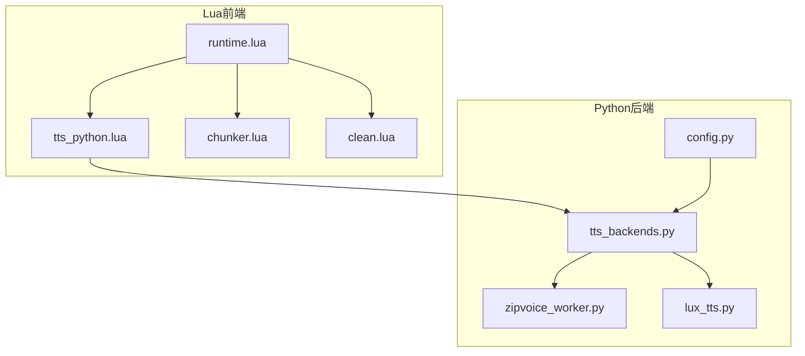
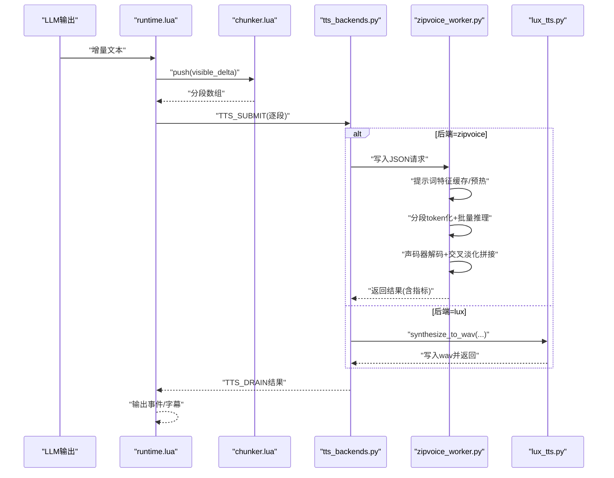
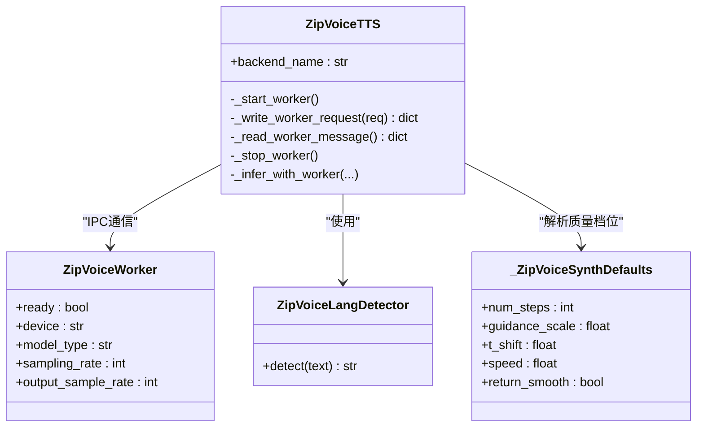
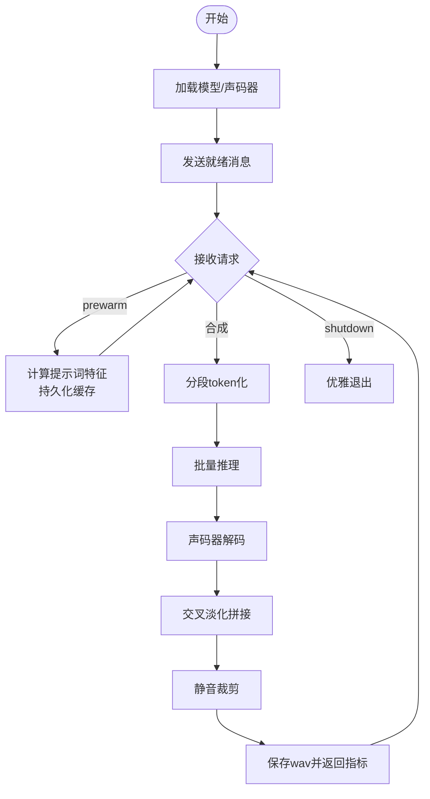
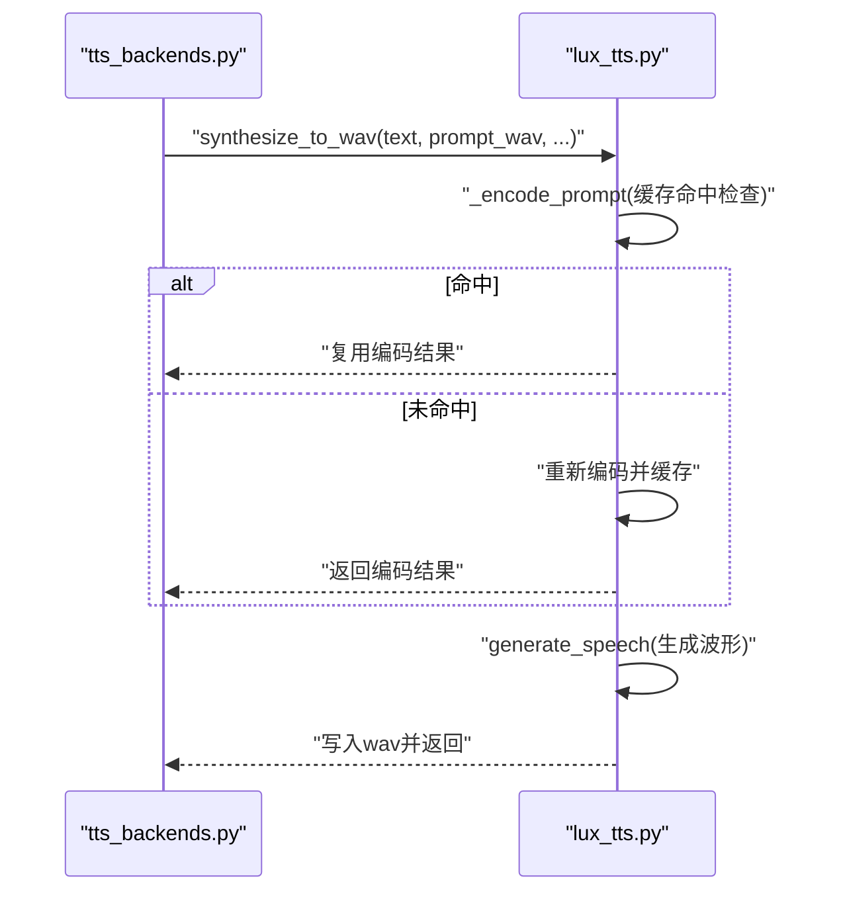
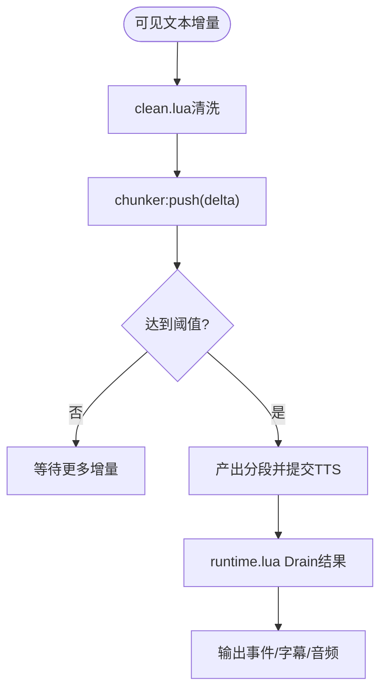
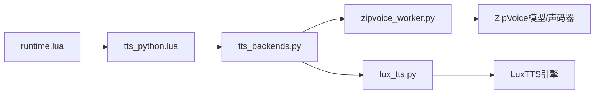

# TTS引擎

<cite>
**本文引用的文件列表**
- [tts_backends.py](file://mori_runtime/tts_backends.py)
- [zipvoice_worker.py](file://mori_runtime/zipvoice_worker.py)
- [lux_tts.py](file://mori_tts/lux_tts.py)
- [tts_python.lua](file://mori_runtime/lua/mori/plugins/tts_python.lua)
- [chunker.lua](file://mori_runtime/lua/mori/speech/chunker.lua)
- [clean.lua](file://mori_runtime/lua/mori/text/clean.lua)
- [runtime.lua](file://mori_runtime/lua/mori/app/runtime.lua)
- [config.py](file://mori_runtime/config.py)
- [README.md](file://README.md)
- [bench_zipvoice_latency.py](file://scripts/bench_zipvoice_latency.py)
</cite>

## 目录
1. [简介](#简介)
2. [项目结构](#项目结构)
3. [核心组件](#核心组件)
4. [架构总览](#架构总览)
5. [详细组件分析](#详细组件分析)
6. [依赖关系分析](#依赖关系分析)
7. [性能考量](#性能考量)
8. [故障排除指南](#故障排除指南)
9. [结论](#结论)
10. [附录](#附录)

## 简介
本文件面向Mori TTS引擎的技术文档，聚焦于两种后端的集成与使用：LuxTTS与ZipVoice。文档涵盖以下主题：
- LuxTTS的Python接入方式：模型加载、推理调用、参数配置
- ZipVoice的实时合成能力：质量配置文件、声码器配置、性能优化
- TTS分段处理机制：文本切分、音频拼接、流式输出
- 提示词缓存系统：缓存策略、命中率优化、内存管理
- TTS相关配置参数与调优技巧：生成速度、风格控制、音色定制
- 音频输出格式、设备兼容性与故障排除

## 项目结构
围绕TTS的核心模块分布如下：
- Python侧后端与桥接
  - tts_backends.py：ZipVoice后端封装与参数解析
  - zipvoice_worker.py：ZipVoice推理工作进程（子进程）
  - lux_tts.py：LuxTTS Python封装
  - config.py：配置键映射与默认值解析
  - bench_zipvoice_latency.py：ZipVoice延迟基准脚本
- Lua侧运行时与前端
  - tts_python.lua：Lua插件桥接到Python TTS
  - chunker.lua：文本分段器（硬/软断点）
  - clean.lua：文本清洗（去除思考标记等）
  - runtime.lua：主运行时，调度TTS任务与事件

图表来源
- [runtime.lua:543-665](file://mori_runtime/lua/mori/app/runtime.lua#L543-L665)
- [tts_python.lua:1-31](file://mori_runtime/lua/mori/plugins/tts_python.lua#L1-L31)
- [chunker.lua:1-157](file://mori_runtime/lua/mori/speech/chunker.lua#L1-L157)
- [clean.lua:1-49](file://mori_runtime/lua/mori/text/clean.lua#L1-L49)
- [config.py:1-270](file://mori_runtime/config.py#L1-L270)
- [tts_backends.py:1-1171](file://mori_runtime/tts_backends.py#L1-L1171)
- [zipvoice_worker.py:1-729](file://mori_runtime/zipvoice_worker.py#L1-L729)
- [lux_tts.py:1-171](file://mori_tts/lux_tts.py#L1-L171)

章节来源
- [runtime.lua:543-665](file://mori_runtime/lua/mori/app/runtime.lua#L543-L665)
- [tts_backends.py:1-1171](file://mori_runtime/tts_backends.py#L1-L1171)

## 核心组件
- ZipVoiceTTS（Python侧封装）
  - 启动并维护ZipVoice子进程，负责参数校验、语言检测、提示词池构建、合成请求转发与结果解析
- ZipVoiceWorker（子进程）
  - 加载模型与声码器，实现提示词特征缓存、分段token化、批量推理、声码器解码与交叉淡化拼接
- LuxTTS（Python侧封装）
  - 封装LuxTTS模型加载与推理，提供提示词编码缓存、线程安全生成接口
- Lua桥接与运行时
  - tts_python.lua：订阅TTS事件，转发到Python后端
  - chunker.lua：按标点与字符数阈值进行分段
  - runtime.lua：调度LLM输出、分段提交TTS、Drain结果并上报事件

章节来源
- [tts_backends.py:525-800](file://mori_runtime/tts_backends.py#L525-L800)
- [zipvoice_worker.py:446-729](file://mori_runtime/zipvoice_worker.py#L446-L729)
- [lux_tts.py:65-171](file://mori_tts/lux_tts.py#L65-L171)
- [tts_python.lua:1-31](file://mori_runtime/lua/mori/plugins/tts_python.lua#L1-L31)
- [chunker.lua:1-157](file://mori_runtime/lua/mori/speech/chunker.lua#L1-L157)
- [runtime.lua:355-485](file://mori_runtime/lua/mori/app/runtime.lua#L355-L485)

## 架构总览
整体流程：Lua运行时接收LLM输出增量，经分段器切分为短句，逐段提交TTS任务；Python后端根据后端类型选择LuxTTS或ZipVoice子进程；ZipVoice子进程执行提示词特征提取与缓存、分段token化、模型采样、声码器解码与交叉淡化拼接，最终保存音频并返回指标；Lua运行时Drain结果并输出事件。

图表来源
- [runtime.lua:375-485](file://mori_runtime/lua/mori/app/runtime.lua#L375-L485)
- [chunker.lua:128-153](file://mori_runtime/lua/mori/speech/chunker.lua#L128-L153)
- [tts_backends.py:761-800](file://mori_runtime/tts_backends.py#L761-L800)
- [zipvoice_worker.py:684-722](file://mori_runtime/zipvoice_worker.py#L684-L722)
- [lux_tts.py:132-171](file://mori_tts/lux_tts.py#L132-L171)

## 详细组件分析

### ZipVoice后端（ZipVoiceTTS）
- 角色与职责
  - 参数解析与校验：模型类型、路径、语言检测器、提示词策略、质量配置、声码器配置
  - 子进程生命周期管理：启动、心跳、异常重启、优雅关闭
  - 请求路由：语言检测、提示词池选择、质量参数解析
  - 结果解析与错误处理：JSON消息解析、异常上抛
- 关键数据结构
  - _ZipVoiceSynthDefaults：质量档位对应的采样步数、引导强度、时间偏移、语速、平滑开关
  - _PromptEntry：提示词条目（文本、音频路径、路由、来源）
  - ZipVoiceLangDetector：多模式语言检测（启发式/HunLingua）
- 关键流程
  - 启动子进程并读取就绪消息，确定特征采样率与输出采样率
  - 写入请求并等待响应，解析指标（总耗时、声码器耗时、RTF等）

图表来源
- [tts_backends.py:525-800](file://mori_runtime/tts_backends.py#L525-L800)
- [zipvoice_worker.py:446-729](file://mori_runtime/zipvoice_worker.py#L446-L729)

章节来源
- [tts_backends.py:525-800](file://mori_runtime/tts_backends.py#L525-L800)
- [zipvoice_worker.py:446-729](file://mori_runtime/zipvoice_worker.py#L446-L729)

### ZipVoice子进程（zipvoice_worker.py）
- 角色与职责
  - 模型与声码器加载：根据配置选择基础24k或Lux 48k声码器
  - 提示词缓存：内存缓存+持久化缓存（磁盘），键包含提示词文本、音频路径、分词器、采样率、归一化参数、设备
  - 分段合成：按token长度与最大时长切分，批量推理，声码器解码，交叉淡化拼接
  - 实时指标：总耗时、声码器耗时、RTF、音频时长
- 关键流程
  - 预热：计算提示词特征并返回统计信息
  - 推理：分段token化→批量推理→声码器解码→交叉淡化→静音裁剪
  - 关闭：发送shutdown命令并等待退出

图表来源
- [zipvoice_worker.py:446-729](file://mori_runtime/zipvoice_worker.py#L446-L729)

章节来源
- [zipvoice_worker.py:446-729](file://mori_runtime/zipvoice_worker.py#L446-L729)

### LuxTTS后端（lux_tts.py）
- 角色与职责
  - 模型加载：自动选择设备（CUDA/MPS/CPU），支持HuggingFace模型引用或本地路径
  - 提示词缓存：基于提示词音频路径与修改时间的键，避免重复编码
  - 推理接口：线程安全的合成方法，支持步数、引导强度、时间偏移、语速、平滑输出
- 关键流程
  - 编码提示词：若缓存命中则复用，否则重新编码并更新缓存
  - 生成语音：调用底层引擎生成波形，写入wav文件

图表来源
- [lux_tts.py:107-171](file://mori_tts/lux_tts.py#L107-L171)
- [tts_backends.py:13-13](file://mori_runtime/tts_backends.py#L13-L13)

章节来源
- [lux_tts.py:65-171](file://mori_tts/lux_tts.py#L65-L171)

### 文本分段与流式输出（chunker.lua + runtime.lua）
- 文本分段器
  - 硬断点：句号、问号、感叹号等
  - 软断点：逗号、顿号、分号等
  - 字符阈值：最小/最大字符数，首段boost提升
- 流式输出
  - LLM增量文本经清洗后进入分段器，逐段提交TTS任务，同时Drain已完成的TTS结果，实现低延迟播放与打断

图表来源
- [chunker.lua:67-153](file://mori_runtime/lua/mori/speech/chunker.lua#L67-L153)
- [clean.lua:16-46](file://mori_runtime/lua/mori/text/clean.lua#L16-L46)
- [runtime.lua:375-485](file://mori_runtime/lua/mori/app/runtime.lua#L375-L485)

章节来源
- [chunker.lua:1-157](file://mori_runtime/lua/mori/speech/chunker.lua#L1-L157)
- [clean.lua:1-49](file://mori_runtime/lua/mori/text/clean.lua#L1-L49)
- [runtime.lua:355-485](file://mori_runtime/lua/mori/app/runtime.lua#L355-L485)

### Lua桥接与事件（tts_python.lua）
- 插件注册：监听TTS_SUBMIT、TTS_DRAIN、TTS_CANCEL_INTENT事件
- 事件转发：将Lua侧意图转换为Python侧任务并返回job_id

章节来源
- [tts_python.lua:1-31](file://mori_runtime/lua/mori/plugins/tts_python.lua#L1-L31)

## 依赖关系分析
- 外部依赖
  - ZipVoice子进程：依赖ZipVoice仓库、模型权重、分词器、特征提取器、声码器（基础24k或Lux 48k）
  - LuxTTS：依赖ZipVoice中的LuxTTS实现、PyTorch、SoundFile
- 内部耦合
  - runtime.lua与tts_python.lua强耦合：事件驱动的任务提交与Drain
  - tts_backends.py与zipvoice_worker.py通过标准输入/输出与JSON协议通信
  - 提示词缓存：ZipVoice子进程内存缓存+持久化缓存，降低重复特征计算

图表来源
- [runtime.lua:543-665](file://mori_runtime/lua/mori/app/runtime.lua#L543-L665)
- [tts_python.lua:1-31](file://mori_runtime/lua/mori/plugins/tts_python.lua#L1-L31)
- [tts_backends.py:1-1171](file://mori_runtime/tts_backends.py#L1-L1171)
- [zipvoice_worker.py:1-729](file://mori_runtime/zipvoice_worker.py#L1-L729)
- [lux_tts.py:1-171](file://mori_tts/lux_tts.py#L1-L171)

章节来源
- [tts_backends.py:1-1171](file://mori_runtime/tts_backends.py#L1-L1171)
- [zipvoice_worker.py:1-729](file://mori_runtime/zipvoice_worker.py#L1-L729)
- [lux_tts.py:1-171](file://mori_tts/lux_tts.py#L1-L171)

## 性能考量
- ZipVoice
  - 质量档位：realtime（步数少、RTF低）、balanced（平衡）、hq（最高质量）
  - 声码器：base_24k（基础24k）、lux_48k（LinaCodec，需安装依赖）
  - 线程数：可通过参数调整，影响token批处理与解码并行度
  - 提示词缓存：内存+持久化，显著减少重复特征计算
  - 分段策略：按token时长与最大时长切分，避免单次推理过长
- LuxTTS
  - 设备选择：优先CUDA，其次MPS，最后CPU
  - 线程数：可配置以提升吞吐
  - 提示词缓存：基于文件mtime的键，避免重复编码
- 流式输出
  - 分段提交TTS，逐段Drain，降低端到端延迟
  - 静音裁剪与交叉淡化，改善拼接质量

章节来源
- [tts_backends.py:409-446](file://mori_runtime/tts_backends.py#L409-L446)
- [zipvoice_worker.py:266-300](file://mori_runtime/zipvoice_worker.py#L266-L300)
- [lux_tts.py:42-56](file://mori_tts/lux_tts.py#L42-L56)
- [runtime.lua:375-485](file://mori_runtime/lua/mori/app/runtime.lua#L375-L485)

## 故障排除指南
- ZipVoice子进程未启动或异常退出
  - 检查Python二进制、ZipVoice仓库路径、模型目录与权重文件是否存在
  - 查看就绪消息中的设备与采样率是否符合预期
- 语言检测问题
  - 模式：auto/heuristic/lingua；lingua需满足置信度阈值
  - 若不稳定，切换为heuristic或固定语言
- 提示词缓存问题
  - 确认持久化缓存路径可写；删除旧缓存文件后重试
  - 检查提示词文本与音频路径是否变化（键包含路径与分词器）
- 声码器依赖缺失
  - 启用lux_48k时，确保ZipVoice环境安装LinaCodec依赖
- 配置项错误
  - 使用config.py映射的键名，避免大小写与拼写差异
- 延迟与质量权衡
  - 降低质量档位或减少步数；调整语速；使用更少的线程
  - 对ZipVoice，适当增大max_duration或调整分段策略

章节来源
- [tts_backends.py:619-647](file://mori_runtime/tts_backends.py#L619-L647)
- [zipvoice_worker.py:276-285](file://mori_runtime/zipvoice_worker.py#L276-L285)
- [config.py:42-83](file://mori_runtime/config.py#L42-L83)
- [README.md:75-81](file://README.md#L75-L81)

## 结论
Mori TTS引擎通过Lua运行时与Python后端的清晰分工，实现了高效的文本分段、提示词缓存与实时合成。ZipVoice提供高质量与低延迟的可调节合成路径，LuxTTS提供轻量级的Python直连方案。结合分段策略与流式Drain，系统在低延迟与音质之间提供了灵活的平衡点。

## 附录

### TTS后端与参数总览
- 后端选择
  - backend：lux 或 zipvoice
- LuxTTS参数
  - model：模型引用或本地路径
  - device：auto/cpu/cuda/mps
  - threads：推理线程数
- ZipVoice参数
  - zipvoice_python_bin：ZipVoice环境Python路径
  - zipvoice_repo：ZipVoice仓库路径
  - zipvoice_model_type：zipvoice 或 zipvoice_distill
  - zipvoice_model_dir：模型目录
  - zipvoice_checkpoint_name：权重文件名
  - zh/ja_tokenizer/lang：分词器与语言标签
  - zh/ja_prompt_text/wav：固定提示词文本与音频
  - remove_long_sil：是否移除长尾静音
  - num_thread：子进程线程数
  - lang_detector/lang_min_conf：语言检测模式与置信度
  - prompt_manifest/prompt_policy：提示词清单与选择策略
  - quality_profile：realtime/balanced/hq
  - vocoder_profile：base_24k/lux_48k
  - vocoder_model：Lux声码器模型引用或路径

章节来源
- [config.py:42-83](file://mori_runtime/config.py#L42-L83)
- [tts_backends.py:19-47](file://mori_runtime/tts_backends.py#L19-L47)
- [README.md:75-86](file://README.md#L75-L86)

### 配置与调优建议
- 生成速度
  - ZipVoice：降低quality_profile或num_steps；提高speed；减少max_duration
  - LuxTTS：减少num_steps；提高speed；减少threads
- 风格控制
  - ZipVoice：调整guidance_scale与t_shift；选择不同tokenizer/lang
  - LuxTTS：调整guidance_scale与t_shift（通过后端参数）
- 音色定制
  - 固定提示词：提供高质量的prompt_wav与prompt_text
  - 提示词池：通过prompt_manifest与prompt_policy选择
- 输出格式与设备
  - ZipVoice：base_24k输出24kHz；lux_48k输出48kHz（需LinaCodec）
  - 设备：ZipVoice自动选择GPU/CPU；LuxTTS自动选择CUDA/MPS/CPU

章节来源
- [tts_backends.py:384-446](file://mori_runtime/tts_backends.py#L384-L446)
- [zipvoice_worker.py:266-300](file://mori_runtime/zipvoice_worker.py#L266-L300)
- [lux_tts.py:42-56](file://mori_tts/lux_tts.py#L42-L56)
- [README.md:75-86](file://README.md#L75-L86)