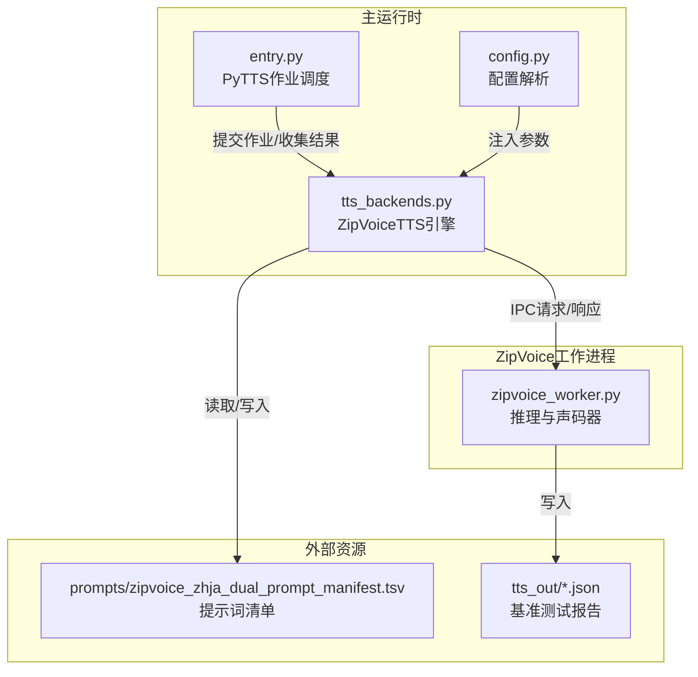
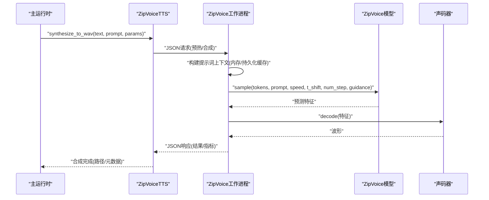
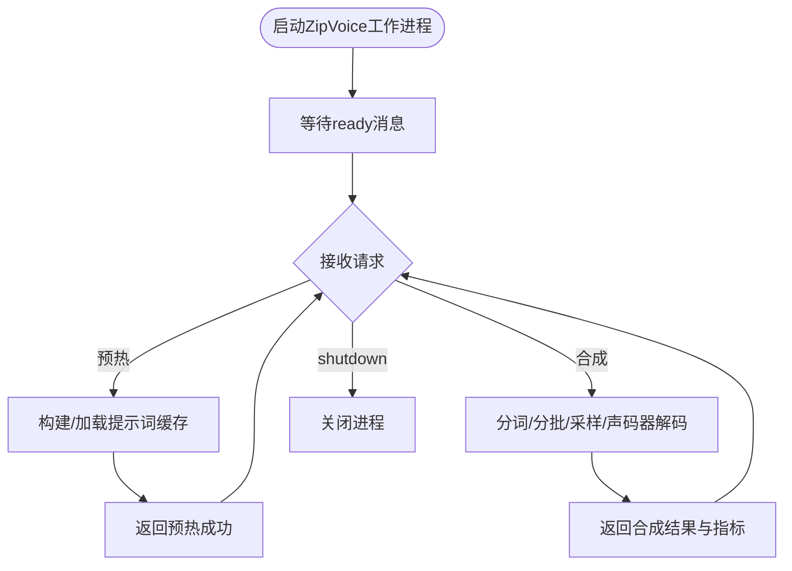
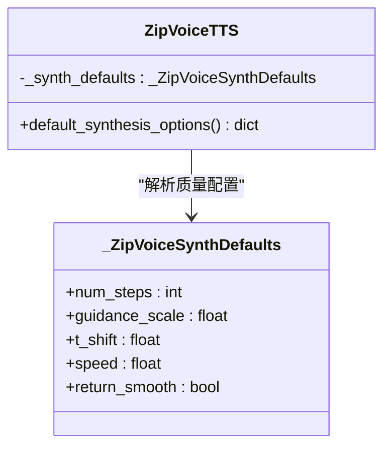
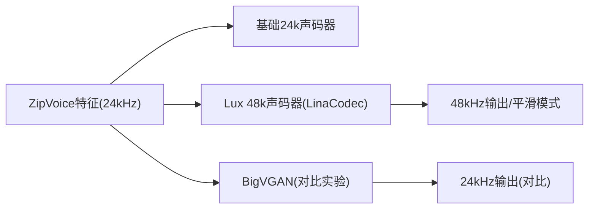
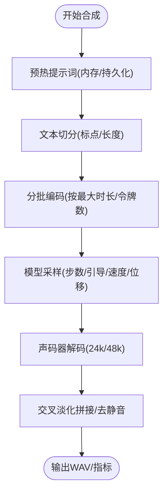
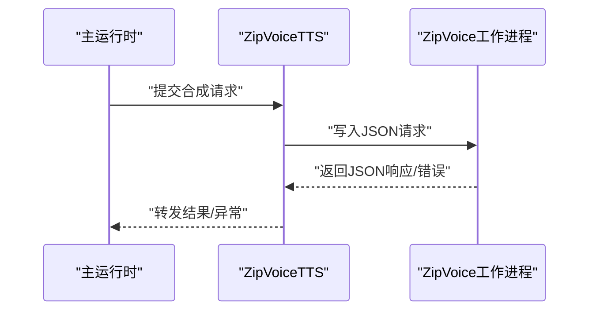
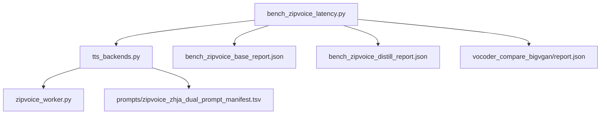

# ZipVoice工作进程

<cite>
**本文档引用的文件**
- [zipvoice_worker.py](file://mori_runtime/zipvoice_worker.py)
- [tts_backends.py](file://mori_runtime/tts_backends.py)
- [config.py](file://mori_runtime/config.py)
- [entry.py](file://mori_runtime/entry.py)
- [bench_zipvoice_latency.py](file://scripts/bench_zipvoice_latency.py)
- [zipvoice_zhja_dual_prompt_manifest.tsv](file://mori_runtime/prompts/zipvoice_zhja_dual_prompt_manifest.tsv)
- [bench_zipvoice_base_report.json](file://tts_out/bench_zipvoice_base_report.json)
- [bench_zipvoice_distill_report.json](file://tts_out/bench_zipvoice_distill_report.json)
- [report.json](file://tts_out/vocoder_compare_bigvgan/report.json)
</cite>

## 目录
1. [简介](#简介)
2. [项目结构](#项目结构)
3. [核心组件](#核心组件)
4. [架构总览](#架构总览)
5. [详细组件分析](#详细组件分析)
6. [依赖关系分析](#依赖关系分析)
7. [性能考虑](#性能考虑)
8. [故障排除指南](#故障排除指南)
9. [结论](#结论)
10. [附录](#附录)

## 简介
本文件面向ZipVoice工作进程的技术文档，深入解释其作为实时TTS后端的架构设计与实现细节，涵盖工作进程管理、队列处理机制、并发控制策略、质量配置文件系统、声码器配置与优化、实时性能优化技术（提示词缓存、预热机制、流式输出处理）、与主运行时系统的集成方式（进程间通信、状态同步、错误传播），并提供基于仓库内基准测试的数据与调优建议。

## 项目结构
ZipVoice工作进程位于运行时系统中，通过独立的Python工作进程承载ZipVoice推理逻辑，并由主运行时通过标准输入/输出进行进程间通信。关键文件与职责如下：
- mori_runtime/zipvoice_worker.py：ZipVoice工作进程主体，负责模型加载、推理执行、声码器调用、提示词缓存与持久化、RTF统计等。
- mori_runtime/tts_backends.py：主运行时侧的TTS后端封装，负责进程生命周期管理、请求编排、语言路由、提示词选择策略、参数合成与结果回传。
- mori_runtime/config.py：配置解析与默认值注入，将统一配置映射到ZipVoice相关参数。
- mori_runtime/entry.py：运行时入口，提供TTS作业提交、并发执行、结果收集与取消能力。
- scripts/bench_zipvoice_latency.py：延迟基准脚本，用于评估不同配置下的合成延迟与稳态表现。
- mori_runtime/prompts/zipvoice_zhja_dual_prompt_manifest.tsv：提示词清单，定义中日双语提示资源。
- tts_out/...：基准测试输出报告，包含RTF、延迟、稳态堆积等指标。

**图表来源**
- [tts_backends.py:525-1171](file://mori_runtime/tts_backends.py#L525-L1171)
- [zipvoice_worker.py:446-729](file://mori_runtime/zipvoice_worker.py#L446-L729)
- [config.py:1-270](file://mori_runtime/config.py#L1-L270)
- [entry.py:203-413](file://mori_runtime/entry.py#L203-L413)

**章节来源**
- [tts_backends.py:525-1171](file://mori_runtime/tts_backends.py#L525-L1171)
- [zipvoice_worker.py:446-729](file://mori_runtime/zipvoice_worker.py#L446-L729)
- [config.py:1-270](file://mori_runtime/config.py#L1-L270)
- [entry.py:203-413](file://mori_runtime/entry.py#L203-L413)

## 核心组件
- 工作进程（zipvoice_worker.py）
  - 参数解析与环境准备：解析模型类型、模型目录、检查点名称、线程数、声码器配置等。
  - 模型与声码器加载：动态导入ZipVoice模型类，加载tokenizer、特征提取器、声码器（含Lux 48k支持）。
  - 提示词缓存：内存级与持久化两级缓存，键包含音频路径、文本、分词器、采样率、RMS、特征缩放、设备等。
  - 推理执行：分词、分批、采样步数、引导强度、速度、时间位移等参数控制，声码器解码与后处理。
  - IPC协议：以JSON行协议与主进程通信，支持预热、合成、关闭指令。
- 后端封装（tts_backends.py）
  - 进程生命周期：通过subprocess启动/重启工作进程，读取ready消息，建立双向通信。
  - 请求编排：语言检测与路由、提示词选择策略（固定/随机/轮询/按意图哈希）、参数合成与默认值解析。
  - 合成接口：synthesize_to_wav统一入口，返回元数据（采样率、声码器配置、质量配置、提示词缓存路径等）。
- 配置系统（config.py）
  - 将统一配置映射到ZipVoice相关键，支持路径解析、列表路径合并、默认值注入。
- 运行时入口（entry.py）
  - PyTTS作业提交与并发执行，基于ThreadPoolExecutor管理多个合成任务，支持取消与结果回传。
- 基准测试（bench_zipvoice_latency.py）
  - 多场景文本切分、逐段合成、RTF计算、稳态堆积分析，输出完整报告。

**章节来源**
- [zipvoice_worker.py:235-729](file://mori_runtime/zipvoice_worker.py#L235-L729)
- [tts_backends.py:525-1171](file://mori_runtime/tts_backends.py#L525-L1171)
- [config.py:160-270](file://mori_runtime/config.py#L160-L270)
- [entry.py:203-413](file://mori_runtime/entry.py#L203-L413)
- [bench_zipvoice_latency.py:1-440](file://scripts/bench_zipvoice_latency.py#L1-L440)

## 架构总览
ZipVoice工作进程采用“主运行时进程 + 独立推理工作进程”的双进程架构。主运行时负责业务编排、并发调度、语言路由与提示词管理；工作进程专注模型推理与声码器解码，通过标准输入/输出进行轻量级IPC。

**图表来源**
- [tts_backends.py:761-806](file://mori_runtime/tts_backends.py#L761-L806)
- [zipvoice_worker.py:303-444](file://mori_runtime/zipvoice_worker.py#L303-L444)

**章节来源**
- [tts_backends.py:525-1171](file://mori_runtime/tts_backends.py#L525-L1171)
- [zipvoice_worker.py:446-729](file://mori_runtime/zipvoice_worker.py#L446-L729)

## 详细组件分析

### 工作进程管理与队列处理机制
- 进程启动与健康检查
  - 通过subprocess启动独立Python进程，传递模型与声码器参数，等待工作进程发送ready消息确认初始化完成。
  - 读取stdout逐行JSON消息，解析响应；若进程退出或无响应则触发重启。
- 请求队列与并发控制
  - 主运行时侧通过PyTTS使用ThreadPoolExecutor并发提交多个合成任务，每个任务对应一次IPC往返。
  - 工作进程侧以单线程顺序处理请求，避免GPU/CPU资源竞争；可通过num_thread参数调整推理线程数。
- 错误传播
  - 工作进程异常通过JSON错误字段返回；主运行时捕获并上抛，确保调用方感知失败。

**图表来源**
- [tts_backends.py:668-754](file://mori_runtime/tts_backends.py#L668-L754)
- [zipvoice_worker.py:625-725](file://mori_runtime/zipvoice_worker.py#L625-L725)

**章节来源**
- [tts_backends.py:668-754](file://mori_runtime/tts_backends.py#L668-L754)
- [zipvoice_worker.py:446-729](file://mori_runtime/zipvoice_worker.py#L446-L729)

### 质量配置文件系统
ZipVoice提供三种质量配置文件，分别针对实时性、平衡与高质量需求：
- realtime：较低的采样步数，适合低延迟场景；默认步数较小，RTF更友好。
- balanced：默认配置，兼顾音质与延迟；适用于大多数直播/VTuber场景。
- hq：更高的采样步数，追求更高保真度；适合录制或对音质要求较高的场景。

**图表来源**
- [tts_backends.py:384-447](file://mori_runtime/tts_backends.py#L384-L447)
- [tts_backends.py:968-981](file://mori_runtime/tts_backends.py#L968-L981)

**章节来源**
- [tts_backends.py:384-447](file://mori_runtime/tts_backends.py#L384-L447)
- [tts_backends.py:968-981](file://mori_runtime/tts_backends.py#L968-L981)

### 声码器配置与优化
- 基础24k声码器：默认配置，特征采样率为24kHz，适合一般场景。
- Lux 48k声码器：通过LinaCodec实现，支持48kHz输出与平滑模式；需在独立环境中安装依赖。
- BigVGAN对比：基准测试显示，在相同特征条件下，BigVGAN与Lux 48k在不同场景下各有优势，需结合实际硬件与音质偏好选择。

**图表来源**
- [zipvoice_worker.py:266-301](file://mori_runtime/zipvoice_worker.py#L266-L301)
- [report.json:1-403](file://tts_out/vocoder_compare_bigvgan/report.json#L1-L403)

**章节来源**
- [zipvoice_worker.py:266-301](file://mori_runtime/zipvoice_worker.py#L266-L301)
- [report.json:1-403](file://tts_out/vocoder_compare_bigvgan/report.json#L1-L403)

### 实时性能优化技术
- 提示词缓存
  - 内存缓存：以多维键值缓存提示词特征与分词结果，避免重复计算。
  - 持久化缓存：将提示词上下文序列化到磁盘，重启后复用，减少首帧延迟。
- 预热机制
  - 在引擎启动阶段对常用提示词进行预热，提前加载特征与分词，降低首个合成请求的RTF。
- 流式输出处理
  - 将长文本按标点与长度切分为多个短句，逐段合成并交叉淡化拼接，提升感知延迟与连贯性。
- 线程与设备选择
  - 通过num_thread控制推理线程数；自动探测CUDA/MPS/CPU设备，优先使用GPU以获得更好吞吐。

**图表来源**
- [zipvoice_worker.py:303-444](file://mori_runtime/zipvoice_worker.py#L303-L444)
- [tts_backends.py:1010-1099](file://mori_runtime/tts_backends.py#L1010-L1099)

**章节来源**
- [zipvoice_worker.py:45-233](file://mori_runtime/zipvoice_worker.py#L45-L233)
- [tts_backends.py:807-865](file://mori_runtime/tts_backends.py#L807-L865)
- [zipvoice_worker.py:303-444](file://mori_runtime/zipvoice_worker.py#L303-L444)

### 与主运行时系统的集成
- 进程间通信
  - 使用标准输入/输出的JSON行协议，主运行时发送请求，工作进程返回响应；支持预热、合成、关闭等命令。
- 状态同步
  - 工作进程启动后发送ready消息，包含设备、采样率、声码器配置等；主运行时据此更新内部状态。
- 错误传播
  - 工作进程异常通过JSON错误字段返回，主运行时捕获并上抛，保证调用链路可见性。

**图表来源**
- [tts_backends.py:655-728](file://mori_runtime/tts_backends.py#L655-L728)
- [zipvoice_worker.py:32-35](file://mori_runtime/zipvoice_worker.py#L32-L35)

**章节来源**
- [tts_backends.py:655-728](file://mori_runtime/tts_backends.py#L655-L728)
- [zipvoice_worker.py:32-35](file://mori_runtime/zipvoice_worker.py#L32-L35)

## 依赖关系分析
- ZipVoiceTTS依赖于zipvoice_worker.py提供的推理与声码器能力，通过subprocess进行进程间通信。
- 提示词清单来自TSV文件，支持固定提示与共享池提示，配合语言检测与提示词选择策略。
- 基准测试脚本读取统一配置，构建ZipVoice引擎，执行多场景合成并输出RTF与延迟指标。

**图表来源**
- [tts_backends.py:525-1171](file://mori_runtime/tts_backends.py#L525-L1171)
- [zipvoice_worker.py:446-729](file://mori_runtime/zipvoice_worker.py#L446-L729)
- [zipvoice_zhja_dual_prompt_manifest.tsv:1-4](file://mori_runtime/prompts/zipvoice_zhja_dual_prompt_manifest.tsv#L1-L4)
- [bench_zipvoice_latency.py:1-440](file://scripts/bench_zipvoice_latency.py#L1-L440)
- [bench_zipvoice_base_report.json:1-303](file://tts_out/bench_zipvoice_base_report.json#L1-L303)
- [bench_zipvoice_distill_report.json:1-303](file://tts_out/bench_zipvoice_distill_report.json#L1-L303)
- [report.json:1-403](file://tts_out/vocoder_compare_bigvgan/report.json#L1-L403)

**章节来源**
- [tts_backends.py:525-1171](file://mori_runtime/tts_backends.py#L525-L1171)
- [zipvoice_worker.py:446-729](file://mori_runtime/zipvoice_worker.py#L446-L729)
- [zipvoice_zhja_dual_prompt_manifest.tsv:1-4](file://mori_runtime/prompts/zipvoice_zhja_dual_prompt_manifest.tsv#L1-L4)
- [bench_zipvoice_latency.py:1-440](file://scripts/bench_zipvoice_latency.py#L1-L440)
- [bench_zipvoice_base_report.json:1-303](file://tts_out/bench_zipvoice_base_report.json#L1-L303)
- [bench_zipvoice_distill_report.json:1-303](file://tts_out/bench_zipvoice_distill_report.json#L1-L303)
- [report.json:1-403](file://tts_out/vocoder_compare_bigvgan/report.json#L1-L403)

## 性能考虑
- 延迟与RTF
  - 基准测试显示，ZipVoice Distill在平衡配置下具有较低的RTF，适合直播场景；基础版本在某些场景下RTF略高。
  - 长文本分段合成可显著降低首包延迟，但需关注稳态堆积情况。
- 稳态堆积
  - 多段连续合成时，若声码器解码耗时累积超过音频生成速率，会出现稳态堆积；应通过缩短分段、提高num_steps或切换到更高效的声码器缓解。
- 设备与线程
  - GPU推理可显著降低RTF；num_thread过小会导致CPU瓶颈，过大可能引发上下文切换开销。
- 声码器选择
  - Lux 48k在部分场景下RTF更优且音质更佳；BigVGAN作为对比实验表明不同声码器在特征适配与解码效率上存在差异。

**章节来源**
- [bench_zipvoice_base_report.json:1-303](file://tts_out/bench_zipvoice_base_report.json#L1-L303)
- [bench_zipvoice_distill_report.json:1-303](file://tts_out/bench_zipvoice_distill_report.json#L1-L303)
- [report.json:1-403](file://tts_out/vocoder_compare_bigvgan/report.json#L1-L403)

## 故障排除指南
- 工作进程未启动或意外退出
  - 检查zipvoice_repo与model_dir路径是否正确；确认Python可执行文件与依赖环境可用。
  - 查看ready消息中的设备与采样率信息，确认与预期一致。
- 合成失败或报错
  - 检查tokenizer与lang配置是否匹配；确认提示词清单中存在对应语言条目。
  - 关注错误消息中的tokenizer/lang/prompt_wav/out等字段，定位问题。
- 首包延迟过高
  - 启用预热机制，确保常用提示词已缓存；适当缩短分段长度；提高num_steps或切换到Lux 48k声码器。
- 稳态堆积
  - 降低分段长度或提高num_steps；优化声码器解码路径；必要时增加num_thread。

**章节来源**
- [tts_backends.py:668-754](file://mori_runtime/tts_backends.py#L668-L754)
- [zipvoice_worker.py:630-725](file://mori_runtime/zipvoice_worker.py#L630-L725)

## 结论
ZipVoice工作进程通过清晰的进程边界与轻量级IPC协议，实现了与主运行时的高效协作。其质量配置文件系统、提示词缓存与预热机制、分段合成与流式输出策略，共同保障了实时场景下的低延迟与稳定性。结合基准测试数据与声码器对比，用户可在延迟与音质之间找到最佳平衡点，并根据硬件条件选择合适的声码器与配置。

## 附录
- 配置键映射与默认值
  - 通过config.py将统一配置映射到ZipVoice相关键，支持路径解析与列表路径合并。
- 提示词清单格式
  - TSV/CSV格式，包含id、text、wav_path、lang等列，支持语言过滤与启用开关。
- 基准测试报告解读
  - 报告包含场景名称、分段详情、首包延迟、总合成时长、音频时长、稳态堆积、整体RTF等指标，便于对比不同配置与声码器的效果。

**章节来源**
- [config.py:160-270](file://mori_runtime/config.py#L160-L270)
- [zipvoice_zhja_dual_prompt_manifest.tsv:1-4](file://mori_runtime/prompts/zipvoice_zhja_dual_prompt_manifest.tsv#L1-L4)
- [bench_zipvoice_latency.py:288-320](file://scripts/bench_zipvoice_latency.py#L288-L320)