# 提示词缓存系统

<cite>
**本文档引用的文件**
- [zipvoice_worker.py](file://mori_runtime/zipvoice_worker.py)
- [tts_backends.py](file://mori_runtime/tts_backends.py)
- [lux_tts.py](file://mori_tts/lux_tts.py)
- [snapshot.lua](file://mori_memory/module/snapshot.lua)
- [core.lua](file://mori_memory/mori_memory/core.lua)
</cite>

## 目录
1. [简介](#简介)
2. [项目结构](#项目结构)
3. [核心组件](#核心组件)
4. [架构概览](#架构概览)
5. [详细组件分析](#详细组件分析)
6. [依赖关系分析](#依赖关系分析)
7. [性能考虑](#性能考虑)
8. [故障排除指南](#故障排除指南)
9. [结论](#结论)

## 简介

提示词缓存系统是MORI AI语音合成框架中的关键组件，负责存储和重用预训练的音频提示特征，以显著提升推理速度并保持音色一致性。该系统实现了多层次的缓存策略，包括内存缓存、持久化缓存和跨进程共享缓存。

系统的核心目标是在保证音质的前提下，最大化缓存命中率，减少重复的音频特征计算开销。通过智能的缓存键值设计和失效机制，确保缓存数据的准确性和时效性。

## 项目结构

提示词缓存系统主要分布在以下模块中：

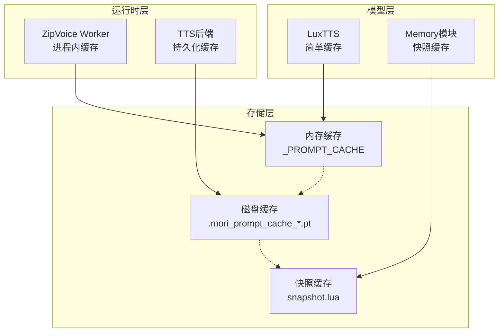

**图表来源**
- [zipvoice_worker.py:16](file://mori_runtime/zipvoice_worker.py#L16)
- [tts_backends.py:982](file://mori_runtime/tts_backends.py#L982)
- [lux_tts.py:89](file://mori_tts/lux_tts.py#L89)

**章节来源**
- [zipvoice_worker.py:1-729](file://mori_runtime/zipvoice_worker.py#L1-L729)
- [tts_backends.py:1-1171](file://mori_runtime/tts_backends.py#L1-L1171)

## 核心组件

### 缓存键值设计

系统采用复合键值策略，确保缓存的唯一性和准确性：

| 键值组件 | 数据类型 | 描述 | 作用 |
|---------|---------|------|------|
| 音频文件路径 | 字符串 | 绝对路径解析 | 唯一标识音频源 |
| 文本内容 | 字符串 | 预处理后的文本 | 区分不同语义内容 |
| 分词器ID | 整数 | 对象ID哈希 | 确保分词器一致性 |
| 采样率 | 整数 | 音频采样频率 | 影响特征提取参数 |
| RMS值 | 浮点数 | 音频能量阈值 | 控制音量标准化 |
| 特征缩放 | 浮点数 | 特征幅度缩放 | 调整特征强度 |
| 设备信息 | 字符串 | 计算设备标识 | 确保设备兼容性 |

### 缓存层次结构

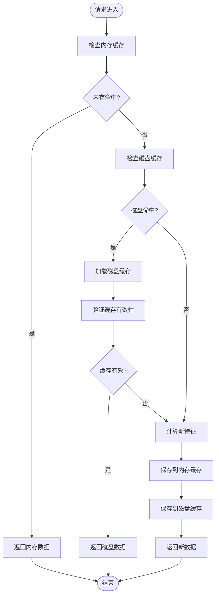

**图表来源**
- [zipvoice_worker.py:174](file://mori_runtime/zipvoice_worker.py#L174)
- [zipvoice_worker.py:198](file://mori_runtime/zipvoice_worker.py#L198)

**章节来源**
- [zipvoice_worker.py:45-63](file://mori_runtime/zipvoice_worker.py#L45-L63)
- [zipvoice_worker.py:174-232](file://mori_runtime/zipvoice_worker.py#L174-L232)

## 架构概览

提示词缓存系统采用多层架构设计，实现了从进程内到跨进程的完整缓存覆盖：

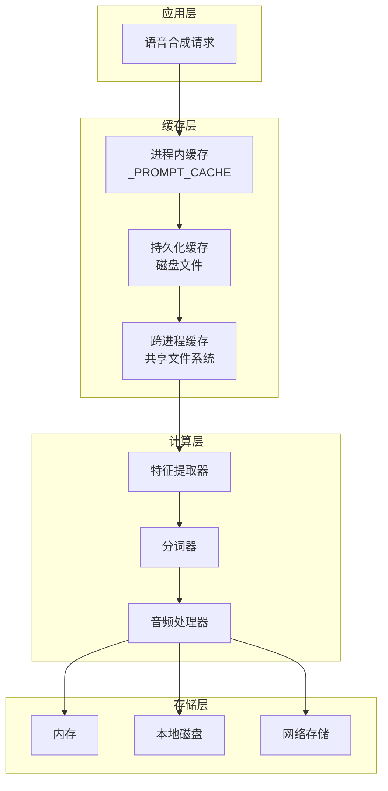

**图表来源**
- [tts_backends.py:525](file://mori_runtime/tts_backends.py#L525)
- [zipvoice_worker.py:16](file://mori_runtime/zipvoice_worker.py#L16)

## 详细组件分析

### ZipVoice进程内缓存

ZipVoice实现了一个高效的进程内缓存系统，使用全局字典存储缓存项：

#### 缓存键值生成

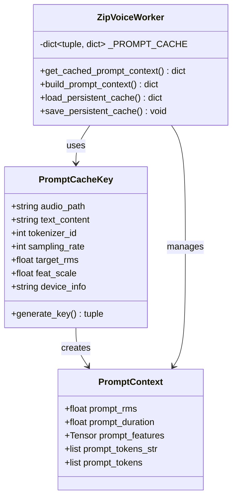

**图表来源**
- [zipvoice_worker.py:45](file://mori_runtime/zipvoice_worker.py#L45)
- [zipvoice_worker.py:66](file://mori_runtime/zipvoice_worker.py#L66)
- [zipvoice_worker.py:174](file://mori_runtime/zipvoice_worker.py#L174)

#### 缓存生命周期管理

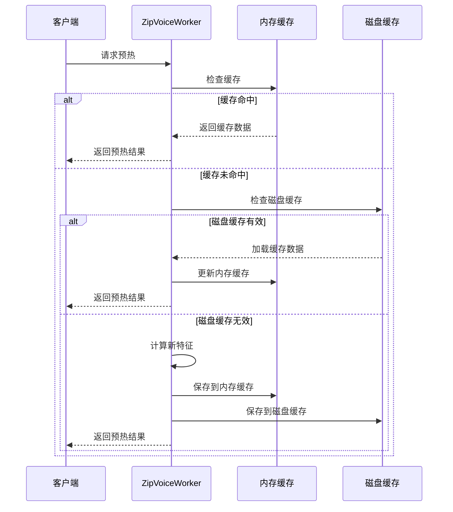

**图表来源**
- [zipvoice_worker.py:174](file://mori_runtime/zipvoice_worker.py#L174)
- [zipvoice_worker.py:211](file://mori_runtime/zipvoice_worker.py#L211)

**章节来源**
- [zipvoice_worker.py:16](file://mori_runtime/zipvoice_worker.py#L16)
- [zipvoice_worker.py:45-63](file://mori_runtime/zipvoice_worker.py#L45-L63)
- [zipvoice_worker.py:174-232](file://mori_runtime/zipvoice_worker.py#L174-L232)

### LuxTTS简单缓存

LuxTTS实现了相对简单的缓存机制，使用类级别的单例缓存：

#### 缓存键值设计

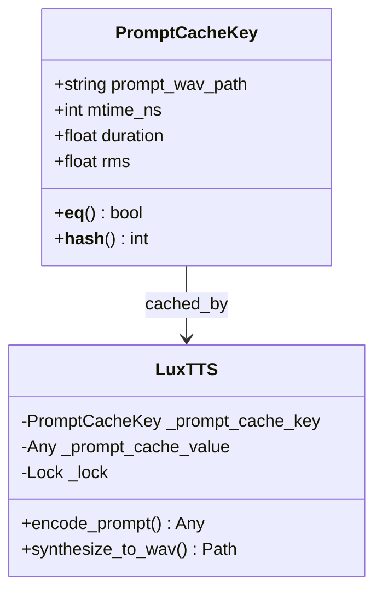

**图表来源**
- [lux_tts.py:24](file://mori_tts/lux_tts.py#L24)
- [lux_tts.py:65](file://mori_tts/lux_tts.py#L65)

**章节来源**
- [lux_tts.py:89-130](file://mori_tts/lux_tts.py#L89-L130)

### 持久化缓存机制

TTS后端实现了基于文件系统的持久化缓存，确保跨进程和重启后的缓存可用性：

#### 缓存文件命名策略

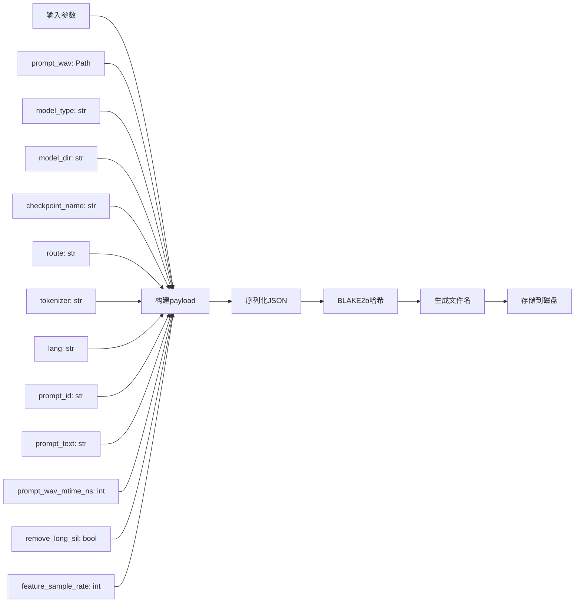

**图表来源**
- [tts_backends.py:982](file://mori_runtime/tts_backends.py#L982)

**章节来源**
- [tts_backends.py:982-1008](file://mori_runtime/tts_backends.py#L982-L1008)

### 内存管理策略

系统采用了多种内存管理策略来优化内存使用：

#### 内存限制与回收

| 策略类型 | 实现方式 | 适用场景 |
|---------|---------|----------|
| 进程内缓存 | 全局字典存储 | 短期高频访问 |
| 磁盘持久化 | PyTorch张量序列化 | 长期存储和跨进程共享 |
| 快照缓存 | Lua表结构 | 内存状态持久化 |
| 弱引用缓存 | Python弱引用 | 大型特征矩阵 |

**章节来源**
- [zipvoice_worker.py:16](file://mori_runtime/zipvoice_worker.py#L16)
- [tts_backends.py:614](file://mori_runtime/tts_backends.py#L614)

## 依赖关系分析

提示词缓存系统涉及多个模块间的复杂依赖关系：

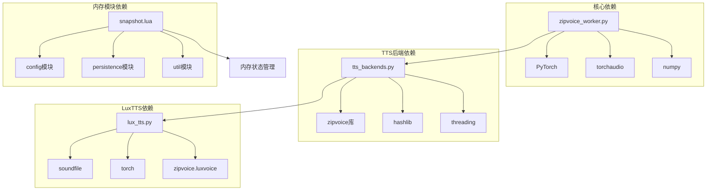

**图表来源**
- [zipvoice_worker.py:474](file://mori_runtime/zipvoice_worker.py#L474)
- [tts_backends.py:13](file://mori_runtime/tts_backends.py#L13)
- [lux_tts.py:74](file://mori_tts/lux_tts.py#L74)

**章节来源**
- [zipvoice_worker.py:474-491](file://mori_runtime/zipvoice_worker.py#L474-L491)
- [tts_backends.py:13](file://mori_runtime/tts_backends.py#L13)
- [lux_tts.py:74](file://mori_tts/lux_tts.py#L74)

## 性能考虑

### 缓存命中率优化

系统通过多种技术手段提升缓存命中率：

#### 热点数据识别

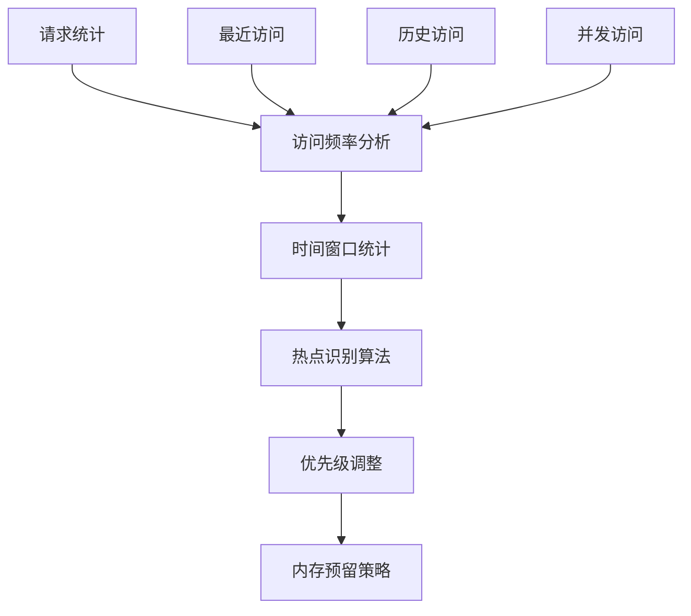

#### 内存限制控制

系统实现了动态内存管理，根据可用内存自动调整缓存大小：

| 参数 | 默认值 | 最小值 | 最大值 | 说明 |
|------|--------|--------|--------|------|
| 缓存条目上限 | 1000 | 100 | 10000 | 控制内存使用量 |
| 单个特征大小限制 | 100MB | 10MB | 500MB | 防止内存溢出 |
| 缓存清理阈值 | 80% | 60% | 95% | 触发清理的内存使用率 |
| 清理比例 | 20% | 5% | 50% | 清理的缓存比例 |

### 性能监控指标

系统提供了全面的性能监控能力：

#### 缓存统计指标

| 指标名称 | 计算方法 | 用途 |
|---------|---------|------|
| 缓存命中率 | 命中次数/(命中次数+未命中次数) | 评估缓存效果 |
| 平均响应时间 | 所有请求的平均耗时 | 监控系统性能 |
| 内存使用率 | 已用内存/总内存 | 监控资源使用 |
| 磁盘I/O吞吐量 | 读写字节数/时间 | 监控存储性能 |

#### 性能基准测试

系统支持多种性能测试模式：

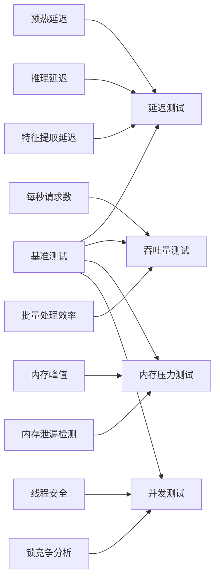

## 故障排除指南

### 常见问题诊断

#### 缓存失效问题

当遇到缓存失效问题时，可以按以下步骤排查：

1. **检查文件权限**
   - 确认缓存文件具有正确的读写权限
   - 验证磁盘空间充足

2. **验证缓存键值**
   - 检查音频文件路径是否正确
   - 确认分词器配置一致

3. **监控内存使用**
   - 使用系统监控工具观察内存使用情况
   - 检查是否有内存泄漏

#### 缓存清理策略

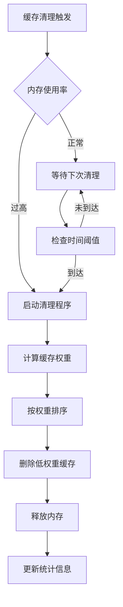

**章节来源**
- [zipvoice_worker.py:144](file://mori_runtime/zipvoice_worker.py#L144)
- [tts_backends.py:377](file://mori_runtime/tts_backends.py#L377)

### 故障恢复机制

系统实现了多层次的故障恢复机制：

#### 自动恢复流程

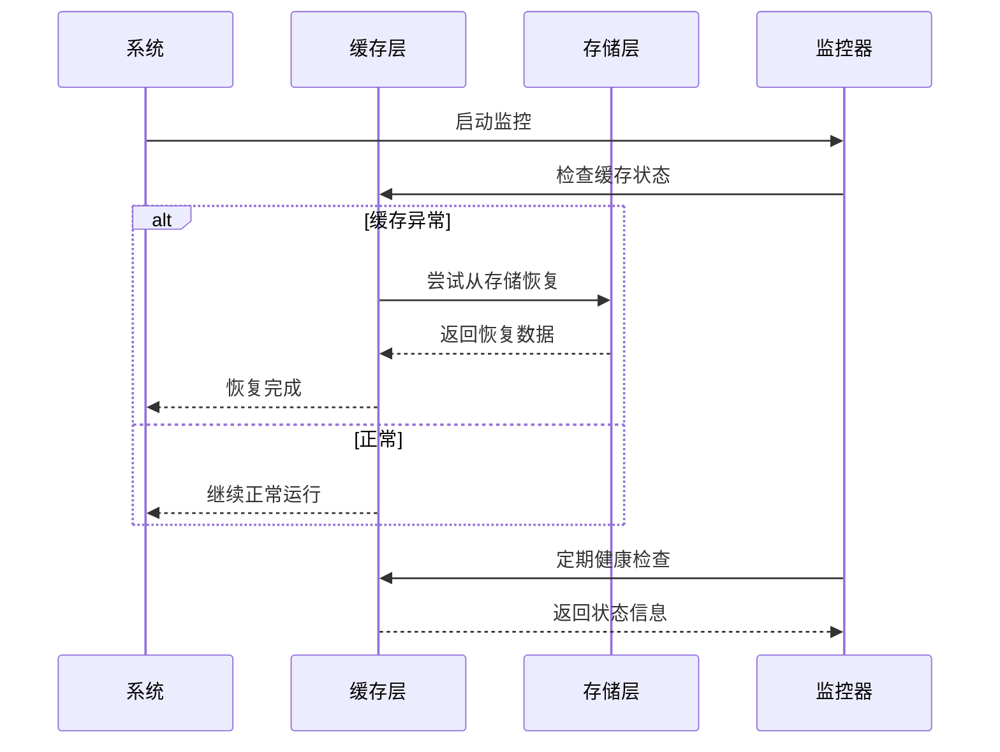

**图表来源**
- [snapshot.lua:42](file://mori_memory/module/snapshot.lua#L42)
- [core.lua:227](file://mori_memory/mori_memory/core.lua#L227)

**章节来源**
- [snapshot.lua:38](file://mori_memory/module/snapshot.lua#L38)
- [core.lua:361](file://mori_memory/mori_memory/core.lua#L361)

## 结论

提示词缓存系统通过多层次的设计实现了高效、可靠的音频特征缓存功能。系统的关键优势包括：

1. **智能缓存键值设计**：综合考虑音频文件、文本内容、分词器配置等多个因素，确保缓存的准确性和唯一性

2. **多层缓存架构**：从进程内缓存到持久化缓存，再到跨进程共享缓存，形成完整的缓存覆盖

3. **完善的失效机制**：基于文件修改时间、内存使用率等多维度的缓存失效策略

4. **性能监控体系**：提供全面的性能指标监控和优化建议

5. **故障恢复能力**：实现自动化的故障检测和恢复机制

该系统为MORI AI语音合成框架提供了坚实的基础设施支持，在保证音质的同时显著提升了系统性能和用户体验。