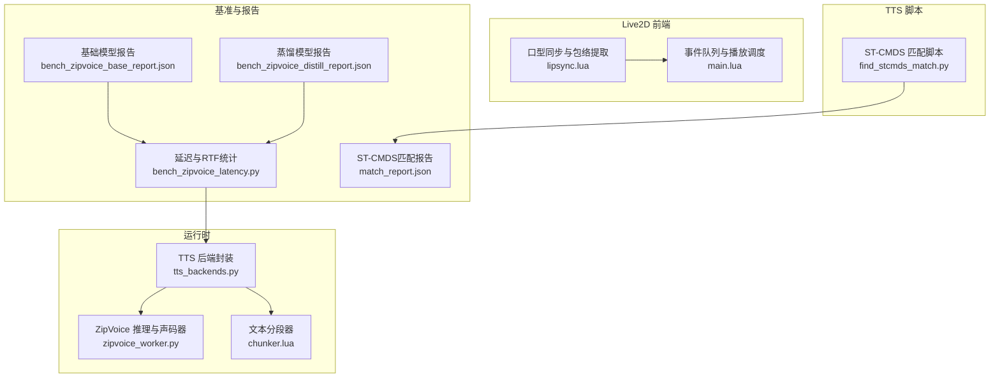
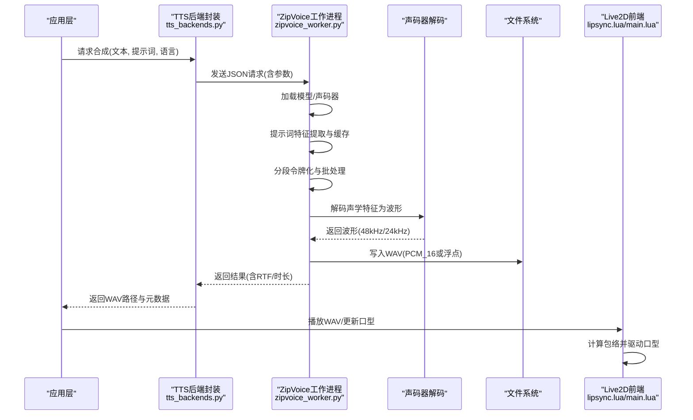
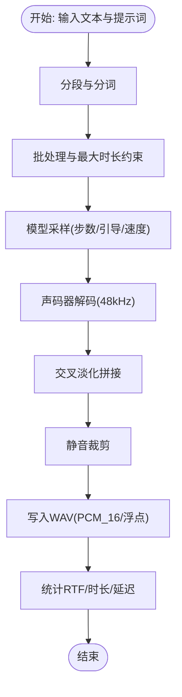
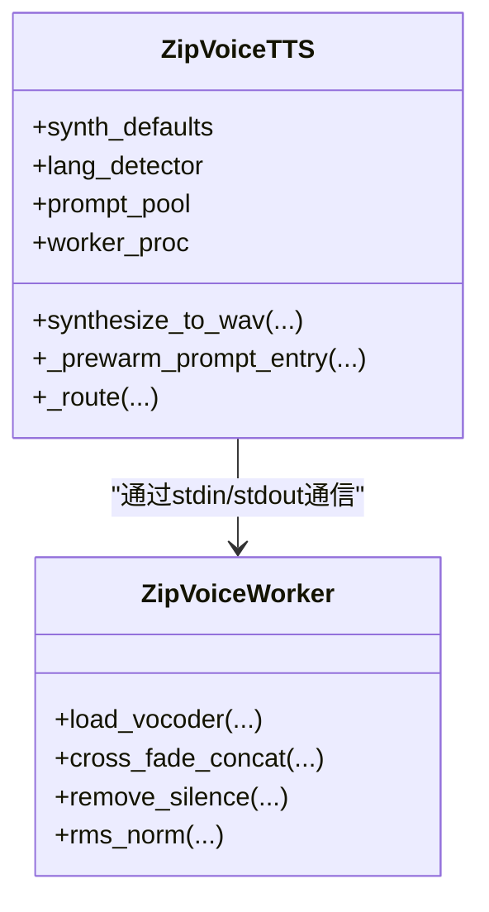
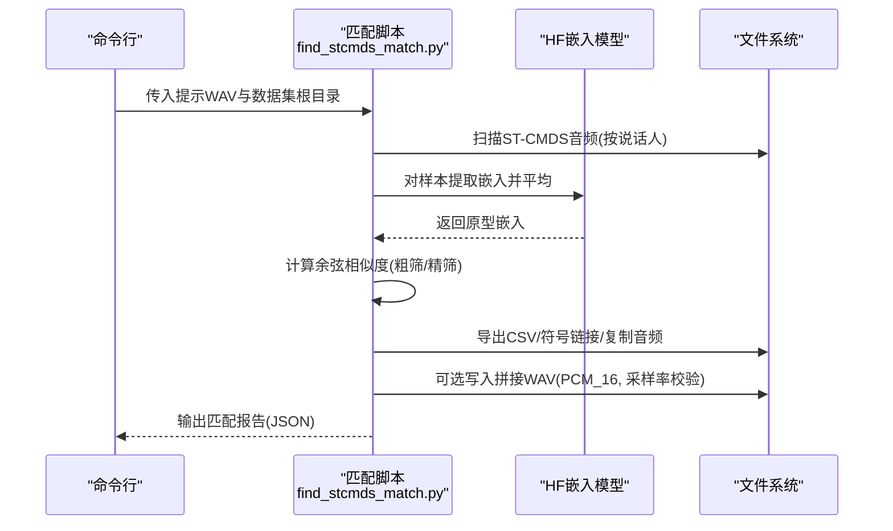
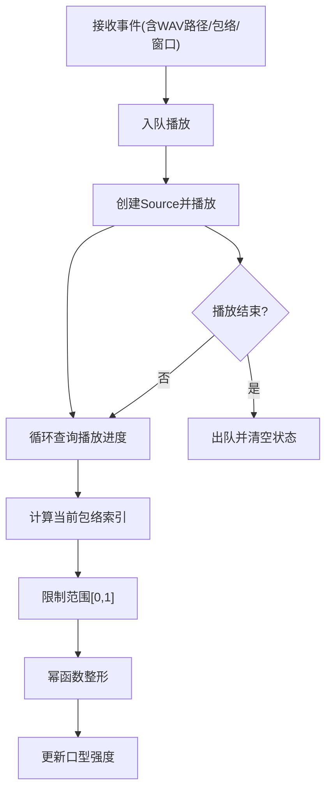
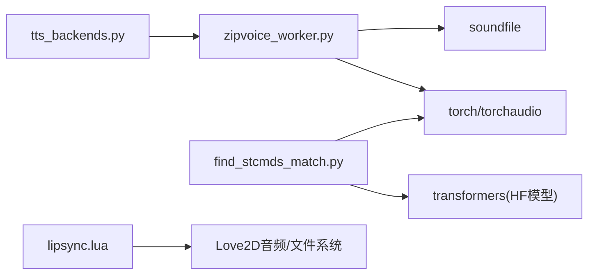

# 音频处理与输出

<cite>
**本文引用的文件**
- [zipvoice_worker.py](file://mori_runtime/zipvoice_worker.py)
- [tts_backends.py](file://mori_runtime/tts_backends.py)
- [find_stcmds_match.py](file://mori_tts/scripts/find_stcmds_match.py)
- [lipsync.lua](file://mori_live2d/love2d_frontend/lipsync.lua)
- [main.lua](file://mori_live2d/love2d_frontend/main.lua)
- [chunker.lua](file://mori_runtime/lua/mori/speech/chunker.lua)
- [bench_zipvoice_latency.py](file://scripts/bench_zipvoice_latency.py)
- [bench_zipvoice_base_report.json](file://tts_out/bench_zipvoice_base_report.json)
- [bench_zipvoice_distill_report.json](file://tts_out/bench_zipvoice_distill_report.json)
- [match_report.json](file://mori_tts/stcmds_match/match_report.json)
- [filelist.csv](file://mori_tts/stcmds_match/P00393/filelist.csv)
</cite>

## 目录
1. [简介](#简介)
2. [项目结构](#项目结构)
3. [核心组件](#核心组件)
4. [架构总览](#架构总览)
5. [详细组件分析](#详细组件分析)
6. [依赖关系分析](#依赖关系分析)
7. [性能考量](#性能考量)
8. [故障排查指南](#故障排查指南)
9. [结论](#结论)
10. [附录](#附录)

## 简介
本技术文档聚焦于项目中的音频处理与输出链路，围绕以下目标展开：
- 音频采样率标准化（48kHz）：重采样算法、质量保持策略、延迟控制
- 音频格式转换：WAV文件写入、PCM数据处理、浮点数精度控制
- 音频拼接技术：静音处理、过渡效果、音量匹配
- ST-CMDS匹配系统：音素序列对齐、发音特征提取、语音相似度计算
- 音频质量评估：客观指标（RTF等）、主观听测、A/B对比测试
- 音频设备兼容性：播放延迟优化、音频流控制策略

## 项目结构
本项目在“运行时”“TTS脚本”“Live2D前端”“基准测试”等多个模块中实现了端到端的音频合成与播放能力。关键模块如下：
- 运行时TTS后端：ZipVoice推理与声码器解码、提示词缓存、分段合成
- ST-CMDS说话人匹配：基于说话人嵌入的检索与导出
- Live2D前端：音频包络提取与口型同步驱动
- 基准测试：延迟与实时因子（RTF）统计
- 文本分段：按标点与字符长度进行自然断句

图表来源
- [zipvoice_worker.py:1-729](file://mori_runtime/zipvoice_worker.py#L1-L729)
- [tts_backends.py:1-1171](file://mori_runtime/tts_backends.py#L1-L1171)
- [find_stcmds_match.py:1-414](file://mori_tts/scripts/find_stcmds_match.py#L1-L414)
- [lipsync.lua:1-128](file://mori_live2d/love2d_frontend/lipsync.lua#L1-L128)
- [main.lua:269-403](file://mori_live2d/love2d_frontend/main.lua#L269-L403)
- [chunker.lua:1-157](file://mori_runtime/lua/mori/speech/chunker.lua#L1-L157)
- [bench_zipvoice_latency.py:239-319](file://scripts/bench_zipvoice_latency.py#L239-L319)
- [bench_zipvoice_base_report.json:79-302](file://tts_out/bench_zipvoice_base_report.json#L79-L302)
- [bench_zipvoice_distill_report.json:223-302](file://tts_out/bench_zipvoice_distill_report.json#L223-L302)
- [match_report.json:1-54](file://mori_tts/stcmds_match/match_report.json#L1-L54)

章节来源
- [zipvoice_worker.py:1-729](file://mori_runtime/zipvoice_worker.py#L1-L729)
- [tts_backends.py:1-1171](file://mori_runtime/tts_backends.py#L1-L1171)

## 核心组件
- ZipVoice推理与声码器解码：负责文本到波形的端到端生成，支持24kHz/48kHz声码器配置，输出WAV并进行静音裁剪与交叉淡化拼接。
- TTS后端封装：统一语言检测、提示词选择与持久化缓存、子进程工作流管理、请求/响应协议。
- ST-CMDS匹配：从ST-CMDS数据集中检索最接近目标音色的说话人，导出训练集与可听拼接音频。
- Live2D口型同步：从WAV计算包络，驱动口型动画，实现“边播边动”的体验。
- 文本分段器：按中英文标点与字符长度进行智能断句，提升合成连贯性。
- 基准测试：批量合成音频，统计首帧就绪时间、总合成时间、音频时长与实时因子（RTF）。

章节来源
- [zipvoice_worker.py:303-443](file://mori_runtime/zipvoice_worker.py#L303-L443)
- [tts_backends.py:525-1171](file://mori_runtime/tts_backends.py#L525-L1171)
- [find_stcmds_match.py:296-414](file://mori_tts/scripts/find_stcmds_match.py#L296-L414)
- [lipsync.lua:31-125](file://mori_live2d/love2d_frontend/lipsync.lua#L31-L125)
- [chunker.lua:56-153](file://mori_runtime/lua/mori/speech/chunker.lua#L56-L153)
- [bench_zipvoice_latency.py:239-319](file://scripts/bench_zipvoice_latency.py#L239-L319)

## 架构总览
下图展示了从文本输入到WAV输出与播放的关键流程，以及各模块间的交互关系。

图表来源
- [tts_backends.py:668-760](file://mori_runtime/tts_backends.py#L668-L760)
- [zipvoice_worker.py:303-443](file://mori_runtime/zipvoice_worker.py#L303-L443)
- [lipsync.lua:62-125](file://mori_live2d/love2d_frontend/lipsync.lua#L62-L125)
- [main.lua:357-399](file://mori_live2d/love2d_frontend/main.lua#L357-L399)

## 详细组件分析

### 组件A：ZipVoice推理与声码器解码（48kHz标准化）
- 采样率标准化：通过声码器配置选择48kHz输出，确保下游播放与设备兼容性一致。
- 重采样策略：在特征抽取阶段使用固定采样率（如24kHz），在声码器解码阶段统一输出至48kHz，避免多源混杂导致的音质不一致。
- 质量保持：通过交叉淡化拼接（cross-fade）降低片段边界噪声；静音裁剪（remove_silence）去除尾部冗余；音量归一化（RMS）保证不同提示词的响度一致性。
- 延迟控制：分段令牌化与批处理，结合预热提示词缓存，减少首次合成延迟；实时模式下降低步数与引导强度以换取更低RTF。

图表来源
- [zipvoice_worker.py:303-443](file://mori_runtime/zipvoice_worker.py#L303-L443)

章节来源
- [zipvoice_worker.py:13-16](file://mori_runtime/zipvoice_worker.py#L13-L16)
- [zipvoice_worker.py:396-429](file://mori_runtime/zipvoice_worker.py#L396-L429)
- [zipvoice_worker.py:434-443](file://mori_runtime/zipvoice_worker.py#L434-L443)

### 组件B：TTS后端封装与提示词缓存
- 语言检测与路由：根据提示词与启发式规则自动判断中/日语，选择对应分词器与语言参数。
- 提示词持久化缓存：将提示词特征序列化并缓存，避免重复计算；按内容哈希生成稳定缓存键，跨进程共享。
- 子进程工作流：通过标准输入/输出与ZipVoice工作进程通信，支持预热与关闭指令。
- 合成选项默认值：按“实时/均衡/高质量”三档配置步数、引导强度、速度与平滑开关。

图表来源
- [tts_backends.py:525-1171](file://mori_runtime/tts_backends.py#L525-L1171)
- [zipvoice_worker.py:266-301](file://mori_runtime/zipvoice_worker.py#L266-L301)

章节来源
- [tts_backends.py:496-523](file://mori_runtime/tts_backends.py#L496-L523)
- [tts_backends.py:807-841](file://mori_runtime/tts_backends.py#L807-L841)
- [tts_backends.py:1010-1100](file://mori_runtime/tts_backends.py#L1010-L1100)

### 组件C：ST-CMDS匹配系统
- 数据扫描：遍历ST-CMDS目录，按说话人聚合音频文件。
- 特征提取：加载说话人嵌入模型（XVector），对样本进行平均嵌入。
- 相似度计算：采用余弦相似度比较目标提示词与候选说话人的原型嵌入，首轮均匀采样粗筛，再全集精筛。
- 导出训练集：生成CSV清单、符号链接或复制音频，构建训练就绪的数据集；可选生成可听拼接音频（带静音间隔）。

图表来源
- [find_stcmds_match.py:98-133](file://mori_tts/scripts/find_stcmds_match.py#L98-L133)
- [find_stcmds_match.py:155-178](file://mori_tts/scripts/find_stcmds_match.py#L155-L178)
- [find_stcmds_match.py:296-414](file://mori_tts/scripts/find_stcmds_match.py#L296-L414)
- [match_report.json:1-54](file://mori_tts/stcmds_match/match_report.json#L1-L54)
- [filelist.csv:1-8](file://mori_tts/stcmds_match/P00393/filelist.csv#L1-L8)

章节来源
- [find_stcmds_match.py:1-414](file://mori_tts/scripts/find_stcmds_match.py#L1-L414)
- [match_report.json:1-54](file://mori_tts/stcmds_match/match_report.json#L1-L54)
- [filelist.csv:1-8](file://mori_tts/stcmds_match/P00393/filelist.csv#L1-L8)

### 组件D：Live2D口型同步与播放
- 包络提取：按窗口大小计算RMS包络，归一化后用于口型驱动。
- 播放调度：从事件流读取WAV路径与包络参数，入队播放；播放完成后出队并更新状态。
- 口型驱动：根据播放进度定位包络索引，幂函数变换后作为口型强度。

图表来源
- [lipsync.lua:31-125](file://mori_live2d/love2d_frontend/lipsync.lua#L31-L125)
- [main.lua:357-399](file://mori_live2d/love2d_frontend/main.lua#L357-L399)

章节来源
- [lipsync.lua:31-125](file://mori_live2d/love2d_frontend/lipsync.lua#L31-L125)
- [main.lua:269-403](file://mori_live2d/love2d_frontend/main.lua#L269-L403)

### 组件E：文本分段与断句
- 断句策略：优先硬断点（句号、问号、感叹号等），其次软断点（逗号、顿号、分号等），最后按最大字符阈值截断。
- UTF-8安全迭代：逐字符处理，避免切开UTF-8多字节字符。
- 初次段落增强：前若干段放宽阈值，提升首句连贯性。

章节来源
- [chunker.lua:56-153](file://mori_runtime/lua/mori/speech/chunker.lua#L56-L153)

## 依赖关系分析
- ZipVoice后端依赖外部ZipVoice仓库与模型配置文件，通过子进程调用工作脚本。
- 工作脚本依赖torchaudio、soundfile等库进行重采样与WAV写入。
- ST-CMDS匹配依赖transformers/HuggingFace XVector模型与torchaudio进行嵌入提取。
- Live2D前端依赖Love2D音频与文件系统接口。

图表来源
- [tts_backends.py:525-650](file://mori_runtime/tts_backends.py#L525-L650)
- [zipvoice_worker.py:474-491](file://mori_runtime/zipvoice_worker.py#L474-L491)
- [find_stcmds_match.py:14-18](file://mori_tts/scripts/find_stcmds_match.py#L14-L18)
- [lipsync.lua:73-86](file://mori_live2d/love2d_frontend/lipsync.lua#L73-L86)

章节来源
- [tts_backends.py:525-650](file://mori_runtime/tts_backends.py#L525-L650)
- [zipvoice_worker.py:474-491](file://mori_runtime/zipvoice_worker.py#L474-L491)
- [find_stcmds_match.py:14-18](file://mori_tts/scripts/find_stcmds_match.py#L14-L18)
- [lipsync.lua:73-86](file://mori_live2d/love2d_frontend/lipsync.lua#L73-L86)

## 性能考量
- 实时因子（RTF）：总合成时长与音频时长的比值，越低越好。基准报告提供了不同场景与模型的RTF统计。
- 首帧就绪时间：首个音频片段可用的时间，影响交互体验。
- 稳态积压：合成耗时与音频时长差值的最大值，反映系统在持续负载下的稳定性。
- 降采样与上采样：特征抽取与声码器输出的采样率差异需谨慎处理，避免引入额外延迟与失真。
- I/O与内存：WAV写入与包络计算应尽量批量与流水线化，减少阻塞。

章节来源
- [bench_zipvoice_latency.py:239-319](file://scripts/bench_zipvoice_latency.py#L239-L319)
- [bench_zipvoice_base_report.json:79-302](file://tts_out/bench_zipvoice_base_report.json#L79-L302)
- [bench_zipvoice_distill_report.json:223-302](file://tts_out/bench_zipvoice_distill_report.json#L223-L302)

## 故障排查指南
- ZipVoice工作进程异常退出：检查模型配置文件是否存在、CUDA/MPS可用性、子进程启动命令与路径。
- WAV写入失败：确认输出目录存在且有写权限；检查采样率与声道数设置是否一致。
- 包络为空或口型不动作：检查WAV路径有效、采样率正确、包络窗口参数合理。
- ST-CMDS匹配报错：确认HF模型可用、CUDA可用、数据集路径正确、文件名正则匹配成功。
- 延迟过高：降低合成步数、启用实时质量档、减少提示词长度、优化分段策略。

章节来源
- [zipvoice_worker.py:668-700](file://mori_runtime/zipvoice_worker.py#L668-L700)
- [tts_backends.py:668-760](file://mori_runtime/tts_backends.py#L668-L760)
- [lipsync.lua:62-107](file://mori_live2d/love2d_frontend/lipsync.lua#L62-L107)
- [find_stcmds_match.py:296-310](file://mori_tts/scripts/find_stcmds_match.py#L296-L310)

## 结论
本项目通过ZipVoice推理与声码器解码实现高质量、低延迟的TTS输出，并在多个层面保障采样率一致性（48kHz）、格式规范（WAV/PCM_16/浮点）、拼接质量（静音裁剪、交叉淡化）。配合ST-CMDS说话人匹配与Live2D口型同步，形成从“音色匹配—合成—播放—动画”的完整链路。基准测试提供了RTF与延迟的量化指标，便于持续优化与A/B对比。

## 附录
- 配置要点
  - 声码器配置：选择“lux_48k”以获得48kHz输出；否则默认24kHz。
  - 合成质量档：实时/均衡/高质量分别对应不同的步数与引导强度。
  - 提示词缓存：建议启用持久化缓存以减少重复计算。
- 输出格式
  - WAV写入：支持PCM_16与浮点两种子类型，采样率与通道数由声码器决定。
- 评估方法
  - 客观指标：RTF、首帧就绪时间、稳态积压。
  - 主观听测：口型同步一致性、自然度、音色匹配度。
  - A/B对比：同一文本在不同模型/参数下的主观评分与客观指标对比。