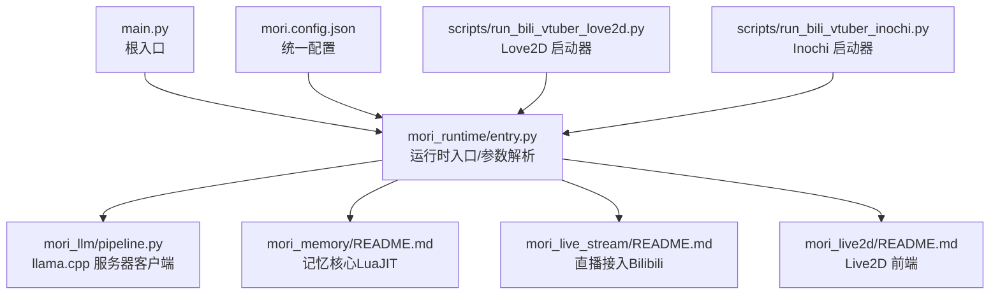
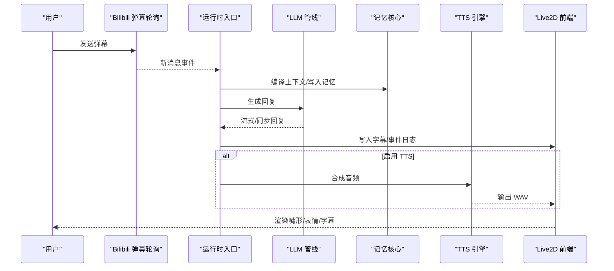
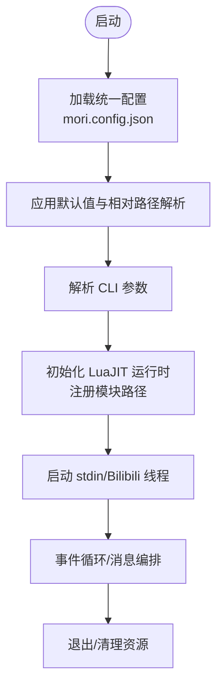
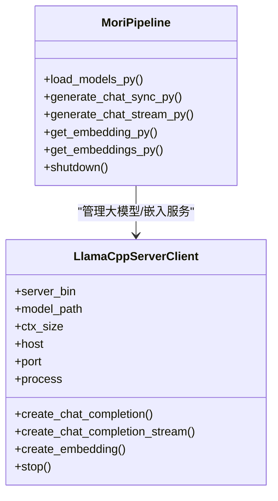
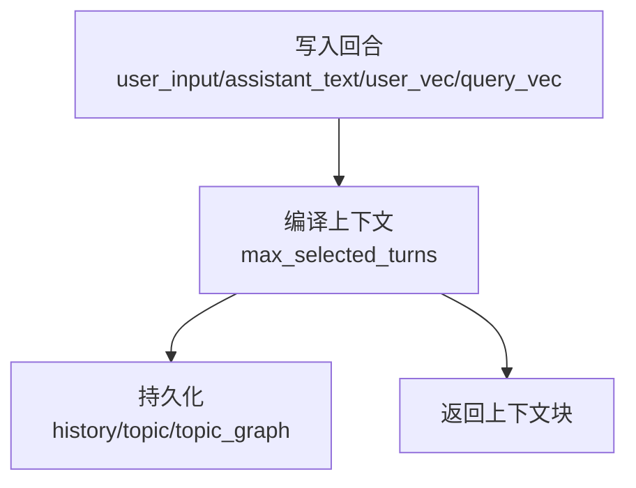
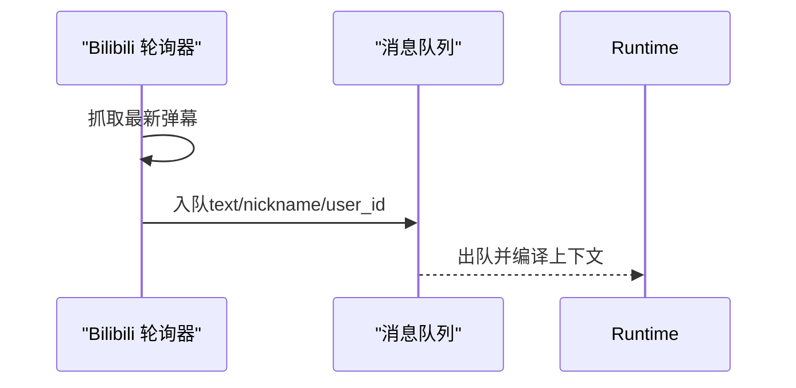
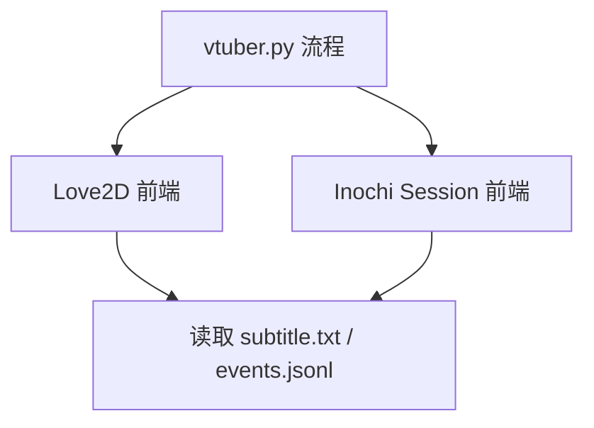
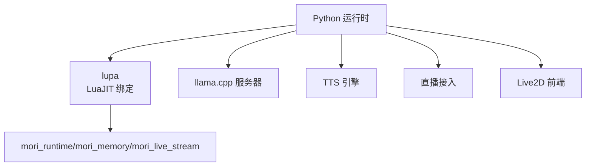

# 开发指南

<cite>
**本文引用的文件**
- [README.md](file://README.md)
- [main.py](file://main.py)
- [mori_runtime/entry.py](file://mori_runtime/entry.py)
- [mori_runtime/config.py](file://mori_runtime/config.py)
- [mori_llm/pipeline.py](file://mori_llm/pipeline.py)
- [mori_memory/README.md](file://mori_memory/README.md)
- [mori_live2d/README.md](file://mori_live2d/README.md)
- [mori_live_stream/README.md](file://mori_live_stream/README.md)
- [scripts/run_bili_vtuber_love2d.py](file://scripts/run_bili_vtuber_love2d.py)
- [scripts/run_bili_vtuber_inochi.py](file://scripts/run_bili_vtuber_inochi.py)
- [mori.config.json](file://mori.config.json)
</cite>

## 目录
1. [简介](#简介)
2. [项目结构](#项目结构)
3. [核心组件](#核心组件)
4. [架构总览](#架构总览)
5. [详细组件分析](#详细组件分析)
6. [依赖分析](#依赖分析)
7. [性能考虑](#性能考虑)
8. [故障排查指南](#故障排查指南)
9. [结论](#结论)
10. [附录](#附录)

## 简介
本指南面向希望参与 Mori 项目的开发者，提供从环境搭建、IDE 配置、调试工具、测试策略，到代码贡献、新功能开发流程、扩展开发（插件、第三方服务、API 扩展）、性能分析与优化、发布与版本管理的完整开发手册。项目采用多语言混合架构：Python 主入口与运行时、LuaJIT 记忆核心、C/C++/Rust 原生加速模块、Love2D/Inochi2D 前端，以及 llama.cpp 提供的本地大模型推理能力。

## 项目结构
仓库采用“聚合入口（monorepo-like）”组织方式，核心模块与子模块分布如下：
- 根入口与统一配置：main.py、mori.config.json、mori_runtime/config.py
- 运行时与管线：mori_runtime/entry.py、mori_llm/pipeline.py
- 记忆核心：mori_memory/（LuaJIT + 可选原生加速）
- 直播接入：mori_live_stream/（Bilibili 弹幕轮询）
- Live2D 前端：mori_live2d/（Love2D + Inox2D）
- 启动脚本：scripts/run_bili_vtuber_love2d.py、scripts/run_bili_vtuber_inochi.py
- 文档与说明：各模块 README.md

图表来源
- [main.py](file://main.py)
- [mori_runtime/entry.py](file://mori_runtime/entry.py)
- [mori_llm/pipeline.py](file://mori_llm/pipeline.py)
- [mori_memory/README.md](file://mori_memory/README.md)
- [mori_live_stream/README.md](file://mori_live_stream/README.md)
- [mori_live2d/README.md](file://mori_live2d/README.md)
- [scripts/run_bili_vtuber_love2d.py](file://scripts/run_bili_vtuber_love2d.py)
- [scripts/run_bili_vtuber_inochi.py](file://scripts/run_bili_vtuber_inochi.py)
- [mori.config.json](file://mori.config.json)

章节来源
- [README.md](file://README.md)
- [mori_runtime/config.py](file://mori_runtime/config.py)

## 核心组件
- 运行时入口与参数解析：负责统一 CLI 解析、配置加载、TTS/LLM/Live2D/Lua 模块初始化与线程调度。
- LLM 管线：封装 llama.cpp 服务器的启动、健康检查、聊天与嵌入请求、流式输出、资源清理。
- 记忆核心：LuaJIT 实现的记忆模块，支持向量编排、主题图谱、可选 HNSW/SIMD 加速。
- 直播接入：Bilibili 弹幕轮询采集，支持离线检测与历史回补。
- Live2D 前端：Love2D + Inox2D 渲染，读取字幕与事件日志驱动嘴形与表情。
- 启动器脚本：run_bili_vtuber_love2d.py 与 run_bili_vtuber_inochi.py，组合 vtuber 流程与前端。

章节来源
- [mori_runtime/entry.py](file://mori_runtime/entry.py)
- [mori_llm/pipeline.py](file://mori_llm/pipeline.py)
- [mori_memory/README.md](file://mori_memory/README.md)
- [mori_live_stream/README.md](file://mori_live_stream/README.md)
- [mori_live2d/README.md](file://mori_live2d/README.md)
- [scripts/run_bili_vtuber_love2d.py](file://scripts/run_bili_vtuber_love2d.py)
- [scripts/run_bili_vtuber_inochi.py](file://scripts/run_bili_vtuber_inochi.py)

## 架构总览
整体数据流从直播弹幕进入，经 LLM 生成回复，写入字幕与事件日志，TTS 可选生成音频，前端读取实时渲染。

图表来源
- [mori_runtime/entry.py](file://mori_runtime/entry.py)
- [mori_llm/pipeline.py](file://mori_llm/pipeline.py)
- [mori_memory/README.md](file://mori_memory/README.md)
- [mori_live_stream/README.md](file://mori_live_stream/README.md)
- [mori_live2d/README.md](file://mori_live2d/README.md)

## 详细组件分析

### 运行时入口与配置系统
- 统一配置加载：支持从仓库根或当前目录自动发现 mori.config.json，解析 common/tts/cli/vtuber/love2d/inochi 分组，相对路径解析与默认值注入。
- CLI 参数：涵盖 LLM 参数（上下文、采样）、TTS 参数（后端、设备、步数、引导系数、语速等）、直播参数（房间、间隔、历史回补、离线退出）、前端参数（Puppet、映射、鼠标视角等）。
- 运行时桥接：通过 lupa 将 Python 与 LuaJIT 模块（mori_runtime、mori_memory、mori_live_stream）连接，提供 stdin 与 Bilibili 线程读取、消息队列、TTS 异步任务执行。

图表来源
- [mori_runtime/config.py](file://mori_runtime/config.py)
- [mori_runtime/entry.py](file://mori_runtime/entry.py)

章节来源
- [mori_runtime/config.py](file://mori_runtime/config.py)
- [mori_runtime/entry.py](file://mori_runtime/entry.py)
- [mori.config.json](file://mori.config.json)

### LLM 管线与 llama.cpp 服务器
- 服务器客户端：自动寻找空闲端口、启动 llama-server、健康检查、HTTP 请求封装、JSON 解析与错误处理。
- 聊天与嵌入：支持同步与流式聊天生成，嵌入向量规范化与前缀处理，支持草稿模型与 GPU 层数配置。
- 生命周期管理：进程启动/终止、超时控制、异常上报。

图表来源
- [mori_llm/pipeline.py](file://mori_llm/pipeline.py)

章节来源
- [mori_llm/pipeline.py](file://mori_llm/pipeline.py)

### 记忆核心（LuaJIT）
- 功能：接收每轮对话元信息（尤其是向量），根据当前主题状态返回编译后的上下文序列；支持持久化与可选原生加速（HNSW/SIMD）。
- 原生加速：HNSW 索引与 SIMD 点积/余弦计算可通过脚本构建模块并在 Lua 加载时自动启用。
- 数据落盘：history.txt、topic.bin、topic_graph/。

图表来源
- [mori_memory/README.md](file://mori_memory/README.md)

章节来源
- [mori_memory/README.md](file://mori_memory/README.md)

### 直播接入（Bilibili 弹幕）
- 轮询采集：基于 libcurl FFI 的 LuaJIT 实现，支持历史回补、离线检测、用户 ID 提取。
- 与 vtuber 集成：通过参数控制轮询间隔、是否退出当离线、是否回补历史。

图表来源
- [mori_runtime/entry.py](file://mori_runtime/entry.py)
- [mori_live_stream/README.md](file://mori_live_stream/README.md)

章节来源
- [mori_runtime/entry.py](file://mori_runtime/entry.py)
- [mori_live_stream/README.md](file://mori_live_stream/README.md)

### Live2D 前端（Love2D + Inox2D）
- 启动器：run_bili_vtuber_love2d.py 与 run_bili_vtuber_inochi.py，分别组合 vtuber 流程与 Love2D/Inochi 前端，自动准备模型与 FFI 库。
- 参数映射：支持关键词模糊匹配与自定义映射文件，控制头/眼/嘴/呼吸等参数。
- 环境变量：MORI_LIVE_DIR、MORI_PUPPET_PATH、MORI_MAPPING_PATH、MORI_MOUSE_LOOK 等。

图表来源
- [scripts/run_bili_vtuber_love2d.py](file://scripts/run_bili_vtuber_love2d.py)
- [scripts/run_bili_vtuber_inochi.py](file://scripts/run_bili_vtuber_inochi.py)
- [mori_live2d/README.md](file://mori_live2d/README.md)

章节来源
- [scripts/run_bili_vtuber_love2d.py](file://scripts/run_bili_vtuber_love2d.py)
- [scripts/run_bili_vtuber_inochi.py](file://scripts/run_bili_vtuber_inochi.py)
- [mori_live2d/README.md](file://mori_live2d/README.md)

## 依赖分析
- Python 依赖：lupa（LuaJIT 绑定）、urllib（HTTP）、subprocess/socket（进程/网络）、argparse（参数解析）。
- 原生模块：HNSW、SIMD 数学函数，通过脚本构建后在 Lua 中自动加载。
- 第三方服务：llama.cpp 服务器、Bilibili API（轮询）、TTS 后端（LuxTTS/ZipVoice）。

图表来源
- [mori_runtime/entry.py](file://mori_runtime/entry.py)
- [mori_llm/pipeline.py](file://mori_llm/pipeline.py)
- [mori_live_stream/README.md](file://mori_live_stream/README.md)
- [mori_live2d/README.md](file://mori_live2d/README.md)

章节来源
- [mori_runtime/entry.py](file://mori_runtime/entry.py)
- [mori_llm/pipeline.py](file://mori_llm/pipeline.py)
- [mori_live_stream/README.md](file://mori_live_stream/README.md)
- [mori_live2d/README.md](file://mori_live2d/README.md)

## 性能考虑
- LLM 推理
  - GPU 层配置：通过参数控制 GPU 层数与草稿模型，减少推理延迟。
  - 上下文大小：合理设置 ctx_size，平衡长上下文与显存占用。
  - 流式输出：使用流式接口降低首 token 延迟。
- 记忆检索
  - 启用 HNSW 与 SIMD 加速模块，提升主题图谱检索效率。
  - 控制 max_selected_turns，避免上下文过大导致编译成本上升。
- I/O 与前端
  - 字幕/事件日志写入频率与缓冲策略，避免频繁磁盘 IO。
  - TTS 合成批量化与异步队列，结合音频分段输出降低播放延迟。
- 线程与并发
  - stdin/Bilibili 轮询线程与 TTS 线程池隔离，避免阻塞主线程。
  - 资源清理：进程退出时主动停止 llama-server 与前端进程，释放资源。

[本节为通用指导，无需列出具体文件来源]

## 故障排查指南
- 依赖缺失
  - 缺少 lupa：确保在虚拟环境中安装依赖。
  - 缺少原生模块：按需构建 HNSW/SIMD 模块。
- 配置问题
  - 统一配置未生效：确认 mori.config.json 路径与字段正确，相对路径解析是否符合预期。
- LLM 服务
  - 启动失败：检查 llama-server 可执行文件路径与权限，GPU 层参数是否匹配硬件。
  - 健康检查超时：增大启动超时或调整 ctx_size/gpu_layers。
- 直播接入
  - 412/限流：增加轮询间隔、更换 UA 或升级为 WebSocket（后续计划）。
- 前端
  - Love2D/Inochi 启动失败：确认可执行文件路径、X11/Wayland 环境变量、Puppet/映射文件是否存在。

章节来源
- [mori_runtime/entry.py](file://mori_runtime/entry.py)
- [mori_llm/pipeline.py](file://mori_llm/pipeline.py)
- [mori_live_stream/README.md](file://mori_live_stream/README.md)
- [mori_live2d/README.md](file://mori_live2d/README.md)

## 结论
本开发指南提供了从环境搭建到扩展开发与性能优化的全栈实践路径。建议在开发过程中遵循统一配置优先、模块职责清晰、线程与资源管理规范的原则，结合原生加速与流式处理策略，持续迭代性能与稳定性。

[本节为总结性内容，无需列出具体文件来源]

## 附录

### 开发环境搭建与 IDE 配置
- Python 虚拟环境
  - 创建并激活 venv，安装依赖。
- 依赖安装
  - lupa（LuaJIT 绑定）、llama.cpp 服务器、TTS 后端（LuxTTS/ZipVoice）。
- 原生模块
  - 按需构建 HNSW/SIMD 模块，确保 Lua 能自动加载。
- IDE 建议
  - Python：PyCharm/VSCode（启用 venv、flake8/black/isort 等格式化工具）。
  - Lua：VSCode/LuaSnip/Luacheck。
  - Rust：Cargo 工具链（用于 inox2d FFI）。

章节来源
- [README.md](file://README.md)
- [mori_live2d/README.md](file://mori_live2d/README.md)

### 测试策略
- 单元测试
  - LLM 管线：对聊天/嵌入接口进行响应校验与超时处理测试。
  - 记忆核心：对编译上下文、持久化与主题图谱进行回归测试。
- 集成测试
  - 端到端：从 Bilibili 弹幕到字幕/TTS/前端渲染的完整链路验证。
  - 多平台：Linux/macOS/Windows 下的启动器与前端行为一致性。
- 性能测试
  - 延迟与吞吐：记录首 token 延迟、QPS、内存占用与 GPU 利用率。
  - 压力测试：高并发弹幕、长上下文、大模型参数变化下的稳定性。

[本节为通用指导，无需列出具体文件来源]

### 代码贡献指南
- 编码规范
  - Python：PEP 8，函数/类/模块命名清晰，异常处理明确。
  - Lua：小写命名、缩进一致、注释说明关键逻辑。
  - 原生模块：Rust/C/C++ 遵循对应社区规范。
- 提交规范
  - 标题简明，正文说明动机与变更点，附带影响范围与测试结果。
- 代码审查
  - 关注安全性（路径解析、命令拼接）、健壮性（超时/重试/降级）、可维护性（模块拆分、错误码）。

[本节为通用指导，无需列出具体文件来源]

### 新功能开发流程
- 需求分析
  - 明确用户场景、性能目标、兼容性约束。
- 设计文档
  - 描述模块边界、数据流、接口契约、异常处理策略。
- 实现阶段
  - 优先实现最小可行方案，逐步引入原生加速与容错机制。
- 测试验证
  - 单元/集成/性能测试全覆盖，形成基准报告。

[本节为通用指导，无需列出具体文件来源]

### 扩展开发指南
- 新插件开发
  - 在 mori_runtime/plugins 下新增 Lua 插件，遵循插件接口约定，注册到运行时。
- 第三方服务集成
  - 通过薄桥接（Python）对接，保证错误传播与资源回收。
- API 扩展
  - 在运行时入口添加参数解析与默认值注入，确保统一配置兼容。

[本节为通用指导，无需列出具体文件来源]

### 发布流程与版本管理策略
- 版本标识
  - 使用语义化版本，变更重要功能或破坏性改动时递增主版本。
- 发布清单
  - 更新 README、配置示例、依赖版本、原生模块构建说明。
- 回归验证
  - 覆盖主流平台与前端组合，确保启动器与原生模块可用。

[本节为通用指导，无需列出具体文件来源]