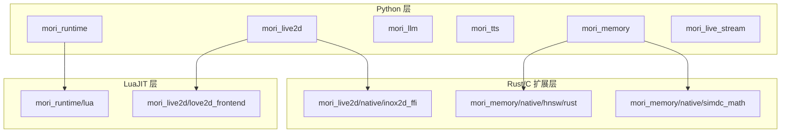
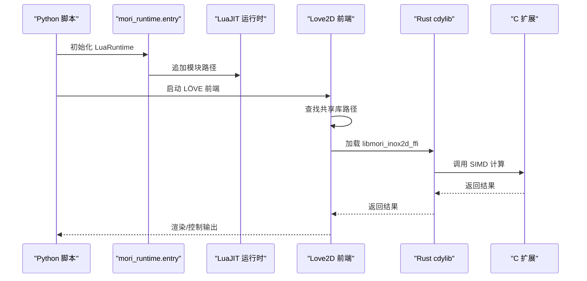
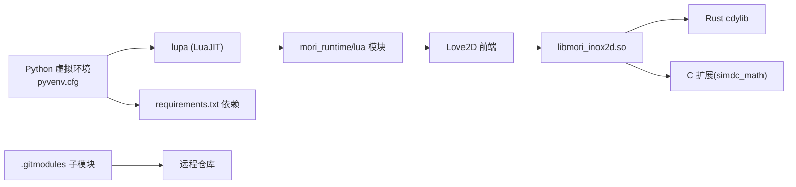
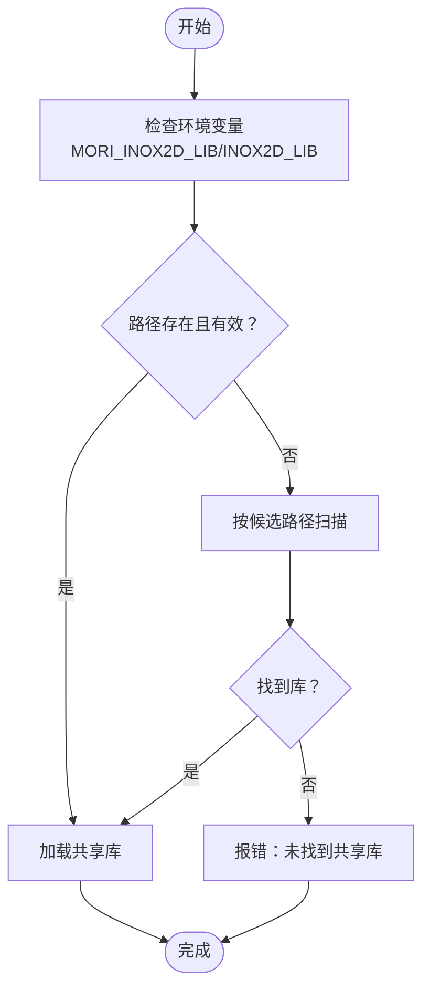
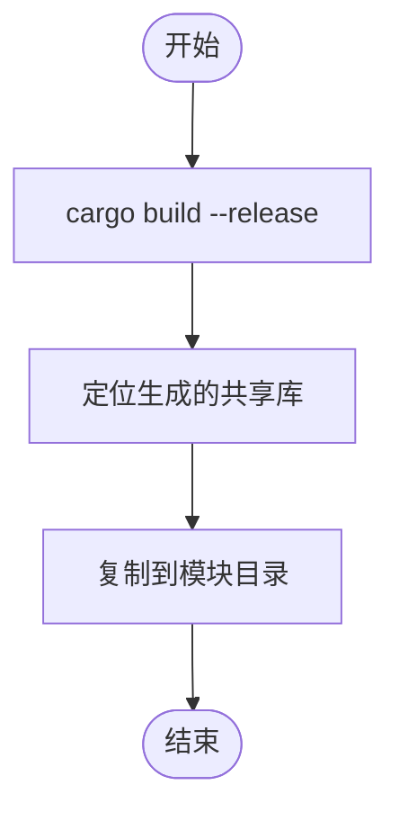

# 开发环境搭建

<cite>
**本文引用的文件**
- [.gitmodules](file://.gitmodules)
- [mori_live2d/native/inox2d_ffi/Cargo.toml](file://mori_live2d/native/inox2d_ffi/Cargo.toml)
- [mori_memory/native/hnsw/rust/Cargo.toml](file://mori_memory/native/hnsw/rust/Cargo.toml)
- [mori_memory/scripts/build_native_modules.sh](file://mori_memory/scripts/build_native_modules.sh)
- [mori_memory/scripts/build_hnsw_module.sh](file://mori_memory/scripts/build_hnsw_module.sh)
- [mori_memory/scripts/build_simdc_math.sh](file://mori_memory/scripts/build_simdc_math.sh)
- [mori_memory/native/simdc_math/simd_math.c](file://mori_memory/native/simdc_math/simd_math.c)
- [mori_live2d/inochi_session.py](file://mori_live2d/inochi_session.py)
- [mori_live2d/love2d_frontend/inox2d.lua](file://mori_live2d/love2d_frontend/inox2d.lua)
- [mori_live2d/inox2d_runtime.py](file://mori_live2d/inox2d_runtime.py)
- [mori_runtime/entry.py](file://mori_runtime/entry.py)
- [mori_tts/scripts/install_lux_tts.sh](file://mori_tts/scripts/install_lux_tts.sh)
- [mori_memory/benchmarks/requirements.txt](file://mori_memory/benchmarks/requirements.txt)
- [venv/pyvenv.cfg](file://venv/pyvenv.cfg)
- [scripts/run_bili_vtuber_love2d.py](file://scripts/run_bili_vtuber_love2d.py)
</cite>

## 目录
1. [简介](#简介)
2. [项目结构](#项目结构)
3. [核心组件](#核心组件)
4. [架构总览](#架构总览)
5. [详细组件分析](#详细组件分析)
6. [依赖关系分析](#依赖关系分析)
7. [性能注意事项](#性能注意事项)
8. [故障排除指南](#故障排除指南)
9. [结论](#结论)
10. [附录](#附录)

## 简介
本指南面向希望在本地搭建 Mori 项目的开发者，覆盖以下方面：
- Python 开发环境：虚拟环境创建、依赖安装、版本要求
- LuaJIT 环境：模块路径设置、C 扩展加载与编译
- Rust 开发环境：工具链安装、FFI 绑定编译
- Git 子模块管理：初始化与更新
- IDE 配置建议：VSCode、PyCharm 等
- 常见环境问题与故障排除

## 项目结构
Mori 采用多语言混合架构，包含 Python、LuaJIT、Rust 以及 C 扩展。关键目录与职责概览：
- Python 模块：mori_runtime、mori_memory、mori_llm、mori_tts、mori_live2d、mori_live_stream
- LuaJIT 运行时：mori_runtime/lua、mori_live2d/love2d_frontend
- Rust 与 C 扩展：mori_live2d/native/inox2d_ffi、mori_memory/native/hnsw/rust、mori_memory/native/simdc_math
- 脚本：mori_memory/scripts、mori_tts/scripts、根脚本等

图表来源
- [mori_runtime/entry.py:414-426](file://mori_runtime/entry.py#L414-L426)
- [mori_live2d/love2d_frontend/inox2d.lua:52-89](file://mori_live2d/love2d_frontend/inox2d.lua#L52-L89)
- [mori_live2d/native/inox2d_ffi/Cargo.toml:1-16](file://mori_live2d/native/inox2d_ffi/Cargo.toml#L1-L16)
- [mori_memory/native/hnsw/rust/Cargo.toml:1-16](file://mori_memory/native/hnsw/rust/Cargo.toml#L1-L16)
- [mori_memory/native/simdc_math/simd_math.c:1-146](file://mori_memory/native/simdc_math/simd_math.c#L1-L146)

章节来源
- [mori_runtime/entry.py:414-426](file://mori_runtime/entry.py#L414-L426)
- [mori_live2d/love2d_frontend/inox2d.lua:52-89](file://mori_live2d/love2d_frontend/inox2d.lua#L52-L89)

## 核心组件
- Python 运行时与模块路径：通过 lupa 初始化 LuaJIT，并向 package.path 追加模块路径
- LuaJIT 模块加载：Love2D 前端按候选路径查找并加载共享库
- Rust FFI：构建 cdylib 并复制到模块目录供 LuaJIT 加载
- C 扩展：SIMD 向量化点积与余弦相似度计算
- 子模块管理：.gitmodules 定义子模块，需初始化与更新

章节来源
- [mori_runtime/entry.py:414-426](file://mori_runtime/entry.py#L414-L426)
- [mori_live2d/love2d_frontend/inox2d.lua:52-89](file://mori_live2d/love2d_frontend/inox2d.lua#L52-L89)
- [mori_live2d/inox2d_runtime.py:32-62](file://mori_live2d/inox2d_runtime.py#L32-L62)
- [mori_memory/native/simdc_math/simd_math.c:17-62](file://mori_memory/native/simdc_math/simd_math.c#L17-L62)

## 架构总览
下图展示从 Python 到 LuaJIT、再到 Rust/C 扩展的调用链路。

图表来源
- [mori_runtime/entry.py:414-426](file://mori_runtime/entry.py#L414-L426)
- [mori_live2d/love2d_frontend/inox2d.lua:52-89](file://mori_live2d/love2d_frontend/inox2d.lua#L52-L89)
- [mori_live2d/inox2d_runtime.py:32-62](file://mori_live2d/inox2d_runtime.py#L32-L62)
- [mori_memory/native/simdc_math/simd_math.c:17-62](file://mori_memory/native/simdc_math/simd_math.c#L17-L62)

## 详细组件分析

### Python 开发环境配置
- 版本要求：虚拟环境使用 Python 3.13.12（由 pyvenv.cfg 指定）
- 创建虚拟环境：使用标准 venv 创建隔离环境
- 依赖安装：
  - 使用 requirements.txt 安装基准依赖
  - TTS 子模块提供一键安装脚本，可自动安装 LuxTTS 及其依赖
- 项目内依赖：部分脚本会在运行前检查 lupa 是否存在，缺失时提示安装

章节来源
- [venv/pyvenv.cfg:1-6](file://venv/pyvenv.cfg#L1-L6)
- [mori_memory/benchmarks/requirements.txt:1-3](file://mori_memory/benchmarks/requirements.txt#L1-L3)
- [mori_tts/scripts/install_lux_tts.sh:1-15](file://mori_tts/scripts/install_lux_tts.sh#L1-L15)
- [mori_runtime/entry.py:414-426](file://mori_runtime/entry.py#L414-L426)
- [scripts/run_bili_vtuber_love2d.py:184-221](file://scripts/run_bili_vtuber_love2d.py#L184-L221)

### LuaJIT 环境配置
- 模块路径设置：通过 lupa 的 LuaRuntime 对象追加 package.path，指向 mori_runtime/lua
- 共享库加载策略：
  - 支持通过环境变量 MORI_INOX2D_LIB 或 INOX2D_LIB 指定绝对路径
  - 若未指定，按工作目录与源码基目录的多个候选路径尝试定位
- Love2D 前端：在启动时自动查找并加载 libmori_inox2d.so

章节来源
- [mori_runtime/entry.py:414-426](file://mori_runtime/entry.py#L414-L426)
- [mori_live2d/love2d_frontend/inox2d.lua:52-89](file://mori_live2d/love2d_frontend/inox2d.lua#L52-L89)

### Rust 开发环境配置
- 工具链安装：Rust 工具链通过 cargo 提供，需确保已安装
- FFI 绑定编译：
  - inox2d_ffi：构建 cdylib，产物复制到模块目录供 LuaJIT 加载
  - HNSW：构建 cdylib，产物复制到模块目录
- 编译脚本：提供统一构建入口，先编译 C 扩展，再编译 Rust 模块

章节来源
- [mori_live2d/inox2d_runtime.py:25-62](file://mori_live2d/inox2d_runtime.py#L25-L62)
- [mori_live2d/native/inox2d_ffi/Cargo.toml:1-16](file://mori_live2d/native/inox2d_ffi/Cargo.toml#L1-L16)
- [mori_memory/native/hnsw/rust/Cargo.toml:1-16](file://mori_memory/native/hnsw/rust/Cargo.toml#L1-L16)
- [mori_memory/scripts/build_native_modules.sh:1-9](file://mori_memory/scripts/build_native_modules.sh#L1-L9)
- [mori_memory/scripts/build_hnsw_module.sh:1-16](file://mori_memory/scripts/build_hnsw_module.sh#L1-L16)

### C 扩展编译
- SIMD 数学函数：使用 AVX/FMA 指令集优化点积与余弦相似度
- 编译选项：GCC 编译，启用 -O3、-mavx2、-mfma、-shared、-fPIC
- 产物输出：生成 simdc_math.so 并放置于模块目录

章节来源
- [mori_memory/native/simdc_math/simd_math.c:1-146](file://mori_memory/native/simdc_math/simd_math.c#L1-L146)
- [mori_memory/scripts/build_simdc_math.sh:1-15](file://mori_memory/scripts/build_simdc_math.sh#L1-L15)

### Git 子模块管理
- 子模块定义：.gitmodules 中列出 mori_memory、mori_llm、mori_tts、mori_live2d、mori_live_stream
- 初始化与更新：首次克隆后需执行子模块初始化与更新，确保第三方依赖完整

章节来源
- [.gitmodules:1-16](file://.gitmodules#L1-L16)

### IDE 配置建议
- VSCode
  - Python：选择已创建的 venv 作为解释器；推荐安装 Python 扩展
  - Lua：安装 Lua 扩展；在工作区设置中配置 Lua 模块路径
  - Rust：安装 Rust 扩展；确保 Cargo 工具链可用
- PyCharm
  - 项目解释器选择 venv；启用项目特定的虚拟环境
  - 配置 Lua/Markdown 插件以支持 LuaJIT 与文档编辑
  - Rust 工程可作为独立模块导入或在项目中单独打开

（本节为通用实践建议，不直接分析具体文件）

## 依赖关系分析

图表来源
- [venv/pyvenv.cfg:1-6](file://venv/pyvenv.cfg#L1-L6)
- [mori_runtime/entry.py:414-426](file://mori_runtime/entry.py#L414-L426)
- [mori_live2d/love2d_frontend/inox2d.lua:52-89](file://mori_live2d/love2d_frontend/inox2d.lua#L52-L89)
- [mori_live2d/inox2d_runtime.py:32-62](file://mori_live2d/inox2d_runtime.py#L32-L62)
- [mori_memory/native/simdc_math/simd_math.c:1-146](file://mori_memory/native/simdc_math/simd_math.c#L1-L146)
- [.gitmodules:1-16](file://.gitmodules#L1-L16)

章节来源
- [mori_runtime/entry.py:414-426](file://mori_runtime/entry.py#L414-L426)
- [mori_live2d/love2d_frontend/inox2d.lua:52-89](file://mori_live2d/love2d_frontend/inox2d.lua#L52-L89)
- [mori_live2d/inox2d_runtime.py:32-62](file://mori_live2d/inox2d_runtime.py#L32-L62)
- [mori_memory/native/simdc_math/simd_math.c:1-146](file://mori_memory/native/simdc_math/simd_math.c#L1-L146)
- [.gitmodules:1-16](file://.gitmodules#L1-L16)

## 性能注意事项
- Rust 与 C 扩展默认启用 Release 构建与优化（如 LTO、O3），确保在生产或评测场景下使用 release 二进制
- LuaJIT 通过 lupa 注入模块路径，避免重复加载与路径冲突
- Love2D 前端优先使用环境变量指定共享库路径，减少磁盘扫描开销

（本节为通用指导，不直接分析具体文件）

## 故障排除指南
- 缺少 lupa 导致 LuaJIT 初始化失败
  - 现象：提示缺少 lupa
  - 处理：激活 venv 后安装依赖
  - 参考
    - [mori_runtime/entry.py:414-426](file://mori_runtime/entry.py#L414-L426)
- LuaJIT 无法找到共享库
  - 现象：提示找不到 libmori_inox2d.so
  - 处理：通过环境变量指定绝对路径，或在项目根目录执行构建命令
  - 参考
    - [mori_live2d/love2d_frontend/inox2d.lua:52-89](file://mori_live2d/love2d_frontend/inox2d.lua#L52-L89)
    - [mori_live2d/inochi_session.py:84-101](file://mori_live2d/inochi_session.py#L84-L101)
- Rust 工具链缺失
  - 现象：提示找不到 cargo
  - 处理：安装 Rust 工具链后再进行构建
  - 参考
    - [mori_live2d/inox2d_runtime.py:25-30](file://mori_live2d/inox2d_runtime.py#L25-L30)
- 子模块未初始化
  - 现象：相关模块目录为空或内容不完整
  - 处理：执行子模块初始化与更新
  - 参考
    - [.gitmodules:1-16](file://.gitmodules#L1-L16)
- TTS 依赖安装失败
  - 现象：安装 LuxTTS 或相关包时报错
  - 处理：使用提供的安装脚本，确保网络与权限正常
  - 参考
    - [mori_tts/scripts/install_lux_tts.sh:1-15](file://mori_tts/scripts/install_lux_tts.sh#L1-L15)

章节来源
- [mori_runtime/entry.py:414-426](file://mori_runtime/entry.py#L414-L426)
- [mori_live2d/love2d_frontend/inox2d.lua:52-89](file://mori_live2d/love2d_frontend/inox2d.lua#L52-L89)
- [mori_live2d/inochi_session.py:84-101](file://mori_live2d/inochi_session.py#L84-L101)
- [mori_live2d/inox2d_runtime.py:25-30](file://mori_live2d/inox2d_runtime.py#L25-L30)
- [.gitmodules:1-16](file://.gitmodules#L1-L16)
- [mori_tts/scripts/install_lux_tts.sh:1-15](file://mori_tts/scripts/install_lux_tts.sh#L1-L15)

## 结论
通过本指南，您可以在本地完成 Mori 项目的 Python、LuaJIT、Rust 与 C 扩展的环境搭建与调试。建议：
- 使用 venv 与明确的 Python 版本
- 通过脚本统一构建 Rust 与 C 扩展
- 正确设置 LuaJIT 模块路径与共享库加载路径
- 初始化并更新 Git 子模块以获得完整依赖

（本节为总结性内容，不直接分析具体文件）

## 附录

### A. Python 环境快速清单
- 创建虚拟环境：使用 venv
- 激活虚拟环境：根据平台选择相应命令
- 安装依赖：参考 requirements.txt 与 TTS 安装脚本
- 运行测试：使用项目提供的脚本进行端到端验证

章节来源
- [venv/pyvenv.cfg:1-6](file://venv/pyvenv.cfg#L1-L6)
- [mori_memory/benchmarks/requirements.txt:1-3](file://mori_memory/benchmarks/requirements.txt#L1-L3)
- [mori_tts/scripts/install_lux_tts.sh:1-15](file://mori_tts/scripts/install_lux_tts.sh#L1-L15)

### B. LuaJIT 模块路径与库加载流程

图表来源
- [mori_live2d/love2d_frontend/inox2d.lua:52-89](file://mori_live2d/love2d_frontend/inox2d.lua#L52-L89)

### C. Rust 构建与复制流程

图表来源
- [mori_live2d/inox2d_runtime.py:32-62](file://mori_live2d/inox2d_runtime.py#L32-L62)
- [mori_memory/scripts/build_hnsw_module.sh:1-16](file://mori_memory/scripts/build_hnsw_module.sh#L1-L16)