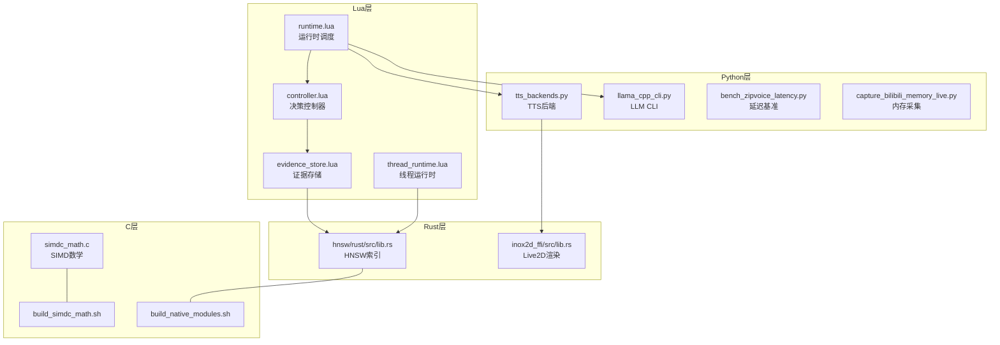
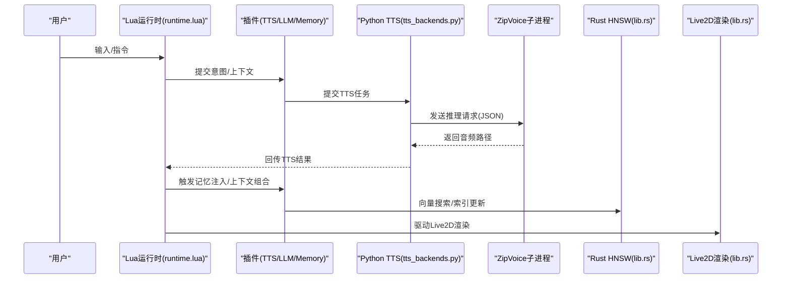
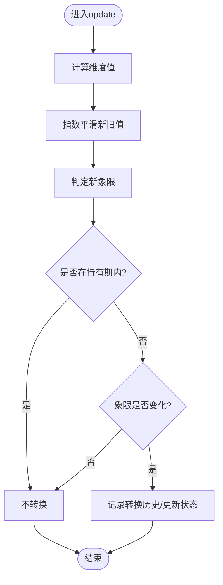
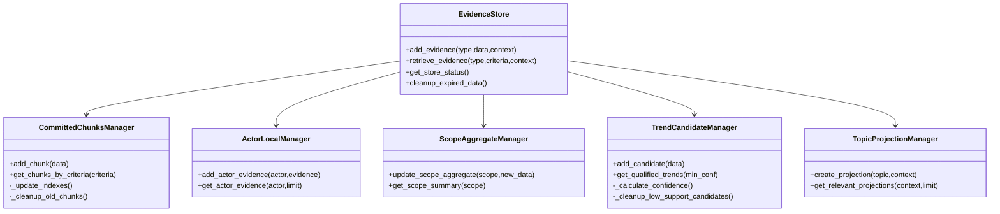
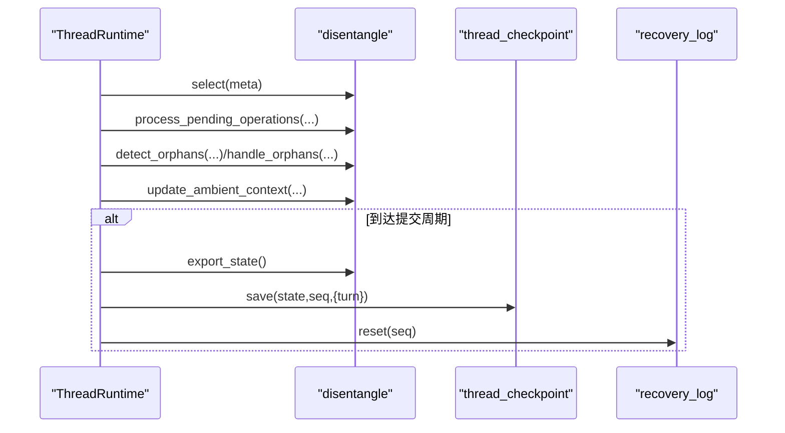
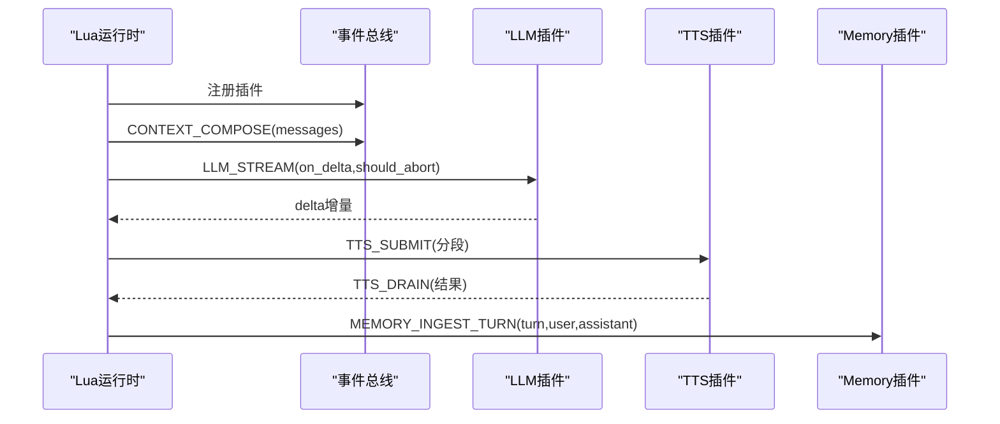
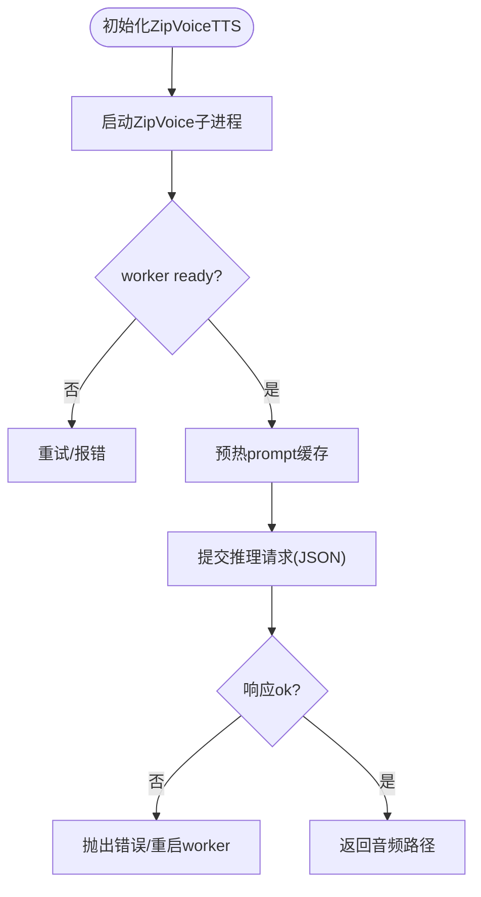
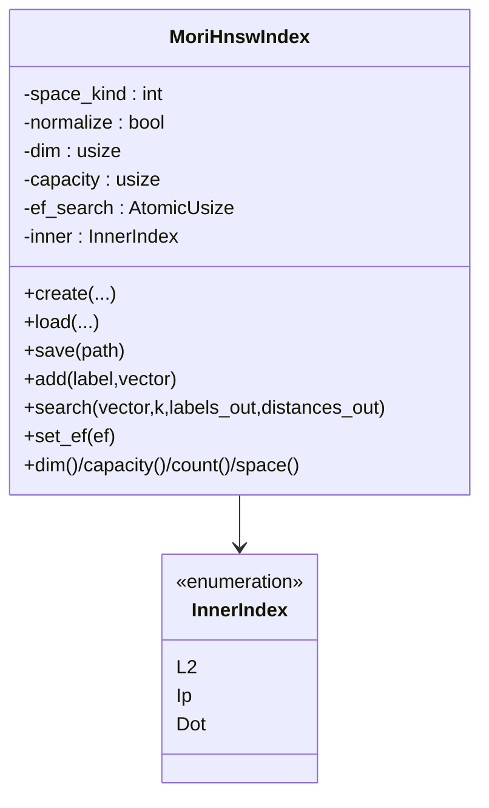
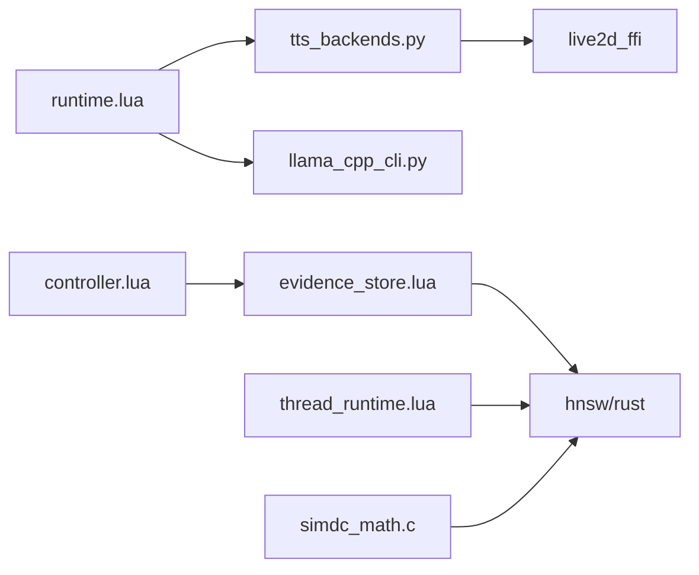

# 性能优化

<cite>
**本文引用的文件**
- [simd_math.c](file://mori_memory/native/simdc_math/simd_math.c)
- [lib.rs（hnsw）](file://mori_memory/native/hnsw/rust/src/lib.rs)
- [lib.rs（live2d）](file://mori_live2d/native/inox2d_ffi/src/lib.rs)
- [llama_cpp_cli.py](file://mori_llm/llama_cpp_cli.py)
- [tts_backends.py](file://mori_runtime/tts_backends.py)
- [runtime.lua](file://mori_runtime/lua/mori/app/runtime.lua)
- [controller.lua](file://mori_memory/module/decision/controller.lua)
- [evidence_store.lua](file://mori_memory/module/evidence/evidence_store.lua)
- [thread_runtime.lua](file://mori_memory/module/runtime/thread_runtime.lua)
- [build_simdc_math.sh](file://mori_memory/scripts/build_simdc_math.sh)
- [build_native_modules.sh](file://mori_memory/scripts/build_native_modules.sh)
- [bench_zipvoice_latency.py](file://scripts/bench_zipvoice_latency.py)
- [capture_bilibili_memory_live.py](file://scripts/capture_bilibili_memory_live.py)
- [run_bili_vtuber_inochi.py](file://scripts/run_bili_vtuber_inochi.py)
- [run_bili_vtuber_love2d.py](file://scripts/run_bili_vtuber_love2d.py)
</cite>

## 目录
1. [简介](#简介)
2. [项目结构](#项目结构)
3. [核心组件](#核心组件)
4. [架构总览](#架构总览)
5. [详细组件分析](#详细组件分析)
6. [依赖分析](#依赖分析)
7. [性能考虑](#性能考虑)
8. [故障排查指南](#故障排查指南)
9. [结论](#结论)
10. [附录](#附录)

## 简介
本指南面向Mori项目的性能优化实践，聚焦以下目标：
- 内存优化：LuaJIT内存管理、Python对象池与进程复用、内存泄漏检测路径
- 计算性能：SIMD数学运算、Rust原生模块、并行处理策略
- I/O性能：文件读写、网络请求、缓存策略
- 性能分析工具：Python性能分析器、Lua性能监控、内存分析工具
- 瓶颈识别：性能剖析、热点分析、资源消耗统计
- 基准测试与回归：构建可重复的性能基线与回归测试

本指南以仓库现有实现为依据，结合脚本与模块，给出可落地的优化建议与最佳实践。

## 项目结构
Mori采用多语言混合架构：
- Lua层：运行时调度、插件桥接、事件总线
- Python层：TTS推理、LLM CLI、脚本与基准
- Rust层：高性能索引、图形渲染、底层FFI
- C层：SIMD数学内核、动态库构建

图示来源
- [runtime.lua:543-665](file://mori_runtime/lua/mori/app/runtime.lua#L543-L665)
- [tts_backends.py:525-800](file://mori_runtime/tts_backends.py#L525-L800)
- [llama_cpp_cli.py:90-248](file://mori_llm/llama_cpp_cli.py#L90-L248)
- [controller.lua:27-194](file://mori_memory/module/decision/controller.lua#L27-L194)
- [evidence_store.lua:490-603](file://mori_memory/module/evidence/evidence_store.lua#L490-L603)
- [thread_runtime.lua:1-260](file://mori_memory/module/runtime/thread_runtime.lua#L1-L260)
- [lib.rs（hnsw）:1-592](file://mori_memory/native/hnsw/rust/src/lib.rs#L1-L592)
- [lib.rs（live2d）:1-375](file://mori_live2d/native/inox2d_ffi/src/lib.rs#L1-L375)
- [simd_math.c:1-146](file://mori_memory/native/simdc_math/simd_math.c#L1-L146)
- [build_simdc_math.sh:1-15](file://mori_memory/scripts/build_simdc_math.sh#L1-L15)
- [build_native_modules.sh:1-9](file://mori_memory/scripts/build_native_modules.sh#L1-L9)

章节来源
- [runtime.lua:543-665](file://mori_runtime/lua/mori/app/runtime.lua#L543-L665)
- [tts_backends.py:525-800](file://mori_runtime/tts_backends.py#L525-L800)
- [llama_cpp_cli.py:90-248](file://mori_llm/llama_cpp_cli.py#L90-L248)
- [controller.lua:27-194](file://mori_memory/module/decision/controller.lua#L27-L194)
- [evidence_store.lua:490-603](file://mori_memory/module/evidence/evidence_store.lua#L490-L603)
- [thread_runtime.lua:1-260](file://mori_memory/module/runtime/thread_runtime.lua#L1-L260)
- [lib.rs（hnsw）:1-592](file://mori_memory/native/hnsw/rust/src/lib.rs#L1-L592)
- [lib.rs（live2d）:1-375](file://mori_live2d/native/inox2d_ffi/src/lib.rs#L1-L375)
- [simd_math.c:1-146](file://mori_memory/native/simdc_math/simd_math.c#L1-L146)
- [build_simdc_math.sh:1-15](file://mori_memory/scripts/build_simdc_math.sh#L1-L15)
- [build_native_modules.sh:1-9](file://mori_memory/scripts/build_native_modules.sh#L1-L9)

## 核心组件
- Lua运行时与插件系统：负责事件驱动、意图处理、TTS提交与结果回流、内存注入等
- Python TTS后端：ZipVoice与LUX TTS，通过子进程隔离与对象池化减少冷启动
- Rust原生模块：HNSW近似最近邻索引、Live2D渲染FFI
- C SIMD内核：向量点积与余弦相似度的AVX2+FMA加速
- 决策与证据存储：象限控制器、证据块、趋势候选、主题投影
- 线程运行时：路由边界、孤儿检测、WAL、检查点

章节来源
- [runtime.lua:543-665](file://mori_runtime/lua/mori/app/runtime.lua#L543-L665)
- [tts_backends.py:525-800](file://mori_runtime/tts_backends.py#L525-L800)
- [lib.rs（hnsw）:1-592](file://mori_memory/native/hnsw/rust/src/lib.rs#L1-L592)
- [lib.rs（live2d）:1-375](file://mori_live2d/native/inox2d_ffi/src/lib.rs#L1-L375)
- [simd_math.c:1-146](file://mori_memory/native/simdc_math/simd_math.c#L1-L146)
- [controller.lua:27-194](file://mori_memory/module/decision/controller.lua#L27-L194)
- [evidence_store.lua:490-603](file://mori_memory/module/evidence/evidence_store.lua#L490-L603)
- [thread_runtime.lua:1-260](file://mori_memory/module/runtime/thread_runtime.lua#L1-L260)

## 架构总览

图示来源
- [runtime.lua:303-541](file://mori_runtime/lua/mori/app/runtime.lua#L303-L541)
- [tts_backends.py:668-800](file://mori_runtime/tts_backends.py#L668-L800)
- [lib.rs（hnsw）:496-554](file://mori_memory/native/hnsw/rust/src/lib.rs#L496-L554)
- [lib.rs（live2d）:199-290](file://mori_live2d/native/inox2d_ffi/src/lib.rs#L199-L290)

## 详细组件分析

### 决策控制器（象限切换与表面参数）
- 平滑因子与象限判定：对人口压力与交互拓扑进行指数平滑，按阈值映射象限
- 表面参数插值：基于当前象限插值生成信任度、写入保守度、读取局部性等
- 转换节流：设置“持有轮数”，避免频繁切换

图示来源
- [controller.lua:44-116](file://mori_memory/module/decision/controller.lua#L44-L116)

章节来源
- [controller.lua:27-194](file://mori_memory/module/decision/controller.lua#L27-L194)

### 证据存储（证据块/演员证据/聚合/趋势/主题投影）
- 已提交块：按时间/演员/范围索引，支持条件检索与排序
- 演员本地证据：限制每演员上限，保留最新证据
- 范围聚合：窗口化统计演员活动、主题分布、交互次数
- 趋势候选：支持计数、置信度（时间衰减×支持度×演员多样性），定期清理
- 主题投影：基于上下文与TTL计算相关性，缓存热点主题

图示来源
- [evidence_store.lua:490-603](file://mori_memory/module/evidence/evidence_store.lua#L490-L603)
- [evidence_store.lua:26-175](file://mori_memory/module/evidence/evidence_store.lua#L26-L175)
- [evidence_store.lua:177-226](file://mori_memory/module/evidence/evidence_store.lua#L177-L226)
- [evidence_store.lua:228-284](file://mori_memory/module/evidence/evidence_store.lua#L228-L284)
- [evidence_store.lua:285-411](file://mori_memory/module/evidence/evidence_store.lua#L285-L411)
- [evidence_store.lua:413-488](file://mori_memory/module/evidence/evidence_store.lua#L413-L488)

章节来源
- [evidence_store.lua:490-603](file://mori_memory/module/evidence/evidence_store.lua#L490-L603)

### 线程运行时（路由/孤儿/环境/检查点/WAL）
- 路由选择：委托给disentangle模块，并记录活跃作用域
- Pending管理：统一处理待定操作
- Orphan检测与处理：检测并回收孤立状态
- Ambient维护：更新环境上下文
- Commit时机：按配置周期触发，导出状态、保存检查点、重置WAL
- WAL：预写日志记录scope_state，支持重启恢复

图示来源
- [thread_runtime.lua:23-152](file://mori_memory/module/runtime/thread_runtime.lua#L23-L152)
- [thread_runtime.lua:173-201](file://mori_memory/module/runtime/thread_runtime.lua#L173-L201)

章节来源
- [thread_runtime.lua:1-260](file://mori_memory/module/runtime/thread_runtime.lua#L1-L260)

### Lua运行时（事件驱动、TTS流水线、LLM流式）
- 事件总线：注册插件、监听BUS_ERROR
- 消息队列：drain_inbox/pick_next/should_interrupt
- TTS流水线：分段、提交、回放、输出事件
- LLM流式：按增量回调拼接可见文本、分段提交TTS
- 记忆注入：turn结束时调用MEMORY_INGEST_TURN

图示来源
- [runtime.lua:303-541](file://mori_runtime/lua/mori/app/runtime.lua#L303-L541)

章节来源
- [runtime.lua:543-665](file://mori_runtime/lua/mori/app/runtime.lua#L543-L665)

### Python TTS后端（ZipVoice子进程池）
- 子进程隔离：独立Python解释器，stdin/stdout JSON协议
- 对象池：固定num_thread，避免频繁fork
- 预热：启动时读取模型配置，建立采样率
- 错误处理：worker异常自动重启，超时终止

图示来源
- [tts_backends.py:668-800](file://mori_runtime/tts_backends.py#L668-L800)

章节来源
- [tts_backends.py:525-800](file://mori_runtime/tts_backends.py#L525-L800)

### LLM CLI（llama.cpp）
- 可执行解析：优先显式路径、环境变量、默认路径、which
- 输出解析：提取第一个JSON对象，解析embedding/文本
- 参数传递：上下文长度、预测步数、温度、池化等

章节来源
- [llama_cpp_cli.py:26-248](file://mori_llm/llama_cpp_cli.py#L26-L248)

### Rust HNSW索引
- 支持空间：L2、内积、余弦（余弦需向量归一化）
- 线程安全：Mutex包裹具体索引类型
- 接口：创建/加载/保存/添加/搜索/设置ef/容量/维度/计数
- 错误处理：panic捕获、错误字符串写入last_error

图示来源
- [lib.rs（hnsw）:23-61](file://mori_memory/native/hnsw/rust/src/lib.rs#L23-L61)
- [lib.rs（hnsw）:242-554](file://mori_memory/native/hnsw/rust/src/lib.rs#L242-L554)

章节来源
- [lib.rs（hnsw）:1-592](file://mori_memory/native/hnsw/rust/src/lib.rs#L1-L592)

### Live2D渲染FFI
- OpenGL上下文：libGL加载、glXGetProcAddressARB探测
- 模型加载：.inp/.inx解析，初始化变换/渲染/参数/物理
- 渲染循环：begin_frame/end_frame/draw，参数设置

章节来源
- [lib.rs（live2d）:1-375](file://mori_live2d/native/inox2d_ffi/src/lib.rs#L1-L375)

### SIMD数学内核
- AVX2+FMA：256位向量点积与余弦相似度
- 分支：小向量走标量，大向量批量AVX累加
- 预取：对齐访问，提升缓存命中
- 归约：256位向量水平相加

章节来源
- [simd_math.c:17-146](file://mori_memory/native/simdc_math/simd_math.c#L17-L146)
- [build_simdc_math.sh:10-12](file://mori_memory/scripts/build_simdc_math.sh#L10-L12)

## 依赖分析
- Lua运行时依赖Python TTS与LLM插件，插件通过事件总线通信
- 决策与证据存储模块为内存子系统提供状态与检索能力
- Rust HNSW作为证据检索的加速层
- Live2D渲染FFI与TTS后端共同构成前端表现层
- C SIMD内核通过动态库提供数学加速

图示来源
- [runtime.lua:543-665](file://mori_runtime/lua/mori/app/runtime.lua#L543-L665)
- [tts_backends.py:525-800](file://mori_runtime/tts_backends.py#L525-L800)
- [controller.lua:27-194](file://mori_memory/module/decision/controller.lua#L27-L194)
- [evidence_store.lua:490-603](file://mori_memory/module/evidence/evidence_store.lua#L490-L603)
- [thread_runtime.lua:1-260](file://mori_memory/module/runtime/thread_runtime.lua#L1-L260)
- [lib.rs（hnsw）:1-592](file://mori_memory/native/hnsw/rust/src/lib.rs#L1-L592)
- [lib.rs（live2d）:1-375](file://mori_live2d/native/inox2d_ffi/src/lib.rs#L1-L375)
- [simd_math.c:1-146](file://mori_memory/native/simdc_math/simd_math.c#L1-L146)

## 性能考虑

### 内存优化
- LuaJIT内存管理
  - 使用事件驱动与表结构，避免频繁分配
  - 在Lua侧尽量复用临时表，减少垃圾回收压力
  - 通过线程运行时状态字段记录活跃作用域与序列号，降低全局扫描成本
- Python对象池与进程复用
  - ZipVoice后端固定num_thread，避免频繁fork
  - 子进程生命周期管理：失败自动重启、超时终止
  - 预热prompt缓存，减少首次推理开销
- 内存泄漏检测
  - Lua侧：线程运行时暴露内存使用MB字段，便于监控
  - Rust侧：Mutex包裹索引，panic捕获与last_error记录，避免未定义行为
  - Python侧：子进程stdout逐行读取，确保消息边界清晰，防止缓冲累积

章节来源
- [thread_runtime.lua:204-213](file://mori_memory/module/runtime/thread_runtime.lua#L204-L213)
- [lib.rs（hnsw）:108-114](file://mori_memory/native/hnsw/rust/src/lib.rs#L108-L114)
- [tts_backends.py:668-754](file://mori_runtime/tts_backends.py#L668-L754)

### 计算性能优化
- SIMD数学运算
  - AVX2+FMA向量化点积与余弦相似度，批处理32元素
  - 小向量分支走标量，兼顾通用性
  - 预取提升缓存命中
- Rust原生模块
  - HNSW索引：支持L2/内积/余弦，ef_search原子控制
  - Live2D渲染：OpenGL上下文加载与渲染管线
- 并行处理策略
  - Python子进程池：num_thread控制并发
  - Lua事件驱动：异步TTS回放与LLM流式增量

章节来源
- [simd_math.c:17-146](file://mori_memory/native/simdc_math/simd_math.c#L17-L146)
- [lib.rs（hnsw）:496-554](file://mori_memory/native/hnsw/rust/src/lib.rs#L496-L554)
- [lib.rs（live2d）:116-123](file://mori_live2d/native/inox2d_ffi/src/lib.rs#L116-L123)
- [tts_backends.py:584-611](file://mori_runtime/tts_backends.py#L584-L611)

### I/O性能优化
- 文件读写
  - ZipVoice模型配置与权重文件存在性校验，避免IO异常
  - Lua证据存储索引按时间/演员/范围维护，减少全表扫描
- 网络请求
  - LLM CLI通过本地可执行与标准IO交互，避免HTTP开销
- 缓存策略
  - ZipVoice prompt缓存与质量档位（实时/均衡/高质量）
  - 主题投影TTL控制，热点缓存与定期清理

章节来源
- [tts_backends.py:619-647](file://mori_runtime/tts_backends.py#L619-L647)
- [evidence_store.lua:413-488](file://mori_memory/module/evidence/evidence_store.lua#L413-L488)

### 性能分析工具使用指南
- Python性能分析器
  - 使用cProfile/line_profiler定位函数耗时与热点
  - 结合ZipVoice延迟脚本测量端到端延迟
- Lua性能监控
  - 在Lua运行时打印关键事件耗时（如TTS延迟）
  - 使用collectgarbage统计内存占用
- 内存分析工具
  - Lua侧：线程运行时状态包含内存使用MB
  - Rust侧：cargo-bisect-openssl等工具辅助排查
  - Python侧：memory_profiler观察子进程内存曲线

章节来源
- [runtime.lua:262-276](file://mori_runtime/lua/mori/app/runtime.lua#L262-L276)
- [thread_runtime.lua:204-213](file://mori_memory/module/runtime/thread_runtime.lua#L204-L213)
- [bench_zipvoice_latency.py:1-200](file://scripts/bench_zipvoice_latency.py#L1-L200)

### 瓶颈识别方法
- 性能剖析
  - Python：cProfile/Py-Spy采样，定位TTS与LLM耗时
  - Lua：事件总线输出关键指标（turn/tts_latency_ms）
- 热点分析
  - ZipVoice推理：num_steps/guidance_scale/t_shift影响时延
  - HNSW搜索：ef_search与维度/容量
- 资源消耗统计
  - 线程运行时uptime_seconds、active_scopes_count
  - Lua证据存储状态：chunks/actors/scopes/trends/projections

章节来源
- [runtime.lua:222-280](file://mori_runtime/lua/mori/app/runtime.lua#L222-L280)
- [thread_runtime.lua:204-213](file://mori_memory/module/runtime/thread_runtime.lua#L204-L213)
- [evidence_store.lua:566-576](file://mori_memory/module/evidence/evidence_store.lua#L566-L576)

### 基准测试与回归测试
- 延迟基准
  - ZipVoice延迟脚本：测量不同质量档位与参数下的端到端延迟
- 内存采集
  - 直播采集脚本：记录内存trace与运行事件，辅助定位泄漏与抖动
- 回归测试
  - 将关键场景（TTS/LLM/HNSW）封装为可重复脚本
  - 设定阈值与断言，CI中定期执行

章节来源
- [bench_zipvoice_latency.py:1-200](file://scripts/bench_zipvoice_latency.py#L1-L200)
- [capture_bilibili_memory_live.py:1-200](file://scripts/capture_bilibili_memory_live.py#L1-L200)

## 故障排查指南
- Lua运行时
  - BUS_ERROR事件输出，定位具体事件与处理器
  - TTS_DRAIN阻塞或超时：检查子进程健康与stdout读取
- Python TTS后端
  - worker未就绪：检查Python二进制、仓库路径、模型目录
  - 推理失败：查看error字段与stderr
- Rust HNSW
  - panic捕获与last_error记录，确认参数合法性（维度/容量/m/ef）
  - 加载索引维度不匹配：检查dump与调用方维度
- Live2D渲染
  - OpenGL加载失败：确认libGL与glXGetProcAddress可用
  - 参数设置失败：检查param_ctx初始化

章节来源
- [runtime.lua:551-554](file://mori_runtime/lua/mori/app/runtime.lua#L551-L554)
- [tts_backends.py:655-700](file://mori_runtime/tts_backends.py#L655-L700)
- [lib.rs（hnsw）:108-123](file://mori_memory/native/hnsw/rust/src/lib.rs#L108-L123)
- [lib.rs（hnsw）:291-374](file://mori_memory/native/hnsw/rust/src/lib.rs#L291-L374)
- [lib.rs（live2d）:48-82](file://mori_live2d/native/inox2d_ffi/src/lib.rs#L48-L82)

## 结论
Mori在多语言混合架构下实现了清晰的性能分层：Lua事件驱动、Python子进程隔离、Rust原生加速、C SIMD内核。通过对象池、预热、索引与缓存策略，可在低延迟与高吞吐之间取得平衡。建议持续完善基准与回归测试，结合剖析与资源统计，形成闭环的性能治理流程。

## 附录
- 动态库构建
  - SIMD数学内核：GCC编译，开启-O3、-mavx2、-mfma、-shared -fPIC
  - 原生模块：统一构建脚本，先构建SIMD，再构建HNSW

章节来源
- [build_simdc_math.sh:10-12](file://mori_memory/scripts/build_simdc_math.sh#L10-L12)
- [build_native_modules.sh:6-8](file://mori_memory/scripts/build_native_modules.sh#L6-L8)