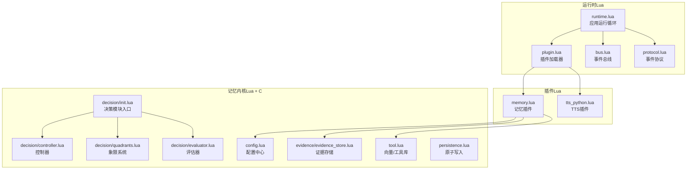
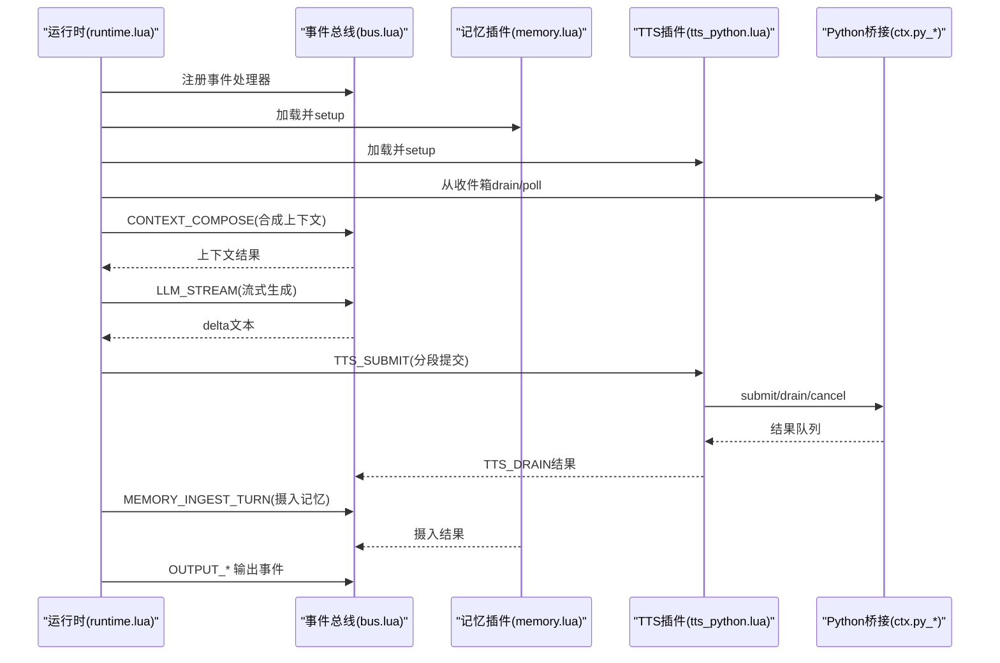
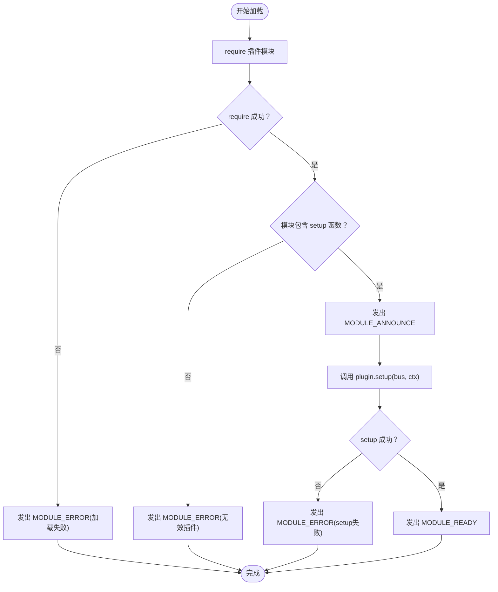
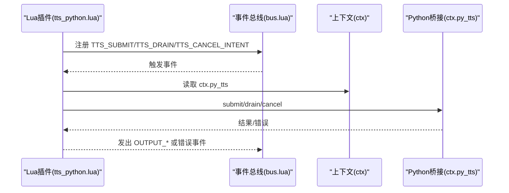
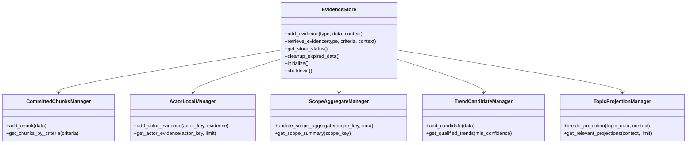
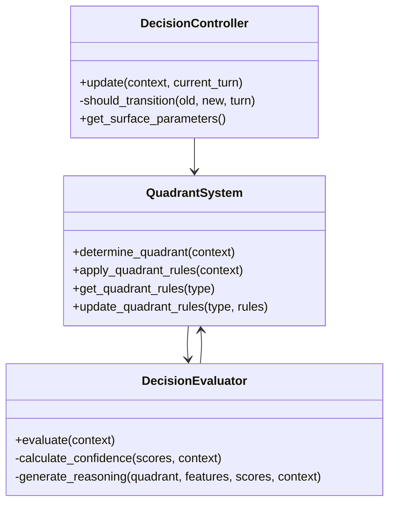
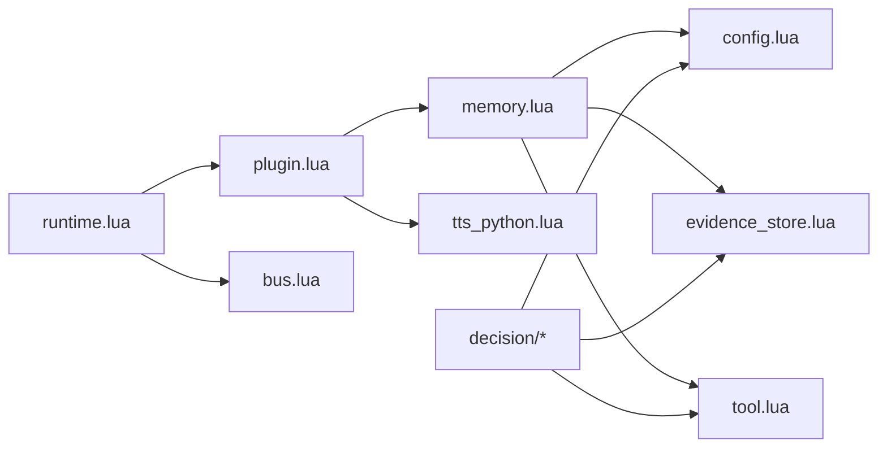

# 扩展开发

<cite>
**本文引用的文件**
- [runtime.lua](file://mori_runtime/lua/mori/app/runtime.lua)
- [plugin.lua](file://mori_runtime/lua/mori/core/plugin.lua)
- [bus.lua](file://mori_runtime/lua/mori/core/bus.lua)
- [protocol.lua](file://mori_runtime/lua/mori/core/protocol.lua)
- [tts_python.lua](file://mori_runtime/lua/mori/plugins/tts_python.lua)
- [memory.lua](file://mori_runtime/lua/mori/plugins/memory.lua)
- [config.lua](file://mori_memory/module/config.lua)
- [init.lua](file://mori_memory/module/decision/init.lua)
- [controller.lua](file://mori_memory/module/decision/controller.lua)
- [quadrants.lua](file://mori_memory/module/decision/quadrants.lua)
- [evaluator.lua](file://mori_memory/module/decision/evaluator.lua)
- [evidence_store.lua](file://mori_memory/module/evidence/evidence_store.lua)
- [persistence.lua](file://mori_memory/module/persistence.lua)
- [tool.lua](file://mori_memory/module/tool.lua)
</cite>

## 目录
1. [简介](#简介)
2. [项目结构](#项目结构)
3. [核心组件](#核心组件)
4. [架构总览](#架构总览)
5. [详细组件分析](#详细组件分析)
6. [依赖关系分析](#依赖关系分析)
7. [性能考量](#性能考量)
8. [故障排查指南](#故障排查指南)
9. [结论](#结论)
10. [附录](#附录)

## 简介
本指南面向希望为Mori项目进行扩展开发的工程师，涵盖以下主题：
- Lua插件系统的开发方法：插件注册机制、生命周期管理、API接口规范
- Python模块扩展的开发流程：新模块集成、配置管理、错误处理
- 新记忆类型的开发方法：数据结构设计、检索算法实现、持久化机制
- 第三方服务集成指南：HTTP API集成、WebSocket连接、数据格式转换
- 自定义决策系统的开发：象限系统扩展、评估器定制、控制器实现
- 扩展开发的最佳实践与安全考虑

## 项目结构
Mori采用“运行时（Lua）+ 记忆内核（Lua + C扩展）+ 插件桥接（Python）”的分层架构：
- 运行时（Lua）：负责事件总线、插件加载、意图调度、输出渲染
- 记忆内核（Lua + C扩展）：提供向量化、相似度计算、证据存储、主题图、持久化等能力
- 插件桥接（Python）：通过上下文桥接Python侧组件（如TTS、LLM后端）

**图表来源**
- [runtime.lua:543-665](file://mori_runtime/lua/mori/app/runtime.lua#L543-L665)
- [plugin.lua:13-48](file://mori_runtime/lua/mori/core/plugin.lua#L13-L48)
- [bus.lua:14-91](file://mori_runtime/lua/mori/core/bus.lua#L14-L91)
- [protocol.lua:3-32](file://mori_runtime/lua/mori/core/protocol.lua#L3-L32)
- [memory.lua:8-26](file://mori_runtime/lua/mori/plugins/memory.lua#L8-L26)
- [tts_python.lua:8-28](file://mori_runtime/lua/mori/plugins/tts_python.lua#L8-L28)
- [config.lua:604-679](file://mori_memory/module/config.lua#L604-L679)
- [init.lua:6-21](file://mori_memory/module/decision/init.lua#L6-L21)
- [controller.lua:44-79](file://mori_memory/module/decision/controller.lua#L44-L79)
- [quadrants.lua:227-245](file://mori_memory/module/decision/quadrants.lua#L227-L245)
- [evaluator.lua:267-308](file://mori_memory/module/decision/evaluator.lua#L267-L308)
- [evidence_store.lua:490-563](file://mori_memory/module/evidence/evidence_store.lua#L490-L563)
- [tool.lua:174-270](file://mori_memory/module/tool.lua#L174-L270)
- [persistence.lua:28-94](file://mori_memory/module/persistence.lua#L28-L94)

**章节来源**
- [runtime.lua:543-665](file://mori_runtime/lua/mori/app/runtime.lua#L543-L665)
- [plugin.lua:13-48](file://mori_runtime/lua/mori/core/plugin.lua#L13-L48)
- [bus.lua:14-91](file://mori_runtime/lua/mori/core/bus.lua#L14-L91)
- [protocol.lua:3-32](file://mori_runtime/lua/mori/core/protocol.lua#L3-L32)

## 核心组件
- 事件总线与协议
  - 事件总线提供订阅/发布模式，支持同步调用与异步事件，具备错误冒泡能力
  - 协议定义了模块生命周期事件（模块声明、就绪、错误）、上下文合成、记忆编译/摄入/关闭、语音任务提交/拉取/取消、输出事件等
- 插件系统
  - 插件需导出id/version，并提供setup回调，由加载器统一注册到事件总线
  - 加载器负责模块声明、就绪通知、错误上报与容错
- 记忆内核
  - 配置中心提供默认/策略/路径解析能力
  - 决策系统包含维度管理、象限系统、评估器、控制器、上下文融合引擎
  - 证据存储提供多粒度证据管理与聚合
  - 工具库提供向量运算、SIMD加速、序列化/反序列化、嵌入获取等
  - 持久化提供原子写入与回滚保障

**章节来源**
- [bus.lua:14-91](file://mori_runtime/lua/mori/core/bus.lua#L14-L91)
- [protocol.lua:3-32](file://mori_runtime/lua/mori/core/protocol.lua#L3-L32)
- [plugin.lua:13-48](file://mori_runtime/lua/mori/core/plugin.lua#L13-L48)
- [config.lua:604-679](file://mori_memory/module/config.lua#L604-L679)
- [init.lua:6-21](file://mori_memory/module/decision/init.lua#L6-L21)
- [evidence_store.lua:490-563](file://mori_memory/module/evidence/evidence_store.lua#L490-L563)
- [tool.lua:174-270](file://mori_memory/module/tool.lua#L174-L270)
- [persistence.lua:28-94](file://mori_memory/module/persistence.lua#L28-L94)

## 架构总览
运行时主循环负责：
- 初始化事件总线与插件
- 从Python侧收件箱拉取待处理意图
- 合成上下文、调用LLM流式生成、切片TTS、写入记忆
- 输出字幕、音频、事件日志

**图表来源**
- [runtime.lua:543-665](file://mori_runtime/lua/mori/app/runtime.lua#L543-L665)
- [bus.lua:50-91](file://mori_runtime/lua/mori/core/bus.lua#L50-L91)
- [memory.lua:12-25](file://mori_runtime/lua/mori/plugins/memory.lua#L12-L25)
- [tts_python.lua:13-27](file://mori_runtime/lua/mori/plugins/tts_python.lua#L13-L27)

## 详细组件分析

### Lua插件系统开发指南
- 插件注册机制
  - 插件模块需导出字段：id、version
  - 插件通过setup回调在事件总线上注册处理器，处理对应事件
  - 加载器按顺序加载插件，发出模块声明/就绪/错误事件
- 生命周期管理
  - 模块声明：加载器在require成功后发出MODULE_ANNOUNCE
  - 模块就绪：setup成功后发出MODULE_READY
  - 错误处理：require失败、setup失败、处理器异常均转化为MODULE_ERROR/BUS_ERROR
- API接口规范
  - 使用事件协议中的标准事件名，避免硬编码
  - 事件payload应为表结构，字段明确且可选
  - 处理器内部使用pcall包装，确保异常不中断总线

**图表来源**
- [plugin.lua:13-48](file://mori_runtime/lua/mori/core/plugin.lua#L13-L48)
- [protocol.lua:6-8](file://mori_runtime/lua/mori/core/protocol.lua#L6-L8)

**章节来源**
- [plugin.lua:13-48](file://mori_runtime/lua/mori/core/plugin.lua#L13-L48)
- [protocol.lua:3-32](file://mori_runtime/lua/mori/core/protocol.lua#L3-L32)

### Python模块扩展开发指南
- 新模块集成
  - 在Lua侧编写插件模块，导出id/version并在setup中注册事件处理器
  - 通过ctx传递Python桥接对象（如ctx.py_tts），在处理器中调用其方法
- 配置管理
  - Lua插件可通过bus.call请求Python侧配置或状态
  - 注意异步/阻塞差异，必要时使用事件驱动
- 错误处理
  - Lua侧使用pcall包装Python调用，捕获异常并映射为事件错误
  - Python侧应返回可序列化的错误信息，便于Lua侧记录

**图表来源**
- [tts_python.lua:8-28](file://mori_runtime/lua/mori/plugins/tts_python.lua#L8-L28)
- [bus.lua:50-91](file://mori_runtime/lua/mori/core/bus.lua#L50-L91)

**章节来源**
- [tts_python.lua:8-28](file://mori_runtime/lua/mori/plugins/tts_python.lua#L8-L28)

### 新记忆类型的开发方法
- 数据结构设计
  - 使用证据存储模块提供的多粒度证据容器：已提交块、演员本地证据、范围聚合、趋势候选、主题投影
  - 证据结构包含时间戳、标识、上下文键、相关性/置信度等字段
- 检索算法实现
  - 通过工具库进行向量化与相似度计算（余弦相似度、点积）
  - 支持SIMD加速与二进制序列化，降低内存与IO开销
- 持久化机制
  - 使用原子写入封装，保证落盘一致性
  - 提供临时文件+重命名+备份回滚的三段式策略

**图表来源**
- [evidence_store.lua:490-603](file://mori_memory/module/evidence/evidence_store.lua#L490-L603)

**章节来源**
- [evidence_store.lua:490-603](file://mori_memory/module/evidence/evidence_store.lua#L490-L603)
- [tool.lua:503-528](file://mori_memory/module/tool.lua#L503-L528)
- [persistence.lua:28-94](file://mori_memory/module/persistence.lua#L28-L94)

### 第三方服务集成指南
- HTTP API集成
  - 在Lua侧通过事件总线暴露接口，Python侧实现具体调用
  - 使用工具库进行数据清洗与格式转换（如向量序列化/反序列化）
- WebSocket连接
  - 建议通过Python侧维护连接，Lua侧仅消费事件
  - 事件payload包含必要的元数据（来源、会话ID、消息ID）
- 数据格式转换
  - 向量：float数组，支持二进制序列化与字符串互转
  - 文本：UTF-8清洗，去除思维标记，提取Lua表结构

**章节来源**
- [tool.lua:532-551](file://mori_memory/module/tool.lua#L532-L551)
- [tool.lua:729-764](file://mori_memory/module/tool.lua#L729-L764)

### 自定义决策系统的开发指南
- 象限系统扩展
  - 新增象限类型与规则权重，更新象限系统以支持新的维度组合
  - 控制器根据平滑后的坐标判断象限转换时机
- 评估器定制
  - 扩展特征提取器，增加新的上下文特征
  - 定制评分通道与权重，适配不同场景
- 控制器实现
  - 设计表面参数插值策略，结合象限规则动态调整阈值
  - 记录转换历史，限制历史长度，避免过度回溯

**图表来源**
- [quadrants.lua:227-264](file://mori_memory/module/decision/quadrants.lua#L227-L264)
- [evaluator.lua:267-308](file://mori_memory/module/decision/evaluator.lua#L267-L308)
- [controller.lua:44-79](file://mori_memory/module/decision/controller.lua#L44-L79)

**章节来源**
- [init.lua:6-21](file://mori_memory/module/decision/init.lua#L6-L21)
- [quadrants.lua:207-274](file://mori_memory/module/decision/quadrants.lua#L207-L274)
- [evaluator.lua:251-308](file://mori_memory/module/decision/evaluator.lua#L251-L308)
- [controller.lua:27-79](file://mori_memory/module/decision/controller.lua#L27-L79)

## 依赖关系分析
- 运行时依赖插件系统与事件总线，插件通过协议与运行时交互
- 记忆插件依赖配置中心、证据存储、工具库与持久化
- 决策模块相互协作，共同决定记忆路由与写入策略
- Python桥接通过上下文注入，实现跨语言能力扩展

**图表来源**
- [runtime.lua:543-665](file://mori_runtime/lua/mori/app/runtime.lua#L543-L665)
- [plugin.lua:13-48](file://mori_runtime/lua/mori/core/plugin.lua#L13-L48)
- [memory.lua:8-26](file://mori_runtime/lua/mori/plugins/memory.lua#L8-L26)
- [tts_python.lua:8-28](file://mori_runtime/lua/mori/plugins/tts_python.lua#L8-L28)
- [config.lua:604-679](file://mori_memory/module/config.lua#L604-L679)
- [evidence_store.lua:490-603](file://mori_memory/module/evidence/evidence_store.lua#L490-L603)
- [tool.lua:174-270](file://mori_memory/module/tool.lua#L174-L270)

**章节来源**
- [runtime.lua:543-665](file://mori_runtime/lua/mori/app/runtime.lua#L543-L665)
- [memory.lua:8-26](file://mori_runtime/lua/mori/plugins/memory.lua#L8-L26)

## 性能考量
- 向量计算与相似度
  - 优先使用SIMD加速路径，降级至纯Lua实现
  - 采用二进制序列化减少网络/磁盘传输成本
- 事件总线
  - 事件处理链路尽量短，避免在BUS_ERROR处理器中做重工作
- 记忆摄入
  - 批量/分段提交TTS，及时drain结果，避免阻塞
  - 控制上下文规模，限制最大选择回合数与记忆条数
- 持久化
  - 使用原子写入，减少部分写导致的数据损坏风险

[本节为通用指导，无需列出具体文件来源]

## 故障排查指南
- 插件加载失败
  - 检查插件模块是否正确导出id/version与setup
  - 查看MODULE_ERROR事件payload中的错误描述
- 事件处理异常
  - BUS_ERROR事件会记录处理器ID与错误信息
  - 确保所有外部调用（Python桥接）均被pcall包裹
- 记忆摄入异常
  - 关注MEMORY_INGEST_TURN返回的disentangle标记（重置/合并/丢弃）
  - 检查证据存储状态与清理策略
- TTS问题
  - 使用TTS_DRAIN拉取结果，确认segment提交与取消流程
  - 检查TTS开关命令与可用性状态

**章节来源**
- [plugin.lua:18-39](file://mori_runtime/lua/mori/core/plugin.lua#L18-L39)
- [bus.lua:50-91](file://mori_runtime/lua/mori/core/bus.lua#L50-L91)
- [runtime.lua:507-532](file://mori_runtime/lua/mori/app/runtime.lua#L507-L532)
- [tts_python.lua:13-27](file://mori_runtime/lua/mori/plugins/tts_python.lua#L13-L27)

## 结论
Mori提供了清晰的扩展边界与强大的事件驱动架构。通过遵循插件协议、事件命名规范与错误处理约定，开发者可以快速集成新的Python能力、扩展记忆类型与定制决策系统。建议在开发过程中重视性能与可靠性，充分利用SIMD加速、原子写入与证据存储的多粒度管理能力。

[本节为总结性内容，无需列出具体文件来源]

## 附录
- 最佳实践
  - 插件模块最小化依赖，职责单一
  - 事件payload结构化，字段文档化
  - 异常一律包装为事件错误，避免崩溃传播
  - 长耗时操作使用事件驱动，避免阻塞总线
- 安全考虑
  - 严格校验外部输入（文本清洗、向量维度验证）
  - 避免在事件处理中执行任意代码
  - 对敏感数据进行脱敏与最小化存储

[本节为通用指导，无需列出具体文件来源]