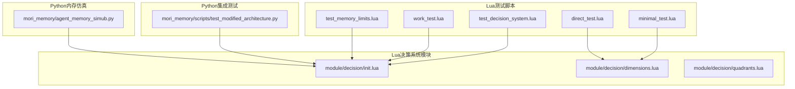
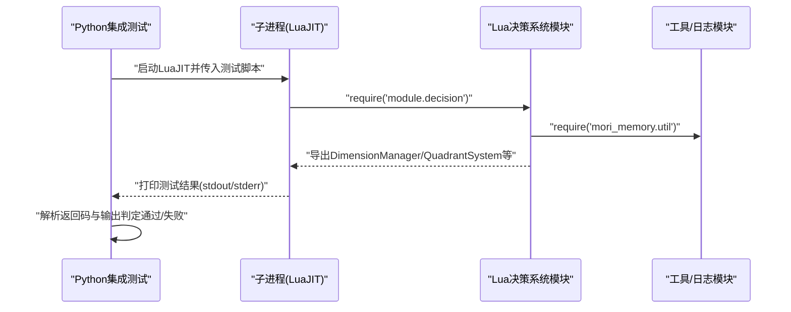
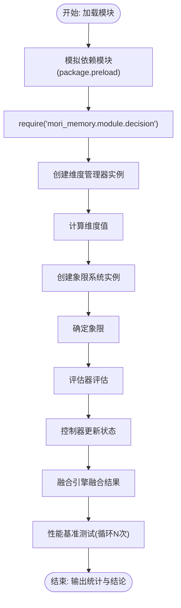
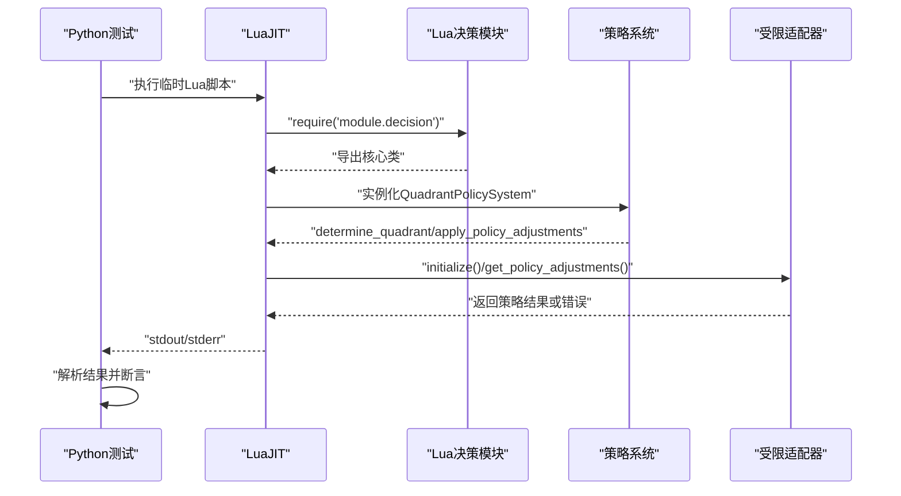
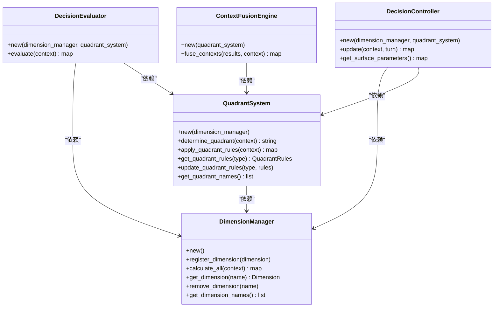
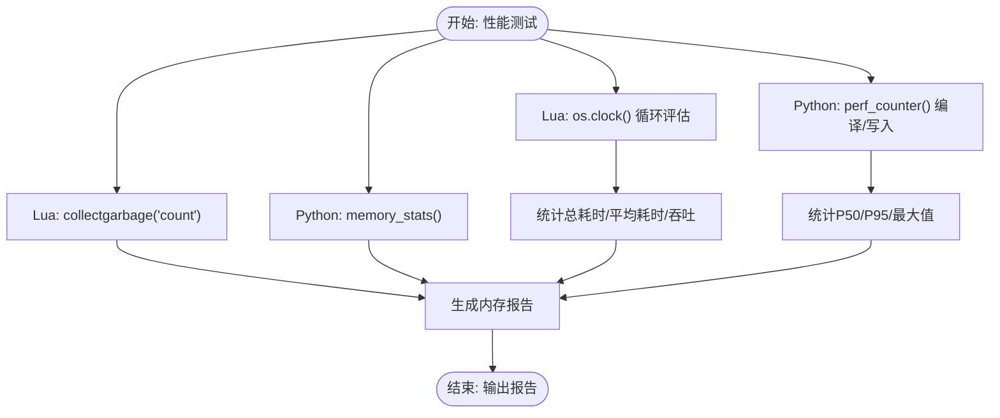
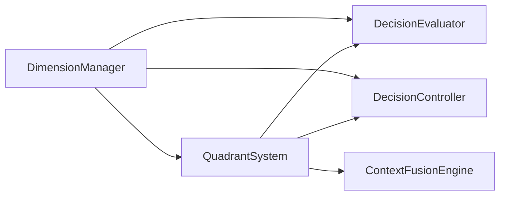

# 测试框架

<cite>
**本文引用的文件**   
- [test_decision_system.lua](file://test_decision_system.lua)
- [test_memory_limits.lua](file://test_memory_limits.lua)
- [minimal_test.lua](file://minimal_test.lua)
- [direct_test.lua](file://direct_test.lua)
- [work_test.lua](file://work_test.lua)
- [test_modified_architecture.py](file://mori_memory/scripts/test_modified_architecture.py)
- [agent_memory_simub.py](file://mori_memory/agent_memory_simub.py)
- [dimensions.lua](file://mori_memory/module/decision/dimensions.lua)
- [quadrants.lua](file://mori_memory/module/decision/quadrants.lua)
- [init.lua](file://mori_memory/module/decision/init.lua)
</cite>

## 目录
1. [引言](#引言)
2. [项目结构](#项目结构)
3. [核心组件](#核心组件)
4. [架构总览](#架构总览)
5. [详细组件分析](#详细组件分析)
6. [依赖关系分析](#依赖关系分析)
7. [性能考量](#性能考量)
8. [故障排查指南](#故障排查指南)
9. [结论](#结论)
10. [附录](#附录)

## 引言
本文件面向Mori项目的测试框架，系统化梳理单元测试、集成测试、性能测试与持续集成的组织方式与最佳实践。文档覆盖Lua模块测试与Python模块测试的差异与共性，给出模块间交互与端到端测试的设计思路，并提供测试用例编写、断言与模拟对象使用的指导。同时，结合现有测试脚本，总结覆盖率与质量保证建议。

## 项目结构
Mori仓库中测试相关的核心位置如下：
- Lua决策系统测试：位于根目录的若干测试脚本，用于验证Lua模块的导入、实例化与运行。
- Python集成测试：位于[mori_memory/scripts/test_modified_architecture.py](file://mori_memory/scripts/test_modified_architecture.py)，通过子进程调用LuaJIT执行Lua测试片段，验证模块导入与策略边界。
- 决策系统Lua模块：位于[mori_memory/module/decision/](file://mori_memory/module/decision/)，包含维度、象限、评估器、控制器、融合引擎等核心组件。
- 内存仿真与性能评测：位于[mori_memory/agent_memory_simub.py](file://mori_memory/agent_memory_simub.py)，提供编译上下文、写入回合、查询评估与统计汇总，便于端到端性能与稳定性测试。

**图示来源**
- [test_decision_system.lua:1-202](file://test_decision_system.lua#L1-L202)
- [work_test.lua:1-220](file://work_test.lua#L1-L220)
- [minimal_test.lua:1-66](file://minimal_test.lua#L1-L66)
- [direct_test.lua:1-63](file://direct_test.lua#L1-L63)
- [test_memory_limits.lua:1-63](file://test_memory_limits.lua#L1-L63)
- [test_modified_architecture.py:1-199](file://mori_memory/scripts/test_modified_architecture.py#L1-L199)
- [init.lua:1-21](file://mori_memory/module/decision/init.lua#L1-L21)
- [dimensions.lua:1-210](file://mori_memory/module/decision/dimensions.lua#L1-L210)
- [quadrants.lua:1-285](file://mori_memory/module/decision/quadrants.lua#L1-L285)
- [agent_memory_simub.py:1-1176](file://mori_memory/agent_memory_simub.py#L1-L1176)

**章节来源**
- [test_decision_system.lua:1-202](file://test_decision_system.lua#L1-L202)
- [work_test.lua:1-220](file://work_test.lua#L1-L220)
- [minimal_test.lua:1-66](file://minimal_test.lua#L1-L66)
- [direct_test.lua:1-63](file://direct_test.lua#L1-L63)
- [test_memory_limits.lua:1-63](file://test_memory_limits.lua#L1-L63)
- [test_modified_architecture.py:1-199](file://mori_memory/scripts/test_modified_architecture.py#L1-L199)
- [init.lua:1-21](file://mori_memory/module/decision/init.lua#L1-L21)
- [dimensions.lua:1-210](file://mori_memory/module/decision/dimensions.lua#L1-L210)
- [quadrants.lua:1-285](file://mori_memory/module/decision/quadrants.lua#L1-L285)
- [agent_memory_simub.py:1-1176](file://mori_memory/agent_memory_simub.py#L1-L1176)

## 核心组件
- 决策系统模块（Lua）：由入口文件导出维度管理器、象限系统、评估器、控制器、融合引擎等核心类，便于统一测试与集成。
- 维度管理器：负责注册与计算各维度值，支持标准化与批量计算。
- 象限系统：根据维度值确定象限，并应用对应象限规则，输出加权得分与阈值调整后的结果。
- 评估器与控制器：对上下文进行评估并维护状态；融合引擎对多象限结果进行加权融合。
- Python集成测试：通过子进程执行LuaJIT，验证模块导入、策略边界与受限适配器行为。
- 内存仿真与性能评测：提供编译上下文、写入回合、查询评估与统计汇总，支撑端到端性能测试。

**章节来源**
- [init.lua:1-21](file://mori_memory/module/decision/init.lua#L1-L21)
- [dimensions.lua:1-210](file://mori_memory/module/decision/dimensions.lua#L1-L210)
- [quadrants.lua:1-285](file://mori_memory/module/decision/quadrants.lua#L1-L285)
- [test_modified_architecture.py:1-199](file://mori_memory/scripts/test_modified_architecture.py#L1-L199)
- [agent_memory_simub.py:1-1176](file://mori_memory/agent_memory_simub.py#L1-L1176)

## 架构总览
下图展示测试框架与被测模块之间的交互关系，以及Python集成测试如何通过子进程驱动Lua模块进行端到端验证。

**图示来源**
- [test_modified_architecture.py:1-199](file://mori_memory/scripts/test_modified_architecture.py#L1-L199)
- [init.lua:1-21](file://mori_memory/module/decision/init.lua#L1-L21)

**章节来源**
- [test_modified_architecture.py:1-199](file://mori_memory/scripts/test_modified_architecture.py#L1-L199)

## 详细组件分析

### Lua单元测试：决策系统组件
- 目标：验证维度管理器、象限系统、评估器、控制器与融合引擎的创建、调用与结果一致性。
- 方法：
  - 使用package.preload模拟依赖模块，避免外部环境影响。
  - 通过require加载模块并逐一实例化核心类，构造测试上下文，调用计算与评估方法。
  - 对象方法调用采用pcall包装，捕获异常并输出详细错误信息。
  - 包含性能基准测试，重复执行评估循环并统计耗时与吞吐。
- 断言与期望：
  - 成功导入与实例化。
  - 维度计算返回数值且在合理范围。
  - 象限确定与规则应用返回结构完整。
  - 控制器状态字段存在且可读。
  - 融合引擎输出置信度与加权得分。
- 最佳实践：
  - 将测试上下文参数化，覆盖不同场景组合。
  - 对异常路径进行显式断言（如越权访问），确保安全边界有效。
  - 性能测试应固定迭代次数并记录分位数，便于回归对比。

**图示来源**
- [test_decision_system.lua:1-202](file://test_decision_system.lua#L1-L202)
- [work_test.lua:1-220](file://work_test.lua#L1-L220)
- [minimal_test.lua:1-66](file://minimal_test.lua#L1-L66)
- [direct_test.lua:1-63](file://direct_test.lua#L1-L63)

**章节来源**
- [test_decision_system.lua:1-202](file://test_decision_system.lua#L1-L202)
- [work_test.lua:1-220](file://work_test.lua#L1-L220)
- [minimal_test.lua:1-66](file://minimal_test.lua#L1-L66)
- [direct_test.lua:1-63](file://direct_test.lua#L1-L63)

### Python集成测试：模块导入与策略边界
- 目标：验证Lua模块导入链路、策略系统与受限适配器的协同工作，以及越权防护机制。
- 方法：
  - 通过subprocess运行LuaJIT，设置LUA_PATH指向mori_memory模块路径。
  - 在Lua侧执行require并实例化关键模块，打印状态以供Python解析。
  - 对策略边界进行显式断言，例如越权调用触发异常。
- 断言与期望：
  - 所有模块导入成功且初始化返回真值。
  - 策略系统能根据坐标确定象限并应用调整。
  - 受限适配器拒绝越权操作。
- 最佳实践：
  - 将测试脚本写入临时文件，避免污染源码。
  - 设置合理的超时与错误输出捕获，提升可诊断性。
  - 将测试拆分为“基本导入”和“策略边界”两类，便于定位问题。

**图示来源**
- [test_modified_architecture.py:1-199](file://mori_memory/scripts/test_modified_architecture.py#L1-L199)
- [init.lua:1-21](file://mori_memory/module/decision/init.lua#L1-L21)

**章节来源**
- [test_modified_architecture.py:1-199](file://mori_memory/scripts/test_modified_architecture.py#L1-L199)

### 决策系统Lua类图

**图示来源**
- [init.lua:1-21](file://mori_memory/module/decision/init.lua#L1-L21)
- [dimensions.lua:1-210](file://mori_memory/module/decision/dimensions.lua#L1-L210)
- [quadrants.lua:1-285](file://mori_memory/module/decision/quadrants.lua#L1-L285)

**章节来源**
- [init.lua:1-21](file://mori_memory/module/decision/init.lua#L1-L21)
- [dimensions.lua:1-210](file://mori_memory/module/decision/dimensions.lua#L1-L210)
- [quadrants.lua:1-285](file://mori_memory/module/decision/quadrants.lua#L1-L285)

### 性能测试：内存、响应时间与并发
- 内存使用测试：
  - Lua侧：通过collectgarbage("count")获取当前内存占用，作为基线参考。
  - Python侧：在内存仿真脚本中统计记忆总数、跨作用域来源数量与各作用域计数，辅助稳定性评估。
- 响应时间测试：
  - Lua侧：使用os.clock()测量多次评估循环的总耗时与平均耗时，输出吞吐。
  - Python侧：使用time.perf_counter()记录编译与写入阶段耗时，统计P50/P95/最大值。
- 并发性能测试：
  - 建议在Python端循环多次调用编译与写入流程，统计分位数与失败率，识别瓶颈。
  - 结合受限适配器与策略系统的越权防护，观察高负载下的异常路径。

**图示来源**
- [test_memory_limits.lua:1-63](file://test_memory_limits.lua#L1-L63)
- [test_decision_system.lua:162-202](file://test_decision_system.lua#L162-L202)
- [agent_memory_simub.py:806-1111](file://mori_memory/agent_memory_simub.py#L806-L1111)

**章节来源**
- [test_memory_limits.lua:1-63](file://test_memory_limits.lua#L1-L63)
- [test_decision_system.lua:162-202](file://test_decision_system.lua#L162-L202)
- [agent_memory_simub.py:806-1111](file://mori_memory/agent_memory_simub.py#L806-L1111)

### 测试用例编写指南
- 测试数据准备：
  - Lua：构造包含消息计数、活跃用户、消息对数、文本、年龄、稳定性、时间戳等字段的上下文字典。
  - Python：通过LiveScenario生成多轮对话元数据，MemoryHarness编译上下文并注入回合。
- 断言编写：
  - 成功导入与实例化：检查require返回非空与实例方法存在。
  - 结果字段完整性：断言评估结果包含象限、置信度、得分列表与推理说明。
  - 性能断言：设定平均耗时阈值，区分“优秀/满足/待优化”等级。
  - 安全断言：越权调用应触发异常，确保受限适配器生效。
- 模拟对象使用：
  - Lua：使用package.preload注入日志与工具模块，隔离外部依赖。
  - Python：通过subprocess与临时Lua脚本配合，模拟模块行为。

**章节来源**
- [test_decision_system.lua:1-202](file://test_decision_system.lua#L1-L202)
- [work_test.lua:1-220](file://work_test.lua#L1-L220)
- [test_modified_architecture.py:1-199](file://mori_memory/scripts/test_modified_architecture.py#L1-L199)

### 持续集成配置与测试报告
- 自动化测试流程建议：
  - Lua单元测试：在CI中直接调用LuaJIT执行根目录测试脚本，收集stdout/stderr与返回码。
  - Python集成测试：在CI中运行Python脚本，确保LUA_PATH正确指向mori_memory模块，捕获超时与异常。
  - 端到端性能测试：在专用作业中循环调用内存仿真脚本，聚合分位数与失败率。
- 测试报告生成：
  - Lua：将性能统计（总耗时、平均耗时、吞吐）与断言结果写入JSON或标准输出。
  - Python：将命中率、跨房间侵入率、跨线程污染率、编译/写入耗时等指标输出为结构化报告。
- 覆盖率与质量保证：
  - 建议引入Lua覆盖率工具（如LuaCov）与Python覆盖率（如coverage.py），在CI中生成并上传报告。
  - 对关键路径（如受限适配器、策略边界、象限规则应用）设置最低覆盖率阈值。

**章节来源**
- [test_modified_architecture.py:1-199](file://mori_memory/scripts/test_modified_architecture.py#L1-L199)
- [agent_memory_simub.py:806-1111](file://mori_memory/agent_memory_simub.py#L806-L1111)

## 依赖关系分析
- 模块耦合：
  - QuadrantSystem依赖DimensionManager进行维度计算。
  - DecisionEvaluator与DecisionController均依赖DimensionManager与QuadrantSystem。
  - ContextFusionEngine依赖QuadrantSystem进行多象限融合。
- 外部依赖：
  - Lua侧通过mori_memory.util与module.tool提供日志与工具能力。
  - Python集成测试通过subprocess与LuaJIT交互，需确保LUA_PATH正确。
- 潜在风险：
  - 模块导入顺序与路径配置不当会导致测试失败。
  - 越权防护依赖严格的权限控制，需在测试中重点验证。

**图示来源**
- [init.lua:1-21](file://mori_memory/module/decision/init.lua#L1-L21)
- [dimensions.lua:1-210](file://mori_memory/module/decision/dimensions.lua#L1-L210)
- [quadrants.lua:1-285](file://mori_memory/module/decision/quadrants.lua#L1-L285)

**章节来源**
- [init.lua:1-21](file://mori_memory/module/decision/init.lua#L1-L21)
- [dimensions.lua:1-210](file://mori_memory/module/decision/dimensions.lua#L1-L210)
- [quadrants.lua:1-285](file://mori_memory/module/decision/quadrants.lua#L1-L285)

## 性能考量
- 响应时间优化：
  - 减少维度计算中的重复开销，缓存中间结果。
  - 降低象限规则应用的复杂度，必要时采用近似算法。
- 内存使用优化：
  - 控制象限坐标历史长度，避免无限增长。
  - 在Lua侧定期触发垃圾回收，监控内存峰值。
- 并发与稳定性：
  - 在Python端对高并发场景进行压力测试，记录失败率与异常堆栈。
  - 对受限适配器与策略系统进行边界测试，防止越权与异常传播。

[本节为通用指导，无需具体文件分析]

## 故障排查指南
- Lua模块导入失败：
  - 检查package.path与LUA_PATH是否包含mori_memory路径。
  - 使用pcall包装require，捕获并打印错误详情。
- 象限确定异常：
  - 核查维度计算结果是否为空或越界，修正归一化逻辑。
  - 确认QuadrantSystem的坐标历史长度限制是否合理。
- 受限适配器越权：
  - 确保受控方法仅暴露必要接口，其他方法抛出异常。
  - 在Python集成测试中显式构造越权调用，验证防护机制。
- 性能退化：
  - 使用Lua os.clock()与Python perf_counter()分别测量关键阶段耗时。
  - 分析分位数报告，定位尾延迟原因。

**章节来源**
- [test_decision_system.lua:1-202](file://test_decision_system.lua#L1-L202)
- [work_test.lua:1-220](file://work_test.lua#L1-L220)
- [test_modified_architecture.py:1-199](file://mori_memory/scripts/test_modified_architecture.py#L1-L199)

## 结论
Mori项目的测试框架以Lua单元测试与Python集成测试为核心，辅以内存仿真与性能评测脚本，形成从组件到端到端的完整测试体系。通过明确的断言策略、模拟对象与性能基准，能够有效保障模块稳定性与系统可靠性。建议在CI中引入覆盖率工具与自动化报告，持续提升测试质量与可维护性。

[本节为总结性内容，无需具体文件分析]

## 附录
- 测试脚本清单与用途概览：
  - [test_decision_system.lua](file://test_decision_system.lua)：完整决策系统功能与性能测试。
  - [work_test.lua](file://work_test.lua)：工作中的决策系统测试与简单性能测试。
  - [minimal_test.lua](file://minimal_test.lua)：最小化维度管理器测试。
  - [direct_test.lua](file://direct_test.lua)：直接定义与require加载对比测试。
  - [test_memory_limits.lua](file://test_memory_limits.lua)：内存限制与GC特性测试。
  - [test_modified_architecture.py](file://mori_memory/scripts/test_modified_architecture.py)：Python驱动的Lua模块集成测试。
  - [agent_memory_simub.py](file://mori_memory/agent_memory_simub.py)：端到端内存仿真与性能评测。

[本节为概览性内容，无需具体文件分析]