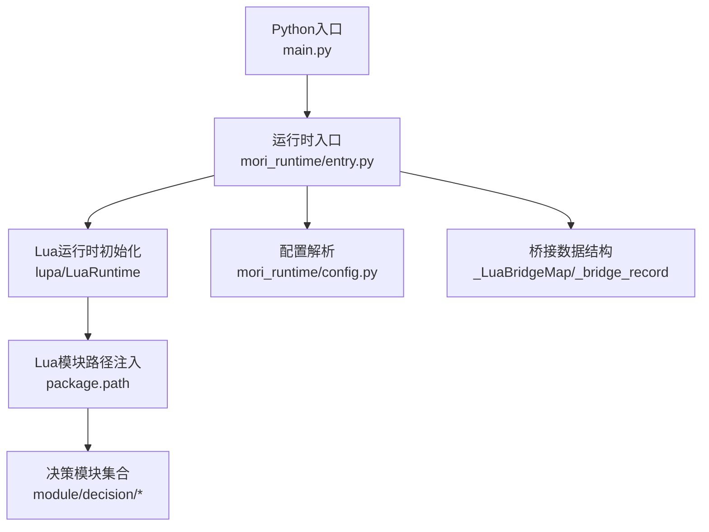
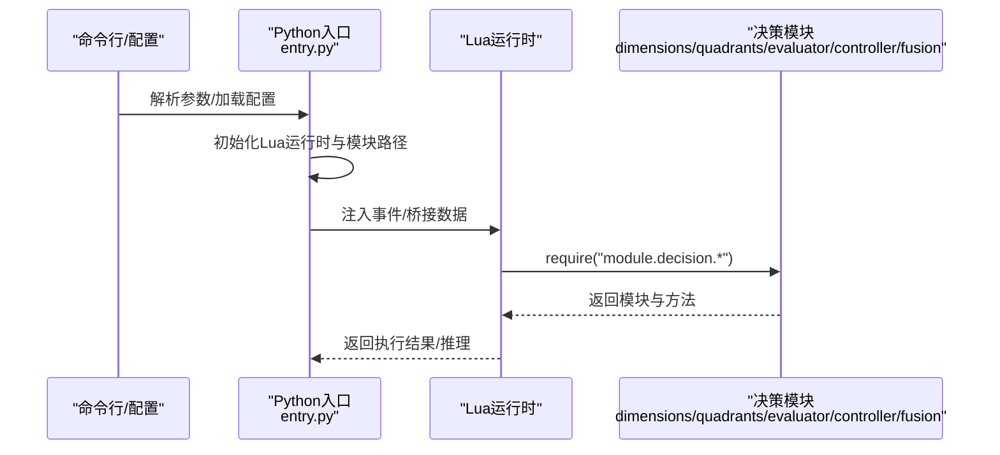
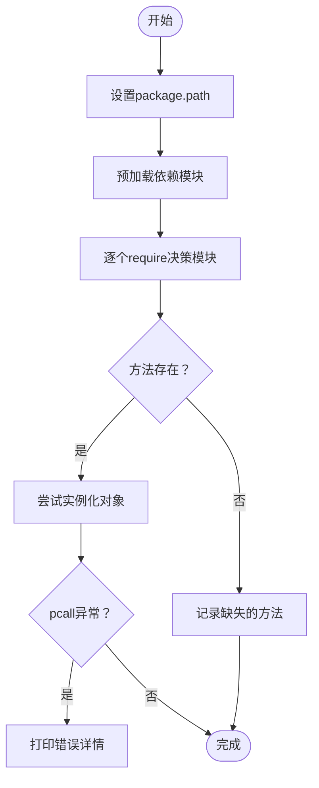
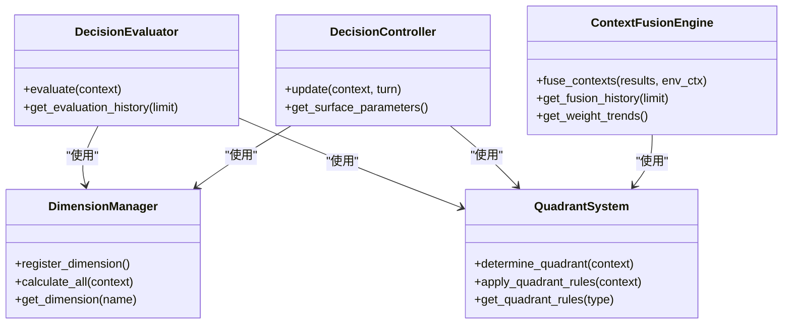
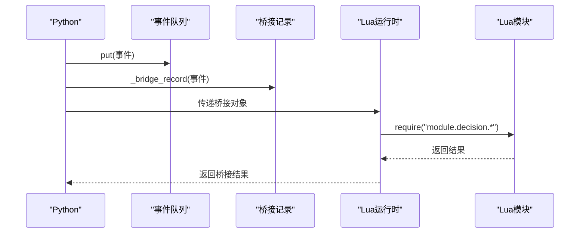
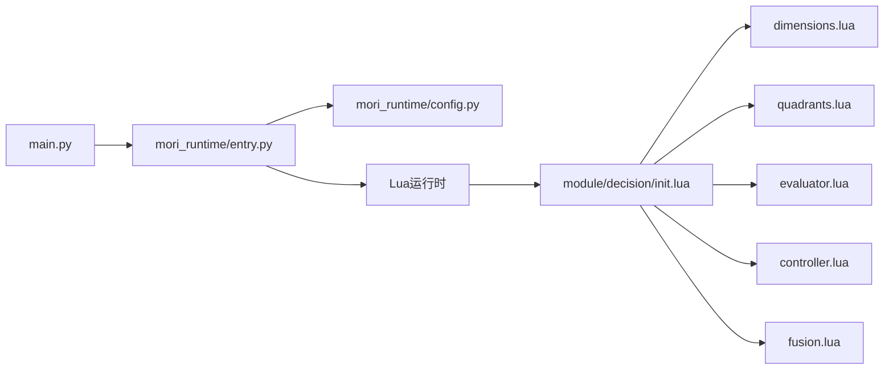

# 调试工具

<cite>
**本文引用的文件**
- [debug_modules.lua](file://debug_modules.lua)
- [debug_detailed.lua](file://debug_detailed.lua)
- [main.py](file://main.py)
- [entry.py](file://mori_runtime/entry.py)
- [config.py](file://mori_runtime/config.py)
- [init.lua](file://mori_memory/module/decision/init.lua)
- [dimensions.lua](file://mori_memory/module/decision/dimensions.lua)
- [quadrants.lua](file://mori_memory/module/decision/quadrants.lua)
- [evaluator.lua](file://mori_memory/module/decision/evaluator.lua)
- [controller.lua](file://mori_memory/module/decision/controller.lua)
- [fusion.lua](file://mori_memory/module/decision/fusion.lua)
- [core.lua](file://mori_memory/mori_memory/core.lua)
</cite>

## 目录
1. [简介](#简介)
2. [项目结构](#项目结构)
3. [核心组件](#核心组件)
4. [架构总览](#架构总览)
5. [详细组件分析](#详细组件分析)
6. [依赖分析](#依赖分析)
7. [性能考虑](#性能考虑)
8. [故障排查指南](#故障排查指南)
9. [结论](#结论)
10. [附录](#附录)

## 简介
本指南面向Mori项目的调试实践，覆盖以下主题：
- Lua模块调试：模块加载、变量检查、堆栈跟踪
- Python程序调试：IDE调试器、日志分析、异常追踪
- 混合语言调试：Python-Lua互操作、FFI调用、内存访问
- 性能调试：内存使用、CPU性能、I/O监控
- 远程与生产调试：日志收集、远程调试配置、问题复现技巧
- 常见调试场景与解决方案

文档中的技术细节均来自仓库源码与脚本，确保可操作性与可验证性。

## 项目结构
Mori采用“Python主进程 + Lua运行时 + 混合模块”的架构。Python负责启动、桥接与线程调度，Lua负责决策与内存模块的业务逻辑。调试工具与流程围绕入口、桥接层、Lua模块与配置展开。

图表来源
- [main.py:1-13](file://main.py#L1-L13)
- [entry.py:414-438](file://mori_runtime/entry.py#L414-L438)
- [config.py:188-270](file://mori_runtime/config.py#L188-L270)

章节来源
- [main.py:1-13](file://main.py#L1-L13)
- [entry.py:414-438](file://mori_runtime/entry.py#L414-L438)
- [config.py:188-270](file://mori_runtime/config.py#L188-L270)

## 核心组件
- Python入口与运行时
  - 入口函数通过运行时入口启动，负责参数解析、配置加载、Lua运行时初始化与线程调度。
  - 关键点：Lua模块路径注入、桥接数据结构、stdin与直播输入线程、TTS与LLM桥接。
- Lua决策模块
  - 决策系统由维度、象限、评估器、控制器、融合引擎组成，形成完整的上下文分析与决策闭环。
  - 关键点：维度归一化、象限规则权重、评分通道、融合推理、状态机与历史记录。

章节来源
- [entry.py:414-438](file://mori_runtime/entry.py#L414-L438)
- [init.lua:1-21](file://mori_memory/module/decision/init.lua#L1-L21)
- [dimensions.lua:1-210](file://mori_memory/module/decision/dimensions.lua#L1-L210)
- [quadrants.lua:1-285](file://mori_memory/module/decision/quadrants.lua#L1-L285)
- [evaluator.lua:1-362](file://mori_memory/module/decision/evaluator.lua#L1-L362)
- [controller.lua:1-194](file://mori_memory/module/decision/controller.lua#L1-L194)
- [fusion.lua:1-302](file://mori_memory/module/decision/fusion.lua#L1-L302)

## 架构总览
Python侧负责：
- 解析命令行与配置文件，构建默认参数
- 初始化Lua运行时，注入模块搜索路径
- 启动输入线程（stdin、直播），维护事件队列
- 通过桥接结构传递事件与结果，驱动Lua模块执行

Lua侧负责：
- 接收Python传入的上下文，计算维度、象限、评分与融合
- 维护状态机与历史，输出推理与置信度

图表来源
- [entry.py:414-438](file://mori_runtime/entry.py#L414-L438)
- [init.lua:1-21](file://mori_memory/module/decision/init.lua#L1-L21)
- [dimensions.lua:1-210](file://mori_memory/module/decision/dimensions.lua#L1-L210)
- [quadrants.lua:1-285](file://mori_memory/module/decision/quadrants.lua#L1-L285)
- [evaluator.lua:1-362](file://mori_memory/module/decision/evaluator.lua#L1-L362)
- [controller.lua:1-194](file://mori_memory/module/decision/controller.lua#L1-L194)
- [fusion.lua:1-302](file://mori_memory/module/decision/fusion.lua#L1-L302)

## 详细组件分析

### Lua模块加载与变量检查调试
- 模块路径注入
  - Python侧通过Lua运行时注入多处模块路径，确保Lua能正确require决策模块。
- 模块加载测试脚本
  - 提供基础与详细两套测试脚本，用于验证模块是否成功加载、方法是否存在、对象能否实例化。
- 变量检查与错误捕获
  - 使用受控的pcall包装关键调用，捕获异常并打印错误信息，便于定位问题。

图表来源
- [debug_modules.lua:6-60](file://debug_modules.lua#L6-L60)
- [debug_detailed.lua:6-83](file://debug_detailed.lua#L6-L83)

章节来源
- [debug_modules.lua:6-60](file://debug_modules.lua#L6-L60)
- [debug_detailed.lua:6-83](file://debug_detailed.lua#L6-L83)

### 决策系统模块（维度/象限/评估器/控制器/融合引擎）
- 维度管理
  - 定义维度类型与归一化策略，支持参与压力、交互拓扑、消息频率、参与者多样性。
- 象限系统
  - 基于维度坐标确定象限，提供不同象限的规则权重与阈值调整。
- 评估器
  - 提取特征、计算评分、生成置信度与推理说明。
- 控制器
  - 维护状态机，基于平滑与阈值判断象限转换，并输出表面参数。
- 融合引擎
  - 结合环境特征与象限权重进行加权融合，生成融合上下文与推理。

图表来源
- [dimensions.lua:156-210](file://mori_memory/module/decision/dimensions.lua#L156-L210)
- [quadrants.lua:207-285](file://mori_memory/module/decision/quadrants.lua#L207-L285)
- [evaluator.lua:251-362](file://mori_memory/module/decision/evaluator.lua#L251-L362)
- [controller.lua:27-194](file://mori_memory/module/decision/controller.lua#L27-L194)
- [fusion.lua:117-302](file://mori_memory/module/decision/fusion.lua#L117-L302)

章节来源
- [dimensions.lua:1-210](file://mori_memory/module/decision/dimensions.lua#L1-L210)
- [quadrants.lua:1-285](file://mori_memory/module/decision/quadrants.lua#L1-L285)
- [evaluator.lua:1-362](file://mori_memory/module/decision/evaluator.lua#L1-L362)
- [controller.lua:1-194](file://mori_memory/module/decision/controller.lua#L1-L194)
- [fusion.lua:1-302](file://mori_memory/module/decision/fusion.lua#L1-L302)

### Python-Lua互操作与桥接
- 桥接数据结构
  - Python侧将字典封装为桥接对象，避免Lua端误修改原生Python对象。
- 事件队列与线程
  - stdin与直播输入分别在独立线程中读取并入队，Python侧统一drain与分发。
- Lua运行时初始化
  - 注入runtime、memory、live_stream三类模块路径，确保require成功。

图表来源
- [entry.py:54-62](file://mori_runtime/entry.py#L54-L62)
- [entry.py:89-144](file://mori_runtime/entry.py#L89-L144)
- [entry.py:414-438](file://mori_runtime/entry.py#L414-L438)

章节来源
- [entry.py:54-62](file://mori_runtime/entry.py#L54-L62)
- [entry.py:89-144](file://mori_runtime/entry.py#L89-L144)
- [entry.py:414-438](file://mori_runtime/entry.py#L414-L438)

## 依赖分析
- Python入口依赖运行时入口与配置模块，运行时入口依赖Lua运行时与桥接结构。
- Lua决策模块之间存在清晰的依赖关系：评估器依赖维度与象限系统；控制器依赖维度与象限系统；融合引擎依赖象限系统与环境特征。
- 配置模块负责从JSON加载与解析默认参数，支持相对路径解析与键映射。

图表来源
- [main.py:1-13](file://main.py#L1-L13)
- [entry.py:414-438](file://mori_runtime/entry.py#L414-L438)
- [config.py:188-270](file://mori_runtime/config.py#L188-L270)
- [init.lua:1-21](file://mori_memory/module/decision/init.lua#L1-L21)

章节来源
- [main.py:1-13](file://main.py#L1-L13)
- [entry.py:414-438](file://mori_runtime/entry.py#L414-L438)
- [config.py:188-270](file://mori_runtime/config.py#L188-L270)
- [init.lua:1-21](file://mori_memory/module/decision/init.lua#L1-L21)

## 性能考虑
- 内存使用
  - Python侧事件队列有容量上限，避免内存无限增长；Lua侧模块内部维护历史记录，需控制长度以减少内存占用。
- CPU性能
  - 评估器与融合引擎涉及多次归一化、加权与排序，建议在上下文规模较大时进行批处理或缓存中间结果。
- I/O监控
  - 输入线程定期轮询直播接口，注意网络抖动与超时处理；TTS线程池并发合成音频，需关注磁盘写入与模型推理延迟。

章节来源
- [entry.py:89-144](file://mori_runtime/entry.py#L89-L144)
- [evaluator.lua:310-325](file://mori_memory/module/decision/evaluator.lua#L310-L325)
- [fusion.lua:271-300](file://mori_memory/module/decision/fusion.lua#L271-L300)

## 故障排查指南
- Lua模块加载失败
  - 症状：require报错或模块方法缺失
  - 排查：确认Python已注入Lua模块路径；使用调试脚本逐模块验证；检查模块init.lua导出项
- 对象实例化失败
  - 症状：new方法不存在或抛出异常
  - 排查：使用pcall包装构造过程；查看预加载依赖是否正确；核对模块内部依赖是否可用
- 事件队列阻塞
  - 症状：输入线程无法继续读取或队列满
  - 排查：检查队列容量与drain频率；确认异常分支未吞掉错误；必要时增加超时与丢弃策略
- 配置解析异常
  - 症状：参数未生效或路径解析错误
  - 排查：确认配置文件存在且为JSON对象；检查相对路径解析逻辑；核对键映射与默认值

章节来源
- [debug_modules.lua:6-60](file://debug_modules.lua#L6-L60)
- [debug_detailed.lua:6-83](file://debug_detailed.lua#L6-L83)
- [entry.py:89-144](file://mori_runtime/entry.py#L89-L144)
- [config.py:188-270](file://mori_runtime/config.py#L188-L270)

## 结论
通过结合Python与Lua的调试脚本、桥接结构与模块化设计，Mori能够实现跨语言的可观测性与可调试性。建议在开发与生产环境中遵循统一的日志规范、事件队列容量策略与配置加载流程，以提升问题定位效率与系统稳定性。

## 附录
- 常见调试场景与解决方案
  - 场景A：Lua模块找不到
    - 方案：在Python侧确认package.path已注入；使用调试脚本验证require链路
  - 场景B：Lua对象无法实例化
    - 方案：用pcall包裹构造；检查依赖模块是否被正确预加载
  - 场景C：Python线程卡住
    - 方案：检查队列满与drain策略；为读取与解析添加超时与异常捕获
  - 场景D：配置不生效
    - 方案：校验配置文件格式；使用相对路径解析与键映射逻辑进行对比