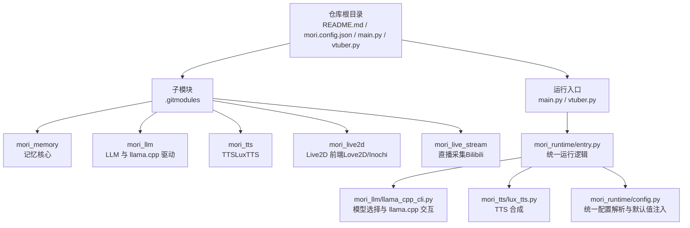
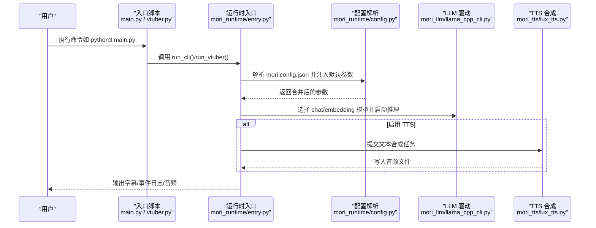
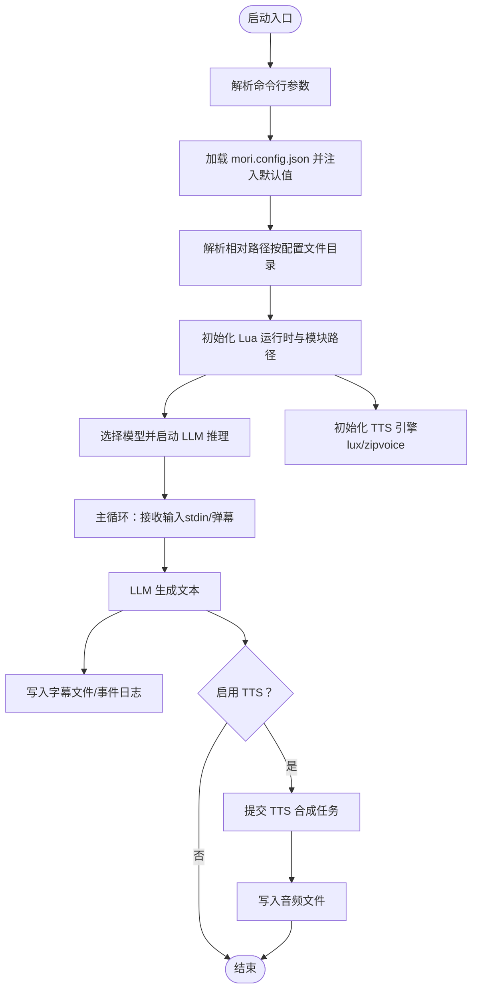
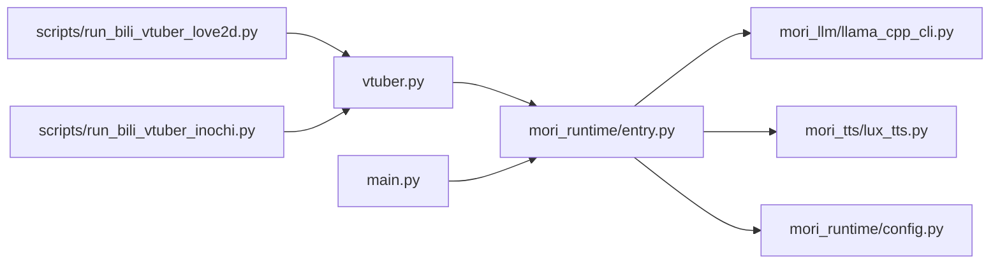

# 快速开始

<cite>
**本文引用的文件**
- [README.md](file://README.md)
- [mori.config.json](file://mori.config.json)
- [main.py](file://main.py)
- [vtuber.py](file://vtuber.py)
- [.gitmodules](file://.gitmodules)
- [requirements.txt](file://requirements.txt)
- [mori_runtime/entry.py](file://mori_runtime/entry.py)
- [mori_runtime/config.py](file://mori_runtime/config.py)
- [scripts/run_bili_vtuber_love2d.py](file://scripts/run_bili_vtuber_love2d.py)
- [scripts/run_bili_vtuber_inochi.py](file://scripts/run_bili_vtuber_inochi.py)
- [mori_llm/llama_cpp_cli.py](file://mori_llm/llama_cpp_cli.py)
- [mori_tts/lux_tts.py](file://mori_tts/lux_tts.py)
</cite>

## 目录
1. [简介](#简介)
2. [项目结构](#项目结构)
3. [核心组件](#核心组件)
4. [架构总览](#架构总览)
5. [详细组件分析](#详细组件分析)
6. [依赖关系分析](#依赖关系分析)
7. [性能注意事项](#性能注意事项)
8. [故障排查指南](#故障排查指南)
9. [结论](#结论)
10. [附录](#附录)

## 简介
本指南面向首次接触 Mori 的用户，目标是在约 30 分钟内完成环境准备、模型准备、统一配置与依赖安装，并成功运行一个基础 AI 助手或 VTuber 实例。文档涵盖以下要点：
- 环境准备：Python 虚拟环境、依赖安装、Git 子模块初始化
- 模型准备：chat 与 embedding 模型的获取与放置位置
- 统一配置：mori.config.json 的使用方法与最佳实践
- 运行方式：从最简命令到 VTuber 模式的完整启动流程
- 常见问题与环境检查清单

## 项目结构
Mori 是一个聚合入口（类 monorepo），包含多个子模块与运行入口：
- 根目录提供统一配置文件 mori.config.json 与运行入口脚本
- 子模块通过 Git 子模块管理，包括记忆核心、LLM 驱动、TTS、Live2D 前端与直播采集
- 运行入口包括 CLI 与 VTuber 两种模式，分别对应 main.py 与 vtuber.py

图表来源
- [.gitmodules](file://.gitmodules)
- [README.md](file://README.md)
- [mori_runtime/entry.py](file://mori_runtime/entry.py)
- [mori_runtime/config.py](file://mori_runtime/config.py)
- [mori_llm/llama_cpp_cli.py](file://mori_llm/llama_cpp_cli.py)
- [mori_tts/lux_tts.py](file://mori_tts/lux_tts.py)

章节来源
- [README.md](file://README.md)
- [.gitmodules](file://.gitmodules)

## 核心组件
- 运行入口
  - main.py：启动 CLI 模式，适合本地对话与批处理
  - vtuber.py：启动 VTuber 模式，支持弹幕输入、字幕输出与可选 TTS
- 统一配置
  - mori.config.json：集中管理 common、tts、cli、vtuber、love2d、inochi 等分组配置
- LLM 驱动
  - mori_llm/llama_cpp_cli.py：负责 llama.cpp 二进制定位、chat/embedding 模型选择与推理
- TTS 合成
  - mori_tts/lux_tts.py：基于 LuxTTS 的语音合成，支持设备选择与参数调节
- 运行时桥接
  - mori_runtime/entry.py：构建 Lua 运行时、解析参数、启动弹幕采集线程、调度 TTS 与 LLM
  - mori_runtime/config.py：解析 mori.config.json，注入默认参数并处理相对路径

章节来源
- [main.py](file://main.py)
- [vtuber.py](file://vtuber.py)
- [mori.config.json](file://mori.config.json)
- [mori_runtime/entry.py](file://mori_runtime/entry.py)
- [mori_runtime/config.py](file://mori_runtime/config.py)
- [mori_llm/llama_cpp_cli.py](file://mori_llm/llama_cpp_cli.py)
- [mori_tts/lux_tts.py](file://mori_tts/lux_tts.py)

## 架构总览
下图展示从用户命令到实际运行的关键流程：统一配置解析、参数注入、Lua 运行时初始化、LLM 与 TTS 集成，以及可选的弹幕采集与 Live2D 前端。

图表来源
- [mori_runtime/entry.py](file://mori_runtime/entry.py)
- [mori_runtime/config.py](file://mori_runtime/config.py)
- [mori_llm/llama_cpp_cli.py](file://mori_llm/llama_cpp_cli.py)
- [mori_tts/lux_tts.py](file://mori_tts/lux_tts.py)

## 详细组件分析

### 环境准备与依赖安装
- 初始化仓库与子模块
  - 克隆仓库并递归初始化子模块，确保各子模块可用
- 创建 Python 虚拟环境并安装依赖
  - 使用 venv 创建隔离环境，激活后安装 requirements.txt 中的依赖
- 安装 TTS（LuxTTS）
  - 在 venv 中执行安装脚本以完成 LuxTTS 依赖安装
  - 若使用 ZipVoice 且 vocoder 为 lux_48k，需为独立虚拟环境补充额外依赖

章节来源
- [README.md](file://README.md)
- [requirements.txt](file://requirements.txt)

### 模型准备
- 将 chat 与 embedding 的 GGUF 模型放入 model/ 目录
- 若未显式指定，运行时会自动从 model/ 选择默认模型
- 若 llama.cpp 二进制不在默认路径，可通过环境变量或参数指定

章节来源
- [README.md](file://README.md)
- [mori_llm/llama_cpp_cli.py](file://mori_llm/llama_cpp_cli.py)

### 统一配置文件 mori.config.json
- 自动加载规则
  - 当前目录或仓库根目录存在 mori.config.json 时自动加载
  - 配置中的值作为默认值，命令行显式传参会覆盖
  - 相对路径按配置文件所在目录解析
- 配置分组
  - common：工作目录、llama.cpp 二进制目录、chat/embedding 模型、上下文长度、预测长度、温度、top_p、system 提示
  - tts：是否启用、后端（lux/zipvoice）、模型、设备、线程数、参考音频、采样步数、引导系数、t_shift、语速、返回平滑、ZipVoice 相关路径与参数
  - cli：音频输出目录、中断策略
  - vtuber：直播目录、字幕文件、事件日志、打印到标准输出、Bilibili 房间参数、弹幕间隔、追加条数、离线退出、中断策略
  - love2d：是否启用 TTS、Love2D 可执行文件、Puppet 路径、映射文件、鼠标视角、跳过准备
  - inochi：Inochi 根目录、可执行文件、X11/Wayland 工作区设置
- 最佳实践
  - 将常用参数写入 mori.config.json，避免每次启动重复输入
  - 对于路径类参数，建议使用相对路径并确保其相对于配置文件解析正确
  - TTS 参数可根据硬件能力调整，lux 后端支持多设备自动检测

章节来源
- [mori.config.json](file://mori.config.json)
- [mori_runtime/config.py](file://mori_runtime/config.py)

### 运行方式与命令示例
- 基础 AI 助手（CLI 模式）
  - 最简命令：python3 main.py
  - 显式指定模型：python3 main.py --chat-model model/<chat>.gguf --embed-model model/<embed>.gguf
- VTuber 模式（字幕 + 可选 TTS）
  - 最简命令：python3 vtuber.py
  - 开启 TTS：python3 vtuber.py --tts --tts-model YatharthS/LuxTTS --tts-prompt-wav /path/to/prompt.wav
  - 调整生成参数：增加 --tts-num-steps、--tts-guidance-scale、--tts-t-shift、--tts-speed
- Bilibili 弹幕（参考 my-neuro）
  - python3 vtuber.py --bilibili-room-url 'https://live.bilibili.com/<room_id>' --bilibili-interval 2 --tts --bilibili-exit-when-offline
- Inochi2D（Love2D 前端，WIP）
  - 准备：python3 -m mori_live2d.cli build-inox2d
  - 启动：love mori_live2d/love2d_frontend
- VTuber + Love2D 或 Inochi Session
  - Love2D：python3 scripts/run_bili_vtuber_love2d.py
  - Inochi：python3 scripts/run_bili_vtuber_inochi.py

章节来源
- [README.md](file://README.md)
- [main.py](file://main.py)
- [vtuber.py](file://vtuber.py)
- [scripts/run_bili_vtuber_love2d.py](file://scripts/run_bili_vtuber_love2d.py)
- [scripts/run_bili_vtuber_inochi.py](file://scripts/run_bili_vtuber_inochi.py)

### 关键流程与参数映射
- 参数解析与默认值注入
  - 运行时入口会解析命令行参数，并根据 mori.config.json 注入默认值
  - 对于路径参数，会按配置文件所在目录进行解析
- LLM 与 TTS 集成
  - LLM 通过 llama.cpp CLI 与模型交互，支持自定义上下文长度与采样参数
  - TTS 后端支持 lux 与 zipvoice，lux 后端自动检测设备，zipvoice 支持多语言路由与提示词池
- 弹幕采集与 VTuber 输出
  - VTuber 模式可定时抓取 Bilibili 弹幕，按优先级排队，生成字幕与事件日志，可选 TTS 输出音频

图表来源
- [mori_runtime/entry.py](file://mori_runtime/entry.py)
- [mori_runtime/config.py](file://mori_runtime/config.py)

## 依赖关系分析
- 运行时依赖
  - lupa：用于在 Python 中嵌入 Lua 运行时，加载 Lua 模块（记忆、直播采集等）
- 外部工具
  - llama.cpp：提供 chat 与 embedding 的 CLI 二进制，可通过环境变量或参数指定路径
  - LuxTTS：TTS 合成后端，支持多设备自动检测
- 子模块耦合
  - mori_runtime 依赖 mori_llm 与 mori_tts 提供的核心能力
  - VTuber 模式依赖 mori_live_stream 获取弹幕数据
  - Live2D 前端依赖 mori_live2d 提供的渲染与控制接口

图表来源
- [mori_runtime/entry.py](file://mori_runtime/entry.py)
- [mori_runtime/config.py](file://mori_runtime/config.py)
- [mori_llm/llama_cpp_cli.py](file://mori_llm/llama_cpp_cli.py)
- [mori_tts/lux_tts.py](file://mori_tts/lux_tts.py)
- [vtuber.py](file://vtuber.py)
- [main.py](file://main.py)
- [scripts/run_bili_vtuber_love2d.py](file://scripts/run_bili_vtuber_love2d.py)
- [scripts/run_bili_vtuber_inochi.py](file://scripts/run_bili_vtuber_inochi.py)

章节来源
- [requirements.txt](file://requirements.txt)
- [mori_runtime/entry.py](file://mori_runtime/entry.py)

## 性能注意事项
- 设备选择
  - LuxTTS 支持自动检测 GPU/CPU/MPS 等设备，建议在有 CUDA 的环境下优先使用 GPU
- 采样参数
  - 适当降低 n_predict、temp、top_p 可减少生成时间；提高 num_steps/guidance_scale/t_shift/speed 会提升质量但可能增加耗时
- TTS 与 LLM 并行
  - TTS 采用线程池异步合成，建议根据 CPU/GPU 资源设置线程数与并发度
- 路径解析
  - 使用相对路径时，确保其相对于 mori.config.json 所在目录解析正确，避免 IO 错误导致的重试与延迟

## 故障排查指南
- 缺少 lupa 依赖
  - 症状：导入 Lua 运行时报错
  - 处理：激活 venv 后安装 requirements.txt 中的依赖
- llama.cpp 二进制未找到
  - 症状：无法定位 llama-cli/llama-embedding
  - 处理：设置 LLAMA_CPP_BIN_DIR 或 LLAMA_CPP_DIR，或在启动时通过 --llama-bin-dir 指定
- LuxTTS 依赖缺失
  - 症状：初始化 LuxTTS 报错
  - 处理：在 venv 中执行安装脚本完成依赖安装；若使用 ZipVoice 的 lux_48k vocoder，需为 ZipVoice 虚拟环境补充 LinaCodec 依赖
- ZipVoice 提示词配置不足
  - 症状：backend=zipvoice 时缺少提示词
  - 处理：提供 --tts-zipvoice-prompt-manifest 或固定 zh/ja 提示词对
- Inochi Session 未安装或平台不匹配
  - 症状：找不到 inochi-session 可执行文件
  - 处理：使用脚本自动安装或手动指定 --inochi-bin；Linux 下可尝试 --inochi-x11

章节来源
- [mori_runtime/entry.py](file://mori_runtime/entry.py)
- [mori_llm/llama_cpp_cli.py](file://mori_llm/llama_cpp_cli.py)
- [mori_tts/lux_tts.py](file://mori_tts/lux_tts.py)
- [scripts/run_bili_vtuber_inochi.py](file://scripts/run_bili_vtuber_inochi.py)

## 结论
通过本快速开始指南，您可以在 30 分钟内完成环境准备、模型放置与统一配置，并成功运行基础 AI 助手或 VTuber 实例。建议优先使用 mori.config.json 集中管理参数，结合命令行覆盖实现灵活部署。遇到问题时，可依据故障排查清单逐项核对依赖与路径配置。

## 附录

### 环境检查清单（30 分钟内）
- 仓库初始化
  - 克隆仓库并递归初始化子模块
- Python 环境
  - 创建 venv 并激活
  - 安装 requirements.txt 依赖
  - 安装 LuxTTS 依赖（如启用 TTS）
- 模型放置
  - 将 chat 与 embedding 的 GGUF 模型放入 model/ 目录
- 配置文件
  - 编辑 mori.config.json，填写 common、tts、vtuber 等分组参数
  - 如需 ZipVoice，配置提示词与语言路由参数
- 运行验证
  - CLI 模式：python3 main.py
  - VTuber 模式：python3 vtuber.py
  - 可选：Love2D/Inochi Session + VTuber 组合运行

章节来源
- [README.md](file://README.md)
- [mori.config.json](file://mori.config.json)