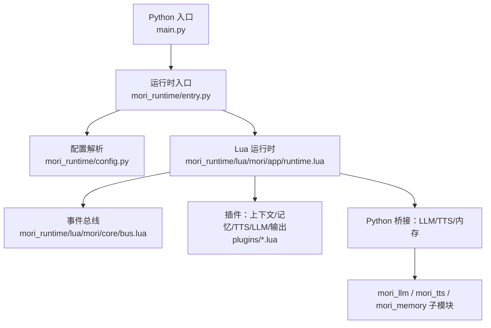
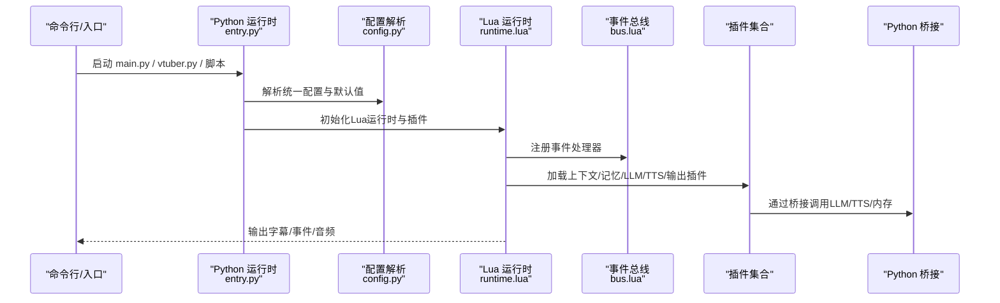
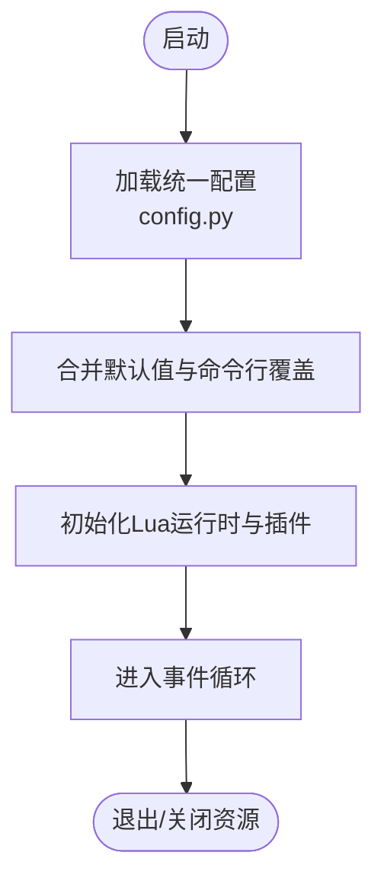
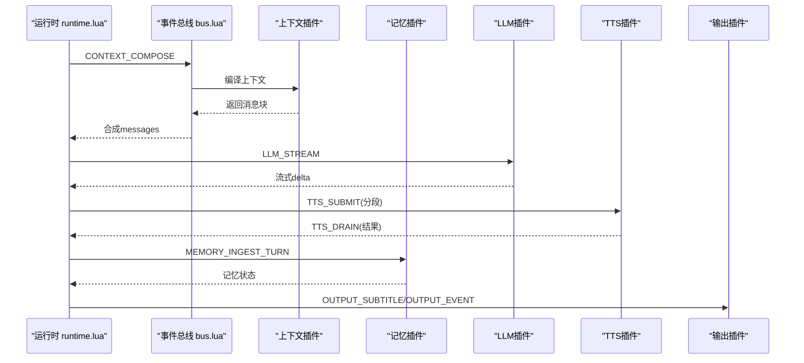
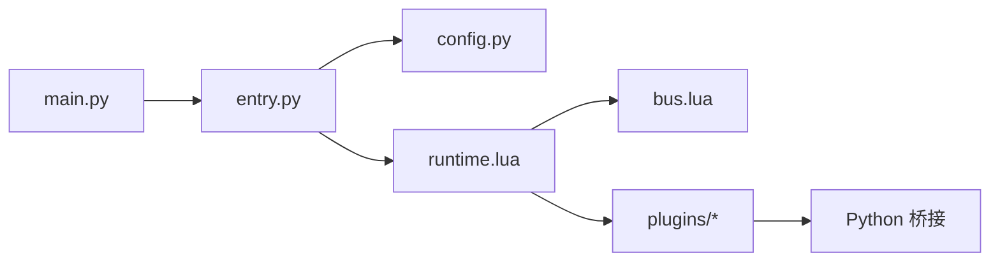

# 故障排除

<cite>
**本文引用的文件**
- [README.md](file://README.md)
- [main.py](file://main.py)
- [mori.config.json](file://mori.config.json)
- [mori_runtime/entry.py](file://mori_runtime/entry.py)
- [mori_runtime/config.py](file://mori_runtime/config.py)
- [mori_runtime/lua/mori/app/runtime.lua](file://mori_runtime/lua/mori/app/runtime.lua)
- [mori_runtime/lua/mori/core/bus.lua](file://mori_runtime/lua/mori/core/bus.lua)
- [mori_runtime/lua/mori/plugins/memory.lua](file://mori_runtime/lua/mori/plugins/memory.lua)
- [mori_runtime/lua/mori/plugins/context.lua](file://mori_runtime/lua/mori/plugins/context.lua)
- [mori_runtime/lua/mori/plugins/live_outputs.lua](file://mori_runtime/lua/mori/plugins/live_outputs.lua)
- [mori_runtime/lua/mori/plugins/llm_llama_server.lua](file://mori_runtime/lua/mori/plugins/llm_llama_server.lua)
- [debug_modules.lua](file://debug_modules.lua)
- [debug_detailed.lua](file://debug_detailed.lua)
- [vtuber.py](file://vtuber.py)
- [scripts/run_bili_vtuber_love2d.py](file://scripts/run_bili_vtuber_love2d.py)
- [scripts/run_bili_vtuber_inochi.py](file://scripts/run_bili_vtuber_inochi.py)
- [mori_runtime/todo.md](file://mori_runtime/todo.md)
</cite>

## 目录
1. [简介](#简介)
2. [项目结构](#项目结构)
3. [核心组件](#核心组件)
4. [架构总览](#架构总览)
5. [详细组件分析](#详细组件分析)
6. [依赖关系分析](#依赖关系分析)
7. [性能考虑](#性能考虑)
8. [故障排除指南](#故障排除指南)
9. [结论](#结论)
10. [附录](#附录)

## 简介
本指南面向Mori系统的使用者与维护者，提供系统化、可操作的故障排除方法。内容涵盖安装与初始化问题、运行时错误、性能瓶颈、日志与事件追踪、调试工具使用、以及预防性维护与最佳实践。文档以实际代码与配置为依据，帮助快速定位并解决问题。

## 项目结构
Mori采用多语言混合架构：Python负责运行时入口、配置解析、TTS与LLM桥接；Lua负责实时运行时、插件系统与事件总线；LuaJIT通过lupa绑定与Python交互；子模块mori_live2d、mori_tts、mori_memory等分别承担渲染、语音与记忆能力。

图表来源
- [main.py:1-13](file://main.py#L1-L13)
- [mori_runtime/entry.py:1-120](file://mori_runtime/entry.py#L1-L120)
- [mori_runtime/config.py:1-120](file://mori_runtime/config.py#L1-L120)
- [mori_runtime/lua/mori/app/runtime.lua:1-120](file://mori_runtime/lua/mori/app/runtime.lua#L1-L120)
- [mori_runtime/lua/mori/core/bus.lua:1-60](file://mori_runtime/lua/mori/core/bus.lua#L1-L60)

章节来源
- [README.md:10-179](file://README.md#L10-L179)
- [main.py:1-13](file://main.py#L1-L13)
- [mori_runtime/entry.py:796-800](file://mori_runtime/entry.py#L796-L800)

## 核心组件
- 运行时入口与参数解析：Python侧统一入口，支持命令行与统一配置文件加载。
- 配置系统：支持通用配置、TTS、CLI、VTuber、Love2D、Inochi等分组，路径解析与默认值合并。
- Lua运行时：事件驱动的实时调度，插件化扩展，支持上下文编排、记忆注入、LLM流式输出、TTS任务队列与中断策略。
- 插件体系：上下文、记忆、LLM、TTS、直播输出等插件通过事件总线协作。
- Python桥接：LLM流式回调、TTS作业提交/取消/回收、stdin与B站弹幕采集线程。

章节来源
- [mori_runtime/entry.py:582-794](file://mori_runtime/entry.py#L582-L794)
- [mori_runtime/config.py:204-270](file://mori_runtime/config.py#L204-L270)
- [mori_runtime/lua/mori/app/runtime.lua:543-668](file://mori_runtime/lua/mori/app/runtime.lua#L543-L668)
- [mori_runtime/lua/mori/core/bus.lua:14-95](file://mori_runtime/lua/mori/core/bus.lua#L14-L95)

## 架构总览
下图展示从Python入口到Lua运行时、插件与外部模块的交互流程。

图表来源
- [main.py:6-11](file://main.py#L6-L11)
- [mori_runtime/entry.py:796-800](file://mori_runtime/entry.py#L796-L800)
- [mori_runtime/config.py:239-270](file://mori_runtime/config.py#L239-L270)
- [mori_runtime/lua/mori/app/runtime.lua:543-563](file://mori_runtime/lua/mori/app/runtime.lua#L543-L563)
- [mori_runtime/lua/mori/core/bus.lua:21-37](file://mori_runtime/lua/mori/core/bus.lua#L21-L37)

## 详细组件分析

### Python运行时与参数解析
- 统一入口：main.py委托运行时入口，返回码用于进程控制。
- 参数解析：支持配置文件、工作目录、模型路径、TTS参数、B站房间参数等。
- 配置加载：自动发现仓库根与当前目录下的统一配置文件，合并默认值与命令行覆盖。

图表来源
- [main.py:6-11](file://main.py#L6-L11)
- [mori_runtime/entry.py:796-800](file://mori_runtime/entry.py#L796-L800)
- [mori_runtime/config.py:239-270](file://mori_runtime/config.py#L239-L270)

章节来源
- [main.py:1-13](file://main.py#L1-L13)
- [mori_runtime/entry.py:582-794](file://mori_runtime/entry.py#L582-L794)
- [mori_runtime/config.py:160-270](file://mori_runtime/config.py#L160-L270)

### Lua运行时与事件总线
- 事件总线：注册/注销事件处理器，emit广播事件，call顺序调用并返回首个非空结果。
- 运行时主循环：从Python Inbox拉取输入，按优先级选择意图，触发上下文编排、LLM流式生成、TTS分段提交、记忆注入与输出。
- 中断策略：根据策略与优先级判断是否打断当前轮次。

图表来源
- [mori_runtime/lua/mori/app/runtime.lua:303-541](file://mori_runtime/lua/mori/app/runtime.lua#L303-L541)
- [mori_runtime/lua/mori/core/bus.lua:50-91](file://mori_runtime/lua/mori/core/bus.lua#L50-L91)
- [mori_runtime/lua/mori/plugins/context.lua:30-87](file://mori_runtime/lua/mori/plugins/context.lua#L30-L87)
- [mori_runtime/lua/mori/plugins/memory.lua:8-26](file://mori_runtime/lua/mori/plugins/memory.lua#L8-L26)
- [mori_runtime/lua/mori/plugins/llm_llama_server.lua:8-21](file://mori_runtime/lua/mori/plugins/llm_llama_server.lua#L8-L21)
- [mori_runtime/lua/mori/plugins/live_outputs.lua:63-111](file://mori_runtime/lua/mori/plugins/live_outputs.lua#L63-L111)

章节来源
- [mori_runtime/lua/mori/app/runtime.lua:543-668](file://mori_runtime/lua/mori/app/runtime.lua#L543-L668)
- [mori_runtime/lua/mori/core/bus.lua:14-95](file://mori_runtime/lua/mori/core/bus.lua#L14-L95)

### 插件体系
- 上下文插件：将记忆块与用户输入合成messages。
- 记忆插件：编译上下文、注入对话回合、清理与标记。
- LLM插件：桥接Python侧LLM流式生成。
- TTS插件：提交/取消/回收TTS作业，记录元数据与延迟。
- 输出插件：写入字幕文件、事件日志，打印到stdout。

章节来源
- [mori_runtime/lua/mori/plugins/context.lua:1-90](file://mori_runtime/lua/mori/plugins/context.lua#L1-L90)
- [mori_runtime/lua/mori/plugins/memory.lua:1-30](file://mori_runtime/lua/mori/plugins/memory.lua#L1-L30)
- [mori_runtime/lua/mori/plugins/llm_llama_server.lua:1-25](file://mori_runtime/lua/mori/plugins/llm_llama_server.lua#L1-L25)
- [mori_runtime/lua/mori/plugins/live_outputs.lua:1-114](file://mori_runtime/lua/mori/plugins/live_outputs.lua#L1-L114)

### Python桥接与TTS作业管理
- TTS作业：提交时生成唯一job_id，异步执行，完成后通过TTS_DRAIN回传结果，支持取消与清理。
- LLM桥接：提供流式回调接口，支持中断检测与异常保护。
- 输入队列：stdin与B站弹幕线程将消息入队，避免阻塞。

章节来源
- [mori_runtime/entry.py:146-413](file://mori_runtime/entry.py#L146-L413)
- [mori_runtime/entry.py:479-580](file://mori_runtime/entry.py#L479-L580)

## 依赖关系分析
- Python入口依赖运行时入口与配置解析。
- Lua运行时依赖事件总线与插件集合。
- 插件通过协议事件与Python桥接交互。
- 配置系统负责路径解析与默认值合并，影响各模块行为。

图表来源
- [main.py:1-13](file://main.py#L1-L13)
- [mori_runtime/entry.py:1-60](file://mori_runtime/entry.py#L1-L60)
- [mori_runtime/config.py:1-40](file://mori_runtime/config.py#L1-L40)
- [mori_runtime/lua/mori/app/runtime.lua:1-20](file://mori_runtime/lua/mori/app/runtime.lua#L1-L20)
- [mori_runtime/lua/mori/core/bus.lua:1-20](file://mori_runtime/lua/mori/core/bus.lua#L1-L20)

章节来源
- [mori_runtime/entry.py:414-438](file://mori_runtime/entry.py#L414-L438)
- [mori_runtime/lua/mori/app/runtime.lua:556-563](file://mori_runtime/lua/mori/app/runtime.lua#L556-L563)

## 性能考虑
- CPU与GPU：LLM推理与TTS生成对计算资源敏感，可通过降低上下文长度、减少预测步数、调整采样参数缓解。
- I/O瓶颈：字幕与事件日志写入频繁，建议使用SSD与合适的缓冲策略。
- 内存占用：Lua运行时队列与Python线程池需合理设置上限，避免内存峰值过高。
- 中断策略：优先级中断可减少等待时间，但需平衡打断频率与稳定性。
- TTS质量档位：高质量档位会增加生成时间与资源消耗，建议按场景切换profile。

## 故障排除指南

### 一、安装与初始化问题
- 症状：缺少依赖导致运行失败。
  - 排查要点：确认已激活虚拟环境并安装依赖；lupa缺失会导致LuaJIT绑定失败。
  - 解决步骤：重新安装依赖，确保Python版本与第三方库兼容。
- 症状：统一配置文件未生效。
  - 排查要点：确认配置文件路径与命名；检查默认工作目录与相对路径解析。
  - 解决步骤：使用绝对路径或修正配置中的相对路径；确认配置键名与分组正确。

章节来源
- [mori_runtime/entry.py:414-418](file://mori_runtime/entry.py#L414-L418)
- [mori_runtime/config.py:160-186](file://mori_runtime/config.py#L160-L186)
- [README.md:17-31](file://README.md#L17-L31)

### 二、运行时错误
- 症状：Lua模块加载失败或事件处理异常。
  - 排查要点：检查事件总线错误事件是否被触发；查看插件注册与协议事件名称。
  - 解决步骤：逐项禁用插件定位问题模块；核对模块导出与依赖。
- 症状：LLM流式回调异常或卡死。
  - 排查要点：确认Python桥接的流式回调是否抛出异常；检查should_abort逻辑。
  - 解决步骤：在回调中捕获异常并停止流式；缩短上下文或降低采样参数。
- 症状：TTS作业长时间无响应。
  - 排查要点：检查TTS_DRAIN是否返回；查看作业队列与线程池状态。
  - 解决步骤：取消超时意图；调整并发与profile；检查外部TTS引擎可用性。

章节来源
- [mori_runtime/lua/mori/core/bus.lua:50-91](file://mori_runtime/lua/mori/core/bus.lua#L50-L91)
- [mori_runtime/lua/mori/app/runtime.lua:448-466](file://mori_runtime/lua/mori/app/runtime.lua#L448-L466)
- [mori_runtime/entry.py:146-188](file://mori_runtime/entry.py#L146-L188)

### 三、日志与事件追踪
- 日志位置：字幕文件与事件日志由输出插件写入；stdout打印用于实时反馈。
- 事件格式：事件日志为JSON行，包含turn、intent_id、segment_idx、wav_path、tts_latency_ms等字段。
- 调试建议：开启print_to_stdout观察实时输出；结合事件日志定位TTS延迟与错误。

章节来源
- [mori_runtime/lua/mori/plugins/live_outputs.lua:63-111](file://mori_runtime/lua/mori/plugins/live_outputs.lua#L63-L111)
- [mori_runtime/lua/mori/app/runtime.lua:222-280](file://mori_runtime/lua/mori/app/runtime.lua#L222-L280)

### 四、性能问题诊断与优化
- CPU使用率高：
  - 降低上下文长度与预测步数；减少并发TTS线程；切换TTS profile至更轻量。
- 内存占用高：
  - 控制队列大小与最大并发；定期清理历史事件；避免重复加载大模型。
- I/O瓶颈：
  - 使用SSD存储；减少事件日志写入频率；批量写入策略。
- 中断策略不当：
  - 调整interrupt_policy为“优先”或“从不”，根据场景权衡响应与稳定性。

章节来源
- [mori_runtime/entry.py:796-794](file://mori_runtime/entry.py#L796-L794)
- [mori_runtime/lua/mori/app/runtime.lua:113-136](file://mori_runtime/lua/mori/app/runtime.lua#L113-L136)

### 五、调试工具与方法
- Lua模块调试：
  - 使用提供的调试脚本加载决策模块，验证模块导出与方法是否存在。
- Lua运行时调试：
  - 在运行时中打印关键事件与状态，逐步缩小问题范围。
- Python调试：
  - 在桥接层添加异常捕获与日志输出，定位回调与线程问题。
- 配置验证：
  - 使用统一配置文件进行最小化复现，逐步加入参数定位问题。

章节来源
- [debug_modules.lua:1-60](file://debug_modules.lua#L1-L60)
- [debug_detailed.lua:1-83](file://debug_detailed.lua#L1-L83)
- [mori_runtime/entry.py:414-418](file://mori_runtime/entry.py#L414-L418)

### 六、社区支持与问题反馈
- 获取帮助：参考项目说明与配置文档，确认环境与参数设置。
- 反馈渠道：遵循项目说明中的贡献与反馈流程（如适用）。

章节来源
- [README.md:10-179](file://README.md#L10-L179)

### 七、预防性维护与最佳实践
- 定期更新：保持Python依赖与子模块最新，关注配置与API变更。
- 配置管理：集中使用统一配置文件，避免散落的命令行参数。
- 监控与告警：建立日志与事件监控，及时发现异常。
- 备份与回滚：重要配置与模型备份，出现问题可快速回滚。
- 性能基线：记录不同配置下的性能指标，作为优化依据。

章节来源
- [mori_runtime/todo.md:1-5](file://mori_runtime/todo.md#L1-L5)
- [mori_runtime/config.py:239-270](file://mori_runtime/config.py#L239-L270)

## 结论
通过统一配置、事件驱动的Lua运行时与Python桥接，Mori实现了模块化与可扩展的AI VTuber系统。本指南提供了从安装、运行、日志、性能到调试与维护的完整排查路径，建议在生产环境中结合监控与基线测试，持续优化系统稳定性与性能表现。

## 附录
- 快速启动入口：main.py、vtuber.py、Love2D/Inochi运行脚本。
- 关键配置：统一配置文件键名与默认值，路径解析规则。
- Lua调试：模块加载与详细调试脚本，辅助定位模块问题。

章节来源
- [main.py:1-13](file://main.py#L1-L13)
- [vtuber.py](file://vtuber.py)
- [scripts/run_bili_vtuber_love2d.py](file://scripts/run_bili_vtuber_love2d.py)
- [scripts/run_bili_vtuber_inochi.py](file://scripts/run_bili_vtuber_inochi.py)
- [mori.config.json:1-83](file://mori.config.json#L1-L83)