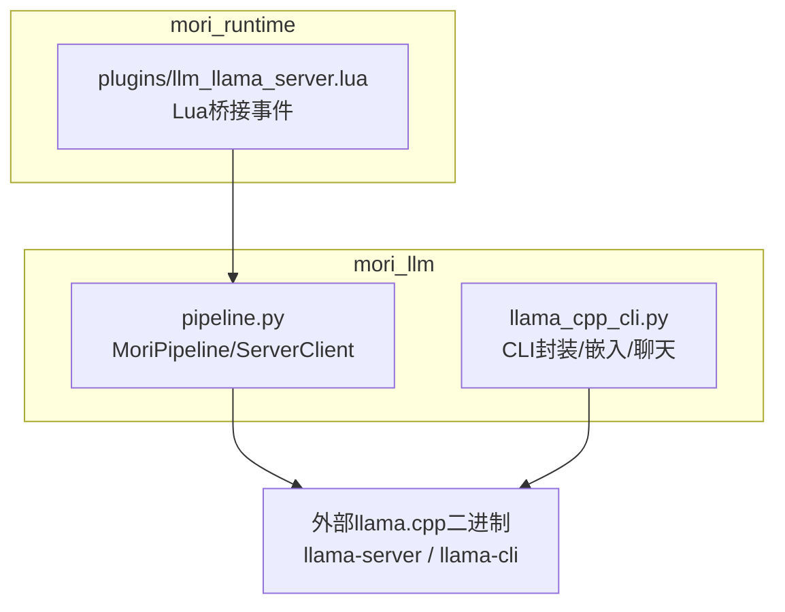
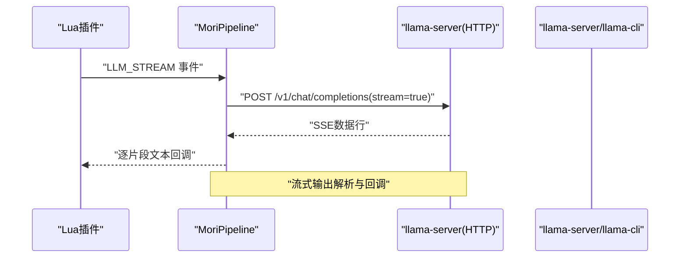
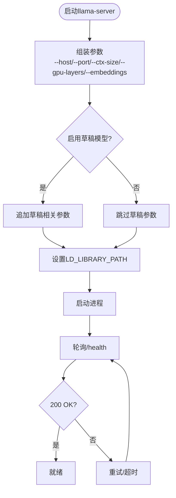
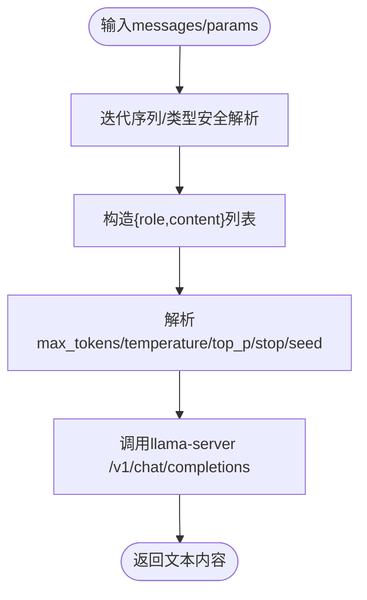
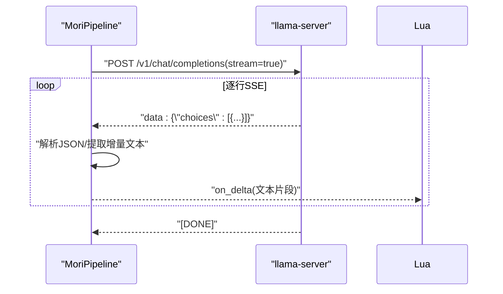
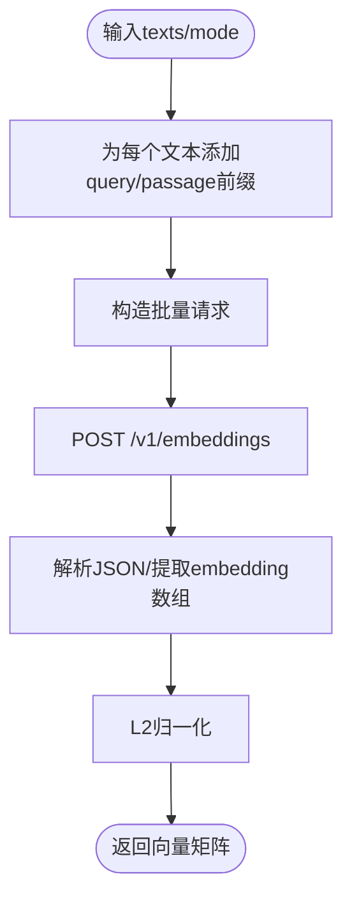
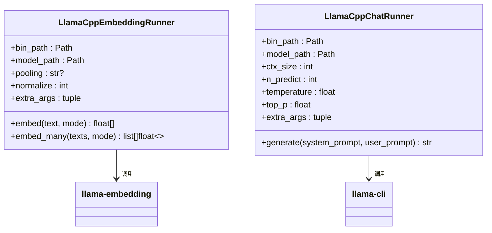
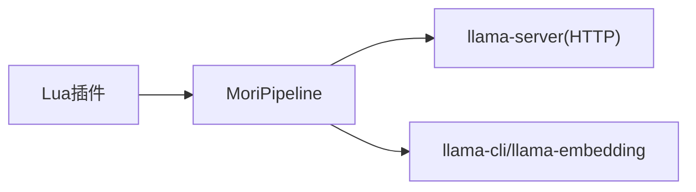

# LLM管道 (mori_llm)

<cite>
**本文引用的文件**
- [mori_llm/__init__.py](file://mori_llm/__init__.py)
- [mori_llm/llama_cpp_cli.py](file://mori_llm/llama_cpp_cli.py)
- [mori_llm/pipeline.py](file://mori_llm/pipeline.py)
- [mori_runtime/lua/mori/plugins/llm_llama_server.lua](file://mori_runtime/lua/mori/plugins/llm_llama_server.lua)
- [mori_runtime/config.py](file://mori_runtime/config.py)
- [README.md](file://README.md)
</cite>

## 目录
1. [简介](#简介)
2. [项目结构](#项目结构)
3. [核心组件](#核心组件)
4. [架构总览](#架构总览)
5. [组件详解](#组件详解)
6. [依赖关系分析](#依赖关系分析)
7. [性能考量](#性能考量)
8. [故障排查指南](#故障排查指南)
9. [结论](#结论)
10. [附录](#附录)

## 简介
本文件面向“mori_llm”LLM管道，系统性梳理其基于llama.cpp的集成方案与MoriPipeline设计。内容涵盖：
- 模型加载机制与推理优化（含草稿模型与上下文大小）
- 内存管理策略（GPU层分配、上下文尺寸、进程生命周期）
- 上下文构建、提示词工程与流式输出处理
- 嵌入向量生成（维度、归一化、批量处理）
- llama.cpp CLI封装（进程管理、参数传递、结果解析）
- 模型选择指南（性能、场景、资源消耗）
- 性能优化技巧、内存监控与错误处理实践

## 项目结构
mori_llm位于仓库的mori_llm目录，主要包含两个模块：
- pipeline.py：MoriPipeline与llama.cpp服务端客户端封装，负责模型加载、聊天与嵌入请求、流式输出、进程生命周期管理
- llama_cpp_cli.py：llama.cpp命令行工具封装，负责嵌入与聊天推理的CLI调用、参数拼装与结果解析

此外，运行时桥接层通过mori_runtime/lua/mori/plugins/llm_llama_server.lua将Lua事件转发至Python侧的MoriPipeline。

图表来源
- [mori_llm/pipeline.py:56-305](file://mori_llm/pipeline.py#L56-L305)
- [mori_llm/llama_cpp_cli.py:90-248](file://mori_llm/llama_cpp_cli.py#L90-L248)
- [mori_runtime/lua/mori/plugins/llm_llama_server.lua:13-20](file://mori_runtime/lua/mori/plugins/llm_llama_server.lua#L13-L20)

章节来源
- [mori_llm/__init__.py:1-3](file://mori_llm/__init__.py#L1-L3)
- [mori_llm/pipeline.py:307-582](file://mori_llm/pipeline.py#L307-L582)
- [mori_llm/llama_cpp_cli.py:1-248](file://mori_llm/llama_cpp_cli.py#L1-L248)
- [mori_runtime/lua/mori/plugins/llm_llama_server.lua:1-25](file://mori_runtime/lua/mori/plugins/llm_llama_server.lua#L1-L25)

## 核心组件
- LlamaCppServerClient：封装llama-server进程生命周期、HTTP接口调用、健康检查、流式SSE解析
- MoriPipeline：高层封装，负责模型加载、上下文构建、提示词工程、同步/流式聊天、嵌入生成与归一化
- LlamaCppEmbeddingRunner/LlamaCppChatRunner：CLI模式下的嵌入与聊天执行器（备用/对比用途）
- SpecConfig：草稿模型推理配置（草稿上下文、采样阈值、GPU层等）

章节来源
- [mori_llm/pipeline.py:22-54](file://mori_llm/pipeline.py#L22-L54)
- [mori_llm/pipeline.py:56-305](file://mori_llm/pipeline.py#L56-L305)
- [mori_llm/pipeline.py:307-582](file://mori_llm/pipeline.py#L307-L582)
- [mori_llm/llama_cpp_cli.py:90-248](file://mori_llm/llama_cpp_cli.py#L90-L248)

## 架构总览
MoriPipeline以“llama-server”为推理后端，通过HTTP API提供聊天与嵌入能力；同时提供CLI封装用于嵌入/聊天的替代路径。Lua桥接层将流式事件转发到Python侧，触发MoriPipeline的流式生成。

图表来源
- [mori_runtime/lua/mori/plugins/llm_llama_server.lua:13-20](file://mori_runtime/lua/mori/plugins/llm_llama_server.lua#L13-L20)
- [mori_llm/pipeline.py:228-290](file://mori_llm/pipeline.py#L228-L290)

章节来源
- [mori_runtime/lua/mori/plugins/llm_llama_server.lua:1-25](file://mori_runtime/lua/mori/plugins/llm_llama_server.lua#L1-L25)
- [mori_llm/pipeline.py:204-290](file://mori_llm/pipeline.py#L204-L290)

## 组件详解

### 1) 模型加载与推理优化
- 进程管理
  - 通过LlamaCppServerClient启动llama-server，自动寻找空闲端口，设置LD_LIBRARY_PATH，等待/校验健康状态
  - 支持API密钥、WebUI/Jinja开关、GPU层分配、草稿模型与推理规格
- 推理优化
  - 草稿模型（SpecConfig）：支持草稿上下文、最小/最大草稿步数、P阈值、草稿GPU层
  - 上下文大小：分别针对大模型与嵌入模型配置ctx_size
  - GPU层：可对主模型与草稿模型分别设置GPU层数量
- 启动超时与健壮性：启动超时控制、进程早退检测、HTTP状态码与JSON解析异常处理

图表来源
- [mori_llm/pipeline.py:105-173](file://mori_llm/pipeline.py#L105-L173)

章节来源
- [mori_llm/pipeline.py:56-173](file://mori_llm/pipeline.py#L56-L173)

### 2) 上下文构建与提示词工程
- 提示词前缀：对输入文本进行“query: ”或“passage: ”前缀规范化，确保嵌入模式一致性
- 消息序列：从Lua/外部输入中提取消息列表，过滤非法条目，保证角色与内容非空
- 参数映射：温度、top_p、max_tokens、stop、seed等参数安全解析与默认值回退

图表来源
- [mori_llm/pipeline.py:462-517](file://mori_llm/pipeline.py#L462-L517)

章节来源
- [mori_llm/pipeline.py:366-391](file://mori_llm/pipeline.py#L366-L391)
- [mori_llm/pipeline.py:462-517](file://mori_llm/pipeline.py#L462-L517)

### 3) 流式输出处理
- SSE解析：逐行读取SSE数据，剥离"data:"前缀，解析JSON，提取delta或text字段
- 回调驱动：将增量文本逐段回调给上层（如Lua桥接层），实现低延迟流式输出
- 超时与中断：支持超时控制与should_abort回调（由上层提供）

图表来源
- [mori_llm/pipeline.py:228-290](file://mori_llm/pipeline.py#L228-L290)

章节来源
- [mori_llm/pipeline.py:228-290](file://mori_llm/pipeline.py#L228-L290)

### 4) 嵌入向量生成
- 输入预处理：对单个或批量文本进行前缀规范化（query/passage）
- 调用嵌入：通过llama-server /v1/embeddings接口提交批量文本
- 归一化：对每个向量进行L2归一化，确保余弦相似度可用
- 返回格式：二维浮点数组，适配后续检索/匹配

图表来源
- [mori_llm/pipeline.py:436-460](file://mori_llm/pipeline.py#L436-L460)
- [mori_llm/pipeline.py:355-363](file://mori_llm/pipeline.py#L355-L363)

章节来源
- [mori_llm/pipeline.py:355-363](file://mori_llm/pipeline.py#L355-L363)
- [mori_llm/pipeline.py:432-460](file://mori_llm/pipeline.py#L432-L460)

### 5) llama.cpp CLI封装
- 嵌入CLI：LlamaCppEmbeddingRunner通过llama-embedding执行嵌入，支持池化与归一化选项，解析JSON输出
- 聊天CLI：LlamaCppChatRunner通过llama-cli执行单轮对话，拼装系统提示与用户提示，解析标准输出
- 二进制定位：resolve_llama_cpp_bin_dir支持多途径定位llama.cpp二进制目录（显式路径、环境变量、默认路径、which）
- 结果解析：对非标准JSON输出进行首JSON对象提取，增强鲁棒性

图表来源
- [mori_llm/llama_cpp_cli.py:90-160](file://mori_llm/llama_cpp_cli.py#L90-L160)
- [mori_llm/llama_cpp_cli.py:162-221](file://mori_llm/llama_cpp_cli.py#L162-L221)

章节来源
- [mori_llm/llama_cpp_cli.py:26-56](file://mori_llm/llama_cpp_cli.py#L26-L56)
- [mori_llm/llama_cpp_cli.py:82-87](file://mori_llm/llama_cpp_cli.py#L82-L87)
- [mori_llm/llama_cpp_cli.py:90-160](file://mori_llm/llama_cpp_cli.py#L90-L160)
- [mori_llm/llama_cpp_cli.py:162-221](file://mori_llm/llama_cpp_cli.py#L162-L221)

### 6) 配置与模型选择
- 配置来源：支持统一配置文件mori.config.json，自动解析相对路径、键映射与默认值
- 模型选择建议（基于代码中的默认偏好与文件名约定）：
  - 嵌入模型：优先选择带有“Embedding”关键词的GGUF；默认偏好为特定尺寸量化版本
  - 聊天模型：默认偏好为特定尺寸与量化配置的聊天模型
- 环境变量与路径：可通过LLAMA_CPP_BIN_DIR或LLAMA_CPP_DIR环境变量指定llama.cpp二进制位置

章节来源
- [mori_runtime/config.py:188-270](file://mori_runtime/config.py#L188-L270)
- [README.md:123-127](file://README.md#L123-L127)
- [mori_llm/llama_cpp_cli.py:59-79](file://mori_llm/llama_cpp_cli.py#L59-L79)

## 依赖关系分析
- 模块内聚：pipeline.py与llama_cpp_cli.py职责清晰，前者聚焦服务端HTTP接口与高层封装，后者聚焦CLI调用
- 外部依赖：依赖llama.cpp二进制（llama-server/llama-cli），通过LD_LIBRARY_PATH与进程环境传递依赖库路径
- 运行时桥接：Lua插件通过事件将流式请求转发至Python侧MoriPipeline

图表来源
- [mori_runtime/lua/mori/plugins/llm_llama_server.lua:13-20](file://mori_runtime/lua/mori/plugins/llm_llama_server.lua#L13-L20)
- [mori_llm/pipeline.py:56-305](file://mori_llm/pipeline.py#L56-L305)
- [mori_llm/llama_cpp_cli.py:90-248](file://mori_llm/llama_cpp_cli.py#L90-L248)

章节来源
- [mori_runtime/lua/mori/plugins/llm_llama_server.lua:1-25](file://mori_runtime/lua/mori/plugins/llm_llama_server.lua#L1-L25)
- [mori_llm/pipeline.py:56-305](file://mori_llm/pipeline.py#L56-L305)
- [mori_llm/llama_cpp_cli.py:1-248](file://mori_llm/llama_cpp_cli.py#L1-L248)

## 性能考量
- GPU层分配：通过--gpu-layers与草稿模型的--gpu-layers-draft精细控制显存占用与吞吐
- 上下文大小：合理设置ctx-size避免过大导致内存压力；嵌入与聊天模型可分别配置
- 草稿模型：SpecConfig提供草稿上下文、采样阈值与步数限制，平衡吞吐与质量
- 流式输出：SSE流式返回降低首字延迟，适合实时交互
- 批量嵌入：通过llama-server批量接口减少往返开销
- 进程管理：atexit注册与手动shutdown确保进程回收，避免僵尸进程

章节来源
- [mori_llm/pipeline.py:70-143](file://mori_llm/pipeline.py#L70-L143)
- [mori_llm/pipeline.py:228-290](file://mori_llm/pipeline.py#L228-L290)
- [mori_llm/pipeline.py:392-430](file://mori_llm/pipeline.py#L392-L430)

## 故障排查指南
- 二进制定位失败：检查LLAMA_CPP_BIN_DIR/LLAMA_CPP_DIR环境变量或显式传入路径
- 进程早退：查看启动日志与健康检查失败原因
- HTTP错误：关注状态码与响应体，确认API密钥、端口与网络可达性
- JSON解析异常：确认输出格式与编码，必要时启用更严格的错误提示
- CLI失败：检查llama-cli/llama-embedding返回码与stderr输出

章节来源
- [mori_llm/llama_cpp_cli.py:26-56](file://mori_llm/llama_cpp_cli.py#L26-L56)
- [mori_llm/pipeline.py:159-173](file://mori_llm/pipeline.py#L159-L173)
- [mori_llm/pipeline.py:184-202](file://mori_llm/pipeline.py#L184-L202)

## 结论
mori_llm通过llama-server提供稳定、可扩展的推理后端，并结合MoriPipeline实现上下文构建、提示词工程、流式输出与嵌入向量生成。其设计强调：
- 明确的进程与生命周期管理
- 可配置的推理优化（草稿模型、上下文大小、GPU层）
- 健壮的错误处理与结果解析
- 与Lua桥接层的无缝协作

## 附录
- 模型选择建议
  - 嵌入模型：优先选择带“Embedding”的GGUF；若无则选择首个可用GGUF
  - 聊天模型：优先选择特定尺寸与量化配置的聊天模型
- 路径与环境
  - 通过LLAMA_CPP_BIN_DIR或LLAMA_CPP_DIR指定llama.cpp二进制目录
  - 使用统一配置文件mori.config.json集中管理路径与参数

章节来源
- [mori_llm/llama_cpp_cli.py:59-79](file://mori_llm/llama_cpp_cli.py#L59-L79)
- [README.md:123-127](file://README.md#L123-L127)
- [mori_runtime/config.py:188-270](file://mori_runtime/config.py#L188-L270)