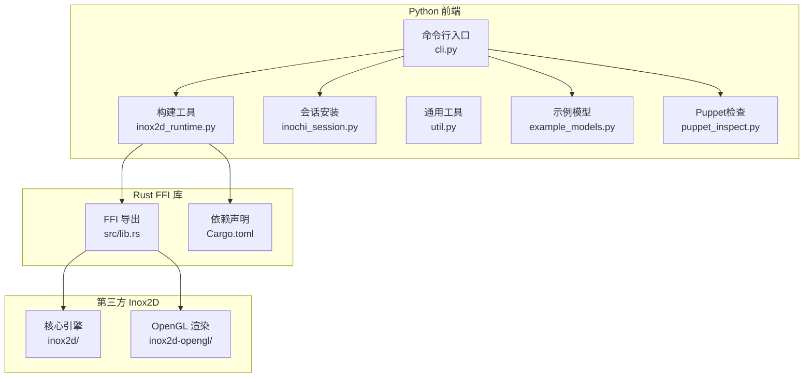
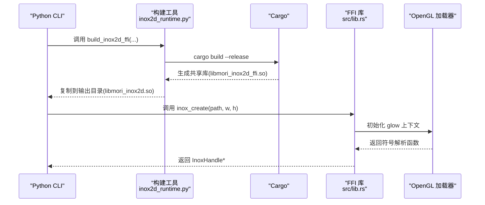
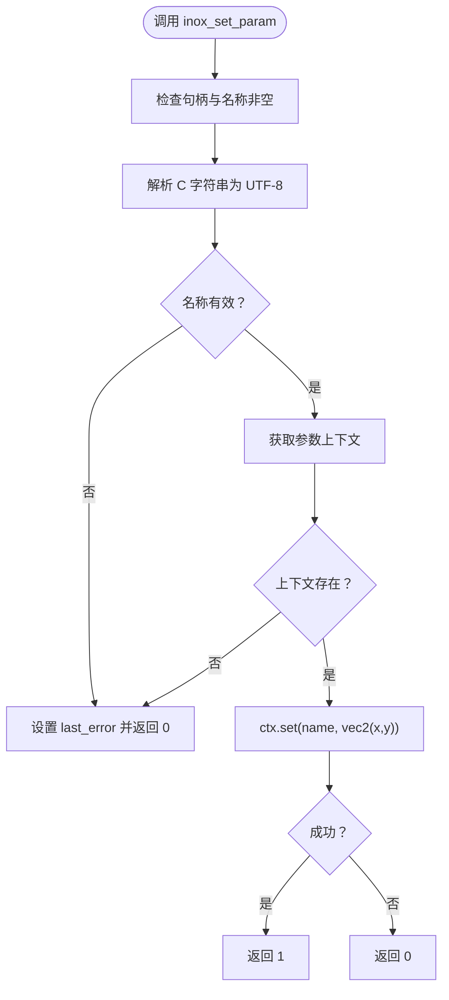
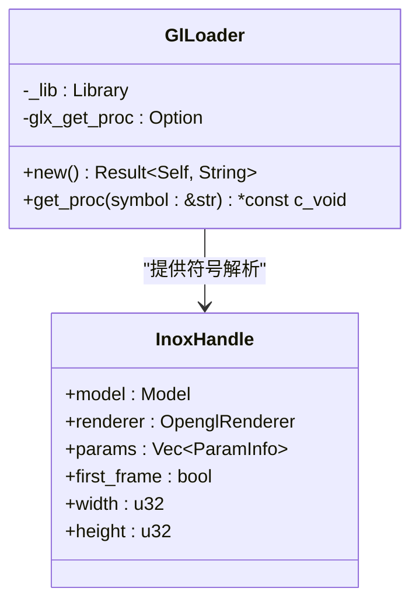
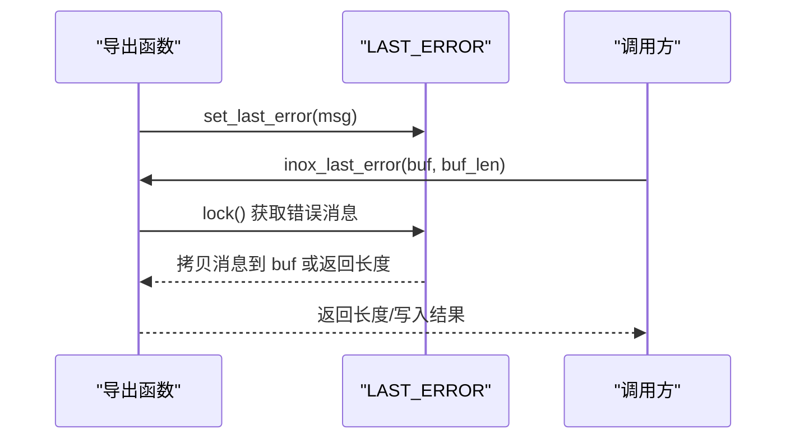
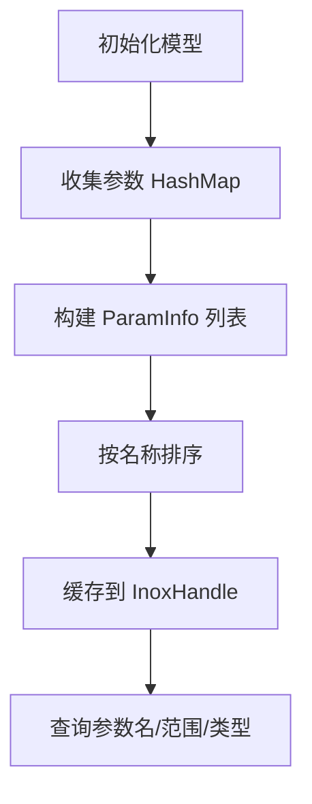
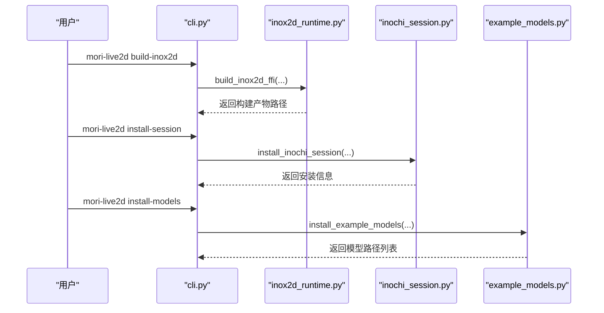
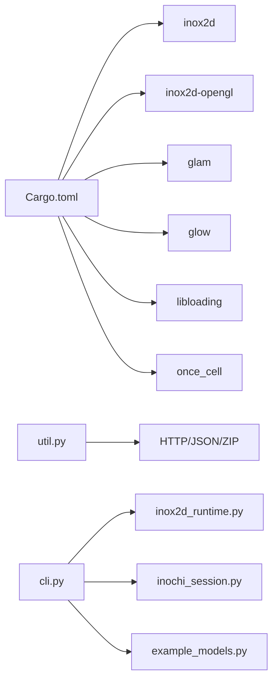

# Inochi2D FFI绑定

<cite>
**本文档引用的文件**
- [lib.rs](file://mori_live2d/native/inox2d_ffi/src/lib.rs)
- [Cargo.toml](file://mori_live2d/native/inox2d_ffi/Cargo.toml)
- [__init__.py](file://mori_live2d/__init__.py)
- [inochi_session.py](file://mori_live2d/inochi_session.py)
- [inox2d_runtime.py](file://mori_live2d/inox2d_runtime.py)
- [example_models.py](file://mori_live2d/example_models.py)
- [cli.py](file://mori_live2d/cli.py)
- [util.py](file://mori_live2d/util.py)
- [puppet_inspect.py](file://mori_live2d/puppet_inspect.py)
- [controller.lua](file://mori_live2d/love2d_frontend/controller.lua)
</cite>

## 目录
1. [简介](#简介)
2. [项目结构](#项目结构)
3. [核心组件](#核心组件)
4. [架构总览](#架构总览)
5. [详细组件分析](#详细组件分析)
6. [依赖分析](#依赖分析)
7. [性能考虑](#性能考虑)
8. [故障排查指南](#故障排查指南)
9. [结论](#结论)
10. [附录](#附录)

## 简介
本文件系统化梳理 Inochi2D 的 Rust 与 Python 互操作（FFI）实现，覆盖以下主题：
- C 函数封装与导出：通过 #[no_mangle] extern "C" 定义稳定的 ABI 接口。
- 数据类型转换：C 字符串、整型、浮点、数组缓冲区与 Rust 类型的互转。
- 内存管理策略：Box 智能指针与裸指针的生命周期管理，错误状态的线程安全存储。
- 错误处理机制：统一的 last_error 缓冲区设计，返回码与错误消息协同。
- 资源生命周期管理：句柄对象的创建/销毁、渲染器初始化、参数缓存。
- Python 绑定与集成：命令行工具链、自动安装与运行 Inochi Session、示例模型下载。
- 性能优化与常见问题：OpenGL 上下文加载、参数设置路径、帧循环开销。

## 项目结构
该仓库将 Inochi2D 的 Rust FFI 实现与 Python 前端工具链并置在同一子项目中，便于本地开发与集成测试。

图表来源
- [cli.py:1-125](file://mori_live2d/cli.py#L1-L125)
- [inox2d_runtime.py:1-64](file://mori_live2d/inox2d_runtime.py#L1-L64)
- [inochi_session.py:1-103](file://mori_live2d/inochi_session.py#L1-L103)
- [example_models.py:1-57](file://mori_live2d/example_models.py#L1-L57)
- [puppet_inspect.py:1-87](file://mori_live2d/puppet_inspect.py#L1-L87)
- [lib.rs:1-375](file://mori_live2d/native/inox2d_ffi/src/lib.rs#L1-L375)
- [Cargo.toml:1-16](file://mori_live2d/native/inox2d_ffi/Cargo.toml#L1-L16)

章节来源
- [cli.py:1-125](file://mori_live2d/cli.py#L1-L125)
- [__init__.py:1-3](file://mori_live2d/__init__.py#L1-L3)

## 核心组件
- FFI 导出层：提供 inox_create、inox_destroy、inox_resize、inox_begin_frame、inox_set_param、inox_end_frame、inox_draw、以及参数查询系列接口。
- OpenGL 加载器：动态加载 libGL 并解析 glXGetProcAddressARB，为 glow 提供符号解析。
- 句柄对象：InoxHandle 封装 Model、OpenglRenderer、参数缓存、尺寸与首帧标志。
- 参数缓存：ParamInfo 列表，按名称排序，支持查询最小/最大范围与是否 vec2。
- 错误状态：LAST_ERROR 使用 Lazy Mutex 保护，提供 inox_last_error 查询与格式化。

章节来源
- [lib.rs:135-375](file://mori_live2d/native/inox2d_ffi/src/lib.rs#L135-L375)

## 架构总览
Rust FFI 层负责模型加载、渲染器初始化、帧推进与参数设置；Python 前端负责构建、安装与运行环境准备。

图表来源
- [inox2d_runtime.py:32-62](file://mori_live2d/inox2d_runtime.py#L32-L62)
- [lib.rs:116-123](file://mori_live2d/native/inox2d_ffi/src/lib.rs#L116-L123)
- [lib.rs:135-197](file://mori_live2d/native/inox2d_ffi/src/lib.rs#L135-L197)

## 详细组件分析

### FFI 导出函数族
- 创建与销毁
  - inox_create：校验路径与UTF-8，读取文件，解析 .inx/.inp，初始化渲染器，返回 Box::into_raw 的裸指针。
  - inox_destroy：空指针检查后，使用 Box::from_raw 安全释放。
- 渲染控制
  - inox_resize：更新句柄尺寸并调用渲染器 resize。
  - inox_begin_frame/inox_end_frame：推进 puppet 的帧循环，首帧 dt 设为 0。
  - inox_draw：清屏、on_begin_draw/on_end_draw 包裹 draw。
- 参数访问
  - inox_param_count/name/is_vec2/minmax：参数缓存查询，支持缓冲区写入与长度探测。
  - inox_set_param：UTF-8 校验、参数上下文有效性检查、设置 vec2 值并返回状态。

图表来源
- [lib.rs:234-257](file://mori_live2d/native/inox2d_ffi/src/lib.rs#L234-L257)

章节来源
- [lib.rs:135-197](file://mori_live2d/native/inox2d_ffi/src/lib.rs#L135-L197)
- [lib.rs:209-290](file://mori_live2d/native/inox2d_ffi/src/lib.rs#L209-L290)
- [lib.rs:292-375](file://mori_live2d/native/inox2d_ffi/src/lib.rs#L292-L375)

### OpenGL 加载器与上下文
- 动态加载 libGL.so.1，并尝试解析 glXGetProcAddressARB 符号。
- 若可用则优先使用其返回的函数指针，否则回退至库内符号查找。
- 将加载器提供的函数指针传给 glow.Context::from_loader_function，完成 OpenGL 上下文初始化。

图表来源
- [lib.rs:43-82](file://mori_live2d/native/inox2d_ffi/src/lib.rs#L43-L82)
- [lib.rs:84-92](file://mori_live2d/native/inox2d_ffi/src/lib.rs#L84-L92)

章节来源
- [lib.rs:41-82](file://mori_live2d/native/inox2d_ffi/src/lib.rs#L41-L82)
- [lib.rs:116-123](file://mori_live2d/native/inox2d_ffi/src/lib.rs#L116-L123)

### 错误处理与 last_error
- 全局 LAST_ERROR 使用 Lazy Mutex 保护，避免竞态。
- inox_last_error 支持两种模式：
  - buf 为空或长度为 0：仅返回所需缓冲区大小（含终止符）。
  - buf 非空：将错误字符串复制到缓冲区并以 0 结尾，返回写入字节数。
- 所有导出函数在失败路径均调用 set_last_error 设置错误信息。

图表来源
- [lib.rs:15-39](file://mori_live2d/native/inox2d_ffi/src/lib.rs#L15-L39)
- [lib.rs:22-39](file://mori_live2d/native/inox2d_ffi/src/lib.rs#L22-L39)

章节来源
- [lib.rs:15-39](file://mori_live2d/native/inox2d_ffi/src/lib.rs#L15-L39)

### 参数缓存与查询
- build_param_cache：从 HashMap 收集 Param，生成有序 Vec<ParamInfo>，包含名称、是否 vec2、min/max。
- inox_param_count/name/is_vec2/minmax：基于索引安全访问，支持缓冲区写入与长度探测。
- 控制器 Lua 侧：根据 Puppet 的参数元数据进行语义映射（如 eye_open、mouth_open），并进行范围归一化。

图表来源
- [lib.rs:102-114](file://mori_live2d/native/inox2d_ffi/src/lib.rs#L102-L114)
- [lib.rs:292-375](file://mori_live2d/native/inox2d_ffi/src/lib.rs#L292-L375)
- [controller.lua:201-452](file://mori_live2d/love2d_frontend/controller.lua#L201-L452)

章节来源
- [lib.rs:102-114](file://mori_live2d/native/inox2d_ffi/src/lib.rs#L102-L114)
- [controller.lua:201-452](file://mori_live2d/love2d_frontend/controller.lua#L201-L452)

### Python 端集成与使用
- 构建共享库：通过 inox2d_runtime.build_inox2d_ffi 调用 cargo build --release，并将产物复制到指定输出目录。
- 自动安装 Inochi Session：根据平台选择资产，下载并解压可执行程序，Linux 下修正可执行权限。
- 示例模型下载：提供 Aka、Midori 等示例 Puppet 文件的下载与放置。
- CLI 主入口：提供 build-inox2d、install-session、install-models、run-session、inspect-puppet 等子命令。

图表来源
- [cli.py:20-121](file://mori_live2d/cli.py#L20-L121)
- [inox2d_runtime.py:32-62](file://mori_live2d/inox2d_runtime.py#L32-L62)
- [inochi_session.py:48-81](file://mori_live2d/inochi_session.py#L48-L81)
- [example_models.py:37-56](file://mori_live2d/example_models.py#L37-L56)

章节来源
- [cli.py:1-125](file://mori_live2d/cli.py#L1-L125)
- [inox2d_runtime.py:1-64](file://mori_live2d/inox2d_runtime.py#L1-L64)
- [inochi_session.py:1-103](file://mori_live2d/inochi_session.py#L1-L103)
- [example_models.py:1-57](file://mori_live2d/example_models.py#L1-L57)

## 依赖分析
- Rust 依赖
  - inox2d 与 inox2d-opengl：核心引擎与 OpenGL 渲染后端。
  - glam：向量与矩阵运算。
  - glow：OpenGL 上下文抽象。
  - libloading：动态库加载（用于解析 GL 符号）。
  - once_cell：延迟初始化。
- Python 工具链
  - urllib、json、zipfile：网络与压缩包处理。
  - subprocess：调用外部程序（如 cargo、inochi-session）。
  - shutil：文件复制与工具函数。

图表来源
- [Cargo.toml:9-16](file://mori_live2d/native/inox2d_ffi/Cargo.toml#L9-L16)
- [util.py:13-67](file://mori_live2d/util.py#L13-L67)
- [cli.py:1-125](file://mori_live2d/cli.py#L1-L125)

章节来源
- [Cargo.toml:1-16](file://mori_live2d/native/inox2d_ffi/Cargo.toml#L1-L16)
- [util.py:1-68](file://mori_live2d/util.py#L1-L68)

## 性能考虑
- OpenGL 上下文初始化：通过动态加载 libGL 并复用 glow 的加载器函数，减少重复解析开销。
- 首帧 dt 处理：首帧强制为 0，避免初始时间步长导致的瞬态抖动。
- 参数设置路径：控制器侧对参数范围进行归一化与平滑插值，降低直接驱动带来的噪声。
- 帧循环：begin_frame/end_frame 成对调用，确保物理与动画系统正确推进。

[本节为通用性能建议，不直接分析具体文件]

## 故障排查指南
- 构建失败
  - 现象：cargo build 报错或未生成共享库。
  - 排查：确认已安装 Rust 工具链；检查 Cargo.toml 路径与依赖；查看构建日志。
  - 参考
    - [inox2d_runtime.py:25-29](file://mori_live2d/inox2d_runtime.py#L25-L29)
    - [inox2d_runtime.py:42-62](file://mori_live2d/inox2d_runtime.py#L42-L62)
- OpenGL 初始化失败
  - 现象：提示 OpenGL loader init failed 或 glXGetProcAddressARB 解析失败。
  - 排查：确认系统已安装 libGL.so.1；检查 LD_LIBRARY_PATH（Linux）；验证 X11/Wayland 环境。
  - 参考
    - [lib.rs:49-63](file://mori_live2d/native/inox2d_ffi/src/lib.rs#L49-L63)
    - [lib.rs:116-123](file://mori_live2d/native/inox2d_ffi/src/lib.rs#L116-L123)
- 参数设置无效
  - 现象：set_param 返回 0。
  - 排查：确认句柄与名称非空；检查 UTF-8 编码；确认参数上下文已初始化；核对参数名大小写与关键字匹配。
  - 参考
    - [lib.rs:234-257](file://mori_live2d/native/inox2d_ffi/src/lib.rs#L234-L257)
    - [controller.lua:477-554](file://mori_live2d/love2d_frontend/controller.lua#L477-L554)
- Puppet 检查
  - 现象：无法解析 .inx/.inp。
  - 排查：确认文件头魔数与长度字段；检查 payload JSON 是否可解析。
  - 参考
    - [puppet_inspect.py:36-57](file://mori_live2d/puppet_inspect.py#L36-L57)

章节来源
- [inox2d_runtime.py:25-29](file://mori_live2d/inox2d_runtime.py#L25-L29)
- [lib.rs:49-63](file://mori_live2d/native/inox2d_ffi/src/lib.rs#L49-L63)
- [lib.rs:116-123](file://mori_live2d/native/inox2d_ffi/src/lib.rs#L116-L123)
- [lib.rs:234-257](file://mori_live2d/native/inox2d_ffi/src/lib.rs#L234-L257)
- [controller.lua:477-554](file://mori_live2d/love2d_frontend/controller.lua#L477-L554)
- [puppet_inspect.py:36-57](file://mori_live2d/puppet_inspect.py#L36-L57)

## 结论
本实现通过稳定的 C ABI 将 Inochi2D 的渲染与参数系统暴露给 Python 环境，结合动态 OpenGL 加载与参数缓存，提供了高效且可维护的跨语言互操作方案。配合 Python 端的构建与安装工具链，能够快速完成本地开发与演示。

[本节为总结性内容，不直接分析具体文件]

## 附录

### 编译配置指南
- 依赖管理
  - 在 Cargo.toml 中声明 inox2d 与 inox2d-opengl 的本地路径依赖，确保版本与上游一致。
  - 保持 glam、glow、libloading、once_cell 的版本稳定。
- 构建脚本
  - 使用 inox2d_runtime.build_inox2d_ffi 执行 cargo build --release，并将产物复制到输出目录。
  - 输出库名约定为 libmori_inox2d.so，便于 Python 前端统一加载。
- 跨平台兼容性
  - Linux：依赖 libGL.so.1，注意 LD_LIBRARY_PATH；可选设置 SDL_VIDEODRIVER=x11。
  - Windows/macOS：根据平台调整动态库扩展名与加载路径。
- 参考
  - [Cargo.toml:9-16](file://mori_live2d/native/inox2d_ffi/Cargo.toml#L9-L16)
  - [inox2d_runtime.py:32-62](file://mori_live2d/inox2d_runtime.py#L32-L62)
  - [inochi_session.py:84-101](file://mori_live2d/inochi_session.py#L84-L101)

章节来源
- [Cargo.toml:1-16](file://mori_live2d/native/inox2d_ffi/Cargo.toml#L1-L16)
- [inox2d_runtime.py:1-64](file://mori_live2d/inox2d_runtime.py#L1-L64)
- [inochi_session.py:1-103](file://mori_live2d/inochi_session.py#L1-L103)

### Python 调用 Rust 的典型流程
- 步骤
  - 通过 cli.py 的 install-session/install-models 子命令准备运行环境与示例模型。
  - 通过 build-inox2d 子命令生成共享库。
  - 在应用中加载共享库并调用 inox_create/resize/begin_frame/set_param/end_frame/draw/destroy。
- 参考
  - [cli.py:20-121](file://mori_live2d/cli.py#L20-L121)
  - [lib.rs:135-197](file://mori_live2d/native/inox2d_ffi/src/lib.rs#L135-L197)
  - [lib.rs:209-290](file://mori_live2d/native/inox2d_ffi/src/lib.rs#L209-L290)
  - [lib.rs:292-375](file://mori_live2d/native/inox2d_ffi/src/lib.rs#L292-L375)

章节来源
- [cli.py:1-125](file://mori_live2d/cli.py#L1-L125)
- [lib.rs:135-375](file://mori_live2d/native/inox2d_ffi/src/lib.rs#L135-L375)