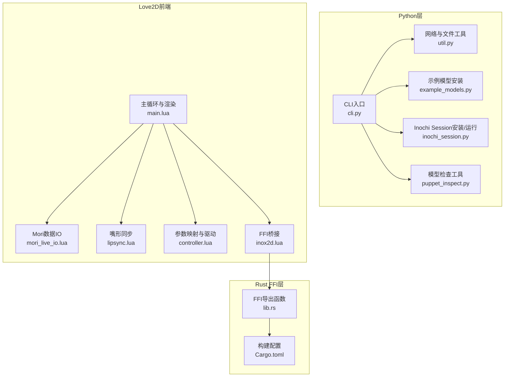
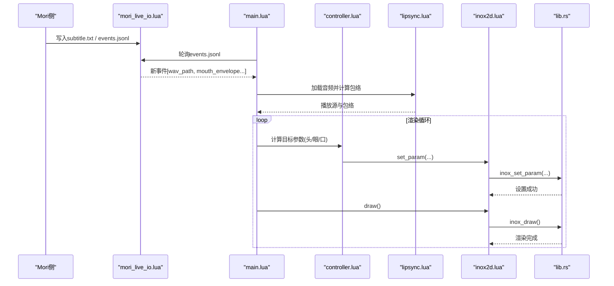
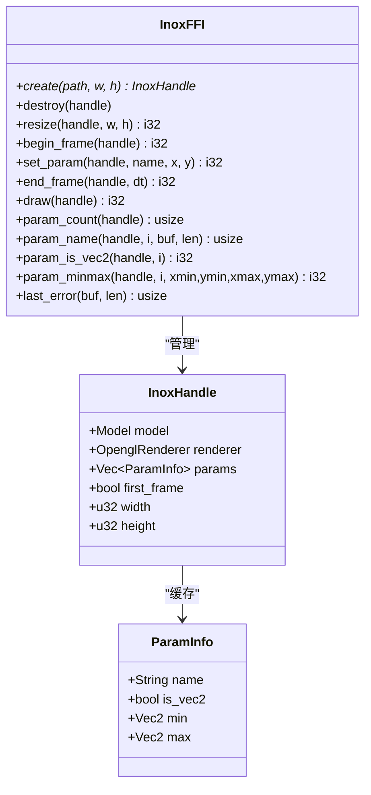
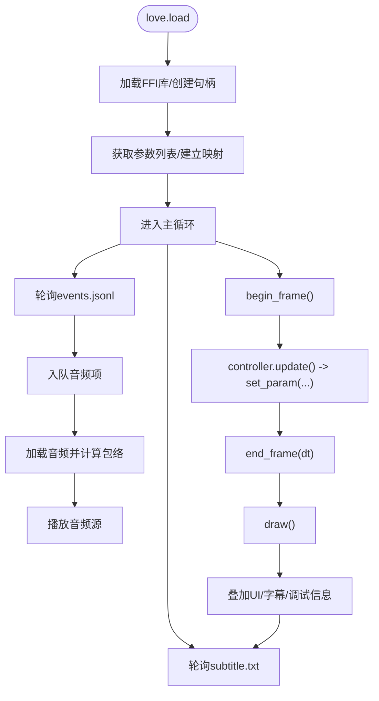
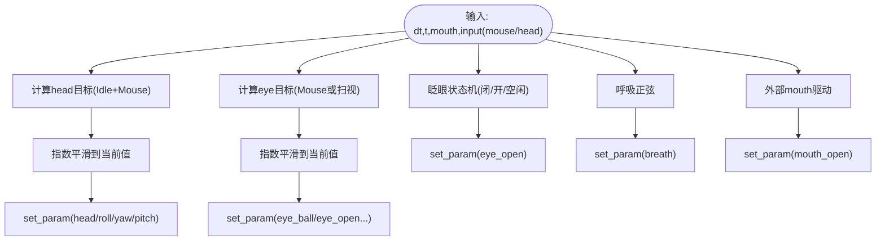
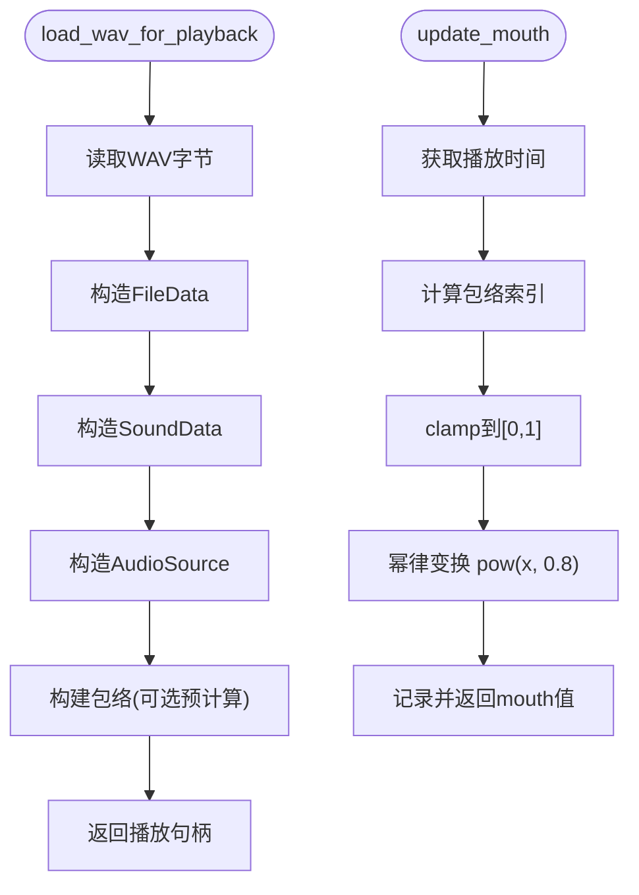
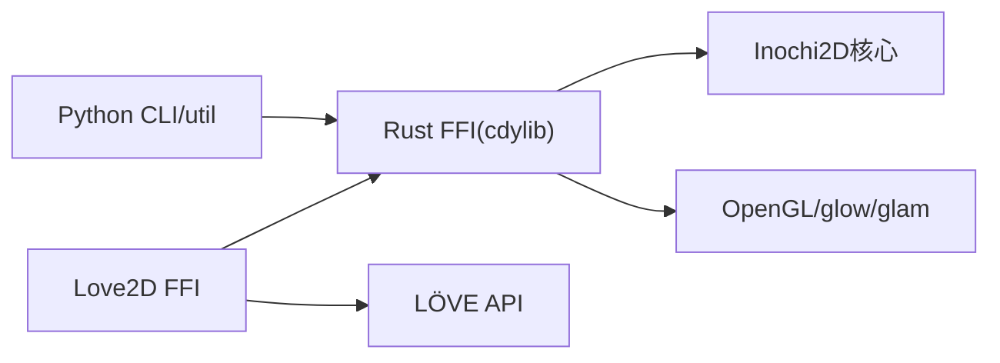

# Live2D集成 (mori_live2d)

<cite>
**本文引用的文件**
- [README.md](file://mori_live2d/README.md)
- [__init__.py](file://mori_live2d/__init__.py)
- [cli.py](file://mori_live2d/cli.py)
- [inochi_session.py](file://mori_live2d/inochi_session.py)
- [inox2d_runtime.py](file://mori_live2d/inox2d_runtime.py)
- [main.lua](file://mori_live2d/love2d_frontend/main.lua)
- [controller.lua](file://mori_live2d/love2d_frontend/controller.lua)
- [lipsync.lua](file://mori_live2d/love2d_frontend/lipsync.lua)
- [inox2d.lua](file://mori_live2d/love2d_frontend/inox2d.lua)
- [mori_live_io.lua](file://mori_live2d/love2d_frontend/mori_live_io.lua)
- [lib.rs](file://mori_live2d/native/inox2d_ffi/src/lib.rs)
- [Cargo.toml](file://mori_live2d/native/inox2d_ffi/Cargo.toml)
- [util.py](file://mori_live2d/util.py)
- [example_models.py](file://mori_live2d/example_models.py)
- [puppet_inspect.py](file://mori_live2d/puppet_inspect.py)
</cite>

## 目录
1. [简介](#简介)
2. [项目结构](#项目结构)
3. [核心组件](#核心组件)
4. [架构总览](#架构总览)
5. [详细组件分析](#详细组件分析)
6. [依赖关系分析](#依赖关系分析)
7. [性能考量](#性能考量)
8. [故障排查指南](#故障排查指南)
9. [结论](#结论)
10. [附录](#附录)

## 简介
本文件面向Live2D集成（mori_live2d）模块，系统化阐述以下内容：
- Inochi2D FFI绑定的实现：Rust与Python的互操作、C函数封装、内存管理策略
- Love2D前端架构：主循环、控制器、嘴形同步系统
- Live2D模型加载与渲染流程：模型验证、纹理管理、动画播放现状
- 嘴形驱动算法：音频特征提取、表情映射、实时同步
- 模型配置指南：模型文件格式、参数映射、性能优化
- OBS集成方案、音频输入配置、调试工具使用示例与最佳实践

## 项目结构
mori_live2d模块采用“Python CLI + Rust FFI + Love2D前端”的分层设计：
- Python层负责：命令行工具、模型安装、会话运行、HTTP下载与ZIP解压、参数映射解析
- Rust层负责：Inochi2D模型解析、OpenGL上下文初始化、参数缓存、帧生命周期、渲染调用
- Love2D前端负责：窗口与渲染循环、事件轮询、参数驱动、UI叠加与调试输出

图表来源
- [cli.py:1-125](file://mori_live2d/cli.py#L1-L125)
- [lib.rs:1-375](file://mori_live2d/native/inox2d_ffi/src/lib.rs#L1-L375)
- [Cargo.toml:1-16](file://mori_live2d/native/inox2d_ffi/Cargo.toml#L1-L16)
- [main.lua:1-631](file://mori_live2d/love2d_frontend/main.lua#L1-L631)
- [mori_live_io.lua:1-263](file://mori_live2d/love2d_frontend/mori_live_io.lua#L1-L263)
- [lipsync.lua:1-128](file://mori_live2d/love2d_frontend/lipsync.lua#L1-L128)
- [controller.lua:1-900](file://mori_live2d/love2d_frontend/controller.lua#L1-L900)
- [inox2d.lua:1-198](file://mori_live2d/love2d_frontend/inox2d.lua#L1-L198)

章节来源
- [README.md:1-157](file://mori_live2d/README.md#L1-L157)
- [__init__.py:1-3](file://mori_live2d/__init__.py#L1-L3)

## 核心组件
- CLI与工具链
  - 构建FFI共享库、安装示例模型、安装/运行Inochi Session、检查.puppet负载
- Rust FFI绑定
  - 导出C接口：创建/销毁句柄、帧开始/结束、参数设置、渲染、参数查询
  - OpenGL上下文与渲染器初始化，参数缓存与范围查询
- Love2D前端
  - 主循环：渲染、参数驱动、UI叠加、事件轮询
  - 控制器：参数映射、头/眼/口驱动、眨眼与扫视
  - 嘴形同步：基于音频包络的实时口型驱动
  - IO：订阅subtitle与events.jsonl，读取TTS音频并驱动口型

章节来源
- [cli.py:1-125](file://mori_live2d/cli.py#L1-L125)
- [lib.rs:135-375](file://mori_live2d/native/inox2d_ffi/src/lib.rs#L135-L375)
- [main.lua:156-631](file://mori_live2d/love2d_frontend/main.lua#L156-L631)
- [controller.lua:201-900](file://mori_live2d/love2d_frontend/controller.lua#L201-L900)
- [lipsync.lua:62-128](file://mori_live2d/love2d_frontend/lipsync.lua#L62-L128)
- [mori_live_io.lua:214-263](file://mori_live2d/love2d_frontend/mori_live_io.lua#L214-L263)

## 架构总览
下图展示从Mori侧生成的TTS音频到Love2D前端渲染的完整链路。

图表来源
- [main.lua:293-399](file://mori_live2d/love2d_frontend/main.lua#L293-L399)
- [mori_live_io.lua:229-260](file://mori_live2d/love2d_frontend/mori_live_io.lua#L229-L260)
- [lipsync.lua:62-128](file://mori_live2d/love2d_frontend/lipsync.lua#L62-L128)
- [controller.lua:700-900](file://mori_live2d/love2d_frontend/controller.lua#L700-L900)
- [inox2d.lua:108-161](file://mori_live2d/love2d_frontend/inox2d.lua#L108-L161)
- [lib.rs:233-290](file://mori_live2d/native/inox2d_ffi/src/lib.rs#L233-L290)

## 详细组件分析

### Rust FFI绑定（lib.rs）
- 设计要点
  - 使用cdylib导出C ABI，供LuaJIT FFI加载
  - InoxHandle封装模型、渲染器、参数缓存与尺寸
  - OpenGL通过libloading动态加载libGL并使用glXGetProcAddressARB获取符号
  - 错误通过全局LAST_ERROR线程安全存储，供C层查询
- 关键导出函数
  - 创建/销毁：inox_create/inox_destroy
  - 生命周期：inox_begin_frame/inox_end_frame/inox_resize
  - 参数：inox_set_param、参数枚举与范围查询
  - 渲染：inox_draw
- 内存管理
  - InoxHandle以Box::into_raw传出指针，由Lua侧通过destroy释放
  - 参数缓存复制为Vec<ParamInfo>，避免跨语言生命周期问题

图表来源
- [lib.rs:84-100](file://mori_live2d/native/inox2d_ffi/src/lib.rs#L84-L100)
- [lib.rs:233-375](file://mori_live2d/native/inox2d_ffi/src/lib.rs#L233-L375)

章节来源
- [lib.rs:135-375](file://mori_live2d/native/inox2d_ffi/src/lib.rs#L135-L375)
- [Cargo.toml:1-16](file://mori_live2d/native/inox2d_ffi/Cargo.toml#L1-L16)

### Love2D前端（main.lua）
- 初始化
  - 解析环境变量与命令行参数，定位subtitle/events路径、puppet与映射文件
  - 加载FFI库，创建Inox2D句柄，获取参数列表与映射控制器
- 渲染循环
  - 低频轮询subtitle与mouth值
  - 每帧调用begin_frame/set_param/end_frame，驱动参数
  - 事件队列中取出wav_path，加载音频并播放，同时更新嘴形包络
  - 绘制后叠加UI与字幕
- 交互
  - 支持拖拽更换puppet
  - 键盘快捷键：H显示帮助、I切换Idle、F切换Mouse Look、B切换Auto Blink、R重载映射

图表来源
- [main.lua:156-283](file://mori_live2d/love2d_frontend/main.lua#L156-L283)
- [main.lua:293-399](file://mori_live2d/love2d_frontend/main.lua#L293-L399)
- [main.lua:401-553](file://mori_live2d/love2d_frontend/main.lua#L401-L553)

章节来源
- [main.lua:156-631](file://mori_live2d/love2d_frontend/main.lua#L156-L631)

### 控制器与参数映射（controller.lua）
- 参数映射策略
  - 支持显式覆盖映射文件（.mori-map或.lua），否则进行关键词模糊匹配
  - 自动发现：优先vec2组合参数，其次标量参数
  - 自动反转：针对“Blink”类参数自动invert以适配“eye_open”语义
- 驱动算法
  - Idle噪声：对head/roll/yaw/pitch注入随机扰动
  - Mouse Look：根据鼠标坐标映射到head yaw/pitch
  - 眨眼：指数退避/恢复曲线，随机延迟
  - 扫视：随机方向与强度，周期性触发
  - 呼吸：周期性正弦信号驱动breath
  - 口型：mouth_open由外部输入（音频包络或mouth.txt）驱动
- 参数设置
  - 根据参数类型（01/有符号/vec2）进行范围映射与可选反转

图表来源
- [controller.lua:201-900](file://mori_live2d/love2d_frontend/controller.lua#L201-L900)

章节来源
- [controller.lua:201-900](file://mori_live2d/love2d_frontend/controller.lua#L201-L900)

### 嘴形同步（lipsync.lua）
- 包络构建
  - 将音频采样按窗口大小求均方根（RMS），归一化得到包络
- 实时驱动
  - 播放时根据当前时间计算索引，取对应包络值并幂律变换（pow(x, 0.8)）后作为mouth_open
- 预计算支持
  - 允许传入预计算包络与持续时间，减少重复计算

图表来源
- [lipsync.lua:62-128](file://mori_live2d/love2d_frontend/lipsync.lua#L62-L128)

章节来源
- [lipsync.lua:62-128](file://mori_live2d/love2d_frontend/lipsync.lua#L62-L128)

### Love2D FFI桥接（inox2d.lua）
- LuaJIT FFI声明与库查找
  - 定义C函数签名，支持64/32位size_t
  - 自动查找libmori_inox2d.so（支持多种工作目录布局）
- 基础封装
  - create/destroy/resize/begin_frame/set_param/end_frame/draw
  - 参数查询：数量、名称、是否vec2、范围
- 错误处理
  - last_error()读取Rust侧LAST_ERROR

章节来源
- [inox2d.lua:1-198](file://mori_live2d/love2d_frontend/inox2d.lua#L1-L198)

### 数据IO（mori_live_io.lua）
- 字幕读取：UTF-8 BOM清理、换行规范化、UTF-8容错
- 事件轮询：基于文件尾部偏移增量读取events.jsonl，提取wav_path与mouth_envelope等字段

章节来源
- [mori_live_io.lua:1-263](file://mori_live2d/love2d_frontend/mori_live_io.lua#L1-L263)

### CLI与辅助工具
- CLI子命令
  - build-inox2d：构建Rust cdylib并复制到model/inochi2d/native
  - install-session/run-session：下载/运行官方Inochi Session
  - install-models：下载示例模型（Aka/Midori）
  - inspect-puppet：读取.puppet负载并统计节点类型
- 工具函数
  - HTTP JSON请求、文件下载、ZIP解压

章节来源
- [cli.py:1-125](file://mori_live2d/cli.py#L1-L125)
- [util.py:13-68](file://mori_live2d/util.py#L13-L68)
- [example_models.py:1-57](file://mori_live2d/example_models.py#L1-L57)
- [puppet_inspect.py:1-87](file://mori_live2d/puppet_inspect.py#L1-L87)
- [inochi_session.py:1-103](file://mori_live2d/inochi_session.py#L1-L103)
- [inox2d_runtime.py:1-64](file://mori_live2d/inox2d_runtime.py#L1-L64)

## 依赖关系分析
- Python依赖
  - urllib、json、zipfile、tempfile、shutil：网络与文件操作
  - libloading（Rust FFI）：动态加载共享库
- Rust依赖
  - inox2d、inox2d-opengl：Inochi2D核心与OpenGL渲染
  - glow、glam：OpenGL上下文与数学类型
  - once_cell：静态初始化
- Love2D依赖
  - LuaJIT FFI：加载Rust cdylib
  - LÖVE API：窗口、渲染、音频、文件系统

图表来源
- [Cargo.toml:9-16](file://mori_live2d/native/inox2d_ffi/Cargo.toml#L9-L16)
- [lib.rs:1-14](file://mori_live2d/native/inox2d_ffi/src/lib.rs#L1-L14)
- [inox2d.lua:1-8](file://mori_live2d/love2d_frontend/inox2d.lua#L1-L8)

章节来源
- [Cargo.toml:1-16](file://mori_live2d/native/inox2d_ffi/Cargo.toml#L1-L16)
- [lib.rs:1-14](file://mori_live2d/native/inox2d_ffi/src/lib.rs#L1-L14)

## 性能考量
- I/O轮询频率
  - subtitle按0.2秒轮询，mouth按0.05秒轮询，避免频繁磁盘访问
- 渲染帧率
  - LÖVE窗口vsync启用，渲染循环受帧率限制
- 包络计算
  - 建议预计算包络并传入，减少每帧音频分析开销
- 参数平滑
  - 指数平滑tau参数可调，平衡响应速度与稳定性
- OpenGL初始化
  - 动态加载libGL，首次初始化成本较高，后续复用上下文

章节来源
- [main.lua:296-304](file://mori_live2d/love2d_frontend/main.lua#L296-L304)
- [main.lua:306-321](file://mori_live2d/love2d_frontend/main.lua#L306-L321)
- [controller.lua:556-592](file://mori_live2d/love2d_frontend/controller.lua#L556-L592)
- [lipsync.lua:94-107](file://mori_live2d/love2d_frontend/lipsync.lua#L94-L107)

## 故障排查指南
- FFI库未找到
  - 确认已执行构建命令并复制到正确路径，或设置MORI_INOX2D_LIB
  - 参考：[构建与库路径:20-27](file://mori_live2d/README.md#L20-L27)，[库查找逻辑:52-75](file://mori_live2d/love2d_frontend/inox2d.lua#L52-L75)
- 模型无法渲染或部分缺失
  - 使用inspect-puppet检查节点类型，若存在未知类型（非MeshGroup等），当前实现可能不支持
  - 参考：[模型检查:95-118](file://mori_live2d/cli.py#L95-L118)，[节点类型统计:60-87](file://mori_live2d/puppet_inspect.py#L60-L87)
- 参数映射不生效
  - 提供.mori-map或.mori.lua覆盖映射，或确保参数名符合关键词匹配规则
  - 参考：[映射文件格式与自动发现:79-96](file://mori_live2d/README.md#L79-L96)，[映射解析:101-167](file://mori_live2d/love2d_frontend/controller.lua#L101-L167)
- Wayland桌面下Inochi Session启动失败
  - 使用--x11强制SDL_VIDEODRIVER=x11
  - 参考：[Session运行参数:46-48](file://mori_live2d/cli.py#L46-L48)，[环境注入:84-101](file://mori_live2d/inochi_session.py#L84-L101)
- 字幕乱码或异常
  - 使用内置UTF-8容错与BOM清理，必要时检查文件编码
  - 参考：[字幕读取与清洗:200-212](file://mori_live2d/love2d_frontend/mori_live_io.lua#L200-L212)

章节来源
- [README.md:10-157](file://mori_live2d/README.md#L10-L157)
- [cli.py:95-118](file://mori_live2d/cli.py#L95-L118)
- [puppet_inspect.py:60-87](file://mori_live2d/puppet_inspect.py#L60-L87)
- [controller.lua:101-167](file://mori_live2d/love2d_frontend/controller.lua#L101-L167)
- [inochi_session.py:84-101](file://mori_live2d/inochi_session.py#L84-L101)
- [mori_live_io.lua:200-212](file://mori_live2d/love2d_frontend/mori_live_io.lua#L200-L212)

## 结论
mori_live2d通过清晰的分层设计实现了从Mori侧到Love2D前端的完整Live2D渲染链路。Rust FFI提供稳定的C接口与OpenGL渲染能力，LuaJIT FFI桥接保证了跨语言互操作的简洁性。控制器与嘴形同步模块提供了可配置的参数驱动与音频包络驱动，满足VTuber场景的基本需求。受限于上游Inox2D实现状态，动画等特性尚未完全可用，建议结合参数映射与预计算包络提升表现与稳定性。

## 附录

### 模型配置指南
- 模型文件格式
  - .inx/.inp负载包含meta、nodes与param，可通过inspect-puppet查看节点类型与参数数量
- 参数映射
  - 支持显式覆盖（.mori-map/.mori.lua）与自动发现（关键词匹配）
  - 可对左右/轴向参数进行反转向量化
- 性能优化
  - 预计算音频包络，降低每帧CPU开销
  - 调整平滑tau与轮询频率，平衡流畅度与资源占用

章节来源
- [README.md:79-96](file://mori_live2d/README.md#L79-L96)
- [puppet_inspect.py:36-87](file://mori_live2d/puppet_inspect.py#L36-L87)
- [lipsync.lua:94-107](file://mori_live2d/love2d_frontend/lipsync.lua#L94-L107)

### OBS集成方案与音频输入
- OBS最小配置
  - 角色层：捕获Love2D窗口
  - 字幕层：添加“文本（从文件读取）”，指向live/subtitle.txt
- 音频输入
  - 使用events.jsonl中的wav_path驱动嘴形同步
  - 可配合系统音频路由或虚拟音频设备实现稳定输入
- 调试与最佳实践
  - 使用H键显示映射与调试信息，便于观察参数驱动效果
  - 在分布式/远程部署中建议关闭Mouse Look或通过环境变量强制关闭

章节来源
- [README.md:136-142](file://mori_live2d/README.md#L136-L142)
- [main.lua:555-588](file://mori_live2d/love2d_frontend/main.lua#L555-L588)
- [README.md:65-66](file://mori_live2d/README.md#L65-L66)