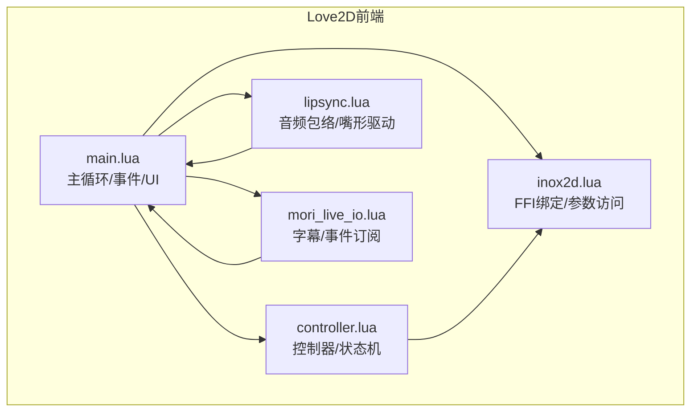
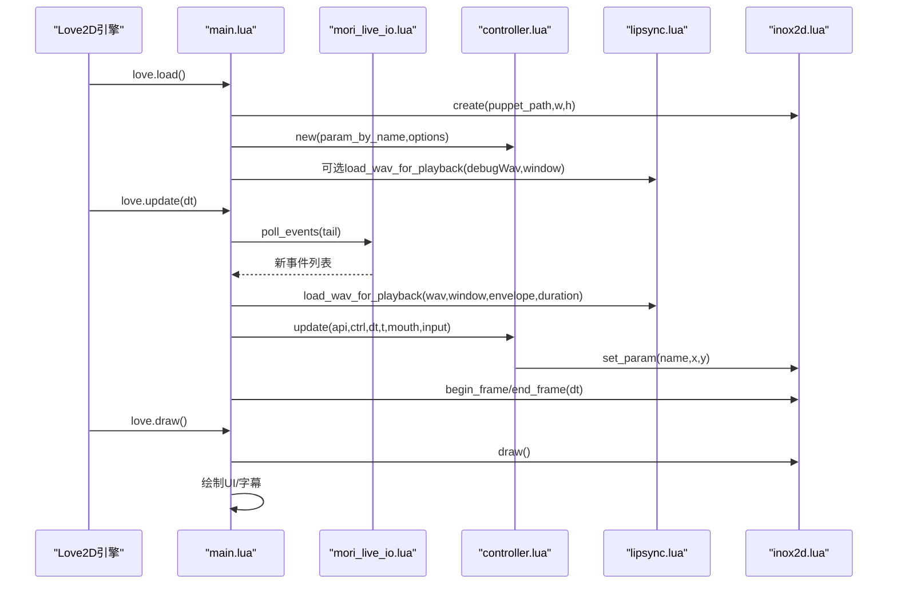
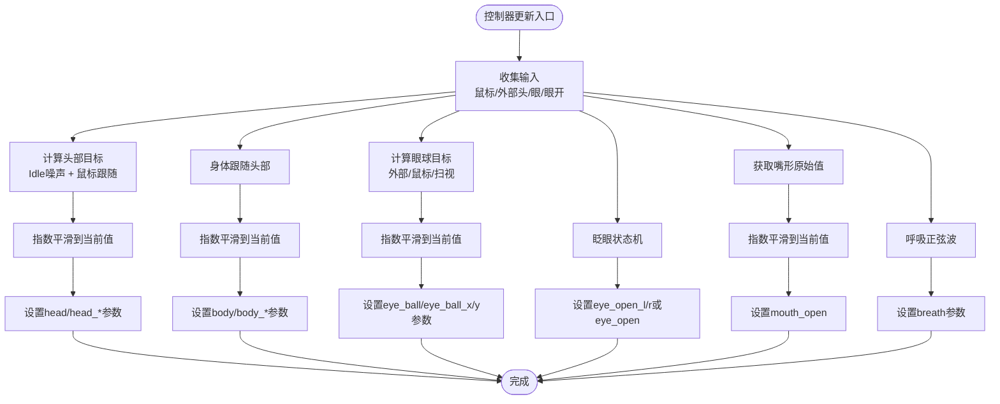
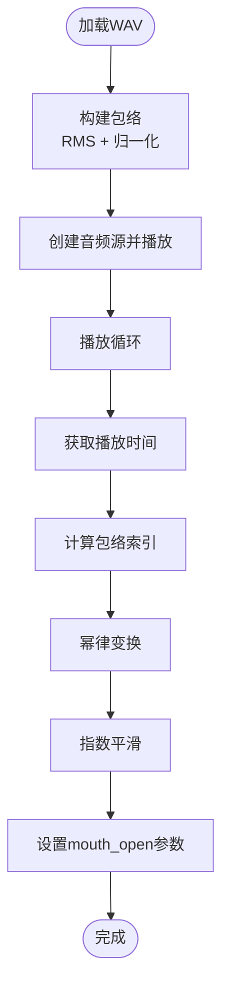
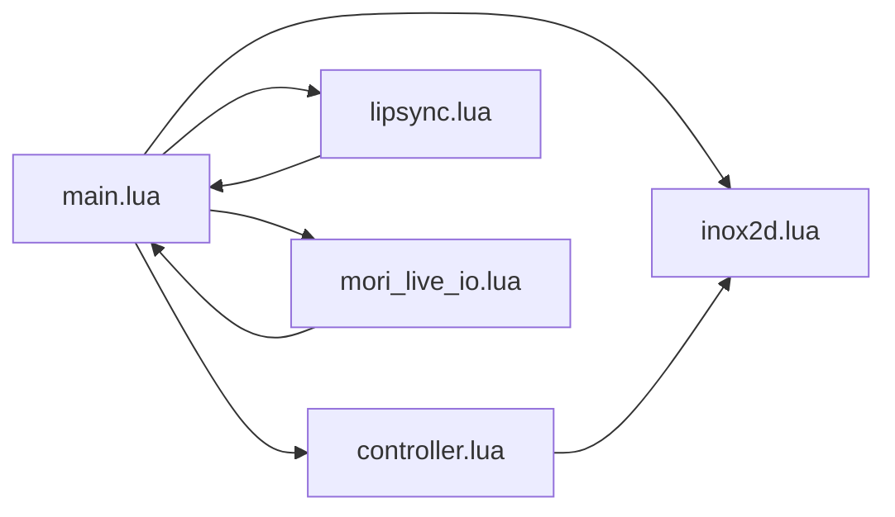

# Love2D前端系统

<cite>
**本文档引用的文件**
- [main.lua](file://mori_live2d/love2d_frontend/main.lua)
- [controller.lua](file://mori_live2d/love2d_frontend/controller.lua)
- [lipsync.lua](file://mori_live2d/love2d_frontend/lipsync.lua)
- [inox2d.lua](file://mori_live2d/love2d_frontend/inox2d.lua)
- [mori_live_io.lua](file://mori_live2d/love2d_frontend/mori_live_io.lua)
- [cli.py](file://mori_live2d/cli.py)
- [README.md](file://mori_live2d/README.md)
</cite>

## 目录
1. [简介](#简介)
2. [项目结构](#项目结构)
3. [核心组件](#核心组件)
4. [架构总览](#架构总览)
5. [详细组件分析](#详细组件分析)
6. [依赖关系分析](#依赖关系分析)
7. [性能考虑](#性能考虑)
8. [故障排除指南](#故障排除指南)
9. [结论](#结论)
10. [附录](#附录)

## 简介
本文件面向Love2D前端系统，围绕Inochi2D（Live2D替代）渲染管线与Mori AI流程的集成，系统性阐述以下主题：
- 主循环架构设计：帧率控制、事件处理、渲染管线
- 控制器模块：用户输入处理、状态管理、UI交互
- 嘴形同步系统：音频特征提取、表情参数计算、实时动画更新
- Inochi2D Lua绑定：模型加载、动画播放、参数调节
- Love2D配置指南：窗口设置、渲染优化、音频集成
- 实战示例：启动前端、事件处理、调试渲染问题、性能调优最佳实践

## 项目结构
Love2D前端位于 `mori_live2d/love2d_frontend/`，核心文件如下：
- main.lua：Love2D入口，负责初始化、主循环、事件分发、渲染与UI绘制
- controller.lua：控制器逻辑，负责参数映射、状态机与行为驱动
- lipsync.lua：嘴形同步算法，基于音频包络驱动口型参数
- inox2d.lua：Inochi2D LuaJIT FFI绑定，封装底层OpenGL渲染与参数访问
- mori_live_io.lua：Mori侧IO工具，订阅字幕与事件流，解析TTS事件

图表来源
- [main.lua:156-631](file://mori_live2d/love2d_frontend/main.lua#L156-L631)
- [controller.lua:601-900](file://mori_live2d/love2d_frontend/controller.lua#L601-L900)
- [lipsync.lua:1-128](file://mori_live2d/love2d_frontend/lipsync.lua#L1-L128)
- [mori_live_io.lua:1-263](file://mori_live2d/love2d_frontend/mori_live_io.lua#L1-L263)
- [inox2d.lua:1-198](file://mori_live2d/love2d_frontend/inox2d.lua#L1-L198)

章节来源
- [main.lua:156-631](file://mori_live2d/love2d_frontend/main.lua#L156-L631)
- [controller.lua:601-900](file://mori_live2d/love2d_frontend/controller.lua#L601-L900)
- [lipsync.lua:1-128](file://mori_live2d/love2d_frontend/lipsync.lua#L1-L128)
- [mori_live_io.lua:1-263](file://mori_live2d/love2d_frontend/mori_live_io.lua#L1-L263)
- [inox2d.lua:1-198](file://mori_live2d/love2d_frontend/inox2d.lua#L1-L198)

## 核心组件
- 主循环与生命周期
  - 初始化：窗口、字体、渲染器信息、路径解析、FFI库加载、模型加载与参数枚举、控制器初始化
  - 更新：字幕轮询、嘴形值轮询、FFI帧开始/结束、控制器更新、事件队列处理、音频播放队列调度
  - 渲染：清屏、调用FFI绘制、重置LÖVE图形状态、绘制UI与字幕
  - 键盘与文件拖放：热键切换功能、动态更换皮套
- 控制器模块
  - 参数映射：关键词模糊匹配与覆盖映射，自动推断反转
  - 状态机：Idle随机抖动、鼠标跟随、眨眼、眼球扫视、呼吸
  - 参数驱动：指数平滑插值，将状态映射到参数空间
- 嘴形同步系统
  - 包络构建：按时间窗聚合采样能量，归一化
  - 播放驱动：根据播放进度索引包络，幂律变换，平滑输出
- Inochi2D Lua绑定
  - FFI声明与库查找、错误查询
  - 创建/销毁、尺寸调整、帧开始/结束、参数设置、绘制、参数枚举
- IO工具
  - 字幕读取：UTF-8 BOM处理、换行规范化、UTF-8容错
  - 事件尾部追踪：基于文件偏移增量读取events.jsonl，提取wav与包络参数

章节来源
- [main.lua:156-631](file://mori_live2d/love2d_frontend/main.lua#L156-L631)
- [controller.lua:201-452](file://mori_live2d/love2d_frontend/controller.lua#L201-L452)
- [controller.lua:700-872](file://mori_live2d/love2d_frontend/controller.lua#L700-L872)
- [lipsync.lua:31-125](file://mori_live2d/love2d_frontend/lipsync.lua#L31-L125)
- [mori_live_io.lua:200-260](file://mori_live2d/love2d_frontend/mori_live_io.lua#L200-L260)
- [inox2d.lua:108-195](file://mori_live2d/love2d_frontend/inox2d.lua#L108-L195)

## 架构总览
Love2D前端采用“事件驱动 + 状态机”的主循环模式，通过FFI桥接到Inochi2D渲染引擎，结合Mori侧事件流实现TTS驱动的嘴形同步。

图表来源
- [main.lua:293-399](file://mori_live2d/love2d_frontend/main.lua#L293-L399)
- [mori_live_io.lua:229-260](file://mori_live2d/love2d_frontend/mori_live_io.lua#L229-L260)
- [controller.lua:700-872](file://mori_live2d/love2d_frontend/controller.lua#L700-L872)
- [lipsync.lua:62-107](file://mori_live2d/love2d_frontend/lipsync.lua#L62-L107)
- [inox2d.lua:108-161](file://mori_live2d/love2d_frontend/inox2d.lua#L108-L161)

## 详细组件分析

### 主循环与帧率控制
- 初始化阶段
  - 设置窗口标题与大小，启用垂直同步
  - 加载字体与渲染器信息
  - 解析环境变量与命令行参数，确定live目录、字幕文件、事件日志、模型路径、映射路径、截图路径
  - 加载FFI库，校验可用性
  - 创建Inochi2D句柄，获取参数列表与按名映射
  - 初始化控制器，应用鼠标跟随选项
- 更新阶段
  - 字幕轮询（低频，避免频繁磁盘I/O）
  - 嘴形值轮询（TTS流）
  - FFI帧开始/结束包裹，确保渲染状态正确
  - 控制器更新：根据输入（鼠标、外部头/眼/眼开）、当前播放的音频包络或调试值，驱动参数
  - 事件轮询：从events.jsonl中发现新wav，入队播放
  - 音频播放：空闲时出队并播放，播放结束后清理
- 渲染阶段
  - 清屏，调用FFI绘制，必要时重置LÖVE图形状态
  - 绘制调试信息、帮助、映射表、字幕覆盖层
- 键盘与文件拖放
  - 热键切换Idle、Mouse Look、Auto Blink、重新加载映射
  - 支持拖拽.inx/.inp更换模型

章节来源
- [main.lua:156-283](file://mori_live2d/love2d_frontend/main.lua#L156-L283)
- [main.lua:293-399](file://mori_live2d/love2d_frontend/main.lua#L293-L399)
- [main.lua:401-553](file://mori_live2d/love2d_frontend/main.lua#L401-L553)
- [main.lua:555-626](file://mori_live2d/love2d_frontend/main.lua#L555-L626)

### 控制器模块实现
- 参数映射
  - 关键词模糊匹配：优先组合vec2参数（如head/body），再回退到标量参数
  - 覆盖映射：支持.mori-map与.mori.lua两种格式，支持参数名反向（!前缀）
  - 自动映射：若未提供映射文件，尝试在皮套同目录下查找候选
  - 自动反转：针对“Blink”类参数自动推断反转
- 状态机与行为
  - Idle随机抖动：对head roll/yaw/pitch注入噪声
  - 鼠标跟随：将屏幕坐标转换为标准化输入，驱动head与eyes
  - 眨眼：基于随机延迟的闭合/开启状态机，使用缓动函数
  - 眼球扫视：随机方向与强度的saccade，间隔随机
  - 呼吸：正弦波幅度驱动breath参数
- 参数驱动
  - 指数平滑：exp_smooth(dt,tau)实现自然过渡
  - 数值域映射：将[-1..1]或[0..1]范围映射到参数min/max
  - 多种模式：vec2_signed、signed、01三种模式分别对应不同参数类型

图表来源
- [controller.lua:700-872](file://mori_live2d/love2d_frontend/controller.lua#L700-L872)

章节来源
- [controller.lua:201-452](file://mori_live2d/love2d_frontend/controller.lua#L201-L452)
- [controller.lua:556-592](file://mori_live2d/love2d_frontend/controller.lua#L556-L592)
- [controller.lua:700-872](file://mori_live2d/love2d_frontend/controller.lua#L700-L872)

### 嘴形同步系统算法
- 音频包络构建
  - 以固定时间窗（秒）滑动，对采样点求平方和，计算RMS，归一化至[0..1]
- 播放驱动
  - 播放源tell获取当前秒数，换算包络索引
  - 对包络值进行幂律变换（如0.8）以增强感知
  - 指数平滑到当前值，设置mouth_open参数
- 调试与预计算
  - 支持预计算包络与持续时间覆盖
  - 支持调试wav循环播放，便于测试

图表来源
- [lipsync.lua:31-125](file://mori_live2d/love2d_frontend/lipsync.lua#L31-L125)

章节来源
- [lipsync.lua:31-125](file://mori_live2d/love2d_frontend/lipsync.lua#L31-L125)

### Inochi2D Lua绑定使用
- 库加载与查找
  - 通过环境变量或工作目录候选查找共享库
  - FFI声明底层C接口，提供错误查询
- 基本操作
  - create/destroy：创建与销毁句柄
  - resize：窗口变化时调整渲染尺寸
  - begin_frame/end_frame：帧边界调用
  - set_param：按名称设置参数值（支持vec2）
  - draw：绘制
  - get_parameters：枚举参数名、范围、是否vec2
- 错误处理
  - last_error：查询最近错误字符串
  - 所有操作均返回布尔或结果元组，便于上层健壮性处理

章节来源
- [inox2d.lua:52-89](file://mori_live2d/love2d_frontend/inox2d.lua#L52-L89)
- [inox2d.lua:108-195](file://mori_live2d/love2d_frontend/inox2d.lua#L108-L195)

### Love2D配置指南
- 窗口设置
  - 标题、大小、可调整、垂直同步
- 字体与渲染
  - 自动检测CJK字体，支持环境变量与命令行参数
  - 渲染器信息打印，便于诊断
- 音频集成
  - WAV文件读取、SoundData创建、Source播放
  - 包络预计算与持续时间覆盖
- 路径与映射
  - live目录、subtitle.txt、events.jsonl、puppet路径、映射文件路径
  - 支持拖拽更换模型

章节来源
- [main.lua:156-283](file://mori_live2d/love2d_frontend/main.lua#L156-L283)
- [main.lua:401-553](file://mori_live2d/love2d_frontend/main.lua#L401-L553)
- [lipsync.lua:62-107](file://mori_live2d/love2d_frontend/lipsync.lua#L62-L107)

## 依赖关系分析
- 模块耦合
  - main.lua高度依赖controller、lipsync、mori_live_io、inox2d
  - controller与controller.lua内部紧密耦合，但对外仅暴露new与update
  - lipsync与mori_live_io相对独立，主要被main.lua调用
- 外部依赖
  - LuaJIT FFI：必须使用LÖVE 11.x（LuaJIT）
  - Rust构建产物：libmori_inox2d.so（通过CLI构建）
  - 音频：LÖVE音频子系统
- 潜在循环依赖
  - 无直接循环，各模块职责清晰

图表来源
- [main.lua:15-18](file://mori_live2d/love2d_frontend/main.lua#L15-L18)
- [controller.lua:1-11](file://mori_live2d/love2d_frontend/controller.lua#L1-L11)
- [lipsync.lua:1-11](file://mori_live2d/love2d_frontend/lipsync.lua#L1-L11)
- [mori_live_io.lua:1-11](file://mori_live2d/love2d_frontend/mori_live_io.lua#L1-L11)
- [inox2d.lua:1-7](file://mori_live2d/love2d_frontend/inox2d.lua#L1-L7)

章节来源
- [main.lua:15-18](file://mori_live2d/love2d_frontend/main.lua#L15-L18)
- [controller.lua:1-11](file://mori_live2d/love2d_frontend/controller.lua#L1-L11)
- [lipsync.lua:1-11](file://mori_live2d/love2d_frontend/lipsync.lua#L1-L11)
- [mori_live_io.lua:1-11](file://mori_live2d/love2d_frontend/mori_live_io.lua#L1-L11)
- [inox2d.lua:1-7](file://mori_live2d/love2d_frontend/inox2d.lua#L1-L7)

## 性能考虑
- I/O轮询频率
  - 字幕与嘴形值轮询采用低频（0.2s与0.05s），减少磁盘压力
- 渲染状态管理
  - FFI绘制后重置LÖVE图形状态，避免状态污染
- 平滑与缓动
  - 指数平滑与缓动函数保证动画自然，降低高频抖动
- 资源释放
  - 退出时销毁FFI句柄，避免泄漏
- 建议
  - 在高负载场景下适当提高轮询间隔
  - 使用映射文件减少参数查找成本
  - 预计算包络以减少实时计算

[本节为通用指导，无需特定文件来源]

## 故障排除指南
- FFI库缺失
  - 现象：提示缺少LuaJIT FFI或无法加载libmori_inox2d.so
  - 处理：使用CLI构建FFI库并设置MORI_INOX2D_LIB或放置于候选路径
- 模型加载失败
  - 现象：提示puppet文件不存在或加载失败
  - 处理：检查路径、权限与文件格式；确认Inochi2D实现支持的节点类型
- 参数映射不生效
  - 现象：头部/眼部/嘴部无响应
  - 处理：提供.mori-map或.mori.lua映射文件；检查参数名大小写与关键词匹配
- 音频播放异常
  - 现象：WAV读取失败或无法播放
  - 处理：确认文件存在且可读；检查包络构建与播放源创建
- 渲染状态异常
  - 现象：UI绘制错乱或崩溃
  - 处理：确保在draw中FFI绘制后调用love.graphics.reset；检查窗口尺寸变化处理

章节来源
- [README.md:10-15](file://mori_live2d/README.md#L10-L15)
- [main.lua:226-242](file://mori_live2d/love2d_frontend/main.lua#L226-L242)
- [main.lua:628-631](file://mori_live2d/love2d_frontend/main.lua#L628-L631)
- [lipsync.lua:62-107](file://mori_live2d/love2d_frontend/lipsync.lua#L62-L107)
- [mori_live_io.lua:200-260](file://mori_live2d/love2d_frontend/mori_live_io.lua#L200-L260)
- [inox2d.lua:91-106](file://mori_live2d/love2d_frontend/inox2d.lua#L91-L106)

## 结论
本Love2D前端系统以轻量、可扩展为目标，通过FFI桥接Inochi2D渲染引擎，结合Mori侧事件流实现TTS驱动的嘴形同步与基础面部控制。控制器模块提供可配置的状态机与参数映射，满足不同皮套的适配需求。通过合理的轮询策略、平滑插值与资源管理，系统在保证视觉效果的同时兼顾性能与稳定性。建议在生产环境中配合映射文件与预计算包络，进一步提升一致性与效率。

[本节为总结，无需特定文件来源]

## 附录

### 启动前端与基本操作
- 构建Inox2D FFI库
  - 使用Python CLI构建并复制到model/inochi2d/native/
- 运行Love2D前端
  - 在仓库根目录运行LÖVE前端
- 环境变量与命令行参数
  - live目录、字幕路径、事件日志、模型路径、映射路径、鼠标跟随、字体路径与大小
- 热键
  - H：显示/隐藏帮助与映射
  - I：开关Idle
  - F：开关Mouse Look
  - B：开关Auto Blink
  - R：重新加载映射

章节来源
- [README.md:20-66](file://mori_live2d/README.md#L20-L66)
- [main.lua:53-80](file://mori_live2d/love2d_frontend/main.lua#L53-L80)
- [main.lua:555-588](file://mori_live2d/love2d_frontend/main.lua#L555-L588)

### 事件处理与调试
- 事件订阅
  - 使用mori_live_io.new_event_tail与poll_events增量读取events.jsonl
- 调试渲染
  - 打印渲染器信息、参数列表、错误信息
  - 截图功能用于CI/无人值守场景

章节来源
- [mori_live_io.lua:214-260](file://mori_live2d/love2d_frontend/mori_live_io.lua#L214-L260)
- [main.lua:187-189](file://mori_live2d/love2d_frontend/main.lua#L187-L189)
- [main.lua:421-454](file://mori_live2d/love2d_frontend/main.lua#L421-L454)

### 性能调优最佳实践
- 降低轮询频率：字幕与嘴形值轮询间隔
- 预计算包络：减少实时音频处理开销
- 使用映射文件：减少参数查找与匹配成本
- 平滑插值：指数平滑与缓动函数
- 资源管理：及时销毁句柄与释放内存

章节来源
- [main.lua:296-321](file://mori_live2d/love2d_frontend/main.lua#L296-L321)
- [lipsync.lua:88-107](file://mori_live2d/love2d_frontend/lipsync.lua#L88-L107)
- [controller.lua:22-31](file://mori_live2d/love2d_frontend/controller.lua#L22-L31)
- [main.lua:628-631](file://mori_live2d/love2d_frontend/main.lua#L628-L631)