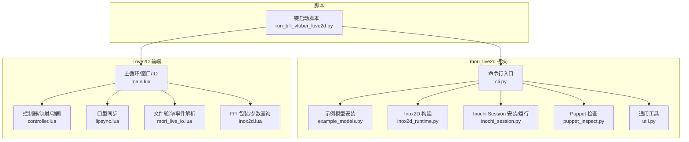
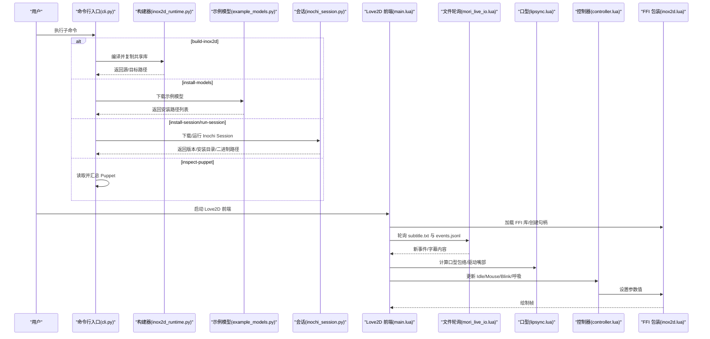
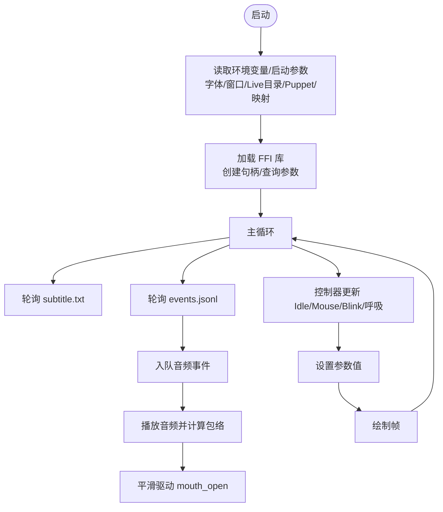
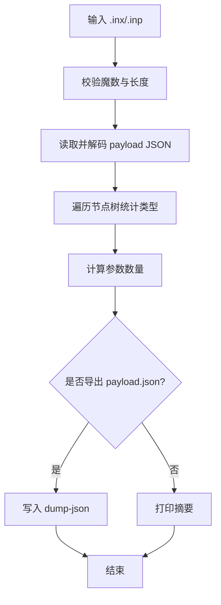
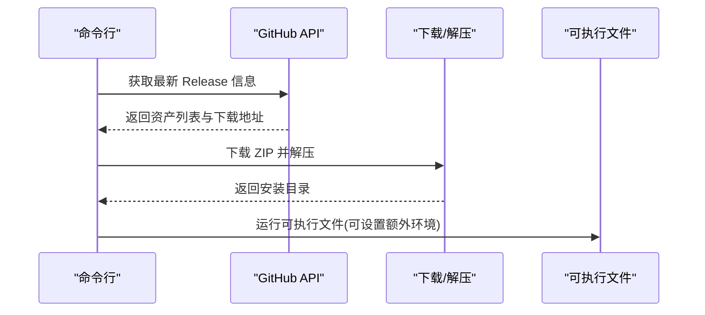
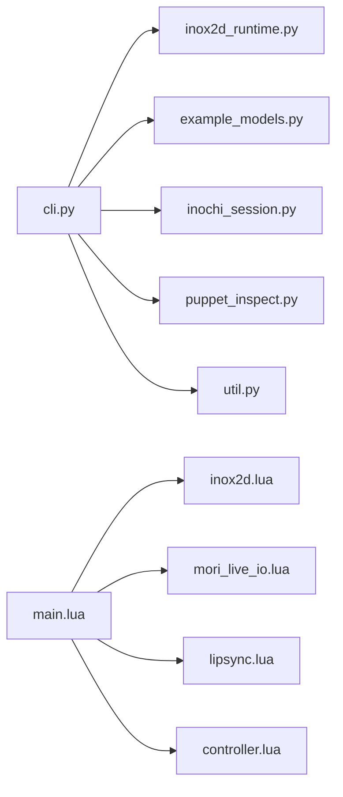

# 命令行工具

<cite>
**本文引用的文件**
- [cli.py](file://mori_live2d/cli.py)
- [README.md](file://mori_live2d/README.md)
- [example_models.py](file://mori_live2d/example_models.py)
- [inox2d_runtime.py](file://mori_live2d/inox2d_runtime.py)
- [inochi_session.py](file://mori_live2d/inochi_session.py)
- [util.py](file://mori_live2d/util.py)
- [puppet_inspect.py](file://mori_live2d/puppet_inspect.py)
- [main.lua](file://mori_live2d/love2d_frontend/main.lua)
- [controller.lua](file://mori_live2d/love2d_frontend/controller.lua)
- [lipsync.lua](file://mori_live2d/love2d_frontend/lipsync.lua)
- [mori_live_io.lua](file://mori_live2d/love2d_frontend/mori_live_io.lua)
- [inox2d.lua](file://mori_live2d/love2d_frontend/inox2d.lua)
- [run_bili_vtuber_love2d.py](file://scripts/run_bili_vtuber_love2d.py)
</cite>

## 目录
1. [简介](#简介)
2. [项目结构](#项目结构)
3. [核心组件](#核心组件)
4. [架构总览](#架构总览)
5. [详细组件分析](#详细组件分析)
6. [依赖关系分析](#依赖关系分析)
7. [性能考虑](#性能考虑)
8. [故障排查指南](#故障排查指南)
9. [结论](#结论)
10. [附录](#附录)

## 简介
本文件面向使用 Live2D（Inochi2D）集成命令行工具的用户与开发者，系统化说明 CLI 子命令、参数与工作流，涵盖模型安装、渲染前端（Love2D + Inox2D）、会话运行（Inochi Session）、调试与诊断、以及常见使用场景（如一键启动 VTuber、批量测试、自动化集成）。

## 项目结构
mori_live2d 模块提供以下关键能力：
- 命令行入口：子命令包括构建 Inox2D FFI、安装示例模型、安装/运行 Inochi Session、检查 Puppet、运行 Love2D 前端。
- Love2D 前端：通过 LuaJIT FFI 加载并渲染 Inochi2D Puppet，驱动口型同步、眨眼、头部/身体姿态、鼠标跟随等。
- 辅助工具：HTTP 下载、ZIP 解压、Puppet 结构检查与摘要输出。

图表来源
- [cli.py:20-54](file://mori_live2d/cli.py#L20-L54)
- [example_models.py:37-56](file://mori_live2d/example_models.py#L37-L56)
- [inox2d_runtime.py:32-62](file://mori_live2d/inox2d_runtime.py#L32-L62)
- [inochi_session.py:48-81](file://mori_live2d/inochi_session.py#L48-L81)
- [puppet_inspect.py:60-86](file://mori_live2d/puppet_inspect.py#L60-L86)
- [main.lua:156-283](file://mori_live2d/love2d_frontend/main.lua#L156-L283)
- [controller.lua:601-632](file://mori_live2d/love2d_frontend/controller.lua#L601-L632)
- [lipsync.lua:62-107](file://mori_live2d/love2d_frontend/lipsync.lua#L62-L107)
- [mori_live_io.lua:214-260](file://mori_live2d/love2d_frontend/mori_live_io.lua#L214-L260)
- [inox2d.lua:108-195](file://mori_live2d/love2d_frontend/inox2d.lua#L108-L195)
- [run_bili_vtuber_love2d.py:201-397](file://scripts/run_bili_vtuber_love2d.py#L201-L397)

章节来源
- [cli.py:20-54](file://mori_live2d/cli.py#L20-L54)
- [README.md:1-157](file://mori_live2d/README.md#L1-L157)

## 核心组件
- 命令行子命令
  - build-inox2d：编译 Rust 原生库并复制到模型目录，供 Love2D 通过 LuaJIT FFI 调用。
  - install-session：下载并解压 Inochi Session 官方前端到 model/inochi2d/apps。
  - install-models：下载公开示例 Puppet（如 Aka、Midori）到 model/inochi2d/puppets。
  - run-session：运行 Inochi Session 可执行文件，支持强制 X11 环境变量。
  - inspect-puppet：解析 .inx/.inp，输出元数据、参数数量、节点类型统计，可选导出 payload.json。
- Love2D 前端
  - 初始化：读取环境变量/启动参数，定位 Puppet、映射文件、Live 目录、字体等。
  - 渲染：通过 inox2d.lua 的 FFI 创建句柄、查询参数范围、逐帧更新并绘制。
  - 驱动：根据 subtitle.txt 与 events.jsonl 驱动口型同步、眨眼、头部/眼部姿态、呼吸等。
  - 控制：热键 H/I/F/B/R 切换帮助、Idle、Mouse Look、Blink、重载映射。
- 辅助工具
  - util.py：HTTP 获取 JSON、下载文件、解压 ZIP。
  - puppet_inspect.py：校验 .inp/.inx 魔数、提取 payload、统计节点类型与未知类型。

章节来源
- [cli.py:20-54](file://mori_live2d/cli.py#L20-L54)
- [main.lua:156-283](file://mori_live2d/love2d_frontend/main.lua#L156-L283)
- [controller.lua:601-632](file://mori_live2d/love2d_frontend/controller.lua#L601-L632)
- [lipsync.lua:62-107](file://mori_live2d/love2d_frontend/lipsync.lua#L62-L107)
- [mori_live_io.lua:214-260](file://mori_live2d/love2d_frontend/mori_live_io.lua#L214-L260)
- [inox2d.lua:108-195](file://mori_live2d/love2d_frontend/inox2d.lua#L108-L195)
- [util.py:13-67](file://mori_live2d/util.py#L13-L67)
- [puppet_inspect.py:36-86](file://mori_live2d/puppet_inspect.py#L36-L86)

## 架构总览
命令行工具与 Love2D 前端的交互流程如下：

图表来源
- [cli.py:57-120](file://mori_live2d/cli.py#L57-L120)
- [inox2d_runtime.py:32-62](file://mori_live2d/inox2d_runtime.py#L32-L62)
- [example_models.py:37-56](file://mori_live2d/example_models.py#L37-L56)
- [inochi_session.py:48-102](file://mori_live2d/inochi_session.py#L48-L102)
- [main.lua:156-283](file://mori_live2d/love2d_frontend/main.lua#L156-L283)
- [mori_live_io.lua:214-260](file://mori_live2d/love2d_frontend/mori_live_io.lua#L214-L260)
- [lipsync.lua:62-107](file://mori_live2d/love2d_frontend/lipsync.lua#L62-L107)
- [controller.lua:700-872](file://mori_live2d/love2d_frontend/controller.lua#L700-L872)
- [inox2d.lua:108-195](file://mori_live2d/love2d_frontend/inox2d.lua#L108-L195)

## 详细组件分析

### 命令行子命令与参数
- build-inox2d
  - 功能：调用 Rust 工具链构建 cdylib 共享库，并复制到模型目录供 Love2D 使用。
  - 关键参数：
    - --src：原生源码目录，默认为 mori_live2d/native/inox2d_ffi。
    - --out：输出目录，默认为 <repo>/model/inochi2d/native。
  - 输出：打印源目录、目标库、复制到的目标路径。
- install-session
  - 功能：从 GitHub Releases 下载最新版 Inochi Session 对应平台压缩包并解压。
  - 关键参数：
    - --root：安装根目录，默认为 <repo>/model/inochi2d。
    - --platform：覆盖平台（linux/win32/osx），默认自动检测。
    - --overwrite：覆盖已存在文件。
  - 输出：打印版本标签、安装目录、可执行文件路径。
- install-models
  - 功能：下载公开示例 Puppet（如 Aka、Midori）到 puppets/<name>/。
  - 关键参数：
    - --root：模型根目录，默认为 <repo>/model/inochi2d。
    - --models：模型名称列表，默认 ["aka"]。
    - --overwrite：覆盖已存在文件。
  - 输出：逐个打印安装路径。
- run-session
  - 功能：运行 Inochi Session 可执行文件。
  - 关键参数：
    - --bin：必填，Inochi Session 可执行文件路径。
    - --x11：在 Wayland 下强制设置 SDL_VIDEODRIVER=x11。
  - 输出：打印进程 PID，等待结束后返回退出码。
- inspect-puppet
  - 功能：解析 .inx/.inp，输出元数据、参数数量、节点类型统计，可选导出 payload.json。
  - 关键参数：
    - path：必填，.inx/.inp 文件路径。
    - --dump-json：可选，导出 payload.json 的目标路径。
  - 输出：打印路径、版本、名称、参数数量、节点类型计数；若存在未知节点类型，给出提示。

章节来源
- [cli.py:20-54](file://mori_live2d/cli.py#L20-L54)
- [README.md:16-157](file://mori_live2d/README.md#L16-L157)

### Love2D 前端初始化与渲染控制
- 初始化阶段
  - 窗口：标题、尺寸、垂直同步。
  - 字体：优先 MORI_FONT_PATH，否则按平台候选查找；支持 UI 字体大小与字幕字体大小。
  - Live 目录与文件：MORI_LIVE_DIR、MORI_SUBTITLE_PATH、MORI_EVENT_LOG、MORI_MOUTH_PATH 默认位于 live/ 下。
  - Puppet：MORI_PUPPET_PATH 或默认 Aka.inx。
  - 映射：MORI_MAPPING_PATH 或自动在 Puppet 同目录查找 .mori-map/.mori.lua。
  - 截图：MORI_SCREENSHOT_PATH 支持一次性截图并保存 PNG。
  - FFI：检查 inox2d 是否可用，加载库，创建句柄，查询参数列表与范围。
- 渲染与驱动
  - 字幕：低频轮询 subtitle.txt。
  - 事件：轮询 events.jsonl，解析新事件并排队播放音频。
  - 口型：基于音频包络平滑驱动 mouth_open。
  - 控制器：Idle 随机抖动、Mouse Look、眨眼、眼球扫视、呼吸。
  - 热键：H 显示/隐藏映射与调试；I 开关 Idle；F 开关 Mouse Look；B 开关 Blink；R 重载映射。
- 窗口调整：resize 时调用 inox2d.resize。

图表来源
- [main.lua:156-283](file://mori_live2d/love2d_frontend/main.lua#L156-L283)
- [main.lua:293-399](file://mori_live2d/love2d_frontend/main.lua#L293-L399)
- [main.lua:401-553](file://mori_live2d/love2d_frontend/main.lua#L401-L553)
- [controller.lua:700-872](file://mori_live2d/love2d_frontend/controller.lua#L700-L872)
- [lipsync.lua:62-107](file://mori_live2d/love2d_frontend/lipsync.lua#L62-L107)
- [mori_live_io.lua:214-260](file://mori_live2d/love2d_frontend/mori_live_io.lua#L214-L260)
- [inox2d.lua:108-195](file://mori_live2d/love2d_frontend/inox2d.lua#L108-L195)

章节来源
- [main.lua:156-283](file://mori_live2d/love2d_frontend/main.lua#L156-L283)
- [controller.lua:601-632](file://mori_live2d/love2d_frontend/controller.lua#L601-L632)
- [lipsync.lua:62-107](file://mori_live2d/love2d_frontend/lipsync.lua#L62-L107)
- [mori_live_io.lua:214-260](file://mori_live2d/love2d_frontend/mori_live_io.lua#L214-L260)
- [inox2d.lua:108-195](file://mori_live2d/love2d_frontend/inox2d.lua#L108-L195)

### Puppet 检查与诊断
- 输入：.inx/.inp 文件路径。
- 校验：读取魔数与负载长度，确保为合法 Inochi2D payload。
- 提取：JSON 解码 payload，统计节点类型，计算参数数量。
- 输出：路径、元数据、节点类型计数、未知节点类型列表；可选将 payload 写入 dump-json。

图表来源
- [puppet_inspect.py:36-86](file://mori_live2d/puppet_inspect.py#L36-L86)

章节来源
- [puppet_inspect.py:36-86](file://mori_live2d/puppet_inspect.py#L36-L86)

### Inochi Session 安装与运行
- 安装：获取最新 Release 信息，匹配对应平台资产，下载并解压到 model/inochi2d/apps/<tag>/<platform>。
- 运行：支持 Linux LD_LIBRARY_PATH 追加，Wayland 下可通过 --x11 强制 X11。

图表来源
- [inochi_session.py:48-102](file://mori_live2d/inochi_session.py#L48-L102)

章节来源
- [inochi_session.py:48-102](file://mori_live2d/inochi_session.py#L48-L102)

### 示例模型安装
- 支持模型：Aka、Midori。
- 下载：按模型规格构造 URL，下载到 puppets/<key>/<file_name>。
- 错误处理：未知模型名抛错，无模型列表抛错。

章节来源
- [example_models.py:21-56](file://mori_live2d/example_models.py#L21-L56)

### 一键启动 VTuber（Love2D + 哔哩哔哩）
- 自动准备：若缺少示例模型或 Inox2D 共享库则自动安装/构建。
- 环境注入：Love2D 前端所需环境变量（Live 目录、Puppet 路径、映射、鼠标跟随等）由脚本注入。
- 进程管理：同时启动 vtuber.py 与 Love2D 前端，监控退出并优雅终止。

章节来源
- [run_bili_vtuber_love2d.py:201-397](file://scripts/run_bili_vtuber_love2d.py#L201-L397)

## 依赖关系分析
- CLI 依赖
  - 构建：rust/cargo 工具链、OpenGL 相关依赖。
  - 下载：urllib、zipfile。
  - 平台：自动检测 Linux/Win32/macOS。
- Love2D 前端依赖
  - LuaJIT FFI：加载 libmori_inox2d.so。
  - LÖVE：窗口、渲染、音频、文件系统 API。
  - 文件轮询：events.jsonl、subtitle.txt、mouth.txt。
- 运行时
  - Linux：LD_LIBRARY_PATH 追加可执行文件所在目录。

图表来源
- [cli.py:57-120](file://mori_live2d/cli.py#L57-L120)
- [inox2d_runtime.py:32-62](file://mori_live2d/inox2d_runtime.py#L32-L62)
- [example_models.py:37-56](file://mori_live2d/example_models.py#L37-L56)
- [inochi_session.py:48-102](file://mori_live2d/inochi_session.py#L48-L102)
- [puppet_inspect.py:60-86](file://mori_live2d/puppet_inspect.py#L60-L86)
- [util.py:13-67](file://mori_live2d/util.py#L13-L67)
- [main.lua:156-283](file://mori_live2d/love2d_frontend/main.lua#L156-L283)
- [inox2d.lua:108-195](file://mori_live2d/love2d_frontend/inox2d.lua#L108-L195)
- [mori_live_io.lua:214-260](file://mori_live2d/love2d_frontend/mori_live_io.lua#L214-L260)
- [lipsync.lua:62-107](file://mori_live2d/love2d_frontend/lipsync.lua#L62-L107)
- [controller.lua:700-872](file://mori_live2d/love2d_frontend/controller.lua#L700-L872)

章节来源
- [cli.py:57-120](file://mori_live2d/cli.py#L57-L120)
- [main.lua:156-283](file://mori_live2d/love2d_frontend/main.lua#L156-L283)

## 性能考虑
- 文件轮询频率
  - 字幕轮询周期约 0.2s，events.jsonl 轮询周期约 0.2s，避免频繁磁盘 I/O。
- 渲染与参数更新
  - 每帧调用 begin_frame/end_frame，参数设置采用指数平滑，tau 值控制响应速度。
- 音频包络
  - 基于窗口 RMS 计算包络，窗口大小影响口型响应平滑度与延迟。
- 平台差异
  - Linux Wayland 下建议使用 --x11 或设置 SDL_VIDEODRIVER=x11，避免窗口/输入问题导致的额外开销。

章节来源
- [main.lua:296-304](file://mori_live2d/love2d_frontend/main.lua#L296-L304)
- [main.lua:357-369](file://mori_live2d/love2d_frontend/main.lua#L357-L369)
- [controller.lua:556-592](file://mori_live2d/love2d_frontend/controller.lua#L556-L592)
- [lipsync.lua:31-60](file://mori_live2d/love2d_frontend/lipsync.lua#L31-L60)

## 故障排查指南
- FFI 库缺失
  - 现象：前端提示缺少 LuaJIT FFI 或无法找到 libmori_inox2d.so。
  - 处理：先执行 build-inox2d，或将 MORI_INOX2D_LIB 指向正确路径。
- Puppet 无法加载
  - 现象：前端提示 puppet 文件不存在或加载失败。
  - 处理：确认 MORI_PUPPET_PATH 或默认路径存在；使用 inspect-puppet 检查节点类型。
- Wayland 窗口问题
  - 现象：Linux 下窗口黑屏或无输入。
  - 处理：使用 --x11 或设置 SDL_VIDEODRIVER=x11。
- 事件/字幕未生效
  - 现象：前端未显示字幕或不播放音频。
  - 处理：确认 events.jsonl 中 wav_path 存在且可读；subtitle.txt 编码与换行符正确。
- 参数映射不生效
  - 现象：Idle/Mouse/Blink 等未按预期工作。
  - 处理：提供 MORI_MAPPING_PATH 或在 Puppet 同目录放置 .mori-map/.mori.lua；热键 R 重载映射。

章节来源
- [README.md:10-15](file://mori_live2d/README.md#L10-L15)
- [main.lua:226-242](file://mori_live2d/love2d_frontend/main.lua#L226-L242)
- [main.lua:269-280](file://mori_live2d/love2d_frontend/main.lua#L269-L280)
- [inochi_session.py:96-101](file://mori_live2d/inochi_session.py#L96-L101)
- [mori_live_io.lua:200-212](file://mori_live2d/love2d_frontend/mori_live_io.lua#L200-L212)
- [puppet_inspect.py:77-86](file://mori_live2d/puppet_inspect.py#L77-L86)

## 结论
本命令行工具为 Live2D（Inochi2D）在 Mori 生态中的集成提供了完整的工作流：从构建 FFI、安装示例模型、运行官方前端，到 Love2D 前端的参数映射、口型同步与调试控制。通过合理的环境变量与参数配置，用户可在本地快速搭建 VTuber 场景，并结合一键启动脚本实现自动化与集成。

## 附录

### 常用命令模板
- 构建 Inox2D FFI
  - python3 -m mori_live2d.cli build-inox2d
- 安装示例模型
  - python3 -m mori_live2d.cli install-models --models aka midori
- 安装并运行 Inochi Session（Wayland 问题）
  - python3 -m mori_live2d.cli install-session
  - python3 -m mori_live2d.cli run-session --bin /path/to/inochi-session --x11
- 检查 Puppet 节点类型
  - python3 -m mori_live2d.cli inspect-puppet /path/to/puppet.inx --dump-json /tmp/payload.json
- 快速启动 Love2D 前端
  - love mori_live2d/love2d_frontend
- 一键启动 VTuber（B站直播 + Love2D + TTS）
  - python3 scripts/run_bili_vtuber_love2d.py --bilibili-room-id <room_id> --exit-when-offline

章节来源
- [README.md:24-157](file://mori_live2d/README.md#L24-L157)
- [run_bili_vtuber_love2d.py:230-233](file://scripts/run_bili_vtuber_love2d.py#L230-L233)