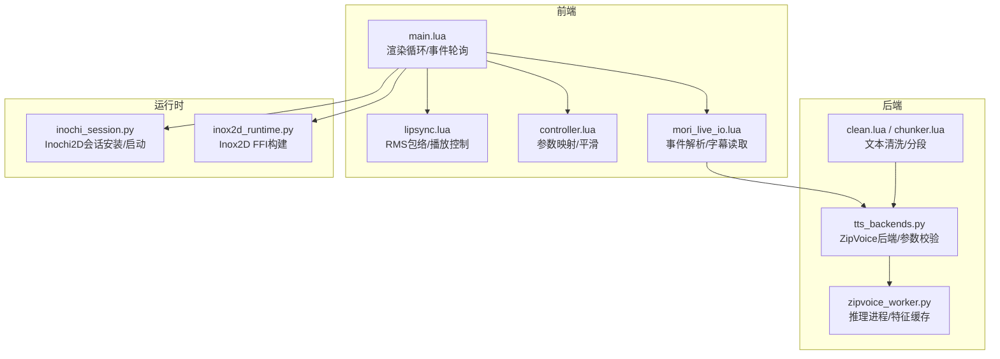
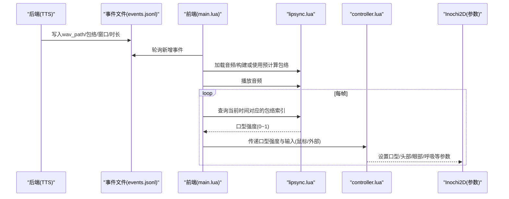
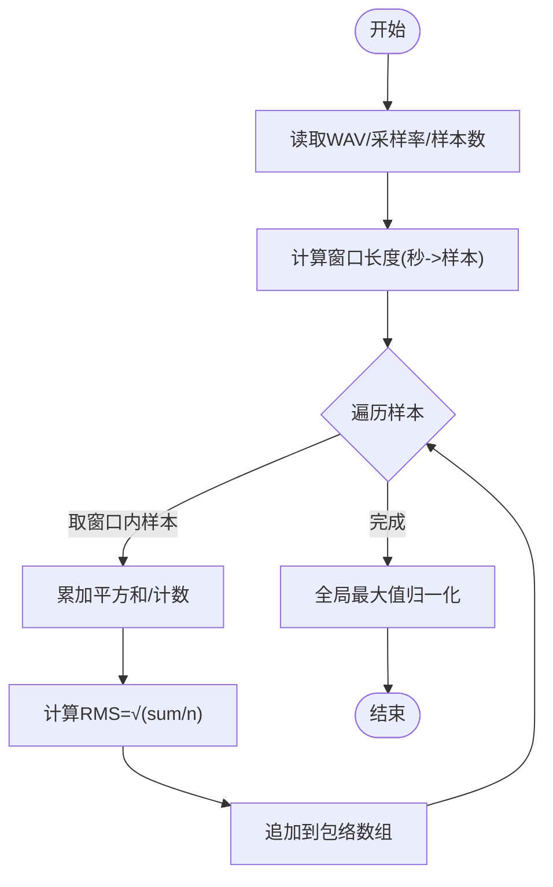
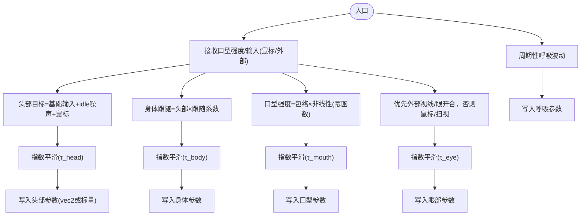
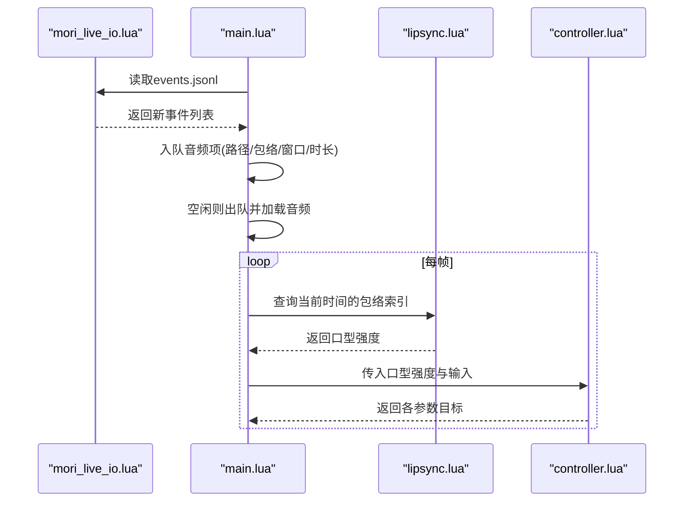
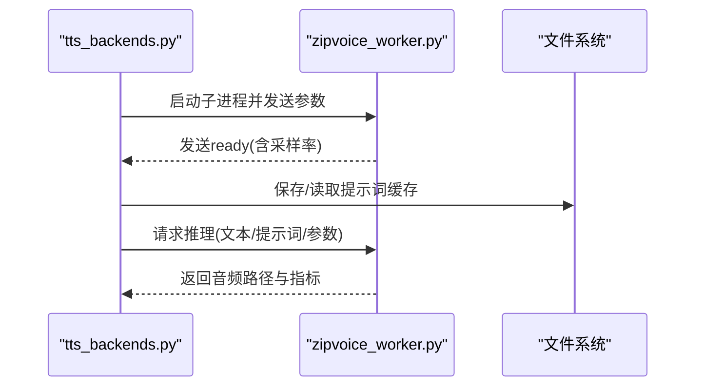
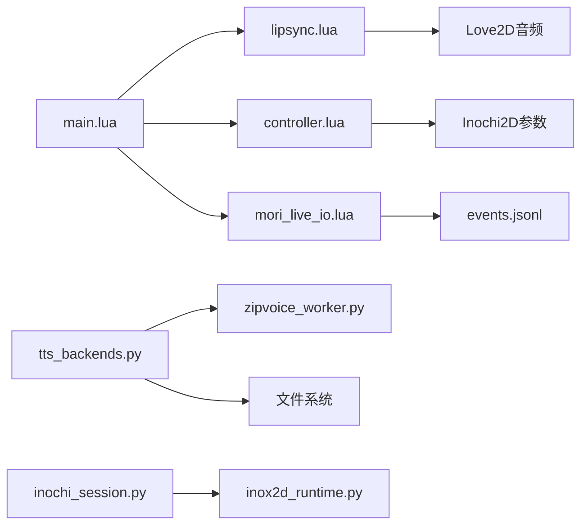

# 嘴形同步系统

<cite>
**本文档引用的文件**
- [lipsync.lua](file://mori_live2d/love2d_frontend/lipsync.lua)
- [controller.lua](file://mori_live2d/love2d_frontend/controller.lua)
- [main.lua](file://mori_live2d/love2d_frontend/main.lua)
- [mori_live_io.lua](file://mori_live2d/love2d_frontend/mori_live_io.lua)
- [airi_puppet_control_compare.md](file://mori_live2d/notes/airi_puppet_control_compare.md)
- [tts_backends.py](file://mori_runtime/tts_backends.py)
- [zipvoice_worker.py](file://mori_runtime/zipvoice_worker.py)
- [chunker.lua](file://mori_runtime/lua/mori/speech/chunker.lua)
- [clean.lua](file://mori_runtime/lua/mori/text/clean.lua)
- [inochi_session.py](file://mori_live2d/inochi_session.py)
- [inox2d_runtime.py](file://mori_live2d/inox2d_runtime.py)
</cite>

## 目录
1. [简介](#简介)
2. [项目结构](#项目结构)
3. [核心组件](#核心组件)
4. [架构总览](#架构总览)
5. [详细组件分析](#详细组件分析)
6. [依赖分析](#依赖分析)
7. [性能考虑](#性能考虑)
8. [故障排查指南](#故障排查指南)
9. [结论](#结论)
10. [附录](#附录)

## 简介
本系统为一套基于音频特征驱动的嘴形同步方案，覆盖从文本到语音、特征提取、实时播放与表情映射的完整链路。前端通过 Love2D + Inox2D 实时渲染，后端提供 TTS 生成与特征抽取能力，核心模块包括：
- 音频特征提取：基于短时 RMS 包络构建，窗口化聚合能量信息
- 表情映射：将音频包络映射至口型参数，结合平滑与非线性变换
- 实时同步：事件驱动的音频队列、播放进度驱动、参数平滑与延迟补偿
- 数学模型：指数平滑、幂函数非线性、可选贝塞尔/插值扩展空间

## 项目结构
系统主要由以下子模块构成：
- 前端渲染与控制：Love2D + Inox2D，负责参数映射、表情驱动与 UI
- 音频输入与事件：从 JSONL 事件流读取音频路径与预计算包络
- TTS 与特征：ZipVoice 推理工作进程，输出音频并提供特征采样率
- 文本处理：分段与清洗工具，支撑 TTS 输入质量

**图表来源**
- [main.lua:156-400](file://mori_live2d/love2d_frontend/main.lua#L156-L400)
- [lipsync.lua:31-125](file://mori_live2d/love2d_frontend/lipsync.lua#L31-L125)
- [controller.lua:601-700](file://mori_live2d/love2d_frontend/controller.lua#L601-L700)
- [mori_live_io.lua:214-260](file://mori_live2d/love2d_frontend/mori_live_io.lua#L214-L260)
- [tts_backends.py:525-800](file://mori_runtime/tts_backends.py#L525-L800)
- [zipvoice_worker.py:446-729](file://mori_runtime/zipvoice_worker.py#L446-L729)
- [clean.lua:16-46](file://mori_runtime/lua/mori/text/clean.lua#L16-L46)
- [chunker.lua:56-157](file://mori_runtime/lua/mori/speech/chunker.lua#L56-L157)
- [inochi_session.py:48-103](file://mori_live2d/inochi_session.py#L48-L103)
- [inox2d_runtime.py:32-64](file://mori_live2d/inox2d_runtime.py#L32-L64)

**章节来源**
- [main.lua:156-400](file://mori_live2d/love2d_frontend/main.lua#L156-L400)
- [lipsync.lua:31-125](file://mori_live2d/love2d_frontend/lipsync.lua#L31-L125)
- [controller.lua:601-700](file://mori_live2d/love2d_frontend/controller.lua#L601-L700)
- [mori_live_io.lua:214-260](file://mori_live2d/love2d_frontend/mori_live_io.lua#L214-L260)
- [tts_backends.py:525-800](file://mori_runtime/tts_backends.py#L525-L800)
- [zipvoice_worker.py:446-729](file://mori_runtime/zipvoice_worker.py#L446-L729)
- [clean.lua:16-46](file://mori_runtime/lua/mori/text/clean.lua#L16-L46)
- [chunker.lua:56-157](file://mori_runtime/lua/mori/speech/chunker.lua#L56-L157)
- [inochi_session.py:48-103](file://mori_live2d/inochi_session.py#L48-L103)
- [inox2d_runtime.py:32-64](file://mori_live2d/inox2d_runtime.py#L32-L64)

## 核心组件
- 音频特征提取（lipsync.lua）
  - 使用短时 RMS 包络，按固定窗口聚合样本能量，归一化后作为口型强度
  - 支持预计算包络与动态构建两种模式
- 表情映射与平滑（controller.lua）
  - 将口型强度映射到口型参数，结合指数平滑与非线性变换
  - 提供 vec2 参数支持、身体跟随头部运动、可选外部输入（鼠标/头部/视线/眼开合）
- 实时同步（main.lua + mori_live_io.lua）
  - 事件驱动：从 events.jsonl 读取新音频，入队播放
  - 播放进度驱动：根据当前时间定位包络索引，更新口型
- TTS 与特征（tts_backends.py + zipvoice_worker.py）
  - ZipVoice 推理进程，提供特征采样率与输出采样率
  - 提供提示词缓存、持久化与跨批拼接

**章节来源**
- [lipsync.lua:31-125](file://mori_live2d/love2d_frontend/lipsync.lua#L31-L125)
- [controller.lua:601-700](file://mori_live2d/love2d_frontend/controller.lua#L601-L700)
- [main.lua:293-400](file://mori_live2d/love2d_frontend/main.lua#L293-L400)
- [mori_live_io.lua:214-260](file://mori_live2d/love2d_frontend/mori_live_io.lua#L214-L260)
- [tts_backends.py:525-800](file://mori_runtime/tts_backends.py#L525-L800)
- [zipvoice_worker.py:446-729](file://mori_runtime/zipvoice_worker.py#L446-L729)

## 架构总览
系统采用“事件驱动 + 特征驱动”的双通道同步：
- 事件通道：后端生成音频与包络元数据，前端通过事件流消费
- 播放通道：Love2D 音频源播放，lipsync 根据时间戳查询包络，controller 将包络映射为参数

**图表来源**
- [main.lua:293-400](file://mori_live2d/love2d_frontend/main.lua#L293-L400)
- [lipsync.lua:109-125](file://mori_live2d/love2d_frontend/lipsync.lua#L109-L125)
- [controller.lua:700-791](file://mori_live2d/love2d_frontend/controller.lua#L700-L791)
- [mori_live_io.lua:214-260](file://mori_live2d/love2d_frontend/mori_live_io.lua#L214-L260)

## 详细组件分析

### 组件A：音频特征提取与包络驱动
- 算法要点
  - 短时 RMS：对每个采样求平方和，窗口内求均值再开方，得到能量幅度
  - 归一化：全局最大值归一，避免绝对能量影响
  - 时间轴对齐：按窗口秒数换算索引，播放时间映射到包络索引
- 复杂度
  - 时间复杂度 O(N)，N 为采样数；窗口大小决定包络分辨率
  - 空间复杂度 O(N/window)，用于存储包络
- 关键实现路径
  - [构建包络:31-60](file://mori_live2d/love2d_frontend/lipsync.lua#L31-L60)
  - [加载音频与播放控制:62-107](file://mori_live2d/love2d_frontend/lipsync.lua#L62-L107)
  - [更新口型强度:109-125](file://mori_live2d/love2d_frontend/lipsync.lua#L109-L125)

**图表来源**
- [lipsync.lua:31-60](file://mori_live2d/love2d_frontend/lipsync.lua#L31-L60)

**章节来源**
- [lipsync.lua:31-125](file://mori_live2d/love2d_frontend/lipsync.lua#L31-L125)

### 组件B：表情映射与平滑算法
- 映射机制
  - 口型强度 → 口型参数：线性映射到参数范围，支持反转（如某些皮套的 Blink 语义）
  - 头部/身体：头部目标叠加 idle 噪声与鼠标输入，身体跟随头部，分别独立平滑
  - 眼睛：优先外部输入（视线/眼开合），否则鼠标或随机扫视
  - 呼吸：周期性正弦波动，幅度可调
- 平滑与非线性
  - 指数平滑：tau 控制响应速度，dt 修正帧时间抖动
  - 口型非线性：幂函数变换增强感知差异
- 关键实现路径
  - [参数映射与查找:201-452](file://mori_live2d/love2d_frontend/controller.lua#L201-L452)
  - [平滑与非线性:22-31](file://mori_live2d/love2d_frontend/controller.lua#L22-L31)
  - [口型更新与参数写入:498-554](file://mori_live2d/love2d_frontend/controller.lua#L498-L554)
  - [头部/身体/眼睛/呼吸更新:700-791](file://mori_live2d/love2d_frontend/controller.lua#L700-L791)

**图表来源**
- [controller.lua:22-31](file://mori_live2d/love2d_frontend/controller.lua#L22-L31)
- [controller.lua:498-554](file://mori_live2d/love2d_frontend/controller.lua#L498-L554)
- [controller.lua:700-791](file://mori_live2d/love2d_frontend/controller.lua#L700-L791)

**章节来源**
- [controller.lua:201-791](file://mori_live2d/love2d_frontend/controller.lua#L201-L791)

### 组件C：实时同步与事件驱动
- 事件轮询
  - 从 events.jsonl 逐行解析，提取 wav_path、mouth_envelope、mouth_window_sec、mouth_duration
  - 入队待播，空闲时出队并播放
- 播放进度驱动
  - 每帧查询播放时间，换算包络索引，更新口型
- 关键实现路径
  - [事件轮询与解析:214-260](file://mori_live2d/love2d_frontend/mori_live_io.lua#L214-L260)
  - [音频队列与播放控制:357-399](file://mori_live2d/love2d_frontend/main.lua#L357-L399)
  - [口型更新与参数写入:323-353](file://mori_live2d/love2d_frontend/main.lua#L323-L353)

**图表来源**
- [mori_live_io.lua:214-260](file://mori_live2d/love2d_frontend/mori_live_io.lua#L214-L260)
- [main.lua:357-399](file://mori_live2d/love2d_frontend/main.lua#L357-L399)
- [lipsync.lua:109-125](file://mori_live2d/love2d_frontend/lipsync.lua#L109-L125)
- [controller.lua:700-791](file://mori_live2d/love2d_frontend/controller.lua#L700-L791)

**章节来源**
- [mori_live_io.lua:214-260](file://mori_live2d/love2d_frontend/mori_live_io.lua#L214-L260)
- [main.lua:357-399](file://mori_live2d/love2d_frontend/main.lua#L357-L399)
- [lipsync.lua:109-125](file://mori_live2d/love2d_frontend/lipsync.lua#L109-L125)
- [controller.lua:700-791](file://mori_live2d/love2d_frontend/controller.lua#L700-L791)

### 组件D：TTS 与特征抽取
- ZipVoice 后端
  - 启动推理进程，读取 ready 消息中的采样率
  - 支持多语言路由、提示词缓存、持久化
- 特征采样率
  - 输出采样率与特征采样率由后端提供，前端据此构建包络
- 关键实现路径
  - [ZipVoice类初始化与启动:525-650](file://mori_runtime/tts_backends.py#L525-L650)
  - [推理进程主循环与消息协议:446-729](file://mori_runtime/zipvoice_worker.py#L446-L729)

**图表来源**
- [tts_backends.py:525-703](file://mori_runtime/tts_backends.py#L525-L703)
- [zipvoice_worker.py:614-729](file://mori_runtime/zipvoice_worker.py#L614-L729)

**章节来源**
- [tts_backends.py:525-703](file://mori_runtime/tts_backends.py#L525-L703)
- [zipvoice_worker.py:446-729](file://mori_runtime/zipvoice_worker.py#L446-L729)

### 组件E：文本处理与分段
- 分段策略
  - 基于标点硬切点优先，软切点次之，超长阈值兜底
  - 首段可降低最小字符阈值以提升首句连贯性
- 清洗策略
  - 移除思维/思考标记与尾部结束标记，保证 TTS 输入整洁
- 关键实现路径
  - [分段器:56-157](file://mori_runtime/lua/mori/speech/chunker.lua#L56-L157)
  - [文本清洗:16-46](file://mori_runtime/lua/mori/text/clean.lua#L16-L46)

**章节来源**
- [chunker.lua:56-157](file://mori_runtime/lua/mori/speech/chunker.lua#L56-L157)
- [clean.lua:16-46](file://mori_runtime/lua/mori/text/clean.lua#L16-L46)

## 依赖分析
- 前端依赖
  - Love2D 音频与文件系统接口：用于播放与读取事件
  - Inox2D FFI：参数写入与渲染
- 后端依赖
  - ZipVoice 推理环境：Python/Torch/Tokenizer/Vocoder
  - 文件系统：事件文件与音频文件
- 运行时依赖
  - Inochi2D 会话与 Inox2D FFI 库：安装与启动

**图表来源**
- [main.lua:156-400](file://mori_live2d/love2d_frontend/main.lua#L156-L400)
- [lipsync.lua:31-125](file://mori_live2d/love2d_frontend/lipsync.lua#L31-L125)
- [controller.lua:601-791](file://mori_live2d/love2d_frontend/controller.lua#L601-L791)
- [mori_live_io.lua:214-260](file://mori_live2d/love2d_frontend/mori_live_io.lua#L214-L260)
- [tts_backends.py:525-800](file://mori_runtime/tts_backends.py#L525-L800)
- [zipvoice_worker.py:446-729](file://mori_runtime/zipvoice_worker.py#L446-L729)
- [inochi_session.py:48-103](file://mori_live2d/inochi_session.py#L48-L103)
- [inox2d_runtime.py:32-64](file://mori_live2d/inox2d_runtime.py#L32-L64)

**章节来源**
- [main.lua:156-400](file://mori_live2d/love2d_frontend/main.lua#L156-L400)
- [controller.lua:601-791](file://mori_live2d/love2d_frontend/controller.lua#L601-L791)
- [tts_backends.py:525-800](file://mori_runtime/tts_backends.py#L525-L800)
- [zipvoice_worker.py:446-729](file://mori_runtime/zipvoice_worker.py#L446-L729)
- [inochi_session.py:48-103](file://mori_live2d/inochi_session.py#L48-L103)
- [inox2d_runtime.py:32-64](file://mori_live2d/inox2d_runtime.py#L32-L64)

## 性能考虑
- 包络窗口大小
  - 更小窗口提升时间分辨率但增大包络长度，影响内存与索引查找
  - 更大窗口降低噪声但降低响应速度
- 平滑参数
  - τ 越小响应越快，易产生抖动；越大越平滑但滞后
- 指数平滑 dt 修正
  - 避免帧时间抖动导致平滑系数不一致
- 推理进程
  - 多线程与设备选择（CUDA/MPS/CPU）影响吞吐
  - 提示词缓存与持久化减少重复计算

[本节为通用指导，无需特定文件引用]

## 故障排查指南
- 音频无法播放
  - 检查事件文件中 wav_path 是否存在且可读
  - 确认 lipsync 加载返回成功
  - 参考：[事件解析:214-260](file://mori_live2d/love2d_frontend/mori_live_io.lua#L214-L260)、[音频加载:62-107](file://mori_live2d/love2d_frontend/lipsync.lua#L62-L107)
- 口型不匹配
  - 调整窗口秒数与非线性指数，使感知更符合角色
  - 检查参数映射是否正确（反转/范围）
  - 参考：[包络构建:31-60](file://mori_live2d/love2d_frontend/lipsync.lua#L31-L60)、[参数映射:201-452](file://mori_live2d/love2d_frontend/controller.lua#L201-L452)
- 同步延迟
  - 检查事件写入与前端轮询间隔
  - 调整平滑 τ 与包络窗口，平衡响应与稳定性
  - 参考：[事件轮询:214-260](file://mori_live2d/love2d_frontend/mori_live_io.lua#L214-L260)、[平滑:22-31](file://mori_live2d/love2d_frontend/controller.lua#L22-L31)
- TTS 推理失败
  - 查看 ZipVoice worker 日志与错误码
  - 确认模型路径、检查点与提示词缓存
  - 参考：[后端启动:668-703](file://mori_runtime/tts_backends.py#L668-L703)、[worker主循环:625-729](file://mori_runtime/zipvoice_worker.py#L625-L729)

**章节来源**
- [mori_live_io.lua:214-260](file://mori_live2d/love2d_frontend/mori_live_io.lua#L214-L260)
- [lipsync.lua:62-107](file://mori_live2d/love2d_frontend/lipsync.lua#L62-L107)
- [controller.lua:22-31](file://mori_live2d/love2d_frontend/controller.lua#L22-L31)
- [tts_backends.py:668-703](file://mori_runtime/tts_backends.py#L668-L703)
- [zipvoice_worker.py:625-729](file://mori_runtime/zipvoice_worker.py#L625-L729)

## 结论
本系统通过“事件驱动 + 特征驱动”的组合，实现了稳定高效的嘴形同步：前端以指数平滑与非线性变换确保流畅自然，后端以 ZipVoice 提供高质量语音与特征采样率，整体具备良好的可扩展性与可维护性。

[本节为总结，无需特定文件引用]

## 附录

### 配置与最佳实践
- 音频输入配置
  - 采样率与特征采样率：以后端 ready 消息为准
  - 窗口秒数：建议 0.02s，兼顾响应与噪声
  - 非线性指数：0.8 左右增强感知差异
  - 参考：[后端采样率:701-702](file://mori_runtime/tts_backends.py#L701-L702)、[包络构建:31-60](file://mori_live2d/love2d_frontend/lipsync.lua#L31-L60)
- 参数映射
  - 使用 .mori-map 或 .mori.lua 覆盖默认映射
  - 注意 Blink 等参数的反转语义
  - 参考：[参数映射:201-452](file://mori_live2d/love2d_frontend/controller.lua#L201-L452)
- 平滑与延迟
  - 调整 τ_head/τ_body/τ_eye/τ_mouth 以适配角色
  - 若存在明显延迟，适当减小窗口或 τ
  - 参考：[平滑参数:556-592](file://mori_live2d/love2d_frontend/controller.lua#L556-L592)
- 文本处理
  - 使用分段器与清洗器提升 TTS 一致性
  - 参考：[分段:56-157](file://mori_runtime/lua/mori/speech/chunker.lua#L56-L157)、[清洗:16-46](file://mori_runtime/lua/mori/text/clean.lua#L16-L46)

**章节来源**
- [tts_backends.py:701-702](file://mori_runtime/tts_backends.py#L701-L702)
- [lipsync.lua:31-60](file://mori_live2d/love2d_frontend/lipsync.lua#L31-L60)
- [controller.lua:556-592](file://mori_live2d/love2d_frontend/controller.lua#L556-L592)
- [chunker.lua:56-157](file://mori_runtime/lua/mori/speech/chunker.lua#L56-L157)
- [clean.lua:16-46](file://mori_runtime/lua/mori/text/clean.lua#L16-L46)