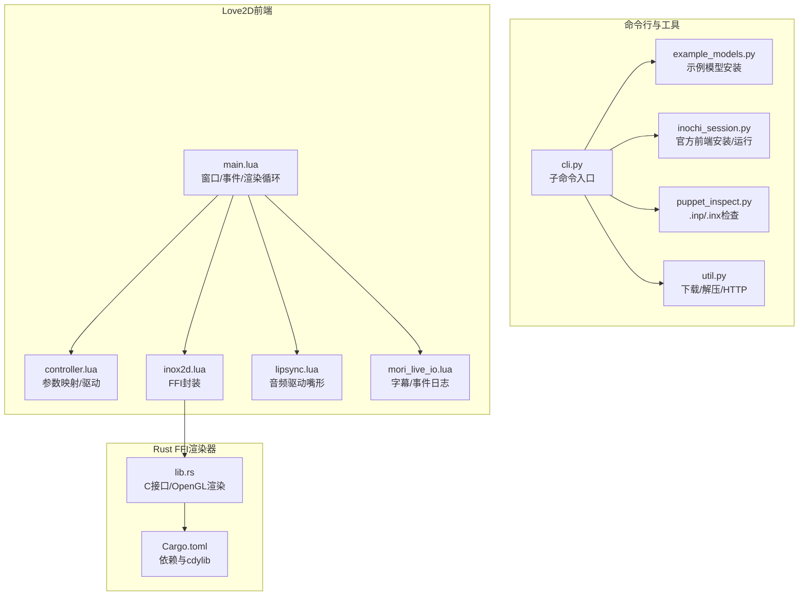
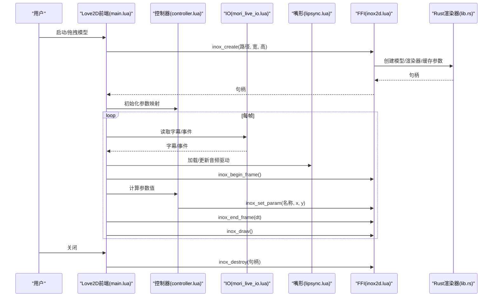
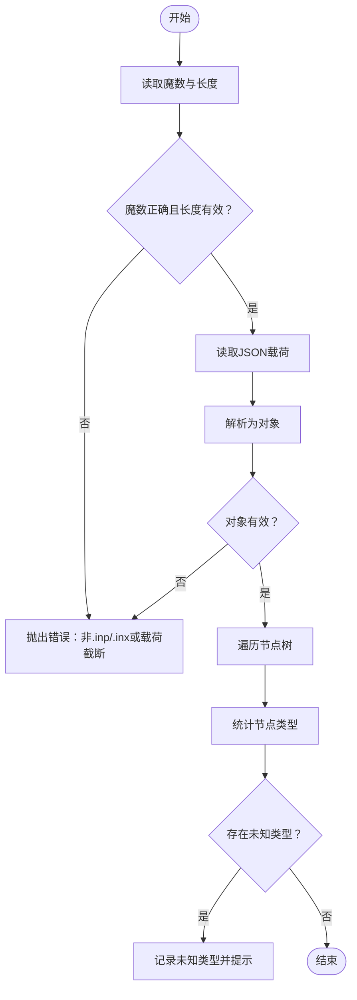
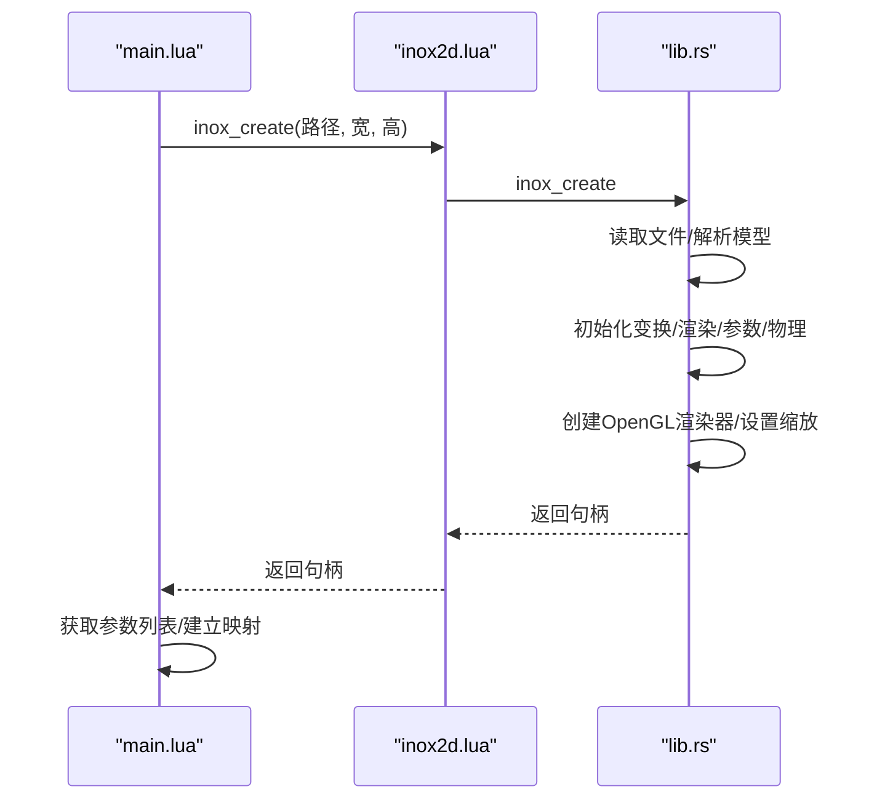
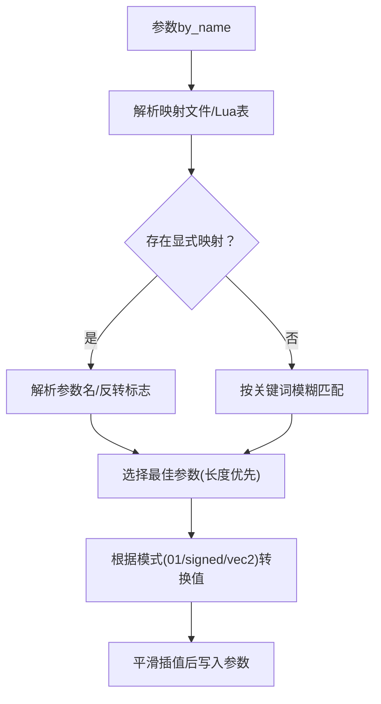
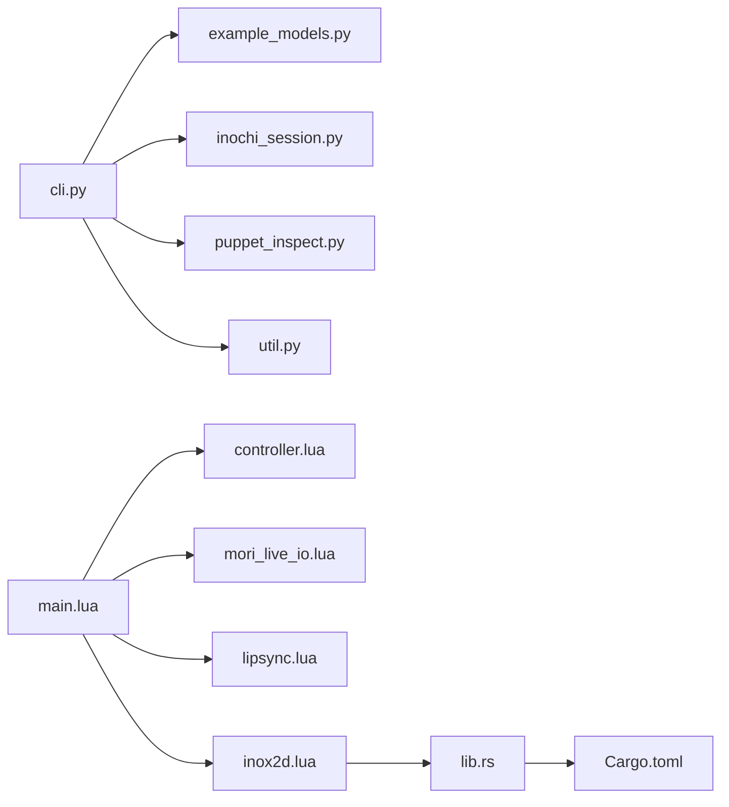

# 模型管理与配置

<cite>
**本文引用的文件**   
- [README.md](file://mori_live2d/README.md)
- [__init__.py](file://mori_live2d/__init__.py)
- [cli.py](file://mori_live2d/cli.py)
- [example_models.py](file://mori_live2d/example_models.py)
- [inochi_session.py](file://mori_live2d/inochi_session.py)
- [inox2d_runtime.py](file://mori_live2d/inox2d_runtime.py)
- [puppet_inspect.py](file://mori_live2d/puppet_inspect.py)
- [util.py](file://mori_live2d/util.py)
- [main.lua](file://mori_live2d/love2d_frontend/main.lua)
- [controller.lua](file://mori_live2d/love2d_frontend/controller.lua)
- [inox2d.lua](file://mori_live2d/love2d_frontend/inox2d.lua)
- [lipsync.lua](file://mori_live2d/love2d_frontend/lipsync.lua)
- [mori_live_io.lua](file://mori_live2d/love2d_frontend/mori_live_io.lua)
- [lib.rs](file://mori_live2d/native/inox2d_ffi/src/lib.rs)
- [Cargo.toml](file://mori_live2d/native/inox2d_ffi/Cargo.toml)
</cite>

## 目录
1. [简介](#简介)
2. [项目结构](#项目结构)
3. [核心组件](#核心组件)
4. [架构总览](#架构总览)
5. [详细组件分析](#详细组件分析)
6. [依赖关系分析](#依赖关系分析)
7. [性能考量](#性能考量)
8. [故障排查指南](#故障排查指南)
9. [结论](#结论)
10. [附录](#附录)

## 简介
本文件面向Live2D风格模型（Inochi2D）在Mori系统中的管理与配置，聚焦以下目标：
- 模型文件格式支持与校验：.inx/.inp包体、内部JSON载荷、节点类型与参数清单
- 模型加载流程：文件解析、内存分配、初始化检查、错误传播
- 模型配置参数：缩放、位置偏移、颜色与透明度（通过渲染器与参数映射间接控制）
- 会话管理机制：实例化、状态保存、资源清理
- 模型检查工具：节点类型统计、未知类型提示、参数数量与范围
- 实际配置示例：添加新模型、调整渲染参数、兼容性问题处理与优化建议

## 项目结构
mori_live2d子模块围绕“Love2D前端 + Rust FFI渲染器”的组合展开，提供命令行工具、模型安装与检查、参数映射与驱动逻辑，以及底层OpenGL渲染。

**图表来源**
- [cli.py:1-125](file://mori_live2d/cli.py#L1-L125)
- [example_models.py:1-57](file://mori_live2d/example_models.py#L1-L57)
- [inochi_session.py:1-103](file://mori_live2d/inochi_session.py#L1-L103)
- [puppet_inspect.py:1-87](file://mori_live2d/puppet_inspect.py#L1-L87)
- [util.py:1-68](file://mori_live2d/util.py#L1-L68)
- [main.lua:1-631](file://mori_live2d/love2d_frontend/main.lua#L1-L631)
- [controller.lua:1-900](file://mori_live2d/love2d_frontend/controller.lua#L1-L900)
- [inox2d.lua:1-198](file://mori_live2d/love2d_frontend/inox2d.lua#L1-L198)
- [lipsync.lua:1-128](file://mori_live2d/love2d_frontend/lipsync.lua#L1-L128)
- [mori_live_io.lua:1-263](file://mori_live2d/love2d_frontend/mori_live_io.lua#L1-L263)
- [lib.rs:1-375](file://mori_live2d/native/inox2d_ffi/src/lib.rs#L1-L375)
- [Cargo.toml:1-16](file://mori_live2d/native/inox2d_ffi/Cargo.toml#L1-L16)

**章节来源**
- [README.md:1-157](file://mori_live2d/README.md#L1-L157)
- [__init__.py:1-3](file://mori_live2d/__init__.py#L1-L3)

## 核心组件
- 命令行工具与安装
  - 安装示例模型、构建FFI库、运行官方前端、检查.puppet载荷
- Love2D前端
  - 加载与渲染Inochi2D模型、参数映射与驱动、字幕与事件日志、音频驱动嘴形
- Rust FFI渲染器
  - 提供C ABI接口，完成模型解析、OpenGL渲染、参数设置与帧推进
- 检查与辅助
  - .inp/.inx载荷解析与节点类型统计，下载/解压/HTTP工具

**章节来源**
- [cli.py:1-125](file://mori_live2d/cli.py#L1-L125)
- [main.lua:156-283](file://mori_live2d/love2d_frontend/main.lua#L156-L283)
- [lib.rs:135-197](file://mori_live2d/native/inox2d_ffi/src/lib.rs#L135-L197)
- [puppet_inspect.py:36-87](file://mori_live2d/puppet_inspect.py#L36-L87)

## 架构总览
整体采用“Lua前端 + Rust FFI + OpenGL渲染”的分层架构。Lua负责输入/输出、参数映射与UI，Rust负责模型解析与渲染，Love2D负责窗口与事件循环。

**图表来源**
- [main.lua:238-283](file://mori_live2d/love2d_frontend/main.lua#L238-L283)
- [controller.lua:700-791](file://mori_live2d/love2d_frontend/controller.lua#L700-L791)
- [mori_live_io.lua:214-260](file://mori_live2d/love2d_frontend/mori_live_io.lua#L214-L260)
- [lipsync.lua:62-107](file://mori_live2d/love2d_frontend/lipsync.lua#L62-L107)
- [inox2d.lua:108-161](file://mori_live2d/love2d_frontend/inox2d.lua#L108-L161)
- [lib.rs:135-197](file://mori_live2d/native/inox2d_ffi/src/lib.rs#L135-L197)

## 详细组件分析

### 模型文件格式与支持
- .inx/.inp载荷
  - 二进制头含魔数与载荷长度，随后为UTF-8编码的JSON对象
  - 载荷包含meta元数据、参数列表与节点树
- 节点类型
  - 已支持：Node、Part、Composite、SimplePhysics、MeshGroup
  - 未知类型将导致部分渲染缺失，应通过检查工具识别
- 参数
  - 每个参数含名称、是否vec2、min/max范围；用于参数映射与驱动

**图表来源**
- [puppet_inspect.py:36-87](file://mori_live2d/puppet_inspect.py#L36-L87)

**章节来源**
- [puppet_inspect.py:10-14](file://mori_live2d/puppet_inspect.py#L10-L14)
- [puppet_inspect.py:36-57](file://mori_live2d/puppet_inspect.py#L36-L57)
- [puppet_inspect.py:60-87](file://mori_live2d/puppet_inspect.py#L60-L87)
- [README.md:10-14](file://mori_live2d/README.md#L10-L14)

### 模型加载流程与初始化
- Love2D前端
  - 解析环境变量/参数，定位.puppet文件与映射文件
  - 调用FFI创建句柄，获取参数列表与映射
  - 初始化控制器选项（Idle、Mouse Look、Auto Blink等）
- Rust FFI
  - 读取文件字节，解析为模型
  - 初始化变换、渲染、参数、物理
  - 创建OpenGL上下文与渲染器，设置初始缩放与尺寸
  - 缓存参数名称与范围

**图表来源**
- [main.lua:238-267](file://mori_live2d/love2d_frontend/main.lua#L238-L267)
- [inox2d.lua:108-118](file://mori_live2d/love2d_frontend/inox2d.lua#L108-L118)
- [lib.rs:135-197](file://mori_live2d/native/inox2d_ffi/src/lib.rs#L135-L197)

**章节来源**
- [main.lua:156-283](file://mori_live2d/love2d_frontend/main.lua#L156-L283)
- [lib.rs:125-133](file://mori_live2d/native/inox2d_ffi/src/lib.rs#L125-L133)
- [lib.rs:175-184](file://mori_live2d/native/inox2d_ffi/src/lib.rs#L175-L184)

### 参数映射与驱动
- 参数映射
  - 支持.kv映射文件与Lua表配置，自动/模糊匹配关键词
  - 支持对称反转（左右/轴向），自动识别Blink并反向
- 驱动逻辑
  - Idle噪声、Mouse Look、Saccade、Blink、呼吸等
  - 将目标值平滑过渡至参数范围，支持vec2与标量两种模式

**图表来源**
- [controller.lua:201-452](file://mori_live2d/love2d_frontend/controller.lua#L201-L452)
- [controller.lua:477-554](file://mori_live2d/love2d_frontend/controller.lua#L477-L554)

**章节来源**
- [controller.lua:101-167](file://mori_live2d/love2d_frontend/controller.lua#L101-L167)
- [controller.lua:201-452](file://mori_live2d/love2d_frontend/controller.lua#L201-L452)
- [controller.lua:556-592](file://mori_live2d/love2d_frontend/controller.lua#L556-L592)

### 渲染参数与配置
- 缩放与位置
  - 初始相机缩放由渲染器设定；窗口变化时调用resize
- 颜色与透明度
  - 通过渲染器绘制流程进行；当前前端未暴露直接的颜色/透明度参数接口
- 嘴形驱动
  - 基于音频包络的简单驱动，可配置窗口大小与指数形状

**章节来源**
- [lib.rs:184](file://mori_live2d/native/inox2d_ffi/src/lib.rs#L184)
- [lib.rs:210-220](file://mori_live2d/native/inox2d_ffi/src/lib.rs#L210-L220)
- [lipsync.lua:31-60](file://mori_live2d/love2d_frontend/lipsync.lua#L31-L60)
- [lipsync.lua:109-125](file://mori_live2d/love2d_frontend/lipsync.lua#L109-L125)

### 会话管理与资源清理
- 实例化
  - 通过FFI创建句柄，缓存参数信息
- 状态保存
  - 控制器维护head/body/eye/blink/mouth等状态
- 资源清理
  - Love2D退出时销毁句柄；FFI层释放Box

**章节来源**
- [main.lua:628-631](file://mori_live2d/love2d_frontend/main.lua#L628-L631)
- [lib.rs:200-207](file://mori_live2d/native/inox2d_ffi/src/lib.rs#L200-L207)

### 模型检查工具
- 功能
  - 读取.inp/.inx载荷，统计节点类型，列出未知类型，输出参数数量
- 使用
  - 命令行inspect-puppet，可选导出payload.json便于人工检查

**章节来源**
- [cli.py:50-118](file://mori_live2d/cli.py#L50-L118)
- [puppet_inspect.py:36-87](file://mori_live2d/puppet_inspect.py#L36-L87)

## 依赖关系分析

**图表来源**
- [cli.py:1-125](file://mori_live2d/cli.py#L1-L125)
- [main.lua:15-19](file://mori_live2d/love2d_frontend/main.lua#L15-L19)
- [Cargo.toml:1-16](file://mori_live2d/native/inox2d_ffi/Cargo.toml#L1-L16)

**章节来源**
- [Cargo.toml:9-16](file://mori_live2d/native/inox2d_ffi/Cargo.toml#L9-L16)

## 性能考量
- I/O与轮询
  - 字幕与事件日志采用低频轮询，避免频繁磁盘访问
- 音频驱动
  - 包络计算按采样窗口聚合，指数形状降低高频噪声
- 渲染
  - 每帧begin/end与draw调用，参数设置按需进行
- 建议
  - 合理设置包络窗口与平滑时间常数，平衡响应与稳定性
  - 在高分辨率场景下调小相机缩放或降低渲染分辨率

[本节为通用指导，无需特定文件来源]

## 故障排查指南
- 常见错误与定位
  - FFI库缺失：Love2D需LuaJIT，需设置或复制libmori_inox2d.so
  - 模型文件无效：非.inp/.inx或载荷截断，使用检查工具确认
  - 未知节点类型：当前实现未支持的节点类型将导致部分不渲染
  - 参数映射不生效：检查映射文件格式与参数名大小写
- 具体步骤
  - 构建FFI库：使用命令行build-inox2d
  - 安装示例模型：install-models
  - 检查模型：inspect-puppet
  - 对比官方前端：install-session并run-session

**章节来源**
- [README.md:10-14](file://mori_live2d/README.md#L10-L14)
- [README.md:20-26](file://mori_live2d/README.md#L20-L26)
- [README.md:97-104](file://mori_live2d/README.md#L97-L104)
- [README.md:143-156](file://mori_live2d/README.md#L143-L156)
- [puppet_inspect.py:36-57](file://mori_live2d/puppet_inspect.py#L36-L57)
- [cli.py:24-34](file://mori_live2d/cli.py#L24-L34)
- [cli.py:41-44](file://mori_live2d/cli.py#L41-L44)
- [cli.py:46-48](file://mori_live2d/cli.py#L46-L48)

## 结论
本模块提供了从模型安装、加载、参数映射到渲染输出的完整链路。当前版本重点实现MeshGroup渲染与基础驱动，未知节点类型会导致部分不渲染。通过命令行工具与检查工具，可高效完成模型验证与兼容性评估。建议在生产环境中：
- 使用示例模型先行验证渲染链路
- 明确参数映射，必要时提供.mori-map覆盖
- 针对不同模型微调平滑参数与包络窗口
- 遇到未知节点类型时，结合检查工具与官方前端进行对比

[本节为总结，无需特定文件来源]

## 附录

### 实际配置示例（步骤说明）
- 添加新模型
  - 使用命令行安装示例模型或放置自定义.inx/.inp至约定目录
  - 启动Love2D前端，或通过环境变量指定模型路径
- 调整渲染参数
  - 设置相机缩放与窗口尺寸（通过渲染器与窗口事件）
  - 调整平滑时间常数与强度参数（控制器选项）
- 解决常见兼容性问题
  - 使用inspect-puppet识别未知节点类型
  - 若出现部分不渲染，优先确认节点类型是否受支持
- 模型优化与故障排除
  - 降低包络窗口以提升响应，增大平滑常数以减少抖动
  - 在Wayland环境下运行官方前端时，可强制X11后端

**章节来源**
- [README.md:38-55](file://mori_live2d/README.md#L38-L55)
- [README.md:67-96](file://mori_live2d/README.md#L67-L96)
- [README.md:121-135](file://mori_live2d/README.md#L121-L135)
- [controller.lua:556-592](file://mori_live2d/love2d_frontend/controller.lua#L556-L592)
- [lib.rs:184](file://mori_live2d/native/inox2d_ffi/src/lib.rs#L184)
- [inochi_session.py:84-101](file://mori_live2d/inochi_session.py#L84-L101)