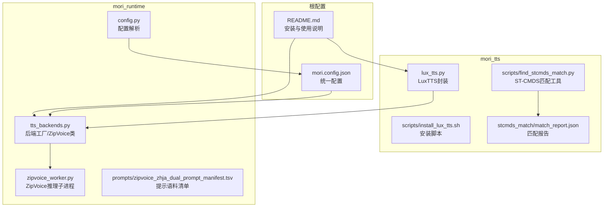
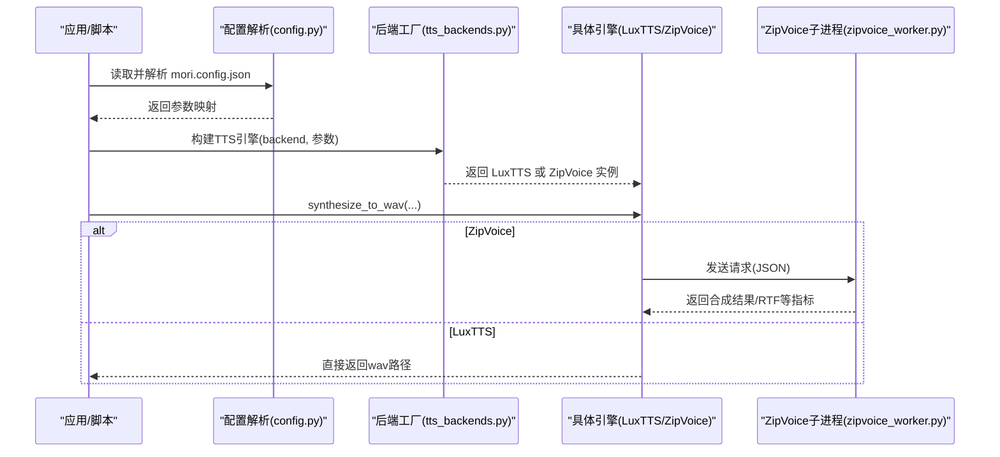
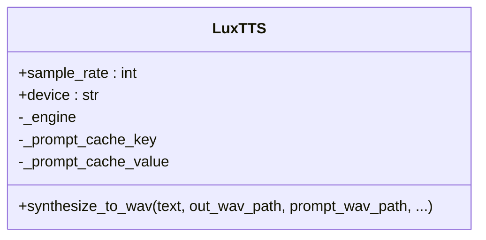
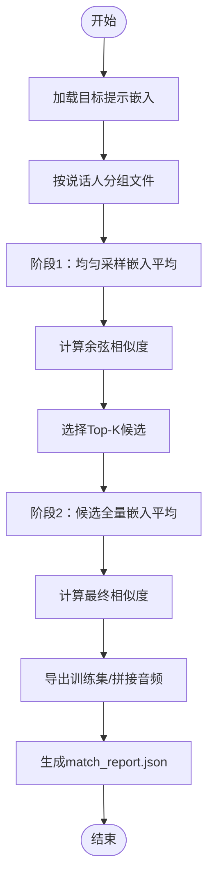
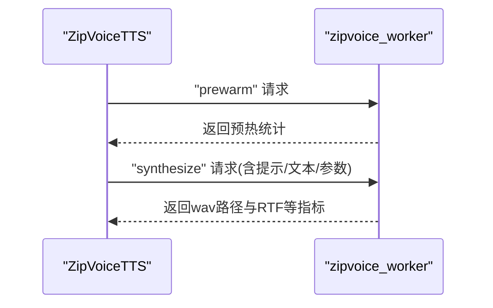
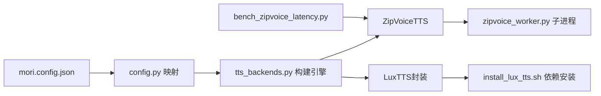

# TTS引擎 (mori_tts)

<cite>
**本文引用的文件**
- [mori_tts/lux_tts.py](file://mori_tts/lux_tts.py)
- [mori_tts/scripts/install_lux_tts.sh](file://mori_tts/scripts/install_lux_tts.sh)
- [mori_tts/scripts/find_stcmds_match.py](file://mori_tts/scripts/find_stcmds_match.py)
- [mori_tts/stcmds_match/match_report.json](file://mori_tts/stcmds_match/match_report.json)
- [mori_runtime/tts_backends.py](file://mori_runtime/tts_backends.py)
- [mori_runtime/zipvoice_worker.py](file://mori_runtime/zipvoice_worker.py)
- [mori_runtime/config.py](file://mori_runtime/config.py)
- [mori_runtime/prompts/zipvoice_zhja_dual_prompt_manifest.tsv](file://mori_runtime/prompts/zipvoice_zhja_dual_prompt_manifest.tsv)
- [mori.config.json](file://mori.config.json)
- [README.md](file://README.md)
- [scripts/bench_zipvoice_latency.py](file://scripts/bench_zipvoice_latency.py)
</cite>

## 目录
1. [简介](#简介)
2. [项目结构](#项目结构)
3. [核心组件](#核心组件)
4. [架构总览](#架构总览)
5. [详细组件分析](#详细组件分析)
6. [依赖分析](#依赖分析)
7. [性能考量](#性能考量)
8. [故障排查指南](#故障排查指南)
9. [结论](#结论)
10. [附录](#附录)

## 简介
本文件面向TTS引擎(mori_tts)的综合技术文档，重点覆盖以下方面：
- LuxTTS集成方案：模型架构、训练数据来源、语音质量特点与参数化策略
- stcmds匹配系统：音素序列匹配、语音命令库、质量评估指标
- TTS后端选择策略：LuxTTS vs ZipVoice的性能对比、适用场景、配置差异
- 语音合成流程：文本预处理、音素转换、声学模型推理、波形重建
- 音频处理优化：采样率调整、比特率控制、延迟优化
- 安装配置指南、性能调优参数、常见问题解决方案

## 项目结构
mori_tts位于仓库中，负责提供LuxTTS封装与ST-CMDS匹配工具；mori_runtime提供ZipVoice后端及统一配置解析；README提供安装与运行指引。

**图表来源**
- [mori_tts/lux_tts.py:1-171](file://mori_tts/lux_tts.py#L1-L171)
- [mori_tts/scripts/install_lux_tts.sh:1-16](file://mori_tts/scripts/install_lux_tts.sh#L1-L16)
- [mori_tts/scripts/find_stcmds_match.py:1-414](file://mori_tts/scripts/find_stcmds_match.py#L1-L414)
- [mori_tts/stcmds_match/match_report.json:1-54](file://mori_tts/stcmds_match/match_report.json#L1-L54)
- [mori_runtime/tts_backends.py:1-1171](file://mori_runtime/tts_backends.py#L1-L1171)
- [mori_runtime/zipvoice_worker.py:1-729](file://mori_runtime/zipvoice_worker.py#L1-L729)
- [mori_runtime/config.py:1-270](file://mori_runtime/config.py#L1-L270)
- [mori_runtime/prompts/zipvoice_zhja_dual_prompt_manifest.tsv:1-4](file://mori_runtime/prompts/zipvoice_zhja_dual_prompt_manifest.tsv#L1-L4)
- [mori.config.json:1-83](file://mori.config.json#L1-L83)
- [README.md:1-179](file://README.md#L1-L179)

**章节来源**
- [README.md:63-86](file://README.md#L63-L86)
- [mori_runtime/config.py:1-270](file://mori_runtime/config.py#L1-L270)
- [mori.config.json:1-83](file://mori.config.json#L1-L83)

## 核心组件
- LuxTTS封装：提供模型加载、设备选择、提示编码缓存、合成接口与采样率常量
- ST-CMDS匹配工具：基于说话人嵌入的粗筛-精筛流程，导出训练集与听感拼接音频
- ZipVoice后端：以子进程方式承载ZipVoice模型与vocoder，支持多语言路由与提示池
- 配置系统：统一解析mori.config.json，映射到各后端参数与路径
- 安装与评测：安装脚本、延迟评测脚本与基准结果目录

**章节来源**
- [mori_tts/lux_tts.py:65-171](file://mori_tts/lux_tts.py#L65-L171)
- [mori_tts/scripts/find_stcmds_match.py:296-414](file://mori_tts/scripts/find_stcmds_match.py#L296-L414)
- [mori_runtime/tts_backends.py:525-800](file://mori_runtime/tts_backends.py#L525-L800)
- [mori_runtime/zipvoice_worker.py:446-729](file://mori_runtime/zipvoice_worker.py#L446-L729)
- [mori_runtime/config.py:204-270](file://mori_runtime/config.py#L204-L270)
- [mori_runtime/prompts/zipvoice_zhja_dual_prompt_manifest.tsv:1-4](file://mori_runtime/prompts/zipvoice_zhja_dual_prompt_manifest.tsv#L1-L4)
- [mori.config.json:14-51](file://mori.config.json#L14-L51)

## 架构总览
整体架构由“配置层 → 后端工厂 → 具体引擎 → 子进程/外部依赖”构成。ZipVoice通过持久化子进程进行推理，LuxTTS在Python侧直接调用底层实现。

**图表来源**
- [mori_runtime/config.py:188-270](file://mori_runtime/config.py#L188-L270)
- [mori_runtime/tts_backends.py:525-800](file://mori_runtime/tts_backends.py#L525-L800)
- [mori_runtime/zipvoice_worker.py:625-729](file://mori_runtime/zipvoice_worker.py#L625-L729)
- [mori_tts/lux_tts.py:132-171](file://mori_tts/lux_tts.py#L132-L171)

## 详细组件分析

### LuxTTS集成方案
- 模型与设备
  - 默认模型引用与自动下载机制由底层库处理
  - 设备自动检测顺序：CUDA → MPS → CPU
  - 采样率固定为48kHz
- 提示编码缓存
  - 基于提示音频路径、修改时间、时长、RMS构建键，避免重复编码
- 合成流程
  - 文本输入经底层引擎生成语音张量，再写入wav文件
  - 多线程安全通过锁保护
- 安装与依赖
  - 提供一键安装脚本，包含必要Python包与LuxTTS源码安装

**图表来源**
- [mori_tts/lux_tts.py:65-106](file://mori_tts/lux_tts.py#L65-L106)
- [mori_tts/lux_tts.py:132-171](file://mori_tts/lux_tts.py#L132-L171)

**章节来源**
- [mori_tts/lux_tts.py:11-21](file://mori_tts/lux_tts.py#L11-L21)
- [mori_tts/lux_tts.py:42-56](file://mori_tts/lux_tts.py#L42-L56)
- [mori_tts/lux_tts.py:107-131](file://mori_tts/lux_tts.py#L107-L131)
- [mori_tts/lux_tts.py:132-171](file://mori_tts/lux_tts.py#L132-L171)
- [mori_tts/scripts/install_lux_tts.sh:1-16](file://mori_tts/scripts/install_lux_tts.sh#L1-L16)

### ST-CMDS匹配系统
- 数据准备
  - 输入ST-CMDS 20170001 OS数据集目录与目标提示wav
  - 自动扫描并按说话人分组
- 匹配流程
  - 阶段1：每个说话人均匀采样若干片段，计算平均嵌入，粗筛Top-K
  - 阶段2：对Top-K说话人全量嵌入取平均，计算最终余弦相似度得分
- 导出与报告
  - 导出该说话人的全部wav到输出目录，生成filelist.csv
  - 可选生成听感拼接音频，插入静音间隔
  - 输出match_report.json记录最佳匹配、候选列表与导出信息

**图表来源**
- [mori_tts/scripts/find_stcmds_match.py:296-414](file://mori_tts/scripts/find_stcmds_match.py#L296-L414)

**章节来源**
- [mori_tts/scripts/find_stcmds_match.py:98-121](file://mori_tts/scripts/find_stcmds_match.py#L98-L121)
- [mori_tts/scripts/find_stcmds_match.py:155-179](file://mori_tts/scripts/find_stcmds_match.py#L155-L179)
- [mori_tts/scripts/find_stcmds_match.py:325-376](file://mori_tts/scripts/find_stcmds_match.py#L325-L376)
- [mori_tts/scripts/find_stcmds_match.py:380-409](file://mori_tts/scripts/find_stcmds_match.py#L380-L409)
- [mori_tts/stcmds_match/match_report.json:1-54](file://mori_tts/stcmds_match/match_report.json#L1-L54)

### ZipVoice后端与子进程
- 引擎职责
  - 解析配置、校验路径与模型完整性
  - 启动持久化子进程，读取其就绪消息并确定特征采样率与输出采样率
  - 通过JSON协议与子进程通信，支持预热与正式推理
  - 维护提示池、轮询/随机/意图哈希策略
- 子进程职责
  - 加载ZipVoice/ZipVoiceDistill模型与vocoder
  - 缓存提示上下文（内存+持久化），支持跨请求复用
  - 文本分词、分段、特征预测、vocoder解码、交叉淡化与静音裁剪
  - 输出RTF、时长等指标

**图表来源**
- [mori_runtime/tts_backends.py:668-703](file://mori_runtime/tts_backends.py#L668-L703)
- [mori_runtime/tts_backends.py:704-728](file://mori_runtime/tts_backends.py#L704-L728)
- [mori_runtime/zipvoice_worker.py:649-679](file://mori_runtime/zipvoice_worker.py#L649-L679)
- [mori_runtime/zipvoice_worker.py:684-722](file://mori_runtime/zipvoice_worker.py#L684-L722)

**章节来源**
- [mori_runtime/tts_backends.py:525-800](file://mori_runtime/tts_backends.py#L525-L800)
- [mori_runtime/zipvoice_worker.py:446-729](file://mori_runtime/zipvoice_worker.py#L446-L729)

### 语音合成流程（文本到波形）
- 文本预处理
  - ZipVoice侧：添加标点、分词、按最大时长切分批次
  - LuxTTS侧：直接输入文本，内部完成音素化与声学推理
- 音素/特征转换
  - ZipVoice：基于tokenizer与特征提取器生成声学特征
  - LuxTTS：底层模型完成音素到声学特征映射
- 声学模型推理
  - ZipVoice：sample接口预测声学特征序列
  - LuxTTS：底层生成语音张量
- 波形重建
  - ZipVoice：可选LinaCodec Vocos 48k vocoder或内置vocoder
  - LuxTTS：写入48kHz wav文件
- 后处理
  - ZipVoice：交叉淡化、静音裁剪、RMS缩放

**章节来源**
- [mori_runtime/zipvoice_worker.py:303-444](file://mori_runtime/zipvoice_worker.py#L303-L444)
- [mori_tts/lux_tts.py:155-170](file://mori_tts/lux_tts.py#L155-L170)

### TTS后端选择策略（LuxTTS vs ZipVoice）
- 性能对比要点
  - ZipVoice：通过子进程持久化、提示缓存、批处理与多线程可降低冷启动与提升吞吐
  - LuxTTS：Python侧直接推理，部署简单，适合轻量场景
- 适用场景
  - ZipVoice：高并发、低延迟、多语言路由、提示池管理需求强
  - LuxTTS：快速原型、单机演示、无需额外子进程依赖
- 配置差异
  - ZipVoice：需配置模型类型、模型目录、检查点、分词器、vocoder配置、提示清单与策略
  - LuxTTS：主要关注模型引用、设备、线程数与合成参数

**章节来源**
- [mori_runtime/tts_backends.py:17-51](file://mori_runtime/tts_backends.py#L17-L51)
- [mori_runtime/tts_backends.py:525-800](file://mori_runtime/tts_backends.py#L525-L800)
- [mori_runtime/zipvoice_worker.py:266-301](file://mori_runtime/zipvoice_worker.py#L266-L301)
- [mori_tts/lux_tts.py:65-98](file://mori_tts/lux_tts.py#L65-L98)

## 依赖分析
- 配置到后端
  - config.py将mori.config.json映射为后端参数
  - tts_backends.py根据配置实例化ZipVoiceTTS或封装LuxTTS
- ZipVoice子进程
  - 通过标准输入输出与子进程交互，约定JSON协议
  - 子进程加载模型与vocoder，维护提示缓存
- 安装与评测
  - install_lux_tts.sh安装LuxTTS与依赖
  - bench_zipvoice_latency.py用于ZipVoice延迟评测

**图表来源**
- [mori_runtime/config.py:188-270](file://mori_runtime/config.py#L188-L270)
- [mori_runtime/tts_backends.py:525-800](file://mori_runtime/tts_backends.py#L525-L800)
- [mori_runtime/zipvoice_worker.py:446-729](file://mori_runtime/zipvoice_worker.py#L446-L729)
- [mori_tts/scripts/install_lux_tts.sh:1-16](file://mori_tts/scripts/install_lux_tts.sh#L1-L16)
- [scripts/bench_zipvoice_latency.py:367-440](file://scripts/bench_zipvoice_latency.py#L367-L440)

**章节来源**
- [mori_runtime/config.py:204-270](file://mori_runtime/config.py#L204-L270)
- [mori_runtime/tts_backends.py:525-800](file://mori_runtime/tts_backends.py#L525-L800)
- [mori_runtime/zipvoice_worker.py:446-729](file://mori_runtime/zipvoice_worker.py#L446-L729)
- [mori_tts/scripts/install_lux_tts.sh:1-16](file://mori_tts/scripts/install_lux_tts.sh#L1-L16)
- [scripts/bench_zipvoice_latency.py:367-440](file://scripts/bench_zipvoice_latency.py#L367-L440)

## 性能考量
- 延迟与吞吐
  - ZipVoice通过子进程持久化、提示缓存与批处理降低首包延迟与提升吞吐
  - 可通过调整num_thread、vocoder_profile与quality_profile平衡实时性与质量
- 采样率与比特率
  - ZipVoice特征采样率通常为24kHz，vocoder可选48kHz输出
  - LuxTTS输出48kHz wav
- 分段合成
  - 对长文本进行软硬切分，缩短首包延迟，避免积压
- 静音处理
  - 可配置移除长静音，减少文件体积与播放等待

**章节来源**
- [mori_runtime/zipvoice_worker.py:419-430](file://mori_runtime/zipvoice_worker.py#L419-L430)
- [mori_runtime/tts_backends.py:410-446](file://mori_runtime/tts_backends.py#L410-L446)
- [scripts/bench_zipvoice_latency.py:55-118](file://scripts/bench_zipvoice_latency.py#L55-L118)

## 故障排查指南
- LuxTTS依赖缺失
  - 症状：导入失败或模块未找到
  - 处理：执行安装脚本，确保依赖已安装
- ZipVoice子进程异常
  - 症状：worker退出、无法读取就绪消息、推理报错
  - 处理：检查模型目录、检查点、分词器文件是否存在；确认子进程脚本路径正确
- 提示语料问题
  - 症状：找不到提示wav或提示清单为空
  - 处理：核对wav路径与清单字段；确保清单头字段与规范化逻辑一致
- 设备不可用
  - 症状：CUDA/MPS不可用导致回退CPU
  - 处理：确认硬件与驱动；或手动指定device

**章节来源**
- [mori_tts/scripts/install_lux_tts.sh:78-82](file://mori_tts/scripts/install_lux_tts.sh#L78-L82)
- [mori_runtime/tts_backends.py:619-647](file://mori_runtime/tts_backends.py#L619-L647)
- [mori_runtime/tts_backends.py:174-230](file://mori_runtime/tts_backends.py#L174-L230)
- [mori_runtime/zipvoice_worker.py:550-556](file://mori_runtime/zipvoice_worker.py#L550-L556)

## 结论
mori_tts提供了简洁可靠的LuxTTS封装与完善的ZipVoice后端生态。通过配置系统与子进程持久化，ZipVoice在低延迟与高吞吐方面具备优势；而LuxTTS则以最小部署成本满足快速验证需求。结合ST-CMDS匹配工具，用户可高效构建高质量的说话人迁移与训练数据集。

## 附录

### 安装配置指南
- 安装LuxTTS依赖与模型
  - 在当前虚拟环境中执行安装脚本
  - 首次使用会自动下载默认模型
- 配置ZipVoice环境
  - 若启用ZipVoice 48k vocoder，需在ZipVoice虚拟环境中安装LinaCodec
- 使用统一配置
  - 在mori.config.json中设置tts后端、模型、设备、线程与ZipVoice相关参数
  - README提供常用命令与参数示例

**章节来源**
- [README.md:63-86](file://README.md#L63-L86)
- [README.md:103-121](file://README.md#L103-L121)
- [mori.config.json:14-51](file://mori.config.json#L14-L51)

### 性能调优参数
- ZipVoice
  - quality_profile：realtime/balanced/hq
  - vocoder_profile：base_24k/lux_48k
  - num_thread：推理线程数
  - prompt_manifest/prompt_policy：提示池与选择策略
- LuxTTS
  - num_steps、guidance_scale、t_shift、speed：影响推理步数与节奏
  - threads：并行线程数

**章节来源**
- [mori_runtime/tts_backends.py:393-446](file://mori_runtime/tts_backends.py#L393-L446)
- [mori_runtime/tts_backends.py:593-607](file://mori_runtime/tts_backends.py#L593-L607)
- [mori_tts/lux_tts.py:66-98](file://mori_tts/lux_tts.py#L66-L98)

### 常见问题与解决方案
- 无法找到ZipVoice模型/检查点
  - 检查模型目录与检查点名称是否正确
- ZipVoice子进程崩溃
  - 查看子进程日志，确认模型配置文件存在且格式正确
- 语言检测不稳定
  - 调整lang_min_conf或切换检测模式（heuristic/auto/lingua）

**章节来源**
- [mori_runtime/tts_backends.py:120-126](file://mori_runtime/tts_backends.py#L120-L126)
- [mori_runtime/tts_backends.py:496-523](file://mori_runtime/tts_backends.py#L496-L523)