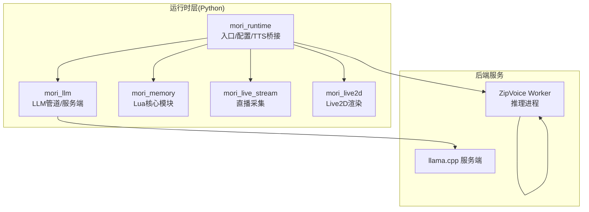
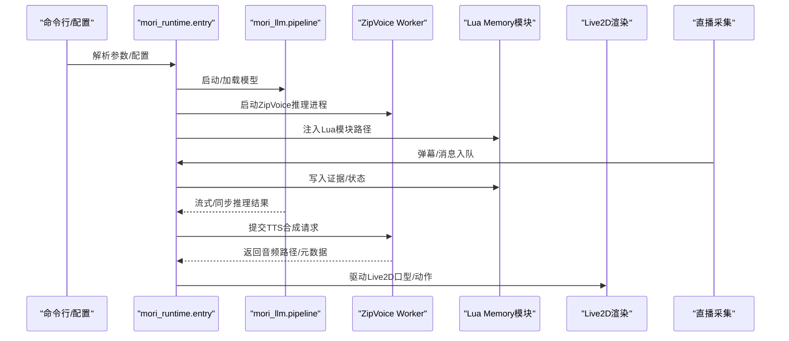
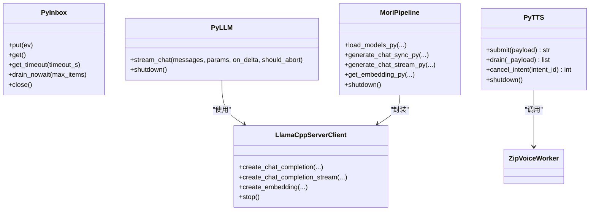
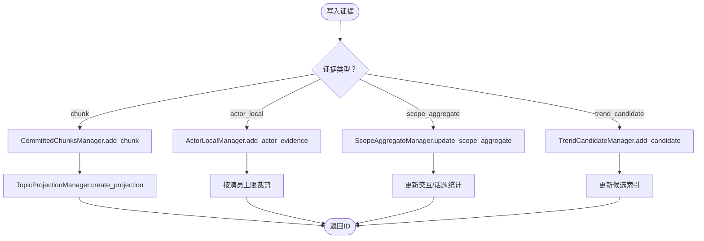
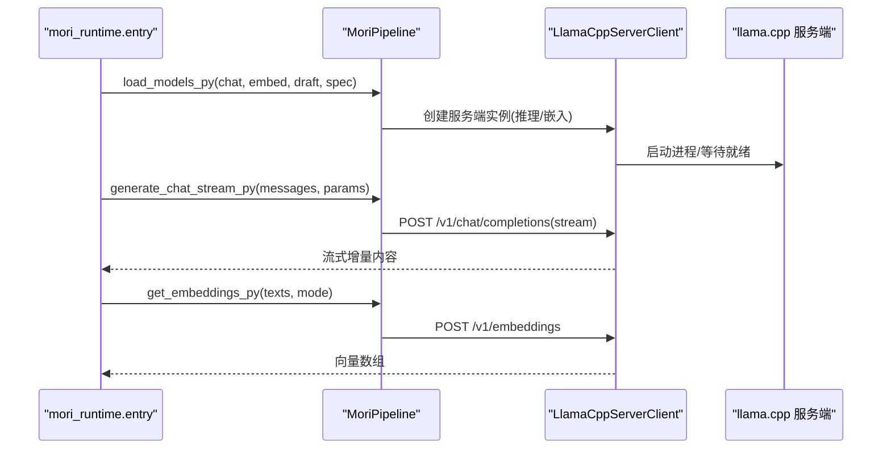
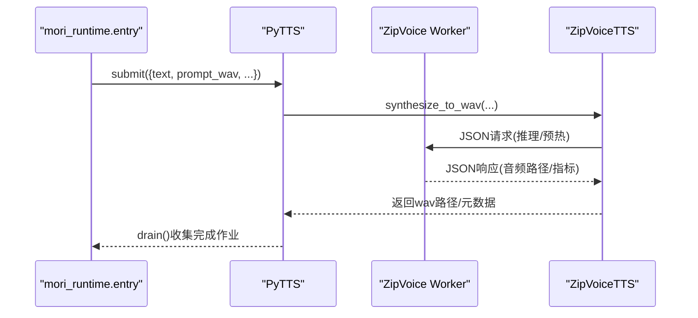
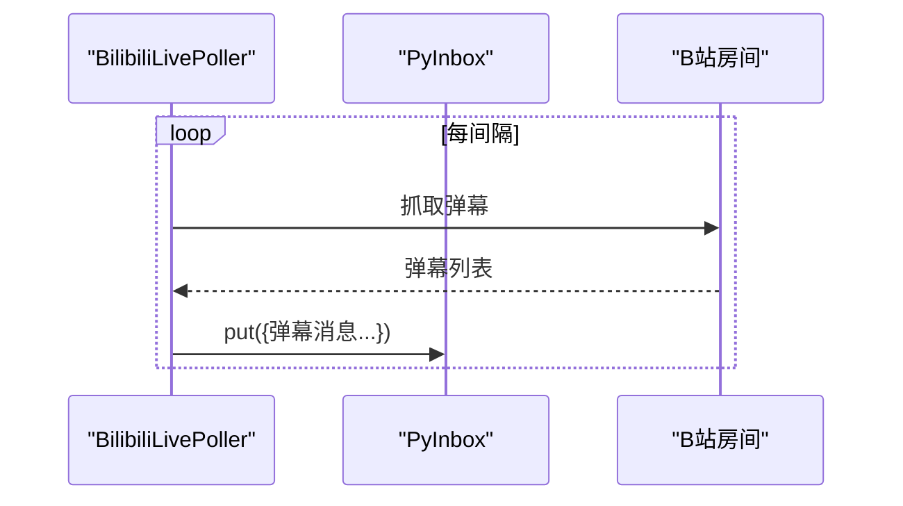
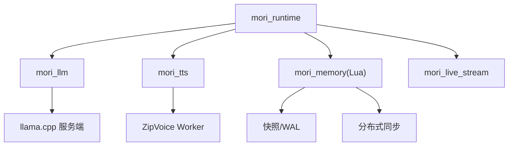

# 核心模块

<cite>
**本文档引用的文件**
- [mori_runtime/entry.py](file://mori_runtime/entry.py)
- [mori_runtime/config.py](file://mori_runtime/config.py)
- [mori_runtime/tts_backends.py](file://mori_runtime/tts_backends.py)
- [mori_runtime/zipvoice_worker.py](file://mori_runtime/zipvoice_worker.py)
- [mori_llm/pipeline.py](file://mori_llm/pipeline.py)
- [mori_llm/llama_cpp_cli.py](file://mori_llm/llama_cpp_cli.py)
- [mori_memory/module/evidence/evidence_store.lua](file://mori_memory/module/evidence/evidence_store.lua)
- [mori_memory/module/state_coordinator.lua](file://mori_memory/module/state_coordinator.lua)
- [mori_memory/module/distributed_sync.lua](file://mori_memory/module/distributed_sync.lua)
- [mori_live2d/inox2d_runtime.py](file://mori_live2d/inox2d_runtime.py)
- [mori_live2d/inochi_session.py](file://mori_live2d/inochi_session.py)
- [mori_live2d/love2d_frontend/main.lua](file://mori_live2d/love2d_frontend/main.lua)
- [mori_live2d/love2d_frontend/controller.lua](file://mori_live2d/love2d_frontend/controller.lua)
- [mori_live_stream/bilibili_live.py](file://mori_live_stream/bilibili_live.py)
- [mori_live_stream/bilibili_room.py](file://mori_live_stream/bilibili_room.py)
</cite>

## 目录
1. [简介](#简介)
2. [项目结构](#项目结构)
3. [核心组件](#核心组件)
4. [架构总览](#架构总览)
5. [详细组件分析](#详细组件分析)
6. [依赖关系分析](#依赖关系分析)
7. [性能考量](#性能考量)
8. [故障排查指南](#故障排查指南)
9. [结论](#结论)

## 简介
本文件面向Mori核心模块的综合技术文档，聚焦以下子系统与其协作方式：
- mori_runtime：系统运行时，负责消息队列、插件管理、配置管理、TTS后端桥接与生命周期控制。
- mori_memory：基于LuaJIT的多维度记忆系统，包含证据存储、状态协调与分布式同步。
- mori_llm：LLM管道，封装llama.cpp服务端/客户端，提供聊天与嵌入向量处理。
- mori_tts：多后端TTS支持，包含LuxTTS与ZipVoice的集成与工作流。
- mori_live2d：Live2D渲染系统，Love2D前端与Inochi会话。
- mori_live_stream：直播处理能力，以B站直播为例的数据采集与事件注入。

文档旨在帮助开发者快速理解模块职责、交互关系与扩展点，并提供可视化图示与排障建议。

## 项目结构
Mori采用“Python运行时 + LuaJIT核心 + 多后端模块”的分层架构：
- Python侧负责运行时编排、配置解析、消息队列、TTS后端选择与进程管理、LLM服务生命周期。
- LuaJIT侧负责记忆系统的证据存储、状态协调、分布式同步与线程运行时。
- 各模块通过Python桥接与Lua模块路径加载进行协作。

图表来源
- [mori_runtime/entry.py:1-1084](file://mori_runtime/entry.py#L1-L1084)
- [mori_runtime/tts_backends.py:1-1171](file://mori_runtime/tts_backends.py#L1-L1171)
- [mori_llm/pipeline.py:1-582](file://mori_llm/pipeline.py#L1-L582)
- [mori_live_stream/bilibili_live.py](file://mori_live_stream/bilibili_live.py)

章节来源
- [mori_runtime/entry.py:414-438](file://mori_runtime/entry.py#L414-L438)
- [mori_runtime/config.py:1-270](file://mori_runtime/config.py#L1-L270)

## 核心组件
- mori_runtime：统一入口，负责配置加载、消息队列、LLM与TTS后端生命周期、直播采集线程、Lua运行时初始化与模块路径注入。
- mori_memory：LuaJIT核心，提供证据存储、状态协调、分布式同步与线程运行时，支撑多维度记忆与一致性保障。
- mori_llm：LLM管道，封装llama.cpp服务端/客户端，提供同步/流式推理与嵌入向量处理。
- mori_tts：多后端TTS，支持LuxTTS与ZipVoice，ZipVoice通过独立Python工作进程承载推理。
- mori_live2d：Live2D渲染系统，Love2D前端与Inochi会话，配合语音输出与口型同步。
- mori_live_stream：直播采集，以B站房间为入口，拉取弹幕并注入运行时消息队列。

章节来源
- [mori_runtime/entry.py:1-1084](file://mori_runtime/entry.py#L1-L1084)
- [mori_memory/module/evidence/evidence_store.lua:1-603](file://mori_memory/module/evidence/evidence_store.lua#L1-L603)
- [mori_llm/pipeline.py:1-582](file://mori_llm/pipeline.py#L1-L582)
- [mori_live2d/inox2d_runtime.py](file://mori_live2d/inox2d_runtime.py)
- [mori_live2d/inochi_session.py](file://mori_live2d/inochi_session.py)
- [mori_live_stream/bilibili_live.py](file://mori_live_stream/bilibili_live.py)

## 架构总览
下图展示运行时如何协调各模块：Python侧负责消息队列、LLM/TTS生命周期与Lua模块加载；Lua侧负责记忆与状态一致性；ZipVoice通过独立进程承载推理；LLM通过llama.cpp服务端提供推理与嵌入。

图表来源
- [mori_runtime/entry.py:796-1084](file://mori_runtime/entry.py#L796-L1084)
- [mori_llm/pipeline.py:307-582](file://mori_llm/pipeline.py#L307-L582)
- [mori_runtime/zipvoice_worker.py:446-729](file://mori_runtime/zipvoice_worker.py#L446-L729)
- [mori_memory/module/evidence/evidence_store.lua:490-603](file://mori_memory/module/evidence/evidence_store.lua#L490-L603)

## 详细组件分析

### mori_runtime：系统运行时
职责与能力
- 配置管理：统一加载JSON配置，解析键映射，相对路径解析与默认值应用。
- 消息队列：PyInbox提供线程安全的消息队列，支持阻塞/非阻塞获取与批量drain。
- 插件与Lua桥接：动态注入Lua模块路径，加载mori_runtime、mori_memory、mori_live_stream模块。
- LLM集成：通过MoriPipeline封装llama.cpp服务端，提供同步/流式聊天与嵌入向量。
- TTS集成：支持LuxTTS与ZipVoice，ZipVoice通过独立Python进程承载推理，提供作业提交/完成回调。
- 直播采集：B站直播轮询线程，抓取弹幕并注入消息队列，支持离线退出与健康检查。
- 生命周期：提供shutdown/cancel等资源回收与异常处理。

图表来源
- [mori_runtime/entry.py:89-413](file://mori_runtime/entry.py#L89-L413)
- [mori_llm/pipeline.py:56-306](file://mori_llm/pipeline.py#L56-L306)

章节来源
- [mori_runtime/entry.py:1-1084](file://mori_runtime/entry.py#L1-L1084)
- [mori_runtime/config.py:1-270](file://mori_runtime/config.py#L1-L270)

### mori_memory：LuaJIT多维度记忆系统
职责与能力
- 证据存储：支持已提交记忆块、演员本地证据、范围聚合证据、趋势候选与主题投影。
- 状态协调：版本向量、事务管理、一致性检查点、WAL恢复日志与快照。
- 分布式同步：节点管理、心跳、增量同步、冲突检测与优雅降级。

图表来源
- [mori_memory/module/evidence/evidence_store.lua:490-603](file://mori_memory/module/evidence/evidence_store.lua#L490-L603)

章节来源
- [mori_memory/module/evidence/evidence_store.lua:1-603](file://mori_memory/module/evidence/evidence_store.lua#L1-L603)
- [mori_memory/module/state_coordinator.lua:1-302](file://mori_memory/module/state_coordinator.lua#L1-L302)
- [mori_memory/module/distributed_sync.lua:1-287](file://mori_memory/module/distributed_sync.lua#L1-L287)

### mori_llm：LLM管道设计
职责与能力
- 模型加载：启动llama.cpp服务端，支持推理与嵌入两种模式，可选草稿模型与SPEC配置。
- 推理优化：流式/同步聊天接口，参数标准化与错误处理。
- 嵌入向量：统一前缀策略与归一化，支持单条/批量嵌入。

图表来源
- [mori_llm/pipeline.py:307-582](file://mori_llm/pipeline.py#L307-L582)
- [mori_llm/llama_cpp_cli.py:1-248](file://mori_llm/llama_cpp_cli.py#L1-L248)

章节来源
- [mori_llm/pipeline.py:1-582](file://mori_llm/pipeline.py#L1-L582)
- [mori_llm/llama_cpp_cli.py:1-248](file://mori_llm/llama_cpp_cli.py#L1-L248)

### mori_tts：多后端支持（LuxTTS与ZipVoice）
职责与能力
- LuxTTS：通过LuxTTS引擎直接推理，适合轻量场景。
- ZipVoice：通过独立Python工作进程承载推理，支持多语言路由、提示词池、质量档位、Vocoder配置与持久化提示缓存。

图表来源
- [mori_runtime/entry.py:203-413](file://mori_runtime/entry.py#L203-L413)
- [mori_runtime/tts_backends.py:525-800](file://mori_runtime/tts_backends.py#L525-L800)
- [mori_runtime/zipvoice_worker.py:625-729](file://mori_runtime/zipvoice_worker.py#L625-L729)

章节来源
- [mori_runtime/tts_backends.py:1-1171](file://mori_runtime/tts_backends.py#L1-L1171)
- [mori_runtime/zipvoice_worker.py:1-729](file://mori_runtime/zipvoice_worker.py#L1-L729)

### mori_live2d：Live2D渲染系统
职责与能力
- Love2D前端：控制器、口型同步、主循环与mori_live_io桥接。
- Inochi会话：与Inochi Puppet会话对接，驱动Live2D模型。
- 与TTS/LLM联动：根据语音输出与文本生成驱动口型与动作。

图表来源
- [mori_live2d/love2d_frontend/controller.lua](file://mori_live2d/love2d_frontend/controller.lua)
- [mori_live2d/love2d_frontend/main.lua](file://mori_live2d/love2d_frontend/main.lua)
- [mori_live2d/inochi_session.py](file://mori_live2d/inochi_session.py)
- [mori_live2d/inox2d_runtime.py](file://mori_live2d/inox2d_runtime.py)

章节来源
- [mori_live2d/love2d_frontend/controller.lua](file://mori_live2d/love2d_frontend/controller.lua)
- [mori_live2d/love2d_frontend/main.lua](file://mori_live2d/love2d_frontend/main.lua)
- [mori_live2d/inochi_session.py](file://mori_live2d/inochi_session.py)
- [mori_live2d/inox2d_runtime.py](file://mori_live2d/inox2d_runtime.py)

### mori_live_stream：直播处理能力
职责与能力
- B站直播轮询：拉取当前房间信息与弹幕，支持回放与优先级注入。
- 事件注入：将弹幕转换为消息结构，注入运行时消息队列，支持离线退出与健康检查。

图表来源
- [mori_runtime/entry.py:479-580](file://mori_runtime/entry.py#L479-L580)
- [mori_live_stream/bilibili_live.py](file://mori_live_stream/bilibili_live.py)
- [mori_live_stream/bilibili_room.py](file://mori_live_stream/bilibili_room.py)

章节来源
- [mori_runtime/entry.py:479-580](file://mori_runtime/entry.py#L479-L580)
- [mori_live_stream/bilibili_live.py](file://mori_live_stream/bilibili_live.py)
- [mori_live_stream/bilibili_room.py](file://mori_live_stream/bilibili_room.py)

## 依赖关系分析
- 运行时依赖
  - mori_runtime依赖mori_llm与mori_tts，通过进程/对象桥接实现推理与语音合成。
  - Lua模块路径由mori_runtime注入，使mori_memory与mori_live_stream的Lua模块可被加载。
- 记忆系统依赖
  - evidence_store依赖topic/topic_graph/exact_state/task_state等内部模块。
  - state_coordinator与distributed_sync依赖持久化保存、快照与WAL恢复日志。
- LLM依赖
  - pipeline依赖llama_cpp_cli解析二进制路径与默认模型，封装HTTP客户端。
- TTS依赖
  - tts_backends依赖mori_tts.lux_tts与zipvoice_worker.py，后者为ZipVoice推理进程。

图表来源
- [mori_runtime/entry.py:414-438](file://mori_runtime/entry.py#L414-L438)
- [mori_llm/pipeline.py:1-582](file://mori_llm/pipeline.py#L1-L582)
- [mori_runtime/tts_backends.py:1-1171](file://mori_runtime/tts_backends.py#L1-L1171)
- [mori_memory/module/state_coordinator.lua:1-302](file://mori_memory/module/state_coordinator.lua#L1-L302)
- [mori_memory/module/distributed_sync.lua:1-287](file://mori_memory/module/distributed_sync.lua#L1-L287)

章节来源
- [mori_runtime/entry.py:414-438](file://mori_runtime/entry.py#L414-L438)
- [mori_llm/pipeline.py:1-582](file://mori_llm/pipeline.py#L1-L582)
- [mori_runtime/tts_backends.py:1-1171](file://mori_runtime/tts_backends.py#L1-L1171)
- [mori_memory/module/state_coordinator.lua:1-302](file://mori_memory/module/state_coordinator.lua#L1-L302)
- [mori_memory/module/distributed_sync.lua:1-287](file://mori_memory/module/distributed_sync.lua#L1-L287)

## 性能考量
- LLM推理
  - 使用llama.cpp服务端避免频繁进程开销，支持草稿模型与SPEC配置提升吞吐。
  - 嵌入向量统一前缀与归一化，减少下游相似度计算偏差。
- TTS
  - ZipVoice通过独立进程承载推理，主线程仅负责作业调度与结果收集。
  - 提示词持久化缓存降低重复特征提取成本，支持跨会话复用。
- 记忆系统
  - 证据存储按时间/演员/范围建立索引，查询与清理策略控制容量。
  - 状态协调采用版本向量与快照，保证一致性同时降低锁竞争。
- Live2D
  - 口型与动作与TTS输出对齐，避免音频与动画不同步导致的抖动。

## 故障排查指南
- 配置问题
  - 检查配置文件路径与键映射，确认相对路径解析与默认值设置。
- LLM服务
  - 确认llama.cpp二进制路径与模型存在，关注启动超时与健康检查。
  - 流式接口异常时检查消息格式与参数标准化。
- TTS问题
  - ZipVoice工作进程未启动或退出：检查Python环境、仓库路径与模型文件。
  - 语言检测失败：确认提示词池与语言检测策略配置。
- 记忆系统
  - 证据存储容量告警：调整上限与清理策略。
  - 一致性检查失败：查看快照与WAL记录，必要时重建检查点。
- 直播采集
  - 弹幕为空：检查房间ID与轮询间隔，确认离线退出逻辑。

章节来源
- [mori_runtime/config.py:160-270](file://mori_runtime/config.py#L160-L270)
- [mori_llm/pipeline.py:159-174](file://mori_llm/pipeline.py#L159-L174)
- [mori_runtime/tts_backends.py:668-703](file://mori_runtime/tts_backends.py#L668-L703)
- [mori_memory/module/state_coordinator.lua:209-258](file://mori_memory/module/state_coordinator.lua#L209-L258)
- [mori_runtime/entry.py:538-557](file://mori_runtime/entry.py#L538-L557)

## 结论
Mori通过Python运行时统一编排、LuaJIT核心提供强健的记忆与一致性保障、多后端LLM/TTS满足多样化需求，并以Live2D与直播采集形成完整的VTuber体验闭环。模块间通过清晰的边界与桥接实现松耦合扩展，便于在保持一致性的同时引入新能力。