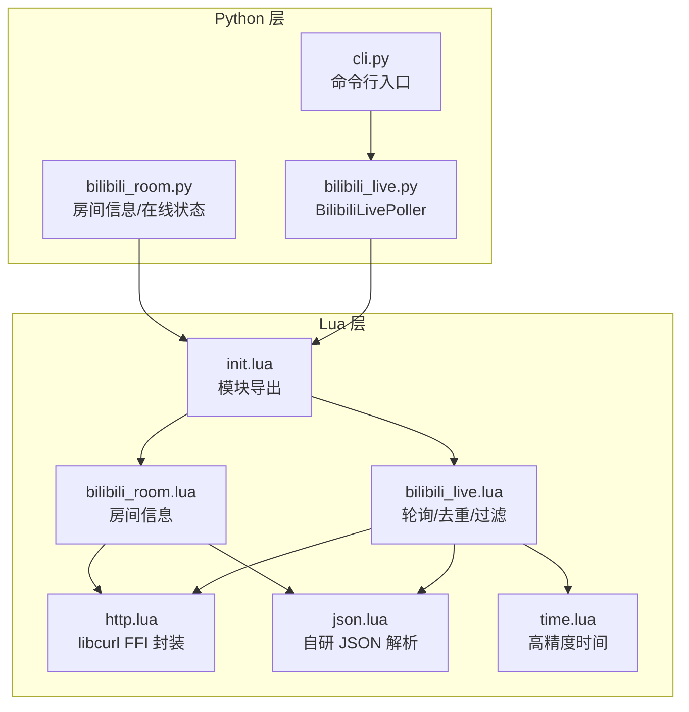
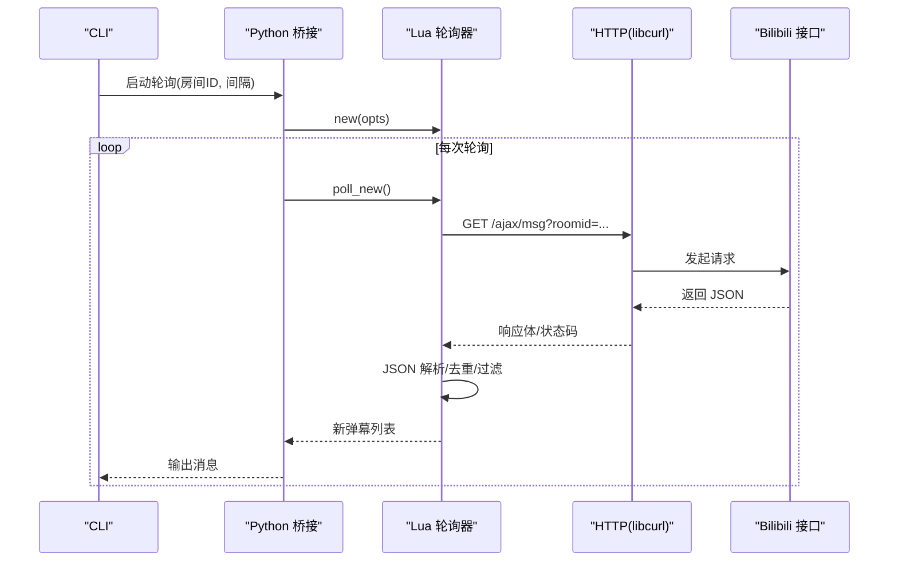
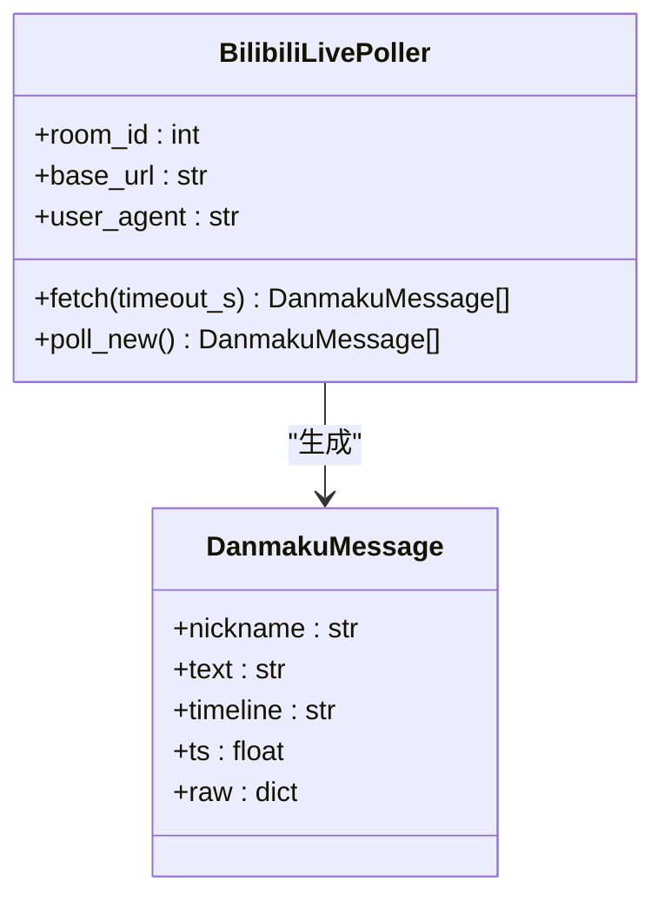
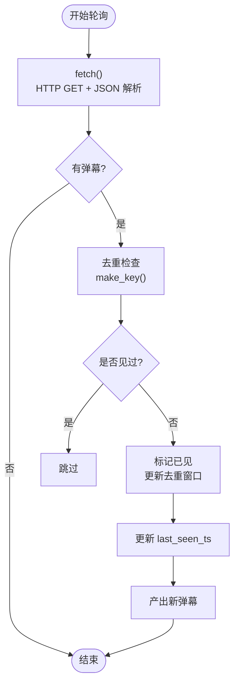
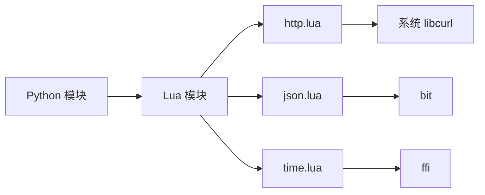

# 直播处理 (mori_live_stream)

<cite>
**本文引用的文件**
- [README.md](file://mori_live_stream/README.md)
- [__init__.py](file://mori_live_stream/__init__.py)
- [bilibili_live.py](file://mori_live_stream/bilibili_live.py)
- [bilibili_room.py](file://mori_live_stream/bilibili_room.py)
- [cli.py](file://mori_live_stream/cli.py)
- [init.lua](file://mori_live_stream/lua/mori_live_stream/init.lua)
- [bilibili_live.lua](file://mori_live_stream/lua/mori_live_stream/bilibili_live.lua)
- [bilibili_room.lua](file://mori_live_stream/lua/mori_live_stream/bilibili_room.lua)
- [http.lua](file://mori_live_stream/lua/mori_live_stream/http.lua)
- [json.lua](file://mori_live_stream/lua/mori_live_stream/json.lua)
- [time.lua](file://mori_live_stream/lua/mori_live_stream/time.lua)
</cite>

## 目录
1. [简介](#简介)
2. [项目结构](#项目结构)
3. [核心组件](#核心组件)
4. [架构总览](#架构总览)
5. [详细组件分析](#详细组件分析)
6. [依赖关系分析](#依赖关系分析)
7. [性能考虑](#性能考虑)
8. [故障排除指南](#故障排除指南)
9. [结论](#结论)
10. [附录](#附录)

## 简介
本文件面向“直播处理（mori_live_stream）”子系统，聚焦于 Bilibili 直播弹幕轮询集成的实现与使用。系统采用“LuaJIT（libcurl FFI）核心 + Python 薄桥接”的混合架构，通过 Lua 层完成 HTTP 请求、JSON 解析与消息去重/过滤，Python 层负责桥接 Lua 运行时、暴露易用接口与 CLI。

- 支持功能
  - 房间连接与状态查询
  - 弹幕轮询与增量拉取
  - 去重、时间戳解析、消息清洗
  - 可配置轮询间隔、超时与用户代理
  - CLI 快速测试与与上层 VTuber 流水线集成

- 关键特性
  - 轻量轮询：基于公开接口，非官方 WebSocket SDK
  - LuaJIT 性能：libcurl FFI 直接调用，JSON 自研解析器
  - Python 桥接：lupa LuaJIT 运行时，统一 Mori 生态

**章节来源**
- [README.md:1-26](file://mori_live_stream/README.md#L1-L26)

## 项目结构
mori_live_stream 子系统由 Python 模块与 Lua 模块两部分组成，Python 负责运行时初始化与桥接，Lua 负责高性能网络与数据处理。

**图表来源**
- [bilibili_live.py:93-221](file://mori_live_stream/bilibili_live.py#L93-L221)
- [bilibili_room.py:93-141](file://mori_live_stream/bilibili_room.py#L93-L141)
- [cli.py:39-58](file://mori_live_stream/cli.py#L39-L58)
- [init.lua:1-6](file://mori_live_stream/lua/mori_live_stream/init.lua#L1-L6)
- [bilibili_live.lua:1-242](file://mori_live_stream/lua/mori_live_stream/bilibili_live.lua#L1-L242)
- [bilibili_room.lua:1-74](file://mori_live_stream/lua/mori_live_stream/bilibili_room.lua#L1-L74)
- [http.lua:1-190](file://mori_live_stream/lua/mori_live_stream/http.lua#L1-L190)
- [json.lua:1-307](file://mori_live_stream/lua/mori_live_stream/json.lua#L1-L307)
- [time.lua:1-38](file://mori_live_stream/lua/mori_live_stream/time.lua#L1-L38)

**章节来源**
- [__init__.py:1-3](file://mori_live_stream/__init__.py#L1-L3)
- [README.md:7-26](file://mori_live_stream/README.md#L7-L26)

## 核心组件
- Python 桥接层
  - BilibiliLivePoller：封装 Lua 轮询器，提供 fetch/poll_new 接口，返回标准化 DanmakuMessage 列表
  - get_room_info/is_live：封装房间信息查询与在线状态判断
  - iter_poll：按固定间隔迭代新弹幕
- Lua 核心层
  - bilibili_live：轮询、去重、时间戳解析、消息清洗
  - bilibili_room：房间信息与在线状态
  - http：libcurl FFI 封装，支持超时、头设置、响应码
  - json：自研 JSON 解析器，支持 Unicode、数组/对象/标量
  - time：高精度时间（优先 gettimeofday）

**章节来源**
- [bilibili_live.py:93-221](file://mori_live_stream/bilibili_live.py#L93-L221)
- [bilibili_room.py:93-141](file://mori_live_stream/bilibili_room.py#L93-L141)
- [bilibili_live.lua:70-242](file://mori_live_stream/lua/mori_live_stream/bilibili_live.lua#L70-L242)
- [bilibili_room.lua:18-74](file://mori_live_stream/lua/mori_live_stream/bilibili_room.lua#L18-L74)
- [http.lua:104-186](file://mori_live_stream/lua/mori_live_stream/http.lua#L104-L186)
- [json.lua:288-303](file://mori_live_stream/lua/mori_live_stream/json.lua#L288-L303)
- [time.lua:22-32](file://mori_live_stream/lua/mori_live_stream/time.lua#L22-L32)

## 架构总览
系统采用“薄桥接 + LuaJIT 核心”的分层设计。Python 侧负责运行时初始化、参数校验与输出格式化；Lua 侧负责网络 I/O、JSON 解析与消息处理，确保在高并发轮询场景下的低延迟与高吞吐。

**图表来源**
- [cli.py:39-58](file://mori_live_stream/cli.py#L39-L58)
- [bilibili_live.py:147-205](file://mori_live_stream/bilibili_live.py#L147-L205)
- [bilibili_live.lua:208-237](file://mori_live_stream/lua/mori_live_stream/bilibili_live.lua#L208-L237)
- [http.lua:104-186](file://mori_live_stream/lua/mori_live_stream/http.lua#L104-L186)

## 详细组件分析

### Python 桥接层
- BilibiliLivePoller
  - 初始化：加载 Lua 模块路径，require mori_live_stream.bilibili_live，传入 room_id/base_url/user_agent/dedupe_size
  - fetch：一次性拉取当前房间弹幕，返回 DanmakuMessage 列表
  - poll_new：增量拉取，内部维护 last_seen 时间戳，仅返回新消息并更新去重窗口
  - iter_poll：按间隔循环调用 poll_new，支持 stop_after 控制运行时长
- 数据转换
  - _lua_to_py/_iter_lua_sequence：将 Lua 返回值安全转换为 Python 对象，避免类型不兼容
  - DanmakuMessage：标准化字段（昵称、文本、时间线、时间戳、原始数据）

**图表来源**
- [bilibili_live.py:93-221](file://mori_live_stream/bilibili_live.py#L93-L221)

**章节来源**
- [bilibili_live.py:93-221](file://mori_live_stream/bilibili_live.py#L93-L221)

### Lua 轮询器（bilibili_live）
- 初始化与配置
  - new：校验 room_id，拼接 base_url，设置默认 UA，初始化去重窗口大小与时间戳
- 轮询流程
  - fetch：构造 URL 与请求头，调用 http.get，解析 JSON，提取房间弹幕列表，清洗空昵称/文本
  - poll_new：对 fetch 结果进行去重（基于 UID/时间线/昵称/文本组合键），过滤旧消息，更新 last_seen_ts
- 去重机制
  - 固定容量环形窗口（列表+哈希集合），超过阈值淘汰最早条目，定期紧凑化减少内存碎片
- 时间戳解析
  - parse_timeline_ts：将“YYYY-MM-DD HH:MM:SS”解析为 Unix 秒，作为去重与排序依据

**图表来源**
- [bilibili_live.lua:149-237](file://mori_live_stream/lua/mori_live_stream/bilibili_live.lua#L149-L237)

**章节来源**
- [bilibili_live.lua:70-242](file://mori_live_stream/lua/mori_live_stream/bilibili_live.lua#L70-L242)

### 房间信息模块（bilibili_room）
- get_room_info：调用房间信息接口，解析返回的 code/data，提取 live_status/title/online/live_time
- is_live：便捷判断 live_status==1

**章节来源**
- [bilibili_room.lua:18-74](file://mori_live_stream/lua/mori_live_stream/bilibili_room.lua#L18-L74)
- [bilibili_room.py:93-141](file://mori_live_stream/bilibili_room.py#L93-L141)

### HTTP 封装（http）
- libcurl FFI：自动探测 curl 库，设置 URL、超时、头、回调等
- 写回调：累积响应体片段，最终拼接为字符串
- 错误处理：返回体为空时携带状态码与错误信息；curl 错误映射为可读字符串

**章节来源**
- [http.lua:104-186](file://mori_live_stream/lua/mori_live_stream/http.lua#L104-L186)

### JSON 解析（json）
- 自研解析器：支持字符串、数字、布尔、null、数组、对象与 Unicode 转义
- 容错策略：遇到非法输入返回错误位置与原因，避免崩溃

**章节来源**
- [json.lua:288-303](file://mori_live_stream/lua/mori_live_stream/json.lua#L288-L303)

### 时间模块（time）
- 高精度时间：优先使用 gettimeofday 获取秒+微秒，失败回退到 os.time

**章节来源**
- [time.lua:22-32](file://mori_live_stream/lua/mori_live_stream/time.lua#L22-L32)

## 依赖关系分析
- Python 依赖
  - lupa（LuaJIT 运行时）：用于执行 Lua 模块与桥接数据
  - 系统 libcurl：供 http.lua 使用
- Lua 依赖
  - bit：json.lua 中的位运算
  - ffi：http.lua 与 time.lua 的 C 接口访问
- 模块耦合
  - Python 仅依赖 Lua 暴露的函数签名，耦合度低
  - Lua 内部模块内聚：http/json/time 分工明确，互不直接依赖 Python

**图表来源**
- [http.lua:1-10](file://mori_live_stream/lua/mori_live_stream/http.lua#L1-L10)
- [json.lua:1-2](file://mori_live_stream/lua/mori_live_stream/json.lua#L1-L2)
- [time.lua:1-8](file://mori_live_stream/lua/mori_live_stream/time.lua#L1-L8)

**章节来源**
- [http.lua:1-190](file://mori_live_stream/lua/mori_live_stream/http.lua#L1-L190)
- [json.lua:1-307](file://mori_live_stream/lua/mori_live_stream/json.lua#L1-L307)
- [time.lua:1-38](file://mori_live_stream/lua/mori_live_stream/time.lua#L1-L38)

## 性能考虑
- 去重窗口与紧凑化
  - 固定容量列表+哈希集合，O(1) 查找与插入；超过阈值淘汰头部并定期紧凑化，控制内存占用
- 时间戳驱动的增量拉取
  - 以 ts 为基准过滤旧消息，避免重复处理
- LuaJIT 优势
  - FFI 直接调用 libcurl，减少 Python-GIL 开销
  - 自研 JSON 解析避免第三方库开销
- 超时与重试
  - 单次请求超时可控，建议在上层循环中根据业务需求调整轮询间隔
- 并发与线程
  - 房间信息模块使用线程本地存储缓存 LuaRuntime，避免多线程重复初始化

**章节来源**
- [bilibili_live.lua:104-147](file://mori_live_stream/lua/mori_live_stream/bilibili_live.lua#L104-L147)
- [bilibili_room.py:61-90](file://mori_live_stream/bilibili_room.py#L61-L90)

## 故障排除指南
- 缺少依赖
  - lupa 未安装：提示安装虚拟环境并安装依赖
  - 系统缺少 libcurl：http.lua 会报告无法加载 libcurl
- 常见错误
  - 412/限流：轮询过于频繁导致被限制，建议增大间隔或更换 UA
  - 无效 JSON：接口返回非预期格式，json.lua 会返回解析错误
  - bilibili 接口 code 非 0：返回错误码与消息，需检查房间 ID 或网络
- 调试建议
  - 使用 CLI 打印历史弹幕（--include-history）观察初始状态
  - 逐步降低轮询间隔定位问题，确认网络与接口稳定性
  - 记录并比对响应体与状态码，辅助定位服务端异常

**章节来源**
- [bilibili_live.py:110-114](file://mori_live_stream/bilibili_live.py#L110-L114)
- [http.lua:52-54](file://mori_live_stream/lua/mori_live_stream/http.lua#L52-L54)
- [bilibili_live.lua:167-175](file://mori_live_stream/lua/mori_live_stream/bilibili_live.lua#L167-L175)
- [README.md:25](file://mori_live_stream/README.md#L25)

## 结论
mori_live_stream 通过“Python 桥接 + LuaJIT 核心”的架构，在保证易用性的同时实现了高效的弹幕轮询与消息处理。其去重、时间戳解析与自定义 JSON 解析器构成了稳定的实时处理链路；结合 CLI 与上层 VTuber 流水线，可快速接入直播场景。对于高并发与稳定性需求，建议配合更严格的超时与重试策略，并在必要时升级为 WebSocket 方案。

## 附录

### 配置与使用指南
- 基础配置
  - 房间 ID：支持直接传入或从 URL 提取
  - 用户代理：默认 UA 已内置，如遇限流可更换
  - 轮询间隔：CLI 默认 2 秒，可根据网络状况调整
  - 超时：单次请求默认 10 秒，可在 Python 层传入
- CLI 快速测试
  - 启动轮询并打印历史弹幕：python3 -m mori_live_stream.cli --room-id <房间号> --include-history
  - 与 VTuber 集成：通过 vtuber.py 的 bilibili 参数传入房间 URL 与轮询参数
- Python 接口
  - BilibiliLivePoller：fetch/poll_new/iter_poll
  - get_room_info/is_live：房间信息与在线状态

**章节来源**
- [cli.py:10-58](file://mori_live_stream/cli.py#L10-L58)
- [bilibili_live.py:147-221](file://mori_live_stream/bilibili_live.py#L147-L221)
- [README.md:11-26](file://mori_live_stream/README.md#L11-L26)