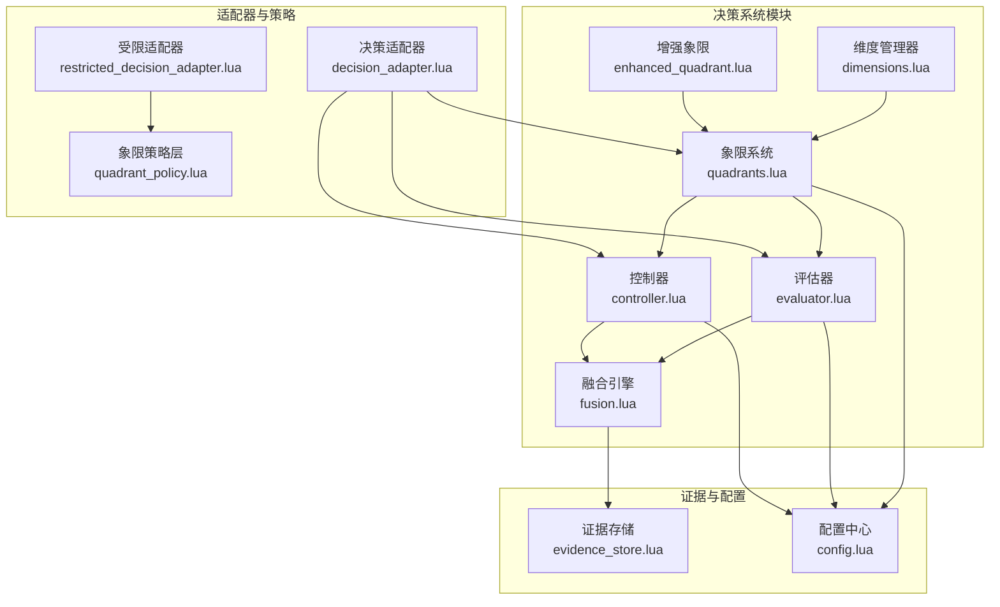
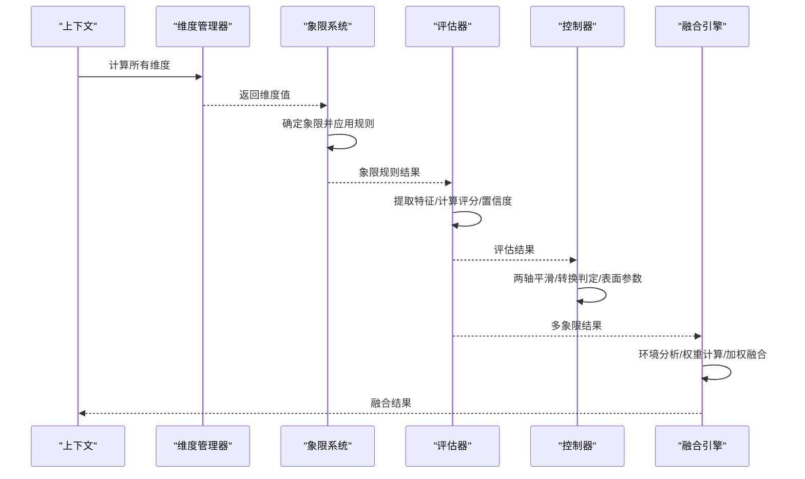
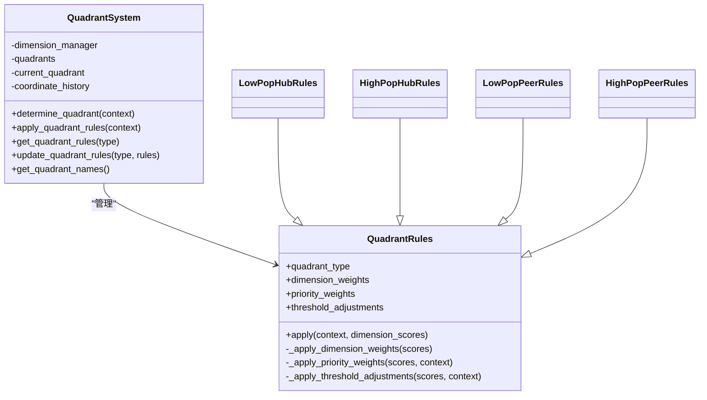
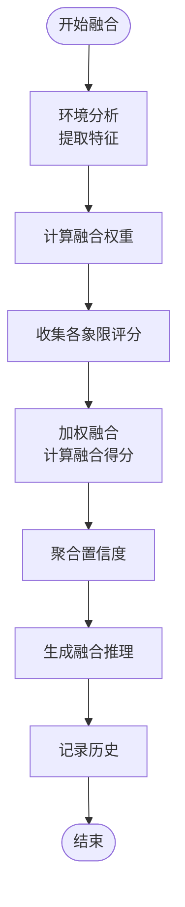
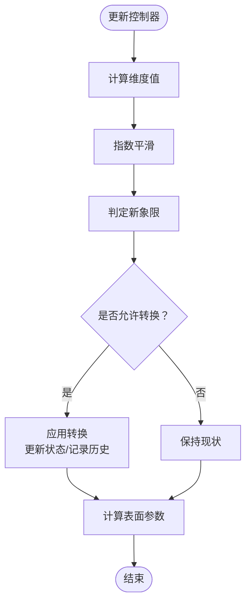
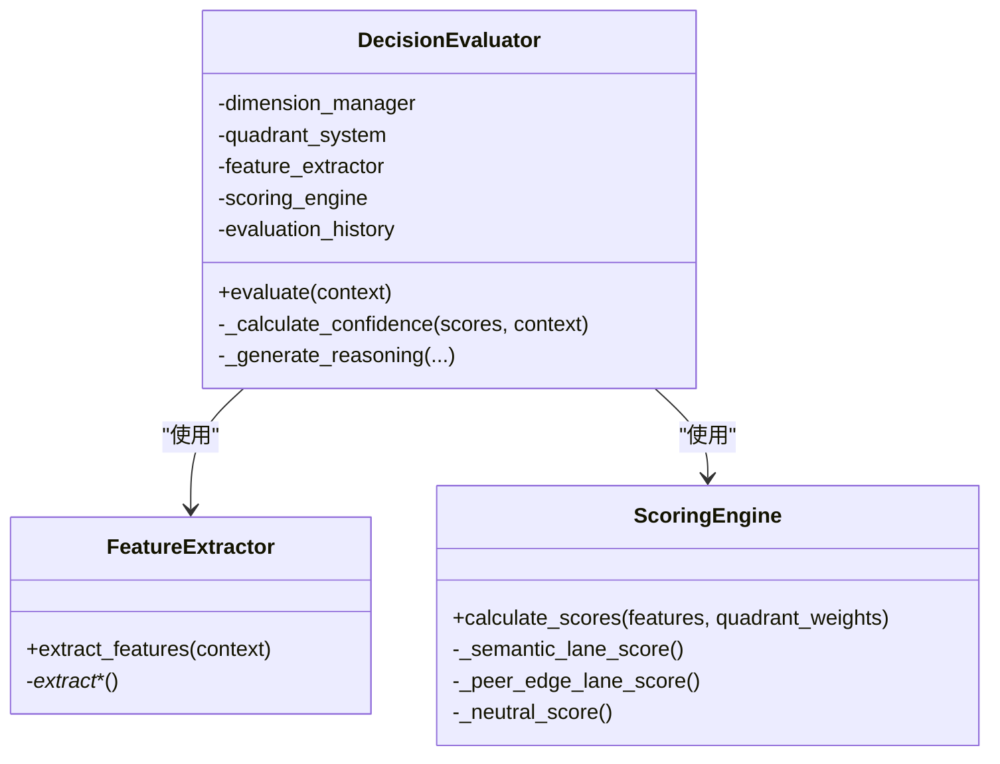
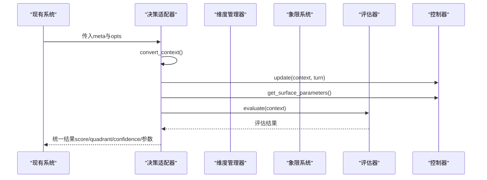
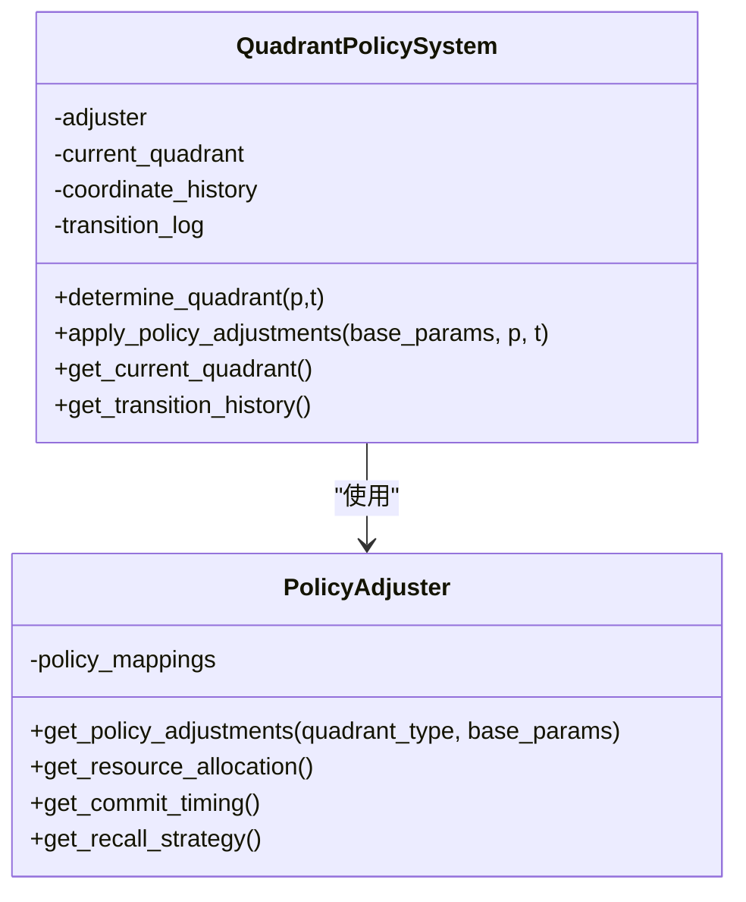
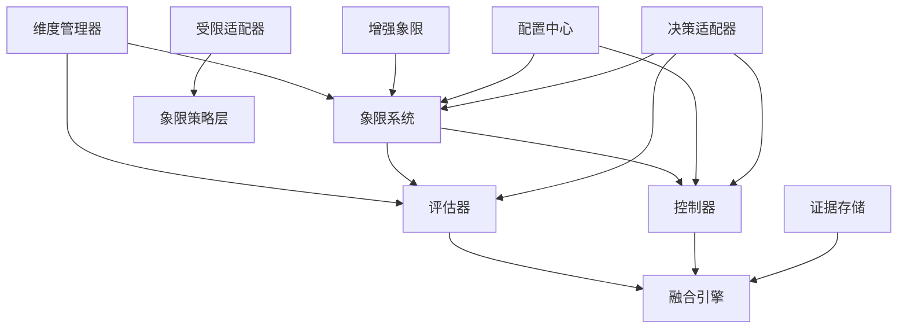

# 决策系统

<cite>
**本文档引用的文件**
- [mori_memory/module/decision/init.lua](file://mori_memory/module/decision/init.lua)
- [mori_memory/module/decision/quadrants.lua](file://mori_memory/module/decision/quadrants.lua)
- [mori_memory/module/decision/dimensions.lua](file://mori_memory/module/decision/dimensions.lua)
- [mori_memory/module/decision/evaluator.lua](file://mori_memory/module/decision/evaluator.lua)
- [mori_memory/module/decision/controller.lua](file://mori_memory/module/decision/controller.lua)
- [mori_memory/module/decision/fusion.lua](file://mori_memory/module/decision/fusion.lua)
- [mori_memory/module/decision/enhanced_quadrant.lua](file://mori_memory/module/decision/enhanced_quadrant.lua)
- [mori_memory/module/decision_adapter.lua](file://mori_memory/module/decision_adapter.lua)
- [mori_memory/module/restricted_decision_adapter.lua](file://mori_memory/module/restricted_decision_adapter.lua)
- [mori_memory/module/policy/quadrant_policy.lua](file://mori_memory/module/policy/quadrant_policy.lua)
- [mori_memory/module/evidence/evidence_store.lua](file://mori_memory/module/evidence/evidence_store.lua)
- [mori_memory/module/config.lua](file://mori_memory/module/config.lua)
- [test_decision_system.lua](file://test_decision_system.lua)
- [integration_demo.lua](file://integration_demo.lua)
</cite>

## 目录
1. [简介](#简介)
2. [项目结构](#项目结构)
3. [核心组件](#核心组件)
4. [架构总览](#架构总览)
5. [详细组件分析](#详细组件分析)
6. [依赖关系分析](#依赖关系分析)
7. [性能考量](#性能考量)
8. [故障排除指南](#故障排除指南)
9. [结论](#结论)
10. [附录](#附录)

## 简介
本文件面向决策系统的设计与实现，围绕四象限分析（Quadrants）、融合算法（Fusion）、控制器（Controller）、评估器（Evaluator）四大核心模块，系统阐述其架构设计、数据流、处理逻辑与集成方式，并提供决策适配器的扩展接口与自定义策略开发指南。该系统旨在通过两轴（人口压力、互动拓扑）驱动的象限划分，结合多源证据的加权融合，实现对直播/聊天等动态环境下的高质量决策。

## 项目结构
决策系统位于 mori_memory/module/decision 目录下，采用模块化设计，包含维度管理、象限系统、评估器、控制器、融合引擎等子模块，并通过适配器与策略层对接现有 disentangle 系统，确保平滑迁移与兼容。

**图表来源**
- [mori_memory/module/decision/init.lua:1-21](file://mori_memory/module/decision/init.lua#L1-L21)
- [mori_memory/module/decision/quadrants.lua:1-285](file://mori_memory/module/decision/quadrants.lua#L1-L285)
- [mori_memory/module/decision/dimensions.lua:1-210](file://mori_memory/module/decision/dimensions.lua#L1-L210)
- [mori_memory/module/decision/evaluator.lua:1-362](file://mori_memory/module/decision/evaluator.lua#L1-L362)
- [mori_memory/module/decision/controller.lua:1-194](file://mori_memory/module/decision/controller.lua#L1-L194)
- [mori_memory/module/decision/fusion.lua:1-302](file://mori_memory/module/decision/fusion.lua#L1-L302)
- [mori_memory/module/decision/enhanced_quadrant.lua:1-335](file://mori_memory/module/decision/enhanced_quadrant.lua#L1-L335)
- [mori_memory/module/decision_adapter.lua:1-130](file://mori_memory/module/decision_adapter.lua#L1-L130)
- [mori_memory/module/restricted_decision_adapter.lua:1-219](file://mori_memory/module/restricted_decision_adapter.lua#L1-L219)
- [mori_memory/module/policy/quadrant_policy.lua:1-238](file://mori_memory/module/policy/quadrant_policy.lua#L1-L238)
- [mori_memory/module/evidence/evidence_store.lua:1-603](file://mori_memory/module/evidence/evidence_store.lua#L1-L603)
- [mori_memory/module/config.lua:1-680](file://mori_memory/module/config.lua#L1-L680)

**章节来源**
- [mori_memory/module/decision/init.lua:1-21](file://mori_memory/module/decision/init.lua#L1-L21)

## 核心组件
- 维度管理器（DimensionManager）：负责将原始上下文抽象为标准化的维度值，包括人口压力、交互拓扑、消息频率、参与者多样性等。
- 象限系统（QuadrantSystem）：基于维度值确定当前象限，并应用对应象限的规则权重与阈值调整。
- 评估器（DecisionEvaluator）：提取特征、计算评分、生成置信度与推理说明。
- 控制器（DecisionController）：两轴控制机制，平滑象限转换，计算表面参数（依附保守主义、对等信号信任、Hub回退信任、写入保守主义、读出局部性）。
- 融合引擎（ContextFusionEngine）：对多象限结果进行加权融合，输出置信度、推理说明与元数据。
- 增强象限（EnhancedQuadrant）：提供自适应阈值与转换平滑，提升在噪声环境中的鲁棒性。
- 适配器（DecisionAdapter/RestrictedDecisionAdapter）：与现有 disentangle 系统集成，提供受控的参数调节接口。
- 策略层（QuadrantPolicy）：仅做参数调节，不越权控制系统核心职责。

**章节来源**
- [mori_memory/module/decision/dimensions.lua:156-210](file://mori_memory/module/decision/dimensions.lua#L156-L210)
- [mori_memory/module/decision/quadrants.lua:207-285](file://mori_memory/module/decision/quadrants.lua#L207-L285)
- [mori_memory/module/decision/evaluator.lua:251-362](file://mori_memory/module/decision/evaluator.lua#L251-L362)
- [mori_memory/module/decision/controller.lua:27-194](file://mori_memory/module/decision/controller.lua#L27-L194)
- [mori_memory/module/decision/fusion.lua:117-302](file://mori_memory/module/decision/fusion.lua#L117-L302)
- [mori_memory/module/decision/enhanced_quadrant.lua:213-335](file://mori_memory/module/decision/enhanced_quadrant.lua#L213-L335)
- [mori_memory/module/decision_adapter.lua:1-130](file://mori_memory/module/decision_adapter.lua#L1-L130)
- [mori_memory/module/restricted_decision_adapter.lua:1-219](file://mori_memory/module/restricted_decision_adapter.lua#L1-L219)
- [mori_memory/module/policy/quadrant_policy.lua:141-238](file://mori_memory/module/policy/quadrant_policy.lua#L141-L238)

## 架构总览
决策系统采用“维度 → 象限 → 评估 → 控制 → 融合”的流水线式处理，其中评估器与控制器既可独立工作，也可协同输出表面参数，供上层策略层与适配器使用。

**图表来源**
- [mori_memory/module/decision/dimensions.lua:182-189](file://mori_memory/module/decision/dimensions.lua#L182-L189)
- [mori_memory/module/decision/quadrants.lua:227-264](file://mori_memory/module/decision/quadrants.lua#L227-L264)
- [mori_memory/module/decision/evaluator.lua:267-308](file://mori_memory/module/decision/evaluator.lua#L267-L308)
- [mori_memory/module/decision/controller.lua:44-79](file://mori_memory/module/decision/controller.lua#L44-L79)
- [mori_memory/module/decision/fusion.lua:132-229](file://mori_memory/module/decision/fusion.lua#L132-L229)

## 详细组件分析

### 四象限分析（Quadrants）
- 象限定义：低人口广播型（LOW_POP_HUB）、高人口广播型（HIGH_POP_HUB）、低人口对等型（LOW_POP_PEER）、高人口对等型（HIGH_POP_PEER）。
- 坐标系：人口压力（population_pressure）与互动拓扑（interaction_topology），均归一化至[0,1]。
- 规则体系：每个象限维护维度权重、优先级权重与阈值调整，用于对基础评分进行加权与修正。
- 历史记录：保存坐标历史，限制长度以控制内存占用。

**图表来源**
- [mori_memory/module/decision/quadrants.lua:10-285](file://mori_memory/module/decision/quadrants.lua#L10-L285)

**章节来源**
- [mori_memory/module/decision/quadrants.lua:10-285](file://mori_memory/module/decision/quadrants.lua#L10-L285)

### 融合算法（Fusion）
- 环境分析器：从上下文提取消息频率、参与者多样性、稳定性、时间特征等，形成环境特征向量。
- 权重计算器：基于基础权重与当前象限，计算融合权重并归一化。
- 融合流程：收集各象限评分，按权重加权求和得到融合得分；聚合置信度；生成融合推理说明；记录历史。
- 输出：融合上下文包含象限权重、融合得分、整体置信度、推理说明与元数据。

**图表来源**
- [mori_memory/module/decision/fusion.lua:132-229](file://mori_memory/module/decision/fusion.lua#L132-L229)

**章节来源**
- [mori_memory/module/decision/fusion.lua:117-302](file://mori_memory/module/decision/fusion.lua#L117-L302)

### 控制器（Controller）两轴控制机制
- 输入：维度管理器计算的人口压力与交互拓扑。
- 平滑处理：指数平滑减少抖动。
- 象限判定：基于阈值（0.5）确定象限。
- 转换逻辑：若当前回合未处于保持期且象限发生变化，则允许转换，并记录转换历史。
- 表面参数：根据当前象限规则插值计算依附保守主义、对等信号信任、Hub回退信任、写入保守主义、读出局部性等参数。

**图表来源**
- [mori_memory/module/decision/controller.lua:44-116](file://mori_memory/module/decision/controller.lua#L44-L116)

**章节来源**
- [mori_memory/module/decision/controller.lua:27-194](file://mori_memory/module/decision/controller.lua#L27-L194)

### 评估器（Evaluator）决策质量评估与反馈
- 特征提取：语义相似性、用户连续性、回复检测、提及检测、消息长度、消息复杂度、时间邻近性、流稳定性等。
- 评分通道：语义通道、对等边通道、中性评分，分别计算并加权。
- 置信度：基于评分一致性与流稳定性综合计算。
- 推理说明：输出象限解释、关键特征与评分对比。
- 历史记录：维护评估历史，限制长度。

**图表来源**
- [mori_memory/module/decision/evaluator.lua:251-362](file://mori_memory/module/decision/evaluator.lua#L251-L362)

**章节来源**
- [mori_memory/module/decision/evaluator.lua:1-362](file://mori_memory/module/decision/evaluator.lua#L1-L362)

### 决策适配器与扩展接口
- 决策适配器：将现有 disentangle 系统参数转换为新系统上下文，调用维度管理器、象限系统、评估器与控制器，输出统一结果。
- 受限适配器：仅提供策略参数调节，明确禁止越权操作（如直接路由决策、内存组织、attach/split控制、pending状态管理等），并提供合规性检查与日志。

**图表来源**
- [mori_memory/module/decision_adapter.lua:76-114](file://mori_memory/module/decision_adapter.lua#L76-L114)

**章节来源**
- [mori_memory/module/decision_adapter.lua:1-130](file://mori_memory/module/decision_adapter.lua#L1-L130)
- [mori_memory/module/restricted_decision_adapter.lua:1-219](file://mori_memory/module/restricted_decision_adapter.lua#L1-L219)

### 自定义决策策略开发指南
- 策略层（QuadrantPolicy）：仅做参数调节，不涉及核心路由决策。通过象限坐标映射到策略参数集合，输出调整后的参数与元数据。
- 开发步骤：
  1) 定义象限坐标（人口压力、互动拓扑）。
  2) 设计策略参数映射（依附保守主义、对等信号信任、写入保守主义、资源分配等）。
  3) 在受限适配器中注入策略结果，确保不越权。
  4) 通过日志与合规性检查验证策略边界。

**图表来源**
- [mori_memory/module/policy/quadrant_policy.lua:141-238](file://mori_memory/module/policy/quadrant_policy.lua#L141-L238)

**章节来源**
- [mori_memory/module/policy/quadrant_policy.lua:1-238](file://mori_memory/module/policy/quadrant_policy.lua#L1-L238)
- [mori_memory/module/restricted_decision_adapter.lua:70-128](file://mori_memory/module/restricted_decision_adapter.lua#L70-L128)

## 依赖关系分析
- 内部耦合：维度管理器为象限系统与评估器提供输入；评估器与控制器共同服务于融合引擎；增强象限可替代基础象限系统。
- 外部依赖：证据存储模块提供趋势候选、演员本地证据、范围聚合与主题投影，辅助决策过程；配置中心提供两轴控制器与象限偏移等参数。
- 适配器：决策适配器与受限适配器分别承担全功能集成与参数调节的角色，避免越权。

**图表来源**
- [mori_memory/module/decision/fusion.lua:1-302](file://mori_memory/module/decision/fusion.lua#L1-L302)
- [mori_memory/module/evidence/evidence_store.lua:1-603](file://mori_memory/module/evidence/evidence_store.lua#L1-L603)
- [mori_memory/module/config.lua:348-496](file://mori_memory/module/config.lua#L348-L496)
- [mori_memory/module/decision_adapter.lua:1-130](file://mori_memory/module/decision_adapter.lua#L1-L130)
- [mori_memory/module/restricted_decision_adapter.lua:1-219](file://mori_memory/module/restricted_decision_adapter.lua#L1-L219)

**章节来源**
- [mori_memory/module/decision/fusion.lua:1-302](file://mori_memory/module/decision/fusion.lua#L1-L302)
- [mori_memory/module/evidence/evidence_store.lua:1-603](file://mori_memory/module/evidence/evidence_store.lua#L1-L603)
- [mori_memory/module/config.lua:348-496](file://mori_memory/module/config.lua#L348-L496)

## 性能考量
- 维度计算与评分通道均为轻量级数值运算，适合高频实时处理。
- 控制器采用指数平滑与转换保持期，降低频繁切换带来的抖动与开销。
- 融合引擎对多象限结果进行加权聚合，注意控制象限数量与历史长度以平衡精度与性能。
- 测试脚本显示系统具备良好的吞吐能力，满足直播/聊天等实时场景需求。

[本节为通用性能讨论，无需具体文件分析]

## 故障排除指南
- 初始化失败：确认适配器初始化与模块加载路径正确。
- 结果异常：检查上下文字段是否齐全（如sim_centroid、has_reply_cue、explicit_hits等）。
- 性能问题：关注历史记录长度限制、象限权重趋势与评估历史容量。
- 越权风险：受限适配器明确禁止直接路由、内存组织、attach/split控制等操作，需通过策略层参数调节实现目标。

**章节来源**
- [mori_memory/module/decision_adapter.lua:22-37](file://mori_memory/module/decision_adapter.lua#L22-L37)
- [mori_memory/module/restricted_decision_adapter.lua:113-133](file://mori_memory/module/restricted_decision_adapter.lua#L113-L133)
- [test_decision_system.lua:1-202](file://test_decision_system.lua#L1-L202)
- [integration_demo.lua:1-214](file://integration_demo.lua#L1-L214)

## 结论
该决策系统通过两轴控制与四象限规则，实现了对动态交互环境的稳健建模；评估器与融合引擎提供了高质量的决策输出与可解释性；适配器与策略层确保了与现有系统的平滑集成与安全扩展。整体架构清晰、模块职责明确、扩展性强，适用于直播/聊天等高并发场景。

[本节为总结性内容，无需具体文件分析]

## 附录

### 维度与评分通道说明
- 维度：人口压力、交互拓扑、消息频率、参与者多样性。
- 评分通道：语义通道、对等边通道、中性评分。
- 置信度：评分一致性与流稳定性综合。

**章节来源**
- [mori_memory/module/decision/dimensions.lua:11-210](file://mori_memory/module/decision/dimensions.lua#L11-L210)
- [mori_memory/module/decision/evaluator.lua:172-250](file://mori_memory/module/decision/evaluator.lua#L172-L250)

### 配置要点（两轴控制器与象限偏移）
- 两轴控制器启用与参数：平滑因子、转换保持回合、表面变化上限。
- 象限偏移：低人口/低拓扑、高人口/低拓扑、低人口/高拓扑、高人口/高拓扑的阈值偏移。
- 策略参数映射：依附保守主义、对等信号信任、写入保守主义、资源分配等。

**章节来源**
- [mori_memory/module/config.lua:348-496](file://mori_memory/module/config.lua#L348-L496)
- [mori_memory/module/policy/quadrant_policy.lua:47-121](file://mori_memory/module/policy/quadrant_policy.lua#L47-L121)