# 决策适配器

<cite>
**本文档引用的文件**
- [决策适配器](file://mori_memory/module/decision_adapter.lua)
- [受限决策适配器](file://mori_memory/module/restricted_decision_adapter.lua)
- [决策系统初始化](file://mori_memory/module/decision/init.lua)
- [决策控制器](file://mori_memory/module/decision/controller.lua)
- [决策评估器](file://mori_memory/module/decision/evaluator.lua)
- [象限系统](file://mori_memory/module/decision/quadrants.lua)
- [维度管理器](file://mori_memory/module/decision/dimensions.lua)
- [上下文融合引擎](file://mori_memory/module/decision/fusion.lua)
- [象限策略层](file://mori_memory/module/policy/quadrant_policy.lua)
- [工具模块](file://mori_memory/module/tool.lua)
- [内存工具](file://mori_memory/mori_memory/util.lua)
- [决策系统测试](file://test_decision_system.lua)
</cite>

## 目录
1. [简介](#简介)
2. [项目结构](#项目结构)
3. [核心组件](#核心组件)
4. [架构总览](#架构总览)
5. [详细组件分析](#详细组件分析)
6. [依赖关系分析](#依赖关系分析)
7. [性能考量](#性能考量)
8. [故障排除指南](#故障排除指南)
9. [结论](#结论)
10. [附录](#附录)

## 简介
本文件系统性阐述 MORI 决策适配器的设计目标、扩展机制与实现细节，涵盖标准决策适配器与受限决策适配器的差异、参数映射与结果转换流程、错误处理策略，并提供自定义适配器的开发指南、注册机制、生命周期管理、性能优化策略、配置选项、调试工具与故障排除方法。文档同时给出在实际项目中的应用示例与最佳实践，帮助读者快速理解并高效使用该决策系统。

## 项目结构
决策适配器位于 mori_memory/module 目录下，围绕“四象限决策系统”构建，包含：
- 标准决策适配器：负责将现有系统参数转换为新系统上下文，驱动控制器与评估器，输出统一的决策结果。
- 受限决策适配器：仅提供策略参数调节能力，严格限制在策略层范围内，禁止越权操作。
- 决策系统核心模块：维度管理、象限系统、评估器、控制器、上下文融合引擎。
- 策略层模块：基于象限坐标推导策略参数，不涉及核心路由决策。
- 工具与辅助模块：提供日志、向量计算、字符串处理等通用能力。

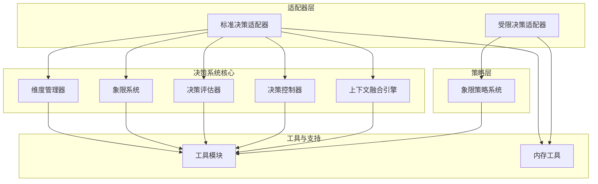

图表来源
- [决策适配器:1-130](file://mori_memory/module/decision_adapter.lua#L1-L130)
- [受限决策适配器:1-219](file://mori_memory/module/restricted_decision_adapter.lua#L1-L219)
- [象限系统:1-285](file://mori_memory/module/decision/quadrants.lua#L1-L285)
- [维度管理器:1-210](file://mori_memory/module/decision/dimensions.lua#L1-L210)
- [决策评估器:1-362](file://mori_memory/module/decision/evaluator.lua#L1-L362)
- [决策控制器:1-194](file://mori_memory/module/decision/controller.lua#L1-L194)
- [上下文融合引擎:1-302](file://mori_memory/module/decision/fusion.lua#L1-L302)
- [象限策略层:1-238](file://mori_memory/module/policy/quadrant_policy.lua#L1-L238)
- [工具模块:1-800](file://mori_memory/module/tool.lua#L1-L800)
- [内存工具:1-153](file://mori_memory/mori_memory/util.lua#L1-L153)

章节来源
- [决策适配器:1-130](file://mori_memory/module/decision_adapter.lua#L1-L130)
- [受限决策适配器:1-219](file://mori_memory/module/restricted_decision_adapter.lua#L1-L219)
- [象限系统:1-285](file://mori_memory/module/decision/quadrants.lua#L1-L285)
- [维度管理器:1-210](file://mori_memory/module/decision/dimensions.lua#L1-L210)
- [决策评估器:1-362](file://mori_memory/module/decision/evaluator.lua#L1-L362)
- [决策控制器:1-194](file://mori_memory/module/decision/controller.lua#L1-L194)
- [上下文融合引擎:1-302](file://mori_memory/module/decision/fusion.lua#L1-L302)
- [象限策略层:1-238](file://mori_memory/module/policy/quadrant_policy.lua#L1-L238)
- [工具模块:1-800](file://mori_memory/module/tool.lua#L1-L800)
- [内存工具:1-153](file://mori_memory/mori_memory/util.lua#L1-L153)

## 核心组件
- 标准决策适配器：封装初始化、上下文转换、决策执行、状态查询与结果构造，对外暴露统一接口。
- 受限决策适配器：仅提供策略参数调节能力，明确禁止越权接口，提供合规性检查与日志记录。
- 决策系统核心：
  - 维度管理器：计算人口压力、交互拓扑、消息频率、参与者多样性等维度值。
  - 象限系统：根据维度值确定象限，应用象限规则，提供规则权重与阈值调整。
  - 决策评估器：提取特征、计算评分、生成置信度与推理说明。
  - 决策控制器：平滑维度值、判定象限转换、计算表面参数（如信任度、保守度等）。
  - 上下文融合引擎：融合多象限结果，生成加权融合得分与推理说明。
- 策略层：基于象限坐标推导策略参数，提供资源分配、提交时机、回忆策略等建议。

章节来源
- [决策适配器:22-114](file://mori_memory/module/decision_adapter.lua#L22-L114)
- [受限决策适配器:19-111](file://mori_memory/module/restricted_decision_adapter.lua#L19-L111)
- [维度管理器:156-189](file://mori_memory/module/decision/dimensions.lua#L156-L189)
- [象限系统:207-264](file://mori_memory/module/decision/quadrants.lua#L207-L264)
- [决策评估器:251-308](file://mori_memory/module/decision/evaluator.lua#L251-L308)
- [决策控制器:27-137](file://mori_memory/module/decision/controller.lua#L27-L137)
- [上下文融合引擎:117-229](file://mori_memory/module/decision/fusion.lua#L117-L229)
- [象限策略层:141-207](file://mori_memory/module/policy/quadrant_policy.lua#L141-L207)

## 架构总览
标准决策适配器通过统一接口将外部系统参数映射为新系统上下文，调用控制器与评估器完成决策，并返回标准化结果；受限决策适配器仅提供策略参数调节，严格限制在策略层范围内，避免越权。

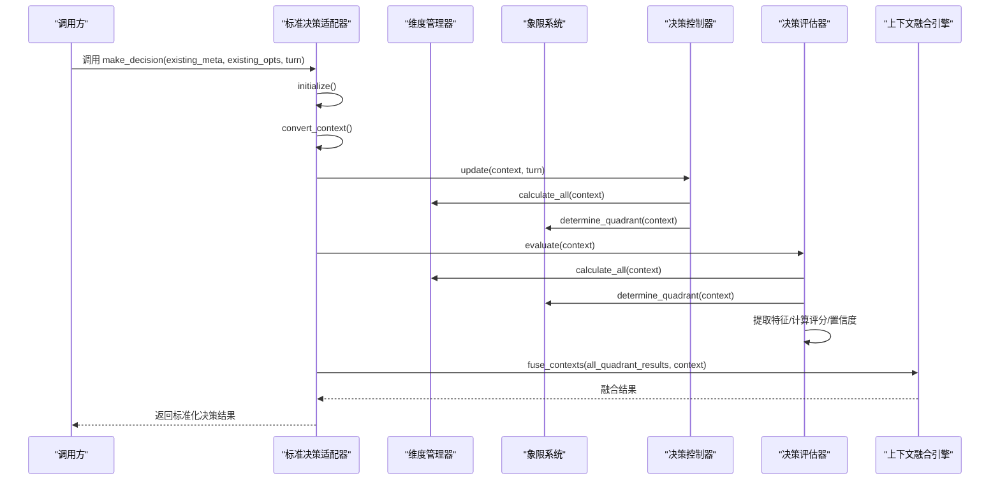

图表来源
- [决策适配器:76-114](file://mori_memory/module/decision_adapter.lua#L76-L114)
- [决策控制器:44-79](file://mori_memory/module/decision/controller.lua#L44-L79)
- [决策评估器:267-308](file://mori_memory/module/decision/evaluator.lua#L267-L308)
- [上下文融合引擎:132-229](file://mori_memory/module/decision/fusion.lua#L132-L229)

## 详细组件分析

### 标准决策适配器
- 设计目的：将现有系统参数与元数据转换为新四象限决策系统的上下文，统一输出评分、象限、置信度与表面参数。
- 关键流程：
  - 初始化：创建维度管理器、象限系统、评估器、控制器实例。
  - 上下文转换：将现有元数据与配置参数映射为新系统上下文。
  - 决策执行：更新控制器状态、获取表面参数、执行评估、构造结果。
  - 状态查询：返回当前象限、人口压力、交互拓扑等状态信息。
- 参数映射与结果转换：
  - 输入参数：existing_meta（actor、last_actor、text、age、stability、相似性、回复/提及、消息统计等）、existing_opts（各类奖励系数）、turn。
  - 输出结果：score、quadrant、confidence、reasoning、表面参数、控制器状态。
- 错误处理：初始化失败返回错误信息；状态查询未初始化时返回错误提示。

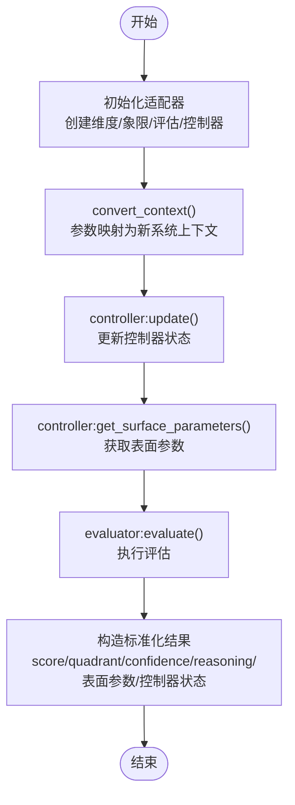

图表来源
- [决策适配器:22-114](file://mori_memory/module/decision_adapter.lua#L22-L114)

章节来源
- [决策适配器:22-128](file://mori_memory/module/decision_adapter.lua#L22-L128)

### 受限决策适配器
- 设计目的：仅在策略层范围内提供参数调节能力，严格限制核心路由与状态机控制等越权操作。
- 关键特性：
  - 仅初始化策略系统，不创建完整控制器。
  - 提供策略上下文提取：从现有元数据推导人口压力与交互拓扑。
  - 返回策略参数调节结果：attach_threshold_offset、pending_margin_multiplier、write_threshold_offset 等。
  - 明确禁止越权接口：make_decision、override_core_routing、control_attach_split、direct_pending_management、define_memory_organization。
  - 合规性检查：验证策略结果是否包含越权字段。
  - 日志与监控：记录策略应用与参数调整。
- 角色边界：仅用于参数调节，不参与路由/连接决策与核心状态管理。

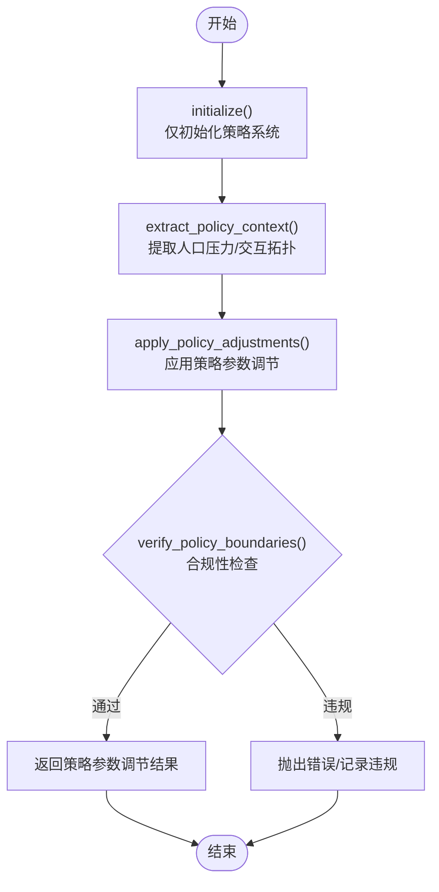

图表来源
- [受限决策适配器:19-184](file://mori_memory/module/restricted_decision_adapter.lua#L19-L184)

章节来源
- [受限决策适配器:19-158](file://mori_memory/module/restricted_decision_adapter.lua#L19-L158)

### 决策系统核心组件

#### 维度管理器
- 功能：计算人口压力、交互拓扑、消息频率、参与者多样性等维度值，并归一化到[0,1]范围。
- 实现要点：每个维度独立计算，支持注册/移除维度，提供批量计算接口。

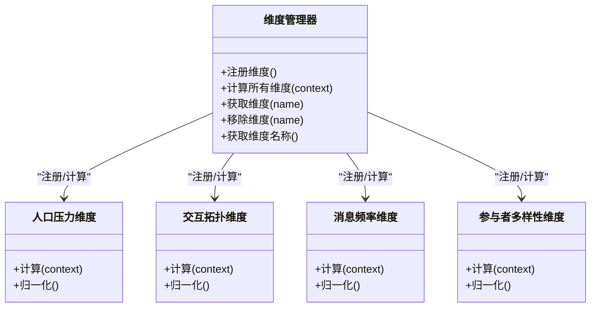

图表来源
- [维度管理器:156-209](file://mori_memory/module/decision/dimensions.lua#L156-L209)

章节来源
- [维度管理器:156-209](file://mori_memory/module/decision/dimensions.lua#L156-L209)

#### 象限系统
- 功能：根据维度值确定象限，应用象限规则（权重、阈值调整），提供规则查询与更新。
- 实现要点：四种象限规则（低人口广播型、高人口广播型、低人口对等型、高人口对等型），支持阈值调整与优先级权重。

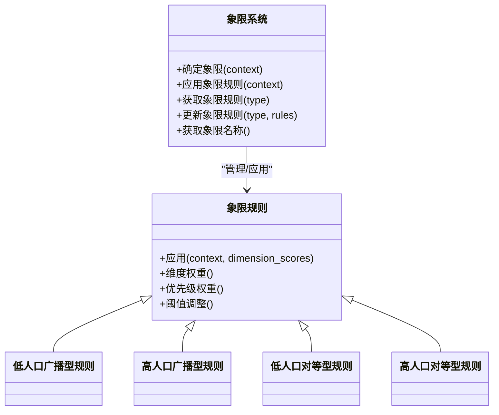

图表来源
- [象限系统:207-274](file://mori_memory/module/decision/quadrants.lua#L207-L274)

章节来源
- [象限系统:207-274](file://mori_memory/module/decision/quadrants.lua#L207-L274)

#### 决策评估器
- 功能：提取特征（语义相似性、用户连续性、回复检测、提及检测、消息长度、复杂度、时间邻近性、流稳定性）、计算评分（语义通道、对等边通道、中性评分）、生成置信度与推理说明。
- 实现要点：特征提取器与评分引擎分离，支持历史记录与置信度计算。

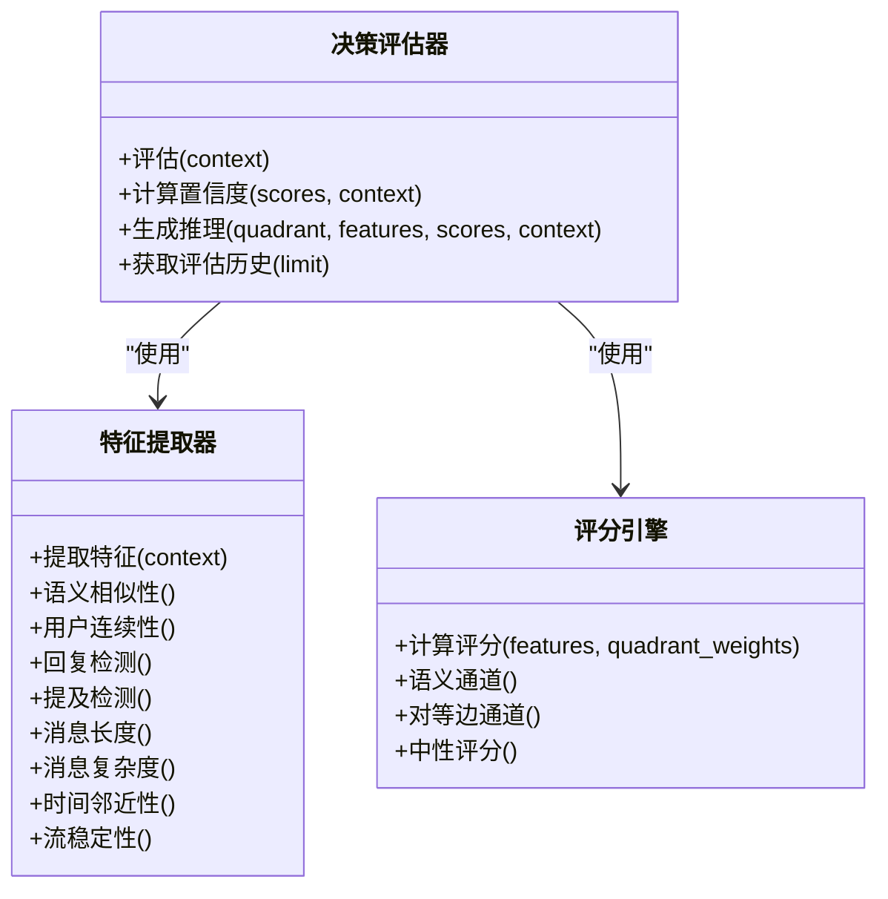

图表来源
- [决策评估器:251-362](file://mori_memory/module/decision/evaluator.lua#L251-L362)

章节来源
- [决策评估器:251-362](file://mori_memory/module/decision/evaluator.lua#L251-L362)

#### 决策控制器
- 功能：平滑维度值、判定象限转换、计算表面参数（信任度、保守度、读取局部性等）。
- 实现要点：控制器状态包含人口压力、交互拓扑、上次转换轮次、保持期、当前象限与转换历史；支持插值与映射计算。

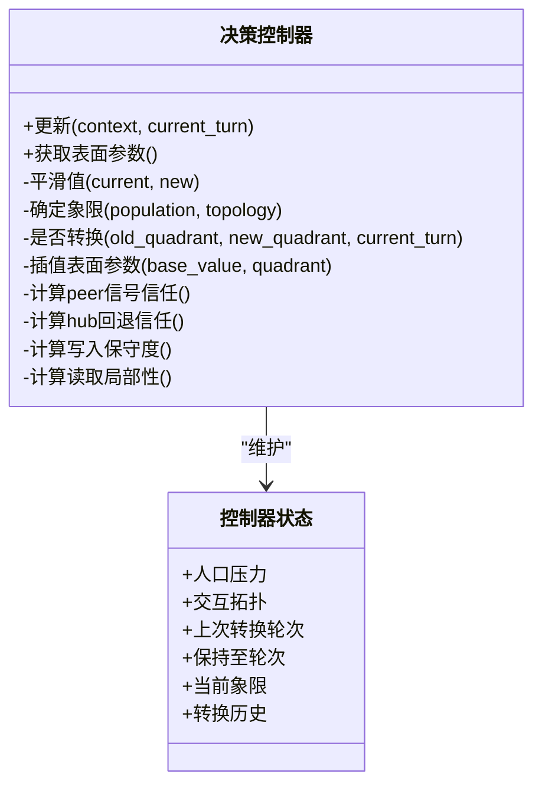

图表来源
- [决策控制器:27-192](file://mori_memory/module/decision/controller.lua#L27-L192)

章节来源
- [决策控制器:27-192](file://mori_memory/module/decision/controller.lua#L27-L192)

#### 上下文融合引擎
- 功能：分析环境特征（消息频率、参与者多样性、稳定性、时间特征），计算融合权重，对多象限结果进行加权融合，生成融合推理说明与历史记录。
- 实现要点：环境分析器、权重计算器、融合历史与趋势分析。

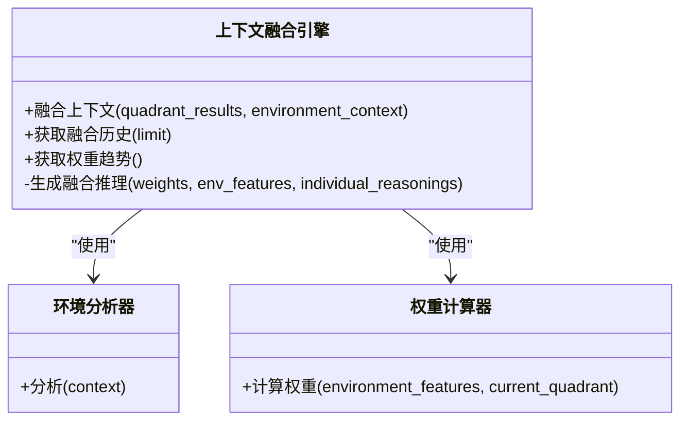

图表来源
- [上下文融合引擎:117-300](file://mori_memory/module/decision/fusion.lua#L117-L300)

章节来源
- [上下文融合引擎:117-300](file://mori_memory/module/decision/fusion.lua#L117-L300)

### 策略层组件
- 象限策略系统：根据人口压力与交互拓扑确定象限，提供策略参数映射（如 attach_conservatism、pending_margin_scale、write_conservatism），并返回资源分配、提交时机、回忆策略等建议。
- 角色边界：仅用于参数调节，不参与核心路由决策与状态机控制。

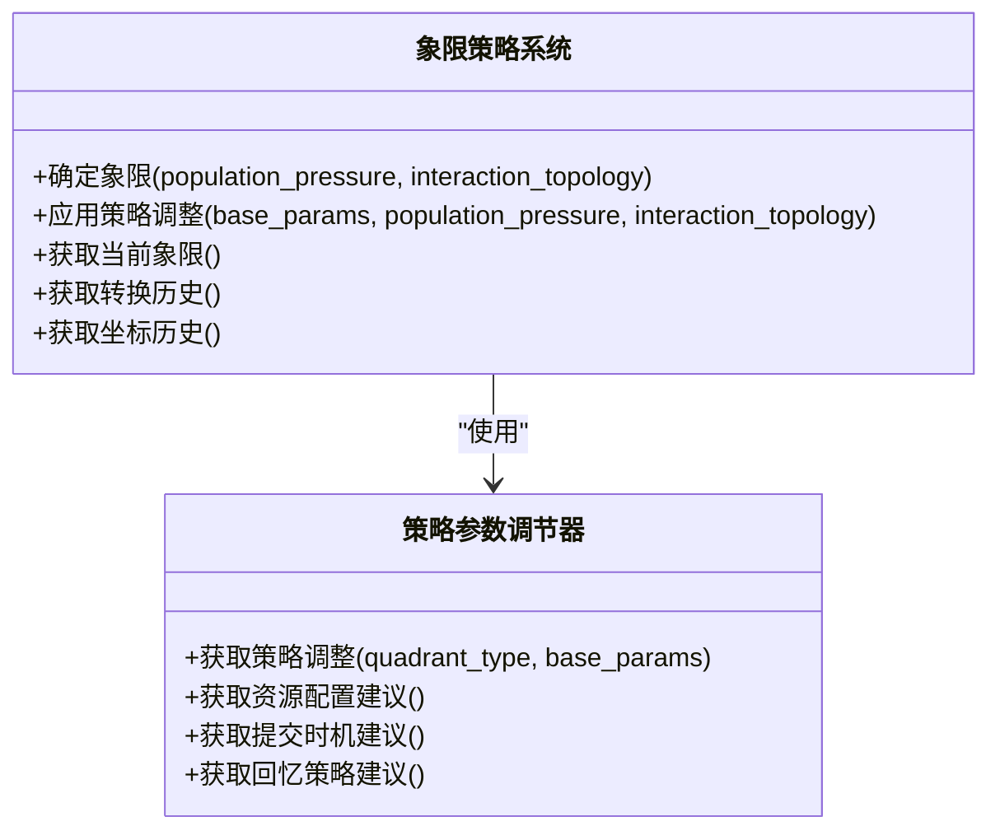

图表来源
- [象限策略层:141-219](file://mori_memory/module/policy/quadrant_policy.lua#L141-L219)

章节来源
- [象限策略层:141-219](file://mori_memory/module/policy/quadrant_policy.lua#L141-L219)

## 依赖关系分析
- 适配器依赖决策系统核心模块（维度管理器、象限系统、评估器、控制器、融合引擎）。
- 适配器依赖工具模块（日志、向量计算、字符串处理）与内存工具（编码/解析）。
- 受限适配器依赖策略层模块（象限策略系统）与工具模块。
- 决策系统核心模块之间存在清晰的层次依赖：维度管理器为象限系统提供输入，象限系统为评估器与控制器提供规则，融合引擎消费多象限结果。

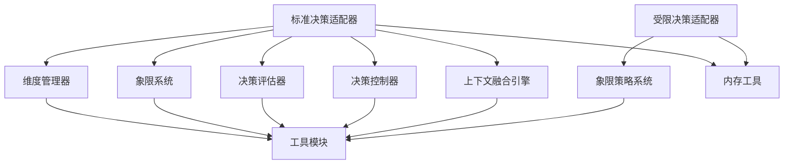

图表来源
- [决策适配器:8-9](file://mori_memory/module/decision_adapter.lua#L8-L9)
- [受限决策适配器:7-8](file://mori_memory/module/restricted_decision_adapter.lua#L7-L8)
- [工具模块:1-800](file://mori_memory/module/tool.lua#L1-L800)
- [内存工具:1-153](file://mori_memory/mori_memory/util.lua#L1-L153)

章节来源
- [决策适配器:8-9](file://mori_memory/module/decision_adapter.lua#L8-L9)
- [受限决策适配器:7-8](file://mori_memory/module/restricted_decision_adapter.lua#L7-L8)
- [工具模块:1-800](file://mori_memory/module/tool.lua#L1-L800)
- [内存工具:1-153](file://mori_memory/mori_memory/util.lua#L1-L153)

## 性能考量
- 维度计算与特征提取：采用批量计算与归一化，避免重复计算；特征提取器使用容错机制（pcall）确保稳定性。
- 控制器平滑与转换：平滑因子与保持期减少频繁切换，提升系统稳定性。
- 融合引擎：权重计算与加权融合在合理范围内进行，避免过度计算。
- 测试脚本显示：在1000次评估循环中，平均每次评估耗时在可接受范围内，满足实时性需求。

章节来源
- [决策控制器:81-116](file://mori_memory/module/decision/controller.lua#L81-L116)
- [决策评估器:310-325](file://mori_memory/module/decision/evaluator.lua#L310-L325)
- [上下文融合引擎:92-115](file://mori_memory/module/decision/fusion.lua#L92-L115)
- [决策系统测试:162-202](file://test_decision_system.lua#L162-L202)

## 故障排除指南
- 适配器初始化失败：检查依赖模块是否正确加载，确认维度管理器、象限系统、评估器、控制器实例创建成功。
- 越权操作：受限适配器会显式抛出错误，禁止 make_decision、override_core_routing、control_attach_split、direct_pending_management、define_memory_organization 等接口。
- 参数合规性：使用 verify_policy_boundaries 检查策略结果是否包含越权字段（路由决策、记忆结构、状态机变更、核心参数覆盖）。
- 日志与监控：受限适配器提供策略应用日志，记录阈值偏移与参数调整；标准适配器通过工具模块的日志接口输出调试信息。
- 性能问题：关注维度计算与特征提取的复杂度，必要时优化特征提取器或评分引擎；控制历史记录长度以减少内存占用。

章节来源
- [受限决策适配器:113-184](file://mori_memory/module/restricted_decision_adapter.lua#L113-L184)
- [受限决策适配器:186-217](file://mori_memory/module/restricted_decision_adapter.lua#L186-L217)
- [决策适配器:22-37](file://mori_memory/module/decision_adapter.lua#L22-L37)

## 结论
决策适配器通过统一接口将不同决策策略转换为一致的输出，标准适配器负责完整决策流程，受限适配器严格限定在策略层范围内，二者共同保证了系统的可扩展性与安全性。通过清晰的参数映射、结果转换与错误处理机制，以及完善的工具与测试支撑，该系统能够在实际项目中稳定运行并持续演进。

## 附录

### 自定义决策适配器开发指南
- 接口规范
  - 初始化：创建并初始化决策系统组件（维度管理器、象限系统、评估器、控制器、融合引擎）。
  - 上下文转换：将外部元数据与配置参数映射为新系统上下文，确保关键字段齐全。
  - 决策执行：按顺序更新控制器状态、获取表面参数、执行评估、可选地进行上下文融合。
  - 结果构造：输出标准化结果（score、quadrant、confidence、reasoning、表面参数、控制器状态）。
  - 状态查询：提供当前象限、人口压力、交互拓扑等状态信息。
- 实现模板
  - 参考标准适配器的初始化与决策流程，结合业务场景定制上下文转换逻辑。
  - 若仅需策略参数调节，参考受限适配器的角色边界与合规性检查。
- 测试方法
  - 使用测试脚本中的测试用例作为模板，构造不同上下文与参数组合，验证适配器行为。
  - 关注性能基准测试，确保在高并发场景下的响应时间满足要求。

章节来源
- [决策适配器:22-114](file://mori_memory/module/decision_adapter.lua#L22-L114)
- [受限决策适配器:19-111](file://mori_memory/module/restricted_decision_adapter.lua#L19-L111)
- [决策系统测试:24-161](file://test_decision_system.lua#L24-L161)

### 注册机制与生命周期管理
- 注册机制：通过模块导出接口（init.lua）集中导出核心类，适配器按需 require 使用。
- 生命周期管理：
  - 初始化：首次调用时创建组件实例并标记为已初始化。
  - 状态维护：控制器维护象限转换历史与保持期，评估器维护评估历史，融合引擎维护融合历史。
  - 清理与回收：通过限制历史记录长度（如100、500、50条）避免内存膨胀。

章节来源
- [决策系统初始化:6-21](file://mori_memory/module/decision/init.lua#L6-L21)
- [决策控制器:14-25](file://mori_memory/module/decision/controller.lua#L14-L25)
- [决策评估器:261-265](file://mori_memory/module/decision/evaluator.lua#L261-L265)
- [上下文融合引擎:121-130](file://mori_memory/module/decision/fusion.lua#L121-L130)

### 配置选项与调试工具
- 配置选项
  - 现有系统参数（same_user_bonus、reply_cue_bonus、mention_bonus、stability_bonus 等）在上下文转换中被映射为新系统奖励系数。
  - 策略层参数（attach_conservatism、pending_margin_scale、write_conservatism、resource_allocation 等）通过策略系统进行调节。
- 调试工具
  - 工具模块提供日志接口（log_debug、log_info、log_warn、log_error）与向量计算、字符串处理等能力。
  - 受限适配器提供策略应用日志与合规性检查，便于定位越权风险。

章节来源
- [决策适配器:40-74](file://mori_memory/module/decision_adapter.lua#L40-L74)
- [受限决策适配器:80-111](file://mori_memory/module/restricted_decision_adapter.lua#L80-L111)
- [工具模块:9-22](file://mori_memory/module/tool.lua#L9-L22)

### 实际应用示例与最佳实践
- 应用示例
  - 在直播/聊天场景中，利用标准适配器进行实时决策，结合控制器的象限转换与评估器的置信度输出，指导路由与连接策略。
  - 在策略层仅需要参数调节时，使用受限适配器，避免越权操作，确保系统安全。
- 最佳实践
  - 明确角色边界：标准适配器负责决策，受限适配器仅负责参数调节。
  - 参数映射：确保上下文转换覆盖关键字段，避免遗漏导致评估偏差。
  - 合规性检查：定期验证策略结果，防止越权字段进入系统。
  - 性能优化：控制历史记录长度，避免内存占用过大；在高并发场景下关注评估耗时。

章节来源
- [决策适配器:76-114](file://mori_memory/module/decision_adapter.lua#L76-L114)
- [受限决策适配器:70-111](file://mori_memory/module/restricted_decision_adapter.lua#L70-L111)
- [决策系统测试:162-202](file://test_decision_system.lua#L162-L202)