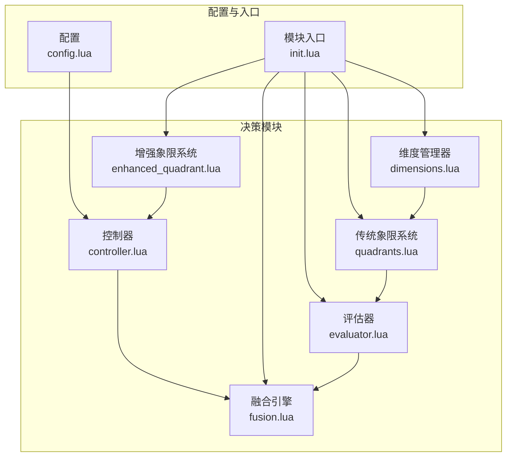
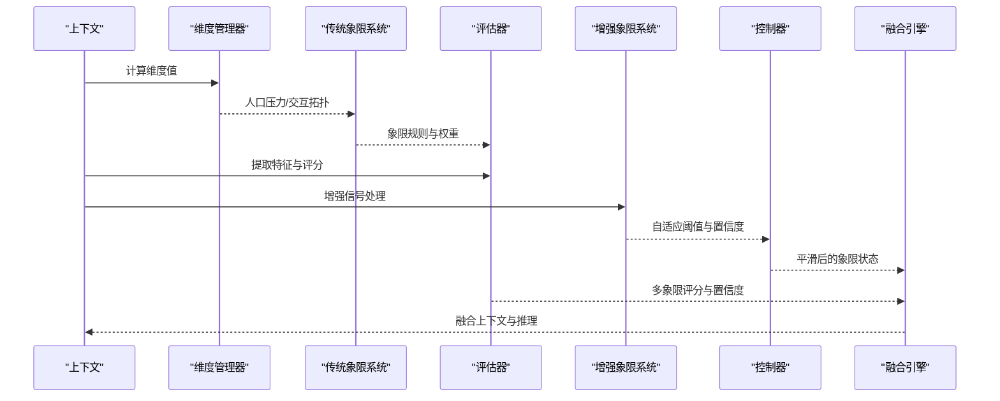
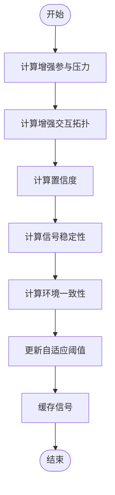
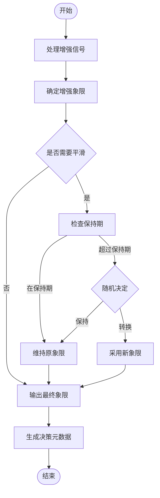
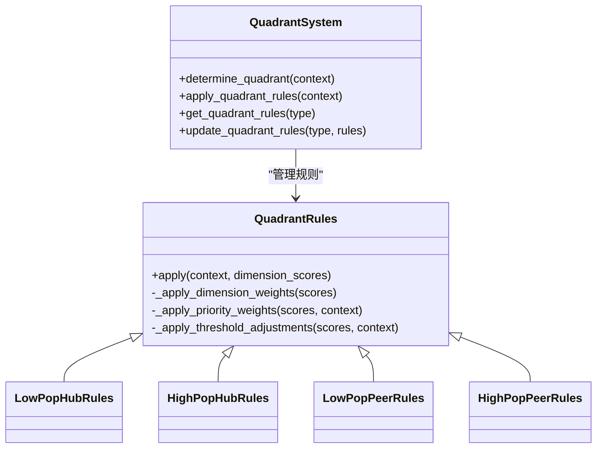
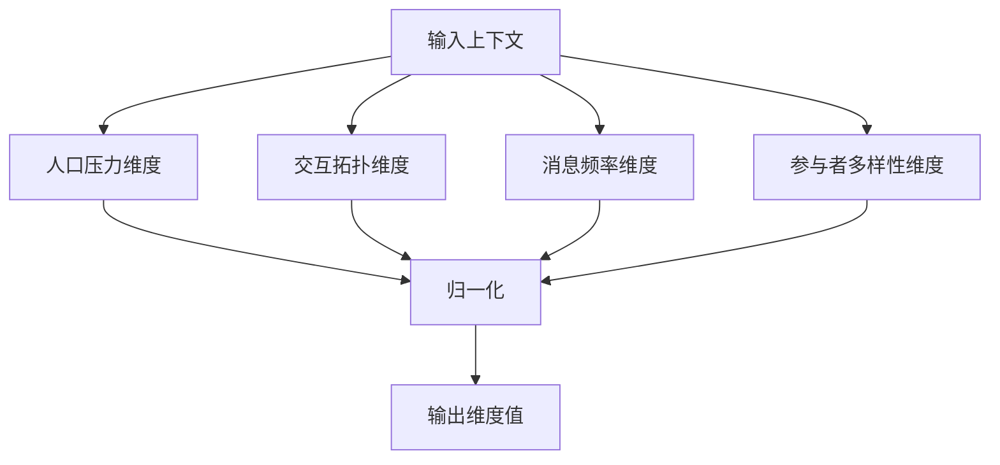
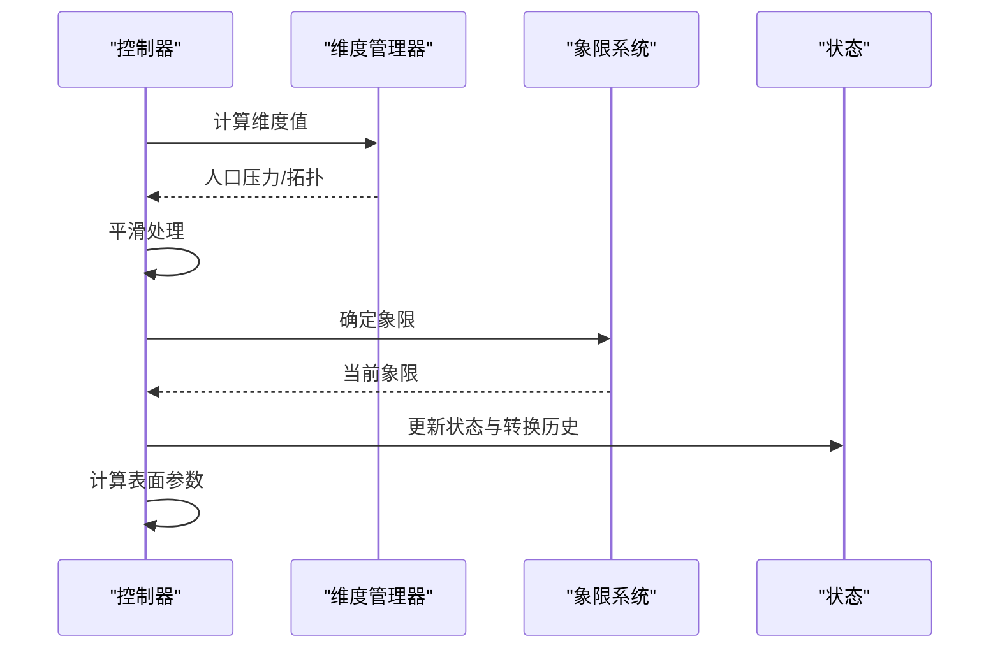
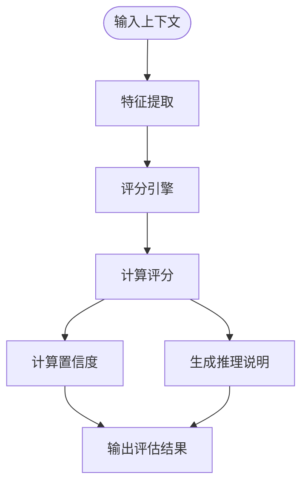
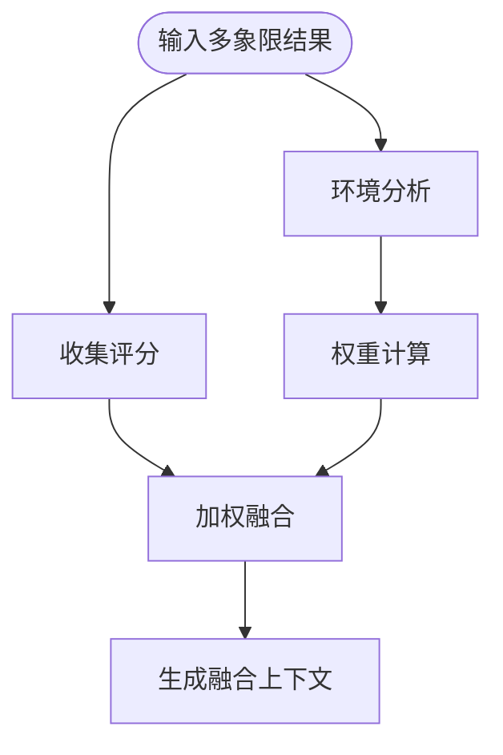
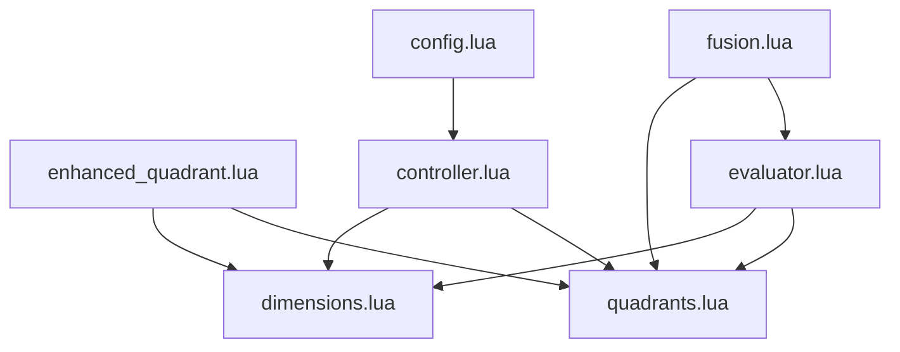

# 增强象限系统

<cite>
**本文引用的文件**
- [enhanced_quadrant.lua](file://mori_memory/module/decision/enhanced_quadrant.lua)
- [quadrants.lua](file://mori_memory/module/decision/quadrants.lua)
- [dimensions.lua](file://mori_memory/module/decision/dimensions.lua)
- [controller.lua](file://mori_memory/module/decision/controller.lua)
- [evaluator.lua](file://mori_memory/module/decision/evaluator.lua)
- [fusion.lua](file://mori_memory/module/decision/fusion.lua)
- [config.lua](file://mori_memory/module/config.lua)
- [init.lua](file://mori_memory/module/decision/init.lua)
- [20260325_two_axis_scope_controller_design.md](file://mori_memory/docs/20260325_two_axis_scope_controller_design.md)
- [20260324_benchmark_rationality_and_memory_gaps.md](file://mori_memory/docs/20260324_benchmark_rationality_and_memory_gaps.md)
- [four_quadrant_jitter_20260325_214714.json](file://mori_memory/benchmarks/results/four_quadrant_jitter_20260325_214714.json)
- [regress_all_codex_20260325.json](file://mori_memory/benchmarks/results/regress_all_codex_20260325.json)
- [quadrant_enhancement_analyzer.py](file://mori_memory/scripts/quadrant_enhancement_analyzer.py)
</cite>

## 目录
1. [简介](#简介)
2. [项目结构](#项目结构)
3. [核心组件](#核心组件)
4. [架构概览](#架构概览)
5. [详细组件分析](#详细组件分析)
6. [依赖关系分析](#依赖关系分析)
7. [性能考量](#性能考量)
8. [故障排查指南](#故障排查指南)
9. [结论](#结论)
10. [附录](#附录)

## 简介
本文件系统化阐述增强象限系统的设计与实现，重点对比传统象限分析的改进与扩展，包括：
- 新维度定义与权重调整
- 决策逻辑优化与自适应阈值
- 复杂交互场景与动态上下文的处理机制
- 配置选项、参数调优与性能监控
- 与传统象限系统的兼容与迁移策略
- 实际应用案例、效果对比与最佳实践
- 部署与维护方法

## 项目结构
增强象限系统位于 mori_memory/module/decision 目录，采用模块化设计，核心模块包括：
- dimensions.lua：维度定义与归一化
- quadrants.lua：传统象限系统与规则
- controller.lua：控制器与表面参数
- evaluator.lua：特征提取与评分引擎
- fusion.lua：上下文融合引擎
- enhanced_quadrant.lua：增强象限信号处理器与决策器
- config.lua：全局配置与运行时参数
- init.lua：模块导出入口

**图表来源**
- [init.lua:1-21](file://mori_memory/module/decision/init.lua#L1-L21)
- [dimensions.lua:157-210](file://mori_memory/module/decision/dimensions.lua#L157-L210)
- [quadrants.lua:208-285](file://mori_memory/module/decision/quadrants.lua#L208-L285)
- [controller.lua:28-194](file://mori_memory/module/decision/controller.lua#L28-L194)
- [evaluator.lua:252-362](file://mori_memory/module/decision/evaluator.lua#L252-L362)
- [fusion.lua:118-302](file://mori_memory/module/decision/fusion.lua#L118-L302)
- [enhanced_quadrant.lua:322-335](file://mori_memory/module/decision/enhanced_quadrant.lua#L322-L335)
- [config.lua:499-680](file://mori_memory/module/config.lua#L499-L680)

**章节来源**
- [init.lua:1-21](file://mori_memory/module/decision/init.lua#L1-L21)
- [config.lua:499-680](file://mori_memory/module/config.lua#L499-L680)

## 核心组件
- 维度管理器：负责将原始上下文归一化为象限坐标，提供人口压力与交互拓扑等基础维度。
- 传统象限系统：基于坐标确定象限，并应用象限规则进行权重与阈值调整。
- 控制器：对维度值进行平滑与转换，维持象限转换的稳定性。
- 评估器：提取特征并计算评分，结合置信度生成推理说明。
- 融合引擎：在多象限结果间进行加权融合，输出统一上下文。
- 增强象限系统：引入自适应阈值、置信度与稳定性评估，优化复杂场景下的决策。

**章节来源**
- [dimensions.lua:157-210](file://mori_memory/module/decision/dimensions.lua#L157-L210)
- [quadrants.lua:208-285](file://mori_memory/module/decision/quadrants.lua#L208-L285)
- [controller.lua:28-194](file://mori_memory/module/decision/controller.lua#L28-L194)
- [evaluator.lua:252-362](file://mori_memory/module/decision/evaluator.lua#L252-L362)
- [fusion.lua:118-302](file://mori_memory/module/decision/fusion.lua#L118-L302)
- [enhanced_quadrant.lua:322-335](file://mori_memory/module/decision/enhanced_quadrant.lua#L322-L335)

## 架构概览
增强象限系统在传统象限基础上，通过增强信号处理器与自适应阈值，将动态上下文与稳定性反馈纳入决策流程。控制器负责平滑与转换，融合引擎汇总多源评分，形成统一上下文输出。

**图表来源**
- [dimensions.lua:182-189](file://mori_memory/module/decision/dimensions.lua#L182-L189)
- [quadrants.lua:247-264](file://mori_memory/module/decision/quadrants.lua#L247-L264)
- [evaluator.lua:267-308](file://mori_memory/module/decision/evaluator.lua#L267-L308)
- [enhanced_quadrant.lua:227-253](file://mori_memory/module/decision/enhanced_quadrant.lua#L227-L253)
- [controller.lua:44-79](file://mori_memory/module/decision/controller.lua#L44-L79)
- [fusion.lua:132-229](file://mori_memory/module/decision/fusion.lua#L132-L229)

## 详细组件分析

### 增强象限信号处理器
- 参与压力增强：综合有效参与者数量、切换率与消息密度，采用加权组合得到增强压力值。
- 交互拓扑增强：聚合直接提及、回复链深度、互惠互动与主题连贯性，计算peer倾向得分；同时计算hub倾向得分，二者差值转换为[0,1]范围的拓扑得分。
- 置信度计算：基于数据量、信号稳定性与环境一致性，三者加权得到总体置信度。
- 自适应阈值：依据置信度动态调整人口压力与交互拓扑的阈值，置信度高则更严格，低则更宽松；同时缓存信号以计算稳定性。

**图表来源**
- [enhanced_quadrant.lua:41-211](file://mori_memory/module/decision/enhanced_quadrant.lua#L41-L211)

**章节来源**
- [enhanced_quadrant.lua:22-211](file://mori_memory/module/decision/enhanced_quadrant.lua#L22-L211)

### 增强象限决策器
- 基于增强信号确定象限：使用自适应阈值与置信度进行模糊逻辑处理，低置信度偏向保守分类，高置信度使用更精确阈值。
- 转换平滑：记录历史决策，若与上次相同则直接返回；若处于保持期则维持原象限；否则按平滑因子随机保持或转换。
- 决策元数据：包含原始象限、最终象限、置信度与时间戳，便于追踪与调试。

**图表来源**
- [enhanced_quadrant.lua:227-319](file://mori_memory/module/decision/enhanced_quadrant.lua#L227-L319)

**章节来源**
- [enhanced_quadrant.lua:227-319](file://mori_memory/module/decision/enhanced_quadrant.lua#L227-L319)

### 传统象限系统与规则
- 象限类型：低人口广播型、高人口广播型、低人口对等型、高人口对等型。
- 规则权重：为不同维度与优先级设置权重与阈值调整，体现各象限的侧重点。
- 坐标到象限映射：基于人口压力与交互拓扑阈值（0.5）确定象限。

**图表来源**
- [quadrants.lua:101-205](file://mori_memory/module/decision/quadrants.lua#L101-L205)
- [quadrants.lua:208-264](file://mori_memory/module/decision/quadrants.lua#L208-L264)

**章节来源**
- [quadrants.lua:101-205](file://mori_memory/module/decision/quadrants.lua#L101-L205)
- [quadrants.lua:208-264](file://mori_memory/module/decision/quadrants.lua#L208-L264)

### 维度管理器
- 维度类型：人口压力、交互拓扑、消息频率、参与者多样性。
- 归一化：将原始值映射到[0,1]范围，确保不同量纲可比较。
- 计算逻辑：分别基于活跃参与者、拓扑指标、消息速率与多样性计算维度得分。

**图表来源**
- [dimensions.lua:56-154](file://mori_memory/module/decision/dimensions.lua#L56-L154)

**章节来源**
- [dimensions.lua:56-154](file://mori_memory/module/decision/dimensions.lua#L56-L154)

### 控制器与表面参数
- 平滑处理：对人口压力与交互拓扑进行指数平滑，减少抖动。
- 象限转换：在保持期内禁止转换，避免频繁跳变。
- 表面参数：根据当前象限插值计算各类信任度与保守度参数，指导路由与读出策略。

**图表来源**
- [controller.lua:44-137](file://mori_memory/module/decision/controller.lua#L44-L137)

**章节来源**
- [controller.lua:44-137](file://mori_memory/module/decision/controller.lua#L44-L137)

### 评估器与特征提取
- 特征提取：语义相似性、用户连续性、回复检测、提及检测、消息长度与复杂度、时间邻近性、流稳定性等。
- 评分引擎：语义通道、对等边通道、中性评分，结合象限权重计算最终得分。
- 置信度：基于评分一致性与稳定性综合计算。
- 推理说明：生成人类可读的决策依据。

**图表来源**
- [evaluator.lua:54-308](file://mori_memory/module/decision/evaluator.lua#L54-L308)

**章节来源**
- [evaluator.lua:54-308](file://mori_memory/module/decision/evaluator.lua#L54-L308)

### 融合引擎
- 环境分析：基于消息频率、参与者多样性、稳定性与时序特征，生成环境特征向量。
- 权重计算：根据环境特征与当前象限，计算各象限权重并归一化。
- 加权融合：对各象限评分执行加权平均，得到融合评分与整体置信度。
- 推理生成：汇总个体推理，输出融合分析报告。

**图表来源**
- [fusion.lua:132-229](file://mori_memory/module/decision/fusion.lua#L132-L229)

**章节来源**
- [fusion.lua:132-229](file://mori_memory/module/decision/fusion.lua#L132-L229)

## 依赖关系分析
- 模块耦合：enhanced_quadrant.lua 依赖 dimensions.lua 与 quadrants.lua；controller.lua 依赖 dimensions.lua 与 quadrants.lua；evaluator.lua 依赖 dimensions.lua 与 quadrants.lua；fusion.lua 依赖 quadrants.lua 与 evaluator.lua。
- 配置耦合：config.lua 提供全局参数，影响控制器与象限规则的阈值与权重。
- 外部依赖：基准测试结果与分析脚本用于评估系统性能与指导优化。

**图表来源**
- [init.lua:7-19](file://mori_memory/module/decision/init.lua#L7-L19)
- [config.lua:499-680](file://mori_memory/module/config.lua#L499-L680)

**章节来源**
- [init.lua:7-19](file://mori_memory/module/decision/init.lua#L7-L19)
- [config.lua:499-680](file://mori_memory/module/config.lua#L499-L680)

## 性能考量
- 计算复杂度：维度计算与评分引擎为线性复杂度，增强信号处理器与融合引擎为常数级额外开销。
- 内存占用：历史缓存与决策历史受控于最大长度，避免无限增长。
- 实时性：控制器平滑与转换保持机制减少抖动，提升系统稳定性。
- 基准测试：通过四象限抖动与回归测试评估系统在不同场景下的稳定性与准确性。

**章节来源**
- [four_quadrant_jitter_20260325_214714.json:1-800](file://mori_memory/benchmarks/results/four_quadrant_jitter_20260325_214714.json#L1-L800)
- [regress_all_codex_20260325.json:1-274](file://mori_memory/benchmarks/results/regress_all_codex_20260325.json#L1-L274)

## 故障排查指南
- 置信度异常：检查信号稳定性与环境一致性计算，确认阈值更新逻辑是否触发。
- 象限抖动：核查控制器平滑因子与保持期设置，避免频繁转换。
- 评分不一致：核对特征提取与评分权重，确保维度归一化正确。
- 融合偏差：检查环境特征权重与当前象限权重，确保归一化有效。

**章节来源**
- [enhanced_quadrant.lua:100-165](file://mori_memory/module/decision/enhanced_quadrant.lua#L100-L165)
- [controller.lua:102-116](file://mori_memory/module/decision/controller.lua#L102-L116)
- [evaluator.lua:310-325](file://mori_memory/module/decision/evaluator.lua#L310-L325)
- [fusion.lua:102-115](file://mori_memory/module/decision/fusion.lua#L102-L115)

## 结论
增强象限系统在传统象限分析基础上，通过自适应阈值、置信度与稳定性评估，显著提升了复杂交互场景与动态上下文下的决策鲁棒性。结合控制器的平滑与转换保持机制、评估器的特征提取与评分引擎、以及融合引擎的多源整合，系统实现了从“静态阈值”到“动态适应”的演进。基准测试与分析脚本为持续优化提供了量化依据。

## 附录

### 配置选项与参数调优
- 控制器参数：平滑因子、转换保持回合数、表面变化上限。
- 象限权重：维度权重、优先级权重、阈值调整。
- 增强信号：置信度权重、稳定性权重、环境一致性权重。
- 融合权重：基础权重、环境特征权重、归一化策略。

**章节来源**
- [controller.lua:31-42](file://mori_memory/module/decision/controller.lua#L31-L42)
- [quadrants.lua:76-99](file://mori_memory/module/decision/quadrants.lua#L76-L99)
- [enhanced_quadrant.lua:100-121](file://mori_memory/module/decision/enhanced_quadrant.lua#L100-L121)
- [fusion.lua:92-115](file://mori_memory/module/decision/fusion.lua#L92-L115)

### 兼容性与迁移策略
- 与传统象限系统兼容：保持象限类型与规则接口不变，增强信号作为额外输入。
- 渐进迁移：先启用增强信号处理器与自适应阈值，再接入控制器与融合引擎。
- 文档与设计：参考两轴作用域控制器设计文档，确保迁移过程中的行为一致性。

**章节来源**
- [20260325_two_axis_scope_controller_design.md:1-800](file://mori_memory/docs/20260325_two_axis_scope_controller_design.md#L1-L800)
- [20260324_benchmark_rationality_and_memory_gaps.md:1-585](file://mori_memory/docs/20260324_benchmark_rationality_and_memory_gaps.md#L1-L585)

### 应用案例与效果对比
- 四象限抖动分析：通过基准测试评估系统在不同象限的稳定性与覆盖率。
- 回归测试：在多任务与多数据集上的表现，验证系统泛化能力。
- 分析脚本：提供信号质量分析与增强规划，指导参数调优。

**章节来源**
- [four_quadrant_jitter_20260325_214714.json:1-800](file://mori_memory/benchmarks/results/four_quadrant_jitter_20260325_214714.json#L1-L800)
- [regress_all_codex_20260325.json:1-274](file://mori_memory/benchmarks/results/regress_all_codex_20260325.json#L1-L274)
- [quadrant_enhancement_analyzer.py:1-242](file://mori_memory/scripts/quadrant_enhancement_analyzer.py#L1-L242)

### 部署与维护方法
- 部署步骤：启用增强象限模块，配置控制器与融合引擎参数，接入基准测试与分析脚本。
- 维护要点：定期检查置信度与稳定性指标，监控象限转换分布，优化权重与阈值。
- 监控指标：置信度均值与方差、象限覆盖率、转换次数、路由分布与响应时间。

**章节来源**
- [init.lua:13-19](file://mori_memory/module/decision/init.lua#L13-L19)
- [config.lua:499-680](file://mori_memory/module/config.lua#L499-L680)
- [quadrant_enhancement_analyzer.py:1-242](file://mori_memory/scripts/quadrant_enhancement_analyzer.py#L1-L242)