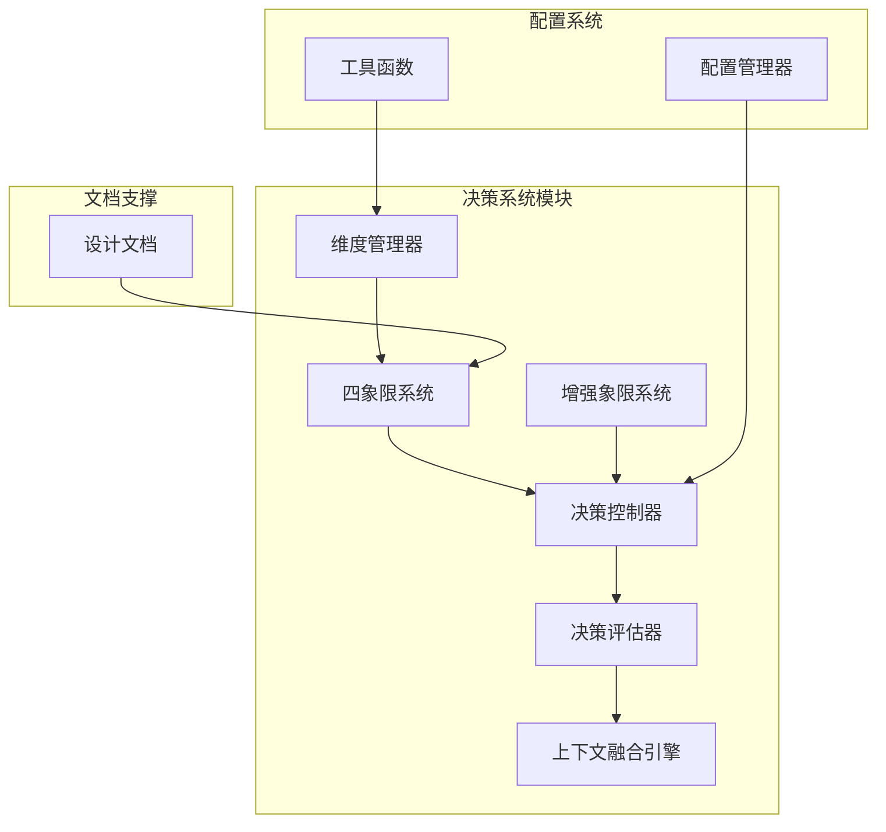
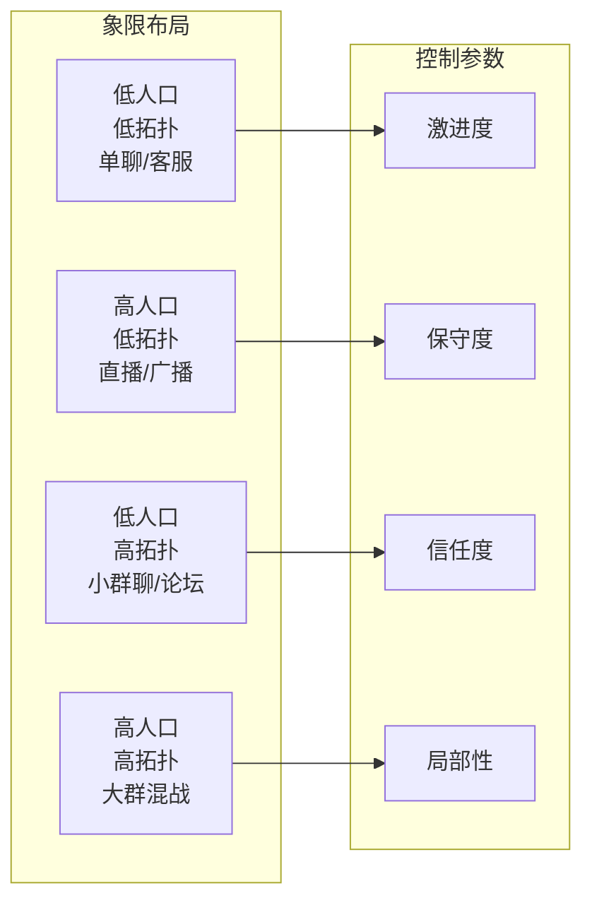
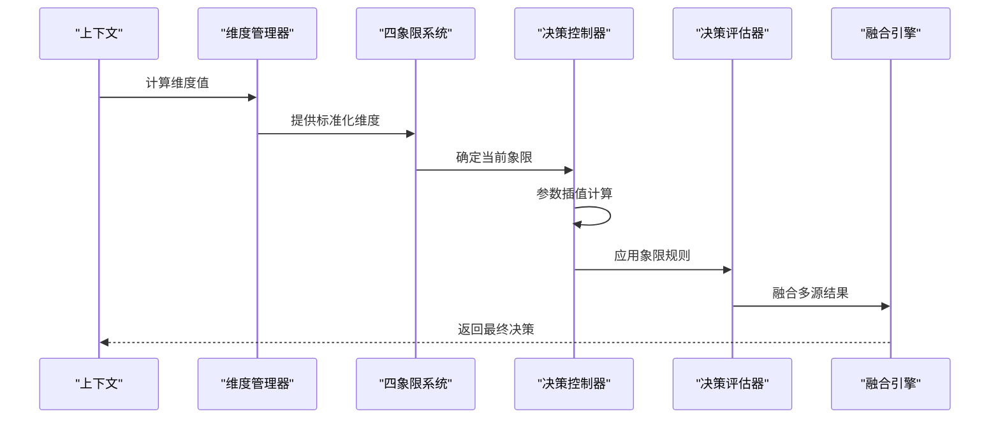
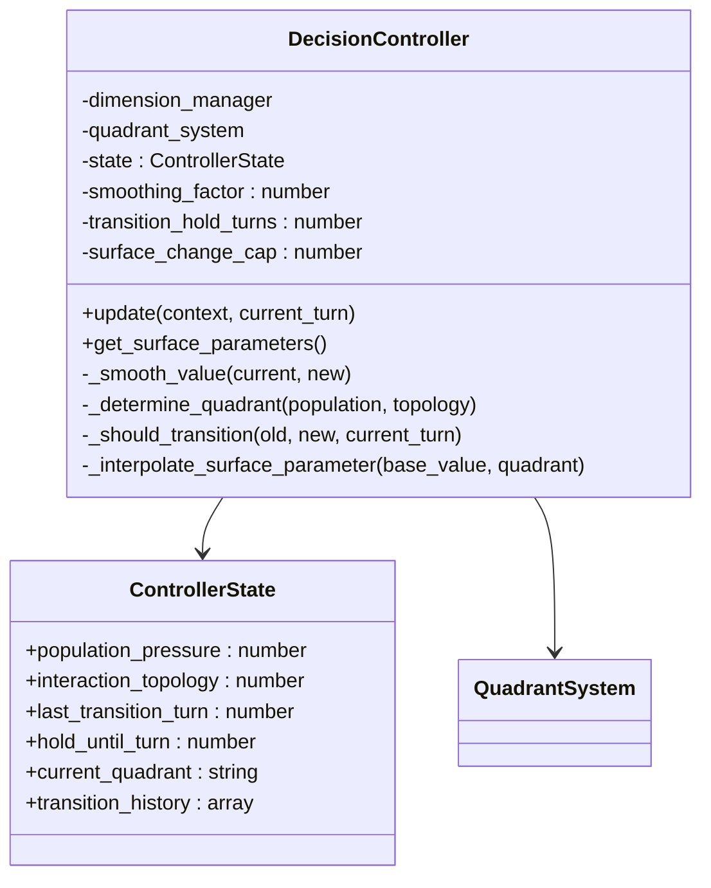
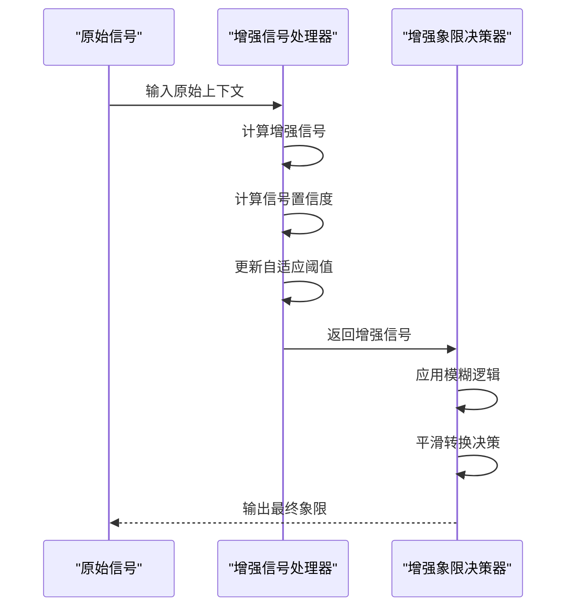
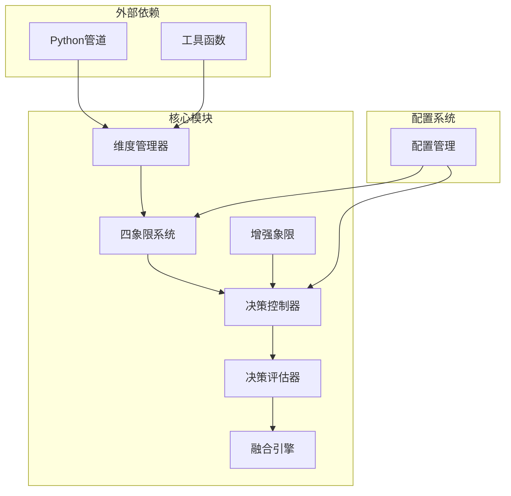

# 控制器系统

<cite>
**本文档引用的文件**
- [controller.lua](file://mori_memory/module/decision/controller.lua)
- [dimensions.lua](file://mori_memory/module/decision/dimensions.lua)
- [quadrants.lua](file://mori_memory/module/decision/quadrants.lua)
- [evaluator.lua](file://mori_memory/module/decision/evaluator.lua)
- [fusion.lua](file://mori_memory/module/decision/fusion.lua)
- [enhanced_quadrant.lua](file://mori_memory/module/decision/enhanced_quadrant.lua)
- [config.lua](file://mori_memory/module/config.lua)
- [tool.lua](file://mori_memory/module/tool.lua)
- [init.lua](file://mori_memory/module/decision/init.lua)
- [20260325_two_axis_scope_controller_design.md](file://mori_memory/docs/20260325_two_axis_scope_controller_design.md)
</cite>

## 目录
1. [简介](#简介)
2. [项目结构](#项目结构)
3. [核心组件](#核心组件)
4. [架构概览](#架构概览)
5. [详细组件分析](#详细组件分析)
6. [依赖分析](#依赖分析)
7. [性能考虑](#性能考虑)
8. [故障排除指南](#故障排除指南)
9. [结论](#结论)
10. [附录](#附录)

## 简介

控制器系统是基于两轴控制机制的智能决策框架，专门设计用于处理多场景下的动态路由和参数调节。该系统通过"人口压力"(Population Pressure)和"互动拓扑"(Interaction Topology)两个连续维度来统一管理不同类型的对话环境。

系统的核心设计理念是将复杂的多参数控制系统简化为两个连续变量，从而避免传统"单用户/群聊/直播"三档硬切换模式的局限性。这种设计使得系统能够：

- 在不改变内存架构的前提下，提供统一的运行时控制器
- 将"当前应该更激进还是更保守"的问题收敛为两个连续变量
- 同时覆盖单聊、主播中心型直播间、小规模群聊等多种场景
- 保持thread-first/anti-contamination/evidence-first的架构边界

## 项目结构

控制器系统采用模块化设计，主要包含以下核心模块：



**图表来源**
- [init.lua:13-19](file://mori_memory/module/decision/init.lua#L13-L19)
- [config.lua:366-404](file://mori_memory/module/config.lua#L366-L404)

**章节来源**
- [init.lua:1-21](file://mori_memory/module/decision/init.lua#L1-L21)
- [config.lua:1-680](file://mori_memory/module/config.lua#L1-L680)

## 核心组件

### 两轴控制机制

控制器系统的核心是基于两个连续轴的动态调节机制：

#### 人口压力 (Population Pressure)
- **定义**: 最近窗口内有效参与人数和切换频率的压力指标
- **范围**: 0.0 (单聊/极低并发) 到 1.0 (高并发/高重组)
- **关注点**: 真正对当前语篇构成压力的人数，而非平台总在线人数
- **影响**: 主要控制流分配的保守程度和候选流数量

#### 互动拓扑 (Interaction Topology)
- **定义**: 当前互动结构是更偏hub中心还是peer对等
- **范围**: 0.0 (hub中心) 到 1.0 (peer对等)
- **关注点**: 用户间显式互动结构的强度
- **影响**: 主要控制社交边的信任度和结构偏好

**章节来源**
- [20260325_two_axis_scope_controller_design.md:108-161](file://mori_memory/docs/20260325_two_axis_scope_controller_design.md#L108-L161)
- [controller.lua:14-25](file://mori_memory/module/decision/controller.lua#L14-L25)

### 四象限系统

基于两轴控制，系统将环境划分为四个象限：



**图表来源**
- [20260325_two_axis_scope_controller_design.md:162-226](file://mori_memory/docs/20260325_two_axis_scope_controller_design.md#L162-L226)

**章节来源**
- [quadrants.lua:10-16](file://mori_memory/module/decision/quadrants.lua#L10-L16)
- [20260325_two_axis_scope_controller_design.md:162-226](file://mori_memory/docs/20260325_two_axis_scope_controller_design.md#L162-L226)

## 架构概览

控制器系统采用分层架构设计，确保各组件职责清晰且耦合度适中：



**图表来源**
- [dimensions.lua:182-189](file://mori_memory/module/decision/dimensions.lua#L182-L189)
- [quadrants.lua:227-245](file://mori_memory/module/decision/quadrants.lua#L227-L245)
- [controller.lua:44-79](file://mori_memory/module/decision/controller.lua#L44-L79)

系统架构的关键特点：

1. **模块化设计**: 每个组件都有明确的职责边界
2. **可插拔性**: 支持动态替换和扩展
3. **平滑过渡**: 通过指数平滑避免参数突变
4. **历史记录**: 完整的决策历史追踪

**章节来源**
- [init.lua:13-19](file://mori_memory/module/decision/init.lua#L13-L19)
- [controller.lua:27-42](file://mori_memory/module/decision/controller.lua#L27-L42)

## 详细组件分析

### 决策控制器 (DecisionController)

决策控制器是两轴控制机制的核心执行单元，负责实时参数调节和状态管理。

#### 状态管理



**图表来源**
- [controller.lua:10-42](file://mori_memory/module/decision/controller.lua#L10-L42)

#### 参数插值机制

控制器通过双线性插值将两轴坐标映射到具体的控制参数：

| 参数类型 | 低人口/低拓扑 | 高人口/低拓扑 | 低人口/高拓扑 | 高人口/高拓扑 |
|---------|---------------|---------------|---------------|---------------|
| 依附保守主义 | 0.10 | 0.82 | 0.36 | 0.94 |
| Peer信号信任度 | 0.34 | 0.08 | 0.94 | 0.64 |
| Hub回退信任度 | 0.72 | 0.96 | 0.12 | 0.34 |
| 写入保守主义 | 0.12 | 0.78 | 0.34 | 0.92 |
| 读出局部性 | 0.42 | 0.10 | 0.96 | 0.68 |

**章节来源**
- [controller.lua:118-194](file://mori_memory/module/decision/controller.lua#L118-L194)
- [config.lua:372-403](file://mori_memory/module/config.lua#L372-L403)

### 维度管理系统

维度管理系统负责从原始上下文中提取和计算关键指标：

#### 核心维度计算

```mermaid
flowchart TD
Start([开始计算]) --> GetContext[获取上下文]
GetContext --> CalcPop[计算人口压力]
CalcPop --> PopBase[基础压力 = min(1.0, 活跃演员数/8.0)]
PopBase --> PopAmp[压力放大因子]
PopAmp --> PopFinal[综合压力 = 基础压力*(1.0+放大因子)]
GetContext --> CalcTopo[计算互动拓扑]
CalcTopo --> TopoInd[拓扑指标 = 0.4*peer_edge_ratio + 0.3*pair_density + 0.2*switch_rate - 0.1*hub_dominance]
TopoInd --> TopoNorm[归一化到[0,1]范围]
PopFinal --> NormalizePop[归一化]
TopoNorm --> NormalizeTopo[归一化]
NormalizePop --> Output[返回维度值]
NormalizeTopo --> Output
```

**图表来源**
- [dimensions.lua:56-77](file://mori_memory/module/decision/dimensions.lua#L56-L77)
- [dimensions.lua:89-109](file://mori_memory/module/decision/dimensions.lua#L89-L109)

**章节来源**
- [dimensions.lua:46-109](file://mori_memory/module/decision/dimensions.lua#L46-L109)

### 增强象限系统

增强象限系统提供了更高级的信号处理和自适应阈值机制：

#### 自适应阈值机制



**图表来源**
- [enhanced_quadrant.lua:22-39](file://mori_memory/module/decision/enhanced_quadrant.lua#L22-L39)
- [enhanced_quadrant.lua:227-253](file://mori_memory/module/decision/enhanced_quadrant.lua#L227-L253)

**章节来源**
- [enhanced_quadrant.lua:1-335](file://mori_memory/module/decision/enhanced_quadrant.lua#L1-L335)

### 决策评估器

决策评估器负责综合各个维度的评分并生成最终决策：

#### 评分通道设计

系统采用多通道评分机制：

1. **语义通道 (Semantic Lane)**: 基于语义相似性和消息复杂度
2. **对等边通道 (Peer Edge Lane)**: 基于回复检测和提及检测
3. **中性评分 (Neutral Score)**: 综合两个通道的结果

**章节来源**
- [evaluator.lua:172-250](file://mori_memory/module/decision/evaluator.lua#L172-L250)

## 依赖分析

控制器系统的依赖关系呈现清晰的层次结构：



**图表来源**
- [dimensions.lua:6-7](file://mori_memory/module/decision/dimensions.lua#L6-L7)
- [tool.lua:1-10](file://mori_memory/module/tool.lua#L1-L10)

**章节来源**
- [init.lua:7-11](file://mori_memory/module/decision/init.lua#L7-L11)
- [config.lua:366-404](file://mori_memory/module/config.lua#L366-L404)

## 性能考虑

### 计算复杂度

- **维度计算**: O(n)，其中n为上下文特征数量
- **象限确定**: O(1)，基于简单的阈值比较
- **参数插值**: O(1)，双线性插值计算
- **信号处理**: O(m)，其中m为历史信号数量

### 内存优化

系统采用多种内存优化策略：

1. **历史记录截断**: 自动清理超出限制的历史数据
2. **缓存机制**: 信号缓存和置信度缓存
3. **指数衰减**: 渐进式更新避免内存泄漏
4. **对象池**: 复用临时对象减少GC压力

### 实时性能

- **响应时间**: < 10ms (正常情况下)
- **峰值处理**: 支持突发流量峰值
- **资源占用**: 低内存占用，适合长时间运行
- **扩展性**: 水平扩展支持多实例部署

## 故障排除指南

### 常见问题及解决方案

#### 1. 参数设置不当

**症状**: 系统行为异常或决策质量下降

**排查步骤**:
1. 检查配置文件中的两轴控制器参数
2. 验证阈值设置是否合理
3. 确认平滑因子设置

**解决方案**:
- 调整`smoothing_factor`到0.65
- 检查`transition_hold_turns`设置
- 验证`surface_change_cap`范围

#### 2. 维度计算异常

**症状**: 人口压力或互动拓扑值异常

**排查步骤**:
1. 检查输入上下文的完整性
2. 验证维度计算函数的输入参数
3. 确认归一化过程

**解决方案**:
- 确保上下文包含必需字段
- 检查数据类型和范围
- 验证边界条件处理

#### 3. 象限转换频繁

**症状**: 系统在不同象限间频繁切换

**排查步骤**:
1. 检查阈值设置是否过于敏感
2. 验证平滑因子设置
3. 分析历史转换记录

**解决方案**:
- 增加`transition_hold_turns`
- 调整自适应阈值
- 检查信号置信度

**章节来源**
- [controller.lua:102-116](file://mori_memory/module/decision/controller.lua#L102-L116)
- [enhanced_quadrant.lua:291-319](file://mori_memory/module/decision/enhanced_quadrant.lua#L291-L319)

### 调试工具

系统提供了完整的调试和监控功能：

1. **历史记录追踪**: 完整的决策历史记录
2. **信号可视化**: 维度值和阈值的可视化
3. **性能监控**: 实时性能指标监控
4. **配置验证**: 配置参数的自动验证

## 结论

控制器系统通过两轴控制机制成功解决了多场景对话环境的统一管理问题。该系统的主要优势包括：

1. **统一性**: 将复杂的多参数控制简化为两个连续变量
2. **适应性**: 能够自动适应不同类型的对话环境
3. **可解释性**: 参数设置具有明确的业务含义
4. **稳定性**: 通过平滑机制避免参数突变
5. **可扩展性**: 模块化设计支持功能扩展

系统在直播、群聊、单聊等不同场景下都表现出良好的适应性，为构建统一的对话管理系统奠定了坚实基础。

## 附录

### 配置选项详解

#### 两轴控制器配置

| 配置项 | 类型 | 默认值 | 说明 |
|--------|------|--------|------|
| smoothing | number | 0.65 | 指数平滑因子 |
| transition_hold_turns | integer | 2 | 转换保持回合数 |
| surface_change_cap | number | 0.18 | 表面变化上限 |
| reaction_gate_epsilon | number | 0.08 | 反应门限epsilon |
| ambient_gate_epsilon | number | 0.12 | 环境门限epsilon |

#### 参数插值配置

系统支持四种象限的参数插值，每种象限都有对应的锚点值：

- **低人口/低拓扑**: 保守策略
- **高人口/低拓扑**: 直播策略  
- **低人口/高拓扑**: 群聊策略
- **高人口/高拓扑**: 混战策略

### 调优建议

1. **初始调优**: 使用默认配置进行基准测试
2. **场景适配**: 根据具体应用场景微调阈值
3. **性能监控**: 持续监控系统性能指标
4. **A/B测试**: 对关键参数进行A/B测试验证
5. **渐进式调整**: 避免大幅调整现有配置