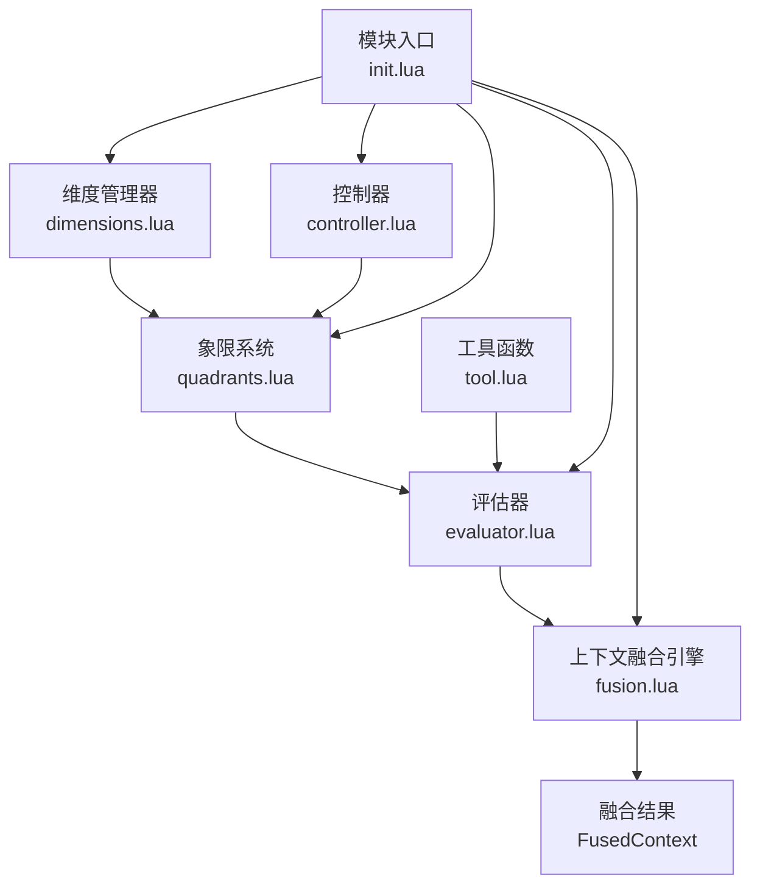
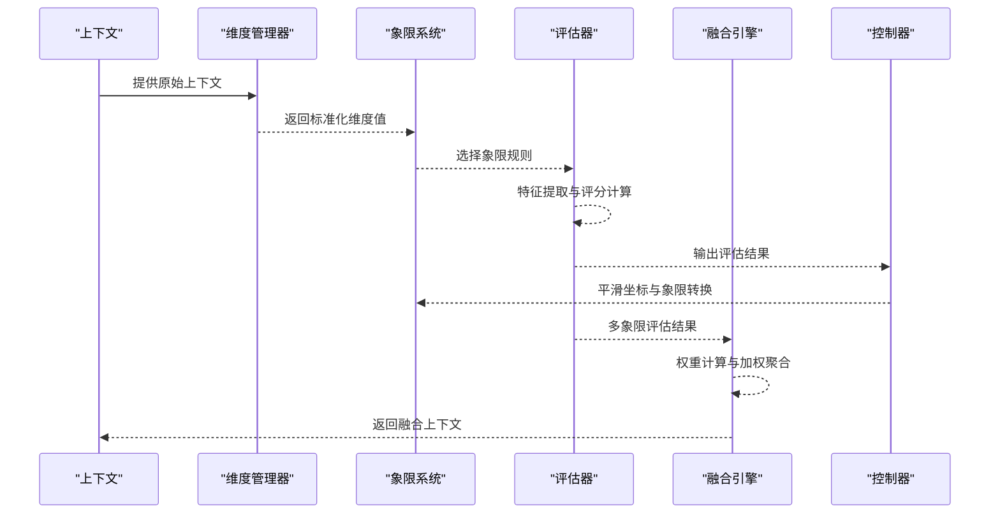
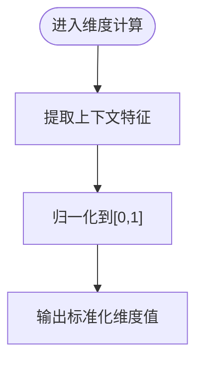
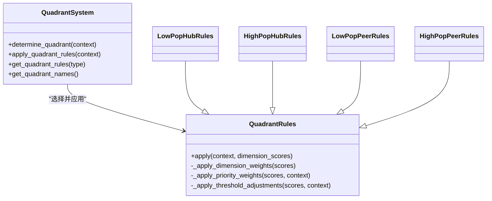
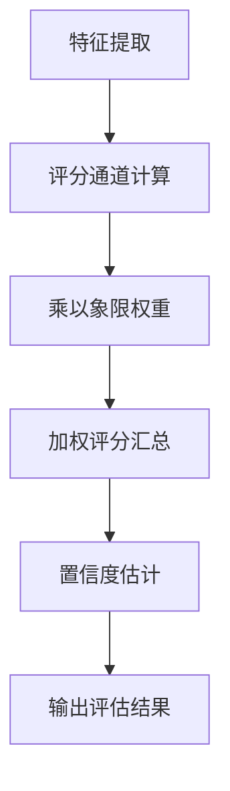
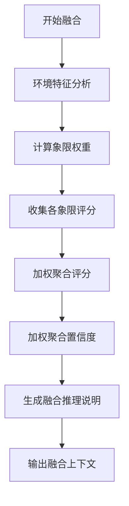
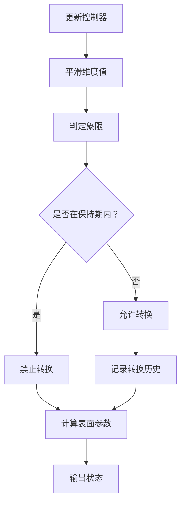
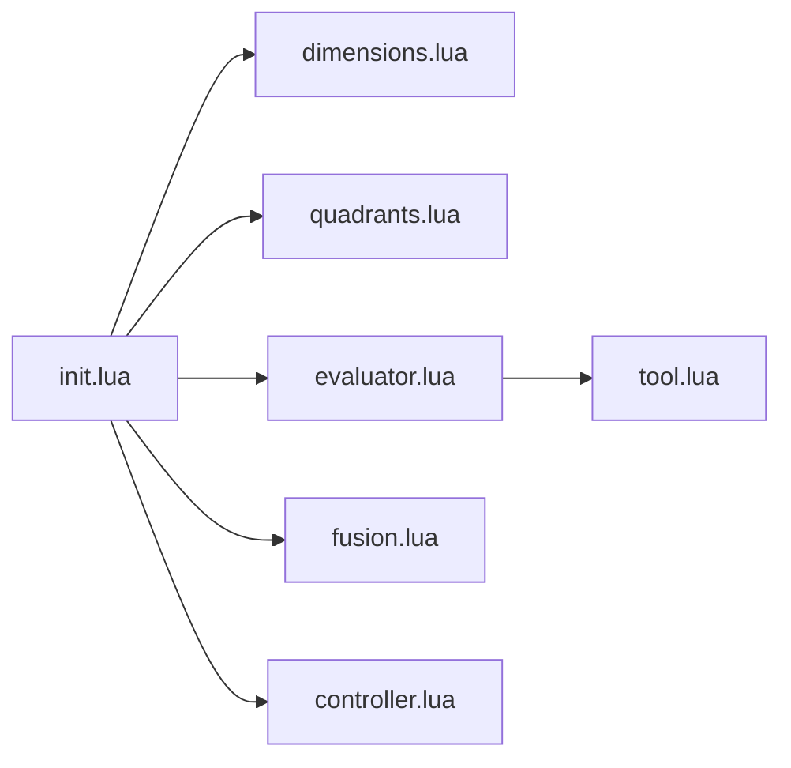

# 融合算法

<cite>
**本文引用的文件**
- [fusion.lua](file://mori_memory/module/decision/fusion.lua)
- [dimensions.lua](file://mori_memory/module/decision/dimensions.lua)
- [quadrants.lua](file://mori_memory/module/decision/quadrants.lua)
- [evaluator.lua](file://mori_memory/module/decision/evaluator.lua)
- [controller.lua](file://mori_memory/module/decision/controller.lua)
- [init.lua](file://mori_memory/module/decision/init.lua)
- [tool.lua](file://mori_memory/module/tool.lua)
- [test_decision_system.lua](file://test_decision_system.lua)
</cite>

## 目录
1. [简介](#简介)
2. [项目结构](#项目结构)
3. [核心组件](#核心组件)
4. [架构总览](#架构总览)
5. [详细组件分析](#详细组件分析)
6. [依赖关系分析](#依赖关系分析)
7. [性能考量](#性能考量)
8. [故障排查指南](#故障排查指南)
9. [结论](#结论)
10. [附录](#附录)

## 简介
本文件系统化阐述“融合算法”的理论基础与实现方法，聚焦于多源信息融合的证据聚合策略、权重计算机制与结果输出流程。文档覆盖以下关键点：
- 如何处理来自不同维度的评分与优先级，并平衡各维度的影响权重；
- 归一化处理、阈值过滤与最终决策生成的数学公式与算法步骤；
- 融合参数的调优指南与性能优化建议；
- 实际融合示例与调试方法。

## 项目结构
融合算法位于决策系统模块中，围绕“维度计算—象限规则—评分引擎—置信度—融合引擎—历史记录”的链路组织。核心文件如下：
- dimensions.lua：定义四个决策维度及归一化策略；
- quadrants.lua：定义四象限坐标系与规则权重；
- evaluator.lua：特征提取、评分通道与置信度计算；
- fusion.lua：上下文融合引擎，负责多象限结果的加权聚合；
- controller.lua：象限控制器，平滑坐标变化与表面参数插值；
- init.lua：模块导出入口；
- tool.lua：工具函数（向量化、SIMD加速等，供特征提取与评分使用）；
- test_decision_system.lua：端到端测试脚本，演示融合流程与性能基准。

图表来源
- [init.lua:13-19](file://mori_memory/module/decision/init.lua#L13-L19)
- [dimensions.lua:156-189](file://mori_memory/module/decision/dimensions.lua#L156-L189)
- [quadrants.lua:207-264](file://mori_memory/module/decision/quadrants.lua#L207-L264)
- [evaluator.lua:251-308](file://mori_memory/module/decision/evaluator.lua#L251-L308)
- [fusion.lua:117-229](file://mori_memory/module/decision/fusion.lua#L117-L229)
- [controller.lua:27-79](file://mori_memory/module/decision/controller.lua#L27-L79)
- [tool.lua:174-237](file://mori_memory/module/tool.lua#L174-L237)

章节来源
- [init.lua:13-19](file://mori_memory/module/decision/init.lua#L13-L19)

## 核心组件
- 维度管理器：将原始上下文映射为标准化的维度值，确保不同来源的输入在同一尺度上比较。
- 象限系统：基于维度值确定象限坐标，选择对应规则权重与阈值调整。
- 评估器：提取特征、计算评分通道、生成置信度与推理说明。
- 上下文融合引擎：对多象限评估结果进行加权聚合，输出融合上下文。
- 控制器：对维度值进行平滑与象限转换控制，提供表面参数插值。

章节来源
- [dimensions.lua:156-189](file://mori_memory/module/decision/dimensions.lua#L156-L189)
- [quadrants.lua:207-264](file://mori_memory/module/decision/quadrants.lua#L207-L264)
- [evaluator.lua:251-308](file://mori_memory/module/decision/evaluator.lua#L251-L308)
- [fusion.lua:117-229](file://mori_memory/module/decision/fusion.lua#L117-L229)
- [controller.lua:27-79](file://mori_memory/module/decision/controller.lua#L27-L79)

## 架构总览
融合算法的总体流程如下：
1) 维度计算：将上下文映射为标准化维度值；
2) 象限确定：根据维度值计算象限坐标，选择象限规则；
3) 评分计算：提取特征，计算评分通道，结合象限权重与阈值调整；
4) 置信度估计：基于评分一致性与稳定性估计置信度；
5) 融合阶段：对多象限结果进行加权聚合，生成融合上下文；
6) 控制与输出：控制器平滑坐标变化，输出表面参数与推理说明。

图表来源
- [dimensions.lua:182-189](file://mori_memory/module/decision/dimensions.lua#L182-L189)
- [quadrants.lua:247-264](file://mori_memory/module/decision/quadrants.lua#L247-L264)
- [evaluator.lua:267-308](file://mori_memory/module/decision/evaluator.lua#L267-L308)
- [controller.lua:44-79](file://mori_memory/module/decision/controller.lua#L44-L79)
- [fusion.lua:132-229](file://mori_memory/module/decision/fusion.lua#L132-L229)

## 详细组件分析

### 维度与归一化
- 维度类型：人口压力、交互拓扑、消息频率、参与者多样性；
- 归一化策略：将原始值映射至[0,1]范围，确保不同来源的输入可比；
- 计算逻辑：针对不同维度采用加权组合或区间映射，保证输出稳定且具解释性。

图表来源
- [dimensions.lua:34-38](file://mori_memory/module/decision/dimensions.lua#L34-L38)
- [dimensions.lua:56-77](file://mori_memory/module/decision/dimensions.lua#L56-L77)
- [dimensions.lua:89-109](file://mori_memory/module/decision/dimensions.lua#L89-L109)
- [dimensions.lua:121-133](file://mori_memory/module/decision/dimensions.lua#L121-L133)
- [dimensions.lua:145-154](file://mori_memory/module/decision/dimensions.lua#L145-L154)

章节来源
- [dimensions.lua:11-17](file://mori_memory/module/decision/dimensions.lua#L11-L17)
- [dimensions.lua:34-38](file://mori_memory/module/decision/dimensions.lua#L34-L38)

### 象限系统与规则权重
- 象限坐标：由人口压力与交互拓扑构成二维坐标，划分四象限；
- 规则权重：不同象限对维度权重、优先级权重与阈值调整不同；
- 应用流程：维度得分经维度权重与优先级权重调整后，再进行阈值调整。

图表来源
- [quadrants.lua:207-264](file://mori_memory/module/decision/quadrants.lua#L207-L264)
- [quadrants.lua:47-99](file://mori_memory/module/decision/quadrants.lua#L47-L99)
- [quadrants.lua:101-205](file://mori_memory/module/decision/quadrants.lua#L101-L205)

章节来源
- [quadrants.lua:10-16](file://mori_memory/module/decision/quadrants.lua#L10-L16)
- [quadrants.lua:207-264](file://mori_memory/module/decision/quadrants.lua#L207-L264)

### 评分引擎与置信度
- 评分通道：语义通道、对等边通道、中性评分；
- 权重组合：通道权重乘以象限权重，得到加权评分；
- 置信度：评分一致性与稳定性共同决定，避免极端波动。

图表来源
- [evaluator.lua:54-66](file://mori_memory/module/decision/evaluator.lua#L54-L66)
- [evaluator.lua:201-215](file://mori_memory/module/decision/evaluator.lua#L201-L215)
- [evaluator.lua:310-325](file://mori_memory/module/decision/evaluator.lua#L310-L325)

章节来源
- [evaluator.lua:172-250](file://mori_memory/module/decision/evaluator.lua#L172-L250)
- [evaluator.lua:310-325](file://mori_memory/module/decision/evaluator.lua#L310-L325)

### 上下文融合引擎
- 环境分析：基于消息频率、参与者多样性、稳定性与时序特征生成环境特征；
- 权重计算：从基础权重出发，结合环境特征进行归一化；
- 聚合策略：对各象限的评分进行加权求和，置信度按权重加权平均；
- 输出结构：包含融合评分、整体置信度、推理说明与元数据。

图表来源
- [fusion.lua:37-72](file://mori_memory/module/decision/fusion.lua#L37-L72)
- [fusion.lua:92-115](file://mori_memory/module/decision/fusion.lua#L92-L115)
- [fusion.lua:132-229](file://mori_memory/module/decision/fusion.lua#L132-L229)

章节来源
- [fusion.lua:15-25](file://mori_memory/module/decision/fusion.lua#L15-L25)
- [fusion.lua:132-229](file://mori_memory/module/decision/fusion.lua#L132-L229)

### 控制器与表面参数
- 平滑处理：对维度值进行指数平滑，抑制抖动；
- 象限转换：在保持期内禁止频繁转换，避免过度切换；
- 表面参数：基于当前象限与规则，插值计算各类表面参数，用于路由与策略调节。

图表来源
- [controller.lua:44-79](file://mori_memory/module/decision/controller.lua#L44-L79)
- [controller.lua:118-137](file://mori_memory/module/decision/controller.lua#L118-L137)
- [controller.lua:139-192](file://mori_memory/module/decision/controller.lua#L139-L192)

章节来源
- [controller.lua:10-25](file://mori_memory/module/decision/controller.lua#L10-L25)
- [controller.lua:118-137](file://mori_memory/module/decision/controller.lua#L118-L137)

## 依赖关系分析
- 模块导出：init.lua统一导出维度管理器、象限系统、评估器、控制器与融合引擎；
- 工具依赖：评估器使用工具模块进行嵌入与相似度计算；
- 数据流：维度管理器→象限系统→评估器→融合引擎；控制器贯穿维度计算与象限转换。

图表来源
- [init.lua:13-19](file://mori_memory/module/decision/init.lua#L13-L19)
- [evaluator.lua:6-7](file://mori_memory/module/decision/evaluator.lua#L6-L7)

章节来源
- [init.lua:13-19](file://mori_memory/module/decision/init.lua#L13-L19)

## 性能考量
- 向量化与SIMD：工具模块提供向量点积与余弦相似度的SIMD加速路径，减少特征提取与评分计算的CPU开销；
- 评分通道与权重：通道权重与象限权重的乘法操作简单高效，适合批量处理；
- 历史记录：评估器与融合引擎维护有限长度的历史缓冲，避免内存无限增长；
- 平滑与转换：控制器的平滑因子与保持回合数可调，平衡响应速度与稳定性。

章节来源
- [tool.lua:44-47](file://mori_memory/module/tool.lua#L44-L47)
- [tool.lua:619-725](file://mori_memory/module/tool.lua#L619-L725)
- [evaluator.lua:301-306](file://mori_memory/module/decision/evaluator.lua#L301-L306)
- [fusion.lua:223-227](file://mori_memory/module/decision/fusion.lua#L223-L227)
- [controller.lua:36-39](file://mori_memory/module/decision/controller.lua#L36-L39)

## 故障排查指南
- 维度异常：若维度值超出预期范围，检查归一化边界与输入上下文字段完整性；
- 象限误判：检查人口压力与交互拓扑的阈值设置，必要时调整平滑参数；
- 评分失衡：核对通道权重与象限权重，确认阈值调整是否导致极端值；
- 融合偏差：检查环境特征权重与归一化过程，确保权重和评分在合理范围内；
- 置信度异常：验证评分一致性与稳定性因子的计算逻辑；
- 性能瓶颈：启用SIMD路径，减少不必要的特征提取与评分通道数量。

章节来源
- [dimensions.lua:34-38](file://mori_memory/module/decision/dimensions.lua#L34-L38)
- [quadrants.lua:62-74](file://mori_memory/module/decision/quadrants.lua#L62-L74)
- [evaluator.lua:310-325](file://mori_memory/module/decision/evaluator.lua#L310-L325)
- [fusion.lua:102-115](file://mori_memory/module/decision/fusion.lua#L102-L115)
- [tool.lua:619-725](file://mori_memory/module/tool.lua#L619-L725)

## 结论
融合算法通过“维度归一化—象限规则—评分聚合—置信度估计—加权融合”的闭环，实现了多源信息的稳健整合。其核心优势在于：
- 维度与规则的模块化设计，便于针对不同场景灵活调整；
- 加权聚合与置信度估计提供了可解释的融合结果；
- 控制器与表面参数插值保障了系统在动态环境中的稳定性。

建议在实际部署中结合业务场景对权重与阈值进行调优，并利用SIMD与批处理进一步提升性能。

## 附录

### 数学公式与算法步骤
- 归一化：将原始值映射至[0,1]范围，确保跨维度可比。
- 象限坐标：由人口压力与交互拓扑构成二维坐标，划分四象限。
- 权重计算：基础权重经环境特征调整后归一化，得到象限权重。
- 加权聚合：对各象限评分按权重求和并归一化，得到融合评分；置信度按权重加权平均。
- 置信度估计：评分一致性与稳定性共同决定置信度。

章节来源
- [dimensions.lua:34-38](file://mori_memory/module/decision/dimensions.lua#L34-L38)
- [quadrants.lua:31-45](file://mori_memory/module/decision/quadrants.lua#L31-L45)
- [fusion.lua:92-115](file://mori_memory/module/decision/fusion.lua#L92-L115)
- [fusion.lua:162-196](file://mori_memory/module/decision/fusion.lua#L162-L196)
- [evaluator.lua:310-325](file://mori_memory/module/decision/evaluator.lua#L310-L325)

### 调优指南
- 维度权重：根据业务重要性调整人口压力、交互拓扑、消息频率与参与者多样性的权重；
- 象限权重：针对不同象限调整维度权重与优先级权重，确保规则与场景匹配；
- 阈值调整：通过阈值调整抑制噪声或鼓励特定行为；
- 平滑参数：在响应速度与稳定性之间折衷，避免过度抖动；
- 表面参数：依据象限特性插值计算，指导路由与策略。

章节来源
- [quadrants.lua:101-205](file://mori_memory/module/decision/quadrants.lua#L101-L205)
- [controller.lua:118-137](file://mori_memory/module/decision/controller.lua#L118-L137)

### 实际融合示例与调试方法
- 示例流程：参考测试脚本，依次执行维度计算、象限确定、评估、融合与性能基准测试；
- 调试要点：检查维度值范围、象限规则权重、评分通道与置信度估计、融合权重与推理说明；
- 性能基准：在大量随机上下文上重复评估，统计平均耗时与吞吐量。

章节来源
- [test_decision_system.lua:29-157](file://test_decision_system.lua#L29-L157)
- [test_decision_system.lua:162-202](file://test_decision_system.lua#L162-L202)