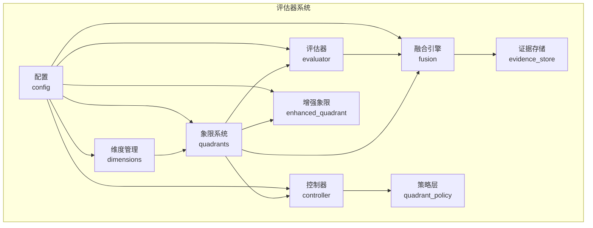
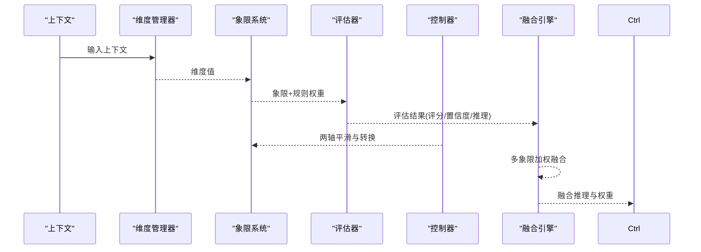
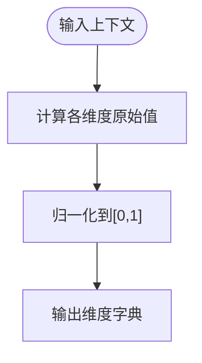
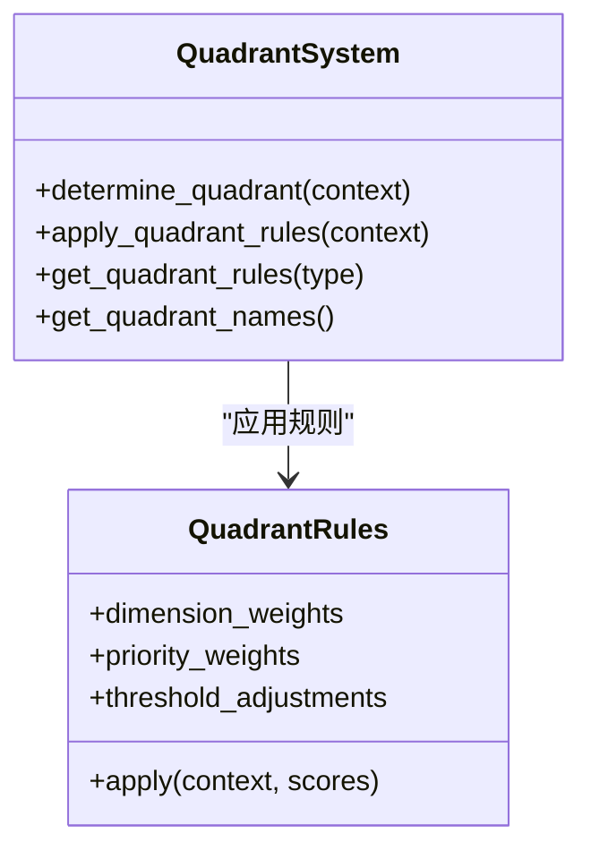
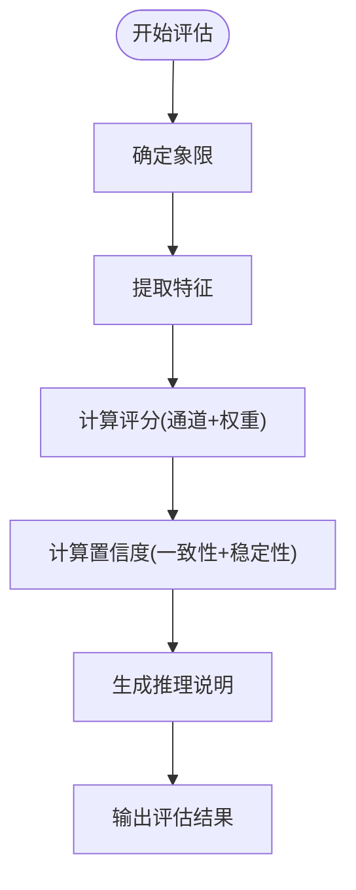
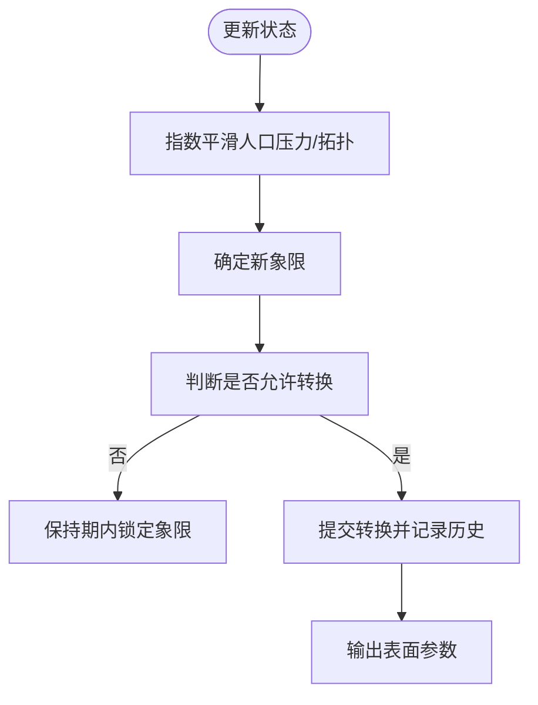
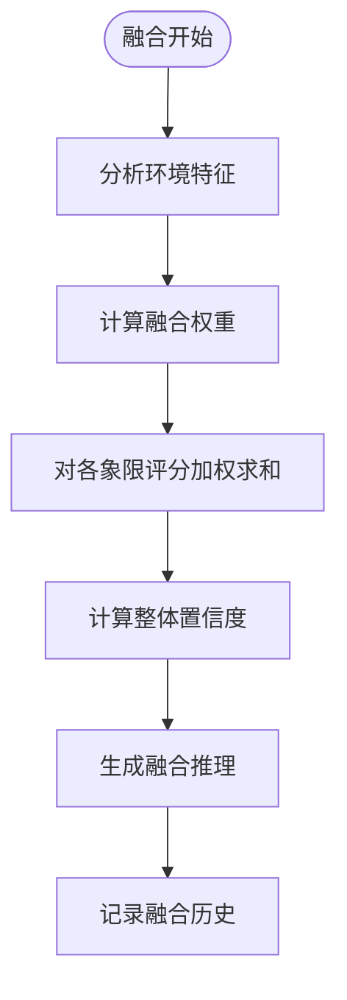
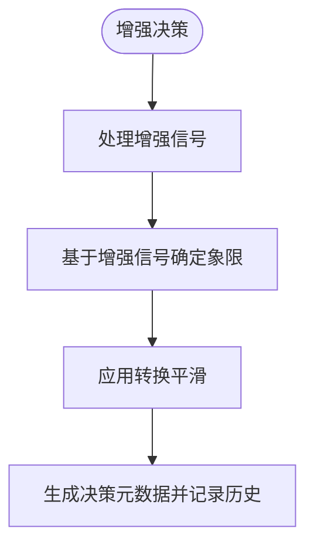
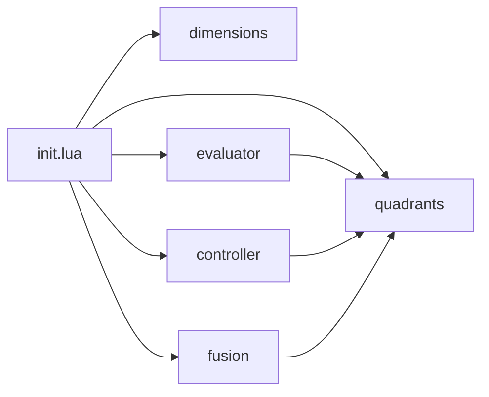

# 评估器系统

<cite>
**本文档引用的文件**
- [mori_memory/module/decision/evaluator.lua](file://mori_memory/module/decision/evaluator.lua)
- [mori_memory/module/decision/dimensions.lua](file://mori_memory/module/decision/dimensions.lua)
- [mori_memory/module/decision/quadrants.lua](file://mori_memory/module/decision/quadrants.lua)
- [mori_memory/module/decision/controller.lua](file://mori_memory/module/decision/controller.lua)
- [mori_memory/module/decision/fusion.lua](file://mori_memory/module/decision/fusion.lua)
- [mori_memory/module/decision/enhanced_quadrant.lua](file://mori_memory/module/decision/enhanced_quadrant.lua)
- [mori_memory/module/decision/init.lua](file://mori_memory/module/decision/init.lua)
- [mori_memory/module/evidence/evidence_store.lua](file://mori_memory/module/evidence/evidence_store.lua)
- [mori_memory/module/policy/quadrant_policy.lua](file://mori_memory/module/policy/quadrant_policy.lua)
- [mori_memory/module/config.lua](file://mori_memory/module/config.lua)
- [test_decision_system.lua](file://test_decision_system.lua)
- [integration_demo.lua](file://integration_demo.lua)
- [run_level3_benchmarks.py](file://mori_memory/scripts/run_level3_benchmarks.py)
- [analyze_four_quadrant_jitter.py](file://mori_memory/scripts/analyze_four_quadrant_jitter.py)
</cite>

## 目录
1. [简介](#简介)
2. [项目结构](#项目结构)
3. [核心组件](#核心组件)
4. [架构总览](#架构总览)
5. [详细组件分析](#详细组件分析)
6. [依赖关系分析](#依赖关系分析)
7. [性能考量](#性能考量)
8. [故障排除指南](#故障排除指南)
9. [结论](#结论)
10. [附录](#附录)

## 简介
本文件面向评估器系统，系统性阐述四象限决策评估的指标体系与评估方法，涵盖准确性、一致性、时效性等关键评估维度；说明评估器如何收集决策结果的反馈信息（如用户满意度、响应时间、错误率等量化指标）；提供评估算法的实现细节（统计分析方法、趋势预测与性能基准）；解释评估结果的可视化展示与报告生成机制；包含评估器的配置参数、评估周期设置与结果解读指南，并展示评估数据的实际应用与改进建议。

## 项目结构
评估器系统位于 mori_memory/module/decision 目录下，围绕“维度-象限-评估-控制-融合”的闭环设计，配合证据存储与策略层，形成完整的评估与反馈机制。核心模块包括：
- 维度管理（dimensions）：定义并计算人口压力、交互拓扑、消息频率、参与者多样性等维度
- 象限系统（quadrants）：基于维度坐标确定象限并应用象限规则
- 评估器（evaluator）：提取特征、计算评分、生成置信度与推理说明
- 控制器（controller）：两轴控制器，平滑象限转换，输出表面参数
- 融合引擎（fusion）：多象限结果加权融合，生成融合推理
- 增强象限（enhanced_quadrant）：自适应阈值与平滑过渡的增强决策
- 策略层（policy/quadrant_policy）：仅参数调节，不改变核心路由
- 配置（config）：系统参数与策略配置
- 证据存储（evidence_store）：证据收集与趋势候选管理
- 测试与演示（test_decision_system.lua、integration_demo.lua）：系统验证与性能基准
- 基准脚本（run_level3_benchmarks.py、analyze_four_quadrant_jitter.py）：评估数据的统计分析与可视化

图表来源
- [mori_memory/module/decision/init.lua:13-19](file://mori_memory/module/decision/init.lua#L13-L19)
- [mori_memory/module/decision/dimensions.lua:157-189](file://mori_memory/module/decision/dimensions.lua#L157-L189)
- [mori_memory/module/decision/quadrants.lua:208-264](file://mori_memory/module/decision/quadrants.lua#L208-L264)
- [mori_memory/module/decision/evaluator.lua:252-308](file://mori_memory/module/decision/evaluator.lua#L252-L308)
- [mori_memory/module/decision/controller.lua:28-79](file://mori_memory/module/decision/controller.lua#L28-L79)
- [mori_memory/module/decision/fusion.lua:118-229](file://mori_memory/module/decision/fusion.lua#L118-L229)
- [mori_memory/module/decision/enhanced_quadrant.lua:214-253](file://mori_memory/module/decision/enhanced_quadrant.lua#L214-L253)
- [mori_memory/module/policy/quadrant_policy.lua:142-207](file://mori_memory/module/policy/quadrant_policy.lua#L142-L207)
- [mori_memory/module/config.lua:68-496](file://mori_memory/module/config.lua#L68-L496)
- [mori_memory/module/evidence/evidence_store.lua:491-603](file://mori_memory/module/evidence/evidence_store.lua#L491-L603)

章节来源
- [mori_memory/module/decision/init.lua:13-19](file://mori_memory/module/decision/init.lua#L13-L19)
- [mori_memory/module/decision/dimensions.lua:157-189](file://mori_memory/module/decision/dimensions.lua#L157-L189)
- [mori_memory/module/decision/quadrants.lua:208-264](file://mori_memory/module/decision/quadrants.lua#L208-L264)
- [mori_memory/module/decision/evaluator.lua:252-308](file://mori_memory/module/decision/evaluator.lua#L252-L308)
- [mori_memory/module/decision/controller.lua:28-79](file://mori_memory/module/decision/controller.lua#L28-L79)
- [mori_memory/module/decision/fusion.lua:118-229](file://mori_memory/module/decision/fusion.lua#L118-L229)
- [mori_memory/module/decision/enhanced_quadrant.lua:214-253](file://mori_memory/module/decision/enhanced_quadrant.lua#L214-L253)
- [mori_memory/module/policy/quadrant_policy.lua:142-207](file://mori_memory/module/policy/quadrant_policy.lua#L142-L207)
- [mori_memory/module/config.lua:68-496](file://mori_memory/module/config.lua#L68-L496)
- [mori_memory/module/evidence/evidence_store.lua:491-603](file://mori_memory/module/evidence/evidence_store.lua#L491-L603)

## 核心组件
- 维度管理器：负责计算人口压力、交互拓扑、消息频率、参与者多样性等维度值，并进行归一化处理，为象限系统提供输入。
- 象限系统：根据维度值计算坐标，确定当前象限，并应用该象限的规则权重与阈值调整，输出带权重的评分。
- 决策评估器：提取特征（语义相似性、用户连续性、回复线索、提及检测、消息长度与复杂度、时间邻近性、流稳定性），计算语义通道、对等边通道与中性评分，结合象限权重与稳定性计算置信度，生成推理说明。
- 决策控制器：两轴控制器，对人口压力与交互拓扑进行指数平滑，判断象限转换条件，输出表面参数（如 attach_conservatism、peer_signal_trust 等）。
- 上下文融合引擎：对多象限评估结果进行加权融合，计算整体置信度与融合推理，记录历史与权重趋势。
- 增强象限系统：引入自适应阈值与信号置信度，对两轴坐标进行增强处理，应用转换平滑，提升鲁棒性。
- 策略层：仅对参数进行调节，不改变核心路由逻辑，提供资源分配、提交时机与回忆策略建议。
- 配置系统：集中管理策略参数、阈值、权重与控制器参数，支持策略配置文件与动态覆盖。
- 证据存储：收集证据、演员本地证据、范围聚合、趋势候选与主题投影，支撑评估与反馈。

章节来源
- [mori_memory/module/decision/dimensions.lua:157-189](file://mori_memory/module/decision/dimensions.lua#L157-L189)
- [mori_memory/module/decision/quadrants.lua:208-264](file://mori_memory/module/decision/quadrants.lua#L208-L264)
- [mori_memory/module/decision/evaluator.lua:252-308](file://mori_memory/module/decision/evaluator.lua#L252-L308)
- [mori_memory/module/decision/controller.lua:28-79](file://mori_memory/module/decision/controller.lua#L28-L79)
- [mori_memory/module/decision/fusion.lua:118-229](file://mori_memory/module/decision/fusion.lua#L118-L229)
- [mori_memory/module/decision/enhanced_quadrant.lua:214-253](file://mori_memory/module/decision/enhanced_quadrant.lua#L214-L253)
- [mori_memory/module/policy/quadrant_policy.lua:142-207](file://mori_memory/module/policy/quadrant_policy.lua#L142-L207)
- [mori_memory/module/config.lua:68-496](file://mori_memory/module/config.lua#L68-L496)
- [mori_memory/module/evidence/evidence_store.lua:491-603](file://mori_memory/module/evidence/evidence_store.lua#L491-L603)

## 架构总览
评估器系统采用“维度驱动-象限判定-评估打分-置信度计算-融合输出”的流水线式架构。维度管理器提供标准化输入，象限系统给出规则权重，评估器执行特征提取与评分计算，控制器提供两轴平滑与表面参数，融合引擎汇总多源结果，策略层提供参数调节，配置系统贯穿全局参数管理，证据存储承载反馈与趋势。

图表来源
- [mori_memory/module/decision/dimensions.lua:182-189](file://mopi_memory/module/decision/dimensions.lua#L182-L189)
- [mori_memory/module/decision/quadrants.lua:227-264](file://mori_memory/module/decision/quadrants.lua#L227-L264)
- [mori_memory/module/decision/evaluator.lua:267-308](file://mori_memory/module/decision/evaluator.lua#L267-L308)
- [mori_memory/module/decision/controller.lua:44-79](file://mori_memory/module/decision/controller.lua#L44-L79)
- [mori_memory/module/decision/fusion.lua:132-229](file://mori_memory/module/decision/fusion.lua#L132-L229)

## 详细组件分析

### 维度管理器（Dimensions）
- 维度类型：人口压力、交互拓扑、消息频率、参与者多样性
- 计算流程：归一化原始值至[0,1]范围，确保不同量纲的可比性
- 输出：维度字典，供象限系统与评估器使用

图表来源
- [mori_memory/module/decision/dimensions.lua:34-44](file://mori_memory/module/decision/dimensions.lua#L34-L44)
- [mori_memory/module/decision/dimensions.lua:56-77](file://mori_memory/module/decision/dimensions.lua#L56-L77)
- [mori_memory/module/decision/dimensions.lua:89-109](file://mori_memory/module/decision/dimensions.lua#L89-L109)
- [mori_memory/module/decision/dimensions.lua:121-133](file://mori_memory/module/decision/dimensions.lua#L121-L133)
- [mori_memory/module/decision/dimensions.lua:145-154](file://mori_memory/module/decision/dimensions.lua#L145-L154)

章节来源
- [mori_memory/module/decision/dimensions.lua:11-18](file://mori_memory/module/decision/dimensions.lua#L11-L18)
- [mori_memory/module/decision/dimensions.lua:46-77](file://mori_memory/module/decision/dimensions.lua#L46-L77)
- [mori_memory/module/decision/dimensions.lua:89-109](file://mori_memory/module/decision/dimensions.lua#L89-L109)
- [mori_memory/module/decision/dimensions.lua:121-133](file://mori_memory/module/decision/dimensions.lua#L121-L133)
- [mori_memory/module/decision/dimensions.lua:145-154](file://mori_memory/module/decision/dimensions.lua#L145-L154)

### 象限系统（Quadrants）
- 象限类型：低人口广播型、高人口广播型、低人口对等型、高人口对等型
- 规则应用：维度权重、优先级权重、阈值调整，输出带权重的评分
- 坐标确定：基于人口压力与交互拓扑的二元坐标，映射到四个象限

图表来源
- [mori_memory/module/decision/quadrants.lua:208-264](file://mori_memory/module/decision/quadrants.lua#L208-L264)
- [mori_memory/module/decision/quadrants.lua:47-99](file://mori_memory/module/decision/quadrants.lua#L47-L99)

章节来源
- [mori_memory/module/decision/quadrants.lua:10-16](file://mori_memory/module/decision/quadrants.lua#L10-L16)
- [mori_memory/module/decision/quadrants.lua:208-264](file://mori_memory/module/decision/quadrants.lua#L208-L264)
- [mori_memory/module/decision/quadrants.lua:47-99](file://mori_memory/module/decision/quadrants.lua#L47-L99)

### 决策评估器（Evaluator）
- 特征提取：语义相似性、用户连续性、回复线索、提及检测、消息长度与复杂度、时间邻近性、流稳定性
- 评分引擎：语义通道、对等边通道、中性评分，结合象限权重与阈值调整
- 置信度：评分一致性与稳定性综合计算
- 推理说明：象限解释、关键特征与评分对比

图表来源
- [mori_memory/module/decision/evaluator.lua:267-308](file://mori_memory/module/decision/evaluator.lua#L267-L308)
- [mori_memory/module/decision/evaluator.lua:310-325](file://mori_memory/module/decision/evaluator.lua#L310-L325)
- [mori_memory/module/decision/evaluator.lua:327-353](file://mori_memory/module/decision/evaluator.lua#L327-L353)

章节来源
- [mori_memory/module/decision/evaluator.lua:11-25](file://mori_memory/module/decision/evaluator.lua#L11-L25)
- [mori_memory/module/decision/evaluator.lua:27-66](file://mori_memory/module/decision/evaluator.lua#L27-L66)
- [mori_memory/module/decision/evaluator.lua:173-215](file://mori_memory/module/decision/evaluator.lua#L173-L215)
- [mori_memory/module/decision/evaluator.lua:267-308](file://mori_memory/module/decision/evaluator.lua#L267-L308)
- [mori_memory/module/decision/evaluator.lua:310-353](file://mori_memory/module/decision/evaluator.lua#L310-L353)

### 决策控制器（Controller）
- 两轴控制器：对人口压力与交互拓扑进行指数平滑，避免抖动
- 象限转换：在保持期内禁止转换，防止频繁切换
- 表面参数：attach_conservatism、peer_signal_trust、hub_fallback_trust、write_conservatism、readout_locality

图表来源
- [mori_memory/module/decision/controller.lua:44-79](file://mori_memory/module/decision/controller.lua#L44-L79)
- [mori_memory/module/decision/controller.lua:81-116](file://mori_memory/module/decision/controller.lua#L81-L116)
- [mori_memory/module/decision/controller.lua:118-192](file://mori_memory/module/decision/controller.lua#L118-L192)

章节来源
- [mori_memory/module/decision/controller.lua:10-25](file://mori_memory/module/decision/controller.lua#L10-L25)
- [mori_memory/module/decision/controller.lua:44-79](file://mori_memory/module/decision/controller.lua#L44-L79)
- [mori_memory/module/decision/controller.lua:118-192](file://mori_memory/module/decision/controller.lua#L118-L192)

### 上下文融合引擎（Fusion）
- 环境分析：消息频率、参与者多样性、稳定性、时间特征
- 权重计算：基于环境特征与当前象限的基础权重，进行归一化
- 融合过程：对各象限评分进行加权求和，计算整体置信度
- 历史记录：记录融合历史与权重趋势，便于分析与可视化

图表来源
- [mori_memory/module/decision/fusion.lua:132-229](file://mori_memory/module/decision/fusion.lua#L132-L229)
- [mori_memory/module/decision/fusion.lua:271-300](file://mori_memory/module/decision/fusion.lua#L271-L300)

章节来源
- [mori_memory/module/decision/fusion.lua:11-25](file://mori_memory/module/decision/fusion.lua#L11-L25)
- [mori_memory/module/decision/fusion.lua:27-72](file://mori_memory/module/decision/fusion.lua#L27-L72)
- [mori_memory/module/decision/fusion.lua:74-115](file://mori_memory/module/decision/fusion.lua#L74-L115)
- [mori_memory/module/decision/fusion.lua:132-229](file://mori_memory/module/decision/fusion.lua#L132-L229)
- [mori_memory/module/decision/fusion.lua:271-300](file://mori_memory/module/decision/fusion.lua#L271-L300)

### 增强象限系统（Enhanced Quadrant）
- 增强信号：参与压力与交互拓扑的增强计算，引入信号置信度
- 自适应阈值：根据置信度动态调整两轴阈值，提升鲁棒性
- 转换平滑：在保持期内维持原象限，降低抖动

图表来源
- [mori_memory/module/decision/enhanced_quadrant.lua:22-39](file://mori_memory/module/decision/enhanced_quadrant.lua#L22-L39)
- [mori_memory/module/decision/enhanced_quadrant.lua:227-253](file://mori_memory/module/decision/enhanced_quadrant.lua#L227-L253)
- [mori_memory/module/decision/enhanced_quadrant.lua:291-319](file://mori_memory/module/decision/enhanced_quadrant.lua#L291-L319)

章节来源
- [mori_memory/module/decision/enhanced_quadrant.lua:5-21](file://mori_memory/module/decision/enhanced_quadrant.lua#L5-L21)
- [mori_memory/module/decision/enhanced_quadrant.lua:22-39](file://mori_memory/module/decision/enhanced_quadrant.lua#L22-L39)
- [mori_memory/module/decision/enhanced_quadrant.lua:227-253](file://mori_memory/module/decision/enhanced_quadrant.lua#L227-L253)
- [mori_memory/module/decision/enhanced_quadrant.lua:291-319](file://mori_memory/module/decision/enhanced_quadrant.lua#L291-L319)

### 策略层（Quadrant Policy）
- 参数调节：仅对现有参数进行调节，不改变核心路由逻辑
- 资源分配、提交时机、回忆策略建议：基于象限类型提供策略建议

章节来源
- [mori_memory/module/policy/quadrant_policy.lua:47-121](file://mori_memory/module/policy/quadrant_policy.lua#L47-L121)
- [mori_memory/module/policy/quadrant_policy.lua:142-207](file://mori_memory/module/policy/quadrant_policy.lua#L142-L207)

### 配置系统（Config）
- 集中管理策略参数、阈值、权重与控制器参数
- 支持策略配置文件与动态覆盖，确保系统可调性与一致性

章节来源
- [mori_memory/module/config.lua:68-496](file://mori_memory/module/config.lua#L68-L496)

### 证据存储（Evidence Store）
- 证据管理：已提交的记忆块、演员本地证据、范围聚合、趋势候选、主题投影
- 趋势候选：支持最小支持度、演员数与置信度计算，便于趋势分析与反馈

章节来源
- [mori_memory/module/evidence/evidence_store.lua:16-24](file://mori_memory/module/evidence/evidence_store.lua#L16-L24)
- [mori_memory/module/evidence/evidence_store.lua:286-374](file://mori_memory/module/evidence/evidence_store.lua#L286-L374)
- [mori_memory/module/evidence/evidence_store.lua:491-603](file://mori_memory/module/evidence/evidence_store.lua#L491-L603)

## 依赖关系分析
- 模块导出：决策系统通过 init.lua 统一导出维度管理器、象限系统、评估器、控制器、融合引擎
- 组件耦合：评估器依赖象限系统提供的规则权重；控制器与象限系统双向交互；融合引擎依赖象限系统与评估器输出
- 外部依赖：util、tool 等工具模块提供日志与辅助功能

图表来源
- [mori_memory/module/decision/init.lua:13-19](file://mori_memory/module/decision/init.lua#L13-L19)

章节来源
- [mori_memory/module/decision/init.lua:13-19](file://mori_memory/module/decision/init.lua#L13-L19)

## 性能考量
- 性能基准：系统提供性能测试脚本，1000次评估循环的耗时与平均处理速度可用于评估系统性能
- 优化建议：特征提取与评分计算均为纯Lua实现，具备较高执行效率；可通过减少历史记录规模、优化阈值计算与平滑参数进一步提升性能

章节来源
- [test_decision_system.lua:162-202](file://test_decision_system.lua#L162-L202)

## 故障排除指南
- 日志与调试：util 与 tool 模块提供日志接口，便于定位问题
- 常见问题：
  - 维度值异常：检查输入上下文字段完整性与归一化边界
  - 象限抖动：调整控制器平滑因子与保持回合数
  - 置信度偏低：检查特征提取权重与稳定性因子
  - 融合偏差：调整环境特征权重与基础权重

章节来源
- [test_decision_system.lua:8-22](file://test_decision_system.lua#L8-L22)
- [mori_memory/module/decision/controller.lua:36-39](file://mori_memory/module/decision/controller.lua#L36-L39)
- [mori_memory/module/decision/evaluator.lua:310-325](file://mori_memory/module/decision/evaluator.lua#L310-L325)
- [mori_memory/module/decision/fusion.lua:92-115](file://mori_memory/module/decision/fusion.lua#L92-L115)

## 结论
评估器系统通过维度驱动的象限判定与特征化的评估流程，实现了对决策质量的多维评估与反馈。结合两轴控制器、增强象限与融合引擎，系统在保证稳定性的同时提升了鲁棒性与可解释性。配置系统与证据存储为持续改进提供了数据与参数支撑。通过基准脚本与可视化分析，可对系统性能与趋势进行有效监控与优化。

## 附录

### 评估指标体系与评估方法
- 准确性：通过象限规则权重与阈值调整，结合语义通道与对等边通道评分，衡量决策与环境特征的匹配程度
- 一致性：通过评分一致性（评分方差）与稳定性因子（如流稳定性）综合计算置信度
- 时效性：通过响应时间（compile_ms、ingest_ms）与转换保持期（hold_until_turn）衡量系统响应速度与稳定性
- 用户满意度：通过趋势候选与主题投影，结合证据存储中的演员本地证据与范围聚合，间接反映用户偏好与满意度

章节来源
- [mori_memory/module/decision/evaluator.lua:310-325](file://mori_memory/module/decision/evaluator.lua#L310-L325)
- [mori_memory/module/decision/controller.lua:64-76](file://mori_memory/module/decision/controller.lua#L64-L76)
- [mori_memory/module/decision/fusion.lua:56-72](file://mori_memory/module/decision/fusion.lua#L56-L72)
- [mori_memory/module/evidence/evidence_store.lua:366-373](file://mori_memory/module/evidence/evidence_store.lua#L366-L373)

### 评估算法实现细节
- 特征提取：基于上下文字段计算语义相似性、用户连续性、回复线索、提及检测、消息长度与复杂度、时间邻近性、流稳定性
- 评分计算：语义通道与对等边通道评分，结合象限权重与阈值调整
- 置信度计算：评分一致性与稳定性综合
- 趋势预测：通过趋势候选的置信度与支持度，结合时间衰减因子进行趋势分析
- 性能基准：通过基准脚本统计 compile_ms 与 ingest_ms 的均值、分位数与最大值

章节来源
- [mori_memory/module/decision/evaluator.lua:68-170](file://mori_memory/module/decision/evaluator.lua#L68-L170)
- [mori_memory/module/decision/evaluator.lua:217-249](file://mori_memory/module/decision/evaluator.lua#L217-L249)
- [mori_memory/module/decision/evaluator.lua:310-325](file://mori_memory/module/decision/evaluator.lua#L310-L325)
- [mori_memory/module/decision/enhanced_quadrant.lua:365-373](file://mori_memory/module/decision/enhanced_quadrant.lua#L365-L373)
- [mori_memory/scripts/analyze_four_quadrant_jitter.py:596-616](file://mori_memory/scripts/analyze_four_quadrant_jitter.py#L596-L616)

### 评估结果可视化与报告生成
- 可视化：基准脚本提供象限抖动代表图，展示四象限的轨迹与均值点
- 报告生成：基准脚本输出JSON与PNG，包含抖动分数、主导象限、转换次数、空上下文率等指标

章节来源
- [mori_memory/scripts/analyze_four_quadrant_jitter.py:655-701](file://mori_memory/scripts/analyze_four_quadrant_jitter.py#L655-L701)
- [mori_memory/scripts/analyze_four_quadrant_jitter.py:741-765](file://mori_memory/scripts/analyze_four_quadrant_jitter.py#L741-L765)

### 配置参数、评估周期与结果解读
- 配置参数：通过配置系统集中管理策略参数、阈值、权重与控制器参数
- 评估周期：控制器提供保持回合数与平滑因子，融合引擎记录历史与权重趋势
- 结果解读：融合推理与推理说明帮助理解评估依据与权重分布

章节来源
- [mori_memory/module/config.lua:68-496](file://mori_memory/module/config.lua#L68-L496)
- [mori_memory/module/decision/controller.lua:36-39](file://mori_memory/module/decision/controller.lua#L36-L39)
- [mori_memory/module/decision/fusion.lua:231-269](file://mori_memory/module/decision/fusion.lua#L231-L269)

### 评估数据的应用与改进建议
- 数据应用：证据存储与趋势候选为系统优化提供数据支撑；基准脚本与可视化报告用于性能监控
- 改进建议：根据置信度与融合推理调整特征权重与阈值；通过增强象限的自适应阈值与平滑过渡减少抖动；利用策略层参数调节提升资源利用率

章节来源
- [mori_memory/module/evidence/evidence_store.lua:286-374](file://mori_memory/module/evidence/evidence_store.lua#L286-L374)
- [mori_memory/scripts/run_level3_benchmarks.py:1-800](file://mori_memory/scripts/run_level3_benchmarks.py#L1-L800)
- [mori_memory/scripts/analyze_four_quadrant_jitter.py:1-770](file://mori_memory/scripts/analyze_four_quadrant_jitter.py#L1-L770)