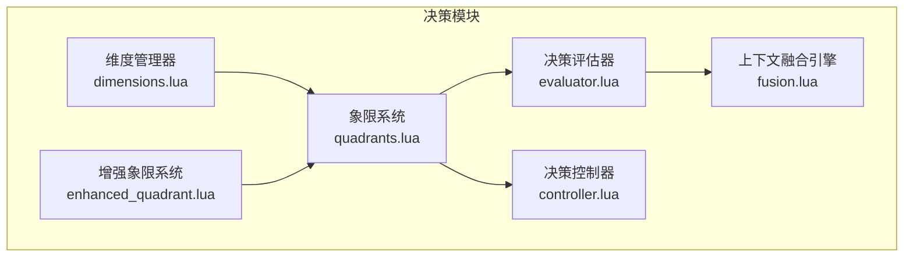
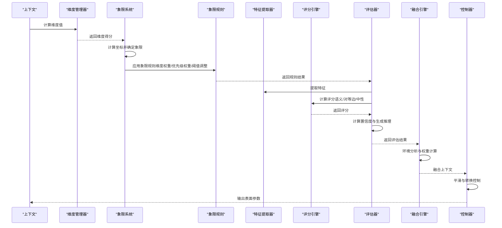
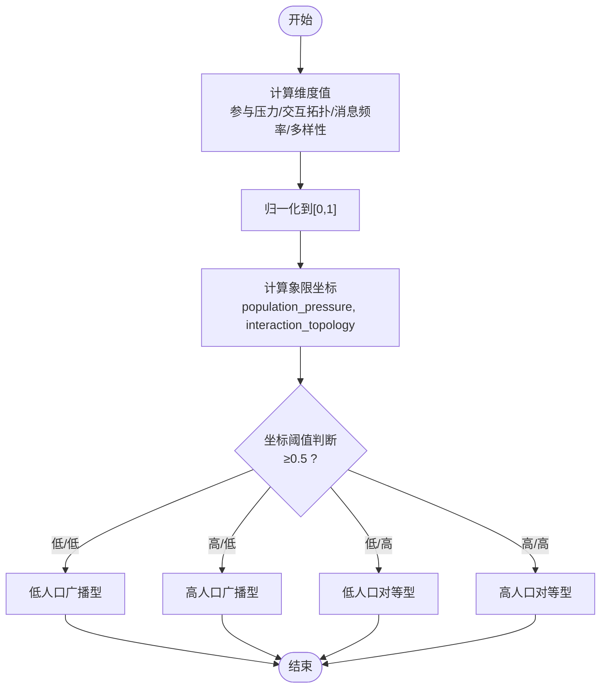
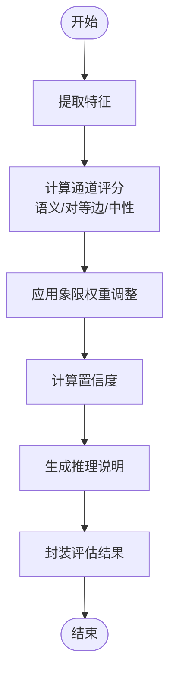
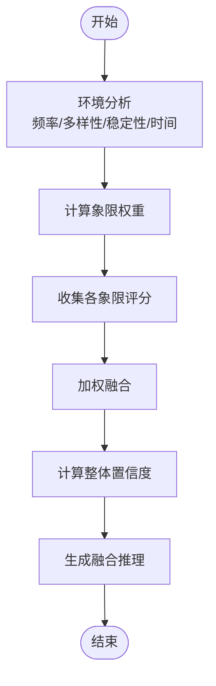
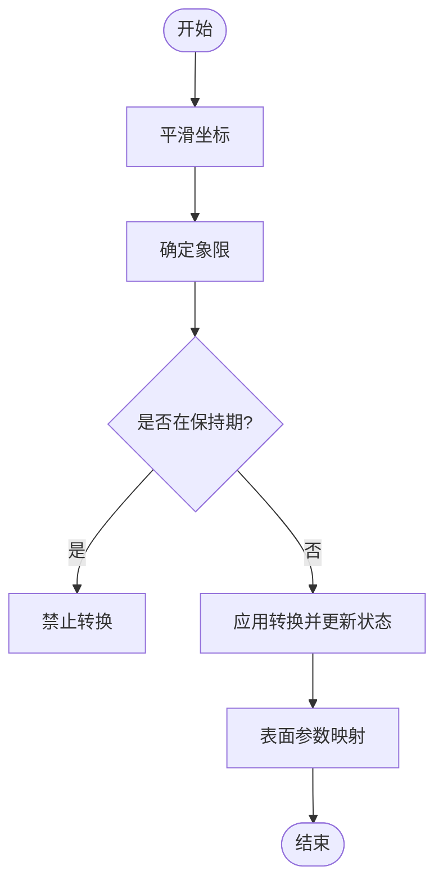
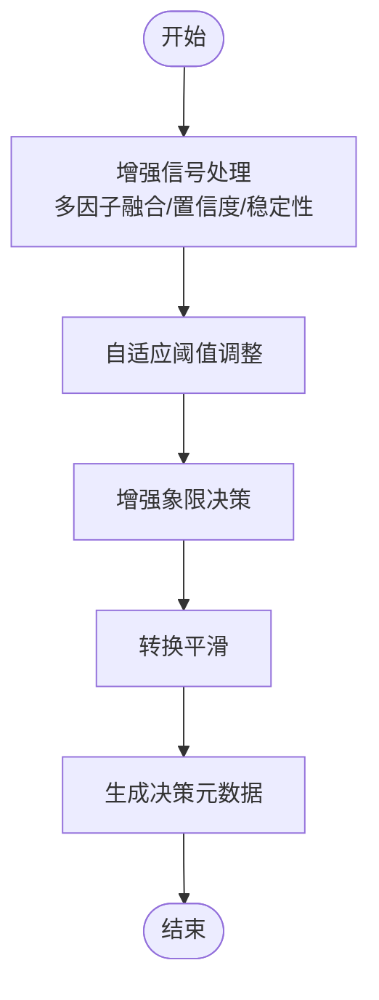
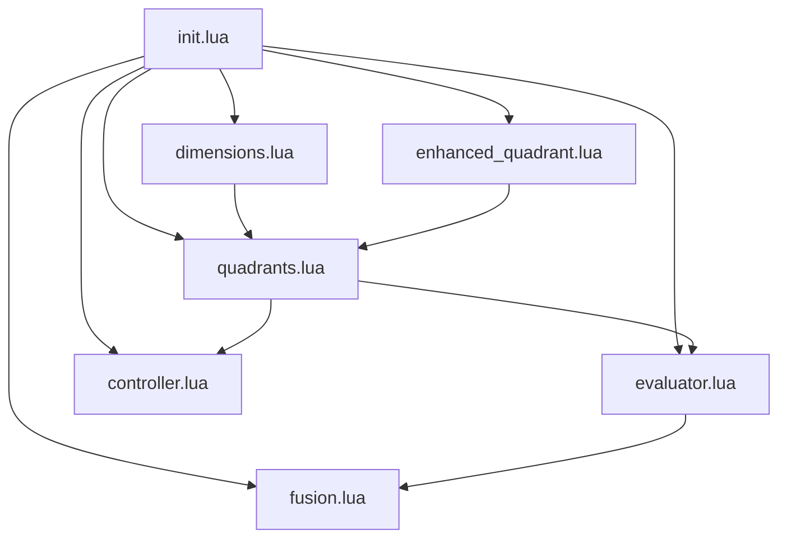

# 象限分析系统

<cite>
**本文引用的文件**
- [quadrants.lua](file://mori_memory/module/decision/quadrants.lua)
- [dimensions.lua](file://mori_memory/module/decision/dimensions.lua)
- [evaluator.lua](file://mori_memory/module/decision/evaluator.lua)
- [fusion.lua](file://mori_memory/module/decision/fusion.lua)
- [controller.lua](file://mori_memory/module/decision/controller.lua)
- [enhanced_quadrant.lua](file://mori_memory/module/decision/enhanced_quadrant.lua)
- [init.lua](file://mori_memory/module/decision/init.lua)
- [test_decision_system.lua](file://test_decision_system.lua)
- [20260325_two_axis_scope_controller_design.md](file://mori_memory/docs/20260325_two_axis_scope_controller_design.md)
- [20260326_mori_limits_and_online_learned_routing.md](file://mori_memory/docs/20260326_mori_limits_and_online_learned_routing.md)
- [analyze_four_quadrant_jitter.py](file://mori_memory/scripts/analyze_four_quadrant_jitter.py)
- [quadrant_enhancement_analyzer.py](file://mori_memory/scripts/quadrant_enhancement_analyzer.py)
- [config.lua](file://mori_memory/module/config.lua)
</cite>

## 目录
1. [简介](#简介)
2. [项目结构](#项目结构)
3. [核心组件](#核心组件)
4. [架构总览](#架构总览)
5. [详细组件分析](#详细组件分析)
6. [依赖关系分析](#依赖关系分析)
7. [性能考量](#性能考量)
8. [故障排查指南](#故障排查指南)
9. [结论](#结论)
10. [附录](#附录)

## 简介
本文件系统化阐述“象限分析系统”的设计理念与实现细节，聚焦于四象限决策框架：LOW_POP_HUB（低人口广播型）、HIGH_POP_HUB（高人口广播型）、LOW_POP_PEER（低人口对等型）、HIGH_POP_PEER（高人口对等型）。系统以“参与压力（Population Pressure）vs 交互拓扑（Interaction Topology）”为双轴坐标，通过维度计算、规则应用、评分与置信度评估、上下文融合与控制器表面参数映射，形成可解释、可调优、可扩展的决策闭环。本文同时提供规则类继承体系、自定义规则开发指南、实际决策示例与权重调优建议。

## 项目结构
象限分析系统位于 mori_memory/module/decision 目录，核心模块包括：
- dimensions.lua：维度定义与计算（参与压力、交互拓扑、消息频率、参与者多样性）
- quadrants.lua：象限坐标系统、规则基类与四类象限规则
- evaluator.lua：特征提取、评分引擎、置信度计算与评估结果封装
- fusion.lua：环境分析、权重计算与多象限融合
- controller.lua：控制器状态机、平滑与表面参数映射
- enhanced_quadrant.lua：增强信号处理、自适应阈值与转换平滑
- init.lua：模块导出接口

图表来源
- [init.lua:1-21](file://mori_memory/module/decision/init.lua#L1-21)
- [dimensions.lua:156-210](file://mori_memory/module/decision/dimensions.lua#L156-L210)
- [quadrants.lua:207-284](file://mori_memory/module/decision/quadrants.lua#L207-L284)
- [evaluator.lua:251-362](file://mori_memory/module/decision/evaluator.lua#L251-L362)
- [fusion.lua:117-302](file://mori_memory/module/decision/fusion.lua#L117-L302)
- [controller.lua:27-194](file://mori_memory/module/decision/controller.lua#L27-L194)
- [enhanced_quadrant.lua:321-335](file://mori_memory/module/decision/enhanced_quadrant.lua#L321-L335)

章节来源
- [init.lua:1-21](file://mori_memory/module/decision/init.lua#L1-21)

## 核心组件
- 维度管理器（DimensionManager）：注册并计算参与压力、交互拓扑、消息频率、参与者多样性四个维度，输出归一化得分。
- 象限系统（QuadrantSystem）：根据维度计算坐标，确定象限并应用对应规则，支持规则查询与动态更新。
- 决策评估器（DecisionEvaluator）：提取特征、计算评分、生成置信度与推理说明，封装评估结果。
- 上下文融合引擎（ContextFusionEngine）：基于环境特征计算权重，对多象限结果进行加权融合，输出融合上下文。
- 决策控制器（DecisionController）：维护控制器状态，对坐标进行平滑与转换控制，输出表面参数映射。
- 增强象限系统（EnhancedQuadrantDecider）：使用增强信号与自适应阈值，结合转换平滑，输出稳健象限决策。

章节来源
- [dimensions.lua:156-210](file://mori_memory/module/decision/dimensions.lua#L156-L210)
- [quadrants.lua:207-284](file://mori_memory/module/decision/quadrants.lua#L207-L284)
- [evaluator.lua:251-362](file://mori_memory/module/decision/evaluator.lua#L251-L362)
- [fusion.lua:117-302](file://mori_memory/module/decision/fusion.lua#L117-L302)
- [controller.lua:27-194](file://mori_memory/module/decision/controller.lua#L27-L194)
- [enhanced_quadrant.lua:321-335](file://mori_memory/module/decision/enhanced_quadrant.lua#L321-L335)

## 架构总览
系统采用“维度计算 → 象限确定 → 规则应用 → 特征评分 → 置信度评估 → 融合输出 → 控制表面映射”的流水线式架构。增强象限系统在运行时提供自适应阈值与转换平滑，提升鲁棒性。

图表来源
- [dimensions.lua:182-189](file://mori_memory/module/decision/dimensions.lua#L182-L189)
- [quadrants.lua:227-264](file://mori_memory/module/decision/quadrants.lua#L227-L264)
- [evaluator.lua:267-308](file://mori_memory/module/decision/evaluator.lua#L267-L308)
- [fusion.lua:132-229](file://mori_memory/module/decision/fusion.lua#L132-L229)
- [controller.lua:44-79](file://mori_memory/module/decision/controller.lua#L44-L79)

## 详细组件分析

### 维度系统与坐标计算
- 维度类型：参与压力、交互拓扑、消息频率、参与者多样性。
- 归一化：各维度均归一化到[0,1]区间，便于跨维度比较。
- 坐标系统：象限坐标由参与压力与交互拓扑构成，阈值为0.5，将平面划分为四象限。

图表来源
- [dimensions.lua:56-109](file://mori_memory/module/decision/dimensions.lua#L56-L109)
- [quadrants.lua:31-45](file://mori_memory/module/decision/quadrants.lua#L31-L45)

章节来源
- [dimensions.lua:11-17](file://mori_memory/module/decision/dimensions.lua#L11-L17)
- [dimensions.lua:56-109](file://mori_memory/module/decision/dimensions.lua#L56-L109)
- [quadrants.lua:31-45](file://mori_memory/module/decision/quadrants.lua#L31-L45)

### 象限规则类与继承体系
- 规则基类（QuadrantRules）：提供维度权重、优先级权重与阈值调整的通用应用流程。
- 四类象限规则：
  - LOW_POP_HUB：强调广播式交互，对语义相似性与回复线索赋予更高权重，阈值偏向保守。
  - HIGH_POP_HUB：强调高并发广播，对反应回退与广播倾向赋予更高权重，阈值偏向积极。
  - LOW_POP_PEER：强调对等互动，对提及检测与对等边信号赋予更高权重。
  - HIGH_POP_PEER：强调高并发对等互动，对配对密度与对等边信号赋予更高权重。
- 规则应用流程：维度权重 × 原始得分 → 优先级权重调整 → 阈值调整 → 输出象限得分与权重。

```mermaid
classDiagram
class QuadrantRules {
+quadrant_type
+dimension_weights
+priority_weights
+threshold_adjustments
+apply(context, dimension_scores)
-_apply_dimension_weights(scores)
-_apply_priority_weights(scores, context)
-_apply_threshold_adjustments(scores, context)
}
class LowPopHubRules {
+dimension_weights["population_pressure : 0.3","interaction_topology : 0.8","..."]
+priority_weights["semantic_similarity : 1.2","actor_continuity : 0.8","..."]
+threshold_adjustments["attach_threshold : -0.1","pending_threshold : -0.05"]
}
class HighPopHubRules {
+dimension_weights["population_pressure : 0.9","interaction_topology : 0.7","..."]
+priority_weights["semantic_similarity : 0.9","actor_continuity : 0.6","reaction_fallback : 1.3"]
+threshold_adjustments["attach_threshold : 0.2","pending_threshold : 0.1","reaction_threshold : -0.1"]
}
class LowPopPeerRules {
+dimension_weights["population_pressure : 0.2","interaction_topology : 0.9","..."]
+priority_weights["semantic_similarity : 1.0","actor_continuity : 1.2","mention_detection : 1.3"]
+threshold_adjustments["attach_threshold : -0.05","peer_signal_weight : 0.2"]
}
class HighPopPeerRules {
+dimension_weights["population_pressure : 0.8","interaction_topology : 0.95","..."]
+priority_weights["semantic_similarity : 0.7","actor_continuity : 1.3","mention_detection : 1.4","pair_density_weight : 0.3"]
+threshold_adjustments["attach_threshold : 0.1","pending_threshold : 0.05","peer_signal_weight : 0.3"]
}
QuadrantRules <|-- LowPopHubRules
QuadrantRules <|-- HighPopHubRules
QuadrantRules <|-- LowPopPeerRules
QuadrantRules <|-- HighPopPeerRules
```

图表来源
- [quadrants.lua:48-99](file://mori_memory/module/decision/quadrants.lua#L48-L99)
- [quadrants.lua:101-205](file://mori_memory/module/decision/quadrants.lua#L101-L205)

章节来源
- [quadrants.lua:48-99](file://mori_memory/module/decision/quadrants.lua#L48-L99)
- [quadrants.lua:101-205](file://mori_memory/module/decision/quadrants.lua#L101-L205)

### 特征提取与评分引擎
- 特征提取器：语义相似性、用户连续性、回复线索、提及检测、消息长度/复杂度、时间邻近性、流稳定性等。
- 评分引擎：语义通道、对等边通道、中性评分，支持通道权重与象限权重乘积调整。
- 决策评估器：整合维度、规则、特征与评分，计算置信度与推理说明，封装评估结果。

图表来源
- [evaluator.lua:54-66](file://mori_memory/module/decision/evaluator.lua#L54-L66)
- [evaluator.lua:201-215](file://mori_memory/module/decision/evaluator.lua#L201-L215)
- [evaluator.lua:310-325](file://mori_memory/module/decision/evaluator.lua#L310-L325)
- [evaluator.lua:327-353](file://mori_memory/module/decision/evaluator.lua#L327-L353)

章节来源
- [evaluator.lua:27-66](file://mori_memory/module/decision/evaluator.lua#L27-L66)
- [evaluator.lua:172-215](file://mori_memory/module/decision/evaluator.lua#L172-L215)
- [evaluator.lua:310-353](file://mori_memory/module/decision/evaluator.lua#L310-L353)

### 上下文融合与权重计算
- 环境分析器：基于消息频率、参与者多样性、稳定性与时序特征，生成环境特征向量。
- 权重计算器：对四类象限的基础权重进行归一化，形成融合权重。
- 融合引擎：对各象限评分进行加权求和，计算整体置信度与融合推理。

图表来源
- [fusion.lua:37-72](file://mori_memory/module/decision/fusion.lua#L37-L72)
- [fusion.lua:92-115](file://mori_memory/module/decision/fusion.lua#L92-L115)
- [fusion.lua:132-229](file://mori_memory/module/decision/fusion.lua#L132-L229)

章节来源
- [fusion.lua:27-115](file://mori_memory/module/decision/fusion.lua#L27-L115)
- [fusion.lua:117-229](file://mori_memory/module/decision/fusion.lua#L117-L229)

### 决策控制器与表面参数映射
- 控制器状态：维护参与压力、交互拓扑、上次转换轮次、保持轮次等。
- 平滑与转换：对坐标进行指数平滑，设置保持期，避免频繁转换。
- 表面参数映射：将当前象限规则的阈值与权重映射为表面参数，如写入保守度、读取局部性、peer信号信任度等。

图表来源
- [controller.lua:44-79](file://mori_memory/module/decision/controller.lua#L44-L79)
- [controller.lua:81-116](file://mori_memory/module/decision/controller.lua#L81-L116)
- [controller.lua:118-194](file://mori_memory/module/decision/controller.lua#L118-L194)

章节来源
- [controller.lua:10-25](file://mori_memory/module/decision/controller.lua#L10-L25)
- [controller.lua:44-116](file://mori_memory/module/decision/controller.lua#L44-L116)
- [controller.lua:118-194](file://mori_memory/module/decision/controller.lua#L118-L194)

### 增强象限系统与自适应阈值
- 增强信号处理器：对参与压力与交互拓扑进行多因子融合，计算信号置信度与稳定性，动态调整阈值。
- 增强象限决策器：基于自适应阈值与置信度，应用转换平滑，输出最终象限与元数据。

图表来源
- [enhanced_quadrant.lua:22-39](file://mori_memory/module/decision/enhanced_quadrant.lua#L22-L39)
- [enhanced_quadrant.lua:187-211](file://mori_memory/module/decision/enhanced_quadrant.lua#L187-L211)
- [enhanced_quadrant.lua:227-253](file://mori_memory/module/decision/enhanced_quadrant.lua#L227-L253)

章节来源
- [enhanced_quadrant.lua:5-211](file://mori_memory/module/decision/enhanced_quadrant.lua#L5-L211)
- [enhanced_quadrant.lua:213-335](file://mori_memory/module/decision/enhanced_quadrant.lua#L213-L335)

### 实际决策示例与权重调优建议
- 示例流程：维度计算 → 象限确定 → 规则应用 → 特征提取 → 评分计算 → 置信度评估 → 融合输出 → 控制表面映射。
- 调优建议：
  - 低人口广播型：提高语义相似性权重，适度放宽attach阈值，减少pending阈值。
  - 高人口广播型：提高反应回退权重，适度提高attach与pending阈值，抑制广播污染。
  - 低人口对等型：提高提及检测与对等边权重，适度提高peer信号权重。
  - 高人口对等型：提高配对密度与提及权重，适度提高peer信号权重，控制过度分裂。
  - 置信度：关注语义与对等边评分一致性，结合流稳定性提升置信度。
  - 融合权重：依据环境特征（频率/多样性/稳定性/时间）动态调整象限权重，确保融合结果稳健。

章节来源
- [test_decision_system.lua:29-159](file://test_decision_system.lua#L29-L159)
- [evaluator.lua:310-325](file://mori_memory/module/decision/evaluator.lua#L310-L325)
- [fusion.lua:92-115](file://mori_memory/module/decision/fusion.lua#L92-L115)

## 依赖关系分析
- 模块导出：init.lua统一导出DimensionManager、QuadrantSystem、DecisionEvaluator、DecisionController、ContextFusionEngine。
- 组件耦合：维度管理器为象限系统提供输入；象限系统为评估器与控制器提供象限；评估器为融合引擎提供评估结果；控制器为系统提供表面参数。
- 外部依赖：util与tool模块提供日志与工具函数；配置模块提供运行时参数。

图表来源
- [init.lua:6-19](file://mori_memory/module/decision/init.lua#L6-L19)

章节来源
- [init.lua:6-19](file://mori_memory/module/decision/init.lua#L6-L19)

## 性能考量
- 维度计算与规则应用均为O(n)线性操作，特征提取与评分引擎为常数级加权求和。
- 控制器平滑与转换控制引入指数衰减，复杂度近似O(1)，整体系统具备高效实时性。
- 建议在高频场景中：
  - 复用维度缓存，避免重复计算。
  - 控制评估与融合频率，结合业务需求设置采样间隔。
  - 对置信度与权重进行阈值裁剪，减少极端波动。

## 故障排查指南
- 维度异常：检查context字段是否齐全，确认归一化范围与边界值。
- 象限误判：核查维度权重与阈值调整是否合理，必要时启用增强象限系统。
- 评分异常：检查特征提取器是否正确提取关键特征，评估置信度计算是否受极端值影响。
- 融合偏差：检查环境特征权重与象限权重归一化过程，确保权重分布合理。
- 控制器抖动：增大平滑因子或延长保持期，减少频繁转换。

章节来源
- [controller.lua:81-116](file://mori_memory/module/decision/controller.lua#L81-L116)
- [enhanced_quadrant.lua:291-319](file://mori_memory/module/decision/enhanced_quadrant.lua#L291-L319)

## 结论
象限分析系统以“参与压力 vs 交互拓扑”为核心坐标，通过维度计算、规则应用、特征评分、置信度评估与上下文融合，形成稳健的决策闭环。系统支持规则定制与增强象限机制，能够针对不同场景（直播、小群聊、论坛式互动等）进行自适应调整。配合控制器表面参数映射与融合权重，系统在复杂多方对话环境中具备良好的可解释性与可调优性。

## 附录

### 象限定义与适用场景
- 低人口广播型（LOW_POP_HUB）：单聊/低并发客服，强调广播式交互，保守attach与pending。
- 高人口广播型（HIGH_POP_HUB）：主播中心型直播间，强调高并发广播，允许反应回退与共享lane。
- 低人口对等型（LOW_POP_PEER）：小群聊/论坛式串话，强调对等互动，强化提及与对等边信号。
- 高人口对等型（HIGH_POP_PEER）：大群混战，强调高并发对等互动，控制过度分裂与污染。

章节来源
- [20260325_two_axis_scope_controller_design.md:162-226](file://mori_memory/docs/20260325_two_axis_scope_controller_design.md#L162-L226)

### 坐标系统与阈值设定
- 阈值：0.5（参与压力）与0.5（交互拓扑）划分四象限。
- 建议范围：参与压力∈[0.0,1.0]，交互拓扑∈[0.0,1.0]，其中hub=0，peer=1。

章节来源
- [quadrants.lua:31-45](file://mori_memory/module/decision/quadrants.lua#L31-L45)
- [20260325_two_axis_scope_controller_design.md:108-160](file://mori_memory/docs/20260325_two_axis_scope_controller_design.md#L108-L160)

### 维度权重与阈值调整机制
- 维度权重：按象限特性分配，如LOW_POP_HUB侧重交互拓扑，HIGH_POP_HUB侧重参与压力。
- 优先级权重：按象限特性调整通道权重，如HIGH_POP_HUB提高反应回退权重。
- 阈值调整：通过attach/pending/reaction等阈值微调，控制保守度与分裂倾向。

章节来源
- [quadrants.lua:107-121](file://mori_memory/module/decision/quadrants.lua#L107-L121)
- [quadrants.lua:138-148](file://mori_memory/module/decision/quadrants.lua#L138-L148)
- [quadrants.lua:171-174](file://mori_memory/module/decision/quadrants.lua#L171-L174)
- [quadrants.lua:198-202](file://mori_memory/module/decision/quadrants.lua#L198-L202)

### 规则类继承体系与自定义规则开发指南
- 继承关系：QuadrantRules为基类，四类象限规则继承之。
- 开发步骤：
  1. 新建规则类并继承QuadrantRules。
  2. 初始化dimension_weights、priority_weights、threshold_adjustments。
  3. 在QuadrantSystem中注册新规则并设置默认象限。
  4. 通过apply方法应用规则，返回scores与weights。
- 注意事项：确保权重与阈值与象限特性一致，避免过度分裂或污染。

章节来源
- [quadrants.lua:48-99](file://mori_memory/module/decision/quadrants.lua#L48-L99)
- [quadrants.lua:266-274](file://mori_memory/module/decision/quadrants.lua#L266-L274)

### 实际决策示例与基准分析
- 测试脚本：提供完整的模块初始化、维度计算、象限确定、规则应用、评估、控制器更新与融合示例。
- 基准分析：Python脚本提供四象限抖动分析、代表样本选择与可视化，辅助验证系统稳定性与覆盖率。

章节来源
- [test_decision_system.lua:29-159](file://test_decision_system.lua#L29-L159)
- [analyze_four_quadrant_jitter.py:444-765](file://mori_memory/scripts/analyze_four_quadrant_jitter.py#L444-L765)
- [quadrant_enhancement_analyzer.py:26-116](file://mori_memory/scripts/quadrant_enhancement_analyzer.py#L26-L116)

### 运行时配置与参数映射
- 控制器参数：平滑因子、保持轮次、表面参数上限等，通过config.lua集中管理。
- 表面参数映射：将象限规则阈值与权重映射为写入保守度、读取局部性、peer信号信任度等。

章节来源
- [config.lua:366-404](file://mori_memory/module/config.lua#L366-L404)
- [controller.lua:118-194](file://mori_memory/module/decision/controller.lua#L118-L194)