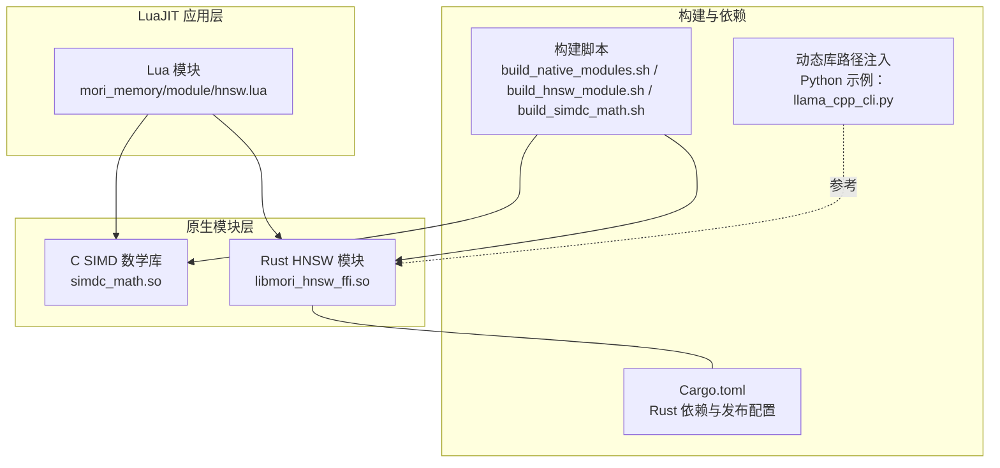
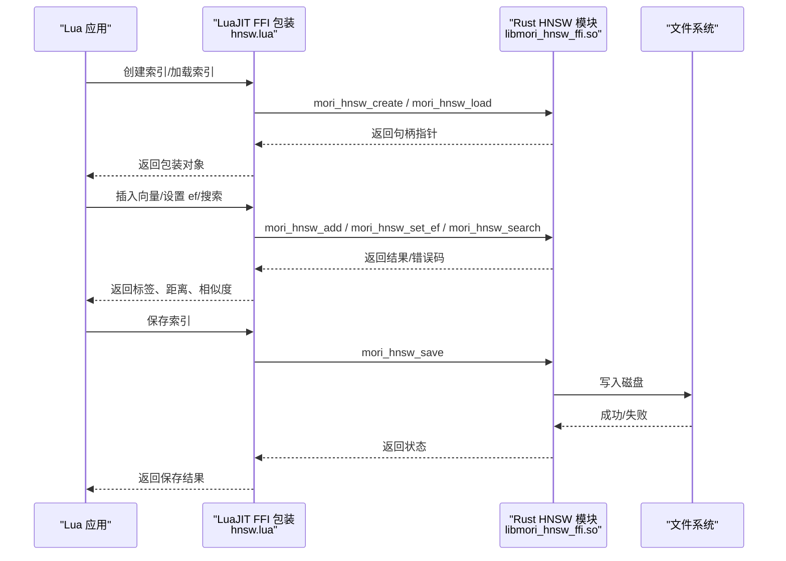
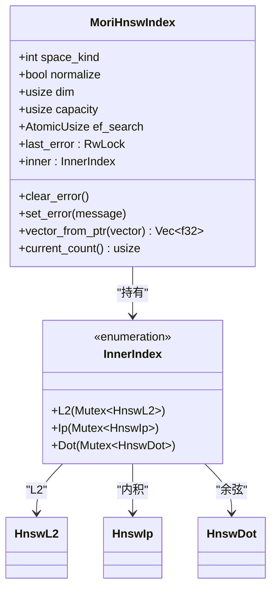
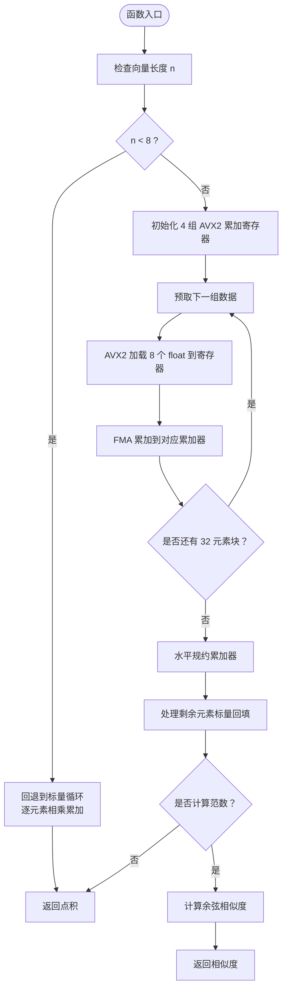
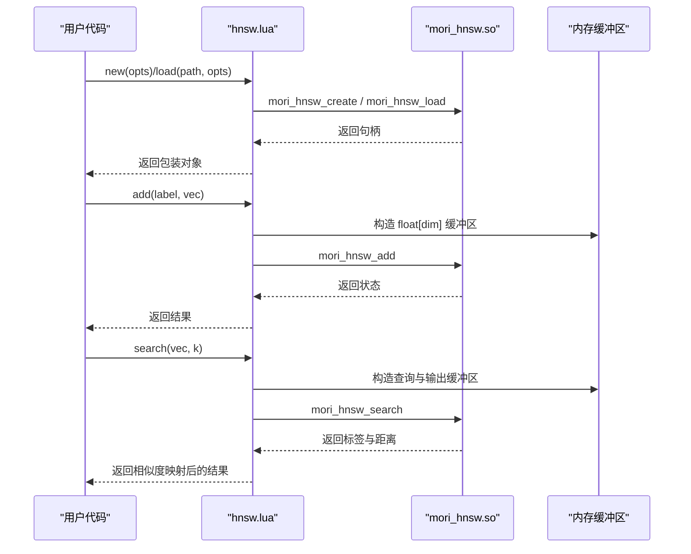
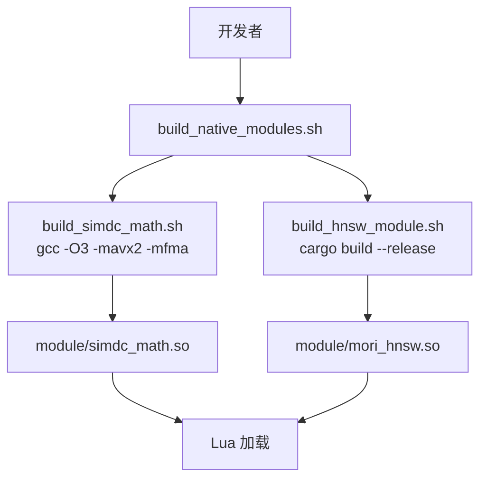
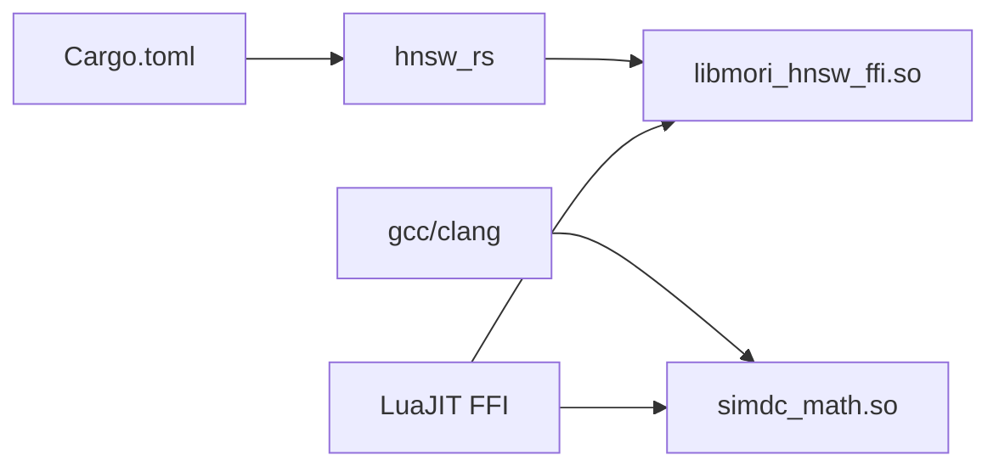

# 原生模块集成

<cite>
**本文引用的文件**
- [mori_memory/native/hnsw/rust/src/lib.rs](file://mori_memory/native/hnsw/rust/src/lib.rs)
- [mori_memory/native/hnsw/rust/Cargo.toml](file://mori_memory/native/hnsw/rust/Cargo.toml)
- [mori_memory/native/simdc_math/simd_math.c](file://mori_memory/native/simdc_math/simd_math.c)
- [mori_memory/module/hnsw.lua](file://mori_memory/module/hnsw.lua)
- [mori_memory/scripts/build_hnsw_module.sh](file://mori_memory/scripts/build_hnsw_module.sh)
- [mori_memory/scripts/build_simdc_math.sh](file://mori_memory/scripts/build_simdc_math.sh)
- [mori_memory/scripts/build_native_modules.sh](file://mori_memory/scripts/build_native_modules.sh)
- [mori_llm/llama_cpp_cli.py](file://mori_llm/llama_cpp_cli.py)
</cite>

## 目录
1. [简介](#简介)
2. [项目结构](#项目结构)
3. [核心组件](#核心组件)
4. [架构总览](#架构总览)
5. [详细组件分析](#详细组件分析)
6. [依赖分析](#依赖分析)
7. [性能考量](#性能考量)
8. [故障排查指南](#故障排查指南)
9. [结论](#结论)
10. [附录](#附录)

## 简介
本文件聚焦于项目中的原生模块集成，围绕以下目标展开：
- 深入解释 HNSW（分层可导航小世界）近似最近邻搜索算法在 Rust 原生模块中的实现与集成。
- 详述 SIMD 数学运算优化的 C 扩展实现，包括向量化计算与性能提升策略。
- 阐明原生模块的接口设计、数据类型转换与错误处理机制。
- 提供构建脚本的使用方法、依赖管理与跨平台兼容性考虑。
- 结合现有基准测试与性能报告，给出优化建议与最佳实践。

## 项目结构
本项目的原生模块主要分布在以下位置：
- HNSW Rust 原生模块：位于 mori_memory/native/hnsw/rust，通过 cdylib 导出 C ABI 接口，供 LuaJIT FFI 加载。
- SIMD 数学运算 C 扩展：位于 mori_memory/native/simdc_math，提供 AVX2/FMA 向量化点积与余弦相似度计算。
- LuaJIT FFI 包装层：位于 mori_memory/module，通过 ffi.cdef 声明 C 接口并封装为 Lua API。
- 构建脚本：位于 mori_memory/scripts，提供一键构建 HNSW 与 SIMD 模块的 Shell 脚本。
- 其他原生/外部集成示例：mori_llm/llama_cpp_cli.py 展示了如何在 Python 中定位与加载外部二进制及其动态库路径。

图表来源
- [mori_memory/module/hnsw.lua:1-310](file://mori_memory/module/hnsw.lua#L1-L310)
- [mori_memory/native/hnsw/rust/Cargo.toml:1-16](file://mori_memory/native/hnsw/rust/Cargo.toml#L1-L16)
- [mori_memory/scripts/build_native_modules.sh:1-9](file://mori_memory/scripts/build_native_modules.sh#L1-L9)
- [mori_llm/llama_cpp_cli.py:16-23](file://mori_llm/llama_cpp_cli.py#L16-L23)

章节来源
- [mori_memory/module/hnsw.lua:1-310](file://mori_memory/module/hnsw.lua#L1-L310)
- [mori_memory/native/hnsw/rust/Cargo.toml:1-16](file://mori_memory/native/hnsw/rust/Cargo.toml#L1-L16)
- [mori_memory/scripts/build_native_modules.sh:1-9](file://mori_memory/scripts/build_native_modules.sh#L1-L9)
- [mori_llm/llama_cpp_cli.py:16-23](file://mori_llm/llama_cpp_cli.py#L16-L23)

## 核心组件
- HNSW Rust 原生模块：提供创建、加载、保存、插入、删除标记、容量调整、设置 ef 搜索参数、KNN 搜索等接口，支持 L2、内积、余弦三种距离空间。
- SIMD 数学运算 C 扩展：提供 AVX2/FMA 向量化点积与余弦相似度计算，针对浮点向量进行高性能数值运算。
- LuaJIT FFI 包装：声明 C ABI 接口，负责动态库加载、错误查询、内存缓冲区构造与结果转换。
- 构建脚本：统一管理 Rust 与 C 模块的编译与产物复制，确保模块可被 Lua 正确加载。

章节来源
- [mori_memory/native/hnsw/rust/src/lib.rs:222-592](file://mori_memory/native/hnsw/rust/src/lib.rs#L222-L592)
- [mori_memory/native/simdc_math/simd_math.c:17-146](file://mori_memory/native/simdc_math/simd_math.c#L17-L146)
- [mori_memory/module/hnsw.lua:3-52](file://mori_memory/module/hnsw.lua#L3-L52)

## 架构总览
下图展示了从 Lua 应用到原生模块的调用链路与数据流：

图表来源
- [mori_memory/module/hnsw.lua:171-217](file://mori_memory/module/hnsw.lua#L171-L217)
- [mori_memory/native/hnsw/rust/src/lib.rs:242-554](file://mori_memory/native/hnsw/rust/src/lib.rs#L242-L554)

章节来源
- [mori_memory/module/hnsw.lua:171-217](file://mori_memory/module/hnsw.lua#L171-L217)
- [mori_memory/native/hnsw/rust/src/lib.rs:242-554](file://mori_memory/native/hnsw/rust/src/lib.rs#L242-L554)

## 详细组件分析

### HNSW Rust 原生模块
该模块基于 hnsw_rs 库实现，导出一组稳定的 C ABI 接口，支持：
- 空间类型：L2、内积、余弦（余弦通过归一化与点积映射实现）。
- 生命周期管理：创建、销毁、保存、加载。
- 插入与搜索：批量插入向量，按 KNN 搜索返回标签与距离。
- 参数控制：设置 ef 搜索参数、查询维度与容量统计。

图表来源
- [mori_memory/native/hnsw/rust/src/lib.rs:17-31](file://mopi_memory/native/hnsw/rust/src/lib.rs#L17-L31)
- [mori_memory/native/hnsw/rust/src/lib.rs:13-21](file://mori_memory/native/hnsw/rust/src/lib.rs#L13-L21)

接口要点与数据类型转换：
- C 接口参数与返回值通过 extern "C" 暴露，内部使用 Mutex+OnceLock 保障并发安全。
- 向量输入通过原始指针与维度构造切片，必要时进行 L2 归一化。
- 错误处理采用线程局部与全局 CString 存储，提供 last_error 查询。
- 搜索参数 ef 与 K 均通过原子/锁保护的共享状态传递。

章节来源
- [mori_memory/native/hnsw/rust/src/lib.rs:222-592](file://mori_memory/native/hnsw/rust/src/lib.rs#L222-L592)

### SIMD 数学运算 C 扩展
该模块提供两类向量化函数：
- 点积：dot_product_avx，利用 AVX2/FMA 对 32 元组进行分块累加，最后回填剩余元素。
- 余弦相似度：cosine_similarity_avx，同时累加点积与范数平方，最终计算归一化相似度。

图表来源
- [mori_memory/native/simdc_math/simd_math.c:17-62](file://mori_memory/native/simdc_math/simd_math.c#L17-L62)
- [mori_memory/native/simdc_math/simd_math.c:64-146](file://mori_memory/native/simdc_math/simd_math.c#L64-L146)

章节来源
- [mori_memory/native/simdc_math/simd_math.c:1-146](file://mori_memory/native/simdc_math/simd_math.c#L1-L146)

### LuaJIT FFI 包装层
该层负责：
- 通过 ffi.cdef 声明 C 接口，定义枚举与函数原型。
- 动态解析模块路径并加载 .so 文件，若失败则返回不可用状态与错误信息。
- 将 Lua 表转换为 C 浮点数组缓冲区，确保维度匹配与类型安全。
- 将 C 返回的距离映射为不同空间下的相似度（L2 取负、余弦取差值、内积通过单调变换）。
- 通过 ffi.gc 管理句柄生命周期，避免泄漏。

图表来源
- [mori_memory/module/hnsw.lua:171-217](file://mori_memory/module/hnsw.lua#L171-L217)
- [mori_memory/module/hnsw.lua:288-307](file://mori_memory/module/hnsw.lua#L288-L307)

章节来源
- [mori_memory/module/hnsw.lua:1-310](file://mori_memory/module/hnsw.lua#L1-L310)

### 构建脚本与依赖管理
- build_native_modules.sh：依次调用 build_simdc_math.sh 与 build_hnsw_module.sh。
- build_simdc_math.sh：使用 gcc 编译 C 源码，启用 -O3、-mavx2、-mfma，生成 simdc_math.so。
- build_hnsw_module.sh：使用 Cargo 在 release 模式构建 cdylib，复制至 module/mori_hnsw.so。
- Cargo.toml：启用 LTO、单代码生成单元与 opt-level=3，依赖 hnsw_rs 并开启 simdeez_f 特性以获得 SIMD 支持。

图表来源
- [mori_memory/scripts/build_native_modules.sh:1-9](file://mori_memory/scripts/build_native_modules.sh#L1-L9)
- [mori_memory/scripts/build_simdc_math.sh:1-15](file://mori_memory/scripts/build_simdc_math.sh#L1-L15)
- [mori_memory/scripts/build_hnsw_module.sh:1-16](file://mori_memory/scripts/build_hnsw_module.sh#L1-L16)
- [mori_memory/native/hnsw/rust/Cargo.toml:9-15](file://mori_memory/native/hnsw/rust/Cargo.toml#L9-L15)

章节来源
- [mori_memory/scripts/build_native_modules.sh:1-9](file://mori_memory/scripts/build_native_modules.sh#L1-L9)
- [mori_memory/scripts/build_simdc_math.sh:1-15](file://mori_memory/scripts/build_simdc_math.sh#L1-L15)
- [mori_memory/scripts/build_hnsw_module.sh:1-16](file://mori_memory/scripts/build_hnsw_module.sh#L1-L16)
- [mori_memory/native/hnsw/rust/Cargo.toml:1-16](file://mori_memory/native/hnsw/rust/Cargo.toml#L1-L16)

### 跨平台与依赖兼容性
- Linux：脚本默认使用 gcc，需确保已安装编译器与 AVX2 支持的 CPU。
- macOS/Windows：需要相应平台的编译器与链接器，同时注意动态库后缀与路径注入方式。
- 动态库路径：参考 mori_llm/llama_cpp_cli.py 中的 LD_LIBRARY_PATH 注入模式，确保运行时能找到依赖的 .so/.dylib/.dll。
- SIMD 指令集：AVX2/FMA 需硬件支持，否则可能触发指令非法；可通过条件编译或运行时检测降级。

章节来源
- [mori_llm/llama_cpp_cli.py:16-23](file://mori_llm/llama_cpp_cli.py#L16-L23)
- [mori_memory/native/simdc_math/simd_math.c:1-5](file://mori_memory/native/simdc_math/simd_math.c#L1-L5)

## 依赖分析
- Rust 模块依赖 hnsw_rs，启用 simdeez_f 特性以获得向量化距离计算支持。
- C 模块依赖 immintrin.h（AVX2/FMA）、math.h、stdint.h。
- LuaJIT 依赖 ffi 扩展加载 .so 并绑定 C 接口。
- 构建脚本依赖 Cargo 与 gcc，目标产物放置于 module/ 目录以便 Lua 加载。

图表来源
- [mori_memory/native/hnsw/rust/Cargo.toml:14-15](file://mori_memory/native/hnsw/rust/Cargo.toml#L14-L15)
- [mori_memory/native/simdc_math/simd_math.c:1-4](file://mori_memory/native/simdc_math/simd_math.c#L1-L4)
- [mori_memory/module/hnsw.lua:105-106](file://mori_memory/module/hnsw.lua#L105-L106)

章节来源
- [mori_memory/native/hnsw/rust/Cargo.toml:14-15](file://mori_memory/native/hnsw/rust/Cargo.toml#L14-L15)
- [mori_memory/native/simdc_math/simd_math.c:1-4](file://mori_memory/native/simdc_math/simd_math.c#L1-L4)
- [mori_memory/module/hnsw.lua:105-106](file://mori_memory/module/hnsw.lua#L105-L106)

## 性能考量
- Rust 发布配置：启用 LTO、单代码生成单元与 opt-level=3，减少二进制体积与提升执行效率。
- SIMD 向量化：C 扩展使用 AVX2/FMA 对 32 元素块进行并行累加，显著降低标量循环开销；对小于 8 元素的短向量回退到标量路径，兼顾通用性。
- 搜索参数 ef：Lua 层默认设置 ef_search，实际搜索时 ef 与 K 取较大者，平衡召回与速度。
- 内存布局与缓存：C 扩展在循环中使用 _mm_prefetch 提示预取，减少缓存未命中。
- 动态库路径：运行时确保 LD_LIBRARY_PATH（Linux）或等效机制正确指向模块所在目录，避免重复加载与符号冲突。

章节来源
- [mori_memory/native/hnsw/rust/Cargo.toml:9-15](file://mori_memory/native/hnsw/rust/Cargo.toml#L9-L15)
- [mori_memory/native/simdc_math/simd_math.c:35-38](file://mori_memory/native/simdc_math/simd_math.c#L35-L38)
- [mori_memory/native/hnsw/rust/src/lib.rs:481-494](file://mori_memory/native/hnsw/rust/src/lib.rs#L481-L494)
- [mori_llm/llama_cpp_cli.py:16-23](file://mori_llm/llama_cpp_cli.py#L16-L23)

## 故障排查指南
常见问题与解决思路：
- 模块无法加载
  - 症状：Lua 报告模块不可用或加载错误。
  - 排查：确认 module/mori_hnsw.so 与 module/simdc_math.so 是否存在；检查动态库路径是否包含模块目录；Linux 下可通过 LD_DEBUG=libs 或 ldd 查看依赖。
- 搜索结果异常
  - 症状：返回空结果或相似度异常。
  - 排查：核对查询向量维度与索引维度一致；检查 normalize 设置与空间类型；查看 last_error 输出。
- 插入失败
  - 症状：mori_hnsw_add 返回失败。
  - 排查：确认向量非空且维度匹配；检查索引是否处于搜索模式；查看全局/句柄错误信息。
- 性能不达预期
  - 症状：CPU 占用高但吞吐低。
  - 排查：确认 ef 设置合理；检查是否启用了 AVX2/FMA；确认数据对齐与缓存友好；避免频繁创建/销毁索引。

章节来源
- [mori_memory/module/hnsw.lua:82-103](file://mori_memory/module/hnsw.lua#L82-L103)
- [mori_memory/native/hnsw/rust/src/lib.rs:222-240](file://mori_memory/native/hnsw/rust/src/lib.rs#L222-L240)
- [mori_memory/native/hnsw/rust/src/lib.rs:427-463](file://mori_memory/native/hnsw/rust/src/lib.rs#L427-L463)

## 结论
本项目通过 Rust 与 C 的原生模块，结合 LuaJIT FFI，实现了高性能的 HNSW 近似最近邻搜索与 SIMD 向量化数学运算。构建脚本统一管理编译流程，错误处理与数据类型转换在 FFI 层完成，具备良好的可维护性与跨平台扩展性。建议在生产环境中：
- 固定并验证 SIMD 指令集支持，必要时提供降级路径。
- 严格管理动态库路径与版本，避免运行时冲突。
- 根据业务规模调整 ef 与 m 参数，权衡召回与性能。
- 对关键路径进行持续基准测试与回归监控。

## 附录
- 构建与运行
  - 使用 build_native_modules.sh 一键构建所有原生模块。
  - 确保模块目录可被 Lua 搜索路径访问。
- 参考集成模式
  - 参考 mori_llm/llama_cpp_cli.py 的动态库路径注入方式，适配不同平台。

章节来源
- [mori_memory/scripts/build_native_modules.sh:1-9](file://mori_memory/scripts/build_native_modules.sh#L1-L9)
- [mori_llm/llama_cpp_cli.py:16-23](file://mori_llm/llama_cpp_cli.py#L16-L23)