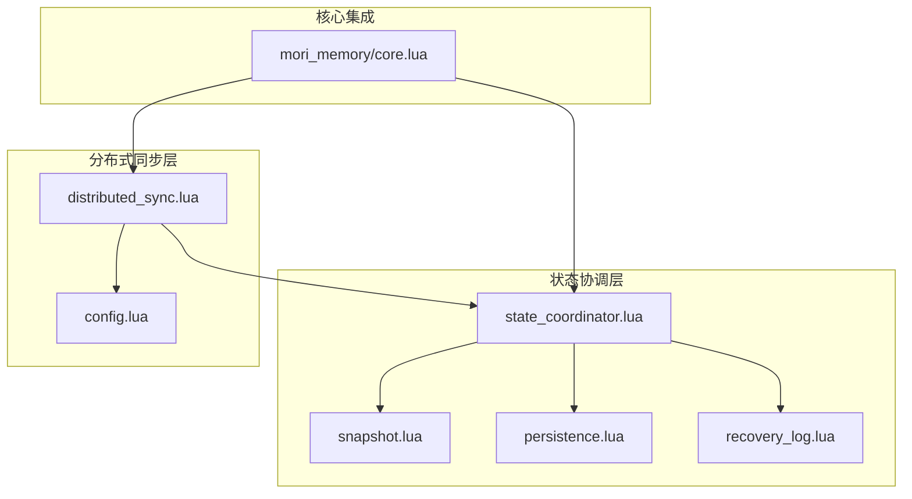
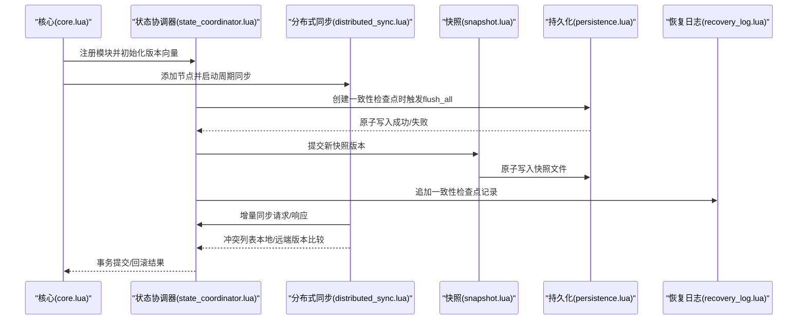
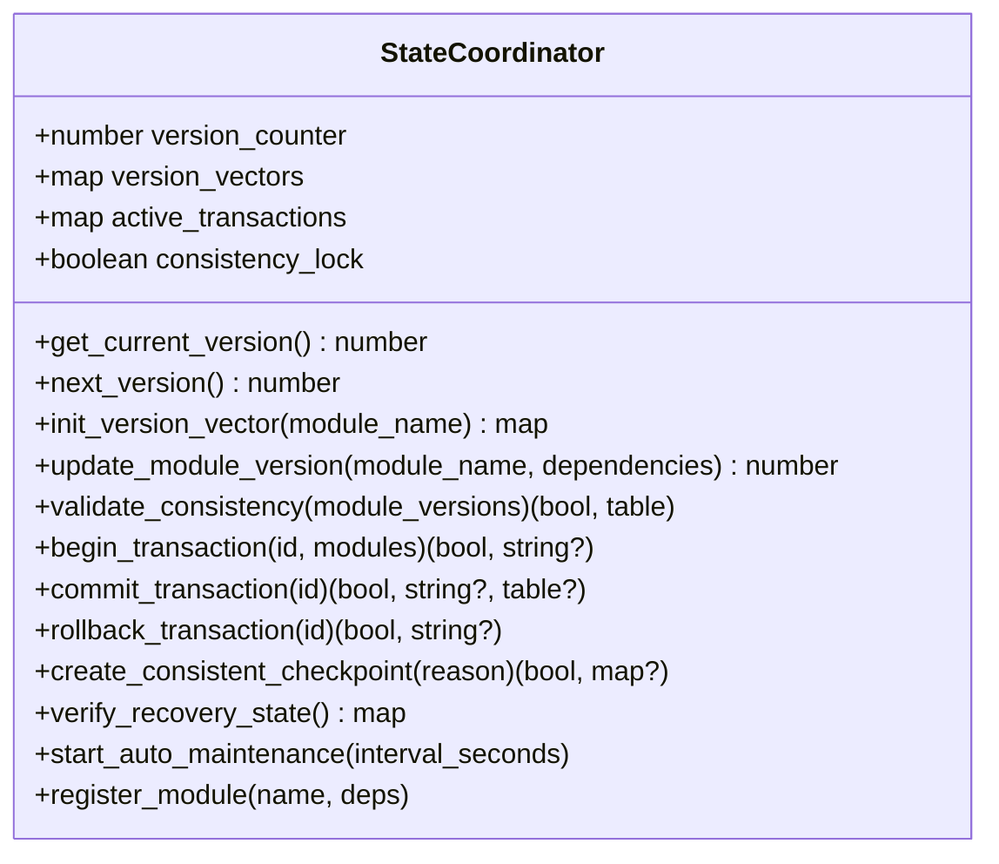
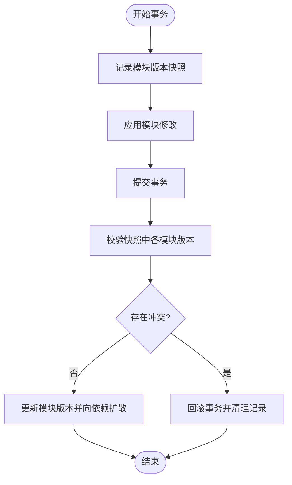
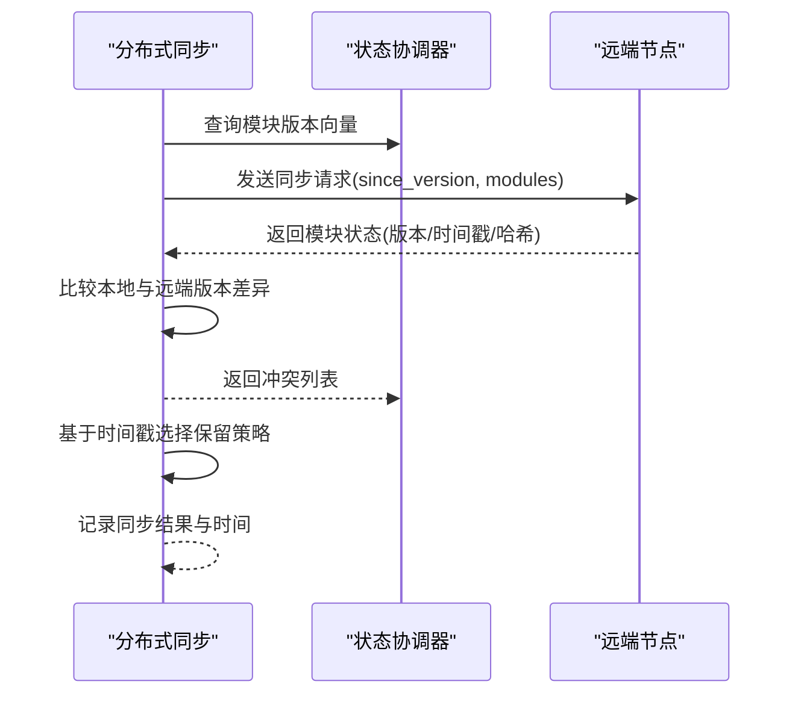
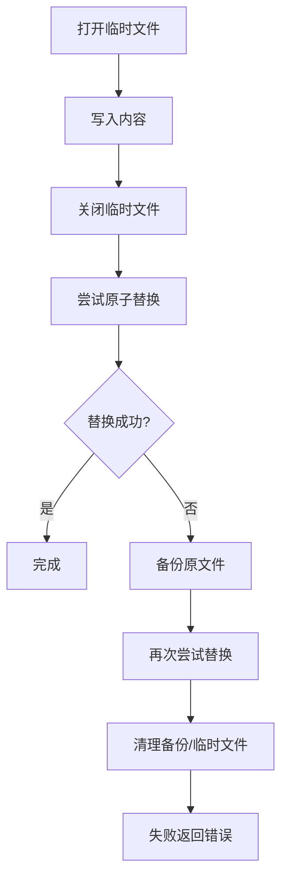
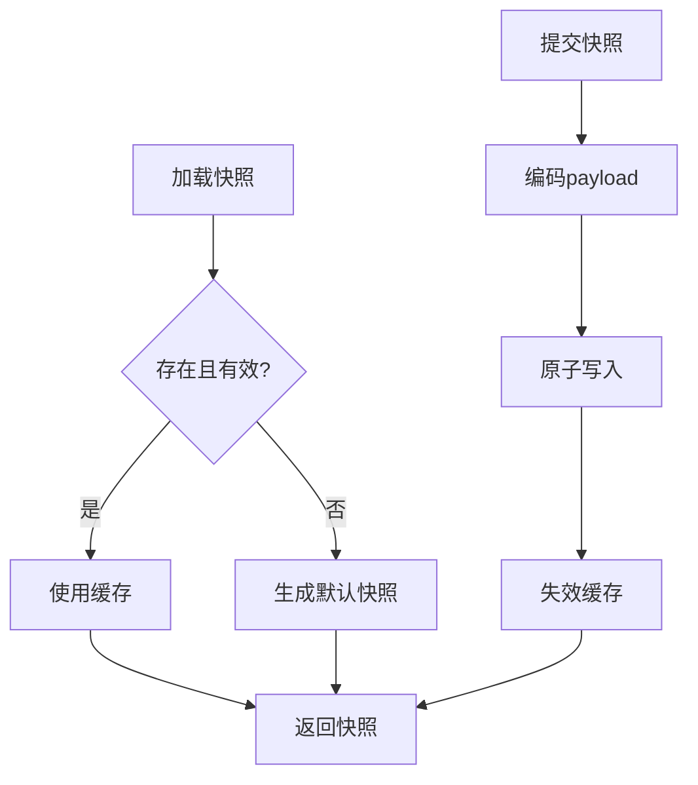
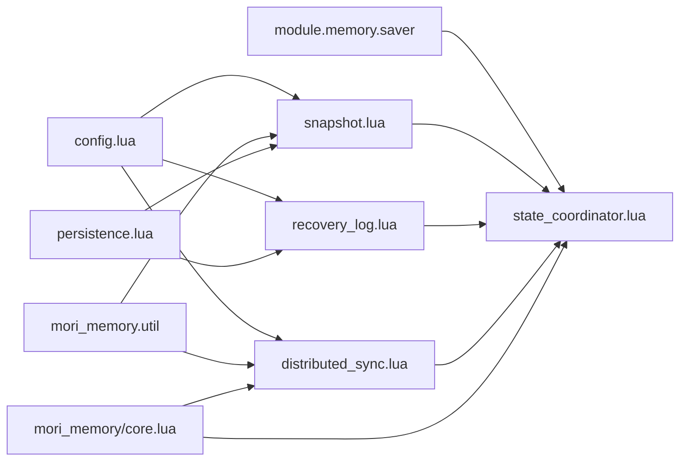
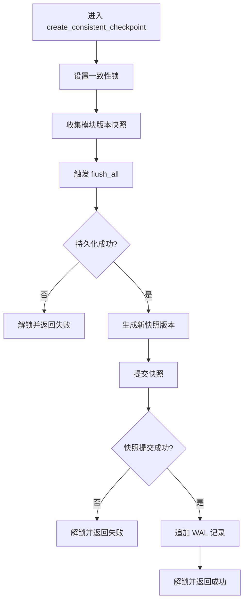
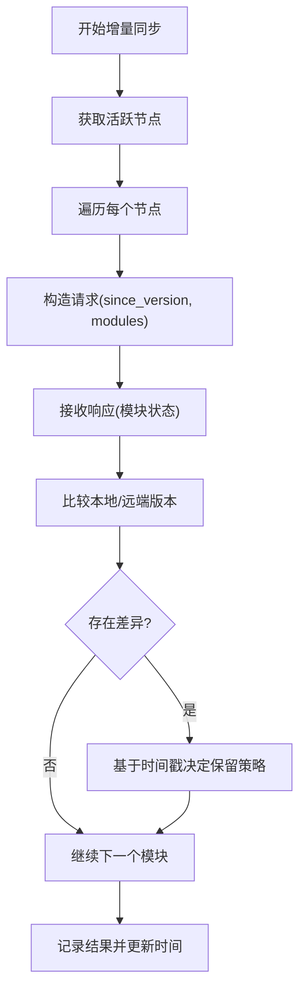

# 状态协调器

<cite>
**本文引用的文件**
- [state_coordinator.lua](file://mori_memory/module/state_coordinator.lua)
- [distributed_sync.lua](file://mori_memory/module/distributed_sync.lua)
- [persistence.lua](file://mori_memory/module/persistence.lua)
- [snapshot.lua](file://mori_memory/module/snapshot.lua)
- [recovery_log.lua](file://mori_memory/module/memory/recovery_log.lua)
- [config.lua](file://mori_memory/module/config.lua)
- [core.lua](file://mori_memory/mori_memory/core.lua)
</cite>

## 目录
1. [简介](#简介)
2. [项目结构](#项目结构)
3. [核心组件](#核心组件)
4. [架构总览](#架构总览)
5. [详细组件分析](#详细组件分析)
6. [依赖关系分析](#依赖关系分析)
7. [性能考量](#性能考量)
8. [故障排查指南](#故障排查指南)
9. [结论](#结论)
10. [附录](#附录)

## 简介
本文件系统性阐述“状态协调器（State Coordinator）”的设计与实现，涵盖模块注册、状态同步与一致性保障、分布式同步（含节点发现、状态传播与冲突解决）、持久化（原子写入与恢复日志）、快照（版本管理与增量备份）等关键能力，并提供配置参数、监控指标与故障恢复建议，帮助读者在复杂多模块场景下构建稳定可靠的状态一致性体系。

## 项目结构
状态协调器位于记忆模块的 Lua 实现中，围绕以下文件协同工作：
- 状态协调器：负责版本向量、事务、检查点与一致性验证
- 分布式同步：负责节点管理、心跳、状态广播与增量同步
- 快照与持久化：负责快照版本管理与原子写入
- 恢复日志（WAL）：记录线程运行态变更，支撑恢复与顺序校验
- 配置中心：集中管理路径、策略与分布式参数
- 核心集成：在内存核心初始化阶段完成模块注册与同步启动

**图表来源**
- [state_coordinator.lua:1-302](file://mori_memory/module/state_coordinator.lua#L1-L302)
- [distributed_sync.lua:1-287](file://mori_memory/module/distributed_sync.lua#L1-L287)
- [snapshot.lua:1-112](file://mori_memory/module/snapshot.lua#L1-L112)
- [persistence.lua:1-97](file://mori_memory/module/persistence.lua#L1-L97)
- [recovery_log.lua:1-121](file://mori_memory/module/memory/recovery_log.lua#L1-L121)
- [config.lua:1-680](file://mori_memory/module/config.lua#L1-L680)
- [core.lua:313-327](file://mori_memory/mori_memory/core.lua#L313-L327)

**章节来源**
- [core.lua:313-327](file://mori_memory/mori_memory/core.lua#L313-L327)

## 核心组件
- 状态协调器（SC）：维护模块版本向量、事务生命周期、一致性检查点与自动维护
- 分布式同步（DS）：节点管理、心跳、状态广播、增量同步与冲突解决
- 快照（SNAP）：版本化持久化，支持生成、加载与提交
- 持久化（PERS）：原子写入与回滚，保障数据一致性
- 恢复日志（WLR）：线程运行态变更的顺序日志，支持追加与重置
- 配置中心（CFG）：统一读取与解析路径、分布式参数与策略

**章节来源**
- [state_coordinator.lua:9-302](file://mori_memory/module/state_coordinator.lua#L9-L302)
- [distributed_sync.lua:8-287](file://mori_memory/module/distributed_sync.lua#L8-L287)
- [snapshot.lua:1-112](file://mori_memory/module/snapshot.lua#L1-L112)
- [persistence.lua:1-97](file://mori_memory/module/persistence.lua#L1-L97)
- [recovery_log.lua:1-121](file://mori_memory/module/memory/recovery_log.lua#L1-L121)
- [config.lua:1-680](file://mori_memory/module/config.lua#L1-L680)

## 架构总览
状态协调器通过版本向量与事务模型实现跨模块一致性；分布式同步在节点间进行增量同步并采用基于时间戳的冲突解决策略；持久化与快照共同保障状态的可恢复性；恢复日志记录运行态变更，辅助一致性校验与恢复。

**图表来源**
- [core.lua:313-327](file://mori_memory/mori_memory/core.lua#L313-L327)
- [state_coordinator.lua:145-207](file://mori_memory/module/state_coordinator.lua#L145-L207)
- [state_coordinator.lua:101-131](file://mori_memory/module/state_coordinator.lua#L101-L131)
- [distributed_sync.lua:78-169](file://mori_memory/module/distributed_sync.lua#L78-L169)
- [snapshot.lua:88-109](file://mori_memory/module/snapshot.lua#L88-L109)
- [persistence.lua:58-94](file://mori_memory/module/persistence.lua#L58-L94)
- [recovery_log.lua:84-110](file://mori_memory/module/memory/recovery_log.lua#L84-L110)

## 详细组件分析

### 状态协调器（State Coordinator）
职责与能力：
- 版本向量管理：为每个模块维护版本号、时间戳与依赖集合
- 事务模型：开启/提交/回滚事务，记录版本快照，提交时更新模块版本并向依赖扩散
- 一致性检查点：在持久化与快照提交成功后生成检查点，并记录恢复日志
- 自动维护：周期性验证状态一致性并在不一致时自动创建检查点

**图表来源**
- [state_coordinator.lua:9-302](file://mori_memory/module/state_coordinator.lua#L9-L302)

关键流程图：事务提交与冲突检测

**图表来源**
- [state_coordinator.lua:75-131](file://mori_memory/module/state_coordinator.lua#L75-L131)

**章节来源**
- [state_coordinator.lua:19-302](file://mori_memory/module/state_coordinator.lua#L19-L302)

### 分布式同步（Distributed Sync）
职责与能力：
- 节点管理：添加/移除节点、统计活跃节点、心跳维护
- 状态广播：将模块状态变化广播给注册的回调
- 增量同步：按模块集合与起始版本请求/响应，计算本地与远端版本差异
- 冲突解决：基于时间戳选择保留本地或远端版本
- 优雅降级：检测网络分区，切换本地优先模式并调整同步间隔

**图表来源**
- [distributed_sync.lua:78-169](file://mori_memory/module/distributed_sync.lua#L78-L169)
- [distributed_sync.lua:172-197](file://mori_memory/module/distributed_sync.lua#L172-L197)

**章节来源**
- [distributed_sync.lua:8-287](file://mori_memory/module/distributed_sync.lua#L8-L287)

### 持久化（Persistence）
职责与能力：
- 原子替换：先尝试直接重命名，失败则备份原文件再替换，必要时回滚
- 原子写入封装：写入临时文件后原子替换为目标文件，失败则清理临时文件

**图表来源**
- [persistence.lua:28-94](file://mori_memory/module/persistence.lua#L28-L94)

**章节来源**
- [persistence.lua:1-97](file://mori_memory/module/persistence.lua#L1-L97)

### 快照（Snapshot）
职责与能力：
- 加载/生成默认快照：缺失时返回默认结构
- 提交快照：写入生成号、时间戳与模块版本映射
- 版本递增：基于当前快照生成下一版本
- 路径解析：根据配置解析快照文件路径

**图表来源**
- [snapshot.lua:42-109](file://mori_memory/module/snapshot.lua#L42-L109)

**章节来源**
- [snapshot.lua:1-112](file://mori_memory/module/snapshot.lua#L1-L112)

### 恢复日志（WAL）
职责与能力：
- 追加记录：序列号自增，按行写入 Lua 表文本
- 加载记录：从指定序号之后加载并排序
- 重置：清空日志文件并重置下一个序号

**章节来源**
- [recovery_log.lua:1-121](file://mori_memory/module/memory/recovery_log.lua#L1-L121)

### 配置参数与路径
- 存储路径：快照路径、运行时根目录等
- 分布式参数：同步间隔、节点超时、节点 ID
- 策略与版本控制：状态版本标识、兼容性策略等

**章节来源**
- [config.lua:11-15](file://mori_memory/module/config.lua#L11-L15)
- [config.lua:265-278](file://mori_memory/module/config.lua#L265-L278)
- [snapshot.lua:21-24](file://mori_memory/module/snapshot.lua#L21-L24)
- [recovery_log.lua:17-24](file://mori_memory/module/memory/recovery_log.lua#L17-L24)

## 依赖关系分析
- 状态协调器依赖：配置中心（获取节点 ID、分布式开关）、工具库（哈希）、内存保存器（flush_all）、快照（提交）、恢复日志（追加）
- 分布式同步依赖：配置中心（节点参数）、状态协调器（版本向量）、工具库（键集合）
- 快照依赖：持久化（原子写入）、配置中心（路径解析）
- 恢复日志依赖：持久化（原子写入）、配置中心（路径解析）

**图表来源**
- [state_coordinator.lua:3-7](file://mori_memory/module/state_coordinator.lua#L3-L7)
- [distributed_sync.lua:3-6](file://mori_memory/module/distributed_sync.lua#L3-L6)
- [snapshot.lua:1-3](file://mori_memory/module/snapshot.lua#L1-L3)
- [recovery_log.lua:1-3](file://mori_memory/module/memory/recovery_log.lua#L1-L3)
- [core.lua:313-327](file://mori_memory/mori_memory/core.lua#L313-L327)

**章节来源**
- [state_coordinator.lua:3-7](file://mori_memory/module/state_coordinator.lua#L3-L7)
- [distributed_sync.lua:3-6](file://mori_memory/module/distributed_sync.lua#L3-L6)
- [snapshot.lua:1-3](file://mori_memory/module/snapshot.lua#L1-L3)
- [recovery_log.lua:1-3](file://mori_memory/module/memory/recovery_log.lua#L1-L3)
- [core.lua:313-327](file://mori_memory/mori_memory/core.lua#L313-L327)

## 性能考量
- 增量同步：仅对自上次同步以来有变化的模块进行同步，降低带宽与 CPU 开销
- 原子写入：避免部分写入导致的数据损坏，减少后续校验成本
- 快照版本：通过版本号与时间戳快速定位差异，提升恢复效率
- 自动维护：周期性检查与自动创建检查点，降低人工干预与风险
- 优雅降级：在网络分区时切换本地优先模式，维持可用性

[本节为通用性能讨论，无需列出具体文件来源]

## 故障排查指南
- 一致性检查点失败
  - 检查持久化写入是否成功（原子替换/回滚）
  - 校验快照提交是否成功
  - 查看恢复日志追加是否异常
- 事务冲突
  - 检查事务开始时的版本快照是否与提交时一致
  - 确认模块版本更新是否正确传播
- 分布式同步异常
  - 核对节点心跳与活跃节点统计
  - 检查同步请求/响应中的版本差异与哈希
  - 观察冲突解决策略是否按预期执行
- 恢复日志问题
  - 确认日志文件路径与权限
  - 排查记录排序与序列号连续性
- 配置问题
  - 校验存储路径解析与分布式参数
  - 确认节点 ID 与同步间隔设置

**章节来源**
- [state_coordinator.lua:145-207](file://mori_memory/module/state_coordinator.lua#L145-L207)
- [state_coordinator.lua:101-131](file://mori_memory/module/state_coordinator.lua#L101-L131)
- [distributed_sync.lua:241-285](file://mori_memory/module/distributed_sync.lua#L241-L285)
- [recovery_log.lua:47-82](file://mori_memory/module/memory/recovery_log.lua#L47-L82)
- [snapshot.lua:88-109](file://mori_memory/module/snapshot.lua#L88-L109)
- [persistence.lua:28-94](file://mori_memory/module/persistence.lua#L28-L94)

## 结论
状态协调器通过版本向量与事务模型实现了跨模块一致性，结合分布式同步与快照/WAL机制，提供了高可用、可恢复的状态管理体系。其设计兼顾性能与可靠性，适合在多模块、多节点的复杂场景中部署与演进。

[本节为总结性内容，无需列出具体文件来源]

## 附录

### 关键流程：创建一致性检查点

**图表来源**
- [state_coordinator.lua:145-207](file://mori_memory/module/state_coordinator.lua#L145-L207)
- [snapshot.lua:88-109](file://mori_memory/module/snapshot.lua#L88-L109)
- [recovery_log.lua:84-110](file://mori_memory/module/memory/recovery_log.lua#L84-L110)

### 关键流程：分布式增量同步与冲突解决

**图表来源**
- [distributed_sync.lua:145-169](file://mori_memory/module/distributed_sync.lua#L145-L169)
- [distributed_sync.lua:172-197](file://mori_memory/module/distributed_sync.lua#L172-L197)