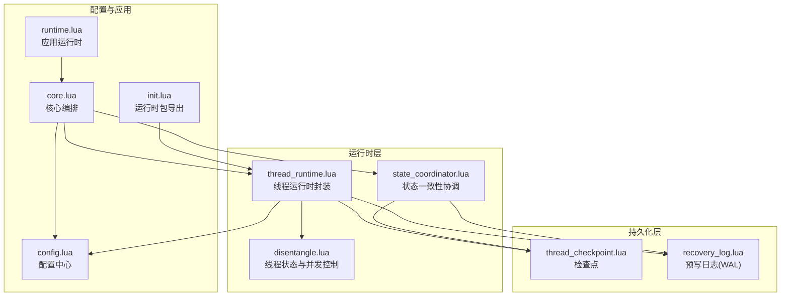
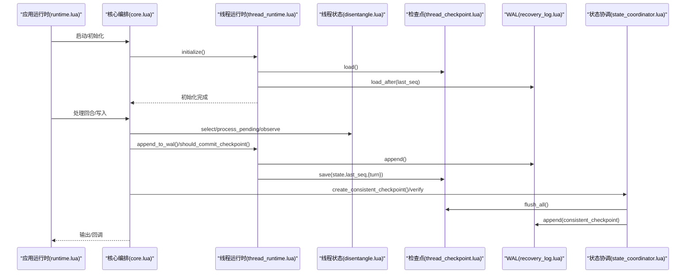
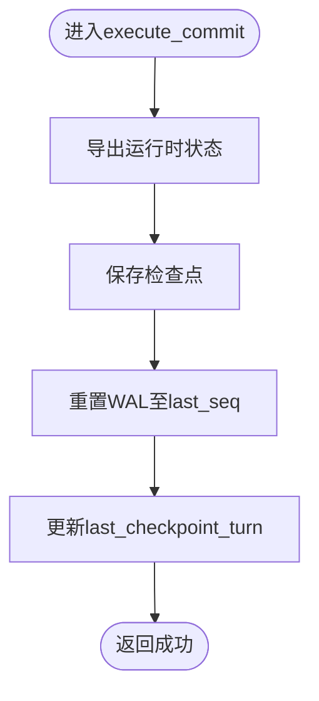
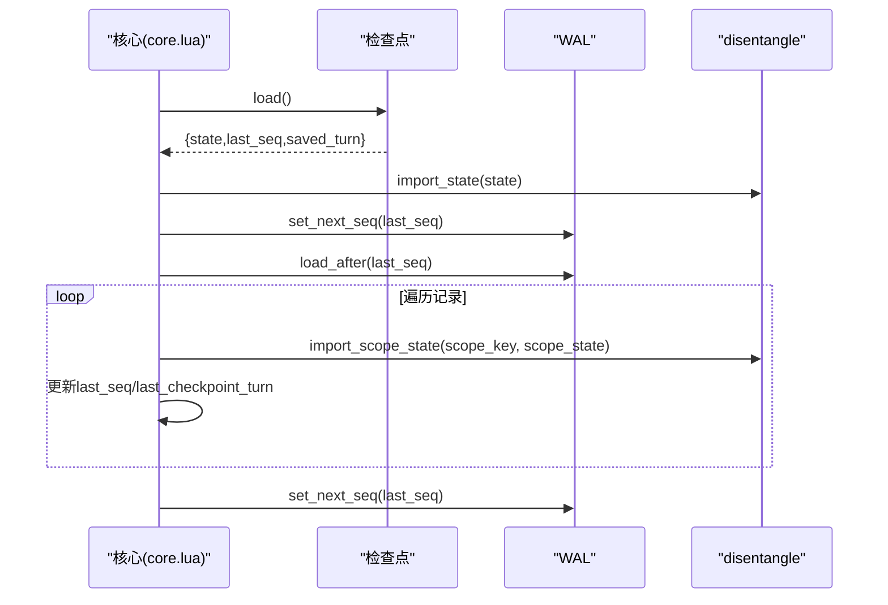
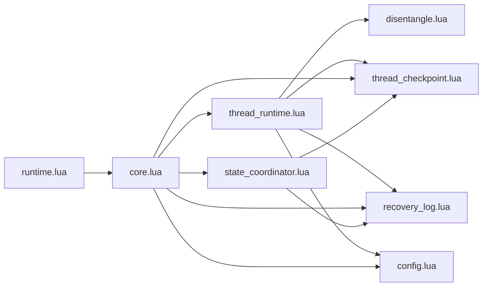

# 线程运行时

<cite>
**本文引用的文件**
- [thread_runtime.lua](file://mori_memory/module/runtime/thread_runtime.lua)
- [core.lua](file://mori_memory/mori_memory/core.lua)
- [thread_checkpoint.lua](file://mori_memory/module/memory/thread_checkpoint.lua)
- [recovery_log.lua](file://mori_memory/module/memory/recovery_log.lua)
- [disentangle.lua](file://mori_memory/module/memory/disentangle.lua)
- [state_coordinator.lua](file://mori_memory/module/state_coordinator.lua)
- [config.lua](file://mori_memory/module/config.lua)
- [runtime.lua](file://mori_runtime/lua/mori/app/runtime.lua)
- [init.lua](file://mori_memory/module/runtime/init.lua)
</cite>

## 目录
1. [简介](#简介)
2. [项目结构](#项目结构)
3. [核心组件](#核心组件)
4. [架构总览](#架构总览)
5. [详细组件分析](#详细组件分析)
6. [依赖关系分析](#依赖关系分析)
7. [性能考量](#性能考量)
8. [故障排除指南](#故障排除指南)
9. [结论](#结论)
10. [附录](#附录)

## 简介
本文件系统化阐述线程运行时（Thread Runtime）的设计与实现，覆盖多线程环境下的状态管理、并发控制、初始化流程、状态同步机制、错误处理策略、检查点（Checkpoint）机制（含状态保存、恢复与垃圾回收触发）、运行时配置参数、性能监控指标以及故障排除与扩展开发方法。目标是帮助开发者在复杂多源、高并发的实时交互场景中，正确理解并安全使用线程运行时。

## 项目结构
线程运行时位于记忆模块的运行时子系统中，围绕“线程”这一核心概念组织状态、路由、提交与持久化。其关键文件与职责如下：
- 运行时入口与封装：mori_memory/module/runtime/thread_runtime.lua
- 核心编排与生命周期：mori_memory/mori_memory/core.lua
- 检查点与预写日志：mori_memory/module/memory/thread_checkpoint.lua、mori_memory/module/memory/recovery_log.lua
- 线程状态与并发控制：mori_memory/module/memory/disentangle.lua
- 状态一致性协调：mori_memory/module/state_coordinator.lua
- 配置中心：mori_memory/module/config.lua
- 应用运行时（上层调度）：mori_runtime/lua/mori/app/runtime.lua
- 运行时包导出：mori_memory/module/runtime/init.lua

图表来源
- [thread_runtime.lua:1-260](file://mori_memory/module/runtime/thread_runtime.lua#L1-L260)
- [core.lua:1-327](file://mori_memory/mori_memory/core.lua#L1-L327)
- [thread_checkpoint.lua:1-76](file://mori_memory/module/memory/thread_checkpoint.lua#L1-L76)
- [recovery_log.lua:1-121](file://mori_memory/module/memory/recovery_log.lua#L1-L121)
- [disentangle.lua:1-800](file://mori_memory/module/memory/disentangle.lua#L1-L800)
- [state_coordinator.lua:1-302](file://mori_memory/module/state_coordinator.lua#L1-L302)
- [config.lua:1-680](file://mori_memory/module/config.lua#L1-L680)
- [runtime.lua:1-668](file://mori_runtime/lua/mori/app/runtime.lua#L1-L668)
- [init.lua:1-10](file://mori_memory/module/runtime/init.lua#L1-L10)

章节来源
- [thread_runtime.lua:1-260](file://mori_memory/module/runtime/thread_runtime.lua#L1-L260)
- [core.lua:1-327](file://mori_memory/mori_memory/core.lua#L1-L327)
- [init.lua:1-10](file://mori_memory/module/runtime/init.lua#L1-L10)

## 核心组件
- 线程运行时封装（thread_runtime.lua）
  - 负责路由边界管理、pending状态统一管理、orphan检测与处理、ambient上下文维护、提交时机控制、线程上下文组装、WAL追加、状态查询与初始化/关闭。
- 线程状态与并发控制（disentangle.lua）
  - 维护多作用域（scope）下线程集合，提供事件容量限制、TTL清理、内存压力触发GC、控制器状态与象限策略等。
- 检查点与恢复（thread_checkpoint.lua、recovery_log.lua）
  - 检查点保存运行时全局状态与序列信息；WAL记录scope状态变更，支持断点恢复与重放。
- 状态一致性协调（state_coordinator.lua）
  - 版本向量、事务开始/提交/回滚、一致性检查点、恢复验证与自动维护。
- 配置中心（config.lua）
  - 提供disentangle运行时参数（如检查点间隔、内存上限、TTL、GC策略等）与路径解析。
- 应用运行时（runtime.lua）
  - 上层调度器，驱动对话回合、上下文合成、LLM流式输出、TTS分段与结果回传，并调用记忆模块进行写入与检查点。

章节来源
- [thread_runtime.lua:221-243](file://mori_memory/module/runtime/thread_runtime.lua#L221-L243)
- [disentangle.lua:109-269](file://mori_memory/module/memory/disentangle.lua#L109-L269)
- [thread_checkpoint.lua:26-73](file://mori_memory/module/memory/thread_checkpoint.lua#L26-L73)
- [recovery_log.lua:42-118](file://mori_memory/module/memory/recovery_log.lua#L42-L118)
- [state_coordinator.lua:15-207](file://mori_memory/module/state_coordinator.lua#L15-L207)
- [config.lua:492-496](file://mori_memory/module/config.lua#L492-L496)
- [runtime.lua:543-665](file://mori_runtime/lua/mori/app/runtime.lua#L543-L665)

## 架构总览
线程运行时在“核心编排”之上，通过“运行时封装”协调“线程状态与并发控制”，并通过“检查点/恢复日志”保障持久化与可恢复性；“状态一致性协调”确保多模块状态一致；“配置中心”提供参数化控制；“应用运行时”负责端到端调度。

图表来源
- [runtime.lua:543-665](file://mori_runtime/lua/mori/app/runtime.lua#L543-L665)
- [core.lua:299-327](file://mori_memory/mori_memory/core.lua#L299-L327)
- [thread_runtime.lua:221-243](file://mori_memory/module/runtime/thread_runtime.lua#L221-L243)
- [thread_checkpoint.lua:26-73](file://mori_memory/module/memory/thread_checkpoint.lua#L26-L73)
- [recovery_log.lua:84-118](file://mori_memory/module/memory/recovery_log.lua#L84-L118)
- [state_coordinator.lua:145-207](file://mori_memory/module/state_coordinator.lua#L145-L207)

## 详细组件分析

### 线程运行时封装（thread_runtime.lua）
- 职责划分
  - 路由边界管理：委托给disentangle.select并记录活动作用域时间戳。
  - pending状态管理：统一委托给disentangle.process_pending_operations。
  - orphan检测与处理：detect_orphans → handle_orphans。
  - ambient上下文维护：update_ambient_context。
  - 提交时机控制：基于配置的检查点间隔turn判定。
  - 状态导出与保存：export_state → thread_checkpoint.save。
  - WAL管理：export_scope_state → recovery_log.append。
  - 线程上下文组装：get_thread_context。
  - 状态查询：get_runtime_status/get_scope_status。
  - 初始化：加载检查点、重放WAL、设置next_seq、记录启动时间。
  - 关闭：强制执行一次提交并清理运行时状态。
- 并发与错误处理
  - 所有对外调用均包裹pcall，失败返回错误字符串，避免崩溃传播。
  - 通过状态字段（active_scopes、last_seq、last_checkpoint_turn）记录运行时元数据。
- 关键流程图（提交检查点）

图表来源
- [thread_runtime.lua:125-152](file://mori_memory/module/runtime/thread_runtime.lua#L125-L152)
- [thread_runtime.lua:174-201](file://mori_memory/module/runtime/thread_runtime.lua#L174-L201)

章节来源
- [thread_runtime.lua:24-108](file://mori_memory/module/runtime/thread_runtime.lua#L24-L108)
- [thread_runtime.lua:111-152](file://mori_memory/module/runtime/thread_runtime.lua#L111-L152)
- [thread_runtime.lua:174-201](file://mori_memory/module/runtime/thread_runtime.lua#L174-L201)
- [thread_runtime.lua:204-218](file://mori_memory/module/runtime/thread_runtime.lua#L204-L218)
- [thread_runtime.lua:221-243](file://mori_memory/module/runtime/thread_runtime.lua#L221-L243)
- [thread_runtime.lua:246-258](file://mori_memory/module/runtime/thread_runtime.lua#L246-L258)

### 线程状态与并发控制（disentangle.lua）
- 状态模型
  - 作用域（scope）→ 流（stream）→ 线程（thread）→ pending队列。
  - 控制器状态（axes、diagnostics、surface）与象限策略系统。
- 并发与容量控制
  - per_thread_event_cap：每线程pending上限裁剪。
  - 全局limits：通过trigger_gc_if_needed触发GC。
- TTL与清理
  - pending_max_age_ms：过期pending清理。
  - thread_max_idle_ms：空闲线程孤儿化。
  - 定期清理周期：cleanup_check_interval_ms。
- 内存压力与GC
  - memory_usage_warning_mb / memory_usage_critical_mb阈值分级。
  - min_gc_interval_s最小间隔与pressure_threshold概率触发。
- 错误处理
  - 大多数操作通过pcall包装，异常转为日志打印，不中断整体流程。

章节来源
- [disentangle.lua:109-191](file://mori_memory/module/memory/disentangle.lua#L109-L191)
- [disentangle.lua:194-269](file://mori_memory/module/memory/disentangle.lua#L194-L269)
- [disentangle.lua:142-166](file://mori_memory/module/memory/disentangle.lua#L142-L166)

### 检查点与恢复（thread_checkpoint.lua、recovery_log.lua）
- 检查点（thread_checkpoint.lua）
  - 保存运行时状态、last_seq、saved_turn、saved_at。
  - 原子写入：ensure_dir + encode_lua_value + write_atomic。
- 预写日志（recovery_log.lua）
  - 记录scope_state变更，包含seq、turn、kind、scope_key、reason、scope_state。
  - load_after按序加载并排序，set_next_seq维护递增序号。
  - append原子追加，reset原子清空。
- 恢复流程（core.lua）
  - 初始化时加载检查点，导入disentangle.state。
  - 从WAL中load_after(last_seq)，逐条import_scope_state，更新last_seq/last_checkpoint_turn。
  - 设置recovery_log.next_seq，保证后续追加不冲突。

图表来源
- [core.lua:261-295](file://mori_memory/mori_memory/core.lua#L261-L295)
- [thread_checkpoint.lua:26-58](file://mori_memory/module/memory/thread_checkpoint.lua#L26-L58)
- [recovery_log.lua:47-82](file://mori_memory/module/memory/recovery_log.lua#L47-L82)

章节来源
- [thread_checkpoint.lua:26-73](file://mori_memory/module/memory/thread_checkpoint.lua#L26-L73)
- [recovery_log.lua:42-118](file://mori_memory/module/memory/recovery_log.lua#L42-L118)
- [core.lua:261-295](file://mori_memory/mori_memory/core.lua#L261-L295)

### 状态一致性协调（state_coordinator.lua）
- 版本向量与事务
  - init_version_vector/update_module_version维护模块版本。
  - begin_transaction/commit_transaction/rollback_transaction提供ACID式事务语义。
- 一致性检查点
  - create_consistent_checkpoint：saver.flush_all + snapshot.commit + WAL记录。
  - verify_recovery_state：校验快照与WAL一致性。
- 自动维护
  - start_auto_maintenance定期检查并自动创建检查点。

章节来源
- [state_coordinator.lua:15-207](file://mori_memory/module/state_coordinator.lua#L15-L207)
- [state_coordinator.lua:260-292](file://mori_memory/module/state_coordinator.lua#L260-L292)

### 应用运行时（runtime.lua）
- 轮回驱动
  - 从inbox拉取意图，按优先级选择，驱动LLM流式生成与TTS分段。
  - 每回合结束后调用MEMORY_INGEST_TURN，随后根据结果发出OUTPUT_EVENT。
- 与线程运行时协作
  - 通过bus事件与核心编排交互，核心负责调用线程运行时的WAL与检查点逻辑。

章节来源
- [runtime.lua:543-665](file://mori_runtime/lua/mori/app/runtime.lua#L543-L665)

## 依赖关系分析
- 模块耦合
  - core.lua依赖thread_runtime、disentangle、thread_checkpoint、recovery_log、state_coordinator等，形成“核心编排”中枢。
  - thread_runtime.lua依赖disentangle、thread_checkpoint、recovery_log、config，承担运行时封装职责。
  - state_coordinator.lua依赖saver、snapshot、recovery_log，负责跨模块一致性。
- 外部依赖
  - 配置中心config.lua提供路径解析与参数读取。
  - 应用运行时runtime.lua通过bus与核心交互。

图表来源
- [core.lua:1-327](file://mori_memory/mori_memory/core.lua#L1-L327)
- [thread_runtime.lua:1-260](file://mori_memory/module/runtime/thread_runtime.lua#L1-L260)
- [state_coordinator.lua:1-302](file://mori_memory/module/state_coordinator.lua#L1-L302)
- [config.lua:1-680](file://mori_memory/module/config.lua#L1-L680)
- [runtime.lua:1-668](file://mori_runtime/lua/mori/app/runtime.lua#L1-L668)

章节来源
- [core.lua:1-327](file://mori_memory/mori_memory/core.lua#L1-L327)
- [thread_runtime.lua:1-260](file://mori_memory/module/runtime/thread_runtime.lua#L1-L260)
- [state_coordinator.lua:1-302](file://mori_memory/module/state_coordinator.lua#L1-L302)
- [config.lua:1-680](file://mori_memory/module/config.lua#L1-L680)
- [runtime.lua:1-668](file://mori_runtime/lua/mori/app/runtime.lua#L1-L668)

## 性能考量
- 检查点频率
  - disentangle.runtime.checkpoint_interval_turns控制提交间隔，默认24轮，平衡吞吐与恢复成本。
- 内存压力与GC
  - memory_usage_warning_mb / memory_usage_critical_mb两级阈值，配合pressure_threshold与min_gc_interval_s，避免频繁GC影响实时性。
- TTL清理
  - pending_max_age_ms、thread_max_idle_ms、cleanup_check_interval_ms降低长尾资源占用。
- I/O与原子性
  - 检查点与WAL采用原子写入，减少部分写导致的数据损坏风险。
- 并发控制
  - per_thread_event_cap限制pending膨胀，避免内存爆炸。

章节来源
- [config.lua:492-496](file://mori_memory/module/config.lua#L492-L496)
- [disentangle.lua:127-166](file://mori_memory/module/memory/disentangle.lua#L127-L166)
- [disentangle.lua:194-269](file://mori_memory/module/memory/disentangle.lua#L194-L269)
- [thread_checkpoint.lua:60-73](file://mori_memory/module/memory/thread_checkpoint.lua#L60-L73)
- [recovery_log.lua:84-118](file://mori_memory/module/memory/recovery_log.lua#L84-L118)

## 故障排除指南
- 初始化失败
  - 现象：Thread runtime initialization failed 或 Evidence store initialization failed。
  - 排查：确认disentangle模块可用、thread_checkpoint存在且可读、recovery_log目录可写。
  - 参考：[core.lua:299-311](file://mori_memory/mori_memory/core.lua#L299-L311)
- WAL追加失败
  - 现象：append wal failed。
  - 排查：检查磁盘空间、权限、runtime根目录是否存在；确认disentangle.export_scope_state有效。
  - 参考：[thread_runtime.lua:195-197](file://mori_memory/module/runtime/thread_runtime.lua#L195-L197)、[recovery_log.lua:84-110](file://mori_memory/module/memory/recovery_log.lua#L84-L110)
- 检查点保存失败
  - 现象：checkpoint save failed 或 wal reset failed。
  - 排查：saver.flush_all返回true；检查磁盘空间与原子写入权限。
  - 参考：[core.lua:380-394](file://mori_memory/mori_memory/core.lua#L380-L394)
- 内存压力过高
  - 现象：频繁GC或critical内存使用。
  - 排查：调整memory_limits与gc_control参数；观察TTL清理效果。
  - 参考：[disentangle.lua:127-166](file://mori_memory/module/memory/disentangle.lua#L127-L166)
- 一致性问题
  - 现象：verify_recovery_state发现版本不一致或WAL序号断层。
  - 排查：使用create_consistent_checkpoint重建一致性；检查snapshot与WAL路径。
  - 参考：[state_coordinator.lua:210-258](file://mori_memory/module/state_coordinator.lua#L210-L258)

章节来源
- [core.lua:299-311](file://mori_memory/mori_memory/core.lua#L299-L311)
- [thread_runtime.lua:195-197](file://mori_memory/module/runtime/thread_runtime.lua#L195-L197)
- [recovery_log.lua:84-110](file://mori_memory/module/memory/recovery_log.lua#L84-L110)
- [core.lua:380-394](file://mori_memory/mori_memory/core.lua#L380-L394)
- [disentangle.lua:127-166](file://mori_memory/module/memory/disentangle.lua#L127-L166)
- [state_coordinator.lua:210-258](file://mori_memory/module/state_coordinator.lua#L210-L258)

## 结论
线程运行时通过“运行时封装 + 线程状态控制 + 检查点/WAL + 一致性协调”的组合，在多线程、多作用域、高并发的实时场景中实现了稳定的状态管理与可恢复性。借助配置中心参数化控制，可在吞吐、延迟与可靠性之间灵活权衡。建议在生产环境开启一致性检查点与自动维护，并结合监控指标持续优化参数。

## 附录

### 运行时配置参数（节选）
- disentangle.runtime.checkpoint_interval_turns：检查点间隔轮次，默认24。
- disentangle.runtime.root：运行时持久化根目录，默认memory/v4/runtime。
- memory_limits：per_thread_event_cap、topic_node_limit、exact_state_entry_limit、memory_usage_warning_mb、memory_usage_critical_mb。
- gc_control：trigger_on_checkpoint、trigger_on_thread_orphan、trigger_on_memory_pressure、pressure_threshold、min_gc_interval_s。
- ttl_settings：pending_max_age_ms、actor_facts_max_age_s、thread_max_idle_ms、cleanup_check_interval_ms。
- state_version_control：current_version、min_compatible_version、on_version_mismatch、check_on_import、check_on_export。

章节来源
- [config.lua:492-496](file://mori_memory/module/config.lua#L492-L496)
- [config.lua:228-278](file://mori_memory/module/config.lua#L228-L278)
- [config.lua:242-251](file://mori_memory/module/config.lua#L242-L251)
- [config.lua:254-263](file://mori_memory/module/config.lua#L254-L263)
- [config.lua:266-278](file://mori_memory/module/config.lua#L266-L278)

### 性能监控指标（建议）
- 运行时指标
  - last_seq、last_checkpoint_turn、active_scopes_count、uptime_seconds、memory_usage_mb（来自thread_runtime.get_runtime_status）。
- 线程与内存
  - per_thread_event_cap使用率、topic_node_count、exact_state_entries、最近GC时间与内存MB。
- WAL与检查点
  - WAL写入成功率、检查点保存耗时、WAL重置次数。
- 一致性
  - 快照生成次数、WAL记录数、版本不一致次数。

章节来源
- [thread_runtime.lua:204-218](file://mori_memory/module/runtime/thread_runtime.lua#L204-L218)
- [disentangle.lua:111-116](file://mori_memory/module/memory/disentangle.lua#L111-L116)

### 扩展开发方法
- 新增运行时功能
  - 在thread_runtime.lua新增API，委托给disentangle或持久化模块，保持pcall包装与错误返回。
- 参数化配置
  - 在config.lua新增参数并在core.lua/disentangle.lua中读取生效。
- 一致性增强
  - 使用state_coordinator的begin_transaction/commit_transaction在关键路径上保证原子性。
- 监控与可观测性
  - 在thread_runtime.get_runtime_status中补充自定义指标，或新增独立监控接口。

章节来源
- [thread_runtime.lua:1-260](file://mori_memory/module/runtime/thread_runtime.lua#L1-L260)
- [config.lua:1-680](file://mori_memory/module/config.lua#L1-L680)
- [state_coordinator.lua:75-142](file://mori_memory/module/state_coordinator.lua#L75-L142)