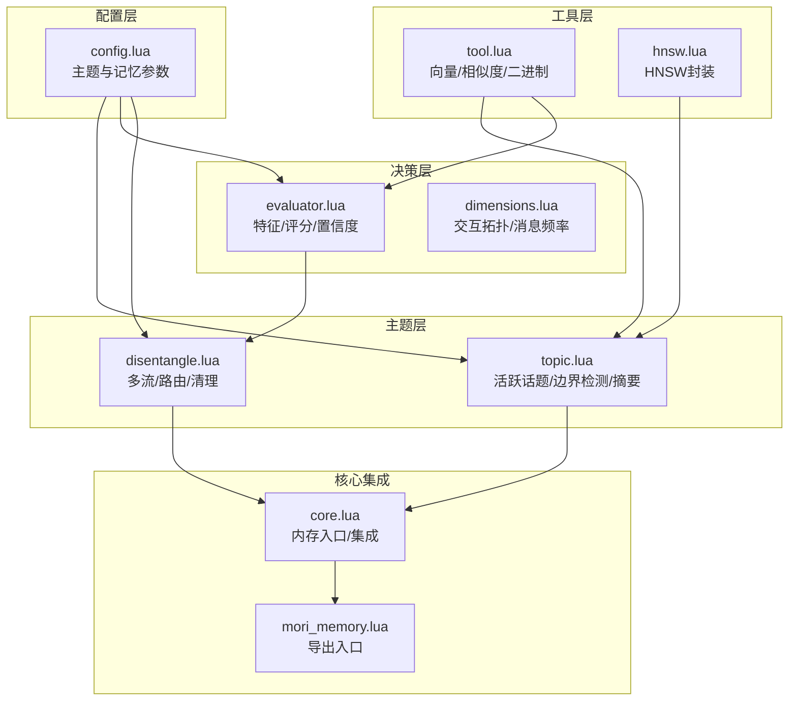
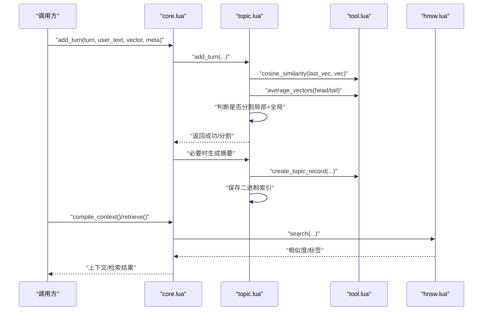
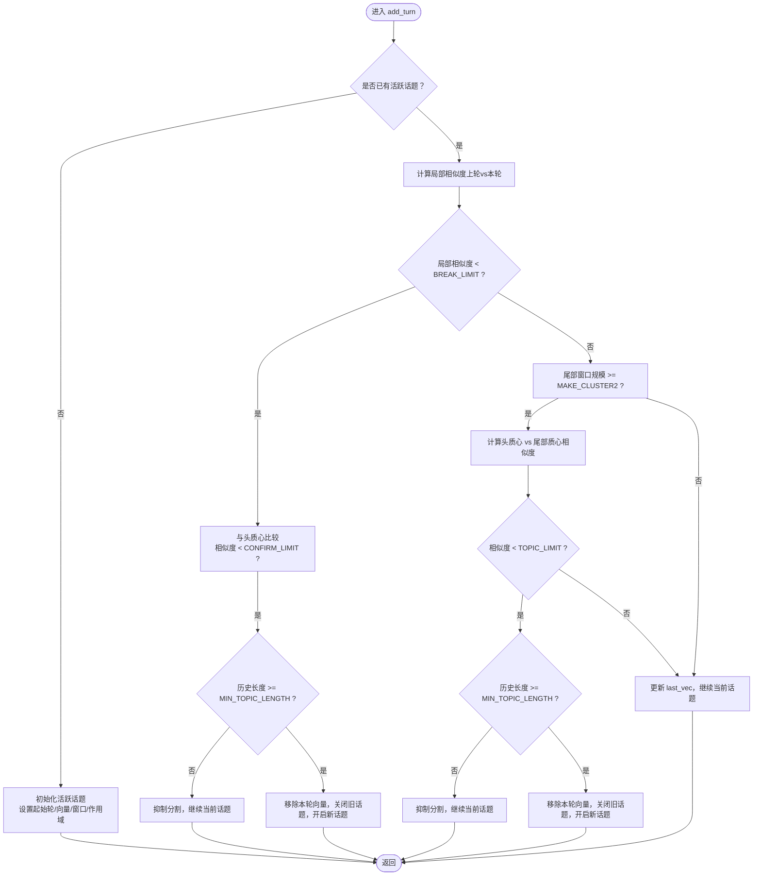
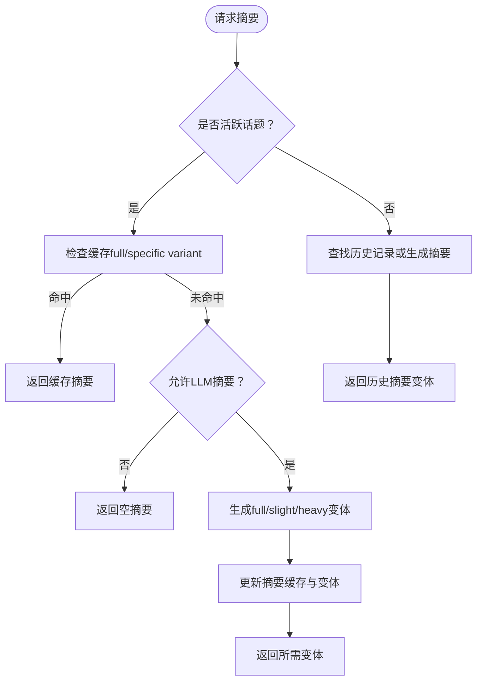
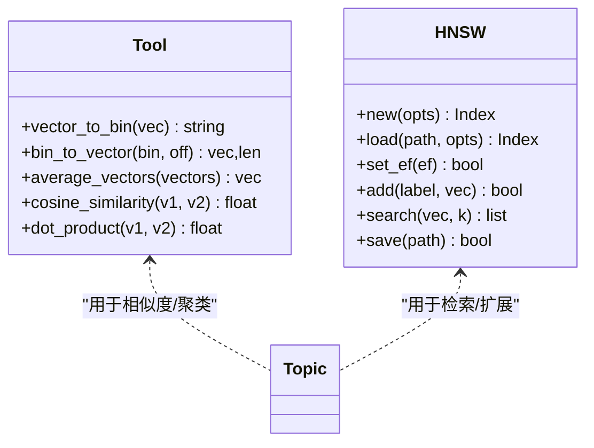
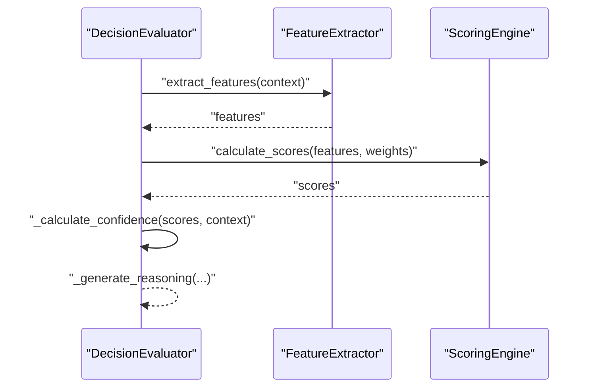
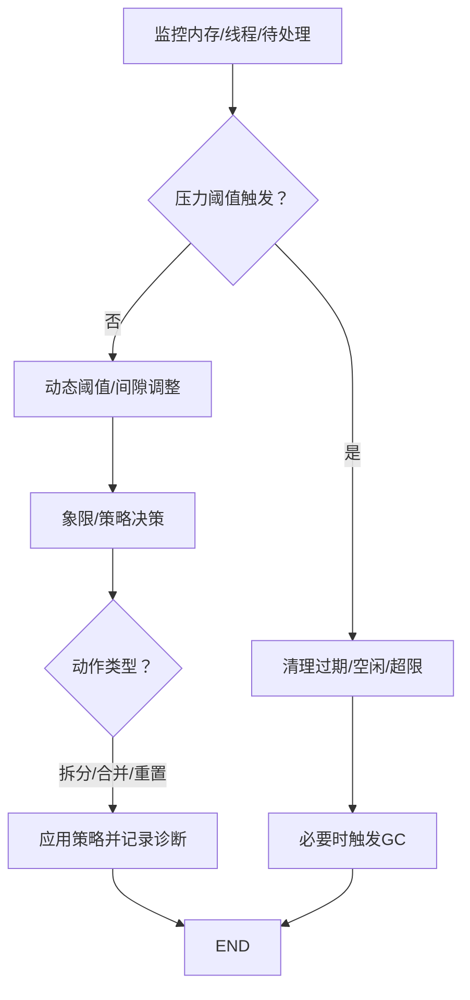
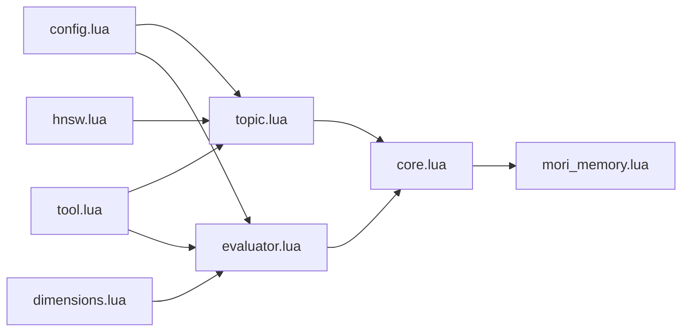

# 主题记忆（Topic Memory）

<cite>
**本文引用的文件**
- [mori_memory.lua](file://mori_memory/mori_memory.lua)
- [core.lua](file://mori_memory/mori_memory/core.lua)
- [config.lua](file://mori_memory/module/config.lua)
- [topic.lua](file://mori_memory/module/memory/topic.lua)
- [tool.lua](file://mori_memory/module/tool.lua)
- [hnsw.lua](file://mori_memory/module/hnsw.lua)
- [disentangle.lua](file://mori_memory/module/memory/disentangle.lua)
- [evaluator.lua](file://mori_memory/module/decision/evaluator.lua)
- [dimensions.lua](file://mori_memory/module/decision/dimensions.lua)
</cite>

## 目录
1. [简介](#简介)
2. [项目结构](#项目结构)
3. [核心组件](#核心组件)
4. [架构总览](#架构总览)
5. [详细组件分析](#详细组件分析)
6. [依赖关系分析](#依赖关系分析)
7. [性能考量](#性能考量)
8. [故障排查指南](#故障排查指南)
9. [结论](#结论)
10. [附录](#附录)

## 简介
本文件系统化阐述主题记忆（Topic Memory）的设计理念与实现细节，重点覆盖以下方面：
- 基于论文的话语对相似度建模：通过“上一轮向量与当前轮向量”的余弦相似度捕捉语义连续性，结合头质心与尾部滑动窗口的双轨校验，实现稳健的话题边界检测。
- 头质心与尾部滑动窗口机制：头质心用于稳定话题起点，尾部窗口用于检测长期漂移，二者共同构成“局部断裂 + 全局漂移”的双重分割策略。
- 话题断裂检测算法：以 BREAK_LIMIT 与 CONFIRM_LIMIT 为核心阈值，配合最小话题长度约束，避免误分割。
- 主题记忆配置参数：MAKE_CLUSTER1、MAKE_CLUSTER2、BREAK_LIMIT、CONFIRM_LIMIT 等参数对分割行为与聚类质量的影响。
- 活跃话题状态管理：活跃话题的向量缓冲、头尾状态、摘要缓存与持久化。
- 向量聚类与检索：基于余弦相似度的向量操作与 HNSW 索引接口，支撑主题检索与扩展。
- 分级摘要生成：支持 full、slight、heavy、none 四档摘要，兼顾召回与效率。
- 决策评估与路由：结合交互拓扑、消息频率等维度，驱动话题分配与合并策略。

## 项目结构
主题记忆位于 mori_memory 子模块中，围绕“配置 → 工具 → 主题 → 决策 → 检索/持久化”的层次组织：
- 配置层：集中定义主题与记忆策略参数，如 make_cluster1/2、break_limit、confirm_limit、摘要权重等。
- 工具层：提供向量运算（余弦相似度、平均向量）、二进制编解码、嵌入调用等通用能力。
- 主题层：实现活跃话题状态、话题边界检测、摘要生成与持久化。
- 决策层：提取特征、评分与置信度，输出象限与推理说明。
- 检索层：HNSW 接口封装，支持向量空间检索与相似度换算。

**图表来源**
- [config.lua:147-166](file://mori_memory/module/config.lua#L147-L166)
- [topic.lua:11-26](file://mori_memory/module/memory/topic.lua#L11-L26)
- [tool.lua:553-725](file://mori_memory/module/tool.lua#L553-L725)
- [hnsw.lua:15-52](file://mori_memory/module/hnsw.lua#L15-L52)
- [evaluator.lua:251-308](file://mori_memory/module/decision/evaluator.lua#L251-L308)
- [dimensions.lua:89-119](file://mori_memory/module/decision/dimensions.lua#L89-L119)
- [core.lua:1-20](file://mori_memory/mori_memory/core.lua#L1-L20)
- [mori_memory.lua:1-3](file://mori_memory/mori_memory.lua#L1-L3)

**章节来源**
- [config.lua:147-166](file://mori_memory/module/config.lua#L147-L166)
- [topic.lua:11-26](file://mori_memory/module/memory/topic.lua#L11-L26)
- [tool.lua:553-725](file://mori_memory/module/tool.lua#L553-L725)
- [hnsw.lua:15-52](file://mori_memory/module/hnsw.lua#L15-L52)
- [evaluator.lua:251-308](file://mori_memory/module/decision/evaluator.lua#L251-L308)
- [dimensions.lua:89-119](file://mori_memory/module/decision/dimensions.lua#L89-L119)
- [core.lua:1-20](file://mori_memory/mori_memory/core.lua#L1-L20)
- [mori_memory.lua:1-3](file://mori_memory/mori_memory.lua#L1-L3)

## 核心组件
- 主题配置与参数
  - 主题参数集中在 config.lua 的 topic 段落，关键参数包括：
    - make_cluster1：构建头质心所需的最小轮次数。
    - make_cluster2：尾部滑动窗口大小，用于长期漂移检测。
    - break_limit：话语对断裂阈值（局部相似度低触发）。
    - confirm_limit：全局确认阈值（与头质心对比，避免误判）。
    - min_topic_length：最小话题长度，防止短片段被分割。
    - 摘要相关：摘要最大 token 数、摘要变体权重、压缩比例等。
- 主题状态与持久化
  - 活跃话题包含：起始轮次、头质心、向量缓冲、尾部滑动窗口、最近向量、作用域键、摘要缓存与变体。
  - 话题记录包含：起止轮次、摘要、整体质心、摘要变体。
  - 二进制格式支持头/尾/最后向量与主题记录，便于重启恢复。
- 向量工具与相似度
  - 提供余弦相似度、向量平均、向量二进制编解码等能力，并支持 AVX2 加速。
- 决策评估与象限
  - 特征提取器：语义相似度、用户连续性、回复线索、提及检测、消息长度/复杂度、时间邻近性、流稳定性。
  - 评分引擎：语义通道、对等边通道、中性评分；结合象限权重与一致性/稳定性计算置信度。
- HNSW 检索
  - 封装 HNSW 索引创建/加载/搜索/保存，支持余弦空间与距离/相似度换算。

**章节来源**
- [config.lua:147-166](file://mori_memory/module/config.lua#L147-L166)
- [topic.lua:48-61](file://mori_memory/module/memory/topic.lua#L48-L61)
- [topic.lua:303-371](file://mori_memory/module/memory/topic.lua#L303-L371)
- [tool.lua:553-725](file://mori_memory/module/tool.lua#L553-L725)
- [evaluator.lua:28-170](file://mori_memory/module/decision/evaluator.lua#L28-L170)
- [hnsw.lua:15-52](file://mori_memory/module/hnsw.lua#L15-L52)

## 架构总览
主题记忆的运行流程自上而下分为“输入处理 → 主题边界检测 → 摘要生成 → 决策路由 → 持久化/检索”，其中：
- 输入处理：接收轮次、用户文本与向量，按作用域隔离。
- 边界检测：基于“话语对相似度”与“头质心/尾部窗口”双轨阈值，结合最小长度约束，决定是否分割。
- 摘要生成：支持 full/slight/heavy/none 四档摘要，按需生成并缓存。
- 决策路由：根据交互拓扑、消息频率等维度，评估象限与置信度，指导分配/合并/重置。
- 持久化/检索：话题记录与活跃状态二进制持久化；HNSW 支持主题检索。

**图表来源**
- [core.lua:639-794](file://mori_memory/mori_memory/mori_memory/core.lua#L639-L794)
- [topic.lua:695-794](file://mori_memory/module/memory/topic.lua#L695-L794)
- [tool.lua:553-725](file://mori_memory/module/tool.lua#L553-L725)
- [hnsw.lua:288-307](file://mori_memory/module/hnsw.lua#L288-L307)

## 详细组件分析

### 主题边界检测与话题分割
- 话语对相似度：比较上一轮向量与当前轮向量的余弦相似度，低于 BREAK_LIMIT 即触发“局部断裂”检测。
- 全局确认：若局部断裂发生，进一步比较当前向量与头质心的相似度，低于 CONFIRM_LIMIT 才真正分割。
- 长期漂移兜底：当尾部窗口达到一定规模时，计算头质心与尾部窗口质心的相似度，低于 TOPIC_LIMIT 触发分割。
- 最小长度约束：分割前检查历史长度，不足 MIN_TOPIC_LENGTH 则抑制分割，继续当前话题。
- 分割执行：移除本轮向量，关闭旧话题，开启新话题，确保上下文连续性。

**图表来源**
- [topic.lua:695-794](file://mori_memory/module/memory/topic.lua#L695-L794)
- [config.lua:147-153](file://mori_memory/module/config.lua#L147-L153)

**章节来源**
- [topic.lua:695-794](file://mori_memory/module/memory/topic.lua#L695-L794)
- [config.lua:147-153](file://mori_memory/module/config.lua#L147-L153)

### 活跃话题状态管理与摘要
- 活跃话题状态字段：起始轮、头质心、向量缓冲、尾部窗口、最近向量、作用域键、摘要缓存与变体。
- 摘要生成策略：
  - full：按需生成，限制最大 token 数，缓存至活跃话题。
  - slight/heavy：对 full 进行压缩，满足不同召回/长度需求。
  - none：禁用摘要生成。
- 摘要变体权重与压缩比例由配置控制，支持多档摘要以适配不同场景。

**图表来源**
- [topic.lua:532-620](file://mori_memory/module/memory/topic.lua#L532-L620)
- [config.lua:158-166](file://mori_memory/module/config.lua#L158-L166)

**章节来源**
- [topic.lua:532-620](file://mori_memory/module/memory/topic.lua#L532-L620)
- [config.lua:158-166](file://mori_memory/module/config.lua#L158-L166)

### 向量聚类与相似度计算
- 平均向量：对一组向量求平均，作为质心（头质心/尾部质心）。
- 余弦相似度：支持表/指针/FFI 指针三种输入，优先使用 AVX2 加速。
- 二进制编解码：向量以固定大小的 float 数组编码，便于持久化与网络传输。
- HNSW 接口：封装创建/加载/搜索/保存，支持余弦空间与距离/相似度换算。

**图表来源**
- [tool.lua:502-725](file://mori_memory/module/tool.lua#L502-L725)
- [hnsw.lua:15-52](file://mori_memory/module/hnsw.lua#L15-L52)
- [topic.lua:710-749](file://mori_memory/module/memory/topic.lua#L710-L749)

**章节来源**
- [tool.lua:502-725](file://mori_memory/module/tool.lua#L502-L725)
- [hnsw.lua:15-52](file://mori_memory/module/hnsw.lua#L15-L52)
- [topic.lua:710-749](file://mori_memory/module/memory/topic.lua#L710-L749)

### 决策评估与象限
- 特征提取：语义相似度、用户连续性、回复线索、提及检测、消息长度/复杂度、时间邻近性、流稳定性。
- 评分通道：语义通道（侧重语义匹配）、对等边通道（侧重社交信号），中性评分为两者的加权组合。
- 置信度：基于评分一致性与流稳定性综合计算，输出推理说明（象限解释、关键特征、评分解释）。

**图表来源**
- [evaluator.lua:251-308](file://mori_memory/module/decision/evaluator.lua#L251-L308)
- [evaluator.lua:28-170](file://mori_memory/module/decision/evaluator.lua#L28-L170)

**章节来源**
- [evaluator.lua:251-308](file://mori_memory/module/decision/evaluator.lua#L251-L308)
- [evaluator.lua:28-170](file://mori_memory/module/decision/evaluator.lua#L28-L170)

### 多流/路由与清理
- 多流/路由：基于交互拓扑与人口压力，动态调整分配阈值与间隙，支持“保留/挂起/合并/重置”等策略。
- TTL/GC：定期清理过期待处理消息、空闲线程，按内存压力触发垃圾回收，维持系统稳定性。
- 控制面：控制器表面（attach_conservatism、peer_signal_trust、hub_fallback_trust、write_conservatism、readout_locality）随人口压力与拓扑变化插值调整。

**图表来源**
- [disentangle.lua:127-191](file://mori_memory/module/memory/disentangle.lua#L127-L191)
- [disentangle.lua:198-269](file://mori_memory/module/memory/disentangle.lua#L198-L269)
- [disentangle.lua:279-329](file://mori_memory/module/memory/disentangle.lua#L279-L329)

**章节来源**
- [disentangle.lua:127-191](file://mori_memory/module/memory/disentangle.lua#L127-L191)
- [disentangle.lua:198-269](file://mori_memory/module/memory/disentangle.lua#L198-L269)
- [disentangle.lua:279-329](file://mori_memory/module/memory/disentangle.lua#L279-L329)

## 依赖关系分析
- 主题层依赖工具层的相似度与聚类能力，依赖配置层的主题参数。
- 决策层依赖工具层的相似度与特征提取，依赖维度层的交互拓扑/消息频率。
- 检索层依赖 HNSW 封装，服务于主题检索与扩展。
- 核心层整合主题、决策、检索与持久化，对外提供统一接口。

**图表来源**
- [config.lua:147-166](file://mori_memory/module/config.lua#L147-L166)
- [topic.lua:11-26](file://mori_memory/module/memory/topic.lua#L11-L26)
- [tool.lua:553-725](file://mori_memory/module/tool.lua#L553-L725)
- [hnsw.lua:15-52](file://mori_memory/module/hnsw.lua#L15-L52)
- [evaluator.lua:251-308](file://mori_memory/module/decision/evaluator.lua#L251-L308)
- [dimensions.lua:89-119](file://mori_memory/module/decision/dimensions.lua#L89-L119)
- [core.lua:1-20](file://mori_memory/mori_memory/core.lua#L1-L20)
- [mori_memory.lua:1-3](file://mori_memory/mori_memory.lua#L1-L3)

**章节来源**
- [config.lua:147-166](file://mori_memory/module/config.lua#L147-L166)
- [topic.lua:11-26](file://mori_memory/module/memory/topic.lua#L11-L26)
- [tool.lua:553-725](file://mori_memory/module/tool.lua#L553-L725)
- [hnsw.lua:15-52](file://mori_memory/module/hnsw.lua#L15-L52)
- [evaluator.lua:251-308](file://mori_memory/module/decision/evaluator.lua#L251-L308)
- [dimensions.lua:89-119](file://mori_memory/module/decision/dimensions.lua#L89-L119)
- [core.lua:1-20](file://mori_memory/mori_memory/core.lua#L1-L20)
- [mori_memory.lua:1-3](file://mori_memory/mori_memory.lua#L1-L3)

## 性能考量
- 向量相似度加速：优先使用 AVX2 指令集的点积与余弦相似度实现，显著降低 CPU 开销。
- HNSW 检索：通过设置 ef_search、m、ef_construction 等参数平衡召回与速度；余弦空间下距离与相似度可换算。
- 活跃话题缓存：头/尾/最后向量与摘要缓存减少重复计算；最小话题长度避免频繁分割带来的抖动。
- 内存压力控制：TTL 清理与 GC 触发策略在高负载下维持系统稳定；全局/线程事件上限防止膨胀。

[本节为通用性能讨论，无需特定文件引用]

## 故障排查指南
- 主题边界误分割
  - 检查 BREAK_LIMIT 与 CONFIRM_LIMIT 是否过严/过松；适当提高 make_cluster1/make_cluster2 以提升稳定性。
  - 确认最小话题长度 MIN_TOPIC_LENGTH 设置是否合理。
- 摘要为空或质量差
  - 检查 allow_llm_summary 与摘要最大 token 数；确认 LLM 生成接口可用。
- 相似度异常
  - 核对向量维度一致性与归一化；确认工具层向量验证与二进制编解码正确。
- 内存压力与 GC
  - 观察 TTL 设置与 GC 触发条件；必要时增大内存上限或优化事件容量。

**章节来源**
- [topic.lua:695-794](file://mori_memory/module/memory/topic.lua#L695-L794)
- [tool.lua:160-170](file://mori_memory/module/tool.lua#L160-L170)
- [disentangle.lua:127-191](file://mori_memory/module/memory/disentangle.lua#L127-L191)

## 结论
主题记忆通过“话语对相似度 + 头质心 + 尾部窗口”的三重保障，实现了稳健的话题边界检测与持续的主题追踪。结合分级摘要、向量聚类与 HNSW 检索，系统在实时性与准确性之间取得良好平衡。决策评估与多流路由进一步增强了在复杂交互场景下的鲁棒性与可维护性。

[本节为总结性内容，无需特定文件引用]

## 附录

### 参数对照与影响
- make_cluster1：影响头质心建立时机，数值越大越稳定但启动越慢。
- make_cluster2：影响尾部窗口规模，决定长期漂移检测的敏感度。
- break_limit：局部断裂阈值，越低越容易分割，越高越保守。
- confirm_limit：全局确认阈值，与头质心对比，避免误判。
- min_topic_length：抑制短片段分割，保证话题完整性。
- 摘要变体权重与压缩比例：影响召回与长度的折中。

**章节来源**
- [config.lua:147-166](file://mori_memory/module/config.lua#L147-L166)
- [topic.lua:11-26](file://mori_memory/module/memory/topic.lua#L11-L26)